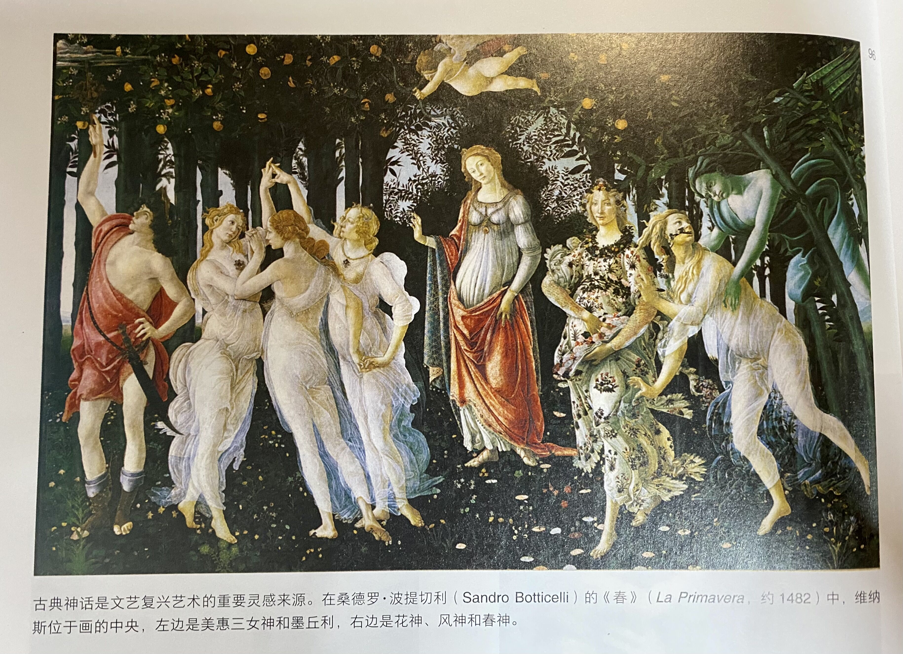
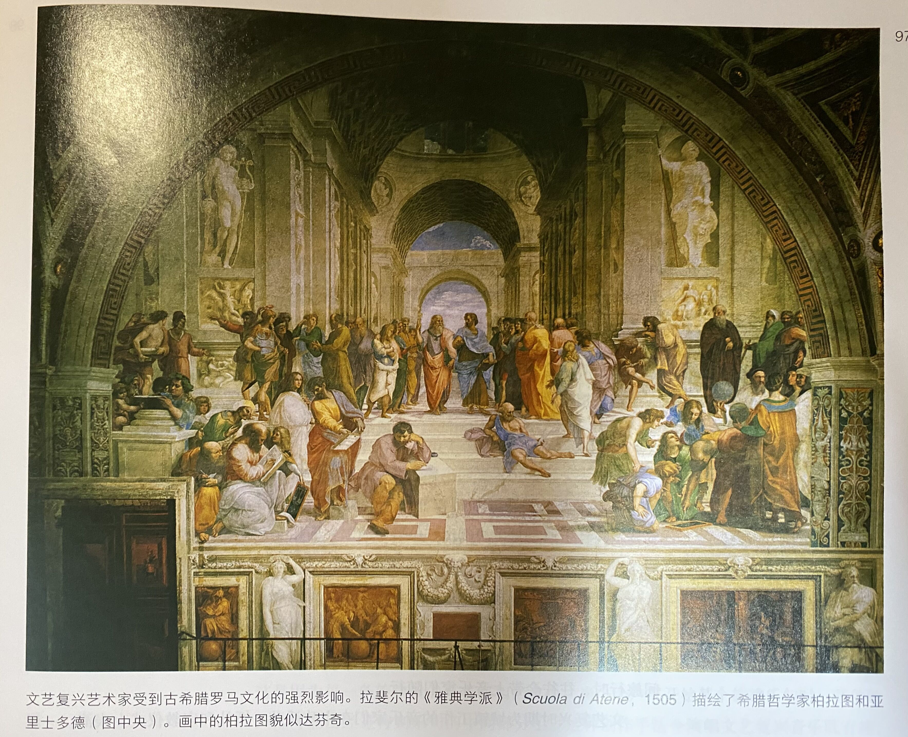
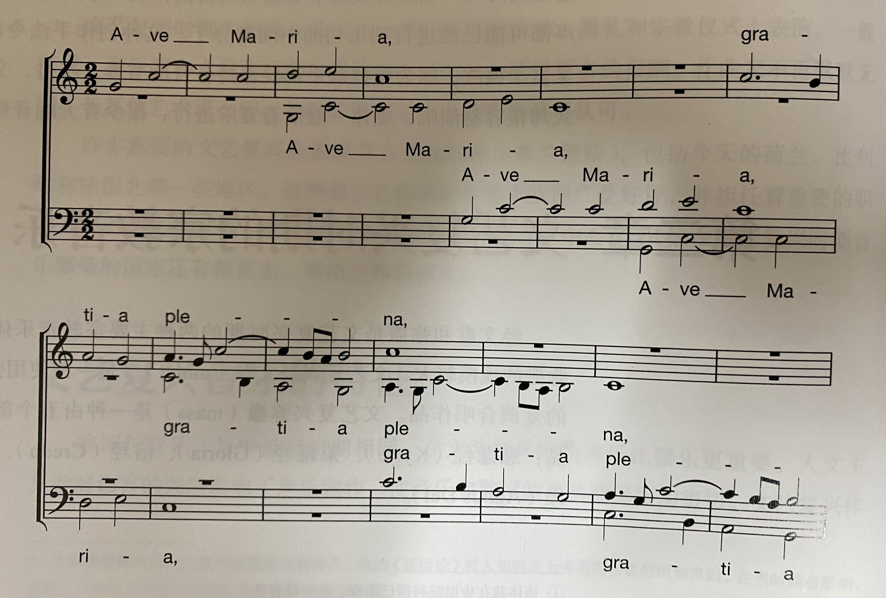
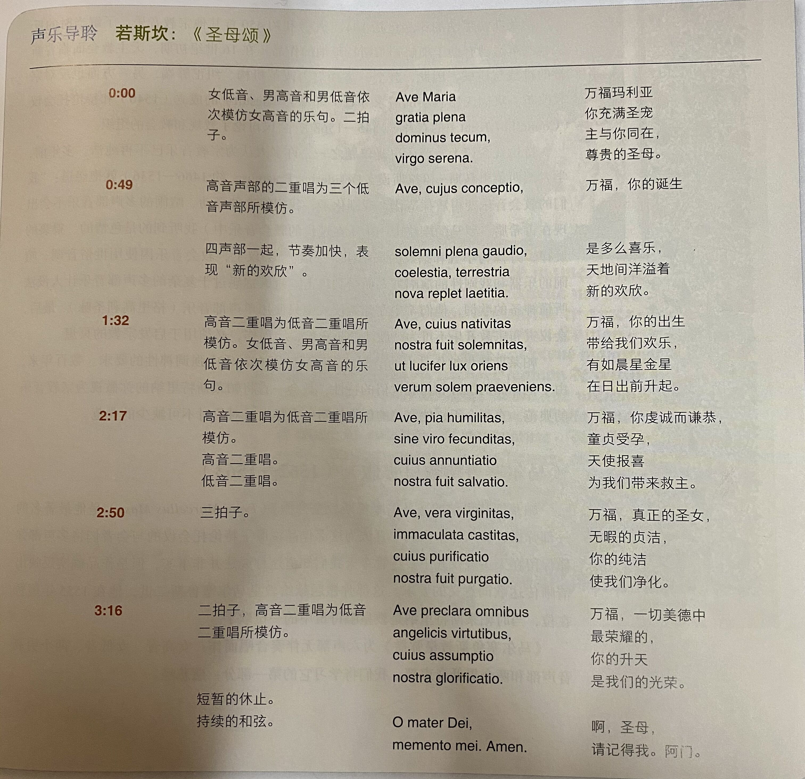
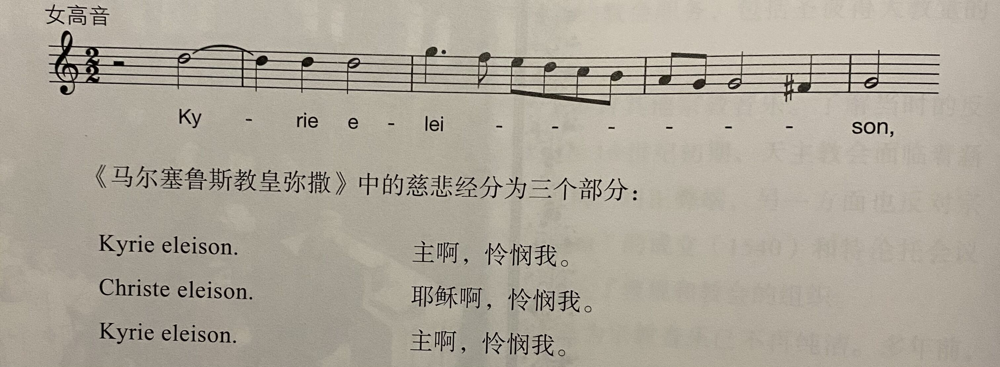

# 文艺复兴
* 15一16世纪被称为欧洲历史上的文艺复兴时期，**文艺复兴**（renaissance）一词来源于当时的人们认为自己的时代是**人类创造力复生**的时代
* 文艺复兴时期最重要的社会思潮是**人文主义**（humanism），它关注人类的生活及其意义；人文主义者们不关心死后的天堂和地狱，虽然他们都是虔诚的基督徒，但对**古希腊罗马文化**更感兴趣，沉醉于古典语言（古希腊语和拉丁语）和古典文学之美

* 人文主义对**文艺复兴艺术**有深远的影响；画家和雕塑家为**古典文学和神话**所吸引，重新开始描绘人类的**裸体**，而中世纪时，人们认为裸体是可耻且应遮蔽的
* 中世纪艺术家更倾向于使用**宗教象征**而非生活化的表现，他们认为图画是一个没有深度的平面，人和物都局限于平面上；拉斐尔和达芬奇等文艺复兴画家更倾向于写实主义并使用了线条透视，一种用以创造出空间和深度感的几何系统

* 文艺复兴时期，在统一的西方基督教世界被**马丁·路德**（Martin Luther）的**宗教改革**打破后，天主教的权威相比中世纪大大下降了；教会**不再垄断教育**，贵族和中上阶级开始认为教育是社会地位的体现，并聘用学者教导子女
* **活字印刷术**的发明加速了知识的传播；1450年之前，书籍必须手抄，因此相当稀少而昂贵，而到了1500年，欧洲已经印刷了多达四万本书，印量达到1,500一2,000万册
# 文艺复兴时期的音乐(1450一1600)
* **音乐史上的文艺复兴时期**是指1450一1600年（也有些学者认为文艺复兴时期应始于1400年）：与其他艺术领城一样，音乐艺术的**范围**在文艺复兴时期大大扩展，**印刷术**同样促进了音乐的传播，作曲家和演奏家的数量也大大增加
* 为了符合文艺复兴时期“**通识者**”的理想标准，每个有教养的人都需要接受**音乐训**练；**莎士比亚**的剧本中有三百多处需要使用音乐，他在剧作中常常赞美音乐
* 和过去一样，音乐家们主要为教会、宫廷和城镇工作；**教会唱诗班**的规模逐渐增大，在中世纪，复调宗教音乐通常每个声部由一位歌手演唱，而在文艺复兴时期则常常使用**规模较大的男声合唱**
* 一个**宫廷**可能雇用了10~60位音乐家，包括**歌手**和**乐手**，在文艺复兴后期，一些意大利宫廷中也有演唱技巧精湛的**女歌手**；宫廷乐长往往为贵族们的娱乐创作**世俗音乐**，为宫中教堂创作**宗教音乐**，当贵族们在城堡之间旅行时，往往会带上音乐家们随行
* 文艺复兴时期为**城镇**工作的音乐家们在市政活动、婚礼和宗教仪式上表演，一般来说，音乐家和之前相比拥有**更高的社会地位**，获得更多的报酬；作曲家不再默默无闻，与其他艺术家一样，他们希望通过自己的作品**获得认可**
* 许多重要的文艺复兴作曲家来自**低地国家**（弗兰德斯），包括今天的荷兰、比利时和法国北部一些地区，这些**弗兰芒作曲家**在整个欧洲广受好评，并担任着重要的职位，特别是在**意大利**（意大利在16世纪成为欧洲音乐中心）；其他在文艺复兴时期音乐繁荣的国家还有德意志、英格兰和西班牙
## 文艺复兴音乐的特征
### 歌词与音乐
* 与中世纪时期相同，在文艺复兴时期**声乐比器乐更要**；人文主文者对语言的兴趣影响了声乐创作，使音乐和歌词的关系变得**更加密切**，而中世纪作曲家相对**不重视**表达歌词的情感
* 文艺复兴作曲家经常使用**绘词法**（word painting），一种用音乐表达特定词句含义的创作手法；虽然文艺复兴音乐表达的情感多种多样，但表达方式通常是中庸、**温和**的，不使用极度对立的力度、音色或节奏
### 音乐织体
* 文艺复兴音乐主要使用**复调织体**；典型的合唱作品有**四至六个声部**，各声部**地位相同**，都承担旋律的演唱
* 声部间的**模仿**十分普遍，不同声部依次重复一段旋律，像**轮唱曲**一样；由一系列**和弦**形成的**主调织体**也有使用，特别是在较为轻松的音乐中（如舞曲）
* 文艺复兴音乐听上去比中世纪音乐饱满，这一时期开始使用**男低音声部**，音乐的音域拓宽到了**四个八度以上**，对低音线条的强调带来了**更丰富的和声**；文艺复兴音乐听上去柔和、放松，因为作曲家们偏爱稳定、协和的和弦，经常使用**三和弦**，不协和和声较少出现
* 文艺复兴合唱音乐不需要乐器伴奏，因此，文艺复兴时期被称为**无伴奏合唱**（acappella）的黄金时期；不过，在某些特殊场合器乐会与声乐同台演出
### 节奏与旋律
* 在文艺复兴时期，音乐的节奏更接近**温和的流动**而非清晰的节拍；
这是因为每一条旋律线的节奏都相当自由，当一个声部开始某个旋律乐句时，其他的声部可能已经进行到乐句的中间部分了
* 这种创作手法令演唱文艺复兴音乐既有趣，又富于挑战，因为每位歌手都要保持**各自的节奏**；不过，文艺复兴时期旋律的音高模式却很容易演唱，旋律一般**沿着音阶进行**，很少有大跳音程出现
## 文艺复兴时期的宗教音乐
* **经文歌**和**弥撒**是文艺复兴时期的两种主要宗教音乐体裁；它们的风格相近，而弥撒的规模较大
* 文艺复兴**经文歌**（motet）是一种使用弥撒经文以外的拉丁文歌词
的复调合唱作品；文艺复兴**弥撒**（mass）是一种由五个部分组成的宗教复调合唱作品：**慈悲经**（Kyrie）、**荣耀经**（Gloria）、**信经**（Credo）、**圣哉经**（Sanctus）和**羔羊经**（Agnus Dei）
### 若斯坎·德普雷与文艺复兴经文歌
* **若斯坎·德普雷**（Josquin Desprez）是莱奥纳多·达·芬奇和克里斯托弗·哥伦布的同时代人，是文艺复兴时期的音乐大师；与其他许多弗兰芒作曲家一样，他的活动范围遍及欧洲各国
* 若斯坎的作品包括弥撒、经文歌和世俗声乐作品，它们对当时的其他作曲家影响深远，并深受听众喜爱
#### 《圣母颂》(Ave Maria.virgo serena,1475)
* 若斯坎的**四声部经文歌**《圣母颂》是一首杰出的文艺复兴合唱作品；作曲家为这段向圣母祈祷的拉丁语经文配上了精致、宁静的音乐
* 作品的开头使用了**模仿复调**，一种在当时广为使用的创作手法；音乐开始，Ave Maria（万福玛利亚）一句的旋律先在女高音声部出现，之后依次由女低音、男高音和男低音声部模仿，接下来两个词gratia plena（你充满圣宠）的旋律不同，但同样由各声部轮流呈示
* 后面的声部总是在前面声部的旋律**进行到一半**时进入。这一叠加效果产生一种**持续流动**的感觉

* 若斯坎巧妙地**变换音乐的织体**，有时是二声部，有时是三声部或四声部；除了各声部相互模仿之外，他也使用**两声部一组的模仿**：两个高音声部的二重唱由两个低音声部模仿

### 帕莱斯特里纳与文艺复兴弥撒
* 在16世纪，意大利作曲家的创作水平已经赶上了若斯坎·德普雷等较早的弗兰芒作曲家；意大利文艺复兴作曲家中最重要的是**乔万尼·皮埃路易吉·达·帕菜斯特里纳**（Giovani Pierluigi da Palestrina），他一生为天主教会创作，他的活动主要以罗马为中心，在那里他担任重要的教会职务，包括圣彼得大教堂的乐长
* 在16世纪初期，天主教会面临着新教的挑战与质疑，因此，教会一方面努力改革机构、纠正弊端，另一方面也反对宗教改革，这导致了**耶稣会**(Jesuit)的成立(1540)和**特伦托会议**(Council of Trent)的召开(1545一1563)，会议讨论了教规和教会的组织
* 特伦托会议上，音乐也是议题之一，许多人认为宗教音乐已**不再纯洁**，过于复杂的多声部音乐让人没法听懂神圣的歌词，他们希望在弥撒仪式中只使用**单声部音乐**（格里高利圣咏）；最后，会议宣布宗教音乐不可为“肤浅的听觉愉悦”而作，必须用于启发**宗教的冥想**
* 帕莱斯特里纳作品中的**节制与宁静**反映了在音乐中强调神性的要求；数百年来，由于他作品的沉静和超脱世俗的特性，教会一直将帕莱斯特里纳的弥撒视为**宗教音乐的典范**
#### 《马尔塞鲁斯教皇弥撒》(1562一1563)
* 帕莱斯特里纳的《**马尔塞鲁斯教皇弥撒**》(Pope Marcellus Mass)是他最著名的一部弥撒，长久以来人们一直认为这部作品说服了特伦托会议的与会者们将多声部弥撒保留在天主教仪式中；尽管今天我们知道这种说法并非事实，但是作品确实反陕出清晰传达歌词意义的要求
* 《马尔塞鲁斯教皇弥撒》为**六声部无伴奏合唱**而作：女高音、女低音、两个男高音声部和两个男低音声部
* 这段**慈悲经**（Kyc）有丰满的复调织体；它的六个声部不断相互模仿，同时优美地结合，音乐比若斯坎的《圣母颂》听上去更**饱满**，原因之一是这里音乐为六声部而非四声部；优雅的旋律线令人想起格里高利圣咏，旋律的流动流畅、平稳，易于歌唱，上行的跳进随即被下行的级进所平衡

* 歌词很短，在不同的旋律间重复以表现**宁静的祈求**；节奏持续流动直到每个部分的结尾，此时各声部共同构成**持续和弦**而结束
