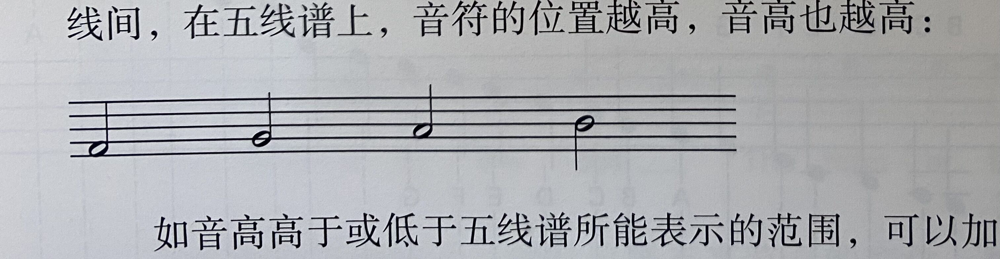
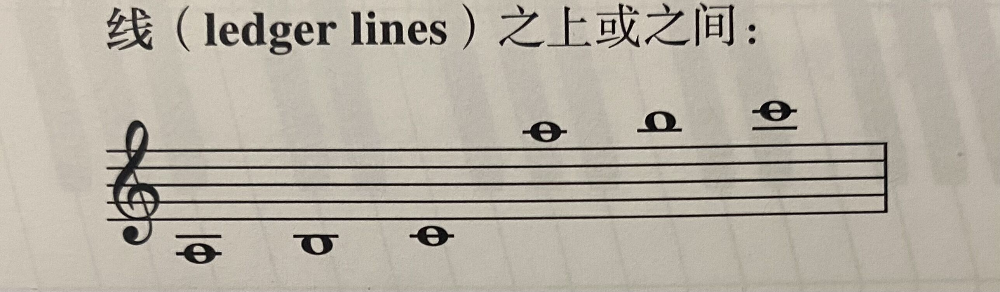
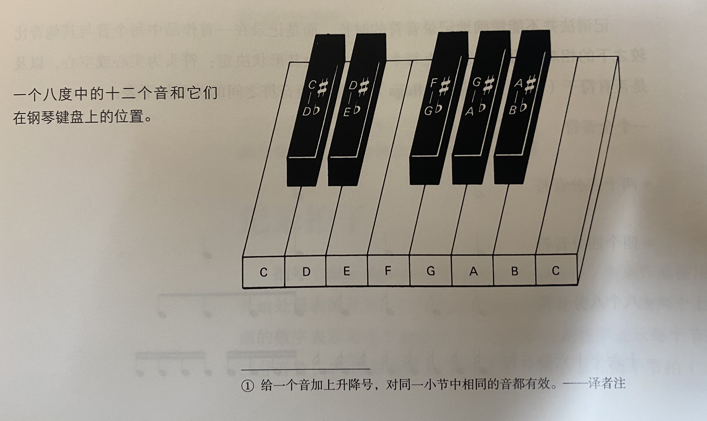
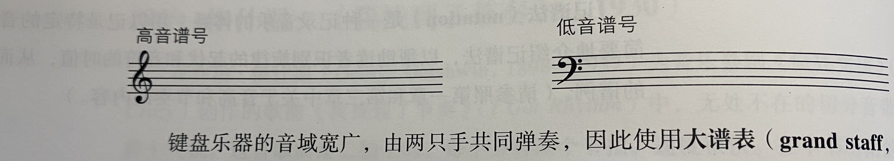
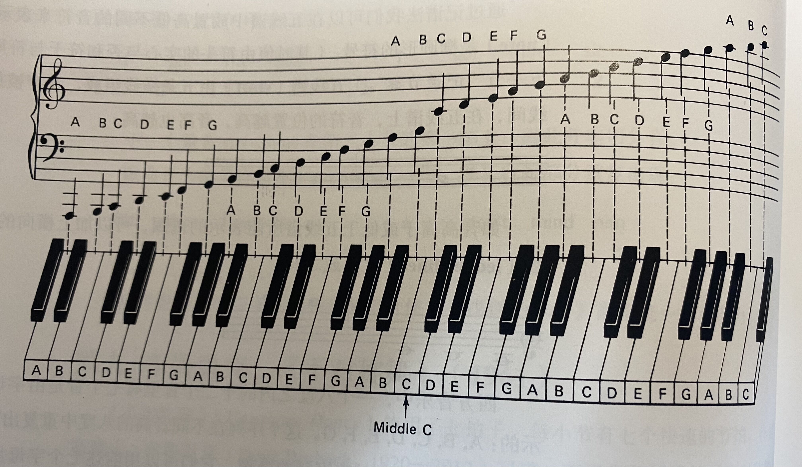
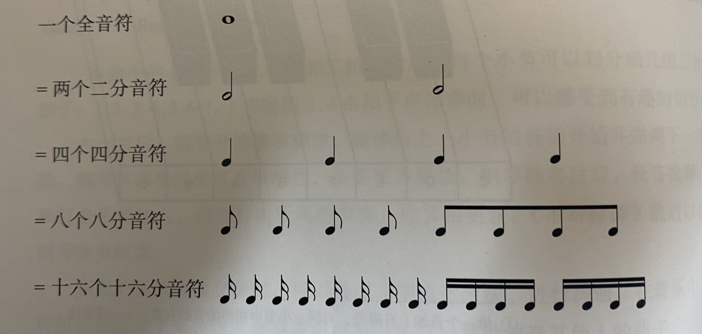
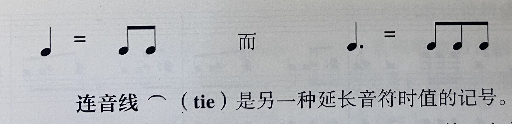
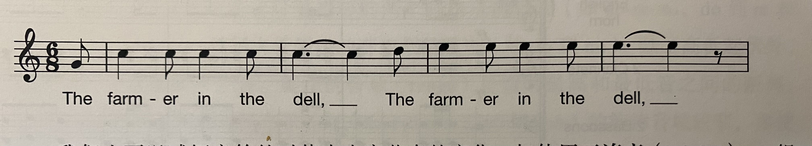
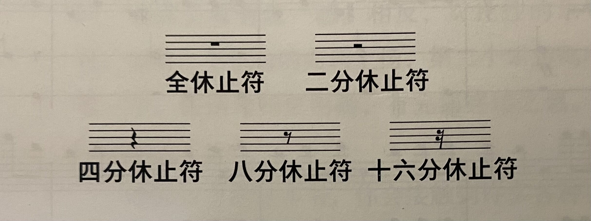
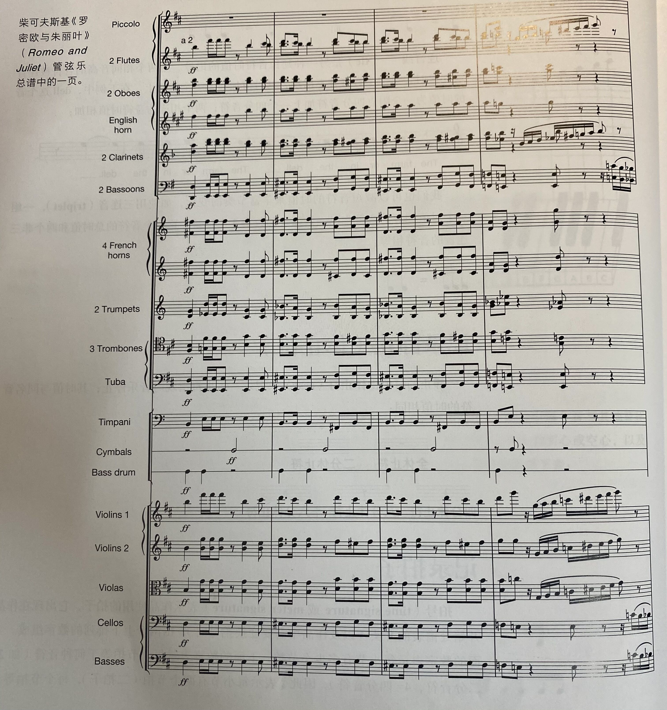

# 记谱
* **记谱法**（notation）是一种记录音乐的体系，用以记录特定的音高和节奏
### 记录音高
* **音符**（note）是椭圆形的符号，其时值由符头的实心有无和符尾的有无来表示
* **五线谱**（staff）由五条横线组成，音符被放置在这五条线上或线间；在五线谱上，音符的位置越高，音高也越高

* 如音高高于或低于五线谱所能表示的范围，可以加上横向的短线，将音符置于**加线**（ledger lines）之上或之间

* 西方音乐中，一个八度内的十二个音里有七个音是由字母表开头的**七个字母**表示的：A,B,C,D,E,F,G；这个序列在不同音高的八度中重复出现，对应着钢琴的七个**白键**
* 其他五个音对应着钢琴的**黑键**，它们可以用前述七个字母加上**升号**（sharp sign）或**降号**（flat sign）表示（因此，C和D中间的音可以用升C与降D来表示）；**还原记号**（natural sign）表示之前的升降号被取消

* **谱号**（clef）位于五线谱的开头，用以表示每条线和线间的音高；最常见的两个谱号为**高音谱号**（treble clef），用以记录较高的音域；以及**低音谱号**（bass clef），用以记录较低的音域

* 键盘乐器的音域宽广，由两只手共同弹奏，因此使用**大谱表**（grand staff，即将高音谱表和低音谱表合并）来记谱；最靠近键盘中央的C音称为中央C

### 记录节奏
* 五线谱上每个音的时长由其形状决定：符头为实心或空心，以及是否有**符干**（stem）和**符尾**（flags）；不同时值音符之间的关系如下表（一个小节）

* 一个全音符的时长等于两个二分音符或四个音符，以此类推；一连串八分音符或十六分音符的符尾常常可以用一条横线连起来，称为**符杠**（beam）
* 可以使用**附点音符**（dotted note）来延长一个音符的时值，并增加节奏的多样性；附点音符的记法是在音符后面加点，令音符的时值延长一半；附点音符后通常跟着一个时值较短的音符，这种长短组合称为**附点节奏**（dotted rhythm），它特别强调节拍，因此经常出现在进行曲中

* **连音线**（tie）是另一种延长音符时值的记号；两个相同音高的音符被连音线连接时，第二个音符并不出现，其时值加在第一个音符上

* 也可以减短音符的时值来丰富节奏的变化，如使用**三连音**（triplet），一组三个时值相等的音符，以一条弧线和数字3来记录；这三个音符的总时值和两个非三连音的音符相等

### 记录静止（休止符）
* 静止的时候由**休止符**（rest）来记录；休止符出现时音乐停止，其时值与同名音符的时值相同

### 记录拍子
* **拍号**（time/meter signature）表示作品使用的拍子，它出现在作品开始处谱表的开头（以及作品中需要变换拍号时），由两个上下排列的数字组成；上面的数字表示每小节有多少个节拍，下面的数字表示每个节拍等于何种音符（如4表示四分音符）
### 总谱
* **总谱**（score）同时记录一同演出的所有乐器或人声声部；一部管弦乐总谱常常有超过十五行谱表
