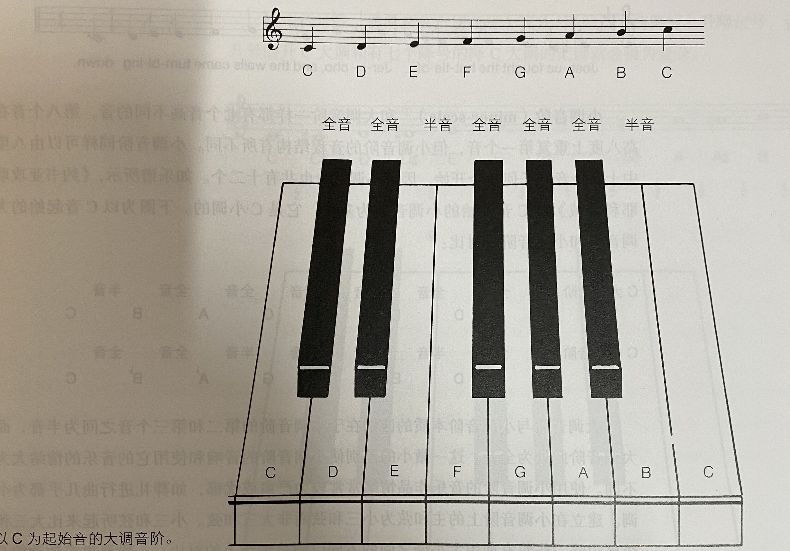

# 调
* 我们熟悉的大部分旋律都围绕着一个**中心音**，其他的音被中心音所吸引；中心音特别稳定，旋律一般都结束在最后一个音上

* 应该能体会到在唱出最后一个音前的**不稳定感**；这个中心音称为旋律的**主音**（keynote/tonic），主音可以是西方音乐八度中**十二个音**的任何一个，例如，一首**C调作品**的主音就是**C**
* 和**调**（key）相关的不仅有中心音，还有**中心音阶**与**和弦**；C调乐曲的**基本音阶**是do-re-mi-fa-sol-la-si-do，C作do或中心音，C调作品的**基本和弦**是以C为根音的**主三和弦**do-mi-sol：基本音阶的第一、第三和第五音组成
* 就像大部分旋律由主音结束一样，音乐作品传统上以富于**终结感**的主三和弦结束；因此，调指的是一首作品的中心音、音阶和和弦的表达，调的另一种说法是**tonality**
## 大调音阶
* **音阶**（scale）由一首乐曲的**基本音**按从低到高或从高到低的顺序**排列**而成，不同时代和不同文化使用过各种不同的音阶；从17世纪后半叶到20世纪，**西方音乐**的两种主要音阶是**大调音阶**和**小调音阶**，在20世纪，它们仍然被广泛使用
* **大调音阶**（major scale）即我们熟悉的do-re-mi-fa-sol-la-si-do；试着唱这个音阶，会发现在七个不同的音后，第八个也是最高的音又是o，在高八度上**重复了第一个音**
* 在大调音阶的各音间，可以找到**两种音程**：半音和全音；**半音**（half step）是西方音乐传统中**最小**的音程，**全音**（whole step）的跨度是半音的**两倍**

* 从si到do有很强的**趋向性**，因为这两个音间的音程是较小的**半音**；唱这个音阶并停留在si上，就能感受到这种**推动力**
* 下图为以C音为起始音的**大调音阶**；在钢琴上C大调音阶只使用**白键**，在E和F、B和C之间均为半音，之间并不被黑键隔开

* 大调音阶可以以八度中**十二个音**的任意一个为**起始音**，无论以哪个音开始大调音阶，其音程结构都相同，因此大调音阶共有**十二个**；可以想象大调音阶是一把直尺，上面的八个刻度距离不等（如do-re-mi图所示），无论“直尺”被放在哪里，这种刻度组合都**保持不变**
## 小调音阶
* **小调音阶**（minor scale）和大调音阶一样都有**七个**音高不同的音，第八个音在高八度上**重复**第一个音，但小调音阶的音程结构有所不同；小调音阶同样可以由八度中十二个音的任何一个开始，因此小调音阶也共有**十二个**

* 大调音阶与小调音阶**本质的区别**在于小调音阶的第二和第三个音之间为**半音**，而大调音阶此处为**全音**；这一微小的差别使小调音阶的音响和使用它的音乐的情绪**大为不同**，使用小调音阶的音乐作品情绪常常较为忧郁，如**葬礼进行曲**几乎都为小调
* 建立在小调音阶上的主和弦为**小三和弦**而非大三和弦，小三和弦听起来比大三和弦**更阴暗**；作曲家利用大小调之间的不同以制造情绪上的**对比**，一段严肃或激动的C小调旋律后面可能接着一段更明朗的C大调旋律
## 调号
* 如一首音乐作品以大调音阶为基础，我们说它在**大调**（major key）上，如它以小调音阶为基础，则是在**小调**（minor key）上；例如，一首以D音开始的大调音阶为基础的作品是D大调的，一首以F音开始的小调音阶为基础的作品是F小调的
* 每个大调音阶和小调音阶都有固定数目（从0到7）的**升降号**；作曲家使用**调号**（key signature）以标记作品所使用的调（或称作品的调性，它包括一定数量的升降号，紧跟在乐谱开头的谱号后面，如下图中的D大调

* 使用调号后，作曲家就不用在每个该升/降的音之前都写上**升降记号**，否则有七个升号的**升C大调**和有七个降号的**降C大调**的记谱就会**极为复杂**

## 半音阶
* 八度中的**十二个音**，即钢琴上八度内的所有黑键和白键，共同组成了**半音阶**（chromatic scale）；与大调小调音阶不同，半音阶内部各音之间的距离是**相等的**，每个音之间相隔**半音**

* “chromatic”一词源自希腊语的“chroma”，意即“**色彩**”；这一词源告诉我们半音阶的传统用途：装饰大小调音阶、**增添色彩**
* 半音阶不像大小调音阶一样建立在某个调上，它提供的是**动力与张力**，作曲家往往使用半音阶来表达**强烈的**悲哀、伤痛和失落等情绪；20世纪以后，半音阶脱离了大小调的体系，并被用作某些音乐作品的**基础**
## 转调：调的变换
* 大部分我们熟知的短小旋律都自始至终使用**同一个调**；不过，在较长的音乐作品中，作曲家会使用不止一个调，以体现**变化和对比**，例如，一首作品可能以C大调开头，之后转到G大调上；在一首作品中，从一个调变换到另一个调称为**转调**（modulation）
* 转调就像暂时**转移音乐的重心**，如某首乐曲以**C大调**开头，此时C为中心音，C大调音阶与和弦是音乐的基础，转调到**G大调**后，G暂时成为中心音，G大调音阶与和弦变成音乐的重心；转调有时不明显而难以察觉，但在潜意识中，它们能产生效果，增加音乐的趣味
## 主调
* 无论一首作品的转调多么频繁，通常它只使用一个主要的调，称为**主调**（tonic/home key）；主调是一首作品的**中心调性**，音乐围绕主调组织
* 传统上，一首作品多以主调**开始**，也总是以主调**结束**；例如，一首C大调作品会以C大调开始，然后转到一些其他调上（如G大调和A小调），最后回到主调C大调，其他调**从属于**主调，在音乐中，转调**产生张力**，而回到主调则**消解张力**
