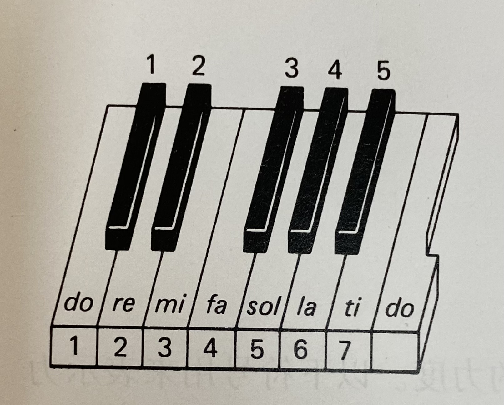
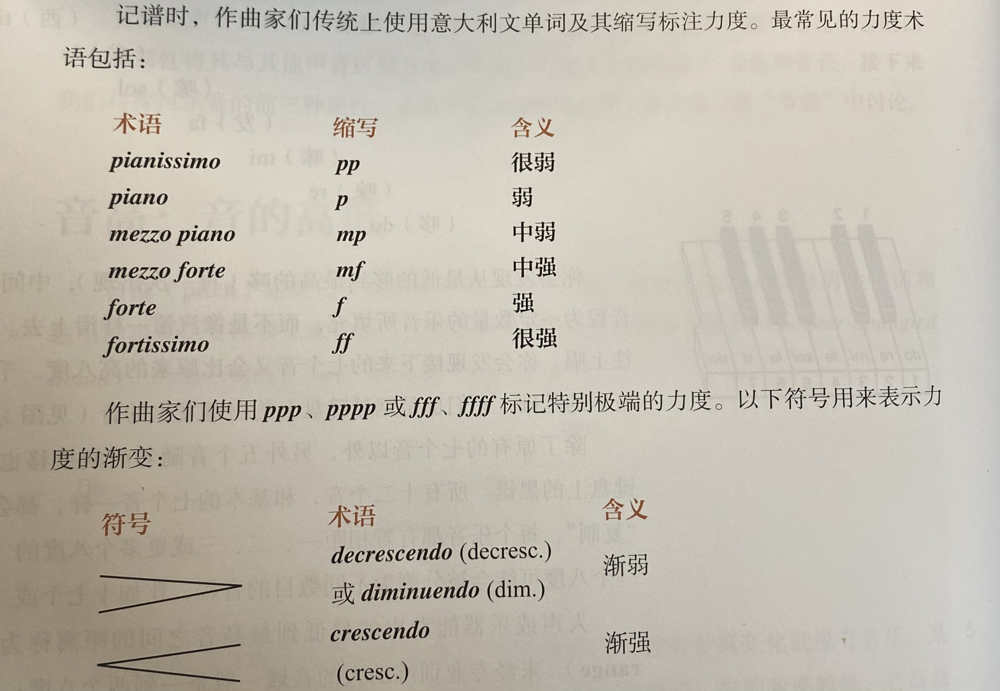

# 音：音高、力度和音色
* 我们可以集中注意力倾听某些声音，而忽略掉不感兴趣的其他声音
* 约翰•凯奇 《4分33秒》：观众听见外界和自己的噪音
* **音**（sound）：因物体的**振动**而产生，振动通过**媒介**传到耳中，并引起**鼓膜**振动，信号以**神经冲动**（impulse）的方式传到脑中，大脑进行进一步过滤、整理和解释
### 音高：音的高低
* **音高**（pitch）：我们听到的某个音的**相对高度**；大部分男性说话和歌唱的声音比女性和儿童要**低**
  * **振动频率**越高，音高就越高，而振动频率越低音高就越低；振动频率的**测量方式**是周期数/秒；钢琴上**最高的音**是4186次/秒，**最低的音**大约是27次/秒
  * 一般来说，**发音体**越小，振动频率越高，音高也越高；如果其他因素相同，拨动一根较短的弦发出的音会比较长的弦高
* **乐音**（tone）：有固定音高的音，振动具有规律性，并以相等的时间间隔传入耳中
  * 而**噪音**没有固定的频率，由不规则的振动所产生
* **音程**（interval）：任意两个乐音间的音高差
  * 两个乐音被**八度**（octave）音程分开时，它们听上去很相似；相差八度的两个音，后者的频率是前者的**两倍**
  * **八度音阶**：哆（do）、睐（re）、咪（mi）、发（fa）、嗦（sol）、啦（la）、西（ti）、哆（do）
  * 八度音阶即钢琴上**白键**发出的音；另有五个音构成钢琴上的**黑键**，所有十二个音都会在更高或更低的八度上被“复制”

* **音域**（pitch range）：人声或乐器能发出的最低到最高音之间的距离
  * 未经专业训练的人的音域一般是一到两个八度，钢琴的音域超过七个八度；当男女性一起唱相同的旋律时，常常相隔八度演唱
* **无固定音高的音**（如大鼓的声音）也很重要
### 力度
* **力度**（dynamic）：音乐响亮或轻柔的程度
  * 音的响度与发音物体的**振幅**有关
  * 逐渐增强的力度经常用于制造**兴奋**的效果，特别是在伴随音高升高的情况下；而逐渐减轻的力度会带来**平静**的感觉
* **重音**（accent）：表演者可以，使一个音的力度强于前后的音来**强调**它

* 力度指示**并不是绝对的**；与管弦乐队的最强音相比，一把小提琴的最强音是微不足道的
### 音色
* **音色**（tone color/timbre）：明亮、阴暗、圆润、饱满等
* 特定的乐器可以增强一段旋律的情感表现：小号辉煌的音色适合于英雄性或令人联想起军队的旋律；长笛柔和的音色适于演奏安静的旋律