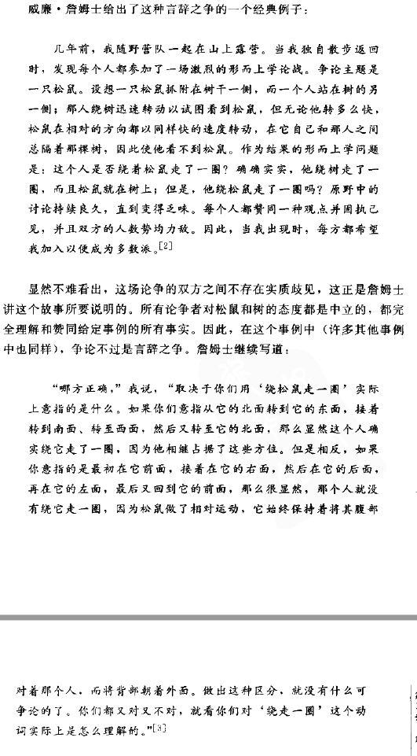
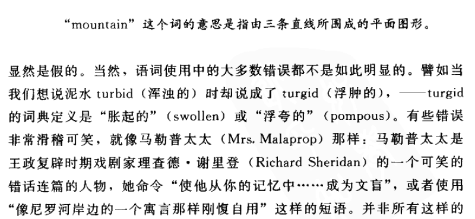
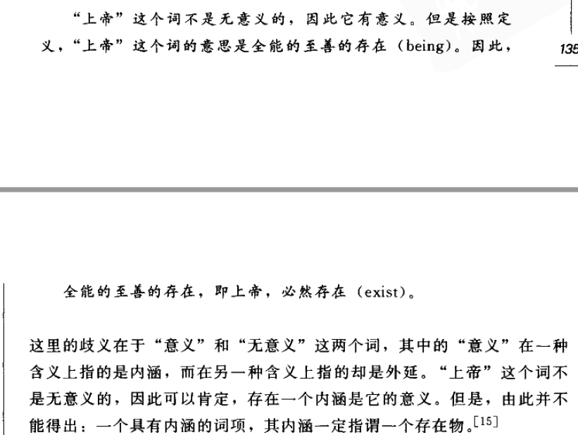
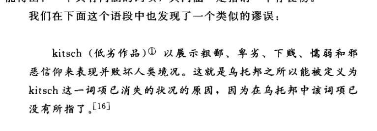
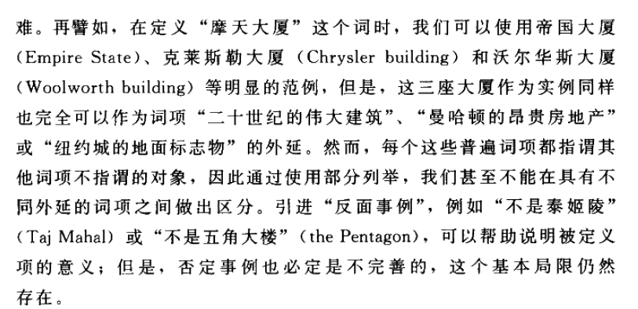
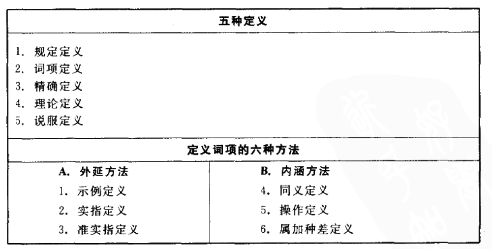
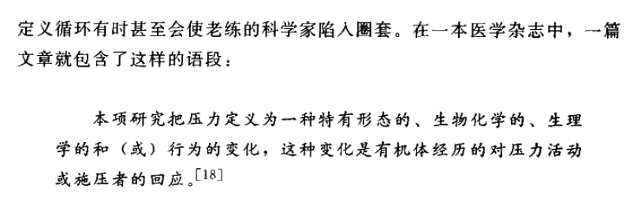
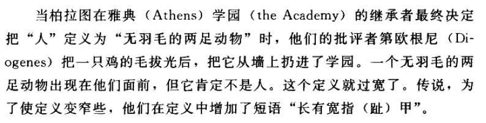
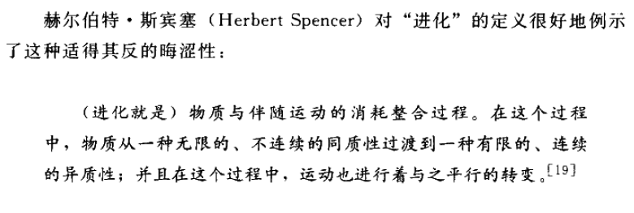

[TOC]
# 定义
## 论争、言辞之争与定义
### 实质论争 (Substantive Disputes)
- **实质论争**中，双方在**信念或态度**上存在**明确且明显的对立**
- 例如，对某一事件的**反应不同**或对某一事实的**看法不同**都可能导致实质论争
- 这种论争不能仅通过**定义或语言调整**来解决，因为存在的是**关于事实的或态度的真正差异**

### 言辞之争 (Verbal Disputes)
- **言辞之争**是由于**语言的误解或误用**导致的看似存在的对立，实际上双方**没有真正的分歧**
- 例如，**关键词汇的歧义**隐藏了双方实际上并无实质对立的事实
- 通过**明确化关键词汇的不同含义**，这类论争可以轻易解决

### 表面上是言辞的但实际上是实质的论争
- 表面上看似仅仅是由于**语言使用不当**导致的论争，但实际上隐藏着**深层的实质对立**，可能在信念或态度上
- 即使言词的歧义得到了解决，双方仍然存在**实质歧见**
- 这种论争可能涉及**对关键词语使用标准的不同理解或接受**

### 辨识和理解论争的流程
- 确认论争存在后，首先询问**是否出现歧义**，若无，则为实质论争
- 若存在歧义，进一步探询**清除歧义是否能消除对立**，若能，则为言辞之争；若不能，则为表面上是言辞的但实质的论争

## 定义的类型和论争的解决
### 规定定义 (Stipulative Definitions)
- 规定定义是**随意指派意义给新引进的符号**，不受既有意义的约束
- **应用领域**包括科学术语的简化、消除情感色彩、增添研究的兴趣等
- 规定定义本身**既不真也不假**，因为它们是**随意的意义指派**，具有**指令性**而非信息性

#### 应用示例
1. **科学术语简化**：如使用“A2=B”代替长串数学表达，便于理解和记忆
2. **情感色彩消除**：如使用“g因子”代替“智力”，减少情感干扰，增强客观分析
3. **研究兴趣增添**：如“黑洞”和“夸克”等术语，为科学概念提供醒目的名称，激发公众兴趣

#### 定义的重要性
- 规定定义可以通过**清晰和降低语言的情感作用**，帮助**避免无结果的言语冲突**
- 良好的规定定义依据其**清晰度、简洁性和便利性**进行评估，而非真假

#### 评估标准
1. **清晰度**：定义应**清晰表述**，避免模糊和复杂性
2. **简洁性**：定义应**尽可能简洁**，便于理解和应用
3. **便利性**：定义应**便于使用**，提高交流效率和理解深度

### 词典定义 (Lexical Definitions)
#### 特征与目的
- 词典定义旨在报告一个**已经存在**且被**广泛接受**的词汇的意义
- 不同于规定定义，词典定义可以被评价为**真或假**，基于其准确性与当前语言用法的**一致性**

#### 词典定义的真假
- 一个词典定义的**真实性**取决于它是否正确反映了**该词在语言中的实际使用**
- 例如，将"mountain"定义为"高出周围地区达到相当高度的大量的泥土和岩石"是真的，因为这符合该词的**广泛接受用法**

#### 用法的变化与评估
- 词汇的用法可能会**随时间发展而变化**，因此词典定义需要定期更新以反映这些变化
- 一部好的词典会区分**词项的不同用法**，如标注"陈旧的"或"口头的"，以指导正确的使用

#### 错误与混淆的示例
- 错误使用词汇或混淆词汇意义可能导致**误解**，如将"turgid"（浮肿的）误用为"turbid"（浑浊的）
- 著名错误用法的人物有**马勒普太夫人**（Mrs. Malaprop），她的名称成为了用词不当的象征（malapropism）

#### 词典定义的局限
- 词典定义反映了**语言的某一时刻状态**，但语言是**不断发展变化**的
- 定义的真实性取决于它们是否与实际语言用法保持一致，而这个用法又是由**社会接受度和统计使用情况**决定的

### 精确定义 (Precising Definitions)
#### 概念与应用
- 精确定义用于**减少模糊性**，与规定定义和词典定义不同，它旨在**提高已有但模糊的词项的准确度**
- 模糊性与歧义不同，模糊性存在于**临界状况的判断**中，而歧义涉及**多个不同意义的混淆**
- 精确定义在**法律、科学等领域**中极为重要，用于**清晰界定**词项的适用范围和含义

#### 重要性与实例
1. **法律领域的应用**：法院和立法机关通过精确定义来明确“扣押”、“严重的精神疾病”等词项的含义，以便准确执行和遵守法律
2. **科学测量标准**：“米”和“马力”的精确定义，提供了科学研究和技术应用中所需的精确度
3. **防止模糊性导致的困难**：模糊的法令可能因解释上的不明确而被推翻，如对“猥亵”或“明显使人讨厌”的内容在互联网上的传播规定

#### 定义的限制与挑战
- 精确定义试图保留**词项的固定用法**，同时**增加准确度**，但这一过程可能需要**超出日常语言的固有模糊性**
- 制定精确定义的过程中，需要平衡**日常用法**和**所需的准确性**，有时借助于规定定义来填补理解上的鸿沟
- 在特定情境下，如法庭解释宪法条款时，精确定义的制定需要考虑到**法律制定者的意图**和**公众的理解**

### 理论定义 (Theoretical Definitions)
#### 定义与目的
- 理论定义旨在提供词项的**理论上充分**或**科学上有用**的精确描述，追求对争议主题的全面理解
- 它不仅仅关注**精确或模糊**，而是试图在理论层面上对关键词语进行**全面的阐释**
- 理论定义的制定是**动态的**，随着理论的发展和知识的进步，理论定义可能会被新的定义所取代

#### 重要性与应用
1. **哲学和科学的争论**：如“正义”和“热”的定义，反映了哲学和科学领域对这些概念理解的深度和变化
2. **生物和医学领域**：如“艾滋病”的定义随理论和研究的进展而变化，显示了理论定义在适应新知识和理解方面的重要性
3. **法律和政策制定**：如“扣押”和“艾滋病”在法律中的定义，表明了理论定义在制定法律和政策中的关键作用

#### 理论定义的变化与挑战
- **理论定义的动态性**：理论定义**随理论的改进和知识的更新而发展**，如“热”的理解从流体理论到分子运动的能量
- **理论争议的本质**：在定义上的争论往往**超越了词汇的使用**，触及到对概念本质的理论理解，如“正义”、“民主”和“权利”的定义
- **实践中的应用**：理论定义在解决实际问题（如疾病分类、治疗标准）中扮演着**关键角色**，其变化直接影响到**政策和实践**

#### 示例
- **艾滋病定义的变化**：由机会性感染的存在到CD-4细胞计数的具体标准，展示了随着理论和研究进展对疾病理解的深化
- **“正义”和“热”的哲学和科学定义**：展示了对这些概念理论理解的演变和深化
- **法律中的精确定义**：如“扣押”的定义，在法律实践中为理解和执行提供了必要的精确性

### 说服定义 (Persuasive Definitions)
#### 定义的构造与目的
- 说服定义被设计来**影响听众或读者的态度和情感**，以解决争论或改变行为
- 通过精心设计的定义，可以在**间接地改变人们的行为**同时，**激发或影响情感**
- 与信息性定义不同，说服定义利用**语言的表达性功能**，以达到影响听众情感的目的

#### 应用与示例
1. **夏威夷州立法院工作人员的回信**：一个关于堕胎问题的回信展示了说服定义的强大影响力，通过给予堕胎不同的情感色彩的定义，来回应询问者的立场
2. **政治辩论中的应用**：在政治辩论中常见，例如把“社会主义”定义为经济领域的民主，或将“资本主义”定义为经济领域里的自由，这些定义中情感语言的操纵意图明显

#### 操纵的微妙性与警惕性
- 操纵可以是**非常微妙**的，**情感色彩**可能被隐秘地加入到**看似准确且客观**的定义中
- 正如我们在区分好坏推理时必须**保持警惕**一样，面对说服定义也需保持警惕，以避免被其所欺骗

#### 重要性
- 说服定义反映了语言不仅是**信息传递的工具**，也是**情感和态度影响的媒介**
- 在理解和分析争论或论证时，**识别说服定义的存在**对保持批判性思维至关重要

## 外延和内涵
### 定义的重要性
- **定义**用于明确一个词项的**意义**（meaning），这对于理解和使用普遍词项至关重要
- **普遍词项**是指可适用于**多个对象**的**类**（class）词项，例如“行星”
- 正确理解普遍词项的意义**不必须知道**其适用的所有对象

### 外延意义
- **外延**（Extension）是一个普遍词项可以正确适用的**所有对象的汇集**
- 例子：“行星”的外延包括水星、金星、地球等，即所有行星的集合
- 一个词项的**外延可以变化**，例如“活着的人”的外延随时间变化，但这通常意味着**其内涵也在变化**

### 内涵意义
- **内涵**（Intension）指的是决定对象是否属于一个词项**外延的共有属性集**
- 例子：“摩天大厦”的内涵包括所有超过一定高度的建筑物的共同性质
- 知道一个词项的内涵可以使我们**正确使用它**，而**无需知道其外延**

### 内涵与外延的关系
- **内涵决定外延**，但**外延不决定内涵**
- 例子：“等边三角形”与“等角三角形”的内涵不同，但外延相同，说明不同的内涵可以决定相同的外延
- 添加到词项内涵的**性质**会**增加内涵**，但通常会**减少外延**

### 内涵增加与外延变化的关系
- 当词项按内涵增加的顺序排列时，其外延呈**非递增的顺序**
- 例子：“活着的人”、“活着的有脊骨的人”等序列，**内涵增加而外延保持不变**
- 外延与内涵的变化**呈反向关系**，但存在例外，如**内涵增加而外延不减少**的情况

### 内涵、外延与逻辑学
- 逻辑学家利用内涵与外延的概念来**揭露意义歧义的谬误**
- 例子：“上帝”的存在证明**混淆了内涵与外延的概念**，错误地**将内涵的存在等同于外延的存在**

- 认识到某些词项可能有**内涵或意义**但无**外延或所指**（referent），如“独角兽”，是逻辑学和哲学分析中的重要概念

### 定义的构建与用途
- 定义可通过外延或内涵来构建，不同方法有其**优缺点**
- **词典定义**和**规定定义**帮助消除或避免歧义
- **精确定义**减少模糊性，使沟通更为准确

## 外延定义
### 外延定义的概念和局限性
- 外延定义指的是**被定义的普遍词项所适用对象的集合**
- 具有**不同内涵**（intension）的两个词项可以**具有相同的外延**，例如“等边三角形”和“等角三角形”
- 大多数普遍词项的外延是**无法完全列举出来**的，例如“数”或“恒星”

### 部分列举的问题
- 通常只能提供所指谓对象的**部分列举**，这**不能帮助**我们在具有不同外延的词项之间**做出区分**
- 即使**多个实例**被提供，如“摩天大厦”的例子，它们也可能**适用于其他不同的普遍词项**
- 引入**反面事例**可以有助于解释被定义项的意义，但这种方法同样**存在基本局限**

### 子类列举定义
- 通过**列举子类**来定义有时可以实现**完全的外延列举**，例如通过列举脊椎动物的所有子类来定义“脊椎动物”
- 这种方法虽然**在心理上有用**，但**逻辑上仍然不充分**

### 实指定义和其局限
- **实指定义**（ostensive definition）或**示范定义**通过**指向对象**来定义，而非通过命名或描述
- 实指定义具有**地理和歧义局限**，例如不能在乡村定义“摩天大厦”，指向物体也可能包含**多重意义**
- **准实指定义**尝试通过添加**描述性短语**来解决歧义问题，但这假设了**对附加短语的事先理解**

### 外延定义的不适用性
- 有些词项如“独角兽”完全**不指谓任何事物**，因此**不能从外延上定义**
- 这类词项展示了**外延定义的局限性**，同时显示出“意义”更适用于内涵而非外延
- 即使一个词项的**外延是空的**，这**并不意味着它无意义**，例如我们可以理解并认为“不存在独角兽”是一个**真实的陈述**

### 对定义的根本看法
- 外延定义显示出**内涵对定义来说是真正的关键**，因为它关注于词项指谓对象的共有属性而非单纯的对象集合

## 内涵定义
### 内涵定义的基本概念
- **内涵定义**指的是词项指谓的所有对象**共有**且仅为这些对象**特有**的属性构成
- 例如，“椅子”的内涵可能包括“具有靠背的单个座位”
- 内涵定义的目的是**明确一个词项的公共意义**，而不是**私人解释**

### 内涵的三种不同含义
- **主观内涵**：说话者**认为**词项指谓对象所具有的属性集，这是**个人的且随时间变化的**
- **客观内涵**：词项外延的所有对象**共同拥有的属性全集**，理论上要求**全知**
- **规约内涵**（conventional intension）：通过**非正式的承诺**建立的普遍词项的公众理解的内涵

### 定义词项的方法
- **同义定义**：通过提供已经被理解的**意义相同的词**进行定义，如**词典中的定义**
- **操作定义**（operational definition）：将被定义项与**可描述的动作或操作**联系起来，常见于**科学领域**
- **属加种差定义**（genus-differentia definition）：通过识别一个**较大类**（属）和用来区分该类下**子类**（种）的**特有属性**（种差）来定义词项

### 属加种差定义的应用
- 这种定义方法通过确定属和种差来解释词项的**规约内涵**
- 例如，“六边形”可以定义为“具有六条边的多边形”
- 属加种差定义**简明且有用**，可用于消除歧义、减少模糊、阐释理论

### 内涵定义的局限性
- 对于**简单不可分的属性**，如特定颜色段的颜色属性，属加种差定义**可能不适用**
- 对于表达**全局性质**的词项，如“存在”、“本体”，这种方法**也不适用**，因为这些词项**不是某个更大属的一个种**

### 内涵定义的类型和目的
- 内涵定义，特别是属加种差定义，可以满足**构造定义的多种目的**，包括帮助消除歧义、减少模糊和丰富词汇
- 可以区分**五种不同的定义类型**：词典定义、规定定义、精确定义、理论定义和说服定义
- 对这些种类的每一个来说，**都可以运用内涵定义的方法**

## 属加种差定义的规则
### 规则1：揭示种的本质属性
- 定义应展示**被定义项的规约内涵**，即**公认的属性集**
- 如“圆”应定义为所有点与圆心距离相等的封闭平面曲线

### 规则2：定义不能循环
- 定义中**不能包含被定义项本身或其同义词**
- 避免使用被定义项以确保定义的**独立性和理解性**

### 规则3：既不能过宽又不能过窄
- 定义应恰当覆盖**所有被定义项指谓的对象**，**无遗漏无冗余**
- 如定义“人”为“无羽毛的两足动物”过宽，后修正为“长有宽指甲的无羽毛两足动物”以减少宽度

### 规则4：避免歧义、晦涩或比喻的语言
- 定义应使用**清晰、准确、直接的语言**，避免误解
- 晦涩或比喻性语言虽**富有表达**，但**不利于清晰定义**

### 规则5：优先使用肯定定义而非否定定义
- 定义应说明词项**是什么**，而非**不是什么**，除非**本质上是否定的**
- 如“孤儿”为“没有父母的孩子”，在这类情况下使用否定定义是恰当的