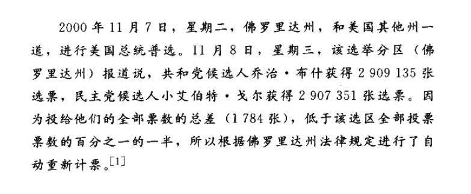

# 语言的用法
## 语言的三种基本功能
### 信息性用法 (The Informative)
- 信息性用法是语言**用于信息交流**的功能，通过明确表述并**肯定或否定命题**来完成
- 能被用于**肯定或否定命题**，或者能为此**提出论证**，称为**语言的信息性功能**
- 信息性话语用来**描述世界**和进行**有关世界的推理**，无论其所报道的事实是重要还是普遍
- 示例：2000年佛罗里达高等法院的报道，提供了选举投票的具体数字

### 表达性用法 (The Expressive)
- 表达性用法是语言用来**发泄和激发情感**的功能，最清晰的例子来自**抒情诗**
- 用于**揭示或交流情感、感受和态度**，而不是为了报道信息
- 并非所有的表达性语言都是诗歌，**日常用语**如“真糟糕”或“好极了”也用来表达情感
- 示例：约翰·W·伯根的诗句表达了对古城帕特拉的赞赏和敬畏之情

### 指令性用法 (The Directive)
- 指令性用法是语言用来**引起或阻止明显行动**的功能，其最显然的例子是**命令和请求**
- 旨在获得其**指令结果**，如家长告诉孩子“洗手吃饭”
- 在**单纯的指使形式**中，指令性话语**既不真也不假**，但可以评价为**合理或不合理、适当或不适当**
- 示例：“小心驾驶！”旨在提醒驾驶者遵守交通规则以避免事故

## 多功能话语
### 语言用法的混合
- 大多数正常交流可能表现出**语言的三种基本用法**：信息性用法、表达性用法、和指令性用法
- 例如，一首诗主要是**表达性**的，但也可能有**教育意义**（信息性）并引导读者**走向不同的生活方式**（指令性）
- 成功的交流要求**功能的结合**，使用**间接方式**而非直接发布命令，以引起期望的行动

### 动机与行动的原因
- 行动常涉及行动者的**欲望和信念**，这是常识
- 欲望表达为“**态度**”或“**情感**”，而信念通常受到**接收到的信息**影响
- 通过激发适当的态度或提供信息影响信念，可以成功引起行动

### 举例说明多功能用法
- 假设目标是让听众向慈善机构捐款，可以通过**提供慈善机构信息**（信息性）来**引发行动**（指令性），或通过**激发乐善好施情感**（表达性）达到目的
- 在某些情况下，需要同时使用**语言的三种功能**来引发行动

### 特殊语言用法
- **礼仪性用法**（Ceremonial Usage）在社交和宗教场合中常见，例如问候、结婚仪式等，体现了语言的**表达性和指令性混合用法**
- **践行性用法**（Performative Usage）实际上就是实施一种行动，例如“我宣布你们是夫妻”，**通过说话即实现了行动**
- **践行性动词**如“我祝贺你…”、“我向你道歉，我…”等，表示**通过语言完成的具体行动**

## 话语形式
### 语句的语法分类与功能
- 语句通常分为**陈述句、疑问句、祈使句和感叹句**四种类型，但这些语法分类并不完全对应于信息性、表达性和指令性功能
- 尝试将语句形式等同于其功能（如陈述句等同于信息性用法）会导致**误解和错过重要的信息**

### 陈述句的多功能用途
- **陈述句**虽通常用于**信息交流**，但也可用于**表达情感**（如“我在你的聚会上度过了一段美好时光”可能更多是表达友好而非仅提供信息）
- 在某些情况下，陈述句也可能用于**指令性目的**（如“我喜欢咖啡”可能被理解为对侍者的一种请求）

### 疑问句、祈使句和感叹句的功能灵活性
- **疑问句**如“你意识到我们几乎要迟到了吗？”可能用于**加速行动**而非真正询问
- **祈使句**可能不直接**表达命令**，而是**传递信息或表达情感**
- **感叹句**如“多么美好的景色啊！”可能具有**指令性功能**，如鼓励行动或引发特定反应

### 语言的混合用法
- 许多话语尝试**同时达到**语言的**两种或三种功能**
- **正确评价**给定语段需要把握语言的不同功能及其目的
- 例如，具有信息性功能的语段可以被评价为**真或假**，具有指令性功能的可以被视为**适当或不适当**，具有表达性功能的可以被视为**真诚或虚假**

### 功能与语法形式之间的关系
- 功能与语段表面上断言的内容之间**不存在严格的关系**，**语境**在判定功能中极其重要
- 单独语段的功能识别**特别困难**，需要**考虑语境**
- 例如，"到窗口来吧"的祈使句形式，在特定诗歌语境中可能主要用作**表达性功能**

### 总结
- 语言的功能与其语法形式之间**没有固定联系**
- 理解语言的**多功能用途和灵活性**对于准确地评价和理解交流至关重要
- 在评价语言时，考虑**语境、说话者的目的和语言的混合用法**是必要的

## 情感词汇
### 字面意义与情感意义
- 词汇可以**同时具有**字面意义和情感影响，这种情感影响通常称为**词汇的情感意义**（emotive meaning）
- 字面意义和情感意义在很大程度上是**独立的**，例如，“官僚”（bureaucrat）、“政府官员”（government official）和“公仆”（public servant）**字面意义接近**，但**情感意义不同**
- 伯特兰·罗素设计的“**不规则动词**”（irregular verb）游戏展示了相同事物可以被不同情感色彩的词汇指称，如“我坚定；你顽固；他头脑顽板”

### 语言对态度的影响
- 使用的词汇**显著影响**我们对事物的态度，如“臭菘”（skunk weed）可能影响我们对玫瑰的感受
- 在**金融市场**上，语言选择**影响人们的行动**，如“回升”与“取短期利息”对市场情绪的不同影响

### 委婉语的使用
- 委婉语是用**较温和的词汇**表达严酷现实的现象，如“暂时撤退”替代“失败”，“重组”替代“破产”
- 委婉语最终也可能因其与原先事实的关联而**失去吸引力**，需要**不断更新**

### 词汇的个人情感影响
- 个人的情感反应有时源于特定词汇或短语在个人生活中的**特定语境或经历**
- 某些词汇因个人经历而携带**特殊的私人情感意义**

## 一致与歧见的种类
### 信念歧见与态度歧见
- **信念歧见**（belief disagreement）发生于个体**对某事实发生的信念上存在差异**
- **态度歧见**（attitudinal disagreement）发生于个体对同一事实**持有不同或相反的态度**

### 歧见的四种关系
1. **完全一致**：对事件的**信念和态度都一致**
2. **信念一致，态度对立**：双方对**事实的发生一致**，但对事件**持有不同的态度**
3. **态度一致，信念歧见**：双方对事件持有**相同的态度**，但对引起这种态度的事实有**信念上的差异**
4. **完全对立**：双方在**事实上有歧见**且对**事实的态度也对立**

### 解决歧见的方法
- **信念歧见**通过**确认事实**来解决，可能涉及询问证人、查阅文本和检查记录等方法
- **态度歧见**的解决更加复杂，不涉及事实确认，可能需要探讨**引起愉快或不愉快的结论**的替代事件、动机、目的等

### 语词的情感色彩与歧见
- **伦理用语**（如“好”、“坏”、“对”、“错”）往往具有强烈的**情感色彩**，其使用可以表达**对某事物的态度**
- 并非**所有赞同或不赞同的态度**都蕴含道德判断，也可能涉及**审美价值或个人偏好**

### 歧见的实质性
- **歧见**不总是**纯粹言辞**的，即使双方使用**不同言辞**表达相同事实，也可能存在**对事实的矛盾态度**，导致**实质性的歧见**
- 理解歧见的本性对于解决歧见至关重要，**明确歧见的类型**有助于采取适当的解决方法

## 情感中性语言
### 情感语言与中性语言的适当使用
- **情感语言**和**中性语言**都有其**适当的使用场合**，就像枕头和锤子各有不同的使用场景一样
- 情感色彩浓郁的语言在某些**诗歌**中比中性语言更受欢迎，而在**探求真理的领域**中，中性语言更为可取

### 情感语言在论证中的影响
- 当目标是**探索事实真相**或**进行论证**时，情感因素可能导致**注意力分散**，因此使用强烈的情感语言是**有害的**
- 情感语言可能**掩盖理性思考**，故在进行冷静和客观的推理时应尽量**减少情感色彩的语言**

### 减少情感负荷的重要性
- 尽管在某些讨论（如流产议题）中**完全避免**情感色彩的语言可能**不可行**，但在求真的过程中，应尽可能**减少语言的情感负荷**
- 例如，威廉·詹姆士提倡使用“**决定论**”和“**非决定论**”等术语来代替情感负荷较重的“自由”一词，以**避免情感偏见**

### 民意调查中的情感语言使用
- 民意调查中使用的语言应**尽量中性**，避免情感措辞，以减少对调查结果的偏见
- 例如，《时代》和CNN的调查与罗斯·佩罗的调查通过使用不同的措辞，收集到了截然不同的公众意见

### 情感语言的操纵风险
- 使用**情感色彩浓厚**的语言可能是**歪曲事实、操纵公众情感**的手段
- 在**广告和政治活动**中，情感负荷的语言使用广泛，目的在于说服、销售，甚至获利
- 对抗这种语言操纵的最佳策略是保持对语言及其不同用法的**敏感性**，识别不道德的语言操纵技巧

