[TOC]
# 谬误
## 什么是谬误？
### 谬误的概念
- 谬误指的是**推理错误**，是**看似正确但实际错误**的论证类型
- 逻辑学家关注的是论证**前提与结论之间的逻辑关系**，特别是**前提不支持结论**的情况

### 谬误的类型
- **相干谬误 (Fallacy of relevance)**：论证中的错误与**论证的相关性**有关
- **预设谬误 (Fallacy of presumption)**：论证基于**错误或不合理的预设**
- **含混谬误 (Fallacy of ambiguity)**：由于**语言上的含混不清**导致的错误

### 谬误的特性
- 谬误通常在**日常话语**中出现，具有一定的**心理上的说服力**
- 不是所有的过失推理或虚假信念都被称为谬误，只有那些**典型且常见的错误**才被视为谬误

### 谬误的识别与处理
- 特定的论证是否构成谬误可能取决于**作者对词项的解释**
- 分析谬误论证时，应考虑语境中**词项的意义**，保持高逻辑标准的同时，对日常生活中的论证要**公平和宽容**

### 谬误的分类与数量
- 亚里士多德列举了**13种谬误**，而近代列出了**超过100种**
- 谬误的确切数量取决于分类体系，本文选取了**17种最常见且具有欺骗性的谬误**进行分析

### 谬误研究的价值
- 理解谬误有助于**避免在推理中落入这些错误的陷阱**
- 提高**逻辑敏感性**，有益于识别和辨识各种类型的推理错误

## 相干谬误
### 诉诸无知论证 (Argument from Ignorance: Argument Ad Ignorantiam)
#### 定义与性质
- **诉诸无知论证**基于**这样的错误逻辑**：主张一个命题是**真**，仅因为它**未被证明为假**；或主张一个命题是**假**，仅因为它**未被证明为真**
- 此类谬误在科学发展中常见，尤其是**当某些命题的真假未被确定时**

#### 示例
- **伽利略与月亮的山谷**：伽利略发现月亮表面的山脉和山谷，但被当时的学者以未能证明其反论（月亮是完美球体）为由拒绝接受
- **政治和社会变革**：反对或支持政治变革时，常见诉诸无知的论证，例如，通过未能证明变革不会带来风险来反对变革

#### 注意点
- 在某些情况下，未能发现某种预期结果或证据**可能具有实质性的意义**，如药品安全性测试中**未发现对动物有毒性影响**
- 但需**警惕过高的证明标准**，如要求证明某物绝对无害可能导致有益的医疗治疗被排除

### 诉诸不当权威 (The Appeal to Inappropriate Authority; Argument Ad Verecundiam)
#### 定义与性质
- 当试图以**非该讨论主题领域的权威人士的意见**为论据时，构成**诉诸不当权威的谬误**
- 此类谬误**忽略了专业知识和领域的特定性**

#### 示例
- **广告中的证言**：利用**著名人士**（如运动员或明星）来推荐与其专业领域无关的产品或观点
- **伽利略和月亮的山谷**：类似伽利略案例中，将物理学家的意见用于解决国际条约等政治问题

#### 注意点
- 必须明确**区分权威的专业范围**，避免将个人在一个领域的专长错误地应用到其他领域
- 评估权威意见时，需考虑**专业知识的相关性**和**专长的具体范围**

### 人身攻击论证 (Argument Ad Hominem)
#### A. 诽谤
- 诽谤性人身攻击**把攻击焦点放在个人品格上**，而非其**论证的内容**
- 这种攻击的**逻辑错误**在于，**个人品格**与主张的**真假**或推理的正误**无关**
- 诽谤可能通过**情感上的反对**来影响听众，例如将对手贴上“激进派”或“极端派”的标签

#### B. 背景谬误
- 背景谬误将**个人的背景**与其主张的真假牵连在一起，忽略了**两者之间的逻辑独立性**
- 通过背景谬误进行的人身攻击可能是**指责对方的职业、国籍、政治联系等**与论点的真假无关的因素
- 这种类型的人身攻击可能通过**污名化某个群体**来贬低对方的论点，如指责某论点仅因提出者的**特定背景**而非内容不当

#### 诽谤与背景谬误的示例
1. **索莫斯案例**：一位哲学家被指责不诚实和缺乏基本的哲学争论礼仪，这种指责忽视了其论点的内容
2. **卡迪拉尔·纽曼案例**：被攻击因为其天主教徒的身份而不是他的论点本身，这是典型的背景谬误和污泉谬误

#### 人身攻击论证的影响
- 人身攻击论证通过**转移注意力和操纵情感反应**来影响听众，使其偏离论证的逻辑内容
- 这种论证方式可能**在短期内说服听众**，但从逻辑和道德的角度看是**不成立**的

#### 人身攻击论证的防御
- 要识别和拒绝基于诽谤和背景的攻击，专注于**论证的内容**而非提出者的个人特征或背景
- 在面对人身攻击时，保持**批判性思维**，寻求论点的**逻辑证据和理由**，而非受到情感引导的反应

### 诉诸情感（The Appeal to Emotion： Argument Ad Populum）
- 诉诸情感谬误是通过**操纵情感反应**而非**提供合理论证**来说服听众的方法
- 这种谬误的典型例子包括**政治宣传和商业广告**，其中产品或观点通过与**强烈情感联系**来吸引人们
- **爱国主义**被用作操控情感的一个例子，尽管它是一种**高尚的情感**，但**不适当的利用它**却是**逻辑上不成立**的

#### 诉诸情感的示例
1. **希特勒的演讲**：通过激发狂热的爱国情感来控制听众
2. **商业广告**：产品通过与性感、财富、冒险等情感相关联来吸引消费者
3. **民意调查**：问题的措辞通过诉诸受欢迎的概念（如教育、保健）来引导答案

#### 诉诸情感的影响
- 通过**情感而非理性**来影响人们，可能**短期内有效**，但**从逻辑和道德角度看是错误的**
- 广告和政治宣传中**普遍存在**诉诸情感的谬误，通过**将产品或观点与情感相关联来吸引人们**

#### 诉诸情感的批评
- 罗素指出，**广泛接受的观点并不一定是正确的**，实际上，它们**往往更可能是错误的**
- 诉诸情感强调了在讨论和决策过程中**保持批判性思维和逻辑推理的重要性**

### 诉诸同情 （The Appeal to Pity： Argument Ad Misericordiam）
- 诉诸同情是一种**特殊的诉诸情感谬误**，目的是激发听众的**怜悯心和利他主义**
- 在法庭上，律师经常利用**诉诸同情**的策略，以**悲惨的方式**展示委托人的状况，寻求**获得更多的伤害赔偿或辩护**

#### 诉诸同情的例子
1. **法庭策略**：原告律师通过极其悲惨的方式展示委托人的伤残情况，以寻求更多的赔偿
2. **苏格拉底的审判**：苏格拉底提到其他被告通过带着家人出庭以激起陪审团的同情心
3. **荒谬的同情诉求**：一个年轻人在因杀害父母的审判中请求宽大处理，因为他成了孤儿

#### 诉诸同情的逻辑问题
- 同情心虽为**人之常情**，但在论证中利用它来影响判断是**逻辑上不成立**的
- 诉诸同情的论证试图通过**情感反应**而非逻辑证据来影响听众或读者的决定
- 在严肃的讨论和决策中，应**避免诉诸同情的策略**，专注于事实和合理的论证

### 诉诸暴力（The Appeal to Force： Argument Ad Baculum）
- 诉诸暴力是利用**暴力或暴力的威胁**来迫使**接受某种结论**的谬误
- 暴力的威胁不一定是**武力**，也可以是**诉讼威胁或职位威胁**等形式

#### 诉诸暴力的例子
1. **博伊斯瀑布公司与丹佛大学**：博伊斯瀑布公司对一篇批评性文章作出法律威胁，迫使丹佛大学撤稿并发表更正声明
2. **里根政府的司法部长**：霍华德·贝克隐蔽地传达威胁，暗示不支持司法部长的工作人员可能会被解职
3. **法西斯主义观点**：认为通过各种手段说服对手是可接受的，包括使用“大棒”或其他形式的暴力

#### 诉诸暴力的逻辑问题
- 诉诸暴力**忽视了理性和证据的重要性**，依赖于**威胁**而非理性论证
- 被胁迫方可能在**表面上遵从**，但这并不意味着他们**接受了强加的结论为真**
- 诉诸暴力是**对理性的抛弃**，是理性讨论和决策中**不可接受的论证方法**

### 不相干结论（Irrelevant Conclusion： Ignoratio Elenchi）
- 不相干结论谬误发生当论证**声称证明**一个特定结论，实际上却证明了一个**与之不相关的结论**
- 这种谬误常见于**社会法律领域的论证**，其中提出的前提只支持一个**更广泛的目标**，而没有**针对性地支持特定方案或主张**

#### 不相干结论的例子
1. **税制改革辩护**：用减少财政预算赤字的需要来为特定的税制改革方案辩护，却未说明该方案的具体合理性或效益
2. **特殊方案支持**：提出支持建筑业或汽车工业的特殊方案，使用的前提仅表明需要支持该行业，而不是论证特定方案的必要性
3. **武器系统开发**：用国防的需要来辩护开发新武器系统，忽略了是否该武器系统是真正所需的具体问题

#### 不相干结论的逻辑问题
- 这种谬误通过**分散注意力**，用**情感化的语言**掩盖**逻辑上的缺陷**，从而在听众中成功传递热情
- 即使使用**冷静中性的语言**，只要论证目标与它正在辩护的结论**不一致**，就构成**不相干结论谬误**
- 在政治运动中尤其常见，例如，乔治·W·布什关于缓刑的讨论就被指出为不相干结论谬误
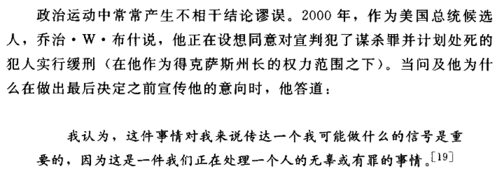

#### 相关术语
- **推不出（non sequitur）**：意味着结论**不能从其前提中得出**，尤指前提与结论之间缺口巨大的情况
- **法律惨败的案例**：囚犯改变有罪声明为无罪，陪审团的判断导致释放，展示了“推不出”谬误可能的争论点
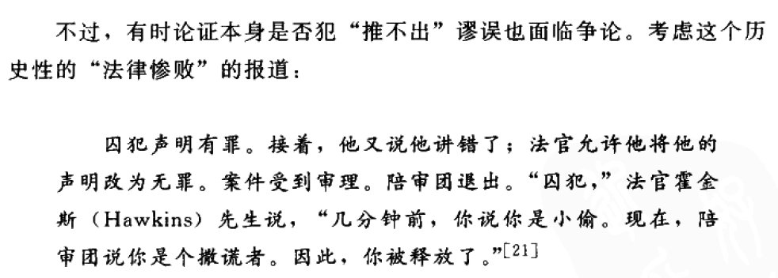

## 预设谬误
### 概述
- 预设谬误发生在**日常推理**中，由**不恰当的假设**引起，常表现为**掩藏在论证中的可疑假设**
- 这些谬误的前提与结论**通常不相干**，特别是那些关键支持结论的假设**未被公开支持或根本无法支持**
- 要揭露预设谬误，关键是**识别悄无声息的假设及其虚假性**

### 复杂问语（Complex Question）
- 复杂问语是一种**常见的预设谬误**，其中问题中隐含的假设**被假定为真**
- 这种类型的问题通常**不是真正寻求答案**，而是**通过隐含的预设达到提问者的目的**
- 回答复杂问语的一个有效方法是**首先澄清问题中的预设**

#### 实例分析
1. **公司经理的询问**：“为什么私企的资源发展比任何国有企业都更有效率？”预设了私有部门的效率更高
2. **物业税增长问题**：“对大多数租房但不拥有房地产又无须缴税的选民来说，你期望他们怎么关心要承担更不公平税赋的人呢？”预设了税赋不公平和租客不受影响

#### 复杂问语的误用
- 例如，在科学或政治讨论中，问题可能被**设置得很复杂**，以**避免对隐含的假设进行辩护**
- 报刊和媒体使用复杂问语可以**误导公众**，例如，通过提问形式**隐含一些未经证实的事实**
- 在法庭或公共讨论中，复杂的问题可能导致**误导或不正确的推理**，尤其是在**对特定行动的支持中**

### 应对策略
- 在回答复杂问语时，应首先**识别并质疑其中的预设**，然后才能**有效回答或反驳**
- 在议会或公共辩论中，提出的问题**应简化并明确**，以**避免误导和操纵**
- 教育公众**识别和质疑复杂问语中的预设**，是**提高批判性思维和推理质量**的关键步骤

### 虚假原因（False Cause）
#### 定义与背景
- **虚假原因谬误**（noncausa pro causa）发生在**错误地假定实际上不是某事件原因的事物为原因**时
- 这种谬误是归纳逻辑和科学方法论中的核心问题，关注**原因与结果之间的联系本质**及**如何确定这种联系**
- 设置一个**不存在的因果联系**是常见错误，可以导致严重的推理错误

#### 常见情况与实例
1. **大学评分**：有人可能认为大学教员评分宽松是因为担心严格评分会影响学生对他们的评价，影响薪水，例如密歇根大学的一个例子表明，教授的薪水与他的严格评分标准不相符，而他认为这是由学生评价导致的
2. **错误的时间相关性**：常见错误包括因为两个事件在时间上相邻就错误地假设一个是另一个的原因，如挑战性动议后出现的国际事件被误认为是因动议引起

#### 类型和识别
- **缘出前物（post hoc ergo propter hoc）**：假定因为**事件B在事件A之后**发生，所以**A是B的原因**，这是一种经典的虚假原因谬误
- 虚假原因谬误在**原始科学**中常见，**现代社会**中也广泛存在，如天气异常归因于不相关天象，疾病归因于错误的外部因素等
- 在科学和政策讨论中，这种谬误可能因为**复杂的因果关系不易识别**而被忽视或误用

#### 避免虚假原因谬误
- 需要严格评估**事件间的因果关系**，避免仅基于时间顺序或表面关联作出结论
- 在进行科学研究或政策制定时，应用**严谨的科学方法和统计验证**，区分**相关性和因果性**
- 教育公众识别和怀疑可能的**虚假原因关系**，提高批判性思维能力

### 丐题（Begging the Question：Petitio Principii）
#### 定义与特点
- 丐题是在**试图证明一个论题**的过程中，却**假定了所要证明的论题本身**
- 这种谬误的特点在于**前提中隐含着结论自身**，前提用语**往往掩盖了这一点**
- 丐题谬误**在逻辑上是有效的**，因为**前提确实能推出结论**，但是这种推导是**微不足道的**，因为它**没有提供任何证据的支持**

#### 常见形式与错误
1. **语言混淆**：前提中的假设常常通过**语言的混淆**或**同义词的未辨识使用**而隐藏，使得循环推理**不易被识别**
2. **循环论证**：每个丐题谬误都是**循环论证的形式**，**假定了**所需证明的结论，如果循环**较大或含糊**，错误就难以被发现

#### 逻辑学家的应用示例
- **理查德·惠特利案例**：早期逻辑学家用这种谬误形式记录的一个例子是关于言论自由的，假定了其正面影响的前提本身是需要证明的内容
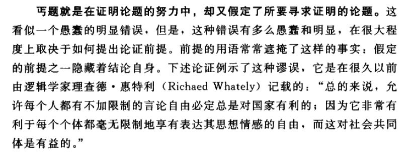

#### 哲学史上的争议
- **归纳原理的辩证**：逻辑学家试图通过证明所谓的“归纳原理”为真来确证归纳方法的有效性，但这实际上是一个丐题谬误
- **大卫·休谟的观点**：他指出依赖于过去经验来预测未来的做法本身就是一个丐题谬误，因为它假定了正在讨论的原则—未来将与过去一样
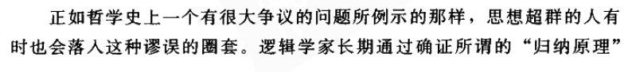
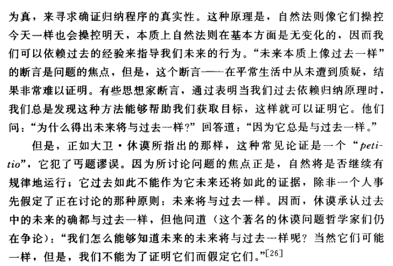

#### 讨论与批评
- 丐题谬误在哲学、科学及日常论证中**常见**，特别是在复杂或抽象的主题讨论时
- 虽然这种谬误**在逻辑上有效**，但它**不增加**任何关于论题的知识或理解，因此在实际应用中被认为是**无效或无意义的**

### 偶然和逆偶然（Accident and Converse Accident）
#### 定义与区分
- **偶然谬误**发生当**一般性概括不适用于特定情况**时，即错误地将**广泛规则**应用于**具有特殊环境的个别事例**
- **逆偶然谬误**则是**从特殊情况推广到一般性结论**，错误地把个别事例的真实性**视为广泛真理**
- 这两种类型的谬误都显示了**从一般到特殊**或**从特殊到一般**的不恰当逻辑跳跃

#### 逻辑与社会应用
- 在政治、法律、伦理等领域中，**正确使用概括**至关重要，否则可能导致**严重的理解和判断错误**
- 例如，**法律规则**通常良好但可能有例外，**机械应用**可能导**致不公正或错误的判断**

#### 示例与分析
1. **欧西德姆斯和苏格拉底的对话**（由色诺芬记载）：
   - 欧西德姆斯接受了若干习俗上的伦理真理，例如欺骗和偷盗通常是错误的
   - 苏格拉底通过提出特定假设情况，使欧西德姆斯认同在某些情况下这些行为是正当的，显示了概括规则**不应机械应用**

2. **炸鱼片店主的例子**：
   - 店主用自己儿子吃炸食而胆固醇正常的事例，来证明炸食对健康无害
   - 这是一个典型的**逆偶然谬误**，错误地**从个别事例推广到一般结论**

#### 谬误的影响与风险
- 偶然和逆偶然谬误在日常生活和学术研究中**普遍存在**，能够对决策和认知产生误导作用
- 识别这些谬误需要**严谨的思维**和对具体情境的**深入了解**，避免过度简化复杂问题

#### 对策与防范
- 在应用**一般规则**时考虑**具体情况的特殊性**，不应盲目推广
- 分析论证时，警惕那些**看似合理却基于个别例子**的结论，尤其在统计或科学研究中**应用广泛数据而非个例**

## 含混谬误
#### 定义和特点
- 含混谬误发生时，词或短语**在论证过程中意义发生变化**，造成前提和结论之间的连接失效
- 这类谬误也称为“**诡论**”（sophisms），可能由于**粗心或故意操作产生**，使得词义**在不同的论证部分中不一致**

### 歧义（Ambiguity）
- 歧义谬误涉及一个词或短语**在论证中具有不同的字面意义**，当这些意义**被混淆**时，谬误便**产生**
- 常见于日常语言和文学中，如Lewis Carroll的作品中通过**故意歧义创造幽默**

#### 示例分析
1. **刘易斯·卡罗尔的玩笑**：
   - 在Through the Looking Glass中，"nobody"一词先是作为“没有人”解释，随后又被当作人名使用，造成歧义
   - 此类歧义**在文学中常见**，但在逻辑论证中则表现为**谬误**

2. **“相信”和“信仰”的歧义**：
   - “相信总统”和“相信心灵感应”表达了“相信”一词的**两种不同含义**
   - “相信总统”通常意味着信任总统的决策，“相信心灵感应”则表达了对心灵感应存在的信任
   - 歧义源于“相信”一词**在不同情境下的不同解释**，可能导致**论证中的逻辑错误**
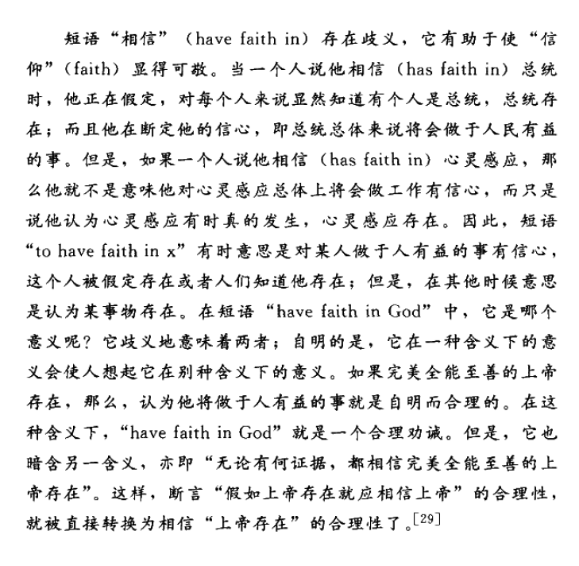

#### 关于相对性词项的歧义
- **相对性词项**如“高”、“小”、“好”等，在不同的语境下具有不同的相对标准
- 使用这些词语时不恰当的**比较可能导致逻辑谬误**
- 示例中，“小象是小动物”是一个**明显的错误**，因为“小”在不同的对象类别中**标准不同**

#### 论证效果和影响
- 歧义谬误有时候可能**非常细微且难以发现**，特别是在复杂的论证或深奥的话题中
- 歧义的词语如果**不被识别和纠正**，可以在理解和沟通中造成**严重的误导和混淆**

#### 预防和识别方法
- 在进行论证或分析时，应注意**词语的一致性和语境适应性**，特别是那些**具有多重含义的词语**
- 通过**精确的语言使用**和**避免含糊不清的表达**，可以**有效地减少**歧义谬误的发生

### 双关（Amphiboly）
#### 定义与特点
- 双关指的是由于前提的语法结构**松散或笨拙**，导致**表达含义不确定**的情况
- 一个双关的陈述可能**在一种解释下是真的**，而**在另一种解释下是假的**，从而导致**理解上的混淆和谬误**

#### 双关的来源与语言表达
- “双关”这个词来源于**希腊语**，“amphiboly”意味着“一团两个”或“两倍”，象征着**一个表述有多个含义**
- 双关常由于前提语句的**语法结构不清晰**或**使用模糊的表达方式**而产生

#### 双关谬误的应用
1. **政治语言中的双关**：
   - 双关在政治领域中可用于迷惑或误导人们，如托尼·科埃略的陈述“Women prefer Democrats to men”既可以解释为女性比男性偏爱民主党人，也可解释为女性偏爱民主党人而非男性

2. **文学和新闻中的双关**：
   - 《纽约客》（The New Yorker）通过双关来进行幽默或讽刺，例如引用的“Leaking badly, manned by a skeleton crew, one infirmity after another overtakes the little ship”可能让人误解为船体泄漏严重，而实际上指的是一种情况的不断恶化

#### 双关的影响和识别
- 双关可能导致**混淆和错误的理解**，因其**语义上的多重可能性**
- 识别双关需要对语句的**语法结构和上下文**有深刻理解，避**免从错误的语义角度推理**或得出结论

#### 避免双关的策略
- 在编写和评估论证时，**清晰和精确的语言使用**至关重要，以**防止由于双关引起的误解**
- 对于可能产生双关的表达，应进行**重新构造或澄清**，确保每个词语和短语的意义**在上下文中的一致性**

### 重读（Accent）
#### 定义与特点
- **重读谬误**发生时，论证的意义**因强调或重读的变动**而改变
- 当前提依赖某种强调解释而得出的结论依赖于**对同一词汇的不同重读**，导致**理解混乱或误解**

#### 实例分析
1. **表述多义性**：
   - 例如，句子“We should not speak ill of our friends”可以根据强调不同单词有多种解释，若强调改变，可能导致理解该句意图的错误
   - 不恰当的强调可能导致从句子中得出**错误或欺骗性的结论**
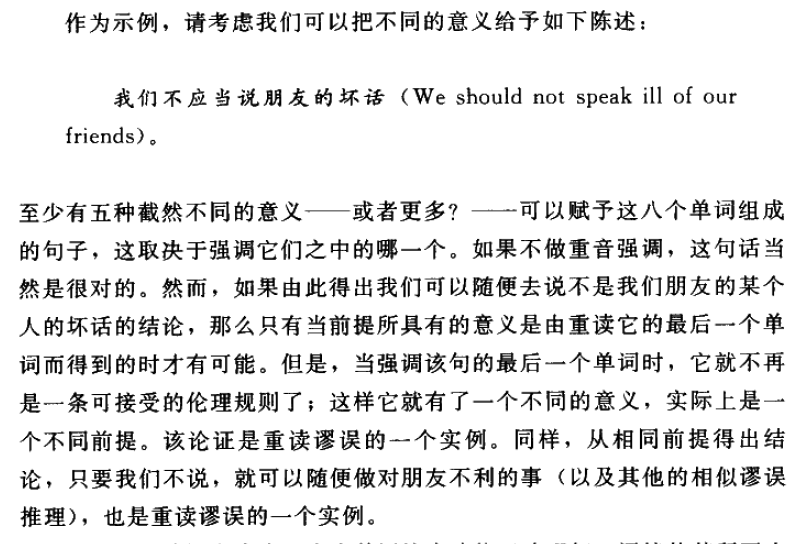

2. **超出语境的引用**：
   - 例子中艾尔·戈尔被误引述其对烟草与肺癌关系的看法，引用被剪辑以支持错误或歪曲的论点
   - 此类引用通过**改变语境**来误导听众或读者，造成**严重的理解误差**
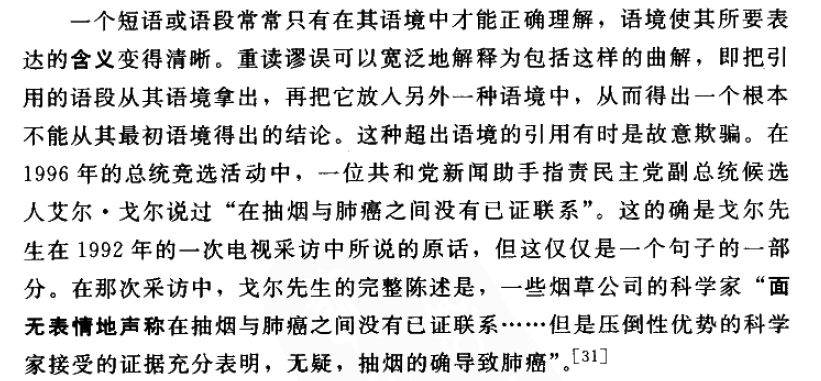

#### 双关的破坏性用法
- 意图**歪曲或误导的引用**，如**删节关键短语**，可以**严重扭曲原始语段的含义**
- 例如，删去“在右派那里”的表述，导致读者对作者的看法形成**错误的结论**
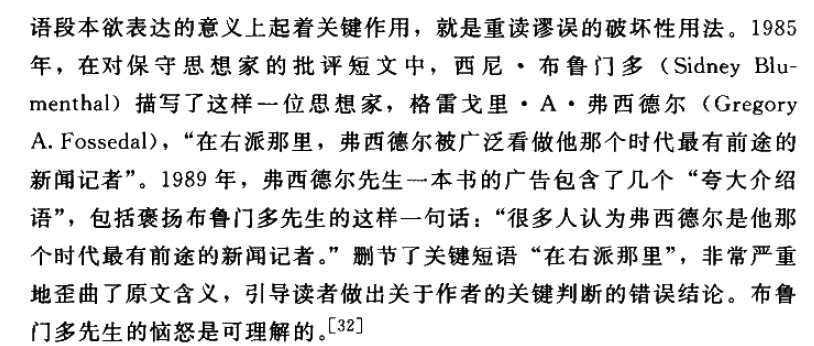

#### 避免双关的策略
- 在引用和表述时需保持**极致的精确和清晰**，防止因强调或语境改变而引发误解
- 应明确标注原文中的**重点和删节部分**，确保语句的原始意图不被歪曲或误读

#### 重读谬误的例子
- 在**广告和政治宣传**中常见，通过**选用敏感的词汇**或**删节重要信息**来引导读者形成误导性的结论
- 例如，在广告中**突出显示低价**而在小字中列出**诸多限制条件**，导致消费者对广告宣传的**真实性产生误解**
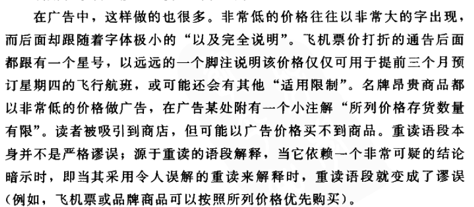

#### 重读谬误的影响
- 可能导致公众**对信息的误解**，特别是在信息传播和媒体报道中
- 影响读者或听众对情况的**真实理解**，可能导致基于错误信息的决策或行动

### 合成谬误
#### 定义与分类
- 合成谬误描述了从**部分的性质**错误地推广到**整体的性质**的推理错误
- 这种谬误可分为两种：一种是**从部分到整体的无效推广**，另一种是**从元素到元素汇集的无效推广**

#### 第一类合成谬误
1. **例子说明**：
   - 例如，从“**机器的每个部分都轻**”推断“**整个机器也轻**”是错误的，因为整机的重量**可能由许多轻部分组成而变重**
   - 另一个例子是，假设因为剧本的**每一场都完美**，**整个剧本就完美**，忽略了**部分与整体之间的差异**

2. **错误的推理基础**：
   - 错误地假设**部分的性质**可以**无条件地应用于整体**
   - 忽略了**整体**可能由**部分的交互作用**形成**新的性质**

#### 第二类合成谬误
1. **例子说明**：
   - 如“**公共汽车用油量比小汽车多**”推广到“**所有公共汽车的总用油量比所有小汽车多**”是错误的，因为小汽车的数量可能**远超公共汽车**
   - 每个大学生注册的**课程数量有限**，但所有大学生注册的**总课程数目非常庞大**

2. **混淆分布式与汇集式用法**：
   - 分布式用法关注**个别元素**，而汇集式用法关注**元素的总体或集合**
   - 错误地将分布式属性应用于汇集式属性导致**错误的推论**

#### 合成谬误的影响
- 合成谬误在政治、科学研究、日常决策中常见，容易**误导人对复杂问题的理解**
- 导致对事物的**错误评价或决策**，因为未能正确理解部分与整体或元素与集合之间的关系

### 分解谬误
#### 定义与分类
- 分解谬误是**合成谬误的反向错误**，涉及从**整体的性质**错误推断到**其部分的性质**
- 可分为两种：一种是**从整体到部分的错误推断**，另一种是**从元素的汇集性质错误推断到单个元素的性质**

#### 第一种分解谬误
1. **例子说明**：
   - 例如，因为一个公司非常重要，某个公司官员也被认为非常重要，这忽视了**个人重要性和公司重要性的区别**
   - 另一个例子是从机器整体的重量、复杂性或价值推断**其单个部件具有相同属性**

2. **错误的逻辑基础**：
   - 错误地假设**整体的属性**必然**适用于其构成的各部分**
   - 忽略了部分可能**与整体有着不同或更少的属性**

#### 第二种分解谬误
1. **例子说明**：
   - 如从“大学生学习医学、法律等”错误推断“每个大学生都学习这些科目”
   - 这忽视了大学生**作为一个群体的学习多样性**和**个别大学生的学习范围**

2. **汇集与分布的混淆**：
   - 分解谬误常见于**混淆了汇集和分布式属性**，如公共汽车和小汽车的用油比较
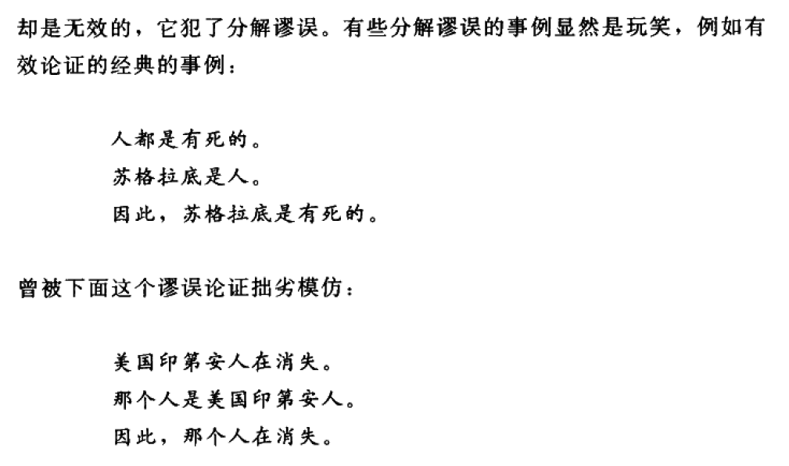

#### 分解谬误与逻辑错误
- 分解谬误与偶然谬误**有相似之处**，均涉及**预设和歧义**
- 在逻辑结构上，分解谬误将整体的属性**不恰当地归因于个体或部分**，而偶然谬误涉及对规则的**普遍适用性的错误假设**

#### 谬误的实例
- 从军队整体的实力推断每个单独单位的实力，或从规则的普遍适用性推断无特例，均构成分解谬误的示例
- 识别分解谬误有助于避免在决策和评价中的错误，尤其是在处理涉及多元复杂性和层级结构的问题时
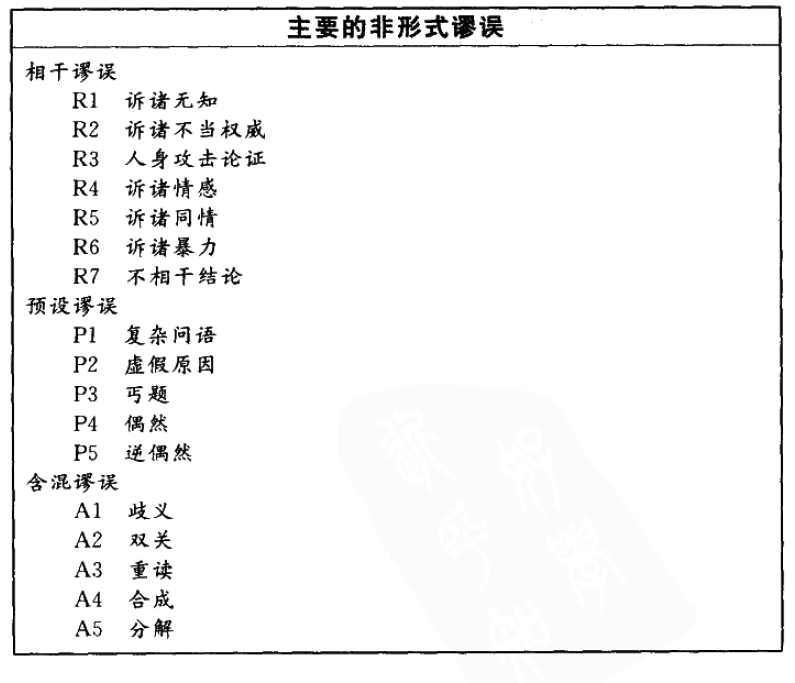