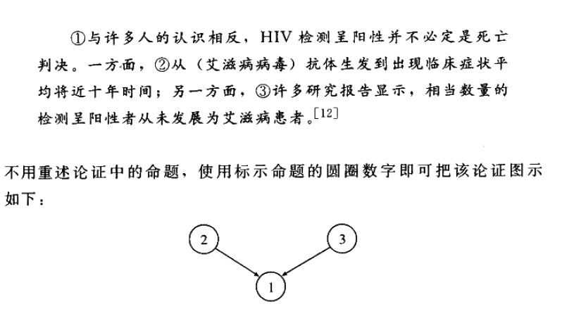

[TOC]
# 逻辑学的基本概念
## 什么是逻辑学
### 定义与研究目的
- **逻辑学**（Logic）是研究**区分正确推理**与**不正确推理**的方法和原则的学科
- 目的在于发现并阐述区分**好的论证**与**坏的论证**的客观标准
- 通过这些标准，可以检验论证，提高推理的正确性

### 逻辑学的应用范围
- 逻辑学家关注的推理遍及**所有领域**，包括科学、医药、伦理、法律、政治、商务、运动等
- 研究的重点不在于论证的题材，而在于它们的**形式**（form）与**品质**（quality）
- 目标是学习**如何检验与评价论证**

### 论证的分析
- 论证是**推理的产物**，可以完整地写出并进行**检验与分析**
- 对每个论证都应问：结论是否由前提推出？前提是否为接受结论提供了良好的理由？
- 如果论证的前提能够**充分地支持结论**，则推理**正确**；否则，推理不正确

### 逻辑学与推理能力
- 学习逻辑学能够**显著提高进行正确推理**的可能性
- 通过逻辑学，可以学习**检验推理正确性的方法**，更容易地识别并避免推理错误
- 学习逻辑学还提供了**分析和构建论证的训练机会**，增强推理技术与技能

### 逻辑学的局限性
- 有些生活事务**不能完全用逻辑方法分析**，有些问题**不能仅靠论证解决**
- **情感**有时比逻辑论证更有效，尤其在某些语境下
- 然而，在需要**依靠判断**的场合，正确推理是最坚实的基础

## 命题与语句
### 命题的定义与特征
- **命题**（Proposition）是一种可以**被肯定或否定**的陈述，不同于问题、命令和感叹
- 命题具有**真**（True）或**假**（False）的属性，而这一特性**不适用于问题、命令或感叹**
- 任何命题必须**是真或假**，尽管我们可能**不知道其真假**，这是命题的**基本特征**

### 命题与语句的区别
- 学界惯例上，命题与用来表达命题的**语句**（Statement）是区别开的
- **不同的语句**可以用来表达**同一个命题**，即使它们的字词和结构不同
  - Leslie won the election.（菜斯利赢了这场选举）
  - The election was won by Leslie.（这场选举由菜斯利赢得）
- 命题**不属于任何特定语言**，而语句则是**特定语言中的表达形式**

### 语句的多样性与命题的一致性
- 同一命题可以用**多种语言中的不同语句**来表达，显示了命题的**跨语言特性**
- **同一个语句**在**不同的语境**中可能表达**不同的命题**，例如**随时间变化而改变其真假的陈述**
  - 美国最大的州曾经是一个独立的共和国
  - 这个语句在20世纪上半叶说出，就是做了关于得克萨斯州的一个真陈述；而在现在说出就做了关于阿拉斯加州的一个假陈述
- “命题”和“陈述”在逻辑研究中经常被视为**同义词**，尽管它们有**微妙的差别**

### 简单命题与复合命题
- **简单命题**是**直接断定**某事为**真或假**的命题，如“天在下雨”
- **复合命题**包含**多个简单命题**，如**联言命题**（Conjunction）和**选言命题**（Disjunction）
- 联言命题和选言命题展示了命题可以以复合的形式表达更复杂的思想

### 复合命题的类型
- **联言命题**肯定**所有包含的简单命题**
  - 英军已兵临汉堡和不来梅城下
- **选言命题**（或析取命题）**并不肯定任何一个分支命题**，而是表达一个**包含选择的整体真理**
  - 巡回法庭或者是有用的，或者是无用的
- **假言命题**（或条件命题）通过**条件陈述**来表达，不直接肯定任何分支命题的真假
  - 如果上帝不存在，则有必要捏造一个上帝

### 命题的内在结构分析
- 本书将逐步分析简单命题和复合命题的**内在结构**
- 分析旨在理解命题如何组合、如何通过语句表达以及如何被理解和评估
- 对命题结构的深入理解有助于提高逻辑分析和推理能力

## 论证、前提与结论
### 论证的定义与组成
- **论证**（Argument）由**命题**（Proposition）构成，是**以一个或多个命题作为出发点**得出**另一命题**的过程
- 逻辑学家通过检验推论的**出发点、结果及其关系**来判断推论的正确性
- 论证是**一组命题的系列**，其中一个命题从其他命题**推出**，后者为前者**提供支持或根据**

### 论证的结构
- 论证必须包含一种**结构**，使用“前提”和“结论”这两个术语来描述
- **结论**（Conclusion）是论证中**由其他命题作为根据**所得出的命题
- **前提**（Premise）是**被肯定为接受结论的根据或理由**的命题

### 论证的示例
- 最简单的论证由**一个前提**和**一个结论**构成
  - 在地球上最先出现生命时没有人存在，因此，任何关于生命起源的陈述都应视为理论的而非事实的
- 论证的前提和结论可以在**同一个句子**中表述
  - 因为最近的进化史研究已经证明所有人都是从同一小群非洲祖先演变而来，若仍相信种族间有极大差异，则如同仍相信地球是扁平的一样荒诱可笑

### 复合命题与论证的区别
- 单一命题**自身不可能是论证**，但一些复合命题与论证**非常相似**，需要细心区分
- **假言命题**可能**看似论证**，但**并不构成论证**，因为它**不肯定任何命题的真假**
  - 如果火星在其具有与地球相似的大气层和相似气候的早期曾有生命演化，那么目前科学家确信的在我们的星系中存在的无数颗其他星球上也会有生命演化
- **如何识别论证**是逻辑学中的一个重要讨论主题

### 非论证的命题系列
- **有结构的命题系列**并**不一定**构成论证
- 例如，**关于骆驼的一段描述**具有结构，但并不包含任何论证
- 论证的关键在于其中的命题系列必须**以一种方式结构化**，使得一些命题**支持另一些命题作为结论**

## 论证的分析

### 分析技法
#### 解析与图示
- 论证分析的两种技法包括**解析**（Paraphrase）和**图示**（Diagram）
- 解析是用**清晰的语言和逻辑顺序**表明论证中的命题
- 图示是用**二维空间关系图**展示论证的结构

### 解析法
#### 示例分析
- 通过**解析**澄清论证，即利用**清晰简明的语言**列出每一个前提及结论
- 解析有助于把在论证中**被假定但未充分明晰地陈述**的内容揭示出来

#### 哈代的论说
- 哈代关于阿基米得和埃斯库罗斯的论证展示了几个带有可疑前提的论证

### 图示法
#### 显示逻辑关系
- 使用**标示命题的圆圈数字**展示论证的结构，避免重述前提
- 图示法能够**直观地显示论证**的结构，特别有用于展现**复杂论证的逻辑结构**

#### 示例分析
- HIV检测呈阳性并不必定是死亡判决的论证图示展示了**前提独立地支持结论**

- 安乐死是道德上可接受的论证图示展示了**只有结合前提才能支持结论**

### 多重复合论证
#### 论证的复合结构
- 当一段话包含**两个或更多论证**时，图示法特别有用
- 通过图示可以清楚展示**复杂论证的逻辑结构**和**前提与结论之间的关系**

#### 示例分析
- 马克思关于英国社会革命和爱尔兰独立的论证显示了**两个论证的结构**

- 塞涅卡关于惩罚罪行的目的的论证图示展示了**两个相关论证的逻辑结构**

### 图示法与解析法的比较
- 图示法适用于**直观展示论证结构**，特别是**复杂论证**
- 解析法适用于**列出隐含前提**，尤其当论证含**未明确陈述的假设**时
- 两种方法**各有优势**，可根据论证的特点和分析需求灵活选择

## 论证的辨识
### 结论和前提指示词
#### 结论指示词
- **结论指示词**如"therefore"（所以）、"hence"（因此）、"thus"（因而）等，用于**引导论证的结论**
- 其他例子包括："consequently"（因此）、"proves that"（证明），帮助辨识**论证中的结论部分**
- 通过这些词语，我们可以**更容易地识别出一个论证的结论**

#### 前提指示词
- **前提指示词**如"since"（因为）、"because"（由于）、"for"（因）等，标志着论证的前提
- 其他例子包括："as indicated by"（如...所示）、"follows from"（由...推出），用于**标明论证中的前提**
- 这些指示词帮助**识别论证的前提**，即论证所依赖的**假设或理由**

### 语境中的论证
- 论证的识别不仅依赖于结论和前提指示词，也依赖于**话语的背景或整体意义**
- 即便没有明确的指示词，论证的**结构和组成**也可通过其语境和意义被辨识
- 例如，批评吸烟选择的段落中**没有明确的指示词**，但其**论证结构明显**；反驳死刑有效性的论证通过**统计数据**表述，而无需指示词；比例代表制辩护中，通过批评现有制度的弊端来**隐式表达结论**

#### 论证的语境示例
- 吸烟责任批评示例：讨论了烟草对健康致命影响的知情决定，暗示了吸烟者对其健康后果的责任
- 死刑处罚有效性论证：通过列举死刑州的谋杀率统计数据，论证死刑并非有效的威慑手段
- 比例代表制辩护：指出单一成员选区制度的弊端，隐含支持比例代表制的优越性

#### 论证与上下文的关系
- 论证的**完整理解**需要考虑其**上下文和相互参照的命题**
- **上下文中的背景信息**对于把握论证的全貌至关重要
- 例：政府削减学生财政援助背景下的奖学金税收免除论证，需要理解财政削减的背景信息才能充分理解论证的前提和结论

### 论证的附加材料
- 论证性话语中可能包含**既非前提也非结论的附加信息**，如提供**背景知识或上下文环境**
- 这些附加信息虽**不直接参与论证结构**，却对**理解论证内容和目的**至关重要
- 例如，叔本华对自杀行为的辩护中提到法律禁令的荒谬性，虽然禁令的讨论既非前提也非结论，但为理解随后论证提供了必要背景

### 非陈述形式的前提
#### 反诘问句作为前提
- **反诘问句**可以通过暗示其答案是**显而易见或确定无疑**的来**起到前提的作用**
- 例子：安乐死权利讨论中的反诘问句“如果人们有死亡权，那么为什么必须要等到已临死亡的时候才能行使这个权利呢？”暗示了前提“人们不必等到临死才能行使死亡权”

- 使用反诘问句时**存在风险**，因为假定的答案可能**并非如此明显或正确**

#### 命令句作为结论
- 论证的结论有时可以采用**祈使句或命令句**的形式，特别是在**给出采取特定行动理由之后**
- 例子：《箴言》中有这样一句话：智慧为首，所以要求得智慧
- 尽管命令句**不能直接表达命题**，但在特定语境下可以**等同于**提出**应当**（should）或**应该**（ought to）采取的行动

#### 短语作为前提
- 有时，表示命题的话语可能采用**短语**而非完整陈述句的形式
- 例子：讨论地外生命可能性的段落列出了**支持地外有生命存在的多个理由**，如“有大量的行星”等
- 将这些短语转化为**完整的陈述句**可以帮助清晰地揭示论证的结构

### 未明确陈述的命题
#### 省略三段论
- **省略三段论**是指至少有一个**构成命题未被明确陈述出来**的论证
- 例子：在**米兰达规则**的辩论中，辩护人**未明确陈述其结论**，即“必须始终给予预先告知，最高法院不应当推翻米兰达规则”

- 未明确陈述的命题可能是因为被认为是**共知的、显而易见的或容易被接受的**，但有时这样的假设可能是**可质疑的**

#### 讽刺的假言命题
-  省略三段论极其依赖**语境**，也经常依赖于听话者关于某个表述出来的命题为假的**知识**
- 当论证的目的是强调某个命题的**虚假性**时，说话人常常构造这样一个**假言命题**：以该命题作**前件**（“如果”部分），以一个**普遍认为为假**的命题作**后件**（“那么”部分）
- 例如，18世纪著名的巴伐利亚风琴制造商之一约瑟夫·瑞普就他的管风琴说过一句广为人知的豪言：“如果在欧洲能发现更好的管风琴，那么我的名字就叫杰克”

## 论证和说明
### 区分论证和说明
- 语段可能**看起来像论证实际上是说明**，关键在于**作者的意图**
- 即使使用了“因为”、“由于”、“因此”等**前提或结论指示词**，也不能确定一个语段是论证还是说明
- 例子：“《马太福音》6:19”提出一个明确的论证，而“《创世记》11:9”提供的是对名字“巴别”由来的说明

### 说明的标志
- **说明**旨在阐释为什么**已知为真的命题**（Q）**是真的**，而不是**建立命题Q的真实性**
- 例子：“最远的类星体看上去像强烈的红外辐射光点”是一个说明，解释了为何类星体显示特定的外观颜色
- 在说明中，“因为”标示的是**接下来要说明的原因**，而不是**支持某个结论的前提**

### 论证的目的
- 确定一个语段是论证还是说明取决于**语段的目的**：是否意图**确立某个命题（Q）的真实性**
- 若Q是需要**建立真实性的命题**，则“因为P”提供了**支持Q的前提**，构成论证；若Q已知为真，则“因为P”提供对Q**为何为真的说明**
- 例子：“塞拉利昂在1808年成为英国直辖殖民地”是一个说明，讲述了其成为殖民地的原因而非论证其为殖民地的理由

### 说明与论证的功能差异
- **相似的语段**可能具有**完全不同的功能**，取决于作者的意图和语境
- 例子：《纽约时报》对男女体重评论的讨论实际上是一个论证，而非说明，尽管最初可能被误解为说明

### 语境的敏感性
- 区分说明和论证需要**对语境有敏感性**，有时一个语段的目的难以确定
- 语段可能需要根据其被提出的上下文以**两种不同方式解读**：作为论证或说明
- 例子：《纽约时报》的体重评论语段在某些解读下可能是论证，在另一些解读下可能是说明

## 演绎有效性
### 演绎论证与归纳论证的区别
- **演绎论证**（Deductive argument）断言其前提**决定性地**（conclusively）支持结论，而归纳论证则**没有这种断言**
- 每个论证要么是**演绎的**，要么是**归纳的**，基于它是否断言**前提决定性地支持结论**

### 有效性的定义
- 演绎论证的**有效性**（Validity）意味着如果**前提为真**，则结论**必定为真**
- 有效性这一术语**仅对演绎论证适用**，有效的演绎论证如果前提为真，不可能得出假的结论
- 演绎论证要么是有效的，要么是无效的，**不存在中间状态**

### 演绎逻辑的任务
- 演绎逻辑的中心任务是**区分有效论证和无效论证**
- **古典逻辑**和**现代符号逻辑**是评价演绎论证有效性的**两种主要方法**
- 尽管古典逻辑学家和现代符号逻辑学家在方法和某些论证的**具体解释上可能不一致**，他们共同认同演绎逻辑的主要任务是**开发工具**来区分有效论证与无效论证

## 归纳和或然性

### 归纳论证的特征
- **归纳论证**（Inductive argument）不断言其前提必然地支持结论，而是提出一个较弱但重要的要求：**其前提或然性地支持结论**
- 归纳论证的价值在于**前提授予结论的或然性程度**，这种或然性是一个**程度问题**，受**可能出现的其他事物情况**的影响

### 归纳论证与演绎论证的区别
- 演绎论证要求其**前提决定性地支持结论**，如果有效，则前提的真将决定性地导致结论的真；归纳论证的结论则是**在某种或然性程度上由其前提支持**
- 例子：一个关于公司法律顾问倾向于是保守主义者的归纳论证，可以通过**增加新的前提信息**（例如，某人同时是美国公民自由权协会的官员）而**被弱化或强化**
- 演绎论证的有效性**不受附加前提的影响**，而归纳论证的强度可以**通过新发现的事实改变**

### 归纳论证的评估
- 归纳论证的评估是**科学家**在任何领域**最主要的任务之一**，归纳论证的前提为其结论提供的或然性程度越高，论证就越有价值
- 尽管归纳论证在所有前提都为真的情况下可以提供**非常强的支持**，但结论从来**不是必然得出的**，总存在发现与以前相信的证据相冲突的新材料的可能性

## 有效性和真实性
### 有效性
- **有效性**（Validity）是**演绎论证**中命题之间的**一种关联**，其中作为论证前提的命题集和作为该论证的结论的命题之间如果**后者逻辑必然地从前者推出**，论证就被视为有效
- 有效性不适用于**归纳论证或单一命题本身**，因为在任何一个命题内部都不可能找到**必需的关联**

### 真实性
- **真实性**（Authenticity）是指命题的断言**与实际情形相一致的属性**，真和假是单一命题或陈述的属性
- 有效性和无效性是**论证的属性**，而真和假是**单一命题的属性**，不能将真假属性应用于**论证整体**

### 真实性与有效性的关系
- 即使一个论证的**一个或几个前提不是真的**，这个论证也可能是**有效的**
- **有效的论证**可以包含**真命题或假命题**，包括真前提和真结论、假前提和假结论等多种组合
- **无效的论证**可以包含**真前提和假结论的组合**，真实性和有效性的关系是**独立的**

### 可靠论证
- 若一个论证**有效**，并且其**所有前提都为真**，我们就称它为“**可靠的**”论证
- 可靠论证的**结论一定是真的**，只有可靠论证才能确立其结论的真实性

### 例子说明
- 林肯对德雷德·司各特决议的评价强调了即使**论证的前提是假的**，论证依然可以是**有效的**

- 不同的论证示例展示了有效论证和无效论证中真前提、假前提、真结论和假结论的各种可能组合

### 论证分析的重要性
- 逻辑学家的主要兴趣在于**命题之间的逻辑关系**，而不是命题的**真实性或虚假性**
- 有效性和真实性的分析对于科学研究、日常决策和理论检验等场合都是非常重要的
- 通过推断出**可检验的结果**来检验理论，需要对理论提出的前提进行**正确的推理**，即使**前提的真实性未知**

## 复杂的论证性语段
### 分析方法
- 复杂语段中的论证可能是由**几个论证多重复合**而成，其中有些命题**既作为前提又作为分结论**
- **图示法技术**有助于分析这种语段，尽管不存在一种机械方法可以精确描述这样的语段
- 分析复杂语段需要**理解作者推理的流程**，并辨识语段中**每个成分的作用**

### 例子分析
1. **动物实验论证**
   - 语段结束的结论是**开头陈述的相反**，有四个**直接支持结论的前提**，其中两个前提是**分结论**，得到其他前提**不同方式的支持**
   - 图示法展示**逻辑结构**，通过检查图示，可以“**解读**”推理路径的每一条路径，从而推出**最后的结论**

2. **宇宙大爆炸理论论证**
   - 论证集合中，**最后的结论**即**第一个陈述**，有**多个前提**直接支持这个结论，其中的**两个前提**又是分结论
   - 图示展示**逻辑关系集**，有助于理解论证的复杂结构

3. **太阳能汽车论证**
   - 第一个命题即“太阳能汽车只是一种试验性的装置，其他什么都不是”是最后的结论
   - 语段中的前提以**浓缩形式**出现，使得分析更加困难，图示法有助于分析

4. **不发表不道德的研究报告论证**
   - 《新英格兰医学杂志》的编辑方针论证，说明不发表不道德的研究报告的理由
   - 语段虽**复杂但逻辑严密**，通过图示展示逻辑结构，清晰地展现了推理过程

### 逻辑分析的作用
- 逻辑分析有助于暴露论证中的**长处与缺陷**，特别是在**实际论证评估的特殊领域内**
- 成功的评估需要对所分析论证有一个**清楚的把握**，图示支持的逻辑分析提供了这种清晰的视角

## 推理
### 推理的重要性与技能提高
- 逻辑学研究用于**区分正确推理与不正确推理**的方法和原理
- 推理的技能可以**通过训练提高**，推理游戏如国际象棋、围棋、Mastermind等是提高逻辑技能的好方法
- 推理不仅是**必要的活动**，也是一种**愉快的活动**，解决设计用来提高技能的逻辑问题时产生的**满足感**是显而易见的

### 逻辑谜题与矩阵方法
- 逻辑谜题如**智力测验**，通过提供的线索理清事实或人物的关系，是提高逻辑思维能力的有效工具
- 使用**矩阵方法**解决谜题，这种方法有助于系统地记录和分析信息，进而辨认出各种可能性

#### 实例分析
1. **航班乘务员职务分配问题**
   - 通过排除法和逻辑推理确定每个人的职务
   - 矩阵图示有助于记录和分析信息，逐步解决问题

2. **艺术家领域识别问题**
   - 利用提供的线索通过逻辑推断辨认每个艺术家的专业领域
   - 建立矩阵表格，有效记录已知信息和逻辑推论

### 现实世界中的推理
- **现实世界中的推理问题**往往比人为设计的逻辑谜题复杂，可能因**错误描述或不完善的信息**而难以解决
- 现实问题的解决可能依赖于**新的科学发现或对未探索领域的研究**
- 尽管存在差异，现实世界问题和逻辑问题都需要系统的推理来解决，两者在逻辑学研究中都有重要价值
