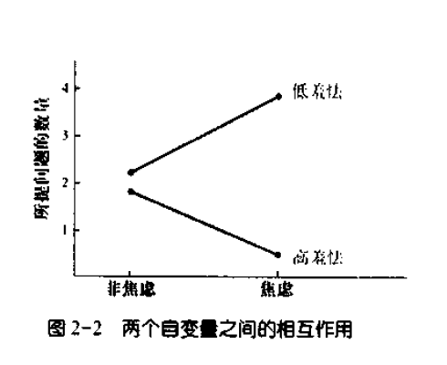
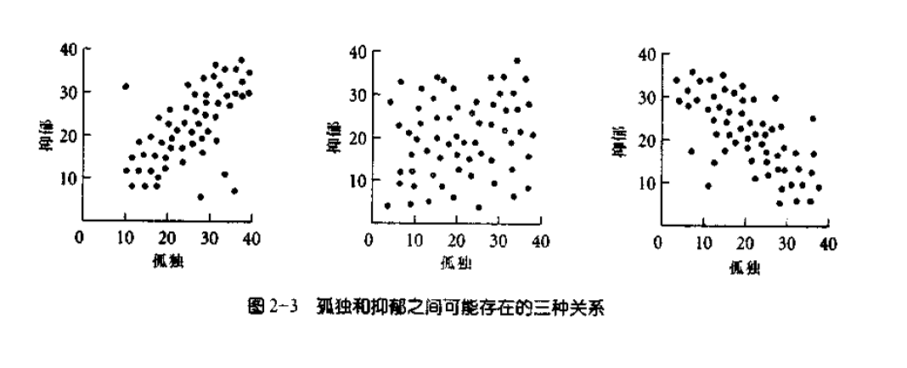

[TOC]
# 假设检验方法

## 理论与假设概述
- 大部分人格研究**起始于理论**，即**对建构与事件间关系的一般性描述**
- 理论解释的**事件范围不同**，有的**广泛**（如弗洛伊德的精神分析理论），有的**狭窄**（如成就动机或父母行为与子女自尊的关系）
- **大理论**有助于理解人格的本质

### 理论的两个主要特征
1. **简约性**（简约律）
   - **最简单能解释现象**的理论是最佳理论
   - 举例：多种理论解释同一行为，简单的理论更受青睐
2. **有用性**
   - 理论需要能提出**可检验的假设**
   - 举例：使用“看不见的妖魔缠身”解释精神失调的不可检验性

### 理论与假设的应用实例
- **孤独感研究**
  - 假设：孤独的人**缺乏社会技能**，难以发展满意的人际关系
  - 预测例子：孤独个体较少主动交谈、自我感觉差、在交谈中出现不恰当言论更多
  - 检验方法：记录交谈内容，统计**恰当反应与问题的次数**

### 理论检验的重要性
- 理论通过研究得到的**支持大小**决定其对科学的贡献
- 多个预测**被实证研究支持**，理论描述更可信
- 预测**频繁失败**，可能导致新理论的提出或原有理论的修正

### 假设检验的途径
- 大多研究基于**可检验预测的理论**开始
- **自下而上的研究方法**（不基于理论）
  - 举例：跑步时分心使跑步更易忍受的假设检验
- 基于理论的研究**更具创造性和广泛应用**
  - 举例：注意焦点与压力影响理论，及其在多个场景下的应用（如催眠、适当锻炼减轻分娩痛苦）

### 非理论研究的价值
- 应用心理学家关注**特定情境下的行为**（如市场研究）
- 即便如此，理论出发的研究**更能激发创造性**

## 实验变量
### 自变量与因变量的定义
- **自变量**（Independent Variable，IV）：实验中**由研究者操纵的变量**，用于**分组**
  - 例子：药物剂量、被试者的焦虑程度、对被试者的说话方式
  - 特别的例子：**焦虑水平**作为自变量，不同组被试者**面对不同情境**（批评者、支持者、无发言）
  - 自变量**也称为“处理”变量**
- **因变量**（Dependent Variable，DV）：实验者**测量的变量**，用于**比较不同实验组**
  - 例子：焦虑研究中，测量参与者**提出问题的数量**
  - 因变量**也称为“结果”变量**

### 自变量与因变量的应用
- **焦虑研究实例**：
  - 设计：将焦虑程度分为高、中、低三组，测量各组对未知事件询问问题的数量
  - 结果：高焦虑组提问最多，低焦虑组提问最少，差异归因于焦虑水平的不同

#### 复杂变量的例子
- **信息搜索实验**：
  - 实验者根据**参与者的羞怯程度分组**，探究羞怯与非羞怯人群在焦虑情境下的信息寻求行为
  - 假设修正：焦虑导致**信息寻求**，但这一行为主要出现在**非羞怯的人**中
  - 设计：分为焦虑/非焦虑组，每组再分为羞怯/非羞怯亚组，测量**提问数量**
  - 结果表明：**提问数量的多少**取决于羞怯程度，展现了变量间的相互作用

### 变量间的相互作用
- **相互作用**：一个变量对因变量的影响，受到另一个自变量水平的制约
  - 例子：焦虑水平对提问数量的影响，受到参与者羞怯程度的影响

## 操纵的与非操纵的自变量
### 操纵的自变量
- **定义**：研究中，研究者**主动操控的变量**
- **目的**：通过随机分配参与者到不同条件下，排除个体差异的影响，**确保实验的公正性**
- **例子**：
  - 研究暴力电视节目与攻击行为的关系，随机让一部分参与者观看暴力电视节目，另一部分观看棒球比赛，第三组不观看任何节目
  - 通过比较不同组的攻击行为差异，确定观看暴力电视节目对攻击性的影响

### 非操纵的自变量
- **定义**：研究中，研究者**未主动操控而自然存在的变量**
- **挑战**：无法通过随机分配排除先天个体差异，导致**因果关系难以确定**
- **例子**：
  - 比较经常观看暴力电视节目与偶尔观看者的攻击行为，发现**前者攻击性更高**，但不能确定是**观看暴力节目**导致的还是因为**这些人本身更具攻击性**
- **解决方法**：尽管难以操纵某些变量，研究者会**尝试控制已知差异**，如通过匹配教育水平等方式来减少组间先天差异的影响

### 操纵与非操纵自变量的影响
- **因果关系的确定性**：使用**操纵的自变量**更容易确定因果关系
- **研究的局限性**：某些情况下，因成本、伦理等原因，不可能或不适宜操纵自变量，此时**只能使用非操纵的自变量**
- **实践意义**：即使使用非操纵的自变量，**也能提供有价值的见解**，尤其是在人格研究中，但在得出因果结论时需要**更加谨慎**

## 个案研究法
### 个案研究法的定义与使用
- 个案研究法深入考察**单个或少数个体**（常为**心理失调患者**）的经历、行为及其变化
- 通常提供**描述性资料**而**较少使用数字和统计分析**
- 许多人格理论的形成，如**弗洛伊德的精神分析理论**，基于个案研究
- 举例：弗洛伊德对患者安娜O的观察、高尔顿·奥尔波特的特质理论、卡尔·罗杰斯的人本主义心理学理论

### 个案研究法的优点
- 适合考察**罕见个案**，如政治谋杀者或多重人格患者
- 有助于**理解复杂概念**，如弗洛伊德的无意识心理
- 对理解**人格本质假设和治疗方法**提供独特见解
- 通过对病人的治疗过程描述，展示**治疗方法的效果**

### 个案研究法的缺点
1. **难以推广**
   - 一个个案的行为不代表所有人的行为
2. **因果关系不明确**
   - 举例：恐水症患者的早期水中创伤经历可能与恐水症有关，但无法确定无此经历就不会发生恐水症
3. **研究者的主观判断**
   - 研究者的偏见可能影响结果的客观性，如弗洛伊德的理论受到批评

### 个案研究法的适用情况
- 适合**罕见或特殊个案**的研究
- 适合**初步探索**可能的治疗方法或证明某些行为的**可能性**
- 在**无法用实验方法**检验的**复杂概念理解**中尤为重要

# 数据的统计分析
## 统计显著性的概念
- **统计显著性**用于区分观察到的差异是由**真实效应**还是**偶然变化**造成
- 通过统计检验估计差异发生的**偶然性大小**

### 常用的统计检验方法
1. **方差分析**（ANOVA）
2. **卡方检验**（Chi-square test）
3. **相关系数**（Correlation coefficient）

### 统计显著性的应用示例
- 通过比较两种服务方式得到的小费的平均数差异来判断哪种更优
- 差异的统计显著性表示**真实效应的存在**，非由偶然变化造成

### 判断统计显著性的标准
- 心理学领域常用的显著性水平是**0.05**
- 即如果差异有5%或更小的可能是由偶然变化造成，则认为是统计显著的

# 相关系数
## 相关系数简介
- 相关系数是评估两个变量之间**关系强度和方向**的统计方法
- 常用于**人格研究**，帮助了解不同心理特质之间的联系

### 如何使用相关系数
- 当研究**两个测量结果**（如孤独和抑郁）之间的关系时，**相关系数**显得尤为重要
- 通过比较两个量表（如孤独量表和抑郁问卷）的得分，可以揭示**两种特质之间的关联**

## 相关系数的结果解读
- **相关系数**的值介于-1.00到1.00之间
- 值越接近-1.00或1.00，表示两个变量之间的关系**越紧密**

### 相关关系的三种可能结果
1. **正相关**：一个变量的高值预示另一个变量的高值（或低值预示低值），相关系数为正值，如0.60
2. **无相关**：两个变量之间没有明显的关系，相关系数接近0.00
3. **负相关**：一个变量的高值预示另一个变量的低值，相关系数为负值，如-0.60

### 示例分析
- **孤独与抑郁**：呈现**正相关**，孤独分数高的个体在抑郁量表上也得分高
- **孤独与善交际**：可能呈现**负相关**，孤独分数高的个体在善交际量表上得分低

# 研究中可能出现的问题
## 混淆现象
- 混淆现象指在实验中，除了**自变量**之外，还存在**另一个变量**影响结果，使得得出的结论**可能不可靠**

### 混淆现象的典型例子
- 一个人连续几天喝不同种类的酒加水，最后错误地得出不喝水就不会醉的结论
- 这个故事反映了喝酒和喝水**两个变量被混淆**，导致**错误的归因**

## 实验中的混淆变量
- 当实验中存在**影响结果的未控制变量**时，难以准确判断因变量的变化是由哪个变量引起的

### 混淆变量的影响
1. **习得无助理论实验**：研究**抑郁与控制感**的关系时，噪音控制的能力和噪音的强度被混淆
   - **不能控制噪音**的被试表现出**类似抑郁的行为**
   - 但实验初期未能区分这些行为是由**控制能力的缺失**还是**噪音的大小**引起

### 解决混淆变量的方法
- 保证除了研究的自变量外，其他条件**对于所有实验组都相同**
- 例如，在习得无助理论的后续研究中，确保所有参与者接受**相同强度的噪音**，仅改变控制噪音的能力

### 混淆变量的识别与控制重要性
- **识别并控制混淆变量**对于实验的准确性和结论的有效性**至关重要**
- 通过精心设计实验，确保因变量的变化确实反映了自变量的影响

## 研究中的比较组
### 比较组的重要性
- **比较组**（控制组）是研究设计中**未接受任何实验处理的参与者组**
- 通过比较实验组和比较组的结果，可以**确定实验处理的效果**

#### 为什么需要比较组
- 有助于区分**实验处理的效果**与**其他未控制因素的影响**
- 确保研究结果的**可靠性和有效性**

### 情绪与攻击性的研究示例
- 实验分为**抑郁组和高兴组**，分别测量他们的攻击性水平
- 发现抑郁组攻击性得分高于高兴组，但**不确定**是抑郁导致攻击性增强还是高兴减少攻击性

#### 添加比较组的优势
- 引入**未接受处理的比较组**，提供了更全面的结果分析基础
- 可以更准确地判断抑郁和高兴对攻击性的具体影响

#### 可能的研究结果解读
1. **结果1**：抑郁组和比较组攻击性几乎相同，高兴组较低，可能表明高兴减轻了攻击性
2. **结果2**：抑郁组攻击性最高，比较组居中，高兴组最低，表明抑郁增强而高兴减轻了攻击性
3. **结果3**：抑郁组攻击性高，比较组与高兴组相似，可能说明抑郁增强了攻击性

## 事前预测与事后认识
### 事前预测的重要性
- 事前预测指**在事件发生前对结果做出的预测**，被视为**专业知识**的体现
- 例如，在篮球比赛前预测哪队会赢及原因，显示出对比赛**深入的理解**

### 事后认识的局限性
- 事后认识是指**在事件发生后才提出解释**，这种做法的问题在于**缺乏预见性**
- 任何人都能在事后提出**看似合理的解释**，但这**并不代表**具有深刻的理解或预测能力

#### 科学研究中的应用
- 科学研究强调**事前预测的重要性**，即在获得数据前基于理论做出假设
- 事后假设（即在知道结果后提出的假设）**不能得到科学验证**，因为它们未经事前测试

#### 实际示例
- **自尊与助人行为研究**：研究者事后解释高自尊人群帮助他人是为了保持自我评价，或低自尊群体通过助人改善自我形象，这些解释并未事前设定，因而缺乏科学支持
- **股市分析**：分析家事后根据股市涨跌解释总统讲话的影响，这种解释缺乏预测性和一致性

## 重复实验
### 重复实验的必要性
- 即便是设计严谨、发现有统计意义的实验结果也**不应直接视为科学事实**
- 一次实验的结果可能由**多种因素**导致，包括样本特殊性、时间特定因素或偶然性

#### 统计显著性的误解
- **0.05的统计显著性标准**意味着每20次实验中**可能有一次是偶然结果**

### 重复实验的作用
- 增加了**结果反映真实关系的确定性**
- 通过**在不同人群中重复**，可以验证效应是否普遍适用

### 实验重复的难点
1. **不同人群中效应的差异**
   - 初次实验与重复实验的被试者差异可能导致不同的结果
2. **文件柜问题**（Rosenthal，1979）
   - 研究者倾向于只报告发现显著效应的研究，未成功的重复实验往往未被发表

# 人格评价
## 信度
### 信度的定义
- 信度描述一项测验测量结果的**一致性和可靠性**
- 高信度意味着**在不同时间的测量结果**具有一致性

### 测验信度的重要性
- 信度直接影响测验结果的**可信度和有效性**
- 高信度的测验能够反映**被测者的真实特质和状态**

## 测验信度的类型
### 时间上的稳定性（再测信度）
- 指测验在**不同时间点**的测量结果**是否一致**
- 通过计算两次测验结果的**相关系数**来评估
- 相关系数**越接近1.00**，信度越高

### 内部一致性信度
- 测量测验**内部各项是否测量同一概念**
- 使用**统计方法**（如内部一致性系数）来评估
- 系数值**大**，表示测验各项一致，测量同一概念

## 信度系数的解读
- 信度不是绝对的“是”或“否”，而是一个**相对水平**
- 0.90的再测信度系数通常被认为是足够的
- 0.20的信度系数被认为是太低
- 信度系数在0.50到0.60之间是否可接受取决于**研究需求和可用的更可靠测验**

### 信度的实际应用考量
- 某些测量概念**本质上可能具有低信度**，如年幼儿童的测验
- 儿童的心境、注意力或努力程度的变化可能限制了测验的信度

## 信度评估的实例
- 如果一个测验在一周后重测结果与第一次大不相同，说明该测验的信度低
- 测验编制者应提供关于测验**时间稳定性和内部一致性**的信度资料

## 效度
### 效度的定义
- 效度指的是测验所测量的内容**在多大程度上符合原本要测量的东西**
- 关注的是测验的内容**真实性而非其一致性**（与信度不同）

### 效度的类型
#### 表面效度（Face Validity）
- 从测验内容上看，测验**是否看起来能够测量**它所声称的构造
- 例如，关于社会焦虑的问题可能直观上就具有好的表面效度

#### 相容效度（Convergent Validity）
- 一项测验结果与**其他测量同一构造**的测验结果之间的**相关程度**
- 高相关表明两测验测量相同的概念，具有好的相容效度

#### 区别效度（Discriminant Validity）
- 测验结果与**理论上应不相关**的其他测量之间的**不相关程度**
- 低相关性表明测验与不相关构造无关，因此具有好的区别效度

#### 行为效度（Criterion Validity）
- 测验分数**能否预测**特定行为或结果
- 例如，果断性量表的分数是否能预测人在特定情境下的果断行为

### 效度的评估和重要性
#### 效度的评估
- 效度不仅仅是**有或没有**，而是测验的效度**在多大程度上被展示出来**
- 研究者通过不同方法评估测验的各种效度，以确保测验能准确测量目标构造

#### 效度的实际应用
- 在使用任何测验之前，心理学者应考察该测验的信度与效度资料
- 确保测验在实际应用中能够满足研究或实践的需要

### 效度和信度的关系
- 即使一项测验具有高信度，如果缺乏效度，其实用价值也会受到质疑
- 高效度的测验能够确保测量结果的**真实性和适用性**

