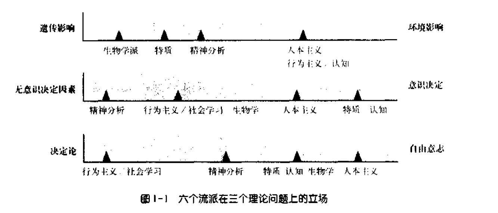

[TOC]
# **人与环境**

## **人的独特性**

- **高尔顿·奥尔波特**：强调**每个人的独特性**，认为**没有两个完全相同的人**
- 个体行为受到**个人特质和环境因素的共同影响**

## **行为的决定因素**

- 心理学长期探讨行为是由**情境**决定还是**个人特征**决定
- **俄克拉何马惨案**被用作例子，探讨人们的反应是**由事件触发**还是**由内在人格决定**
- 现代观点认为行为由情境和个人特征**共同决定**，反应**因人而异**

## **心理学研究的分类**

### **环境对行为的影响**

- **社会心理学家**通过**创设不同情境**，研究哪些情境会增加或减少助人行为

### **个人特征的影响**

- **人格心理学者**关注为何不同人**在相同情境下会有不同反应**
- 探讨人与人之间的**微小差异**如何产生**重大影响**

## **人格心理学的探讨内容**

- 了解不同个体之间的**差异**，如交友能力、情绪状态、职业成就、性格类型（内向与外向）
- 研究人格如何影响对催眠、压力反应、学业成绩和健康状况等的反应

# **人格的定义**

## **人格心理学的挑战**

- 心理学家对“什么是人格”**没有统一答案**，人格心理学领域的描述和研究范围仍在讨论中
- 人格理论家对人格心理学应研究的内容有**不同观点**，如无意识机制、学习过程、思维组织等
- 这种多样性虽然可能让学生**感到困惑**，但也提供了探索人的复杂性的**丰富框架**

## **人格定义核心要点**

### **稳定的行为方式**

- 人格被视为个体行为的**稳定模式**，这些行为模式在不同时间和情境下可被识别
- **稳定性**意味着**个体的行为模式一致**，如一贯的开朗或竞争倾向
- 虽然人格体现行为的**一贯性**，但**并不意味着**人在任何情境下行为都不变

### **人际过程**

- 人格不仅包括**稳定的行为模式**，还涉及发生在个体之间的**人际过程**，如情绪、动机、认知过程
- 人格心理学家对**情绪过程**（如抑郁、愉快）和KV**认知过程**（如信息加工）特别感兴趣
- 人格的形成既受**共有的心理过程**影响，也受**个体如何应用这些过程**的差异影响

## **个体与环境的互动**

- 人格的形成受到**内在因素和外部环境**（如父母养育方式）的共同影响
- 行为不仅是**对外部情境的反应**，个体对恐惧等情绪的**表达和应对方式**体现了**内在人格特质**

# **人格的六个理论流派**

## **基本观点**

- 人格心理学家从不同角度探讨人格形成的根源，形成了**六大理论流派**
- 这些流派分别是：**精神分析学派、特质学派、生物学派、人本主义、行为主义和社会学习理论、认知学派**
- 每个流派都识别并阐述了人格的一个**重要方面**，但它们之间的解释有时**不相容**

## **理论流派解释**

### **精神分析学流派**

- 强调**无意识心理**对人格形成的影响

### **特质学流派**

- 侧重于**人格特质**在人格差异中的作用

### **生物学流派**

- 用**遗传和生理过程**解释人格差异

### **人本主义流派**

- 认为**责任感和自我认同感**是人格差异的主要原因

### **行为主义和社会学习理论流派**

- 将稳定的行为模式视为**条件反射和心理预期**的结果

### **认知学流派**

- 通过**信息处理方式**解释行为差异

## **理论流派的互补性与冲突**

- 虽然各流派在某些问题上提供了**可以互相补充**的解释，但在很多情况下，它们的解释是**不相容的**
- 研究可能支持某一理论而非另一理论，但许多研究结果可以在各种流派中得到解释

## **例子分析**

### **攻击性的解释**

  - **特质论**：认为攻击性是一种**稳定的个人特质**
  - **认知解释**：攻击性取决于人们**如何解释他们所处的情境**；某些人可能将模糊情境解释为威胁
  - **行为主义和社会学习论**：人们可能因**过去的经历**而学会攻击性反应
  - **生物学流派**：某些人可能**天生就有**对威胁反应攻击的倾向
  - **精神分析流派** 和 **人本主义流派**：**环境和个人成长背景**也影响攻击行为

### **抑郁的解释**

- **精神分析学派**：抑郁是**转向内心的愤怒和无意识的敌意感**
- **特质理论家**：一些人**天生更易抑郁**，这可以通过**情绪气质和抑郁历史**预测
- **生物学流派**：抑郁可能有**遗传敏感性**，**特定基因**与抑郁反应有关
- **人本主义流派**：抑郁与**自尊低下**有关，特别是当人们不能建立良好的自我价值感时
- **行为主义和社会学习流派**：抑郁可能由生活中**缺乏积极强化**或感到自己**无法控制环境**所致
- **认知流派**：抑郁由个人**对不可控制事件的解释方式**决定，如将自己看作无能的人更易抑郁
  - 抑郁的**认知图式**使得人们用可能导致抑郁的方式解释世界，容易回忆起不快体验

## **综合理解**

- **没有**单一的理论流派能完全解释人格的复杂性
- 理解人格可能需要**综合多个流派的观点**
- 学者和学生可以根据个人倾向和理解，**选择不同流派**来解释不同的心理现象，无需将自己限定在单一理论流派内

# **人格与文化**

## **文化对人格的影响**

- 文化差异对人格发展有**重要影响**，心理学家认识到人格存在于**特定文化背景**中
- 文化差异导致了人格**研究方法和理论的多样性**

## **个体主义与集体主义文化**

### **个体主义文化**

- 北欧国家和美国等国家强调**个人需求和成就**
- 个人视自己为**独立和独特的存在**

### **集体主义文化**

- 亚洲、非洲、中南美洲等地区强调**群体归属感**
- 人们更重视**合作和群体成功**，个人成就感来自群体的成就

## **文化差异下的人格研究**

- 西方的人格心理学研究方法和概念在不同文化中具有不同的含义
- **自尊和成就**的概念在集体主义文化中可能不适用或含义不同
- **心理健康**的标准和诊断在不同文化中有所差异

## **文化局限性与普遍性**

- 许多理论和研究**基于个体主义文化**，但其适用性在不同文化中存在差异
- 在某些情况下，研究发**现跨文化的一致性**，而在其他情况下则发现了**显著的文化差异**
- 理解文化局限性和现象的普遍性对于深入理解研究概念本质至关重要

# **人格的学习：理论、应用、评价和研究**

## **理论**

### **人格理论的基础**

- 人格理论起始于**对人格结构和功能的综合全面描述**
- 理论家们探讨**人格差异形成的机制**以及**人格如何影响个体行为**

### **主要探讨问题**
#### **遗传对环境的影响**

##### **遗传与环境的争论**

- 探讨人格发展是**由遗传决定**还是**环境塑造**
- 多数理论家认为人格受遗传素质和环境因素**共同影响**

##### **理论家观点差异**

- **生物学流派和特质流派**：强调**遗传倾向性**的重要作用
- **精神分析学派**：部分强调**与生俱来的需要**
- **人本主义流派、行为主义和社会学习理论、认知理论家**：认为**遗传影响有限或无影响**

#### **意识决定行为还是无意识决定行为**

##### **意识与无意识的角色**

- 讨论人们**是否能完全理解**自己行为的原因
- **西格蒙特·弗洛伊德**：认为许多行为**受无意识力量控制**
- **B.F.斯金纳**：认为人们对自己行为的**理解有限**

##### **理论家的不同立场**

- **特质理论家和认知理论家**：依赖自我报告，**假设人能理解**自己的行为
- **人本主义理论家**：采取折中立场，认为**人部分了解**自己的行为

#### **自由意志对决定论**

##### **行为的自主性**

- 探讨人们的行为是自由选择还是由外部力量决定
- **行为主义/社会学习流派**：认为行为**由环境刺激**决定，斯金纳认为**自由意志是幻觉**
- **精神分析学派**：强调**内在需求和无意识机制**的影响

##### **不同理论家的观点**

- **人本主义理论家**：强调**个人选择和责任感**
- **特质流派、生物学流派和认知学派**：介于两极之间，认为**遗传素质**设定发展范围，但人格**不完全受遗传控制**

## **应用**

### **心理治疗**

- 不同的人格理论导致了**多样的治疗方法**
- 治疗方法取决于**对人格本质的理解**

### **教育、职业和社会适应**

- 人格理论帮助**解决教育、职业选择和社会适应**等实际问题
- 心理学者通过理解人格差异来设计**适宜的环境和干预措施**

## **评价**

### **人格测量的重要性**

- **理论概念的测量**对于理论的应用和发展至关重要
- 不同的人格理论采用**不同的评价方法**来测量人格特征

### **评价方法**

- **自我报告问卷**：适用于**特质理论和认知理论**
- **无意识测量**：**精神分析学派**使用模糊刺激的解释来评估无意识特质
- **行为观察**：**行为主义者**通过直接观察外显行为来评估人格

## **研究**

### **研究的普遍性**

- 所有人格流派都致力于通过**科学研究**来验证和发展其理论

### **研究设计与方法**

- 研究设计取决于**理论的核心原理和假设**
- 心理学家使用**多种研究方法**来探索人格相关的问题

### **实验设计和陷阱**

- 研究者需**精心设计实验**以避免偏见和误解
- **理解研究设计的基本原则**对于评估研究结果的有效性至关重要