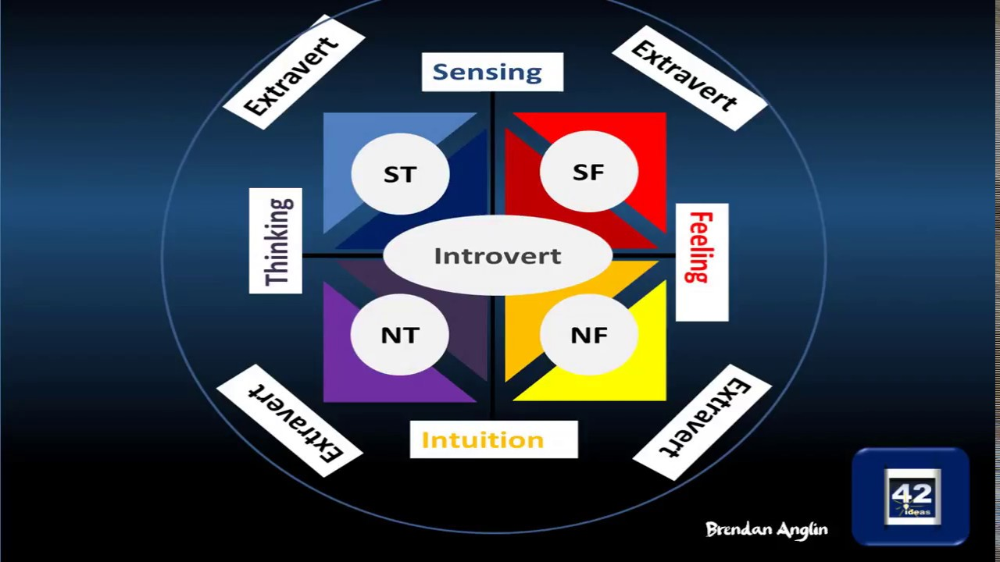

[TOC]
# 弗洛伊德理论的局限和问题
## 新弗洛伊德主义对弗洛伊德理论的批评
### 童年决定论的局限
- 新弗洛伊德主义者认为，人格的发展**不仅仅在童年期完成**，**青春期**和**成年早期**的经历同样重要
- 他们认为人格是在**整个生命周期**中持续发展和变化的
- 弗洛伊德的观点被视为**过于局限**，**无法解释**成年期发生的人格变化

### 本能影响论的质疑
- 新弗洛伊德主义者挑战了弗洛伊德关于**本能在人格形成中的主导作用**的看法
- 他们强调**社会文化因素**在人的发展过程中扮演的**重要角色**，特别是在**性别角色和人格差异**的形成上
- **凯伦·霍尼**（Karen Horney）等人认为，**文化背景和社会环境**对人格发展的影响被弗洛伊德低估

### 对弗洛伊德消极人性观的反思
- 新弗洛伊德主义者批评弗洛伊德**过于强调人格中的消极面**，描绘了一幅**悲观的人类本性图像**
- 他们倾向于采取**更积极的人性观**，强调**自我意识和积极特征**在人格发展中的作用
- 后来的理论家提出**成长经历和实现潜能时的满足感**，对人的**积极面**给予了更多的重视

# 阿尔弗雷德·阿德勒
## 阿德勒的个体心理学贡献
### 寻求优越的动机
- 阿德勒认为人**从出生起就有自卑感**，这种感觉来自于**儿童时期的弱小和对成人依赖的体验**
- 他提出的**寻求优越**（Seeking Superiority）是人的主要动机，意味着人生的行动和目标旨在**克服自卑感并追求优越感**
- 阿德勒认为，所有人类行为的动机**都可以归纳为对优越感的追求**，这是解决生活中所有问题的**根本方法**

### 自卑与优越感
- 阿德勒强调，人们**通过追求成就来克服自卑感**，并**建立优越感**
- 他指出，自卑感的**程度不同**会导致人们**以不同方式寻求优越感**，**极度的自卑**可能导致**无助感**而不是驱动力
- 阿德勒通过**个体案例**（如富兰克林·德拉诺·罗斯福）说明，有时是自卑感驱使人取得伟大的成就

### 公众利益与个人调节
- 阿德勒区分了**心理健康与成就**，认为心理健康的人是那些能**通过促进公众利益来寻求优越感**的人
- 成功的个体应该是**通过他们的努力为社会带来利益**，而不仅仅是追求个人的名誉和满足
- 那些通过**损害他人利益**来寻求优越感的人被视为**自我调节能力差**的表现，而那些**寻求权利以帮助他人**的人则展现了**良好的自我调节**

## 父母对人格发展的影响
### 溺爱的影响
- 阿德勒认为**溺爱**（Pampering）会导致儿童**失去独立性**，增强**自卑感**，进而**影响成年后的人格发展**
- 溺爱表现为对孩子**过分保护和关注**，如**过度干预**孩子的自我尝试和探索，导致他们长大后**无法独立解决问题和面对挑战**
- 早年被溺爱的孩子成年后表现为**缺乏自信、犹豫不决、过度敏感、缺乏耐性和依赖他人**

### 忽视的影响
- 阿德勒将**忽视**（Neglect）定义为对儿童**缺乏必要的关注和照顾**，认为这会导致孩子长大成人后**冷漠、怀疑他人**，难以建立良好的人际关系
- 忽视的孩子可能**对亲密关系感到不适**，对他人的感情**无法给予适当的回应**，表现为**极端自我中心或过分依赖他人**
- 忽视或溺爱导致的生活模式通过**心理治疗**可能得到改善，但前提是**认识到自己的行为对他人的伤害**

### 平衡的养育方式
- 阿德勒建议父母**鼓励孩子的独立性**，让孩子**自己做决定并允许犯错**，这样有助于孩子发展成为**自信和独立的成年人**
- 适度的关注和支持可以帮助孩子建立起**自我价值感和社会责任感**，避免因忽视或溺爱造成的人格问题
- 父母的养育方式应**避免走向任何极端**，平衡**关注与放手**，以**促进孩子健康的人格发展**

## 阿德勒关于出生顺序的理论
### 头生儿童的特点
- 阿德勒认为**头生儿童**（Firstborn children）一开始受到父母的**过度关注和溺爱**，但随着第二个孩子的出生，他们的**关注度降低**，导致头生儿童出现**较强烈的自卑感**
- 头生儿童因为“**被废黜**”，在努力赢回父母关注的过程中，可能出现问题行为，如成为“问题儿童、神经病患者、罪犯、酒鬼和性反常者”
- 他们可能因为**过度的自卑感**而在成人后展现出**对权力和成就的强烈渴望**

### 中间儿童的特点
- 阿德勒认为**中间儿童**（Middle children）发展出**强烈的竞争**和**寻求优越**的特性，总是努力超越他们的兄弟姐妹
- 由于没有像头生或末生儿童那样受到特别的溺爱或忽视，中间儿童在社交和适应方面可能更加**灵活和独立**
- 中间儿童的生活中充满了**与他人比较和竞争的驱动力**，这种特性可能贯穿他们的一生，促使他们在职业和个人成就上**不断前进**

### 末生儿童的特点
- **末生儿童**（Youngest children）在家庭中通常**受到过度的溺爱**，由于家庭成员的保护，可能会变得**非常依赖他人**
- 他们可能因为**自卑感**强烈而**缺乏独立性和创造力**，因为他们周围的人都比他们大，比他们强壮
- 末生儿童因为一直是家中的“宠儿”，在面对外界挑战时可能会遇到**更多困难**，不容易建立起**独立和自信**

### 出生顺序理论的限制
- 尽管阿德勒的出生顺序理论在某些研究中**得到支持**，但**并非所有研究结果都一致**，说明出生顺序与人格发展的关系**复杂且受多种因素影响**
- 出生顺序对人格的影响是**存在的**，但它仅是影响人格发展的**众多因素之一**，其他社会文化因素也发挥着重要作用
- 阿德勒的理论强调了**家庭环境和教养方式**对个体发展的重要性，但需要更多的研究来细化和验证出生顺序对人格特质的具体影响

# 卡尔·荣格
## 集体无意识
### 集体无意识的定义
- 荣格提出了**集体无意识**（Collective Unconscious）的概念，认为除了**个体无意识**外，人类头脑中还有一个**特殊部分**，是**所有人共享的无意识素材**
- 集体无意识由**与生俱来的心理特征**构成，这些特征是从祖先那里继承下来的，包含了**人类共同的经验和记忆**
- 荣格认为集体无意识包含了**人类文化和经验的普遍主题**，这些主题在不同文化和历史时期中以**相似的形式**出现

### 原始意象（Archetypes）
- 集体无意识中的核心组成部分是**原始意象**，荣格将其定义为一种**心理上的准备状态**，使人类能以特定方式对外界进行反应
- 原始意象是**无意识中的预设模式**，影响人们的感知、情感和行为，荣格列举了诸如母亲、父亲、智慧老人、英雄等多种原始意象
- 荣格认为，原始意象是**人类对世界反应和理解的基础**，它们在人类的艺术、宗教和梦中以**象征性的形式**出现

### 集体无意识与人类行为的关系
- 荣格通过集体无意识的概念解释了人类为何能够自然而然地**认识母亲**、**对黑暗产生恐惧**以及**接受超自然存在**的观念
- 他认为新生儿对母亲的识别和依恋、以及对黑暗、神的普遍反应，都是由于**集体无意识中原始意象的作用**
- 集体无意识理论提供了一个框架，用以理解**人类文化和心理现象中的共通性**，显示了人类心理深层的共享基础

## 一些重要的原始意象
### 女性和男性原始意象
- **女性原始意象（Anima）**：代表**男性心中的女性方面**，是男性**选择浪漫伴侣**和**建立关系**的**内在指引**
- **男性原始意象（Animus）**：代表**女性心中的男性方面**，同样指导女性在选择伴侣和建立关系时的**无意识偏好**
- 荣格认为恋爱中的“**情人眼里出西施**”现象，其实是个人无意识中的女性或男性**原始意象投射到他人**身上的结果

### 阴影
- **阴影（Shadow）**：人格中的**阴暗面**，包括个人无意识中**被压抑的消极情感**和集体无意识中**人类遗留的恶的一面**
- 荣格将阴影视为**人类共有的原始意象**，它体现在不同文化的神话、传说中的恶的人格化形象
- **阴影的接受与整合**对个体的心理健康至关重要，未被接受的阴影部分可能导致人们**将自身的消极特质投射到他人身上**

### 自我
- **自我（Self）**：代表个体的**整体性和独特性**，是一个有机的、统一的原始意象，与弗洛伊德的自我（Ego）**共同作用**
- 自我原始意象负责形成**个体的整体感和独一无二的感觉**，是人格完整和自我实现的关键
- 当人们感到内心“被撕裂”或“分裂”时，表示**自我原始意象受损**，需要通过**自我探索和整合**来恢复心理健康和完整性

## 荣格理论的集体无意识证据
### 集体无意识的来源
- 荣格的理论不是基于实验室的实验，而是通过对神话、文化象征、梦境和精神病患者的行为进行**广泛研究**得出的
- 他认为，如果所有人都有**共同的集体无意识**，那么不同文化和历史时期应该能找到**相似的原始意象**
- **原始意象**（Primordial Images）在梦中、艺术象征、民间传说和神话故事中**频繁出现**，**精神病患者的表达**也常基于这些原始意象

### 集体无意识的证据
- 荣格通过展示**特定形象和象征物**来证明集体无意识的存在，如同一种形象在现代人梦中和他们不熟悉的古代神话中拥有**相同的象征意义**
- 他引用了与精神分裂症患者的对话和古代希腊神话的**相似性**来说明集体无意识中的想象如何**跨越文化和时间**
- 荣格的研究方法虽然**不同于传统科学方法**，但他对文化、神话和心理疾病的深入探索提供了**对人类行为重要组成部分的见解**

### 荣格理论的接受度
- 荣格是新弗洛伊德主义者中**产量最高**的作家之一，他的理论涵盖了人类行为的**多个方面**
- 尽管他的理论和术语给一些初学者**带来挑战**，但他独特的理论风格和对人类深层心理结构的洞察使他的作品**广受欢迎**
- 与其他新弗洛伊德主义者相比，荣格的作品更具**神秘色彩**，但正是这种独特性让他的理论在多年后仍然具有吸引力和影响力

# 埃里克·埃里克森
## 埃里克森的自我理论
### 自我概念的新解释
- 埃里克森认为自我不仅仅是**本能冲动和超我需求**之间的传递者，而是**执行建构功能的独立部分**
- 他强调自我在建立**自我认同感**（Self-Identity）和控制外部环境中的重要作用
- 他的理论因此被称为**自我心理学**（Ego Psychology），突出了**自我在人格发展中的核心地位**

### 自我认同感的建立
- 自我认同感是个体感、唯一感、完整感以及过去与未来的连续性的**复杂内部状态**
- 埃里克森将自我认同的**混乱和失望状态**称为**自我认同危机**（Identity Crisis）
- **自我认同危机**虽然**常见于青春期**，但**不限于年轻人**，许多中年人也可能经历类似挑战

### 认同危机的社会背景
- 埃里克森认为**社会动荡期**更易引发个人认同危机，如剧烈社会变迁、战争威胁等
- **当代社会**快速变化可能使人**特别容易出现**认同危机，但埃里克森指出变化一直是**我们记忆中的常态**
- 他的观点提示我们认同危机**并非新现象**，而是个人在适应不断变化的社会环境中的**自然反应**

## 生命周期中的人格发展理论
### 整个生命周期中的人格发展
- 埃里克森认为人格**在人的一生中持续发展**，并提出了8个发展阶段
- 每个阶段都面临着**特定的心理社会危机**，解决这些危机的方式将影响个人的人格发展方向
- 这些阶段包括**从婴儿期到老年期**的全生命周期

### 八个发展阶段的危机与特点
#### 基本信任对不信任 (Basic Trust vs Mistrust)
- 形成于**婴儿期**，关键在于**是否得到了充满爱的照料**
- 成功解决会产生**基本信任感**，失败则产生**基本不信任感**

#### 自主性对羞愧和怀疑 (Autonomy vs Shame and Doubt)
- 形成于**幼儿期**，关键在于**孩子是否被鼓励探索和独立**
- 成功解决会产生**自主性**，失败则导致**羞愧和怀疑**

#### 主动性对内疚 (Initiative vs Guilt)
- 形成于**学龄前期**，关键在于**孩子是否被鼓励自发地追求目标**
- 成功解决促进**雄心壮志和目标感的形成**，失败则导致**内疚**

#### 勤奋对自卑 (Industry vs Inferiority)
- 形成于**学龄期**，关键在于孩子**是否感受到自己的成就和能力**
- 成功解决会形成**勤奋感**，失败则**感到自卑**

#### 自我认同感对角色混乱 (Identity vs Role Confusion)
- 形成于**青春期**，关键在于**是否能成功地探索和确定自己的身份**
- 成功解决导致**良好的自我认同感**，失败则出现**角色混乱**

#### 亲密对孤独 (Intimacy vs Isolation)
- 形成于**早成年期**，关键在于**是否能建立亲密的人际关系**
- 成功解决导致能够**建立深厚的关系**，失败则**感到孤独**

#### 繁殖对停滞 (Generativity vs Stagnation)
- 形成于**中年期**，关键在于**是否关心下一代的成长**
- 成功解决导致**生活丰富和满足**，失败则感到**生活停滞**

#### 自我完善对绝望 (Ego Integrity vs Despair)
- 形成于**老年期**，关键在于**对一生的回顾和接受**
- 成功解决**带来生命的完整和满足感**，失败则导致**绝望**

### 总结
- 埃里克森的生命周期理论强调了从婴儿期到老年期的**连续性人格发展**
- 每个阶段的成功解决带来了**积极的人格特质**，而失败则带来**长期的心理挑战**
- 这一理论提供了一个**框架**，帮助我们理解在不同生命阶段面临的特定心理社会任务和挑战

# 凯伦·霍尼
## 神经症理论
### 霍尼对精神分析的批判和贡献
- 霍尼认为弗洛伊德关于**男性和女性人格差异**的**天生论**是**误导的**，她认为这些差异更多是**文化和社会影响的结果**
- 她强调了**文化和社会对人格发展**的影响，与弗洛伊德的先天内部精神冲突观点相反
- 霍尼的研究重点在于**神经症的形成**，她认为神经症源于**儿童期的不正常人际关系和家庭环境**

### 神经症的三种人际交往方式
#### 接近人群 (Moving Toward People)
- 神经症患者通过**强调自己的无助感和依赖性**来应对焦虑
- 这种方式可以**短期内减轻焦虑**，但最终导致**肤浅的人际关系和无法真正给予爱**

#### 反对人群 (Moving Against People)
- 采用**攻击性和敌意行为**作为对抗不良环境的手段
- 这种风格的患者展现出**攻击他人、维持优越感和控制欲**的需求

#### 离开人群 (Moving Away from People)
- 通过**避免参与**和**与外部世界不和谐**来应对焦虑
- 这种风格的人**回避人际交往**，对情感体验**麻木不仁，避免参与**

### 神经质策略的无效性
- 尽管这三种策略**在短期内可以避免焦虑**，但它们**无法带来满意的人际关系**
- 神经症者过着**空虚的生活**，这是他们为**逃避焦虑**所付出的代价
- 霍尼强调，与神经症患者的关系**不会愉快也不会持久**，但**理解他们的困难和痛苦**对于改善交往很重要

## 女性心理学
### 霍尼对弗洛伊德观点的批判
- 霍尼不赞同弗洛伊德**关于女性的阴茎嫉妒理论**，认为这一理论**对女性是蔑视和误导性的**
- 她用**子宫嫉妒**（womb envy）一词来反驳弗洛伊德，强调**男女各有其独特的优点和能力**
- 霍尼认为男女差异**不是先天的**，而是**社会和文化环境**造成的

### 社会文化因素的影响
- 她指出，在弗洛伊德的时代，妇女被认为**在许多方面不如男人**，这一偏见受到了**文化的深刻影响**
- 霍尼认为，如果男人和女人**都能在社会中自由实现自己的愿望**，那么就**没有理由**认为妇女想要变成男人，或者男人想要变成妇女
- 她认为男女人格差异是**由社会环境造成的**，而非先天因素

### 霍尼的先锋地位和影响
- 霍尼走在了时代前面，提出了比当时社会接受度更高的**关于性别平等的观点**
- 她的理论为后来的**女权主义者**提供了理论支持，促进了**男女平等事业的发展**
- 尽管她未能亲眼看到女权运动的成果，但她的工作为之后的**性别研究和平等运动**奠定了基础

# 哈里·斯塔克·沙利文
## 哈里·斯塔克·沙利文的人格理论
### 人格意象（Personification）
- **焦虑的源头**：沙利文认为，焦虑来自**人际关系**，特别是**母子间的情绪紧张**
- **选择性不注意**：为减少焦虑，人们学会**忽略或拒绝**引起焦虑的信息，导致**对现实的虚假印象**
- **人格意象的分类**：
  - **好的我（Good-Me）**：包括使人**感到安全、被赞扬**的行为，不带焦虑
  - **坏的我（Bad-Me）**：反映**不愿回忆、引起焦虑**的经历
  - **非我（Not-Me）**：代表自我中**被害怕、从自我体系中割裂出来**的部分，保留在**无意识**中

### 沙利文理论的社会学习倾向
- 沙利文的理论桥接了**弗洛伊德的精神分析**和**社会学习理论**，强调人际关系在人格发展中的核心作用
- 他进一步**发展了“自我”概念**，认为自我只有**在人与人的关系中**才具有意义

### 人格发展的焦虑减轻策略
- **焦虑的缓解**：人们通过人格意象中的“好的我”和“坏的我”来**减轻焦虑**，通过“非我”来与自我体系**割裂焦虑引发的部分**
- **对策的代价**：虽然选择性不注意可以**暂时缓解焦虑**，但长期来看会导致人们对现实**产生偏差的认知**

## 沙利文的发展阶段理论
### 沙利文的发展阶段概述
- 沙利文认为人格发展有**七个阶段**，即**发展时期**（Developmental Epochs），包括婴儿期、儿童期、少年期，前青年期、青年前期，青年后期和成年期
- 与弗洛伊德不同，沙利文强调**社会因素在人格发展中的作用**，特别是**青少年时代**对人际关系正常发展的重要性
- 沙利文认为，**解决每个阶段的危机方式**决定了人格发展的方向，影响今后如何解决危机

### 前青年期（Pre-adolescence）
- 开始于**八九岁**，以与同伴**建立亲密关系的新需要**为特点
- 这一阶段的友谊有助于儿童**开始理解别人的需求**，证实**自我价值感**
- 不能体验到这种关系的儿童可能会**感到孤独**，影响**今后的人际关系发展**

### 青年前期（Early Adolescence）
- 伴随着**青春期的生理变化**，出现**异性间的强烈吸引**
- 青少年需要平衡**个人安全、亲密关系和欲望满足**之间的需要
- 父母对青少年性活动的态度可能**加剧他们的自我价值感受到的冲击**

### 青年后期（Late Adolescence）
- 关注投入**令人满意的性活动**，建立**长期关系**，并面对**职业和经济问题**
- **机遇**对青年后期的过渡**至关重要**，**受教育程度**影响顺利进入成年期的机会
- **过去用于减少焦虑的策略**在此阶段可能导致**自我人格混乱**，影响**人际关系和职业能力**

# 艾里克·弗洛姆
### 弗洛姆的背景与兴趣
- **艾里克·弗洛姆**是德国出生的心理学家，后期进入**精神分析领域**
- 弗洛姆对于个体如何**处理焦虑感和避免焦虑的机制**特别感兴趣
- 他的研究受到1930年代**纳粹在德国的兴起**的启发，尤其关注人们为何会对极权领导产生强烈的认同感

### 《逃离自由》的核心观点
- 在《**逃离自由**》（Escape from Freedom）一书中，弗洛姆探讨了现代民主带来的**自由感与个体责任**
- 弗洛姆认为，尽管自由提供了**个体行动的广阔空间**，它也带来了**孤独和无力感**
- 自由可能变成一种**负担**，使得人们感到**隔绝和孤独**，这是因为与自由相关的**个人责任和选择压力**

### 自由的两种应对方式
- 根据弗洛姆的理论，人们通常通过两种方式来应对自由带来的无力感：**逃离自由**或追求“**积极的自由**” (Positive Freedom)
- 逃离自由是指人们**放弃自由**，寻求**依附或服从权威的方式**来减少个体责任和孤独感
- 积极的自由涉及在接受自由的同时，**积极建立生命的意义和目标**，通过**自我实现**来克服无力感

## 逃避的手段
### 权威主义的诉诸
- 弗洛姆认为，个体通过将**自己的个性**融入到**更强大的外在个体或物体**中，来**获得自身所缺乏的力量**
- 这种**权威主义**（Authoritarianism）性格的人将寻求**服从和寻求支配结合起来**，既有**受虐倾向**也有**施虐倾向**
- 例如，在**纳粹党党员**中表现出的这种权威主义性格，他们在服从权力的同时，也对受害者实施施虐，从而在精神上获得满足和依赖于权威人物

### 破坏性行为
- 人们面对生活中恐惧的情境时，可能会选择通过**破坏这些情境**来尝试克服它们
- 这种**破坏行为**（Destructiveness）虽然是**无意识驱动**的，但是它**起源于生活中的焦虑**
- 弗洛姆指出，许多社会行为，如打着爱国和责任的旗号的战争，实际上是**个体无意识**中试图**战胜自己无能感和孤立感**的表现

### 自动舒适装置
- 为避免自由带来的焦虑，大多数人选择了一种**看似安全的生活方式**，即**自动舒适装置**（Automaton Conformity）
- 这种方式使人们通过**模仿他人的行为**，消解了与个人自由相关的恐惧，从而在社会中找到了自己的小壁龛
- 弗洛姆描述这种状态为个体不再是他自己，而是变成了一个**完全按照文化模式行事的人**，这种状态虽然减少了孤独和焦虑，但却**阻碍**了个体性的发展和所谓的“**积极自由**”（Positive Freedom）的实现

## 积极的自由
### 个性化过程
- **个性化**（Individualization Process）开始于儿童**意识到自己是一个独特存在的时刻**
- 随着成长，这种认识**深化**，人们开始**理解并接受**自己的独特特点和性格
- 在做决定时，个体将基于“**我想要做什么**”而不是“别人期望我做什么”，这是**个性化的核心**

### 自发性的重要性
- **自发性** (Spontaneity) 是实现积极自由的关键，使得个人能够**自然地表达情感和智力**
- 弗洛姆描述了如何在欣赏田园风光、观察真理或欣赏落日美景时体验到的自发性感受
- **爱情**表现为自发性的重要部分，通过**真实的情感表达**，个体体验到与他人的深层连接和理解

### 爱的艺术与自我实现
- 在弗洛姆的著作《**爱的艺术**》 (The Art of Loving) 中，他提倡爱是一种**积极的个性化过程**，通过这个过程，个人可以**发展自我**
- 爱不仅是情感的表达，也是个体**与自我和他人建立深刻联系**的方式
- 弗洛姆与**人本主义心理学家**持相同观点，认为**自我认知**和**成为真实的自我**是实现幸福的关键

# 应用：精神分析理论与宗教
## 弗洛伊德对宗教的看法
- 弗洛伊德在他的著作《**幻影中的未来**》和《**文明及其缺陷**》中直接**挑战了传统宗教观点**，认为宗教是**对受教育人士的一种误导**
- 他认为宗教是一种**集体愿望的实现**，源于**婴儿期对强大保护者的渴望**，并因**对命运的恐惧**而持续存在
- 弗洛伊德将宗教描述为一种**精神病**，是人们为了保护自己**免受不可预测世界伤害**的一种**心理防御机制**

## 荣格对宗教的解释
- 荣格认为，宗教**不是一个可以科学解答的问题**，而是探索人类**为什么有宗教需要**的一个领域
- 他提出每个人的**集体无意识**中都有一个**原始的上帝意象**，这使得全世界不同文化中的人们能在梦境、艺术和经历中表达对神的理解
- 荣格将**宗教体验**描述为一种**伟大的宝藏**，提供生命、意义和美感，而他对有组织宗教的看法在其一生中经历了**从批评到赞赏**的转变

## 弗洛姆对宗教的批评和肯定
- 弗洛姆在《**逃离自由**》中提出，宗教是人们**逃避孤独和无力感**的一种方式，他们向教堂**寻求权威的庇护**
- 他区分了**专制主义宗教**和**人道主义宗教**，前者**把人束缚在强大的上帝下**，后者则看作是**个体力量的象征**，促进个人成长
- 弗洛姆认为，人道主义宗教提供了**理解自我和与他人的关系**的机会，帮助人们展示能力而非无能

## 当代对精神分析与宗教观点的争论
- 弗洛伊德、荣格和弗洛姆的理论引发了世界各地宗教研究者的研究和批评
- 尽管大多数神学研究者**不赞成精神分析学家对宗教行为的解释**，但这些理论提供了对宗教行为**深层次理解**的另一种视角
- 学者们还研究了这些**理论家的个人背景**，试图理解他们对现代宗教的批判是如何形成的

# 测量类型与荣格的心理类型说
## 新弗洛伊德主义心理学家的评价方法
### 投射技术的使用
- **新弗洛伊德心理学家**普遍采用如罗夏墨迹测验这类**投射技术** (Projection Techniques) 来测量人格
- 投射技术被认为能揭示其他方法**难以触及的无意识心理领域**
- 他们认为**心理失调的信息**常常**隐藏在无意识**中，投射技术因此成为一种**重要的测量工具**

### 心理类型的划分
- 不同于依赖于投射技术，新弗洛伊德主义心理学家还采用了**心理类型划分方法** (Psychological Typing) ，如卡尔·荣格所述
- 荣格的类型说在心理咨询、职业咨询和教育咨询中变得极为流行
- 这种类型划分**基于个体对自己行为和情感的自述**来确定其**人格类型**

## 荣格的心理类型说
### 两种基本态度
- 荣格区分了**内倾的人**（Introverts）和**外倾的人**（Extraverts）
- 内倾者倾向于专注于**内部世界**，行为更为**内省**和社交上的**退缩**
- 外倾者则倾向于**向外界展示精神能量**，表现出外向、积极和对外部世界的兴趣

### 四种心理机能
- 荣格归纳出**四种基本机能**：**感觉**（Sensation）、**直觉**（Intuition）、**思维**（Thinking）、**情感**（Feeling）
- 感觉和直觉是非理性的机能，与信息的直接理解相关
- 思维和情感是理性的机能，涉及推理和价值判断

### 人格类型的组合
- 荣格认为两种态度和四种机能可以组合成**八种人格类型**
- 这8种类型提供了一个**框架**，描述了人类心理结构中的**不同固有特性**
- 荣格承认，**不是所有人都完全符合某一类型**，但这个框架有助于**理解个体差异**

## 心理类型的测量：迈尔斯-布里格斯类型指标
### 迈尔斯-布里格斯类型指标的基本情况
- **迈尔斯-布里格斯类型指标** (Myers-Briggs Type Indicator, MBTI) 是**基于荣格心理类型理论**开发的，每年约有**200万人**参与这种测试
- 完整的MBTI包括**166项题目**，主要用于确定被测者**属于哪一种心理类型**
- 与**特质测验**不同，MBTI不是将个体的得分与特质序列**进行匹配**，而是**直接确定**被测者属于特定的类型

### MBTI的维度和人格类型
- MBTI将人格分为四个维度：**外倾-内倾** (Extraversion-Introversion)、**感觉-直觉** (Sensing-Intuition)、**思维-情感** (Thinking-Feeling)、**判断-知觉** (Judging-Perceiving)
- 根据这**四个维度的不同组合**，MBTI识别出**16种不同的人格类型**
- 例如，一个外向、直觉、情感、知觉型的人与一个外向、直觉、思维、判断型的人在性格特征上会有**显著差异**

### MBTI在非诊断性评价中的应用
- MBTI被**广泛应用**于职业咨询、牧师咨询、教育和商务机构等领域
- 在职业咨询中，MBTI有助于指导人们**选择与其人格类型相匹配的职业**，例如，外向型人适合与人互动频繁的工作，而内向型人则可能更适合独立工作
- 教育咨询中，MBTI帮助教育者**了解不同类型学生的学习优势**，比如直觉型的学生在处理抽象概念和理论时可能表现更佳

### 人格类型与学习成就的关联
- **内倾性格**被认为**有助于学业成就**，因为他们更擅长处理概念和内向的思维
- **直觉型人**在**独立探索感兴趣问题**时可能表现更好，因为他们善于处理与抽象和理论相关的内容
- **判断型与知觉型**的学习表现也有差异，例如判断型的人在将学到的技能**付诸实践**上更为得心应手

# 新弗洛伊德主义理论的贡献与批判
## 贡献
### 社会因素与人格发展
- 新弗洛伊德主义理论家强调**社会因素**在**人格形成和变化**中的重要作用
- 理论家如**埃里克·埃里克森** (Erik Erikson) 和**哈里·斯坦利·沙利文** (Harry Stack Sullivan) 扩展了人格发展的研究，涵盖了人的一生
- 他们的研究揭示了**社会环境如何影响个体的行为和心理发展**

### 新概念的引入
- 新弗洛伊德主义者引入了多个新概念，如**出生次序** (birth order)、**原始意象** (archetypes)、**权威主义性格** (authoritarian personality)
- 这些概念**丰富了心理学的语言和理论**，使得心理学**更贴近日常生活**
- 例如，概念如**认同危机** (identity crisis)、**内向性格** (introversion)、**自卑情结** (inferiority complex) 等，已经成为日常用语

### 对后续理论和心理治疗的影响
- 新弗洛伊德主义的**乐观态度**为人本主义人格理论的发展铺平了道路
- 例如，**阿尔伯特·艾利斯** (Albert Ellis) 的**理性情感行为疗法** (Rational Emotive Behavior Therapy) 受到了**阿尔弗雷德·阿德勒** (Alfred Adler) 工作的启发
- 沙利文对于**精神分裂症患者社会环境的关注**奠定了**现代家庭心理治疗法**的基础

## 新弗洛伊德主义理论的批判
### 数据的科学性质疑
- 批评者指出新弗洛伊德主义者**依赖于有偏向性的数据源**，如心理治疗病人的案例，这限制了他们理论的普遍性和科学性
- 特别是**荣格**（Carl Jung）的理论，其许多结论**源于神话、梦境及超自然现象**等**非科学证据**
- **弗洛姆**（Erich Fromm）的工作被视为**更多描述性和历史解释性**，缺乏严格的科学验证

### 重要概念的处理
- 新弗洛伊德主义者被批评为**过度简化或忽视一些核心概念**，例如，**埃里克·埃里克森**（Erik Erikson）被认为**低估了焦虑在心理失调中的作用**
- **沙利文**（Harry Stack Sullivan）被批评**没有足够重视遗传因素的影响**
- **弗洛姆**被指责**过分强调社会因素**，而忽略其他可能同样重要的因素

### 对理论的简化和过分强调
- **阿德勒**（Alfred Adler）被指责**只用寻求优越**（striving for superiority）这一**单一概念**来解释复杂的人类行为
- 新弗洛伊德主义者试图通过**强调特定的案例或概念**来区别自己的理论与弗洛伊德的原始理论，这可能导致了**理论的片面性**
- 由于他们的作品数量和深度**无法与弗洛伊德相比**，因此期望他们能提供像弗洛伊德那样深入的分析被认为是不合理的
