[TOC]
# 焦虑和应对策略
### 焦虑的定义和类型
- 焦虑首先是一种不愉快的情绪体验，包括**担忧、惊慌、害怕和恐惧**等感觉
- 弗洛伊德 (Freud) 将焦虑分为三种类型：**现实焦虑**（Reality Anxiety）、**神经质焦虑**（Neurotic Anxiety）和**道德焦虑**（Moral Anxiety）
  - 现实焦虑是对**真实世界危险**的直接反应，如被跟踪或遭遇交通事故
  - 神经质焦虑源于**本我冲动接近意识**，导致使用防御机制
  - 道德焦虑发生当本我冲动**违反超我的道德规范**，如犯罪行为
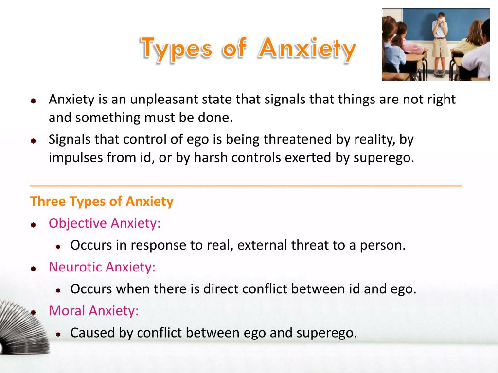

### 新弗洛伊德主义者对焦虑的观点
- 新弗洛伊德理论家如**沙利文** (Sullivan) 和**霍尼** (Horney) 吸收并修改了弗洛伊德关于焦虑的理论
- 他们认为焦虑不仅源自**无意识冲动**，还受到**文化和社会交往的影响**
- 例如，沙利文强调通过建立**稳固的人际关系**来克服焦虑，他称之为“**人际安全网**”（Interpersonal Security）
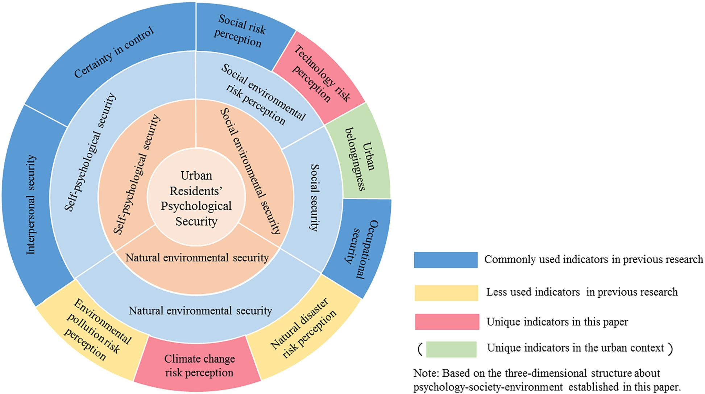

### 应对焦虑的策略
- **防御机制**（Defensive Mechanisms）是人们应对威胁和焦虑的一种方式，这一概念由弗洛伊德提出并由后来的理论家进一步发展
- 人们在面对焦虑时可能**采取不同的策略**，这些策略包括逃避、否认、理智化等
- 霍尼指出，过分焦虑的个体可能**通过人际交往减轻焦虑**，但这可能带来**长期的调适问题**，现代研究也探讨了人们在日常生活中对焦虑源的**各种应对策略**

## 应对焦虑的策略
### 应对策略的常见形式
- 研究表明，人们会**有目的地采取行动**减轻压力情境下产生的焦虑
- 例如，在观看描绘严重工厂事故的电影时，观众会通过**提醒自己所看到的只是电影**（拒绝 denial）或**关注电影的技术方面**而非恐怖内容（理智化 rationalization）来**减轻不适感**
- 这些策略与弗洛伊德描述的**防御机制相似**，显示了人们在面对直接威胁时如何**通过心理调节降低焦虑水平**
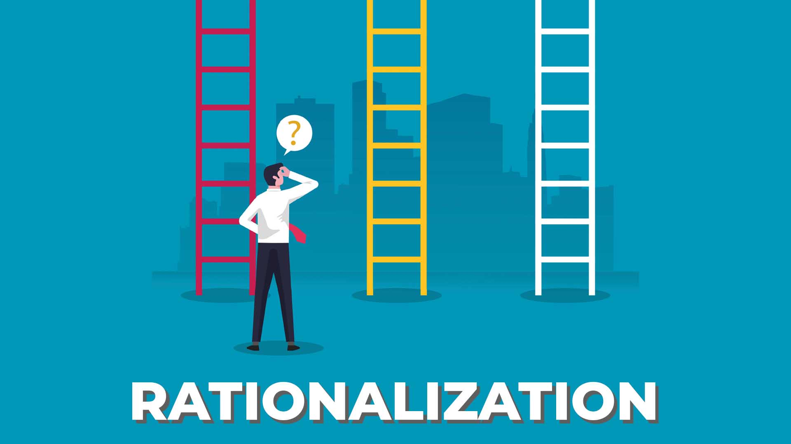

### 应对策略的个体差异
- 人们在应对焦虑时**并不总是使用相同的策略**，而是倾向于**根据个人习惯**使用某些特定的方法
- 应对策略的选择**相对稳定**，通常不会因不同的时间或不同的引发焦虑的情境而改变
- 人们根据个人的**应对风格**（coping style）来处理**生活中的压力和危险情境**

### 应对策略的分类
- 应对策略可以基本分为两大类：**积极处理问题的策略**和**试图回避问题的策略**
- 另一种分类方法是：一类策略**直接关注压力源**，另一类则关注于**管理因压力源引起的情感反应**
- 这些分类帮助研究者和实践者更好地理解和指导人们如何更有效地应对生活中的焦虑和压力

## 积极策略与回避策略
### 应对策略的两种基本类型
- 应对策略通常分为**积极应对策略**（active coping strategies）和**回避应对策略**（avoidance coping strategies）
- 积极应对包括**直面压力源**并**寻求解决问题的方法**，如**收集信息**或**制定应对措施**
- 回避应对则包括**尽量避免问题**或**减少思考与问题相关的事情**，如**转移注意力**或**否认问题的严重性**
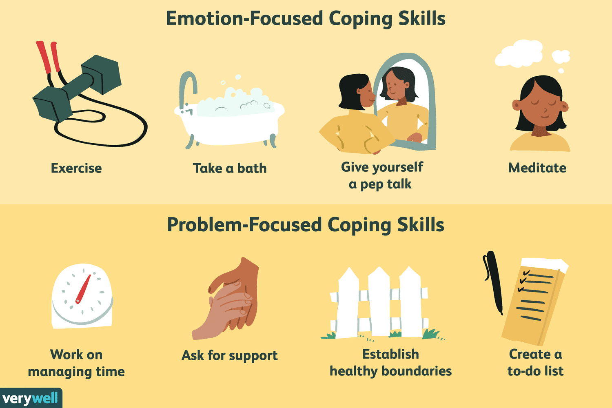

### 应对策略的个体选择
- 个体在面对威胁或压力情境时倾向于采取**稳定一致的应对方式**，这些方式通常反映了**个人的应对风格**
- 某些人倾向于使用**压抑策略**（repression），即**避免思考**可能引起压力的情境
- 其他人则可能选择**敏感策略**（sensitization），即**尽可能多地了解**问题和可能的解决方案
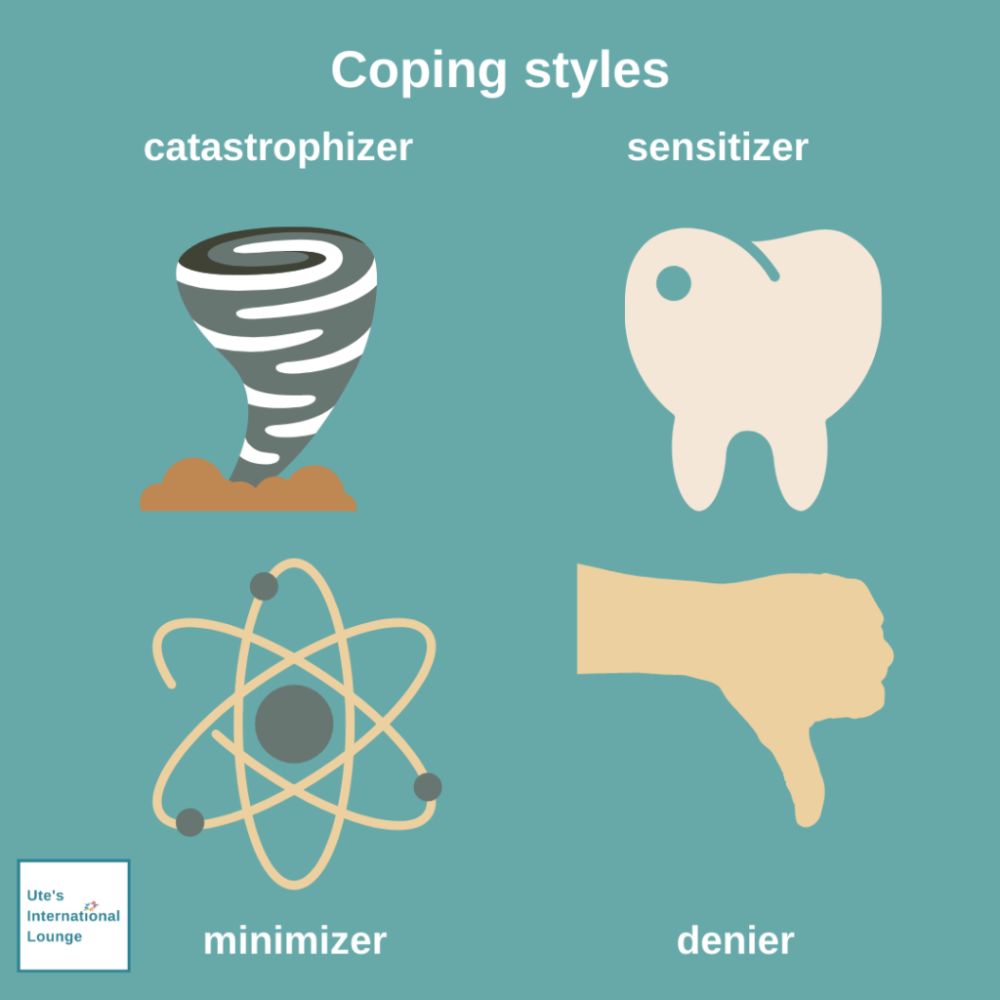

### 研究中的应对策略观察
- 研究表明，人们在面对问题时会**使用多种策略来应对**，这些策略可以被分为**积极和回避两大类**
- 在对策略进行分类时，研究者发现可以进一步将积极策略细分为**面向问题的行动**和**认知重构**等类型
- 回避策略则通常涉及**尽量不去想问题**或者以某种方式**减少问题带来的情感冲击**

## 问题中心策略与情绪中心策略
### 问题中心策略 (Problem-focused Strategies)
- **问题中心策略**直接**针对问题本身**进行解决办法的寻找和实施
- 这类策略可能包括**寻找增加收入的方法**或**削减不必要的支出**以解决经济问题
- 即使是**简单的解决方案**，也被视为比无所作为更为有效

### 情绪中心策略 (Emotion-focused Strategies)
- 情绪中心策略旨在**减轻问题带来的情绪压力**，而非直接解决问题
- 例如，如果一个人未能被法学院录取，他可能会通过**改变看待这一事件的方式**来减少焦虑，例如认为这是一个重新评估职业道路的机会
- 这类策略还包括**做一些活动**或**采取行动以改善情绪状态**，如做运动或进行社交活动

### 研究发现与性别差异
- 在一项研究中，参与者用超过98%的压力经验中应用了问题中心策略、情绪中心策略或两者的结合
- **女性**倾向于使用**情绪中心策略**来应对压力，而**男性**则更倾向于采取**问题中心策略**来直接解决问题
- 这种性别在策略选择上的差异与**性别角色的社会预期**相符合

## 应对策略的效果如何？
### 应对策略的整体有效性
- 使用应对策略通常**比不使用更有效**，无论是在戒烟还是减轻婚姻生活中的压力情况下
- 有研究显示，至少使用一种应对策略的吸烟者**戒烟的可能性**是未使用任何策略的吸烟者的**三倍**（Shiffman, 1985）
- 另一项研究发现，使用应对策略的夫妇在**减轻抑郁方面**更为有效（Mitchell, Cronkite & Moos, 1983）

### 积极与回避策略的短期与长期效果
- **回避策略**在**短期内**可能更为有效，尤其是在无法立即解决的问题面前
- 从长远看，**积极策略**通常提供**更持久的解决方案**，特别是当问题可以通过具体行动得到解决时
- 研究表明，回避焦虑情境的策略和积极面对问题的策略**都有其有效性**，具体取决于情境（Suls & Fletcher, 1985）

### 策略选择的情境依赖性
- **情境的控制性**是决定问题中心策略和情绪中心策略效果的关键变量（Aldwin & Revenson, 1987; Folkman, 1984）
- 在**无法通过行动解决问题**的情境中，**情绪中心策略**可能更为适合，如人质情景的模拟实验（Strentz & Auerbach, 1988）
- 当问题**可以通过具体行动得到解决**时，**问题中心策略**更为有效，如及时请教可以帮助解决学习上的不理解

### 应对策略的灵活性
- **多样化的应对策略**为人们提供了**更多的选择**来有效应对各种引起焦虑的情境
- 如果一种策略在特定情境下无效，人们可以尝试另一种策略
- 研究表明，在不同情境下**灵活运用不同的应对策略**是缓解焦虑的关键

# 挫折和攻击
## 挫折一攻击假设
### 挫折-攻击假设的基本原理
- **挫折-攻击假设**（Frustration-Aggression Hypothesis）由多位心理学家提出，主张**攻击行为总是由挫折引起**，并且挫折**必然导致某种形式的攻击**
- 按照这一假设，挫折是攻击的**唯一起因**，而攻击是对挫折的**唯一反应**
- 实例包括学生因未能上光荣榜而受挫，老鼠因找不到奶酪而受挫，或棒球运动员因比赛失误而受挫，这些情况都可能**引发攻击行为**
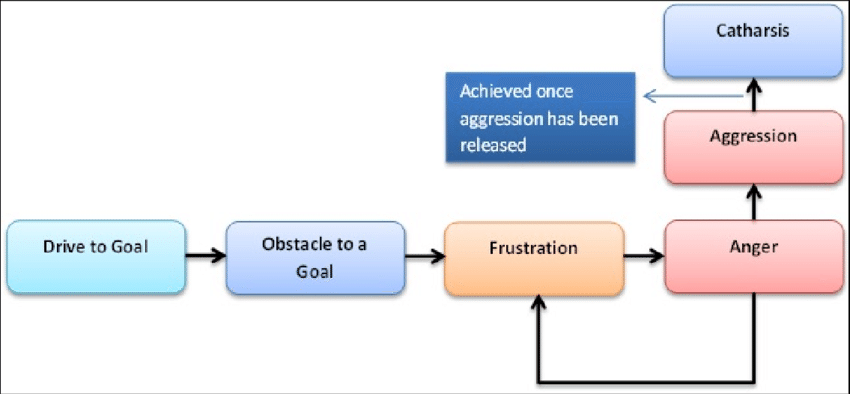

### 挫折引发的攻击行为及其释放
- 研究者采用**精神分析的概念**来解释攻击何时会停止，提出**宣泄**（Catharsis）概念，即**紧张的释放**可以终止攻击行为
- 宣泄描述了通过**物理行动**（如踢书或砸东西）释放紧张和攻击冲动，**达到情绪的平静**
- 每当个体通过行为宣泄后，通常**不会再有进一步的攻击行为**，除非新的挫折引发新的紧张
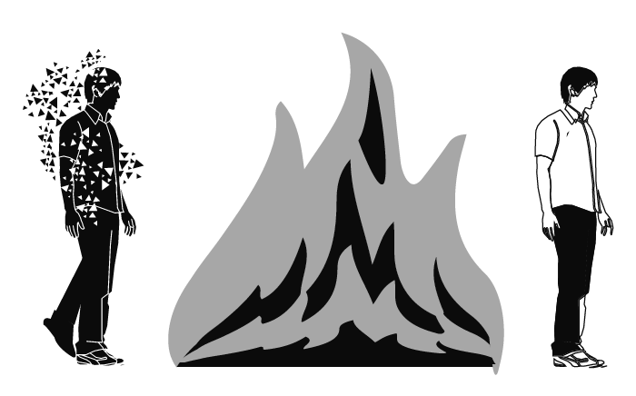
### 挫折-攻击假设的调整和扩展
- 随着研究的深入，心理学家发现挫折**不总是直接导致显性的攻击行为**，而可能通过**间接方式**表达，如将攻击转移到其他目标或采用更隐蔽的攻击方式
- 间接攻击包括将工作挫折转嫁给配偶、在工作中故意作梗、或通过散布谣言等方式**攻击无法直接对抗的对象**
- 另一种应对挫折的方法是**升华**（Sublimation），即通过体育活动或其他非攻击性行为将攻击冲动转化为社会上**更可接受的形式**

## 对挫折-攻击假说的检验
### 挫折是否总是导致攻击？
- 挫折被认为是**攻击的主要起因之一**，许多研究支持这一点，显示**受挫者在行为上表现出更多的攻击性**
- 在特定的排队实验中，**被插队的个体**表现出**更多的攻击行为**（Harris, 1974），而且在竞技体育比如冰球中，**接近赢得比赛的队伍**显示出**更高的攻击性**（Rsll & Drewry, 1976）
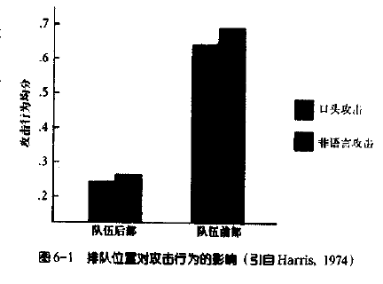
- 然而，挫折**并不总是导致攻击**，因为小的挫折可能**不足以**触发攻击反应，而且攻击有时会以**非直接的形式**表达，如通过**迁移或升华**
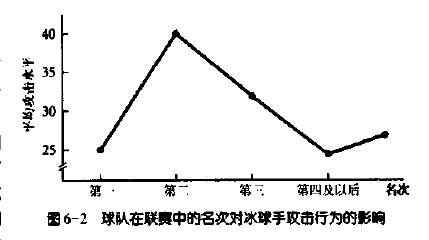

### 攻击的迁移与表达
- 攻击行为有时**不是直接针对引起挫折的源头**，而是可能**被迁移到其他目标上**
- 在一个**字谜游戏实验**中，受挫的被试在评价任务中向一个无关的人**施加更高强度的电击**（Konechi & Doob, 1972），显示了**攻击行为的迁移**
- 这表明即使**挫折常常导致攻击**，攻击的形式和目标可以**非常多样化**，从**直接攻击到间接或迁移的攻击**都有可能
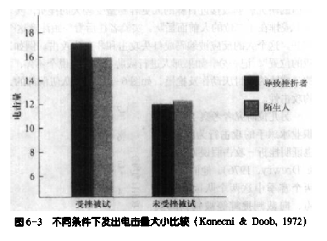

### 攻击是否导致宣泄和减少后续攻击？
- 尽管常见观念认为攻击可以通过宣泄来**减少后续的攻击倾向**，但研究表明攻击行为可能**实际上增强了未来的攻击倾向**
- 攻击后的宣泄确实可以**暂时减少生理的紧张状态**，例如，愤怒的被试在电击他人后**血压降低**（Hokanson & Burgess, 1962）
- 然而，长期来看，攻击行为可能因为减少对伤害他人的抑制、提供暗示性反馈或因攻击带来的暂时解脱而**被鼓励**，从而**增加未来的攻击行为**（Geen & Quanfy, 1977）
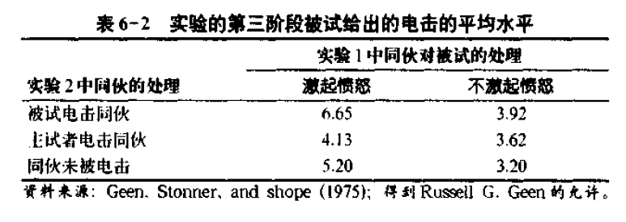

## 修订的挫折-攻击理论
### 挫折-攻击假说的发展
- 挫折-攻击假说由心理学家**伯科维茨**（Leonard Berkowitz, 1989）进行了**重要修订**，强调挫折导致攻击行为主要是因为**挫折引起的不愉快感受**
- 新模型提出，不仅是**挫折**，任何引起不愉快的事件**都可能增加攻击行为的可能性**，这包括生活中的**各种压力**如噪音、高温等
- 修订理论指出，挫折引起攻击的程度**受到人们对挫折情境解读的影响**，例如，一个人**如何解释另一个人的行为**（有意的、敌对的或无意的）将影响他的攻击反应
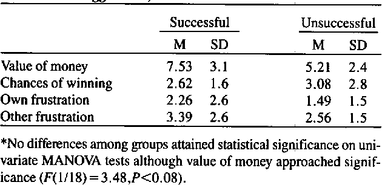

### 不愉快情绪与攻击行为
- **伯科维茨的修订模型**强调，**任何不愉快的情绪状态**都有可能促进攻击行为，不一定非得是**传统意义上的挫折**
- 这种观点**得到了实验支持**，研究显示在不愉快的环境条件下，如吸烟、噪声或高温，人们**对他人的惩罚行为会增加**
- 新模型扩展了**对攻击行为的理解**，不再局限于挫折情境，**任何形式的不愉快体验**都可能触发攻击

### 修订模型的实际应用和预测力
- 新模型不仅解释了为什么**有些挫折不引起攻击**（因为它们可能不足够不愉快），还帮助预测**何种情况下攻击行为更可能发生**
- 理论提出，即使在**持续的挫折源存在**的情况下，提供**令人愉快的刺激**也可以**减少攻击行为的可能性**
- 修订理论为处理和预防攻击行为提供了**更灵活和广泛的策略**，尤其是在**多种社会和个人压力共存的复杂环境**中

# 依恋类型和成人的人际关系
## 对象关系理论和依恋理论
### 对象关系理论
- **对象关系理论**（Object relation theory）主要由**梅拉涅·克莱因**（Melanie Klein）、**唐纳德·温尼科特**（Donald Winnicott）、**玛格丽特·马勒**（Margaret Mahler）和**海因兹·考特**（Heinz Kohut）发展，这些理论家关注**婴儿与其主要照顾者之间的关系**，尤其是母亲的关系
- 该理论假定孩子会产生**对其周围重要人物的无意识表象**，这些表象影响孩子将来**与他人建立关系的方式**
- 对象关系理论认为**早期的父母子关系**和这些**内化的父母形象**对个体的未来关系具有长远影响，成为孩子处理**未来人际关系的基础**
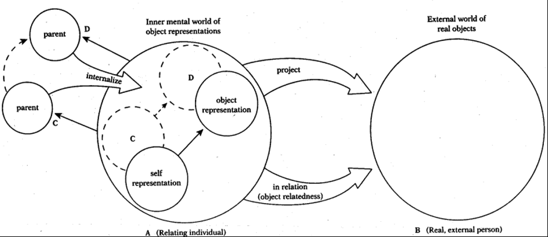

### 依恋理论
- **依恋理论**（Attachment theory）由**约翰·鲍尔比**（John Bowlby）和**玛丽·爱因斯沃斯**（Mary Ainsworth）等人发展，关注**婴儿与其养育者之间的情感依恋**
- 鲍尔比提出依恋关系满足**个体依附于提供支持和保护的他人的需要**，尤其关注**婴儿与养育者分离时的行为**
- 爱因斯沃斯通过她的研究定义了几种基本的依恋类型：**安全型关系**、**焦虑-矛盾型关系**和**回避型关系**，这些依恋类型影响婴儿的行为和对分离的反应
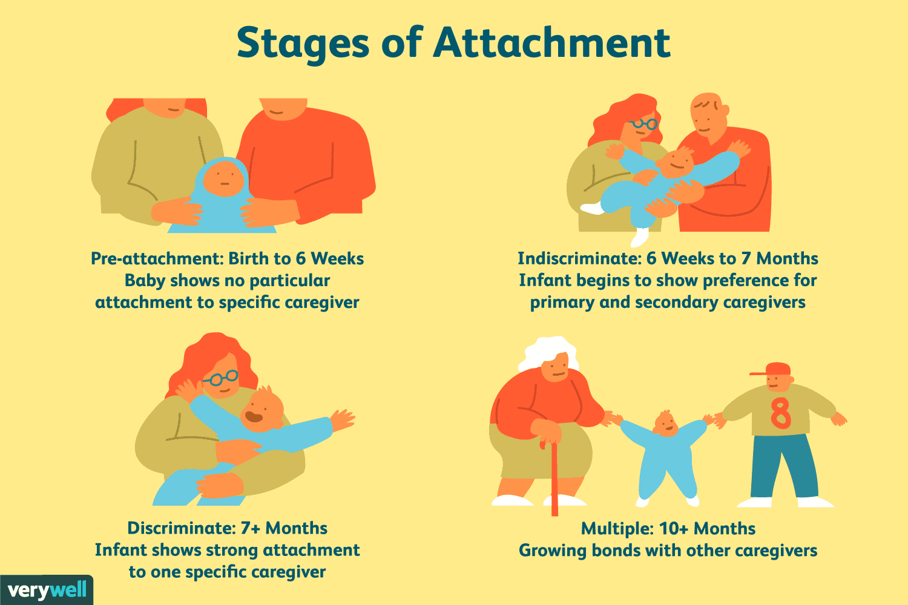

### 依恋类型及其对个人发展的影响
- **安全型依恋**的婴儿认为母亲是**负责任和亲切的**，即使母亲不在身边也能感受到爱和照料，这些婴儿通常比较**快乐和自信**
- **焦虑-矛盾型依恋**的婴儿**对分离感到极度焦虑**，难以被其他成人安慰，对陌生环境感到**害怕**
- **回避型依恋**的婴儿对母亲表现出**疏远和冷漠**，对母亲的离开和回来**反应平淡**，表现出**对分离的不关心**
- 依恋理论家进一步观察到不同依恋类型的儿童在**将来建立人际关系时的表现**，安全型依恋的儿童在成长后**更能建立信任和爱的关系**，而焦虑和回避型依恋的儿童则可能发展出**怀疑和不信任他人的倾向**
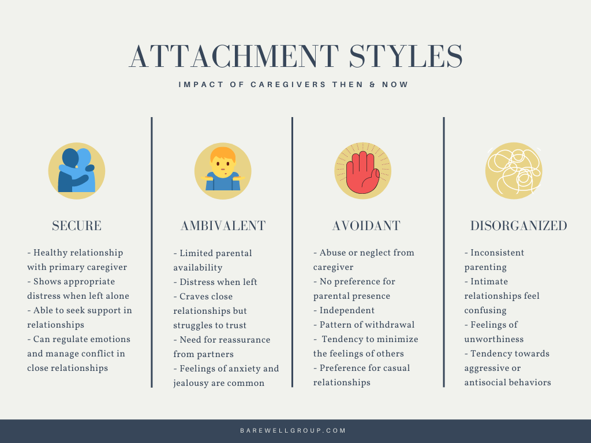

## 成人的依恋类型
### 成人依恋类型的定义
- 成人依恋类型与婴儿时期的依恋类型**相对应**，表现为三种主要形式：**安全型**、**回避型**和**焦虑-矛盾型**
- 安全型成人**易于与他人建立信任关系**，不担心被抛弃，也不害怕与人过于亲近
- 回避型成人往往**对亲密关系感到不安**，难以完全信赖或依赖他人；焦虑-矛盾型成人则**过度渴望亲密**，常因过度依赖而使他人感到压力过大
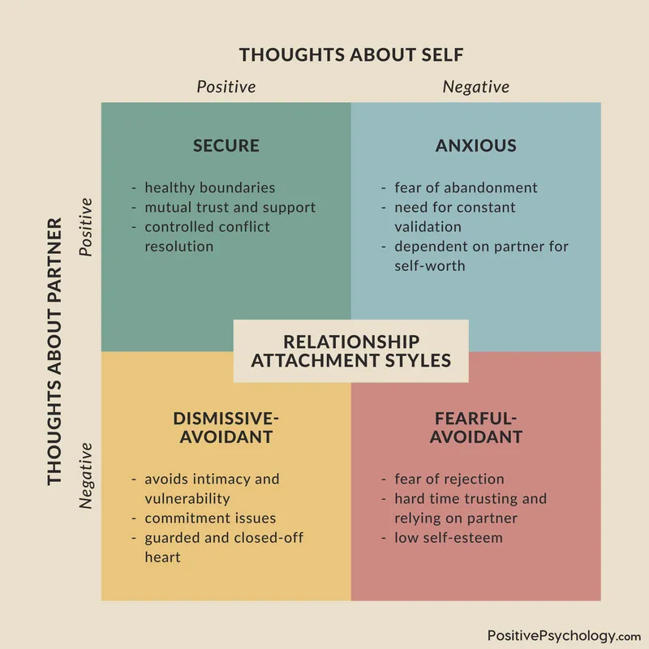

### 早期研究与观察
- 首次尝试定义和测量成人依恋类型的是**通过一项调查**（Hazan & Shaver, 1987）进行的，该调查通过**问卷的形式**让读者选择最符合自己的描述
- 该调查显示，约56%的参与者为**安全型**，25%为**回避型**，19%为**焦虑-矛盾型**，与婴儿依恋类型的分布比例相似
- 调查发现成人的依恋类型可能**与他们的童年经历有关**，尤其是**与父母的关系和家庭环境**
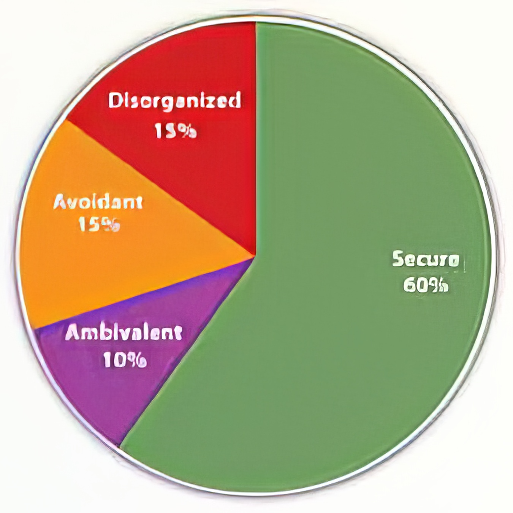

### 成人依恋类型与人际关系的影响
- 安全型成人在描述与家庭成员的关系时，倾向于报告**积极的互动**和一个**温暖、信任的家庭环境**
- 焦虑-矛盾型成人通常**回忆不到父母的支持**，而回避型成人则描述与家庭成员关系为**不信任和情感淡漠**
- 成人依恋类型不仅影响个人的人际关系模式，还可能影响其**对亲密关系的期望和行为**，从而影响其长期的社会和情感福祉
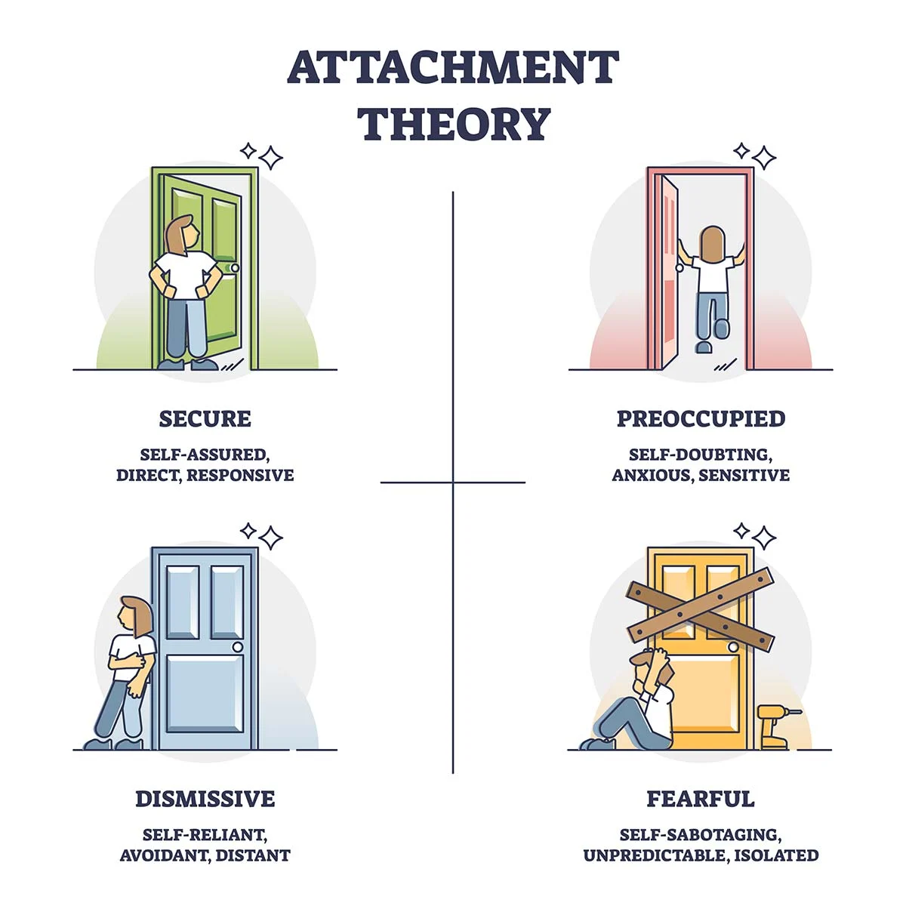

## 成人依恋类型的一个转换模型
### 巴索罗梅的依恋类型模型
- **巴索罗梅**（Bartholomew）提出的模型基于**鲍尔比的亲子依恋理论**，探讨了**自我意象与他人的看法**如何影响成人的依恋风格
- 模型区分了人们**对自己的价值感**（正面或负面）和**对他人的信任感**（可信或不可信）
- 依据这两个维度的不同组合，巴索罗梅定义了四种依恋类型：安全型、规避型、全神贯注型和恐惧型

### 四种依恋类型的特征
- **安全型**: 自我意象**积极**，**信任**他人，倾向于**寻求并享受亲密的人际关系**
- **规避型**: 自我意象**积极**，但**不信任**他人，倾向于**独立**，避免亲密关系以免受到伤害
- **全神贯注型**: 自我意象**消极**，认为他人**可信赖**，**依赖亲密关系**以提升自我价值感，但容易因伴侣无法满足其**高度的亲密需求**而感到失望
- **恐惧型**: 自我意象和对他人的信任感**都是消极的**，**恐惧**亲密关系因担心被拒绝和不被爱
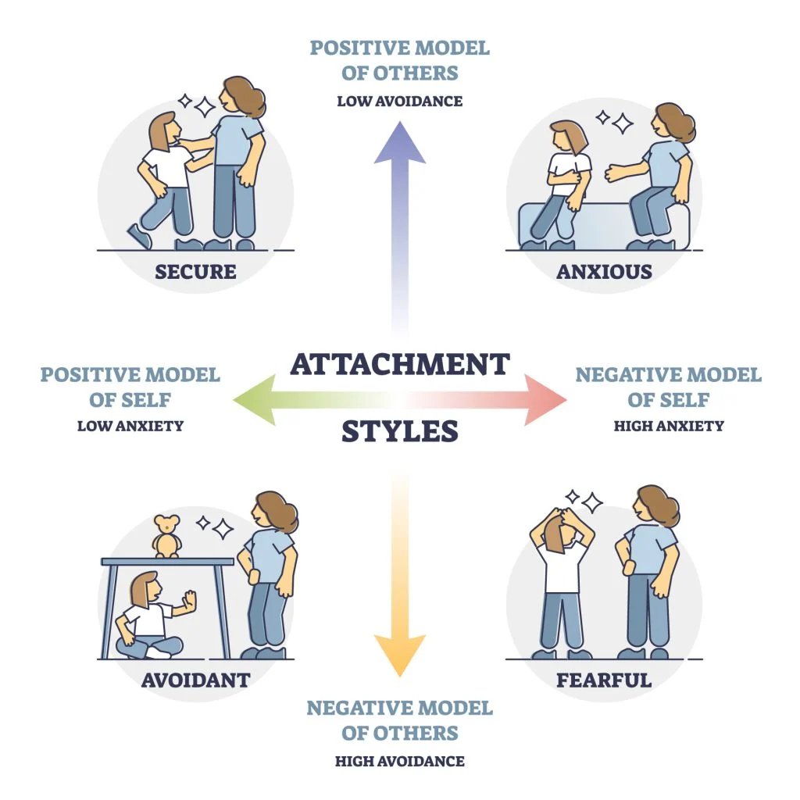

### 研究支持与理论影响
- 巴索罗梅的模型提供了一种**解释成人行为的新方式**，特别是如何从童年经历中预测成人的行为模式
- 这一模型的适用性和准确性**仍在进一步验证中**，但早期研究支持了其对人际行为的解释能力
- 该理论**加强了新弗洛伊德理论家的观点**，即成人的行为可追溯到其童年的经历