[TOC]
# 人格的描述与理论
### 个体如何描述自己的人格
- 大多数人在描述自己的人格时，通常会采取两种方式：描述自己属于**哪一类型**（如安静型、自主型、直率型）或是描述自己具有**哪些特质**（如勤奋、羞怯、友好）
- 人们通过**一系列相对稳定的特征**来描述自己，无论是将自己归类于某个类型，还是确认自己具备某些特质
- **特质理论**（trait theory）的研究者致力于确定**描述大多数人的类型或特质**，并利用这些类型或特质来预测行为
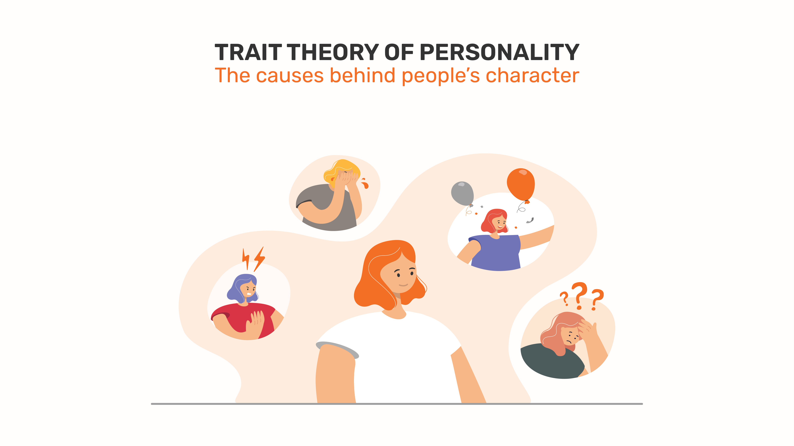

### 特质理论的历史背景
- 特质理论起源于人类对于人格描述的需求，**高尔顿·奥尔波特**（Gordon Allport）是早期特质理论家之一，他列举了**四千多个形容词**来描述人的不同方面
- 早期心理学家面临的挑战是如何将这些**庞大的特征列表**组织成一个**有用的结构**，以便更好地理解人格的多样性
- 特质理论的发展是为了克服**类型学**（typology）的局限，类型学假设人可以被分为**有限的几种类型**，并且每种类型的人**在行为上是一致的**

### 从类型学到特质理论的转变
- **古希腊医学**已经将人分为四种类型：**多血质**（sanguine, 快乐型）、**抑郁质**（melancholic, 不快乐型）、**胆汁质**（choleric, 易怒型）和**粘液质**（phlegmatic, 淡漠型）
- **体型说**（Sheldon，1942）将人格与体型联系起来，区分为**内胚型**（endomorph, 肥胖型）、**中胚型**（mesomorph, 强壮型）和**外胚型**（ectomorph, 弱型）
- 现代心理学已经摒弃了**严格的类型学**，转而采用**特质理论**，后者允许更细致的个体差异描述，不再限于简单的类型划分
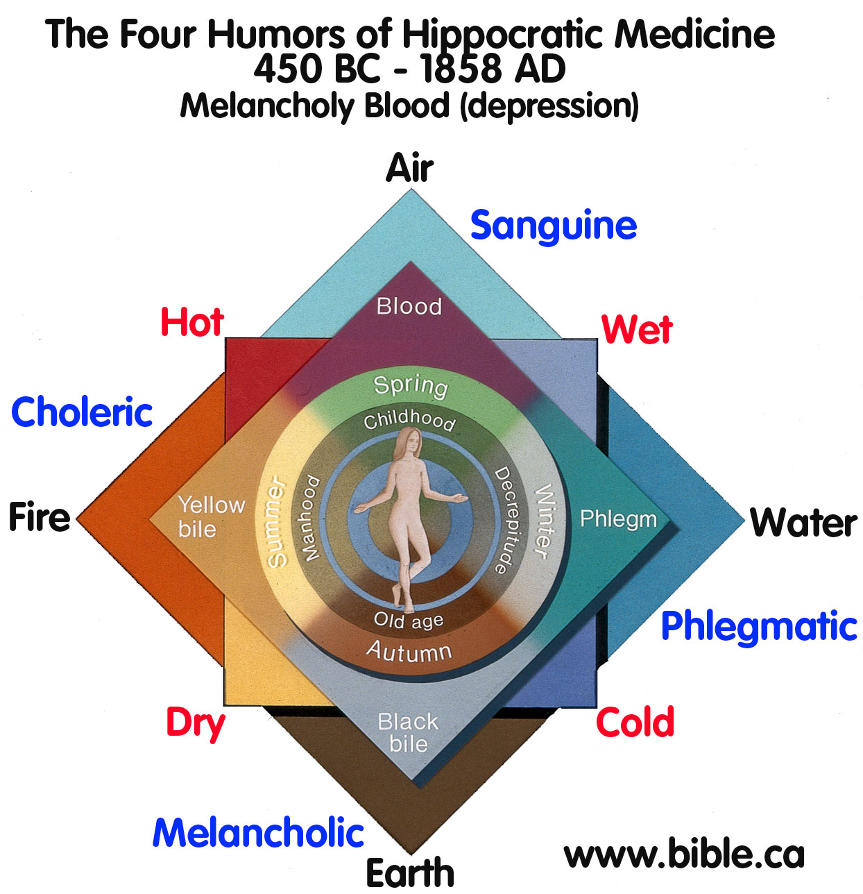

# 特质流派
## 特质维度作为人格描述
### 特质理论的基本概念
- **特质理论**（trait theory）认为人格可以通过**一系列行为连续体**来描述，例如成就动机可以从**极高的坚持**到**完全无兴趣**不等
- 每个人都可以在这些连续体上**找到自己的位置**，如某人在攻击性维度上的位置可能高于友好性维度
- 大规模测量显示，人们在特质连续体上的分布通常呈**正态分布**，意味着大部分人聚集在**中间区域**，极端类型的人相对较少
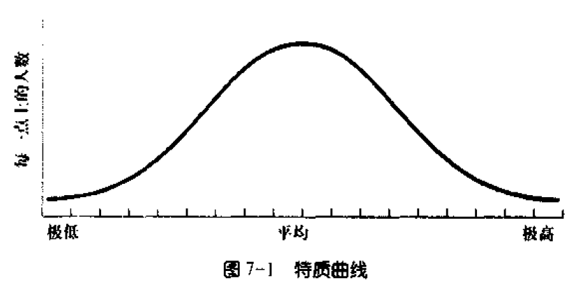

### 特质的稳定性假设
- 特质理论假设人格特质在时间上**具有稳定性**，即使情绪**有波动**，某人的基本特质（如自尊）在较长时间内**保持相对不变**
- 理论认为特质在**不同情境**中也表现出**一定的稳定性**，即一个人在多种情境下的某一特质（如攻击性）表现出的水平**相对一致**
- 尽管人在不同情境下的行为强度**可能有所不同**，特质理论强**调个体在多个环境中行为的平均稳定性**

### 特质的测量与应用
- 特质理论提供了**量化人格的工具**，通过测量确定人在特质维度上的具体位置
- 特质理论不仅局限于**描述性特质**，还包括对个体在**需要和策略**等方面差异的研究
- 心理学家通过**标准化的测试测量特质**，这些测量结果通常能够依据正态分布进行有效分类和预测行为

## 特质流派的研究特点和应用
### 特质研究的核心关注点
- 特质流派的研究者关注的是人们**在特质分布曲线上的位置**，而不是个体的**具体行为预测**
- 研究目的在于比较**不同特质得分人群的典型行为差异**，例如高社会焦虑和低社会焦虑的人**在群体中的交流频率**
- 特质研究通常**不涉及行为的具体预测**，而是旨在揭示属于不同特质得分群体的人们的**一般行为倾向**
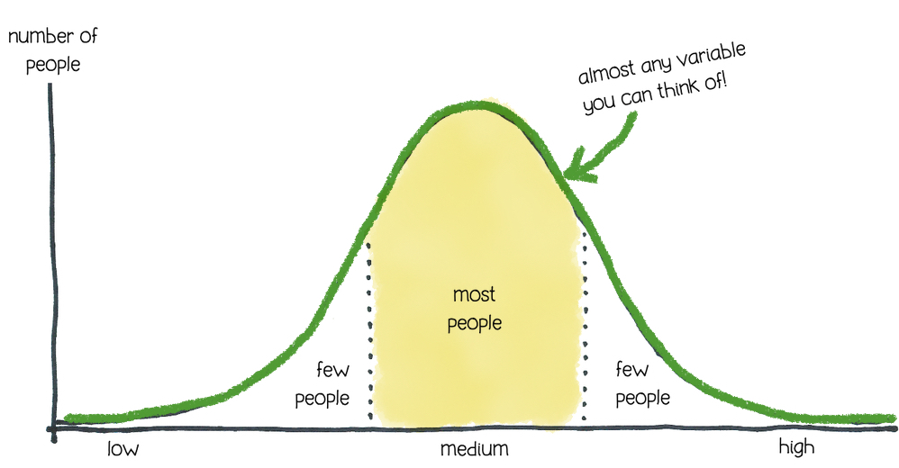

### 特质研究的方法和局限
- 特质研究往往**不深入探讨**行为背后的心理机制，更多关注于**描述人格和预测行为的模式**
- 特质研究可能陷入**循环推理**（Circular Reasoning）的问题，例如用"因为具有攻击性"来解释"为什么会攻击"，这种推理**在逻辑上是循环的**
- 特质理论家通常**不关注行为变化的动因或过程**，而是集中于通过**统计方法**描述和比较人群

### 特质研究的实际应用
- 特质研究提供了一种**方便的方法**来分类和比较人们在某些人格维度上的差异，如**自尊和社会焦虑**
- 虽然特质研究对心理治疗提供了有用的诊断和治疗规划信息，但它本身**并不涉及治疗过程**
- 特质心理学家主要作为**学术研究者**存在，而不是作为**治疗师**，因此很少有心理治疗学派直接源于特质流派

# 重要的特质理论家
## 高尔顿·奥尔波特
### 奥尔波特的特质理论基础
- **高尔顿·奥尔波特**（Gordon Allport）是特质理论的**早期开拓者**，他与兄弟共同出版了《**人格特质：分类与测量**》（1921），为特质理论研究奠定了基础
- 他强调人格特质在神经系统中有**物质结构的存在**，预见了未来科学技术可能通过**生物标志物**识别人格特质
- 奥尔波特的研究注重于**特质的稳定性和一致性**，认为人的某些行为倾向具有**不变的部分**，尝试用**特质概念**解释这一稳定性
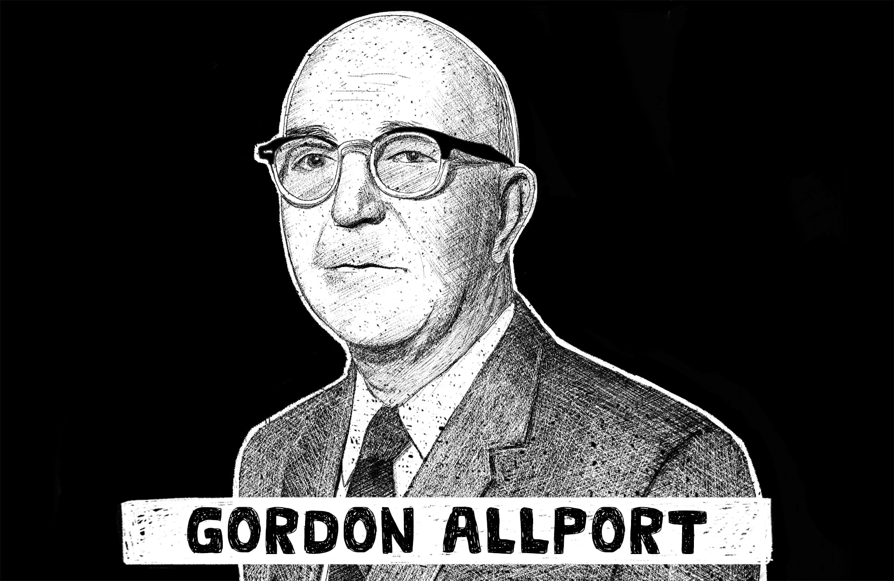

### 与弗洛伊德的不同观点
- 奥尔波特与弗洛伊德的会面揭示了他们对人格和心理动机理解的**根本差异**，奥尔波特关注**意识层面的行为原因**，而弗洛伊德**深入无意识**
- 他批评弗洛伊德对无意识的**过度依赖**，认为心理学家应更多关注**显而易见的外显动机**
- 奥尔波特认为成人人格形成**并不完全依赖于儿童期经历**，成人的行为虽可能类似儿童期，但内在动机可能**完全不同**，这与弗洛伊德的观点形成对比

### 人格研究的方法论
- 奥尔波特提出了**整体研究法**（Nomothetic approaches）和**个案研究法**（Idiographic approaches）两种人格研究策略
- 整体研究法关注于**共同特质**，通过测量这些特质来比较不同个体；个案研究法则着重于个体特质组合的**独特性**
- 他认为，虽然**共同特质研究**对于理解人格**至关重要**，个案研究法却能提供**更深入的个体差异洞察**，更能描绘出**人格的全貌**
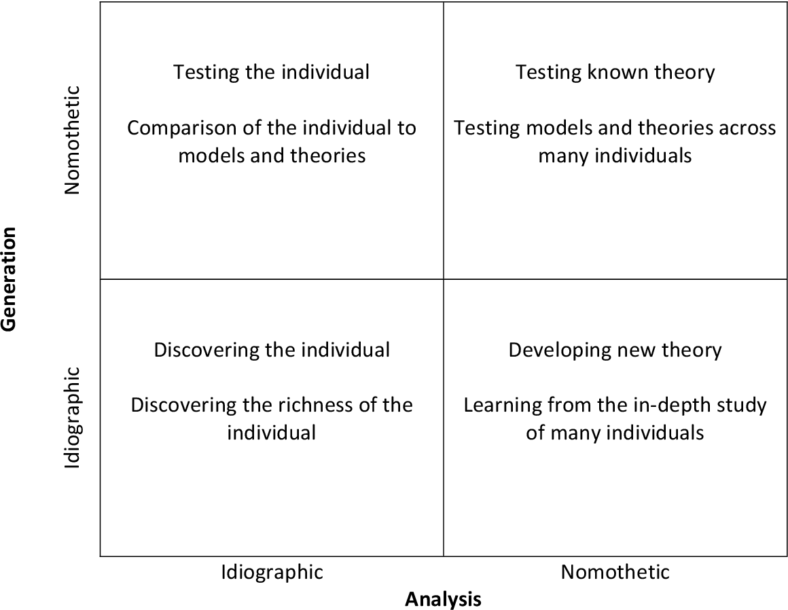

### 自我与本体性的概念
- 奥尔波特对**自我概念的发展**持续感兴趣，提出自我是从**婴儿期**逐渐与环境区分开来逐步发展起来的
- 他创造了**本体性**（Proprium）这一术语来描述构成统一自我概念的所有方面，强调自我认同感的发展是一个**长期过程**
- 奥尔波特视自我为心理学研究中的重要而复杂主题，尽管**难以定义和测量**，但他认为**不应该因此忽略**

### 机能性的自主性与行为动机
- 奥尔波特提出**机能性的自主性**（functional autonomy）概念，说明成人行为虽**源于早期动机**，但可发展成**独立于原始动机的新动机**
- 例如，童年阅读行为初为取悦父母，成年后可能因享受阅读本身而持续
- 这一观点帮助解释了为何成人行为模式可能与儿童时期形成的**原因不同**，支持了**行为动机随时间自主变化**的看法

## 亨利·莫雷
### 精神分析背景与特质理论的结合
- **亨利·莫雷**（Henry Murray）接受了**精神分析的教育背景**，并且与**卡尔·荣格**有过广泛交往，这对他后来的理论有显著影响
- 他在人格理论中强调**无意识的重要性**，这反映了荣格对他的影响
- 莫雷的工作在结合**传统特质理论**与**精神分析理论**方面表现出独创性，特别是在他发展的**主题统觉测验**（TAT）中

### “人格学”与心因性需要
- 莫雷提出“**人格学**”（personology）概念，强调研究人格的动态性和复杂性
- 他区分了“**内脏需要**”（viscerogenic needs）和“**心因性需要**”（psychogenic needs），后者与特质类似，关注**心理动机和需求**
- 莫雷定义的**心因性**需要是人**在特定条件下反应的倾向性**，他最终列出了**27种心因性需要**，认为这些需要是**无意识的**
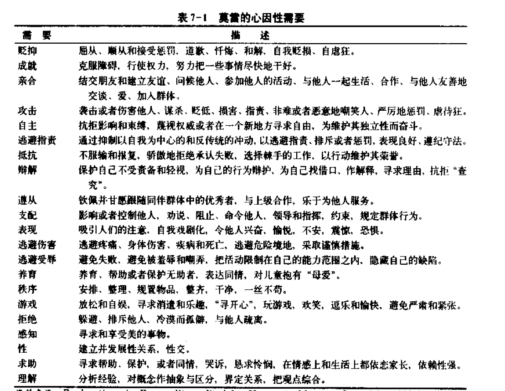

### 需要层次和行为预测
- 莫雷认为每个人的人格可以**通过不同心因性需要的层次**来描述，这些层次决定了个体的行为动机
- 通过比较不同需要的**相对重要性**，可以解释个体在**特定情境下的行为选择**，例如选择参加晚会还是学习
- 这种理论提供了一个**复杂的视角**来看待人的行为，不仅仅局限于单一的特质或需要

### “压力”概念与环境互动
- 莫雷引入了“**压力**”（press）的概念，这是**环境中的动力因素**，与个体的需要相互作用，共同决定行为
- 他区分了**真实环境的压力**（α-press）和**被知觉的环境压力**（β-press），强调了主观知觉在行为动机中的作用
- 理解β-press对预测行为至关重要，因为个体的行为受到其对环境知觉的影响，而非仅仅环境本身

### 莫雷对人格领域的广泛影响
- 莫雷通过TAT和其他理论贡献，极大地**推动了人格研究领域的发展**
- 他的学生和追随者将这些理论应用于权力、亲合以及成就等需要的研究，这些研究对人格心理学的理解产生**了深远的影响**
- 莫雷的理论和研究方法为后来的人格心理学家和治疗师提供了**新的工具和视角**，使得人格理论**更为丰富和实用**
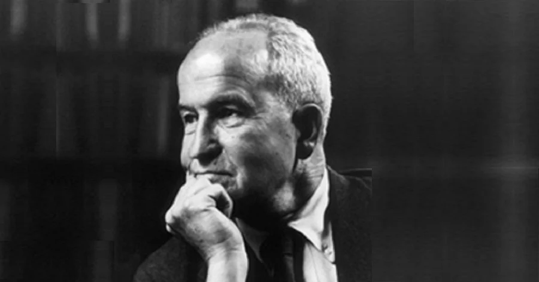

# 因素分析与对人格结构的探寻
## 雷蒙德·卡特尔的特质理论
### 卡特尔的特质理论基础
- **雷蒙德·卡特尔**（Raymond Cattell）强调使用**实证方法**来研究人格，而不是先验地设定人格特质的清单
- 他通过**因素分析**的方法来识别和测量人格特质，尝试发现不同的人格特质和它们之间的关系
- 通过分析人格测量中的数据，卡特尔提出了多个相互独立的基本人格特质，被称为“**根源特质**”（source traits）
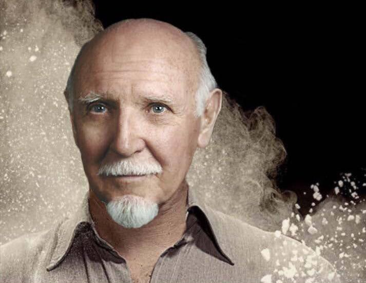

### 因素分析在人格研究中的应用
- 卡特尔**使用因素分析来确定基本人格特质的数量**，通过探索特质间的**相关性**来归类和区分不同的特质
- 在因素分析中，相关的特质被**聚合为一个维度**，独立的特质则被视为**分离的维度**
- 卡特尔发现，尽管最初测量了多个特质，实际上这些特质可能只代表了**几个更大的人格维度**
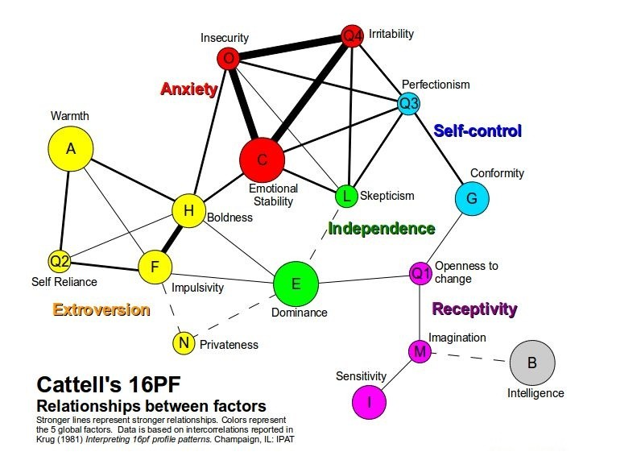

### 卡特尔的人格特质分类
- 卡特尔通过分析**各种人格数据**（包括L资料、T资料和Q资料），尝试**整合不同来源的信息**以确立人格特质
- 他的**16项人格因素调查表**（16PF）识别了**16种基本特质**，这些特质用于描述和预测个体的行为和性格
- 16PF成为心理学中**广泛应用的工具**，用于教育、职业指导和心理健康领域
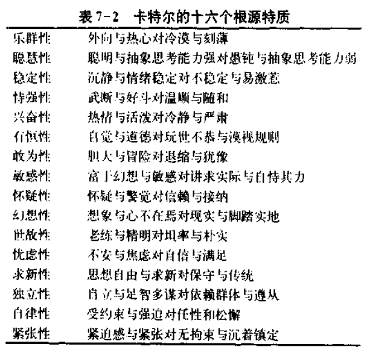

### 因素分析的局限性和挑战
- 因素分析受到**所收集数据类型和范围的制约**，不同的数据可能导致**不同的因素和类别的识别**
- 卡特尔的研究显示，添加**新的特质**或**改变测量方式**可能会影响因素的数量和特质的归类
- 因素分析需要**大量数据和复杂的统计处理**，解释因素分析结果需要专业知识和谨慎的判断

## 大五人格模型
### 大五人格的发现
- **大五人格模型**（The Big Five）是在**多个独立的研究**中通过因素分析技术发现的，这些研究**未预设人格理论**，而是让**数据自行展示人格结构**
- 五大维度几乎在所有研究中**一致出现**，表明其作为人格的基本维度具有**广泛的支持**
- 大五人格包括**神经质性**（Neuroticism）、**外向性**（Extraversion）、**开放性**（Openness）、**随和性**（Agreeableness）、和**尽责性**（Conscientiousness），简称**OCEAN**
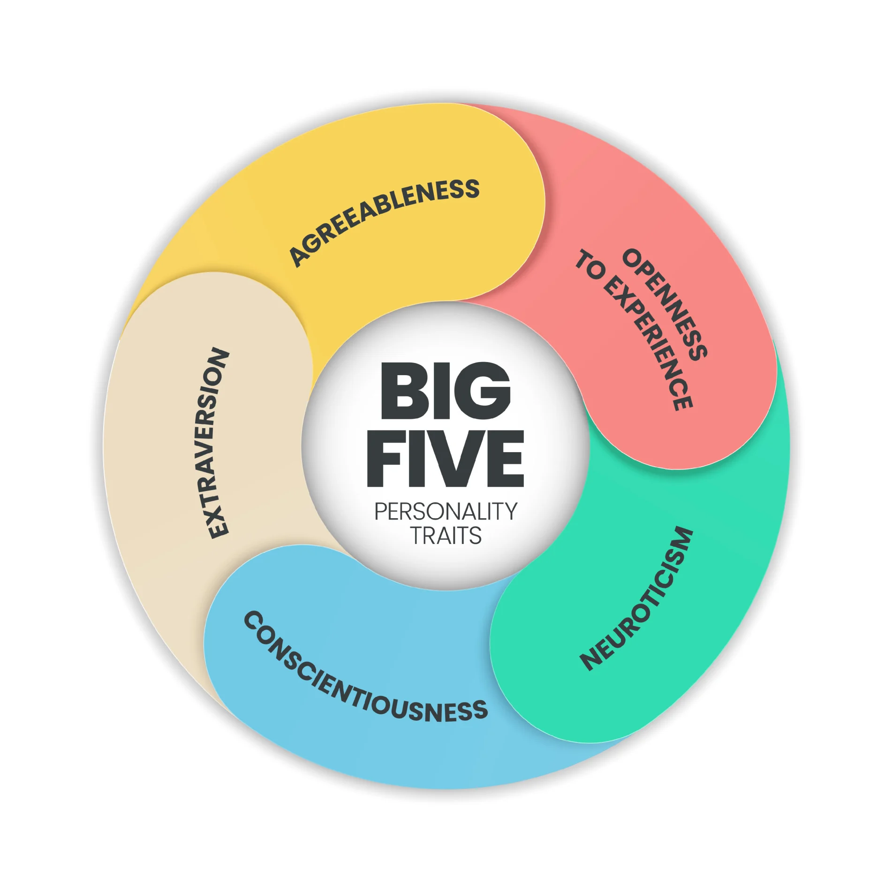

### 每个维度的特征
- **神经质性**：衡量**情绪稳定性**，得分高的人**情绪波动大**，容易体验到**消极情绪**
- **外向性**：涉及**社交和活力的水平**，外向的人在社交场合中表现**活跃和乐观**
- **开放性**：反映对新体验的**开放程度和创造力**，高分者通常具有**好奇心和创新性**
- **随和性**：描述个体在人际互动中的**合作性和善良程**度，高分者通常**友好且易于合作**
- **尽责性**：涉及个体的**自我管理和责任感**，高分者通常组织**良好且可靠**
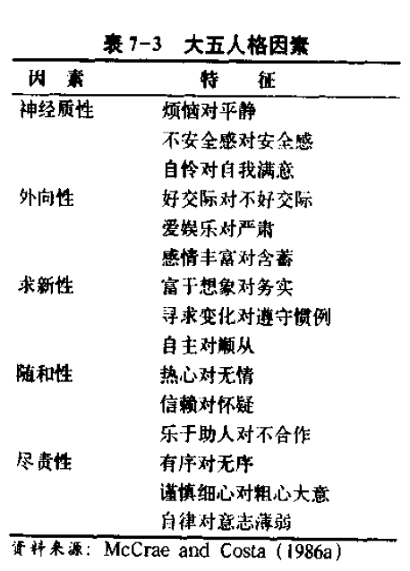

### 大五人格的研究意义和应用
- 大五人格提供了一种测量和描述**个体差异**的有效工具，广泛应用于**心理学研究和实践领域**
- 这一模型的普遍性被多种方法和研究所证实，包括**对成人和儿童的研究**
- 大五人格模型显示了**相对稳定性**，有助于预测和理解**个体在不同情境下的行为和反应**
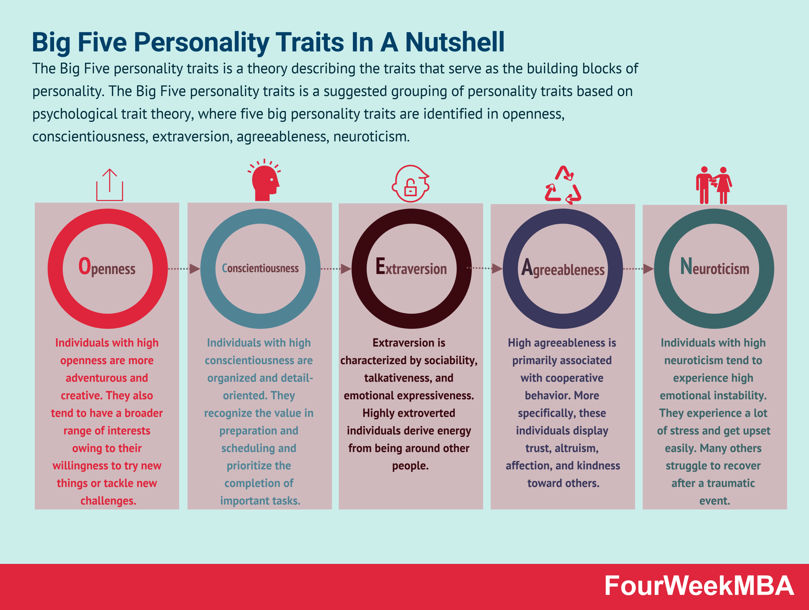

## “大五”模式的批评与局限性
### 语言的局限性
- 五因素模式可能仅揭示了**语言中固有的五个维度**，而这可能**不真实反映人格的实际结构**
- 我们表述人格特质的能力受到了**语言中形容词的限制**，这些形容词可能正好归为五个类别
- 尽管可以把所有特质**归入五个因素**，但这并不意味着这种归类**准确涵盖**了人格的所有**复杂性和细微差别**

### 结构上的争议
- 不同的因素分析研究有时发现人格结构与五因素模式**不完全吻合**，有的研究显示只有**三个或四个因素**，有的则多达**七个**
- 某些研究者提出的人格模型如**汉斯·艾森克的三因素模型**，与五因素模型存在明显差异
- 研究中的因素数量及其称呼之间**存在意见分歧**，导致了对“大五”模式的不同解释和命名
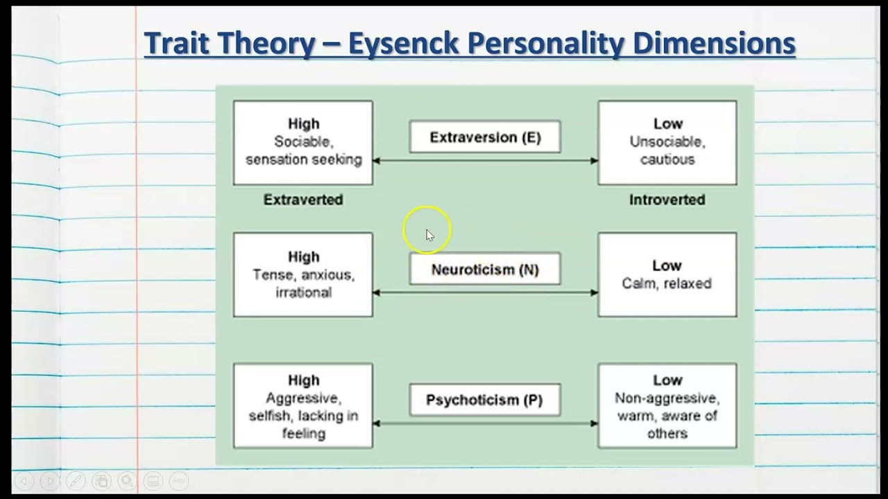

### 研究方法的非理论性
- 五因素模式因其**非理论性**而受到批评，研究者在因素分析前**未设定具体的预期结果**
- 缺乏预先的理论假设可能导致**对研究结果的任意解释**，缺少理论支持的因素分析可能难以解释**为何某些因素反复出现**
- 尽管研究者试图从**进化论或神经结构**等角度解释五因素的成因，但这些假设大多是**在看到结果之后提出的**，缺乏前期的理论依据

### 对人格维度的综合性质疑
- 五因素模式虽有其广泛的**适用性和诊断价值**，但在预测具体行为时，考察**更具体的特质**往往比综合的人格维度更有用
- 例如，具体的“合群”和“冒险”特质在某些研究中比“外向性”这一更广泛的维度能更好地预测社会行为
- **更细致的特质分析**能提供更多关于个体行为差异的信息，而大维度的特质有时会掩盖这些细节

## 工作岗位上的“大五”
### 雇员选择中的“大五”维度考量
- 如果需要从**五个应聘者**中选择，各个人格维度的高分者可能**各有所长**，具体选择应基于**工作性质和组织需求**
- **尽责性**高的应聘者可能在**目标设定和达成**上表现出色，适合需要**高度责任和自我驱动**的岗位
- **随和性**高的应聘者可能在**团队合作和人际关系管理**上更加出色，适合需要**强烈团队协作**的环境
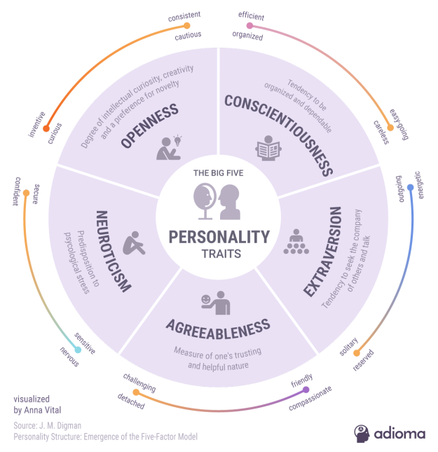

### 人格特质在招聘中的实用性
- 虽然人格测验能提供**重要信息**，但仅依靠这些信息作出快速的雇佣决策可能过于简化，需**综合考虑其他职业能力和经验**
- 研究表明，“大五”人格维度与工作绩效**存在关联**，特别是**尽责性与工作绩效**的正相关性被广泛认可
- 在招聘过程中合理运用“大五”人格模型，可以增强雇佣决策的**科学性和适应性**
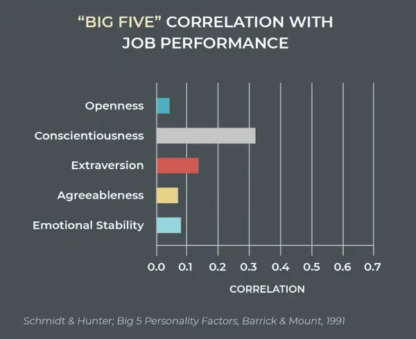

### 批评与限制
- 尽管“大五”模型提供了工作表现的**重要预测因素**，但批评者指出这种模型可能**无法涵盖人格的全部复杂性**
- 单一的人格维度**不应成为雇佣的唯一依据**，工作相关的技能、经验和其他个人特质同样重要
- 高度依赖人格测试结果可能导致**对候选人全面能力的忽视**，不宜作为唯一的评价标准

### 综合应用“大五”模型
- 使用“大五”模型时应注意个别维度与具体职位要求的**匹配程度**，确保人选的人格特质符合工作性质
- 在复杂的工作环境中，可能需要员工在多个人格维度上**表现均衡**，以**适应多变的工作要求和团队互动**
- 长期来看，综合考虑“大五”人格特质及其他职业素质能更全面地评估候选人的适职情况

# 情境论与特质论之争
## 对特质流派的批评
### 特质测量的预测问题
- 特质测量常被认为**无法准确预测行为**，因为行为可能更多地**受情境影响**而非**固定的个体特质**
- **沃尔特·米歇尔**（Walter Mischel）指出，**过分依赖特质测量分数**进行行为预测是**不恰当的**，因为这些分数**并不能准确预见**人在未来情境中的表现
- 特质理论家常因**无法证明**行为在不同情境中的**一致性**而**受批评**，即一个人在不同环境下的行为可能**大相径庭**

### 对跨情境行为一致性的质疑
- 早期研究表明，同一人在不同情境下的行为**相关性较低**，如Hartshorne和May的研究显示诚实行为在不同情境下的一致性只有0.23
- 米歇尔强调，我们常常看到**行为上的一致性**，但这种看法可能**不符合实际情况**，因为人们可能只是**看到了他们期望看到的**
- 情境影响的忽视可能导致**错误地认为**人格特质是行为的主要决定因素
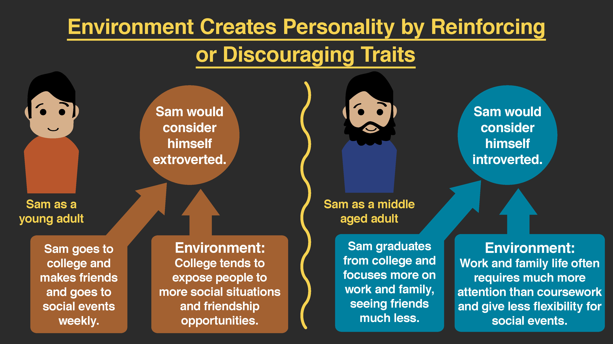

### 情境与人格的相互作用
- 当代心理学普遍认为，行为是由**人格和情境的相互作用**决定的，了解这两方面可以**更准确地预测个体行为**
- 个体与情境的**相互作用研究法**（person-by-situation approach）考虑了人格特质和情境因素共同影响行为的情形
- 尽管人格特质与行为**有一定的相关性**，但这种相关往往只能解释**部分行为变异**，需要更多地考虑情境因素
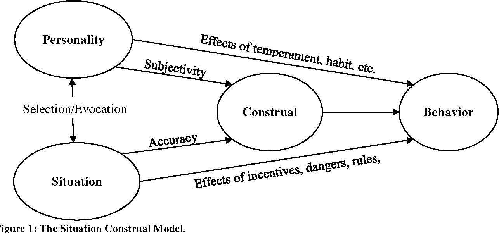

### 对特质理论的方法论批评
- 米歇尔批评现有的特质理论研究往往**缺乏对情境变量的考虑**，导致对人格的理解片面
- 特质理论的研究方法可能导致**对研究结果的任意解释**，特别是在没有明确理论支持的情况下进行因素分析
- 对于特质理论的批评不仅来自**学术界**，也反映了**公众**对于心理测量工具在重要决策中应用的担忧

## 对人格特质的辩护
### 数据的有效累积
- **希莫尔·爱普斯坦**（Seymour Epstein）指出，人格特质与行为之间联系不显著的主要原因是**行为的测量方法不当**，通常是基于**单一事件的测量**，导致结果的不稳定性
- 通过**长期和重复的行为观察**（数据汇总），可以**更准确地测量行为**，从而更有效地预测行为与人格特质之间的关系
- 爱普斯坦通过**连续多天的社会交往记录**，显示**外向性与社会交往频率**之间的相关性**明显提高**，验证了累积数据的重要性

### 特质选择的重要性
- 人格特质研究常常**未能区分核心特质和次级特质**，导致研究结果的不准确
- **核心特质**（对个体更重要的特质）比**次级特质**（相对不那么重要的特质）**更能准确预测行为**
- 确定被研究对象的核心特质并专注于这些特质，可以**显著提高**人格测量与行为预测之间的相关性

### 人格特质影响的实际意义
- 即使人格特质与行为的相关系数**不是非常高**（0.30至0.40），这样的关联仍然具有**实际意义**
- 在社会心理学中，许多被认为重要的研究也具有相似的相关系数范围
- 人格心理学中的这一程度的解释力，鉴于行为受**多种因素影响**的复杂性，已经是一个**有意义的成就**

### 人格特质研究与社会行为的相关性
- 通过累积数据和关注核心特质的方法，可以在社会行为的研究中**提高预测准确性**
- 这种方法不仅适用于一般的社交行为，也适用于**更复杂的人际互动和心理动态**
- 实证研究证实，通过长期和系统的数据收集，人格特质的研究可以有效地揭示个体行为的一致性和变化规律

## 关于特质的争论的目前状况
### 特质测量的合理使用
- 对人格特质测量的争论**虽有所降温**，但使用特质测量的正确性仍是一个**争议话题**
- 米歇尔的批评促使心理学家更加警觉于**对特质分数的潜在滥用**
- 心理学家被激励去开发**更有效的方法**，确保特质测量的科学性和实用性

### 对数据汇总的关注增加
- 争论促进了**对数据汇总方法的关注**，这有助于提高研究的可靠性和准确性
- **累积数据方法**在提高特质与行为之间相关性的研究中显示了其重要性
- 未来的研究可能会**更多地利用这种方法**，以确保得出**更稳定和可靠的研究结果**

### 对相关特质的确认
- 争论加深了对**在特定研究中选择和确认相关特质**的重要性的认识
- 正确识别和使用**核心特质**有助于更精确地预测和理解个体行为
- 研究者越来越意识到**选择合适的特质**对于研究的成功至关重要

### 特质研究的未来发展
- 尽管存在争议，心理学家将**继续发展和完善**人格特质的测量方法
- 讨论特质的争议有助于推动**更为精密的研究方法的探索和应用**
- 未来的特质研究将更加侧重于如何精确测量和应用个体差异，以服务于更广泛的心理学和实际应用领域

# 评价：自陈式调查表
## 明尼苏达多项人格调查表（MMPI）
### MMPI的历史和应用
- **明尼苏达多项人格调查表**（Minnesota Multiphasic Personality Inventory，MMPI）最初于**1940年代**开发，**1989年**推出了**修订版MMPI-2**
- MMPI-2含有超过500个“**是/否**”题目，用于生成**多个分量表得分**，这些得分可综合形成**受测者的心理轮廓**
- 这些分量表主要用于**识别各种心理障碍**，如抑郁、歇斯底里、偏执和精神分裂等
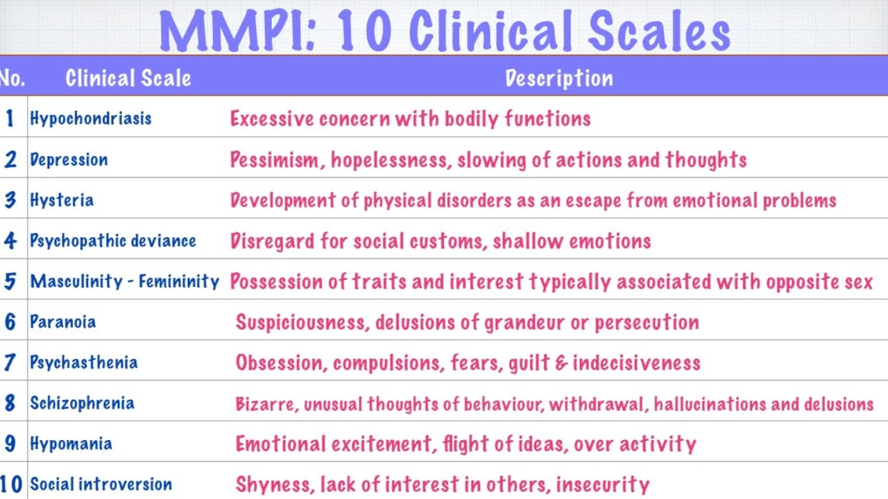

### MMPI的分量表和评分
- 心理学家通过**分量表得分的模式**（而非单一分量表分数）来评估受测者，尤其关注那些**显著高于或低于常模的分数**
- MMPI-2的评分可以**手工完成**，也可以通过**发送答题纸**至专业公司利用计算机完成
- 随着时间的推移，为研究**特定的心理障碍或概念**，新的分量表被不断添加到MMPI中
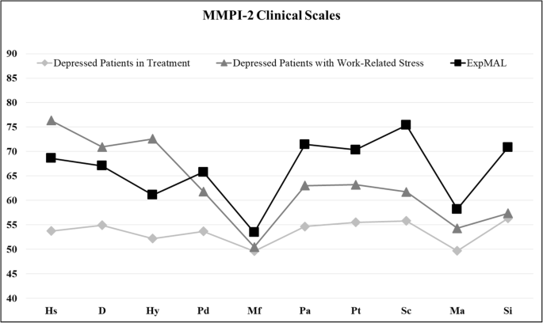

### MMPI在心理健康领域的重要性
- MMPI是临床心理学家使用最广泛的**自陈式量表**之一，尤其在**心理健康领域**占据重要地位
- 几乎所有的临床心理学研究生都被训练使用MMPI-2，表明其**在专业教育中的核心地位**
- 尽管MMPI-2的使用**十分广泛**，但其有效性和适用性等方面的问题**仍然存在争议**
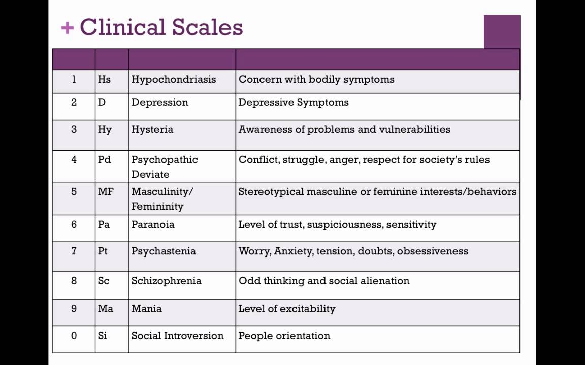

### MMPI使用中的争议和挑战
- MMPI的**有效性问题**，尤其是与测验的构念和提供的**常模数据相关的争议**，经常被提起
- 尽管MMPI的分数被认为是**客观精确**的，但实际上解释这些分数**并非易事**，心理学家需**谨慎处理这些数据**
- MMPI的使用在一些情况下可能被**过度依赖或误用**，需在心理学家的**专业指导下合理运用**

## 自陈式调查表的问题和挑战
### 伪装问题
- 受测者有时**故意提供误导信息**，比如在求职测验中“**伪装好**”，显示出**比实际更好的特质**，或者在某些情况下“**伪装差**”，如试图**表现出心理问题以逃避责任**
- 为**减少伪装行为**，测验编制者应**使测验目的不明显**，增加**补充题目**，或直接**测查伪装倾向**
- MMPI等工具包含检测**伪装的分量表**，可帮助**识别并处理伪装行为**
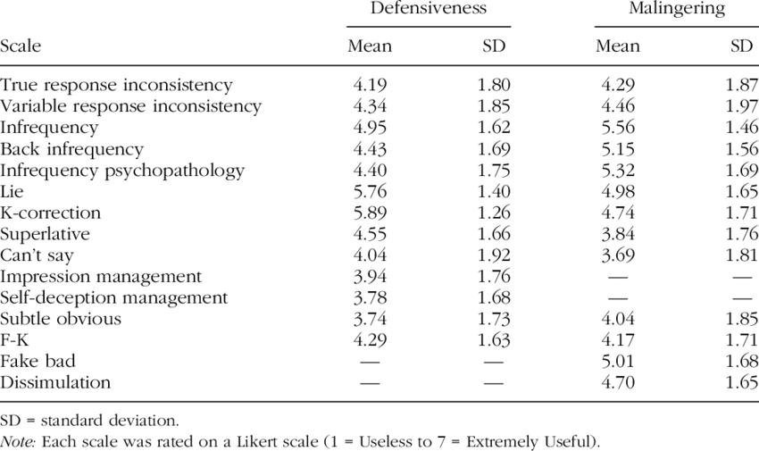

### 粗心和恶意对抗
- 受测者有时因为**厌烦**或**不愿意承认**阅读或理解问题而**随机回答**或**故意提供错误信息**
- 解决这类问题的方法包括在测验中**增设监督**，明确**解释指导语**，并考虑**重复出现的相似题目**以检验一致性
- 对抗性受测者可能**故意破坏测验**，测验时需要监控以确保答案的有效性

### 反应倾向
- 反应倾向包括**社会赞许性**和**默认反应倾向**，指受测者可能无意中表现得比实际更好，或倾向于默认回答"是"或"否"
- 研究者可以通过**设计测量社会赞许倾向的工具**，以及使用**反向记分的题目**来缓解这一问题
- 对于默认反应，通过**交替使用肯定和否定形式的题目**可以帮助识别并抵消这种倾向
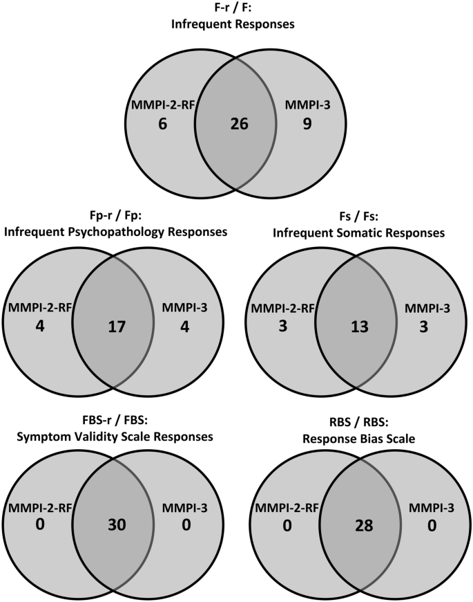

### 总结
- 自陈式调查表虽**广泛使用**，但需**谨慎处理**因受测者行为可能带来的**数据偏差**
- 应通过多种策略和测量工具来增强调查表的**可靠性和效度**
- 心理测试的编制和实施需要**细致入微**，确保结果的精确性和实用性

# 特质流派的贡献和批判
## 优势
### 实证方法的采用
- 与依赖**直觉和主观判断**的心理学派别不同，特质理论家如**奥尔波特和莫雷**使用**客观的测量方法**来验证理论，减少了**研究中的主观偏见**
- 特质理论家们通过**数据**来**形成和调整理论**，再用**实证研究**来进行检验，确保理论的**客观性和可靠性**
- 例如，卡特尔使用**因素分析**的方法来确定人格的基本结构，确保其理论基础的数据驱动和科学验证

### 广泛的应用性
- 特质测量在临床诊断、教育心理学和人事招聘中得到**广泛应用**，证明了它的实用价值
- 在工业和组织心理学领域，人格特质测量常被用作**招聘和晋升的重要依据**
- 就业指导咨询中，特质测量帮助个体选择**适合自己的职业路径**，展现了其在多个领域中的实际效用

### 研究的激增和理论发展
- 特质理论的提出和发展引发了**大量的人格研究**，各类人格相关的学术期刊中充斥着这方面的研究成果
- 每年都有新的人格量表被**开发和发布**，这些研究活动**增强了特质理论的影响力和应用范围**
- 人格特质的测量已成为**预测个体行为的标准方法之一**，在心理学的**多个子领域**中都有显著的应用

## 批评
### 缺乏解释性
- 特质心理学家通常关注于**描述人的特质**，却往往忽视解释这些特质的**产生原因**和**如何处理**得分异常的个体
- 特质理论能**帮助识别**需要特别关注的个体，例如在考试焦虑或自我意识方面得分异常高或低的人，但没有提供**改善这些问题**的心理治疗方法
- 了解特质得分对于教师和雇主**选择任务和工作**有帮助，但对于提供**具体心理干预**的方法则显得力不从心

### 理论框架的缺失
- 特质流派虽然普遍采用**实证研究方法**，但缺乏一个**统一的理论框架**来整合不同的研究成果
- 不同的特质理论家提出了**不同数量的基本人格特质**，如莫雷的27种心因性需要、卡特尔的16或20种基本要素，以及现代的“大五”模式，这造成了**理论上的混乱**
- 这种在基本特质数量上的不一致性使得研究者**难以获得一致的理解**或将一个领域的研究与其他领域的研究**联系起来**

### 缺乏统一结构的挑战
- 由于没有一个明确统一的结构，不同的研究成果往往**难以相互验证或整合**
- 不同理论之间的差异导致**研究方法的分歧**，使得人格心理学的整体发展受阻
- 持续的研究在试图确认哪一种人格特质模型最为准确，但缺乏统一框架使得这些努力在理论上显得**分散和不连贯**
