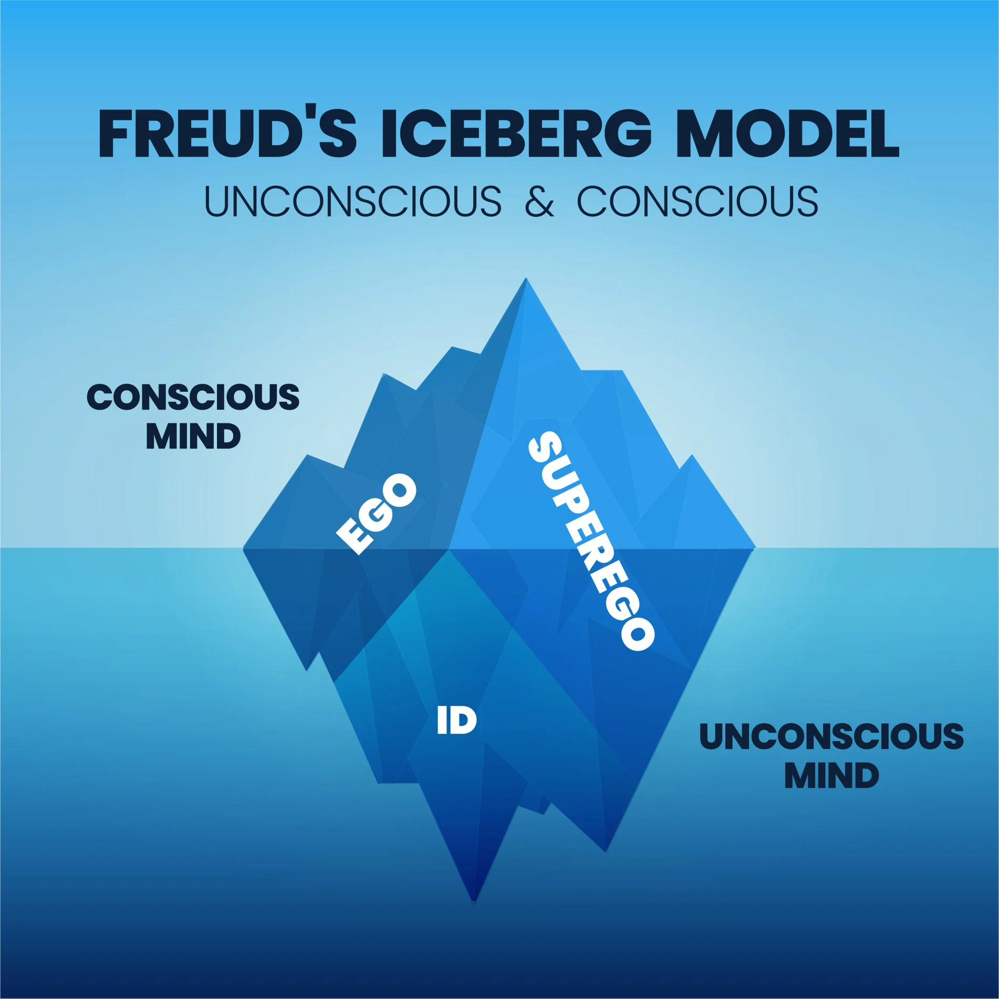

# 弗洛伊德与人格理论
## 弗洛伊德的创新观点
- **弗洛伊德**（Sigmund Freud）是19世纪末**首位被认可的人格理论家**，提出多个**惊人观点**：
  - 年幼儿童存在**性欲**
  - 生理障碍背后隐藏着**无意识的原因**
  - 心理疾病可以通过**谈话**治疗

## 弗洛伊德的影响
- 弗洛伊德的理论改变了心理学家、作家、父母及普通人的思考方式
- 对20世纪心理学和思想有**广泛影响**，使大众接受无意识影响行为的观点

### 弗洛伊德理论的文化渗透
- 弗洛伊德的概念，如梦的分析、无意识、遗忘、拒绝等，广泛应用于**文化、艺术、广告等领域**
- 甚至**语言**中都包含弗洛伊德提出的概念

### 弗洛伊德的遗产
- 弗洛伊德不仅仅是**无意识理论的倡导者**，也是通过**梦境分析**探索内心深处的先驱
- 他的理论为后来的理论家提供了**参考框架**，影响了对人格本质的理解

### 弗洛伊德理论的批评与继承
- 尽管遭受批评，弗洛伊德的理论依然是**心理学和人格理论研究的重要基石**
- 后继理论家不得不与弗洛伊德的理论相比较，展开自己关于人格本质的思考

# 弗洛伊德的理论发展历程
## 弗洛伊德的早期经历
- 最初作为一名**神经学家**受到赞誉
- 1885年前往巴黎与**让·马丁·沙考**合作，研究催眠对治疗某些疾病的作用
- 回到维也纳后，与**约瑟夫·布洛伊尔**合作，探索催眠在治疗歇斯底里病人中的应用

### 弗洛伊德与布洛伊尔的合作
- 他们对**安娜·O**的案例进行了研究，她的治疗确定了弗洛伊德后来的研究方向
- 通过**催眠和自由联想技术**，揭示了歇斯底里症状与潜藏心理经历之间的联系
- 发表《**歇斯底里症的研究**》，详细论述了催眠治疗歇斯底里症的方法

## 弗洛伊德的理论创新
- 弗洛伊德从神经学家转变为心理学家
- 发现自由联想揭示的记忆通常与性创伤经历相关，这些经历大多发生在**幼年时期**
- 提出 与**成年期心理疾病**之间的联系

### 弗洛伊德的挑战和接受
- 早期著作遭遇**学术界和医学界的抵制**，其理论**与当时社会观念相悖**
- 尽管面临挑战，弗洛伊德继续研究，逐渐吸引了**一批追随者**
- 成立**维也纳精神分析协会**，虽然后来许多成员离开，但他们的理论风格依然受到弗洛伊德的影响

## 弗洛伊德的国际认可
- 1909年，弗洛伊德应邀在**美国克拉克大学**进行精神分析讲座，标志着其理论开始获得**国际认可**
- 继续发展其理论并发表著作，成为精神分析学派**最具影响力的心理学家之一**

### 弗洛伊德的遗产
- 弗洛伊德对心理学和20世纪思想产生了**深远的影响**
- 他的理论不仅改变了**对人性的理解**，也深深渗透到文化、艺术、语言等**多个领域中**

# 弗洛伊德的人格理论

## 脑解剖模型（The Topographic Model）
- 弗洛伊德将人格分为**意识、前意识、无意识**三部分
- **意识**（Conscious）：人们**意识到的想法**
- **前意识**（Preconscious）：可以**轻松调入意识的信息**，如回忆
- **无意识**（UnConscious）：**无法直接意识到**的思想和欲望，对行为有深刻影响

## 结构模型
### 本我（Id）
- 出生时人格的**唯一结构**，追求**快乐**，满足**个人欲望**
- 行为遵循**快乐原则**，不考虑**现实的物理和社会约束**
- 主要隐藏于**无意识**中，包含**性和攻击的冲动**

### 自我（Ego）
- 随婴儿与环境互动**逐渐发展**，行为遵循**现实原则**
- 努力满足**本我冲动**，同时考虑**行为的后果和社会的接受度**
- 能在意识、前意识、无意识之间**自由活动**

### 超我（Superego）
- 约5岁开始形成，代表**社会和父母的价值标准**
- 限制本我，提供**道德标准**，产生**罪恶感**
- 超我过强会导致**过度的道德焦虑**

### 三者间的关系与冲突
- 本我、自我、超我之间的**互动**形成了人的行为和心理状态
- 健康人格中，**自我能平衡本我和超我的需求**
- 个体的内心常常存在着自我放纵、考虑现实性和道德准则之间的**紧张状态**

## 本能和紧张的缓解
- 弗洛伊德认为人类行为受**本能**（驱力或本能）驱使，分为**生（性）本能**（Life instinct）和**死（攻击）本能**（Death instinct）
- 生本能主要关于**性欲和获得快乐的行为**，死本能关于**攻击和自毁**
- 弗洛伊德的理论受**能量守恒的科学思想**影响，认为**心理能量有限**，需要**合理分配**以维持心理健康
- 人类行为的目标是达到**无紧张的状态**，通过满足本能需求来减轻心理紧张

## 防御机制（Defense mechanism）
### 压抑（Repression）
- 把威胁自我的思想**从意识中排除**，是弗洛伊德认为的**最重要防御机制**
- 需要**持续的能量**来维持，过多压抑会**耗尽能量**，影响自我的功能

### 升华（Sublimation）
- 将不可接受的冲动**转化为社会上可接受的行为**，是唯一**完全积极**的防御机制
- 例如，将攻击性转化为参与体育运动

### 替代（Displacement）
- 将冲动从一个目标**转移到另一个较安全的目标**
- 如，将对某人的愤怒转移到别的事物或人身上

### 拒绝（Denial）
- **拒绝接受**某些事实的存在，**与现实脱节**，可能导致心理健康问题

### 反应生成（Reaction Formation）
- 以与无意识欲望**完全相反**的行为方式行事，隐藏真实想法或欲望

### 理智化（Rationalization）
- 通过**逻辑和理性解释**隐藏不可接受的冲动或行为

### 投射（Projection）
- 把自己的某些想法或冲动**归咎于别人**，避免承认自己持有这些想法

### 总结
- 防御机制帮助个体避免焦虑和内心冲突，但过度使用除升华外的防御机制可能导致心理问题

## 发展的心理性欲阶段
### 口唇期（Oral Stage）
- 时间：生命的**前18个月**
- 主要性感区：**口、唇、舌**
- 特征：婴儿**将几乎所有东西放入口中**
- 固着后果：可能导致成人**依赖他人**，嗜烟酒、经常将手或物体放入口中

### 肛门期（Anal Stage）
- 时间：**18个月至3岁**
- 主要性感区：**肛门**
- 特征：与**入厕训练**相关
- 固着后果：可能导致成人**过分爱整洁或固执**，或**过于慷慨**

### 生殖器期（Phallic Stage）
- 时间：**3至6岁**
- 主要性感区：**阴茎或阴蒂**
- 特征：经历**俄狄普斯情结**，对异性父母**产生性兴趣**
- 固着后果：可能导致成人性格中表现出强烈的**乱伦欲望或竞争焦虑**

### 潜伏期（Latency Period）
- 时间：**6岁至青春期前**
- 特征：性欲表现**不明显**，男孩与男孩玩，女孩与女孩玩

### 性器期（Genital Stage）
- 时间：**青春期开始**
- 主要性感区：**成年生殖器**
- 特征：性欲增强，集中于**成年生殖器区**
- 成功过渡：具备**正常的异性爱机能**

## 了解无意识的东西
### 梦
- 被视为“**通往无意识的捷径**”
- 弗洛伊德将梦视为**愿望的实现**，分为显意和隐意
- 梦中的**表征物**（如喷泉、飞机、洞穴等）象征性地代表无意识想法

### 投射测验（Projection test）
- 通过**模糊刺激**（如云形状）引出内心深处的想法
- 反映受测者**无意识中的思想**

### 自由联想（Free association）
- 鼓励受访者**表达内心的想法**，揭露**被压抑的无意识内容**
- 能揭示平时被**自我监督**排除在意识之外的想法

### 弗洛伊德口误（Freudian slip）
- 口误被视为**无意识冲动的表露**
- 例如，**错误使用他人姓名**可能反映了深层的感情态度

### 催眠（Hypnosis）
- 被弗洛伊德视为**接触无意识的手段之一**
- 在催眠状态下，人们**更容易表达**通常被压抑的无意识内容
- 然而，并非所有的人都对催眠敏感

### 意外
- **看似意外的行为**可能是无意识冲动的直接表达
- 例如，"意外地"撞坏朋友的贵重物品可能反映了无意识中的**攻击性欲望**

### 象征行为
- **日常行为中的某些行为**可能是无意识欲望的象征性表达
- 例如，对雏菊图案的反复踩踏行为象征着对母亲的敌意

# 应用：精神分析（psychoanalysis）
## 精神分析的目的
- 将重要的**无意识内容**带入**意识层面**，用理性方式进行考察和处理
- 通过治疗师和患者的合作，**重新调整**自我对本我冲动和压制性超我的控制

## 治疗方法
- 使用**自由联想、释梦、催眠**等手段获取无意识内容
- 患者**躺在沙发上**，治疗师坐**在视线之外**，鼓励患者**自由表达思想**，以减少自我监督

### 获取无意识信息的技术
- **自由联想**：病人**自由地说出心中的思想**
- **释梦**：分析**梦境中的象征意义**
- **催眠**：早期使用，后**被自由联想取代**

## 治疗过程
- **漫长且成本高昂**，常需**几年时间**每周**数次**治疗
- 重点在于获取**造成心理障碍的无意识内容**
- 病人可能表现出**拒绝治疗的行为**，如忘记预约，回避讨论，这可能意味着**接近了重要的无意识内容**

### 移情与反移情
- **移情**（transference）：患者将过去情境中的情感**转移至治疗师身上**，有助于揭示**深层的无意识情感**
- **反移情**（countertransference）：治疗师将个人对他人的情感**转向患者**，需**避免以维持治疗的客观性**

### 案例分析：杜拉案例
- 杜拉，18岁，因头疼和其他生理问题接受治疗
- 经历性侵犯及与成人复杂关系相关的创伤
- 弗洛伊德通过解释杜拉的梦境，揭示其**无意识中的冲突和欲望**

## 治疗的目标和成果
- 释放被压抑冲突消耗的能量，使自我能**有效地执行其功能**
- 成功的治疗使病人能过上**快乐、正常的生活**

# 评价：投射测验
## 投射测验简介
- 投射测验通过提供**模糊刺激**，如**墨迹或模糊图片**，让受试者作出反应
- 受试者的反应被视为**无意识的投射**，可以揭示被抑制的冲动

## 投射测验的类型
### 罗夏墨迹测验（Rorschach Inkblot Test）
- 设计者：**赫尔曼·罗夏**
- 特点：使用**10张有墨迹的卡片**，要求受试者**描述所见**
- 用途：分析**异常反应和重复主题**，用于心理治疗

### 主题统觉测验（Thematic Apperception Test, TAT）
- 设计者：**亨利·莫雷**
- 特点：**一系列模糊图片**，要求受试者**讲述故事**
- 用途：被认为是**个体内在人格的线索**

### 画人测验（Draw-a-Person Test）
- 特点：要求受试者“**画一个人**”，分析绘画揭示的心理问题
- 用途：**评定心理问题**，特别是儿童

## 对投射测验的批评
- 信度和效度**普遍低**
- 缺乏**跨时间稳定性和内部一致性**
- 评分者间**一致性低**

### 投射测验的效度问题
- 结果通常以**一般的解释性词语**呈现，难以预测**具体行为**
- 缺乏**客观效标**来检验投射测验结论的效度

### 投射测验的应用与价值
- 尽管存在争议，但仍**广泛用作心理学研究工具**
- 能有效帮助治疗师**深入了解病人的人格**
- 应谨慎使用，**不应过分依赖**作为诊断工具

### 实例
- 罗夏墨迹测验中，如果病人在每张卡片上都看见与**死亡相关的图像**，可能表明病人对死亡有**深层次的焦虑**
- 主题统觉测验（TAT）中，受试者根据图片讲述的故事可能揭示他们**对爱、悲伤或痛苦的内在感受**
- 画人测验中，儿童的绘画可能反映他们**内在的想法和情感**，如常画鬼怪的孩子可能在表达内心的烦恼

# 弗洛伊德理论的贡献和批判
## 贡献
### 引领心理学研究方向
- 弗洛伊德的理论是**第一个综合性的人类行为与人格理论**
- 大多数后来的人格理论家在建立自己的理论时，都必须与弗洛伊德理论进行**对比和补充**

### 心理治疗的奠基人
- 弗洛伊德被认为是**心理治疗体系的创始人**
- 他的治疗技术，如自由联想、催眠和释梦，成为许多**治疗师的标准工具**

### 推广心理学原理
- 弗洛伊德对**焦虑等心理学原理的探讨**，影响了后续许多心理学领域的研究

## 批判
### 创新性的质疑
- 弗洛伊德的许多所谓“**革命性**”思想，在当时**并非全新**，如**无意识**的概念在欧洲已有广泛讨论

### 理论的可验证性问题
- 许多基于弗洛伊德理论的假设**难以通过实验来证实或反驳**，限制了其科学价值

### 依赖个案研究
- 弗洛伊德的理论主要基于**特定群体**（如有心理障碍的病人）的个案研究，可能**存在偏差**

### 理论的重点和风格
- 弗洛伊德的理论被批评为过分强调**本能和心理障碍的消极面**，忽视了社会文化因素和人格的积极面
