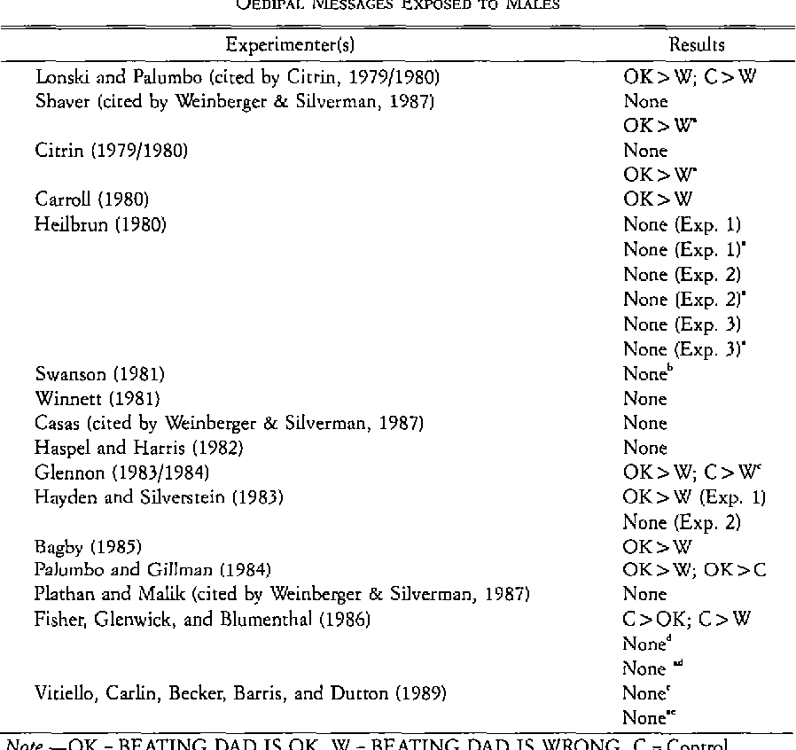

[TOC]
# 对弗洛伊德理论的反应和研究
### 学生对弗洛伊德理论的不同反应
- 一部分学生对弗洛伊德**深入洞察人类行为的能力**表示兴趣
- 另一部分学生持**怀疑甚至嘲笑**的态度，认为某些观点是**弗洛伊德的幻想**

### 对弗洛伊德理论的批评
- 弗洛伊德的理论因**缺乏可靠的实证支持**而受到批评
- 个案研究方法**存在偏见**，使得从病人口述中获得的数据**可靠性受到质疑**
- 理论中有许多部分**不可检验**，难以转化为实验研究

### 研究弗洛伊德理论的尝试
- 尽管存在困难，一些研究者成功地从弗洛伊德的著作中发**现可检验的假设**
- 对弗洛伊德感兴趣的现象——催眠、口误、焦虑、早期经历等进行了深入研究

## 研究内容
#### 梦的研究
- 探讨**梦的研究**是否支持弗洛伊德的观念

#### 恋母情结的实验室检验
- 研究者尝试以实验室方式检验**恋母情结冲动**

#### 无意识过程的探索
- 研究在人未意识到的情况下思想如何**进入无意识**

#### 对幽默的研究
- 根据精神分析理论，无意识动机常通过**笑话和幽默**表达

#### 催眠的考察
- 探索**催眠现象**及其对人的反应差异的原因

# 梦的解释
## 梦的含义
### 弗洛伊德对梦的看法
- 弗洛伊德认为梦揭示了**隐藏在无意识中的信息**
- 梦通过象征符号表达**重要的无意识素材**
- 梦是**未解决冲突的浮现**，为治疗师提供关于**无意识冲突**的线索

### 梦中人物的性别
- 研究表明，女性梦中的男女人物数量**大致相等**，而男性梦中**男性人物比女性多**
- 这可能与**恋母情结和恋父情结**有关，反映了**男性与父亲的未解决冲突**

### 梦的再现
- 梦的**重复出现**表明梦所反映的冲突**非常重要且悬而未决**
- 重复梦的人通常处于**焦虑状态**，白天的**适应能力较差**

### 梦中的象征物
- 弗洛伊德认为梦中许多无意义的物体和行为是**性和性活动的象征**
- 焦虑程度越高的人，梦中的确出现**典型性象征物**（如铅笔、盒子、飞翔）的次数越多
- 这些象征性表达反映了**因焦虑而不能直接表达的性欲望**

## 梦的功能与研究
### 弗洛伊德的观点
- 认为梦是**无意识冲动的象征性表达**，提供了这些冲动得以**安全释放的途径**

### REM睡眠的发现
- 20世纪50年代发现了**快速眼动**（REM）睡眠，与**梦境活跃**相关联

### 梦与精神健康
- 早期研究认为，快速眼动睡眠和做梦对**维持精神健康**非常必要
- 后续研究提出了对这一结论的质疑，但认同梦对**处理焦虑和自我恐吓**有积极效果

### 快速眼动睡眠的实验研究
- 研究显示，快速眼动睡眠有助于**缓解焦虑和改善对压力的应对能力**
- 观看**尸体解剖影片**的实验表明，**快速眼动睡眠**后的参与者**更好地处理焦虑**

### 梦的心理作用
- 实验结果支持梦有助于**解决问题和改善情绪状态**的观点

### 挑战弗洛伊德理论的研究
- 发现新生儿和几乎所有哺乳动物，包括胎儿期的人类，**都有**快速眼动睡眠，提示快速眼动睡眠有除了释放无意识冲突外的**其他功能**

### 总结
- 尽管有研究结果与弗洛伊德的理论**相一致**，但也存在**挑战其理论的证据**
- 大多数研究认同梦有**重要的心理作用**，但梦的确切功能仍然是未来研究的一个**复杂话题**

# 恋母情结
### 弗洛伊德的观点
- **恋母情结**（Oedipus Complex）是精神分析理论中的一个**争论焦点**，弗洛伊德认为**男孩对母亲有性意图**，而这一点通常通过治疗病人或与病人父母的谈话得到证据
- 弗洛伊德认为**所有男孩**都经历**恋母情结阶段**，但通过**压抑**（Repression）解决这一问题
- 恋母情结是弗洛伊德理论的**基石之一**，引起广泛争议

### 实证研究的尝试
- 有研究者通过比较男性**对妻子生理特征的偏好**与其**母亲**的描述，发现**明显相关性**
- 这可能说明男性通过寻找**与母亲相似的伴侣**来象征性地解决未解的恋母情结

### 批评和挑战
- 恋母情结的实证支持努力**多未成功**，其研究结果常有**非唯一的解释**
- 批评者质疑**5岁男孩对母亲有性意图**的说法

### 实验验证的难题
- 试图通过实验方法来证明恋母情结存在的研究面临难题，如何**操作和证明无意识的影响**是主要挑战
- 精神分析学家面临的挑战是如何**单独证明**无意识的恋母情结影响人的行为

## 阈下心理动力激活（Subliminal Psychodynamic Activation）
### 研究方法
- 研究者通过**速示器**向参加者**快速展示意象**，时间仅为**千分之四秒**，足以**被无意识记录**，但**无法被意识识别**
- 此方法旨在将信息和意象**留在部分人的无意识**中，为精神分析理论提供支持的实证证据

### 研究发现
- 超过100次研究使用此方法，声称有**大量发现支持弗洛伊德理论**
- **抑郁**源于**攻击性冲动向内转化**：向抑郁症患者展现攻击性意象会加剧抑郁症状
- **口吃**与**说话排便**联想：向口吃者展示排便意象会加重口吃
- **依赖性人格**对**拒绝**的反应：向有口唇期依赖性人格的人展示拒绝信息，会引起强烈心理反应
- **减轻焦虑**：向参与者展示“妈妈和我一样”句子后，焦虑水平降低

### 实验结果的解释
- 实验结果**支持弗洛伊德的一些基本理论**，如**抑郁症状**加剧反映了**攻击性冲动向内转化**的过程
- **口吃加重和依赖性人格**的反应展示了**无意识冲动和忧虑**的影响
- **减轻焦虑**的实验表明，正面的阈下信息可能**帮助人们获得自信**，尤其是在**与母亲分离的焦虑情境**中

## 有关恋母情结的研究
### 实验设计
- 实验通过**阈下心理动力学激活**（Subliminal Psychodynamic Activation）方法，探索未加排解的恋母愿望**如何在日常行为中表现出来**
- 研究者在不同的实验组中展示**不同的速示图像**，旨在操纵参与者的无意识恋母冲动

### 实验结果
- 看到**增加恋母冲突信息**的参与者（"打败爸爸是错误的"）在竞争游戏中**表现更差**
- 看到**减少恋母冲突信息**的参与者（"打败爸爸没错"）则**表现更好**
- 对照组**没有明显的行为改变**，展示了无意识恋母情结冲突的操纵**可能影响**与父亲的象征性竞争能力

### 其他实验
- 实验也测试了**非恋母情结的信息**（"打败妈妈是错误的"和"打败妈妈没错"），发现这些信息**对行为没有影响**，这勉强支持了**恋母情结的存在**
- 通过控制字母大小、位置、信息亮度等变量，确保实验结果的**准确性**

## 批评与挑战
### 研究方法的争议
- 阈下心理动力激活方法虽**吸引人格研究者**注意，但其有效性因恋母情结等**争议话题**而受到挑战
- 批评者**质疑实验方法**，认为研究结果的可靠性受到影响

### 结果的可重复性问题
- 心理学中重视**研究结果的可重复性**，但有关恋母情结的实验结果往往**难以在不同实验室重复出现**，引发了对实验有效性的质疑
- 尽管西尔弗曼及其同事**成功复制了实验结果**，但其他研究者**未能达到相同的结论**

### 对不能复制现象的解释
- 除了西尔弗曼外，其他研究者也通过阈下心理动力激活程序成功**探索了非恋母情结相关的问题**，表明方法**本身可能有效**
- 一项研究结果的**不可复制**可能有多种原因，**不一定**意味着原始结果不真实

### 结论
- 对弗洛伊德理论的实证支持需要**可靠且可复制的结果**，面对批评和挑战，研究者**应提供更强的证据**
- 弗洛伊德理论中的关键问题仍**难以通过实验研究验证**，未来技术进步可能为验证精神分析理论提供新的方法

# 幽默
## 弗洛伊德关于幽默的理论
### 幽默的分类
- 弗洛伊德区分了**两种倾向性笑话**：与敌意有关的和与性有关的
- **不友善的笑话**通常**贬低或嘲弄他人**，反映了**隐藏的敌意**
- **性笑话**则以一种社会认可的方式讨论**忌讳的性话题**

### 攻击性笑话的作用
- **攻击性笑话**允许以社会允许的方式**表达通常被抑制的攻击冲动**
- 通过**讽刺或贬低**，人们可以**间接地表达对他人的敌意**，从而获得愉悦感

### 性幽默的社会作用
- **性笑话**为人们提供了一个**公开讨论性话题的社会认可渠道**
- 即使是**保守或正统**的人，在**特定的幽默环境**中也可能谈论性

### 紧张与缓解的机制
- 笑话先通过其内容**引起听众的紧张**，然后通过**妙语**使紧张得以**缓解**
- 人们笑的原因不仅仅是**笑话本身的聪明或机智**，更多是因为笑话**减轻了他们的紧张和焦虑**

## 对弗洛伊德幽默理论的研究
### 对不友善幽默的偏好
- 研究表明，人们倾向于更喜欢**指向他们不喜欢的人或群体**的不友善幽默
- 这支持了弗洛伊德的理论，即不友善的幽默能够使我们**以一种社会可接受的方式表达敌意**

### 用不友善的幽默减少攻击性
- 某些研究发现，不友善的幽默能够**减少人们的攻击性行为**
- 例如，**被激怒的人**在接触到**含有敌意的幽默**后，展现出**较少的攻击倾向**

#### 研究案例
- 在一项实验中，通过**激怒参与者**然后让他们**接触敌意或非敌意的笑话**，结果显示**生气的参与者**对不友善的幽默反应**更加积极**

### 紧张和好笑的水平
- 弗洛伊德理论认为，笑话之前**建立的紧张**越强，最终的**笑声**就越响亮，因为紧张的释放带来了**更大的愉悦感**
- 实验结果支持这一理论，**高度紧张状态**下的参与者对于幽默的反应**更为强烈**

#### 实验示例
- 一项实验通过让参与者在处理“老鼠”（实际上是玩具老鼠）的任务中**建立紧张**，然后通过揭示这是一个玩具来**产生笑料**，结果显示**紧张水平越高的组笑得越开心**

### 对研究结果的解释
- 尽管有支持弗洛伊德理论的证据，但也有研究结果可以从**其他理论**（如不一致理论）来解释
- **不一致理论**认为，幽默源于人们的期望与实际发生的事情之间的**不匹配**

#### 弗洛伊德理论的贡献
- 弗洛伊德的幽默理论引发了**大量的假设和研究**，尽管解释可能多样，但它提供了理解幽默本质的有价值视角

# 催眠（Hypnosis）
### 催眠诱导及反应
- 心理学家通过催眠诱导程序引导学生进入一种**精神恍惚的状态**
- 在催眠状态下，学生们接受**特定任务的暗示**，如想象手臂被重物拉下或有苍蝇围绕头部
- 催眠后，学生们对经历的**记忆差异显著**，有的**完全遗忘**，有的**记住部分**，有的能**完全复述**

### 催眠的应用
- 催眠在治疗牙痛、帮助目击者回忆犯罪细节以及揭示病人问题的**关键性无意识素材**等方面被广泛应用
- 尽管催眠被**广泛使用**，心理学家对于催眠起作用的机制仍有**不同见解**

### 对催眠的争论
- 催眠虽存在200多年，但其性质仍然是**神秘且常被误解的**
- 心理学家之间对催眠的效果和机制存在**广泛的讨论和争论**

## 催眠的性质与理论解释

### 催眠的理论连续体
- 催眠被视为从触及**人类意识深处**到纯粹**基于社会和认知过程的连续体**上的现象
- 弗洛伊德认为催眠可接触**无意识**（Unconscious），而**社会认知理论家**（Social Cognitive Theorists）认为催眠现象无需改变意识状态即可解释

### 精神分析观点
#### 弗洛伊德的看法
- 通过催眠可与被催眠者的无意识**心理互动**
- 催眠状态下，**无意识阻碍减弱**，易接近**关键无意识素材**

#### 新分裂论（Neodissociation Theory）
- 催眠引发**意识分裂**，一部分进入**变异状态**，另一部分**保持清醒**（"隐藏的观察者"）
- 通过**失痛症实验**展示了"隐藏的观察者"的作用

### 社会认知理论解释
#### 社会认知的挑战
- 挑战精神分析理论，认为**催眠下的行为与清醒时无异**
- 用**期望、动机和集中注意力**等概念解释催眠现象

#### 社会角色理论
- **被催眠者行为**是对催眠师**期望的反应**
- 指出"**隐藏的观察者**"可能是**被实验条件所诱导的期望效应**

### 催眠后遗忘
#### 精神分析的解释
- **催眠体验信息**被储存于**独立区域**，自我阻止其进入意识
- 使用**催眠实验**和**自我制造亚系统**理论支持

#### 社会认知的反驳
- 提出被催眠者因**不期望回忆**而未努力记住
- 实验通过**增强回忆期望**，证明催眠后遗忘

## 对催眠的反应
### 催眠反应的个体差异
- 人们对催眠的反应存在**显著的个体差异**，一些人对催眠师的暗示**反应积极**，而另一些人则**反应消极或无反应**
- 研究表明，**催眠师的技巧**对被催眠者的反应**影响有限**，被催眠者的**个体特征**才是**决定催眠反应的关键因素**
- 反应积极的人对**不同催眠师的暗示**也会产生**积极反应**，催眠反应性在个体之间具有一定的**稳定性**

### 增强催眠反应的方法
- 设定**合适的催眠情境**，建立催眠师与被催眠者之间的**信任关系**，有助于增强参加者的催眠反应
- 即使采用**标准化的催眠诱导程序**（如录音或电脑程序），个体之间的催眠反应差异**仍然显著**
- 对催眠的**态度、动机和期望**是影响催眠反应的关键社会心理因素

### 预测催眠反应的因素
#### 人格特征
- 早期研究尝试寻找与催眠反应性相关的**人格特征**，但**未能找到**强有力的相关性
- 后续研究发现，**专注特质**（Trait Absorption）与催眠反应性有较强的相关性，专注特质高的人对催眠的反应**更为积极**

#### 社会心理因素
- 对催眠持**肯定态度、高动机**以及**正面的期望**都与强烈的催眠反应相关
- 实验通过**改变参加者对催眠的期望**，成功地提高了他们的催眠反应

### 催眠反应的训练
- 即便是起初对催眠反应不敏感的人，通过**训练**也能提高他们对催眠的敏感度
- 训练过程包括**鼓励积极的态度、参与感和期望管理**，参加训练的个体在一年后的催眠反应**仍然较强**
- 这些发现表明，通过**社会心理干预**，可以在一定程度上调整和提高个体的催眠反应性
