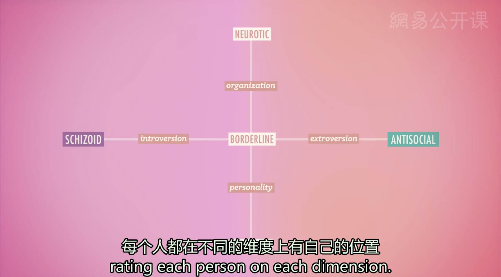

# 人格障碍
* **自我不协调障碍**（EGO-Dystonic）；有这种问题的人都清楚地知道自己有心理问题，并且内心倾向于感到十分痛苦
* **自我协调障碍**（EGO-Syntonic）：患有这种心理问题的人通常并不会觉得自己不正常，有时候他们甚至觉得是其他人有毛病
* **人格障碍**（Personality Disorder）：刻板的、破坏性的、持久的**行为方式**，对患者的社会和其他正常功能造成了伤害，但患者本身认识不到这一点
  * 人格障碍的跨度可以从相对无危险性的自恋表现，到真正有严重问题的对其他人的感受完全缺乏同理心 
  * **心理病态**（Psychopathy）和**社会病态**（Sociopathy）：最为极端和严重的人格障碍
  * 对于人类人格特征的研究已经持续了数千年，但人格障碍却是一个很新的概念，1923年才有疾病标准
* 人格障碍的分类
  * **三类法**

    * **类型A**，包括通常被简单地称作“古怪”或“不正常”的人格特征，例如患有**偏执**型人格障碍的人，会对他人感到普遍的不信任，一直保持戒心和怀疑；然而，一个**精神分裂**型人格障碍患者会表现得过于高冷，没有兴趣与人交往，对他人很少有情感上的回应
    * **类型B**，包含戏剧性情感或冲动人格特征，例如，**自恋**型人格会表现出自私、自我膨胀，强调自身的重要性和应有的权利；同时，**表演**型人格会一直哗众取宠来吸引他人的注意，有时甚至故意做出危险的行为，更有甚者会佯装自杀
    * **类型C**，包括焦虑、恐惧或回避的人格特质，例如**回避和依赖**性人格障碍患者通常会避开与陌生人见面，害怕承担风险，表现出缺乏自信，极度需要被人照顾，十分惧怕被抛弃
    * 许多研究者认为这些心理障碍之间有些症状**重叠得太多**，以至于我们无法将它们区分开来，例如自恋型人格有许多特质与表演型人格很相像；正因为有这些灰色地带的存在，最为常见的被用于诊断的人格障碍实际上是没有特别针对性的人格障碍，建成PDNOS
  * **维度模型**（Dimensional Model）：它事实上并不把心理障碍当作彼此分离的疾病，而是使用人格特质或症状的不同维度来对障碍进行定义，每个人都在不同的维度上有自己的位置

    * **边缘型人格障碍**（Borderline Personality Disorder，简称BPD）：经常会使用不正常、不健康的行为方式来使自己基本的心理需求获得满足，比如为了得到爱和肯定，他们会暴走，宣泄愤怒，或者正好相反，用自残行为，比如割伤自己，甚至更严重
    * **反社会型人格障碍**（Antisocial Personality Disorder，别名心理病态或社会病态）：反社会型人格障碍的患者通常是男性，表现出对错误的行为毫无愧疚感，甚至对于朋友家人也是如此
      * 除了典型的残酷无情、缺乏同理心以及时有发生的犯罪行为，犯罪行为并不总是反社会行为的必要表现
      * 尽管反社会型人格只占一般人口中的大约1%，一项研究中估计在被监禁的人群中，反社会型人格的比例大约占16%
      * **因素**：基因和生物影响因素会与虐待或受忽视的环境因素相结合，从而塑造出古怪的、不健全的人格
        * 反社会型人格障碍的早期征兆有时候在个体3、4岁的时候就出现了，通常表现为恐惧条件作用的学习困难
        * 典型的反社会型冲动控制的缺乏和其他症状，同样与一定脑结构的损伤有关；事实上，暴力行为的惯犯**额叶**的脑组织比正常人要少11%，他们的大脑同样还对表现压力或痛苦的面部表情具有更少的反应，这种现象有时在儿童时期就表现出来了，所以有可能一些反社会型人格之所以缺乏同理心仅仅是因为他们没有或无法识别他人的情绪
        * 过度反应的“多巴胺奖励机制”暗示着反社会型人格将内心的冲动付诸实践，从而获得刺激体验或短期的奖励，且完全不考虑后果的这种内部驱动力与普通人相比要更加强烈
      * **治疗**：即使患者意识到了问题，具有针对性的治疗方法也十分有限，至少对于成年人来说没有；但对于儿童和青少年来说，有一些很有前景的干预措施，因为他们的心灵和大脑具有更大可塑性和适应性
        *  根据美国精神病学家唐纳德·W·布莱克的意见，许多儿童被诊断为**品行障碍**（Conduct Disorder），反社会型障碍的早期形式，患者在成年后有很高的几率发展成反社会型人格；但通过及时发现矫正可能的征兆，那些头脑发热的一时冲动可以被转化为更加健康的内容，比如体育运动中对于奖牌的追求或冒险精神
---

