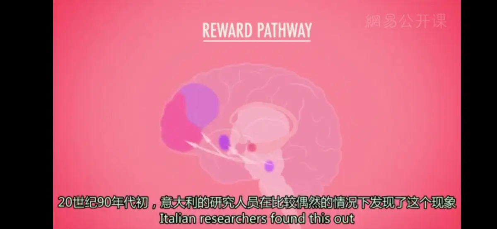

# 其他学习
* **行为主义联想学习**
  * **经典条件作用**（Classical Conditioning）：在刺激和一种应答性行为之间建立联系
  * **操作性条件作用**（Operant Conditioning）：在刺激和自主行为之间建立联系
  * **缺陷**：行为主义者坚持认为在学习方面，不同训练对象得到的效果没有什么差别，甚至是完全一样；事实上，当联结有助于生物的生存或繁荣时，它们就越容易学会这种新技能，所以生物对于不同的联结学习效果是不同的
---
* **生物学与学习**
  * **学习的生物制约性**：物种的遗传天赋给学习带来的限制
  * **本能漂移**（instinctual shift）：遗传基因型会决定特定动物的行为倾向，随着时间推移，通过操作性条件作用习得的行为也会向着本能行为漂移
  * **味觉-厌恶学习**（taste-aversion learning）：仅对某种味觉与产生的厌恶进行一次匹配便可形成联结，并且将会永久保持
    * **生物准备**的一个例子，某些物种已经得到进化，使得该物种的成员只需要少于正常的学习便可获得条件性反应
---
* **认知学习**（Cognitive learning）
  * **比较认知/动物认知**（comparative cognition）：关注更广范围的行为，以便追踪不同种类之间认知能力的发展轨迹，以及从动物到人类之间的能力的连续性
    * **认知地图**（Cognitive Maps）：条件作用不仅涉及反应与强化物间的简单联结，还包含周围环境在心理的表征
      * 许多动物有强大的**空间记忆能力**，用于识别环境特征、发现环境中的目标物与设计环境中的行进路线
    * **概念性行为**：对不同概念与类别形成概括化，例如鸽子可对物体进行分类
  * **观察学习**（Observational learning）：个体仅仅在观察到他人（**榜样**）的行为被强化或被惩罚后，就会在后来做出类似行为，或者抑制该行为
    * **起源**：心理学家**阿尔伯特·班杜拉**的实验：观看了女人殴打小丑“波波”的孩子更容易模仿对方的攻击性行为
    * **意义**：挑战了那个年代一度处于统治地位的行为主义的观点，即学习仅仅是条件作用和联结建立，奖励和惩罚的结果；促进了20世纪实验心理学的革命，使心理学实验从单纯的行为主义模式进化为现在的社会认知模式
    * **决定因素**
      * 注意：观察者必须注意到榜样的行为及其后果
      * 记忆：观察者必须把榜样的行为储存在记忆中
      * 再现：观察者在身体和心理上有能力再现榜样的行为
      * 动机：观察者必须有理由重现榜样的行为
    * 我们的**认知**（Cognition），也就是我们的思维、知觉和期望，对于学习都很重要；我们的**社会环境**（Social Context）也一样重要
    * **应用**：电视暴力对孩童的影响
      1. 增加攻击性行为
      2. 对日常生活中发生暴力事件的可能性估计过高
      3. 导致脱敏，在看到生活中的暴力行为时情绪唤起降低
---

* **镜像神经**（Mirror Neurons）： 
  * **发现**： 20世纪90年代，意大利的研究人员在研究猴子大脑中与计划和执行有关的区域的信号，当猴子做出捡起一块水果冰吃掉之类的行为时，大脑监控仪会发出轻微的嗡嗡声；有一天，一名研究人员买了一根甜筒带回实验室，仪器显示猴子大脑的活动就像是它自己在舔甜筒一样
  * **定义**：一种前所未知的脑细胞的类型，一种当被试做出相同的行为，和当被试观察别人做出某种行为时会产生激活的神经细胞
  * **意义**：神经影像学应用到人的结果，个体大脑中的奖励系统也受到他人行为间接的刺激，揭示了观察、模仿和学习之间无比紧密的联系
---
>模仿并不是真诚的奉承，而是真诚的学习。——乔治·伯纳·萧
>事实上，模仿构成了我们大部分的自我.——查斯特菲尔德勋爵
---
[Crash Course](https://www.bilibili.com/video/BV1Ax411N75Q?p=13)