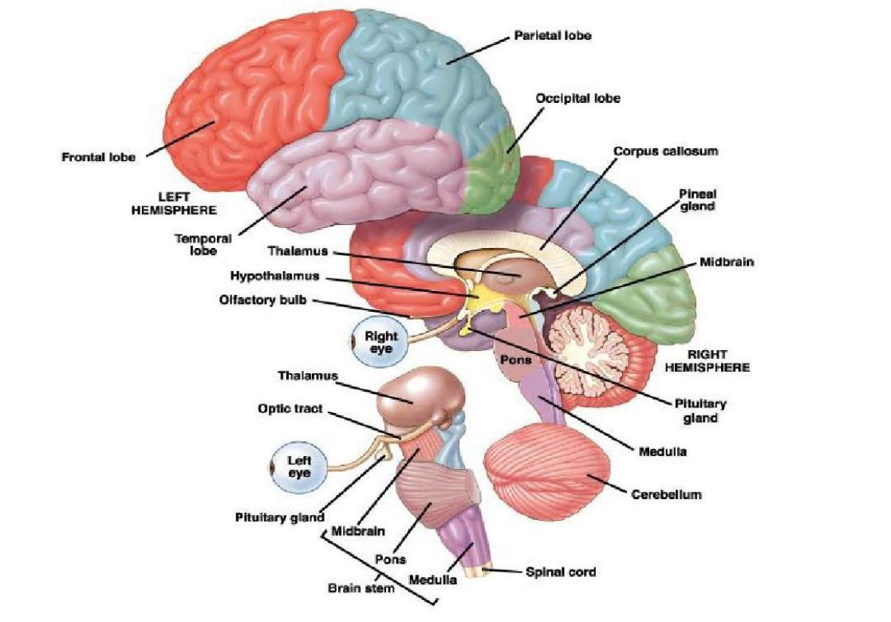

# 大脑
---
**颅相学**(Phrenology)：18世纪由德国医生弗朗兹•约瑟夫•加尔创立，认为一个人的人格与其头骨形状有关，头骨的凸起与凹陷对应人的一些特征，曾被相信多年，后被真伪

正确的结论：大脑的不同部位控制我们某方面特定的行为

---
神经系统分为**中枢神经系统**(CNS)和**外周神经系统**，后者通过许多感觉神经收集信息并反馈于中枢神经系统

菲尼亚斯•盖奇：被火药贯穿大脑，一部分脑组织损坏，由性格温和变为性格暴躁→→意识到大脑与心理的联系

大脑的重要性：即使是简单的任务（走路、说话）也会点亮大脑的几乎全部区域，大脑自身的运作需要身体全部能量的20%

大脑中内部的结构较古老，外部在进化过程中形成

---
**大脑的构成**

* **其他**
  * **垂体**(Pituitary gland)
  * **视神经**(Optic tract)
  * **脊髓**(Spinal cord)
* **旧脑（原脑）**(Old Brain)：
  * **脑干**(brain stem)：固定原脑，大脑中枢最古老的部分，连接脊髓
    * **延髓（延脑）**(medula)：头颅最底部，控制不需意识参与的自主运作，如心跳、呼吸等
    * **脑桥（桥脑）**(pons):延髓上方，控制唤醒，自主功能，睡眠，协调动作等
    * **中脑**(midbrain):脑干最上方，帮助传递视觉与听觉信息
  * **丘脑**(thalamus)：脑桥上方，脑干顶部，接受视觉、听觉、触觉、味觉等信息
    * **松果体**(Pineal gland)：丘脑的一部分，靠近大脑中心，在两个半球之间，藏在丘脑两半连接处的凹槽中；产生褪黑激素，一种由血清素衍生的激素，可调节昼夜节律和季节性周期的睡眠模式
  * **网状结构**(reticular formation)：形状像手指头的神经，对觉醒(arousal)有重要作用
  * **小脑**(cerebellum)：脑干背面的一团突起，负责非言语学习、记忆、对时间的知觉、情绪调控，控制随机行为，易受酒精影响
* **边缘系统**(Limbic System)：位于端脑与原脑之间
  * **杏仁核**(amygdala):两个扁豆大小的神经核团，负责记忆整合，恐惧与攻击性
  * **下丘脑**(hypothalamic)：调节气温、昼夜节律与饥饿，控制内分泌系统，感受快乐与奖励
  * **海马体**(hippocampus)：学习、记忆
* **大脑（端脑，大脑灰质）**：两个脑半球，占整个大脑重量的85%，监督思考、说话、知觉的能力，胼胝体(corpus callosum)连接两个脑半球，左右脑半球控制功能不同，使具有单侧化优势，左半球更多控制语言产生，右半球更多控制创造性功能；两侧大脑紧密连接，不能单独利用一块；左右脑功能并不影响利手，具一侧脑优势的人也不会更聪明("Pop Psychology"的误解)
  * **大脑皮层**(Cerebral Cortex):覆盖于端脑上，一层由两百亿个相互联系的神经组成的薄膜，两个脑半球上分别覆盖有对称四叶，每一侧的叶控制对侧的身体，各叶被皮层上突出的沟或裂分隔开
    * **额叶**(frontal)：额头下面，涉及说话，计划，判断，抽象思维，人格
      * **运动皮层**(motor cortex)：控制随意运动，并从大脑发出信息传达给身体
      * **感觉皮层**(somatosensory cortex)：加工输入的感觉信息
    * **顶叶**(parietal)：触觉，身体姿势
    * **枕叶**(occipital):在后脑勺，视觉
    * **颞叶**(temporal)：耳朵下面，听觉，声音理解
    * **岛叶**(insula):被其他四叶覆盖，情感，成瘾
  * **联合区**(association areas)：大脑灰质剩下的部分，与更高级的心理活动如记忆、思考、学习、言语有关；将感觉信息理解整合，与记忆连接，遍布四个脑部分区
* **神经胶质细胞**(Glial Cells):约十亿左右，为脑神经提供网状支持，绝缘与滋养它们

---
[Crash Course](https://www.bilibili.com/video/BV1Zs411c7W6?p=5)