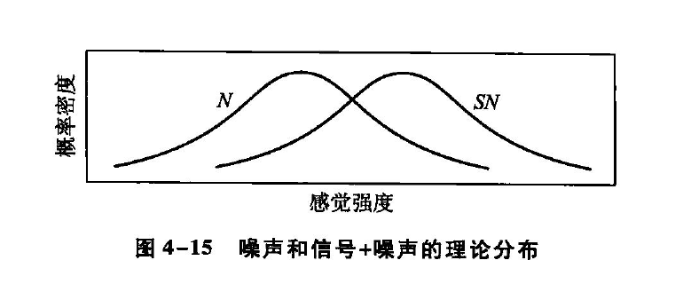
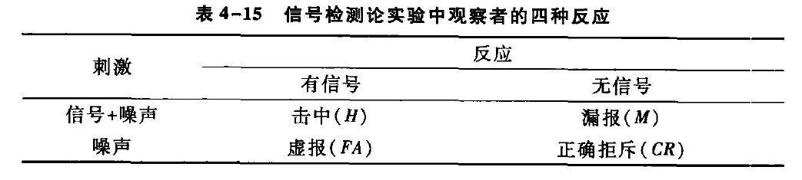
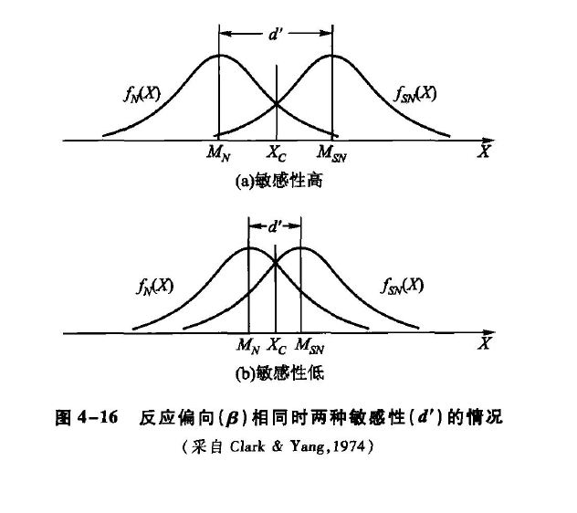
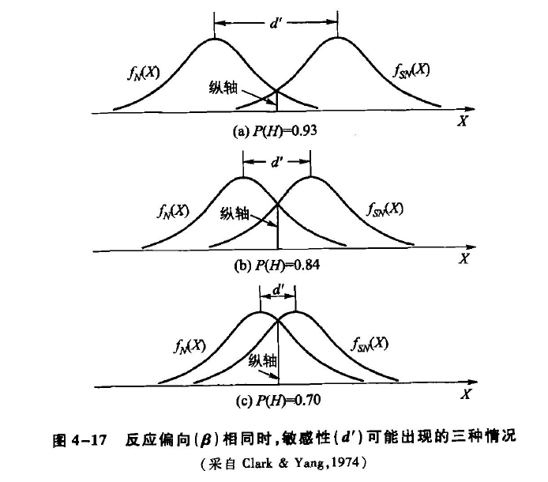

# 信号检测论
*  **传统心理物理学的局限性**：
   - 传统方法无法区分**个体的客观感受性**和主观的动机、反应偏好等**非感受因素**
   - 由于这一局限性，研究结果有时会出现**相互对立**的情况
   - 例如，哈迪、沃尔夫和古德尔的实验中，一些被试服用阿司匹林后报告的疼痛热辐射强度反而降低
- **信号检测论的引入**：
   - 20世纪50年代，**信号检测论**的出现改变了对**阈限**概念的理解
   - 信号检测论能在测定感受性时，对被试的主观因素进行**分离**，解决了传统方法的局限性
   - 信号检测论由**坦纳和斯韦茨等人**最早引入心理学研究，并逐渐被更多心理学家接纳
## 影响阈限测量的非感受性因素
- **阈限测量的问题**：
   - 传统心理物理学将**阈限**视为**衡量感受性的指标**
   - 阈限实际上受到**感受性因素**和**被试主观因素**的共同影响
   - 例如，**刺激出现的概率**和**判断的后果**会影响被试的反应倾向
### 先定概率对阈限的影响
* **先定概率的影响**：
   - 传统方法中，物理刺激每次都会呈现，即刺激出现的**先定概率为1**
   - 格希德等人的实验引入了**空白刺激**，被试的反应类型有四种
     - **击中**（hit）：刺激出现并报告“有”
     - **漏报**（miss）：刺激出现并报告“无”
     - **虚报**（false alarm）：刺激没有出现并报告“有”
     - **正确拒斥**（correct rejection）：刺激没有出现并报告“无”
   - 实验结果显示，心理物理函数的**指标**$P(y)$受到**先定概率**$P(S)$的影响，进而影响了50%感觉阈限的大小
- **对传统观点的反驳**：
   - 格希德等人的实验结果反驳了传统心理物理学的观点，即阈限只与感受性有关
   - 实验证明，**刺激出现的概率会影响被试的回答倾向**
   - 当刺激出现**概率大**时，被试倾向于回答“**有**”；**概率小**时，倾向于回答“**无**”
### 决策后果对阈限的影响
* **决策后果的影响**：
   - 个体的**决策行为**受到**决策后果**的重要影响
   - 不同的决策场景，如盲约和盲婚，由于**后果的严重性**不同，人们的选择也会有所不同
- **阈限测量中的决策后果**：
   - 在阈限测量或其他感觉测量时，被试报告“有”还是“无”也**依赖于判断的后果**
   - 被试可能会根据报告“击中”或“正确拒斥”时的**奖励**，以及“漏报”或“虚报”时的**惩罚**，来作出判断
   - 例如，雷达操作员由于**漏报和虚报的代价不同**，会更倾向于作出“有”的判断
-  **反应过程的复杂性**：
   - 被试反应的过程不仅仅是对物理刺激进行感受的过程，它包括**客观的感觉过程**和**主观的决策过程**两个部分
   - 被试对物理刺激的判断是在这两个过程的**共同作用**下完成
## 信号与噪声
* **信号检测论的来源与应用**：
   - 信号检测论最初是**信息论的一个分支**，用于研究信息传输系统中信号的接收
   - 进入心理学领域后，成为**现代心理物理学**的重要组成部分
- **信号与噪声的概念**：
   - **信号**（signal）是被试**需要检测的刺激**，如实验中的亮光
   - **噪声**（noise）是所有对信号**起干扰作用的背景因素**，广义的概念，总是存在于系统中，**无法消除**
- **信号检测的任务**：
   - 任务是要**把信号和它们的噪声背景区分开来**
   - 由于噪声始终存在，**阈限实验**是在信号和背景**不易分清**的条件下进行的
-  **信号与噪声的分布**：
   - 信号和噪声的感觉强度会受到各种**随机因素影响**，形成两个分布：**信号加噪声分布**（SN）和**噪声分布**（N）
   - 信号总是**叠加**在噪声背景之上，因此信号分布的心理感受通常比噪声分布**更强**

*  **分布曲线的重叠**：
   - 图4-15展示了N和SN两条分布曲线，它们的**重叠部分**表示同样的心理感受**可能由噪声引起**，也**可能由信号产生**
   - 两个分布**越接近**，**重叠程度越高**，被试辨别心理感受来源的**难度就越大**
   - 两个分布的**重叠程度**决定了被试对噪声和信号的**辨别力**，即**感受性**
- **决策标准的形成与影响**：
   - 被试在判断有无信号时需要有一个**决策标准**，该标准受到信号先定概率和决策后果等因素的影响
   - 决策标准决定了被试的**反应偏向**，标准越**严**，越倾向于判断“**无**”；标准越**宽松**，越倾向于判断“**有**”
-  **信号检测论与传统阈限测量的比较**：
   - 传统阈限测量假设被试对噪声和信号的感觉强度是**唯一的**，而信号检测论认为感觉强度形成一个**正态分布**
   - 信号检测论的模型更能反映**真实的测量情况**，可以区分**感受性因素**和**非感受性因素**
## 辨别力和反应偏向
* **感觉过程与决策过程**：
   - 信号检测论将对刺激的判断分为**感觉过程**和**决策过程**
   - 感觉过程是神经系统对信号或噪声的**客观反应**，仅取决于**外在刺激的性质**
   - 决策过程受到**主观因素的影响**，决定被试的决策是**偏向于严格**还是**偏向于宽松**
- **辨别力指标d'与反应偏向指标B或C**：
   - **辨别力指标d'**用于反映**客观感受性的大小**
   - **似然比B**或**报告标准C**用于衡量**反应偏向**
   - 这两个指标是**相互独立**的，因为感觉过程和决策过程也是相互独立的
* **四种反应类型**：
   - 被试的反应分为四种：**击中**（H）、**虚报**（FA）、**漏报**（M）和**正确拒斥**（CR）
   - 这四种反应的概率可以用于计算辨别力和反应偏向的指标

- **四种反应概率的关系**：
   - $P(H) + P(M) = 1$
   - $P(FA) + P(CR) = 1$
   - $\begin{gathered}
      P(H)=\frac{\text { 击中的次数 }}{\text { 击中的次数 }+ \text { 漏报的次数 }} \\
      P(F A)=\frac{\text { 虚报的次数 }}{\text { 虚报的次数 }+ \text { 正确拒斥的次数 }}
      \end{gathered}$
### 辨别力指标d'
* **辨别力d'的定义**：
   - 辨别力$d'$表示的是**内部噪声分布**$f(X)$与**信号加噪声分布**$f_{sw}(X)$之间的**分离程度**
   - 分离程度越大，敏感性越高；分离程度越小，敏感性越低
   - $d^{\prime}=\frac{\left(M_{S N}-M_N\right)}{\sigma_M}=\frac{M_{S N}}{\sigma}-\frac{M_N}{\sigma} \stackrel{{N}\text{与}{SN}\text{为常态}}{=} Z_{S N}-Z_N=Z_{\text {击中}}-Z_{\text {虚报}}$

   - 其中$Z_{\text {击中}}$和$Z_{\text {虚报}}$可以通过击中率和虚报率查表得出
* **d'的变化情况**：
   - 当输入感觉刺激**较强**，被试**敏感性高**时，d'**较大**，例如d'≈3，此时击中率为93%，虚报率为7%
   - 当感觉鉴别能力**降低**时，d'会**减小**，例如d'≈2，此时击中率为84%，虚报率为16%
   - 当被试**不够敏感**或刺激**较弱**时，d'**进一步减小**，例如d'≈1，此时击中率为70%，虚报率为30%

* **图示解释**：
   - 图4-16和图4-17分别展示了不同反应偏向和不同敏感性下的辨别力d'的变化情况
   - 图中横轴单位是**噪声时的Z值**，纵轴单位是**概率密度**
   - **Z值**，也被称为标准分数或z分数，表示某一具体数值与平均数之间的距离，以**标准差**为单位衡量；具体来说，一个数据点的Z值是**该数据点与均值的差除以标准差**的结果
   - Z值的计算公式为：$Z = \frac{(X - \mu)}{\sigma}$，其中：$Z$是Z值，$X$是具体的数值，$\mu$是平均数或均值，$\sigma$是标准差