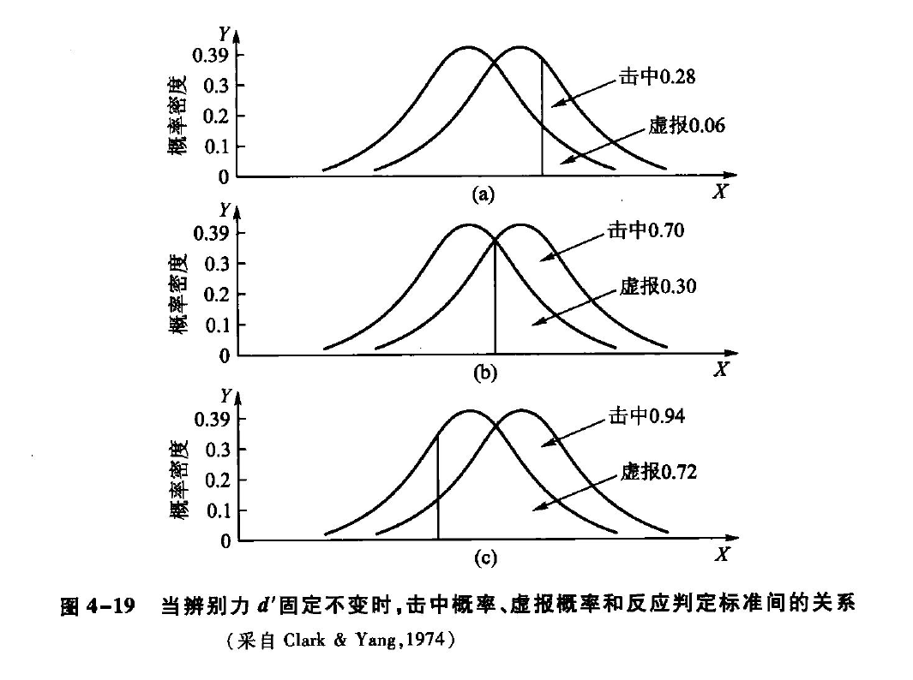
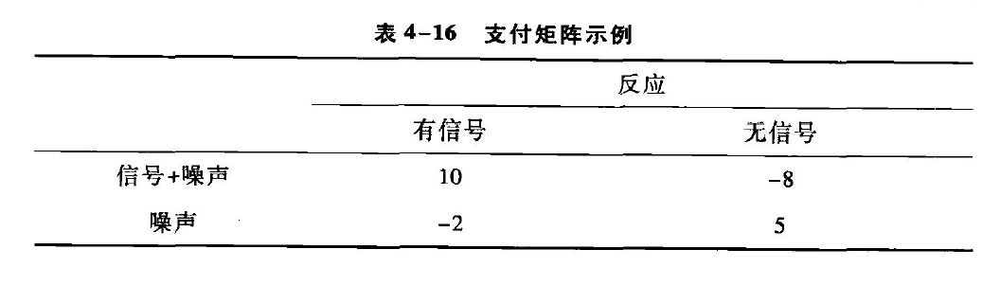
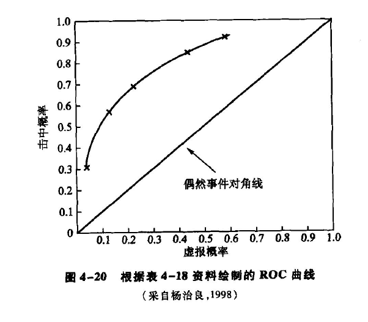
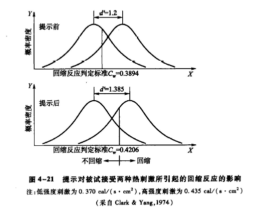
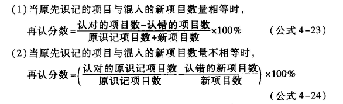
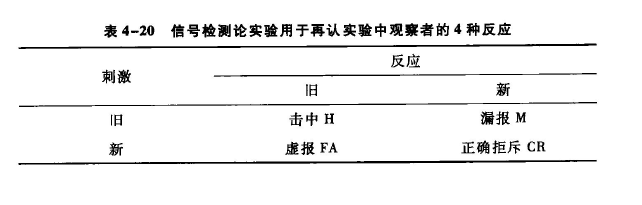
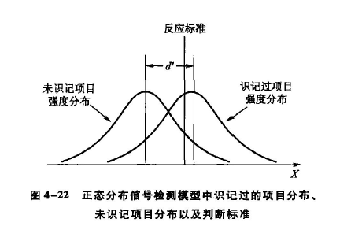
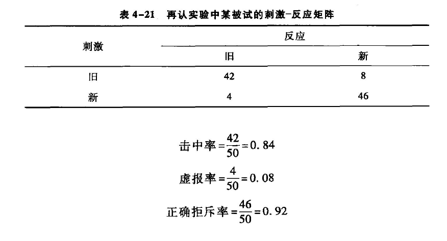
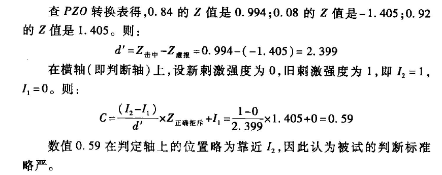

[TOC]
# 信号检测论
*  **传统心理物理学的局限性**：
   - 传统方法无法区分**个体的客观感受性**和主观的动机、反应偏好等**非感受因素**
   - 由于这一局限性，研究结果有时会出现**相互对立**的情况
   - 例如，哈迪、沃尔夫和古德尔的实验中，一些被试服用阿司匹林后报告的疼痛热辐射强度反而降低
- **信号检测论的引入**：
   - 20世纪50年代，**信号检测论**的出现改变了对**阈限**概念的理解
   - 信号检测论能在测定感受性时，对被试的主观因素进行**分离**，解决了传统方法的局限性
   - 信号检测论由**坦纳和斯韦茨等人**最早引入心理学研究，并逐渐被更多心理学家接纳
## 影响阈限测量的非感受性因素
- **阈限测量的问题**：
   - 传统心理物理学将**阈限**视为**衡量感受性的指标**
   - 阈限实际上受到**感受性因素**和**被试主观因素**的共同影响
   - 例如，**刺激出现的概率**和**判断的后果**会影响被试的反应倾向
### 先定概率对阈限的影响
* **先定概率的影响**：
   - 传统方法中，物理刺激每次都会呈现，即刺激出现的**先定概率为1**
   - 格希德等人的实验引入了**空白刺激**，被试的反应类型有四种
     - **击中**（hit）：刺激出现并报告“有”
     - **漏报**（miss）：刺激出现并报告“无”
     - **虚报**（false alarm）：刺激没有出现并报告“有”
     - **正确拒斥**（correct rejection）：刺激没有出现并报告“无”
   - 实验结果显示，心理物理函数的**指标**$P(y)$受到**先定概率**$P(S)$的影响，进而影响了50%感觉阈限的大小
- **对传统观点的反驳**：
   - 格希德等人的实验结果反驳了传统心理物理学的观点，即阈限只与感受性有关
   - 实验证明，**刺激出现的概率会影响被试的回答倾向**
   - 当刺激出现**概率大**时，被试倾向于回答“**有**”；**概率小**时，倾向于回答“**无**”
### 决策后果对阈限的影响
* **决策后果的影响**：
   - 个体的**决策行为**受到**决策后果**的重要影响
   - 不同的决策场景，如盲约和盲婚，由于**后果的严重性**不同，人们的选择也会有所不同
- **阈限测量中的决策后果**：
   - 在阈限测量或其他感觉测量时，被试报告“有”还是“无”也**依赖于判断的后果**
   - 被试可能会根据报告“击中”或“正确拒斥”时的**奖励**，以及“漏报”或“虚报”时的**惩罚**，来作出判断
   - 例如，雷达操作员由于**漏报和虚报的代价不同**，会更倾向于作出“有”的判断
-  **反应过程的复杂性**：
   - 被试反应的过程不仅仅是对物理刺激进行感受的过程，它包括**客观的感觉过程**和**主观的决策过程**两个部分
   - 被试对物理刺激的判断是在这两个过程的**共同作用**下完成
## 信号与噪声
* **信号检测论的来源与应用**：
   - 信号检测论最初是**信息论的一个分支**，用于研究信息传输系统中信号的接收
   - 进入心理学领域后，成为**现代心理物理学**的重要组成部分
- **信号与噪声的概念**：
   - **信号**（signal）是被试**需要检测的刺激**，如实验中的亮光
   - **噪声**（noise）是所有对信号**起干扰作用的背景因素**，广义的概念，总是存在于系统中，**无法消除**
- **信号检测的任务**：
   - 任务是要**把信号和它们的噪声背景区分开来**
   - 由于噪声始终存在，**阈限实验**是在信号和背景**不易分清**的条件下进行的
-  **信号与噪声的分布**：
   - 信号和噪声的感觉强度会受到各种**随机因素影响**，形成两个分布：**信号加噪声分布**（SN）和**噪声分布**（N）
   - 信号总是**叠加**在噪声背景之上，因此信号分布的心理感受通常比噪声分布**更强**

*  **分布曲线的重叠**：
   - 图4-15展示了N和SN两条分布曲线，它们的**重叠部分**表示同样的心理感受**可能由噪声引起**，也**可能由信号产生**
   - 两个分布**越接近**，**重叠程度越高**，被试辨别心理感受来源的**难度就越大**
   - 两个分布的**重叠程度**决定了被试对噪声和信号的**辨别力**，即**感受性**
- **决策标准的形成与影响**：
   - 被试在判断有无信号时需要有一个**决策标准**，该标准受到信号先定概率和决策后果等因素的影响
   - 决策标准决定了被试的**反应偏向**，标准越**严**，越倾向于判断“**无**”；标准越**宽松**，越倾向于判断“**有**”
-  **信号检测论与传统阈限测量的比较**：
   - 传统阈限测量假设被试对噪声和信号的感觉强度是**唯一的**，而信号检测论认为感觉强度形成一个**正态分布**
   - 信号检测论的模型更能反映**真实的测量情况**，可以区分**感受性因素**和**非感受性因素**
## 辨别力和反应偏向
* **感觉过程与决策过程**：
   - 信号检测论将对刺激的判断分为**感觉过程**和**决策过程**
   - 感觉过程是神经系统对信号或噪声的**客观反应**，仅取决于**外在刺激的性质**
   - 决策过程受到**主观因素的影响**，决定被试的决策是**偏向于严格**还是**偏向于宽松**
- **辨别力指标d'与反应偏向指标B或C**：
   - **辨别力指标d'**用于反映**客观感受性的大小**
   - **似然比B**或**报告标准C**用于衡量**反应偏向**
   - 这两个指标是**相互独立**的，因为感觉过程和决策过程也是相互独立的
* **四种反应类型**：
   - 被试的反应分为四种：**击中**（$H$）、**虚报**（$FA$）、**漏报**（$M$）和**正确拒斥**（$CR$）
   - 这四种反应的概率可以用于计算辨别力和反应偏向的指标

- **四种反应概率的关系**：
   - $P(H) + P(M) = 1$
   - $P(FA) + P(CR) = 1$
   - $\begin{gathered}
      P(H)=\frac{\text { 击中的次数 }}{\text { 击中的次数 }+ \text { 漏报的次数 }} \\
      P(F A)=\frac{\text { 虚报的次数 }}{\text { 虚报的次数 }+ \text { 正确拒斥的次数 }}
      \end{gathered}$
### 辨别力指标d'
* **辨别力d'的定义**：
   - 辨别力$d'$表示的是**内部噪声分布**$f(X)$与**信号加噪声分布**$f_{sw}(X)$之间的**分离程度**
   - 分离程度越大，敏感性越高；分离程度越小，敏感性越低
   - $d^{\prime}=\frac{\left(M_{S N}-M_N\right)}{\sigma_M}=\frac{M_{S N}}{\sigma}-\frac{M_N}{\sigma} \stackrel{{N}\text{与}{SN}\text{为常态}}{=} Z_{S N}-Z_N=Z_{\text {击中}}-Z_{\text {虚报}}$

   - 其中$Z_{\text {击中}}$和$Z_{\text {虚报}}$可以通过击中率和虚报率查表得出
* **d'的变化情况**：
   - 当输入感觉刺激**较强**，被试**敏感性高**时，d'**较大**，例如d'≈3，此时击中率为93%，虚报率为7%
   - 当感觉鉴别能力**降低**时，d'会**减小**，例如d'≈2，此时击中率为84%，虚报率为16%
   - 当被试**不够敏感**或刺激**较弱**时，d'**进一步减小**，例如d'≈1，此时击中率为70%，虚报率为30%

* **图示解释**：
   - 图4-16和图4-17分别展示了不同反应偏向和不同敏感性下的辨别力d'的变化情况
   - 图中横轴单位是**噪声时的Z值**，纵轴单位是**概率密度**
### 反应偏向指标
* **反应偏向的计算方法**：
   - 反应偏向可以通过两种方法计算：**似然比$\beta$**和**报告标准C**
#### 似然比$\beta$
* **似然比$\beta$的定义和计算**：
   - 每次感觉过程都会产生一个心理感受量值$x$，这个$x$可能来自信号分布或噪声分布
   - **似然比**（likelihood ratio）$l(x)$用于说明x更可能来自哪一个分布，计算公式为$l(x) = O(SN)/O(N)$
   - 信号检测论假设观察者选择**某个似然比值**作为产生“信号”或“噪声”反应的**决策标准**$\beta$
   - 如果$l(x)$大于等于$\beta$，观察者判断为“信号”；如果$l(x)$小于$\beta$，观察者判断为“噪声”
   - B的计算公式为$β = O(SN)/O(N) = O_{击中}/O_{虚报}$，其中$O(SN)$和$O(N)$可以通过实验中的击中概率和虚报概率转换得到
- **似然比$\beta$的实例**：
   - 通过不同的击中概率和虚报概率，可以计算出不同的$\beta$值
   - 例如，当击中概率为0.28，虚报概率为0.06时，$\beta$值约为3；当击中概率为0.70，虚报概率为0.30时，$\beta$值为1；当击中概率为0.94，虚报率为0.72时，$\beta$值约为1/3

* **$\beta$值的意义**：
   - $\beta>1$表示被试的标准**较严**
   - $\beta$接近或等于1表示被试的标准**既不严也不松**
   - $\beta<1$表示被试的标准**较松**
- **$\beta$值的影响因素**：
   - $\beta$的设定受到**非感觉因素**的影响，主要是信号概率和支付矩阵
   - 信号检测的四种反应（击中、虚报、漏报、正确拒斥）对应的利益得失构成“**支付矩阵**”（payoff matrix）

- **$\beta$的计算公式**：
   - $\beta=\frac{P(N)}{P(S)} \times \frac{V(C R)+C(F A)}{V(H)+C(M)}$
   - 其中$P(N)$和$P(S)$是噪声和信号出现的概率，$V$代表正确反应得到的收益，$C$代表错误反应的代价
   - 根据该公式，可以得到在给定信号强度和敏感性水平下能获得最大收益的$β$值（$β_{OPT}$）
   - 当$V(CR)+C(FA) = V(H)+C(M)$时，$β_{OPT}$随信号概率$P(S)$变化
   - 当$P(S)$上升，降低$\beta$是有利的反应策略；当$P(S)$降低，提高$\beta$更有利
- **$\beta$值与传统阈限的区别**：
   - $\beta$值是一个**反应阈限**，但与传统阈限不同
   - $\beta$不是对被试感觉状态的绝对分界，而是被试**主观决策反应的判断标准**
#### 报告标准（report criterion）C
- **报告标准C的定义**：
   - C是信号检测论中表示**反应偏向**的指标，用于表示与被试选择的反应标准相对应的物理强度
- **C的计算公式**：
   - $$
C=\frac{I_2-I_1}{d^{\prime}} \times Z_1+I_1
    $$
   - 其中$I_2$代表高强度刺激，$I_1$代表低强度刺激，$Z_1$为低强度刺激时的正确拒斥概率的Z值
   - C值越**大**，表示被试的判断标准越**严格**
- **辨别力和反应偏向的区分**：
   - $d'$反映被试的**客观感受性**，只要信号刺激的强度不变就是一个**相对稳定的指标**
   - $\beta$和$C$反映被试的**反应偏向**，即**判断标准的变化**，会随先定概率的大小或奖惩办法等条件改变
## 接受者操作特性曲线
* **ROC曲线的定义**：
   - **接受者操作特性曲线**（receiver operating characteristic curve，简称ROC曲线）描述了在特定刺激条件下，由于被试采用**不同的判断标准**而得出的**虚报概率和击中概率的关系**
   - 由于曲线上各点反映的感受性相同，ROC曲线也被称为**感受性曲线**（sensitivity curve）
### ROC曲线的绘制
* **ROC曲线的绘制**：
   - 通过一个实验例子来说明：选图画页500张，分为五组，每组100张
   - 五组画页的先定概率为0.1、0.3、0.5、0.7和0.9
   - 根据先定概率选出一定数量的画页作为“信号”呈现给被试，要求被试记住这些画页
   - 信号画页呈现后，与噪声画页混合，随机逐张呈现给被试，要求被试判断是“信号”还是“噪声”
   - 根据五种先定概率得到的实验结果，计算击中概率和虚报概率
   - 根据不同先定概率下的击中概率和虚报概率，在图上确定各点位置，连接五点绘制ROC曲线

### ROC曲线的含义
* **ROC曲线的基础**：
   - 连接（0,0）和（1,1）的**45°对角线**称为**偶然事件对角线**或**机遇线**
   - 该线代表**击中率等于虚报率**，即辨别力d'为0，表示被试**仅靠猜测进行反应**
- **ROC曲线的曲率与辨别力**：
   - ROC曲线到机遇线的**距离**（曲线的**曲率**）表示被试的**辨别力**
   - 曲线**曲率大**，表示信号**容易辨别**或观察者**敏感**；**曲率小**，表示信号**难以辨别**或观察者**不敏感**
-  **ROC曲线上的点与判断标准**：
   - 同一曲线上的点，其**感受性相同**
   - **切线的斜率**表示判断的标准：斜率大（左下角）表示判断标准严格；斜率小（右上角）表示判断标准宽松
- **ROC曲线的总结**：
   - **感受辨别力d'**由ROC曲线的**弯曲程度**表示
   - **判断标准C或$\beta$**由ROC曲线上**某点切线的陡峭程度**表示
- **信号检测论的优势**：
   - 信号检测论的最大优点是将**被试的辨别力**和**反应偏向**分开
   - 这一优点解决了传统心理物理学的问题，提升了心理物理法在心理学研究中的应用价值
## 信号检测论的应用
### 痛觉研究
* **痛觉研究的背景**：
   - 1953年，哈迪等心理学家研究**阿司匹林的镇痛效果**，发现不同被试产生了**相反的痛觉反应**
   - 这被解释为期望因素的影响，即**安慰剂效应**
- **信号检测论在痛觉研究中的应用**：
   - 克拉克和他的同事们采用信号检测论和传统心理物理法对痛觉感受性进行了比较研究
   - 实验使用**枪式热辐射器**向被试呈现热刺激，研究者希望探讨“提示”对热**辨别力**（d'值）和**反应判定标准**（C或$\beta$）的影响
   - 研究中，将口头报告"极微痛"定为**痛阈**（threshold of pain），行为表现"回缩反应"定为**耐痛阈**（threshold of bearable pain）
- **实验结果**：
   - **传统心理物理法**的结果：提示能提高耐痛阈值，但对痛阈影响很小
   - **信号检测论**的处理：提示**改变了被试的反应偏向**，使判断标准**更为严格**

### 再认研究
* **再认法的描述**：
   - 再认法是**记忆研究**中的常用测量方法
   - 传统再认法要求被试**区分“新”和“旧”材料**；衡量被试再认能力的指标是**再认分数**

   - 信号检测论可以将被试的**反应偏向**与客观的**再认水平**区分开来
* **信号检测论在再认研究中的应用**：
   - 信号检测论将再认过程看作**对信号的侦察和决策**问题
   - 被试的反应可以分为“击中”、“正确拒斥”、“漏报”和“虚报”

   - 信号检测论模型认为**记忆能力是连续变化的**，并假设被试对识记过和未识记过的材料的熟悉程度都是**呈正态分布的**

* **再认实验中的指标**：
   - d'用于衡量被试的**再认辨别力**，$\beta$和C用于**评估反应的标准**

## 总结
* **信号检测论的优势**：
   - 信号检测论可以**区分**被试对新旧材料的**辨别力**和**反应偏向**
   - 信号检测论为心理物理学的理论研究和应用心理学的研究提供了**新的方法和有效的工具**
- **具体应用**：
   - 信号检测论被用于**验证影响再认记忆的因素**，如大麻、抑郁症和老年痴呆症
   - 信号检测论在理论和实践应用上都显示出了**巨大的优越性**