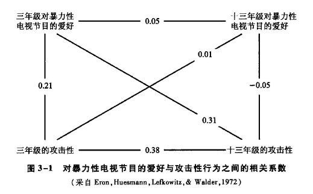

[TOC]
# 心理学研究的基本方法
## 心理学研究的基本程序
### 选择研究课题
* 通常，研究者会从以下几个方面发现研究课题∶实际需要、理论需要、个人经验和前人的研究与文献资料
### 提出实验假设
#### 确定实验类型
* 心理学实验可以分为**因素型实验**（factorial type experiment）和**函数型实验**（functional type experiment）两种
  * 因素型实验属于**定性研究**，，旨在探明影响一个行为的条件（或因素）是什么；在实验中，研究者对实验对象的某些特征或因素进行逐个变化，以观察它们对实验对象的影响
  * 函数型实验属于**定量研究**，旨在探明条件是怎样决定行为的；在实验中，研究者系统、分阶段地变化条件，以确定条件和行为之间的函数关系
  * 因素型实验可以看做函数型实验的**预备实验**
#### 提出研究假设
* 对于因素型实验，通常以“如果⋯⋯那么⋯⋯”的形式提出假设
  * “如果”后面的内容是实验者在实验中所需创设或控制的条件或情境；“那么”后面则是在这种情境之下，实验者所能观察到的因变量的变化
* 对于函数型实验，通常常用方程式 b = f（a）来表明自变量 a 与因变量 b 共变的函数关系，这个方程表示 b 为 a 的函数，或 b 数量地依存于 a
### 实验设计
#### 选择被试
* 实验选用人类被试还是非人类被试，主要依据**课题的性质**而定
  * 对于探讨人类心理和行为的课题，通常首选人类作为被试，但在以下两种情况下应该考虑选择非人类被试：第一，实验程序有可能对人类被试的身心健康造成伤害；第二，选用非人类被试能更好地控制额外变量
* 心理学的研究对象可以是不同领域、不同范围的人，然而，实验只能从中挑选出一部分个体组成被试样本，再根据被试样本的实验结果推论总体状况
  * **随机抽样法**：即在总体中随机抽选被试，这个方法可以保证每个个体从总体中被选中的机会均等
  * **分层随机抽样法**：当总体由按照某些条件划分的层次组成时，可以采用分层随机抽样法，即在每一层中随机抽取被试
#### 控制实验变量
* **实验变量**是指实验中所创设或控制的条件或情境，它们是实验的自变量、因变量和额外变量；确定变量控制的方案是实验设计阶段最重要的环节，也是实验的精髓所在
### 实验的实施
* 实验实施过程中，主试必须**严格按照实验设计执行**，确保自变量是影响因变量的唯一因素，并准确地改变自变量的水平
* 主试需要对被试的反应进行**仔细观察和客观记录**，确保被试的反应发生在预期的维度上，因为不同的被试可能对同一刺激有不同的反应方式
* 在以人为被试的实验中，**指导语**是一种有效的控制手段，可以引导被试的反应到研究者希望的维度上
### 数据的分析和整合
* 心理学实验所能收集到的数据大致分为四类∶描述性数据（descriptive data）、计数数据（enumeration data）、等级数据（rankeddata）、计量数据（measurement data）
  * **描述性数据**是非量化的数据，它可以补充说明数据，使数据更有说服力；但由于缺乏数量指标作为客观尺度，在对描述性数据进行解释时易产生主观片面的错误，因此，需要特别谨慎
  * **计数数据**就是按个体的某一属性或某一反应属性进行分类计数的数据，例如，反应的有或无、对或错的次数等
  * **等级数据**是把被试的反应分为两个以上的等级来记录，例如，将被试的能力或焦虑水平分为强、中、弱三个等级
  * **计量数据**就是用测量所得到的数值大小来表示的数据，例如，体重、反应时、智商等
* 根据数据分析的结果就可以判断先前的假设是否成立，进而得出**结论**；在下结论时，务必实事求是，只能在本实验条件下根据所得到的数据和事实作出判断，不能作过分的推论
### 撰写研究报告
#### 标题和作者
* 研究报告的**标题**应该简明扼要，能够准确地反映研究的内容，控制在 20 个汉字以内
* **作者的署名顺序**应该是按照各自的贡献大小排列，通常是先写主要贡献者，后写次要贡献者
#### 摘要和关键词
* **摘要**（abstract）是研究报告的提纲，它应该包括研究的目的、方法、结果和结论，以及研究的意义和价值，但不应该包括任何细节，其长度一般控制在200个汉字或500个英文单词以内
* **关键词**（key words）是为了便于检索而从研究报告中提取出来的词语，它们应该是研究报告的主题词，一般控制在 3～5 个
#### 引言
* **引言**（introduction）是研究报告的开端，它应该包括研究的背景、目的、意义和价值，以及研究的理论基础和假设；引言部分行文应当逻辑清晰，理由充分，语言也要简练，一般不超过一千字
#### 方法
* **方法**（method）是研究报告的核心部分，它应该包括研究的对象、实验设计、实验材料、实验过程、数据分析方法等内容
* 方法部分通常包括以下三方面的内容：实验对象、实验设计和实验材料
  * **实验对象**：应该包括实验对象的数量、性别、年龄、受教育程度、职业、身体状况、心理状况等基本情况
  * **实验设计**：应该包括实验的类型、实验的自变量和因变量、实验的控制变量、实验的过程、实验的分析方法、指导语等内容
  * **实验材料**：应该包括实验所用的仪器、设备、材料等内容；研究中所使用的问卷、量表都应有相应的介绍，包括其测量的内容、适用范围、信效度等都需要进行说明
#### 结果
* **结果**（results）是研究报告的主体部分，它应该包括实验结果的描述和数据的分析，以图表或文字的形式呈现数据的统计结果；结果部分应该客观、准确地反映实验的结果，不应该包含任何主观的解释和评价
#### 讨论
* **讨论**（discussion）是研究报告的重要组成部分，它应该包括对实验结果的解释和评价，以及对实验的局限性和未来研究的展望
* 讨论部分应该对实验结果进行客观、准确的解释和评价，不能主观臆断，也不能夸大实验结果的意义和价值
#### 结论
* **结论**（conclusion）是研究报告的最后部分，它应该以条文的形式、用简短的语句说明对研究的总结
* 结论部分应该简明扼要，不应该包含任何细节，也不应该包含任何主观的解释和评价
#### 致谢
* **致谢**（acknowledgements）是研究报告的最后部分，它应该包括对研究过程中给予帮助的人和单位的致谢
#### 参考文献
* **参考文献**（references）是研究报告的最后部分，它应该包括研究过程中所引用的文献的详细信息；参考文献的格式应该符合国际通用的格式要求，要求把参考文献的题目、出处、作者、出版日期等都写明，以便读者查找
#### 附录
* **附录**（appendix）是研究报告的最后部分，它应该包括研究过程中所用到的问卷、量表、实验材料等内容；通常由于篇幅较长，这些内容不直接出现在正文中，而是以附录的形式附于正文后，以便读者查阅
## 心理学研究的基本方法
### 观察法
* **观察法**是通过一定程序收集资料，以期获得描述性的数据来简化复杂现象的过程，是一种较为原始的心理学研究方法
  * 然而，由于观察法对额外变量的控制程度较低，往往无法排除**额外变量对自变量效应的混淆**，因此不能根据其结果对事物间的因果关系作出判断
  * 所以，在实验心理学中，研究者通常不会以观察法为主要研究方法，而是将其用于更高级方法的**资料准备阶段**
#### 自然观察法
* **自然观察法**是指对自然情境下的现象进行观察的方法；观察过程中，观察者不必操纵和控制任何变量，只需把观察到的自然发生的行为活动如实客观地记录下来
  * 为了避免在观察过程中可能对观察对象造成任何影响，研究者通常会采用一些**隐瞒或隐蔽的手段**进行观察
  * 除了用于获取被试在自然情境下的真实反应外，对于某些**不可逆转的研究**也必须使用自然观察法
#### 参与性观察法
* **参与性观察法**是指研究者把自己融入观察对象的群体中，然后对他们进行观察
  * 参与性观察法包括**两种情况**：一种是观察者只作为研究对象群体中的一员，并不与其他成员发生积极的作用；另一种情况是研究者主动融入被研究的群体中，"沉浸"到被研究的"文化"中去进行观察
#### 个案法
* **个案法**是指深入地研究**单个或少数几个被试**的观察法
  * 当观察对象比较特殊、人数非常少时，研究者只有通过观察个别被试进行研究
  * 与自然观察法和参与观察法相比，个案法通常需要对个体进行长期、全面的追踪研究，因此，除了能够获得较为全面的描述性资料外，还能进行**初步的比较**，并**对因果关系进行猜测**
#### 调查法
* **调查法**是指借助一定工具（如问卷、量表），采用书面或口头的方式对某种现象进行考察，通过对收集到的资料进行分析处理得出结论的研究方法
  * 调查法是一种通过间接的方式获取资料的方法，故又称为**间接观察法**；根据调查工具的不同，调查法可分为**问卷调查法**和**量表调查法**
  * 问卷法的目的不在于测量被调查者的能力，而是希望了解被调查者对问题的意见、兴趣或态度，因此**没有标准答案**，允许被调查者表达个人意见和主观想法
  * 与问卷法不同，量表调查法（即测验法）对量表的编制、实施、记分以及解释都进行了严格的量化、标准化，要求量表**具有一定的信度和效度**
  * 作为观察法的一种形式，通过调查法得到的结果同样是**描述性的**，不能完全解释事物间的因果关系；此外，由于调查法采用的是被调查者主观答题的方式，因此被调查者的态度以及当时的状况会对调查结果产生影响，易导致**主观偏差**
### 相关法
* 相关法是一种探求两个或多个变量间**相互关系**的研究方法；尽管仍然是基于描述的科学研究方法，但与观察法相比，相关法能够描述事物间**共同变化**的关系，在此基础上作出的因果关系猜测**更容易贴近事实真相**
#### 相关法的指标——相关系数
* 一般情况下，相关法为研究者提供一个**量化指标**，用以评估并详细说明两个或多个变量之间的**关联程度**，这个指标就叫做**相关系数**（r）
  * 相关系数的**变化范围**从-1.00至+1.00，绝对值大小表示两个变量之间相互关联的程度，绝对值越大，相关越高；而符号则表示相互关联的**方向**，或呈正相关或呈负相关
  * **正相关**即指一个变量增大时，另一个变量也随之增大；而**负相关**则是一个变量增大时，另一个变量减小
* 在使用相关系数判断变量间的关系时，仍**无法直接确定**两者间是否存在因果关系，低相关也未必表示两个变量没有联系
#### 相关法的拓展——交叉-滞后法
* **交叉-滞后法**（cross-lagged method）首先获得随时间变化的若干相关系数，然后依据这些相关系数的大小和方向，确定是什么因素导致了什么结果
  * 埃伦、休斯曼、莱夫克威茨和沃尔德曾经探讨儿童对暴力性电视节目的爱好与其攻击性（由同伴评价）的相关程度，结果发现∶两者存在**中等程度的正相关**（r=+0.21）
  * 图中连线上的数字表示对暴力性电视节目的喜好度与攻击性行为之间的相关系数，我们主要讨论的是对角线上的两个相关系数，即**交叉-滞后相关系数**
  * 三年级的攻击性与十三年级对暴力性电视节目的爱好之间**基本上没有关系**（r=+0.01）；然而，三年级对暴力性电视节目的爱好与十三年级的攻击性之间却存在着**相当显著的相关**（r=+0.31）
  * 因此，这两个变量间因果关系的方向似乎是，三年级时喜欢看暴力性电视节目导致了十年后的攻击性行为

* 这一技术是以**变量间存在因果关系**为假设前提的；然而，倘若两个变量事实上并无因果关系，其相关仅是由于同时受到第三个变量的影响，那么交叉-滞后技术所确定的影响方向就毫无意义了
### 实验法
#### 实验法的基本特点
* **实验法**是指在有控制的条件下，系统地操作自变量，观察和记录因变量的变化，从而验证问题假设的过程
  * 实验法的第一步是确定**研究课题**并提出**实验假设**；研究者通常在实验假设的基础上作出推论，把**概括抽象的假设**转化为**具体可操作的推论**
  * 根据推论确定**自变量和因变量**，设计**具体的操作方案**，收集有效的**数据**，最终对假设进行**验证**
* 实验中主要涉及三种变量：自变量、因变量和额外变量
  * **自变量**是在实验中由实验者操作和控制的变量，**因变量**是指实验者观察和记录的随着自变量的变化而变化的被试反应，**额外变量**（或称控制变量）指实验中除实验变量以外的影响实验变化和结果的潜在因素或条件
  * 一般来说，实验法要求自变量必须能够被严格地**操纵**，因变量必须能被客观地**测量**，而额外变量则应被有效地**控制**
* 实验控制泛指对实验精度的**一切保障工作**，以保证因变量的变化确实是由于自变量的变化而引起的；实验控制最主要就是指**对额外变量的控制**，对额外变量的控制程度直接影响实验结果的信效度
#### 实验结果的解释
* 当实验结果与假设相一致时，必须注意，实验直接检验的是**由假设衍生出的推论**；而推论成立是否能反推假设成立，则需要看**推论是否完整地代表了实验假设**
* 当实验结果与假设不一致时，研究者也不能轻易作出实验假设错误的结论，而需要**进一步探明原因**
  * 比如，有时实验会出现**零结果**，即自变量的操作没有引起因变量的变化
  * 对此，研究者在作出自变量与因变量间不存在因果关系的判断前，需要先考虑两个问题：第一，零结果是否是由于没有有效地操作自变量而导致的；第二，对因变量的稳定性和测量范围的选择等因素进行分析
#### 对实验法的评价
* 相对于其他研究方法，实验法能**更好地控制额外变量的影响**；只要确保额外变量不对因变量产生影响，逻辑上就可以认为，因变量的变化是由自变量引起的
* 实验法的另一个优点是**经济**；研究者可根据实验需要设置特定的情境，大大缩短为等待某一特定情境的出现所需的时间
* 实验法虽然在额外变量的控制上非常出色，保证了较高的实验内部效度，但是人为的环境也可能**降低实验的外部效度**