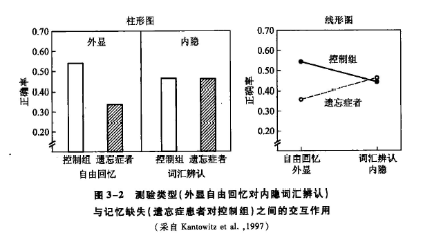

[TOC]
# 心理实验设计
* **实验设计**（experimental design）是进行科学实验前所进行的具体规划，包括控制实验条件和安排实验程序，目的在于尽可能减少额外的或未控制的变量的干扰，从而有效地操纵自变量、观测因变量，以增强实验结果的可靠性
## 关于变量的实验设计
### 自变量
* **自变量**（independent variable）是指在实验中研究者操纵的、对被试的反应产生影响的变量；一个实验至少有**一个自变量**，一个自变量又至少有**两个水平**
* 心理研究中自变量的来源很广泛，概括起来包括两大类：（1）**外部刺激**，指来自外部环境的刺激，包括物理刺激和社会性刺激；（2）**内部刺激**，指来自被试本身的特性
#### 自变量的控制
* 自变量的控制是指在实验过程中**对自变量的操纵和变化**
  * 对自变量进行控制，首先必须明确其**操作性定义**；操作性定义不仅要明确自变量的**内涵**，还必须指出自变量的**操作方法**
  * 另外，对于在刺激维度上连续变化的自变量，还要注意**自变量的变化范围**（参考前人的研究或通过预备实验完成）、确定**检查点的数量**（即实验中自变量变化的水平数）、确定**各检查点之间的间距**
#### 自变量的设计
* 关于自变量的设计，从数量角度出发，分为单自变量设计和多自变量设计
  * **单自变量设计**就是实验中仅有一个自变量，这类设计比较**简单**，然而难以适用于受到多种因素影响的复杂多变的心理现象
  * **多自变量设计**则包含了两个或两个以上的自变量，实险设计比较**复杂**，在目前的心理实验中较为常见
  * 除了常见的真实验设计外，还有一种**准实验设计**；准实验设计对自变量的控制不如真实验设计严格，但在心理学研究中也占有重要地位
##### 多自变量设计
* **多自变量设计**（multiple independent variable design）是指在一个实验中包含两个或两个以上的自变量，也称为**多因素实验设计**（multifactor experimental design）；这种实验设计在心理学研究中应用广泛，事实上典型的心理学实验往往都同时操纵2~4个自变量
* 例如，沃林顿和韦斯克兰茨所进行的经典实验中，通过二因素的**2×2实验设计**，揭示出了**内隐记忆的存在**
  * 此设计中的**两个因素**分别为：①A因素，即**记忆能力**，分为记忆缺陷（遗忘症患者）和记忆正常（控制组被试）两个水平；②B因素，即**记忆测验类型**，分为自由回忆测验（测量外显记忆）和词汇辨认测验（测量内隐记忆）两个水平
  * 前者要求被试尽可能多地回忆出学习阶段所呈现的词汇，而后者则是向被试呈现一些模糊的单词，要求被试勾画出这些词并说出来；这些单词均在学习阶段出现过，单词中的每一个字母都被擦掉了一部分，学习前被试根本不可能辨认出这些单词
  * 记忆用内隐的方式加以测试时，遗忘症患者与正常被试之间**不存在显著性差异**，可见，此实验中一个自变量（记忆缺陷的存在与否）的效果随着另一个自变量（测验的类型）的水平而发生了变化，即实验中的两个自变量发生了**交互作用**

  * 所谓**交互作用**（interaction），即自变量之间的相互关系；当一个自变量产生的效果在第二个自变量的每一水平上不一致时，交互作用就发生了
  * 只有采用**多因素实验设计**才能获得变量间的**交互作用**，倘若将上述实验改为两个单变量（或因素）实验设计，无非可以得到如下两个结果：遗忘症患者的记忆比控制组被试差（混合了外显测验和内隐测验）；内隐测验成绩比外显测验好（混合了遗忘症患者和控制组被试）
##### 准实验设计
* **准实验**（quasi--experiment）设计是指**未对自变量实施充分控制**，但使用实验方法收集、整理以及统计分析数据的研究方法
  * 它对额外变量的控制程度**介于非实验设计和真实验设计之间**，比非实验设计控制严格，但不如真实验设计控制充分和广泛；正因如此，通过准实验得到的结果无法对自变量和因变量间的因果关系作明确判断，所能确定的仅是两者是否存在**相关关系**
  * 在准实验设计中，自变量通常为**被试变量**，我们只能选择而不能改变；因此，准实验无法按照随机原则来选择和分配被试，对额外变量的控制较弱，被试变量的效用容易受到额外变量的干扰
  * 尽管准实验设计对额外变量的控制不如真实验设计，但与真实验相比，准实验的实验情境**更接近现实**，所得到的结论具有更高的外部效度
### 因变量
* **因变量**（dependent variable）就是由操纵自变量而引起的被试的某种特定反应；和自变量一样，因变量的控制同样有赖于**操作性定义**，这有助于明确某些原本含糊不清的行为变化
* 一般来说，对于因变量进行测量，可以采用客观指标也可以采用主观指标
  * 客观指标主要有：（1）反应速度；（2）反应速度的差异；（3）反应的正确性；（4）反应标准；（5）反应的难度；（6）神经生理指标
  * 因变量的主观指标主要指被试的**口语记录**；口语记录（protocol）是指被试在实验时对自己的心理活动进程所作叙述的记录，或在实验之后，被试对主试提出的问题所作回答的记录
#### 因变量的控制
* 与自变量一样，被试的反应（即因变量）也必须得到很好的控制；这并不意味着研究者要强行规定被试的反应，而是让被试**在研究者所设想的维度上进行反应**，以便观察和测量
##### 指导语的作用
* 在以人为被试的实验中，研究者可通过指导语**对被试的反应加以控制**；指导语就是主试给被试交代任务时说的话
##### 因变量的选择及量程效应
* 研究者在选择因变量时，需要考虑以下几个方面：第一，**有效性**，即指标能充分代表所研究的现象或过程的程度，也称为效度；第二，**客观性**，即指标是客观存在的，是可以通过一定的方法观察、测量到的，并且能在一定条件下重复实验，进行验证；第三，**数量化**，即指标能数量化，便于记录、统计、分析与比较等
  * 以上三个方面，**有效性最为重要**，其直接关系到实验的效度
  * 在实验中考虑变量的有效性时必须注意量程效应，包括**天花板效应**（ceiling effect）和**地板效应**（floor effect）；它们均是由于量程不够大，造成反应停留在指标量表的最顶端或最低端，从而大大降低了指标的有效性
  * 常用的避免量程效应的方法是在**预备实验**中通过测试少量被试的反应来确定因变量的量程
#### 因变量的设计
* **多因变量设计**（multiple dependent variable design）是指在一个实验中包含有两个或两个以上因变量的实验设计；正如多个自变量之间可能存在交互作用，多个因变量指标之间也可能**存在关联**
* 不过，目前多数实验**通常只使用两个因变量**，原因是对两个以上的因变量进行统计分析时往往涉及**多元方差分析**，难度和工作量较大
### 额外变量
* **额外变量**（extraneous variable）是指与实验目的无关，但又对因变量产生影响的变量；由于在实验中对额外变量必须加以控制，所以又称**控制变量**（controlled variable）
* 额外变量可概括为两大类，**随机的额外变量**和**系统的额外变量**
  * 前者指在实验中随机出现、偶然起作用的额外变量；由随机的额外变量引起的误差称为**随机误差**，通常无法绝对避免，但可通过增加测验次数、被试数量或随机分配被试等方法来减少
  * 后者指与实验目的无关，相对恒定地对因变量起作用的额外变量，如习惯效应、疲劳效应，以及主试与被试间的相互作用等；由系统的额外变量所造成的误差称为**系统误差**，通过适当的实验设计可以在一定程度上加以控制
#### 额外变量的混淆效应
* 对额外变量**不加以控制**，其就可能**与自变量一同引发因变量的变化**，最终难以区分额外变量的效应和自变量的效应，实验者也无法确定什么才是真正导致因变量变化的原因
##### 主试效应
* 主试在实验中可能会有意无意地以某种方式（如动作、表情和语言等）影响被试，使他们的反应符合自己的期望，这种现象被称为**实验者效应**
  * 美国心理学家罗森塔尔（Rosenthal，1963）的一项经典研究很形象地说明了这种现象；研究中，他让学生做白鼠学习走迷津的实验，一组学生所使用的白鼠的笼子上贴有“走迷津伶俐”的标签，另一一组学生所使用的白鼠的笼子上贴有“走迷津呆笨”的标签，但实际上所有白鼠是随机地分配到各个笼子里，两组白鼠并不存在显著性差异
  * 结果学生主试发现“聪明鼠”犯的错误明显少于“笨拙鼠”，而研究者并未发现学生主试有故意欺骗或歪曲实验结果的情况
  * 由此，罗森塔尔推断，学生主试在训练“聪明鼠”的时候更能鼓励白鼠去通过迷津；如此一来，他们将自身对白鼠的信心无意地通过暗示或鼓励等方式作用于白鼠被试，最终使得实验结果按照他们所期望的方向发展
##### 被试效应
* 被试在实验中并非消极被动地接受主试的操作，而总是以某种动机、态度来对待实验，自发地对实验目的产生**一定的假设或猜测**，然后用自认为能满足目的的方式进行反应，我们把这种现象称为**被试效应**，也称为**要求特征**（demand characteristic）
* **安慰剂效应**是常见的被试效应，安慰剂效应最早在医学研究中被发现，有时医生开给病人的"药物"实际上并非药物（如维生素片），但当病人相信那是有效的药物时，服用后他们的病情也会有所好转
#### 额外变量的控制
##### 排除法
* **排除法**（elimination method）也称为消除法，是采取一定的手段或措施将额外变量从实验中排除出去
  * 为了消除主试或被试知道实验目的或意图后所产生的主试或被试效应，可以通过**双盲实验**（double blind experiment）加以排除
##### 恒定法
* **恒定法**（constant method）是使额外变量在实验过程中保持恒定不变
  * 当消除额外变量有困难时，实验者常采用恒定法来**控制额外变量**；比如，为了克服性别不同所造成的实验结果的偏差，实验者可以全部选用男被试或女被试
  * 使用恒定法控制额外变量，会使实验的结果难以推广到额外变量的其他水平上去；有时自变量还可能会与要保持恒定的额外变量产生交互作用
##### 匹配法
* **匹配法**（matching method）是根据被试某些方面的特征或行为表现，将被试人为地**划分为具有相同特质的若干组**，使各组被试的特质在一定范围内是同质的
  * 先就某些与实验有着高相关的特性对所有被试进行**测量**，然后根据测得的结果进行**匹配分组**
  * 这种方法在**理论上**是可取的，但在**实际操作中**却很难行得通，特别是需要匹配多个特性（或因素）时，实验者常会感到顾此失彼无法进行
##### 随机化法
* **随机化法**（randomization method）是把被试随机地分配到各处理组中去的技术
  * 如果总体中的所有成员都有同等机会被抽取到任一处理组，那么可以期望所形成的各处理组的各种条件和机会是**相等的**
  * 从理论上讲，随机化法是控制变量的**最佳方法**，它不会导致系统性偏差，能够控制难以观察的中介变量
  * 为了具有**统计学意义**，随机取样的被试通常要达到**30人以上**；该方法不仅应用于被试的选取和分配，而且也应用于刺激呈现和实验顺序的安排
##### 抵消平衡法
* **抵消平衡法**（counterbalancing method）是指通过实验设计的方法来抵消或平衡额外变量所带来误差的方法，是心理实验最常用的方法之一
  * 常见的抵消平衡法有ABBA法和拉丁方设计法
##### 统计控制法
* 以上五种方法都是在设计实验时使用的，统称为**实验控制**（experimental control）
* 然而，有时由于条件限制，实验者明知存在某些因素会对实验结果产生干扰，却无法在实验中加以排除或控制；这种情形下，只有在实验后通过**协方差分析**（analysis of covariance）或**偏相关**（partial cor-relation）等统计技术才能将这些影响因素分析出来，并将其影响排除出去
* 这种事后采用统计技术控制额外变量的方法，称为**统计控制**（statistical control）
## 关于被试的实验设计
* 在心理学实验中，被试是实验的**重要组成部分**，实验的结果往往取决于被试的反应；因此，实验者必须对被试进行**严格的控制**，以保证实验的有效性
### 被试间设计
* **被试间设计**（between-subjects design）是要求每位被试只接受一个自变量水平的处理
  * 这种设计的优点在于一种处理方式**不会影响或污染**另一种处理方式，但却很可能存在另一种额外变量，即**不同处理水平的被试间的差异**；由于不同被试接受不同的实验处理，因此很难分辨出因变量的变化是被试间的差异所致，还是自变量的变化所致
  * 为了避免由被试间差异所造成的混淆，使用被试间设计时，实验者必独尽量减少两个或多个组别间的被试差异，以保证各组被试的同质水平，即形成“**等组**”
  * 通常，被试间设计采用两类分组技术来解决等组问题：匹配法和随机化法
#### 匹配法
##### 匹配法的具体操作
* 匹配的具体步骤是：先对所有被试进行**前测**，然后根据前测作业的成绩进行**匹配**
  * 前测的内容必须和实验作业高度相关，一般有两种：一种是和实验作业有高度相关的**其他作业**，另一种则是被试在实验作业**初期的表现**
  * 在以动物为对象的被试间设计的研究中，一项重要的匹配技术是**拆窝技术**（split-litter technique）：把同胎生的动物随机地分配到不同的实验组中；由于同胎生的动物具有**相同或相近的遗传素质**，因此能在很大程度上减少个体差异对自变量的影响
##### 匹配法的局限性
* 实验者不可能对被试的每一个特征都进行匹配，常常是只针对一些特征进行匹配，而另一些可能相关的特征**仍存在差异**
* 匹配法往往**费时耗力**，且变量间可能存在**交互作用**
#### 随机化法
* 被试间实验设计更常用的分组方法是**随机化法**（randomization），即把被试随机地分配到不同的组内接受不同的自变量处理
* 随机化不同于随便和随意，其统计学前提是：各随机被试组在未经受不同处理之前是**相等的**，即使有差异也是在统计允许的限度以内的**随机误差**
##### 随机化法的具体操作
* 当被试同时等候，实验者可随意调派其中任何一个被试时，可以采用**同时分配法**；该分配技术主要有三种：**抽签法、笔画法和报数法**
* 当实验持续时间较长或由于其他原因，被试到达实验室的时间不一致时，就可以采用**次第分配法**；**简便法**就是实验者按被试到达实验室的先后来分配，**区内随机法**则是按照被试来到实验室的先后，使用区内随机次序，如随机数表分派被试归属各组
##### 随机化法的局限性
* 与匹配法相比，随机化法省时省力，**简单易行**；但是，采用随机方式进行分组，**无法精确地控制**不同组间的被试差异，很多时候研究者无法清楚地意识到哪些变量得到了控制，因而也就无法确定这种控制的效果到底如何
* 总的说来，被试间设计避免了**练习效应和疲劳效应**等由实验顺序造成的误差，但所需要的被试**数量巨大**，且无法从根本上排除**个体差异对实验结果的混淆**