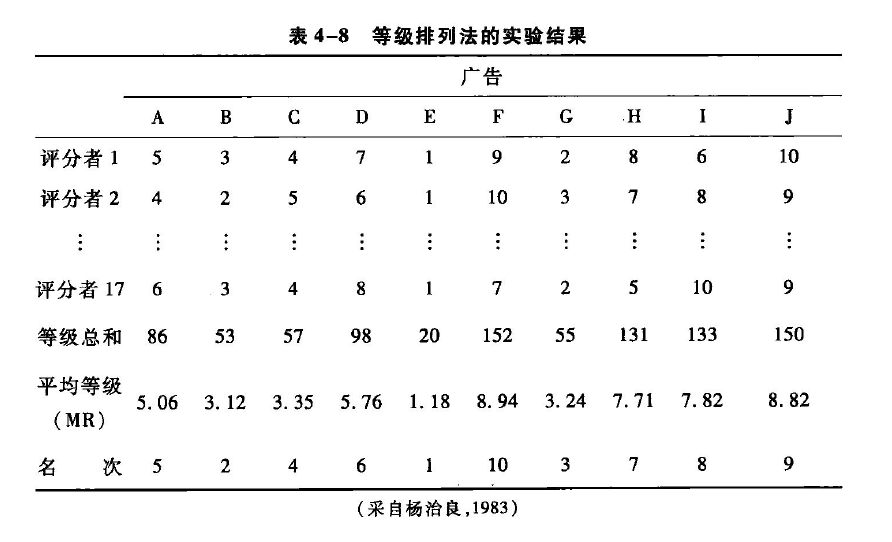
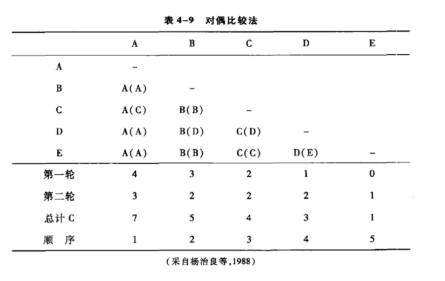
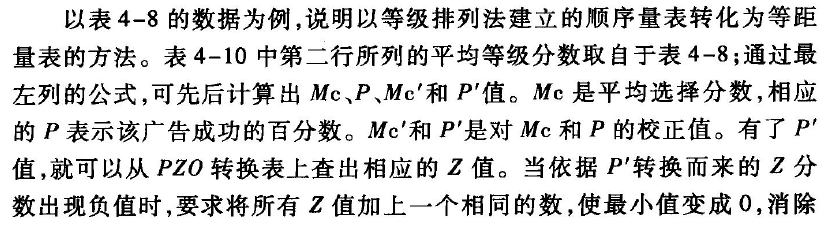
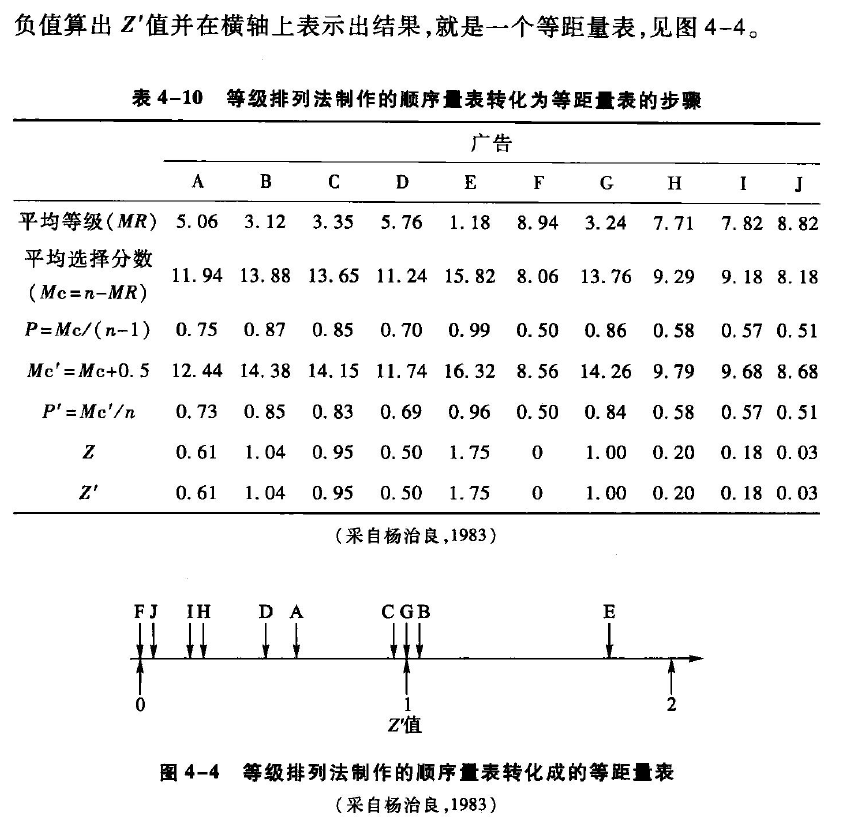
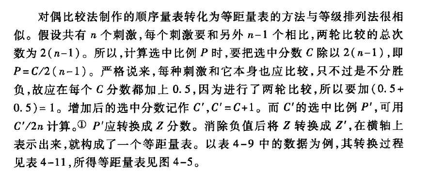
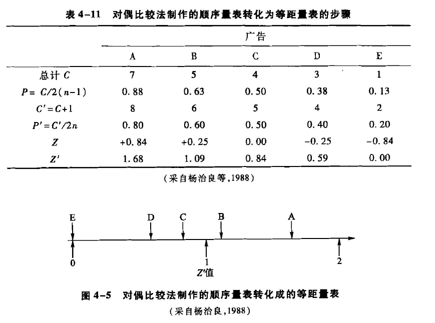

[TOC]
# 心理量表的建立
* **心理物理学的量化**：
   - 心理物理学不仅测量阈限，还提出了对阈上感觉进行量化的方法
   - 由于阈上感觉是连续变化的，阈上心物关系的表示方法更复杂
* **心理量表**：
   - 是狭义的**心理物理量表**，用于表示心理量与物理量之间的关系
   - 可以是图表、数学公式或其他形式
   - 通常以**刺激的物理强度**为横坐标，**心理反应强度**为纵坐标绘制
   - 阈上感觉的量化过程实际上是建立心理物理量表的过程
*  **量表的分类**：
   - 根据是否有**等距的量化单位和绝对零点**，量表分为顺序量表、等距量表和比例量表
## 顺序量表
* **顺序量表**：
   - 是一种比较粗略的量表
   - 没有等距的单位和绝对零点
   - 建立时要求被试按照给定的标准，将事物排列出一定的顺序
   - 主要方法有等级排列法和对偶比较法
### 等级排列法
* **等级排列法**：
   - 也称为**等级法**或rank-order method，是建立顺序量表的直接方法
   - 基本步骤：
     1. 同时呈现多个刺激，由多个被试按照一定标准对这些刺激进行排序
     2. 把所有被试对同一刺激的评定等级加以平均
     3. 对各个刺激的平均等级赋予数值，形成一列顺序量表
*  **实验示例**：
   - 17名被试对10张广告进行**从美到丑的排序**
   - 使用1到10的数字确定每张广告的名次，其中1代表最好，10代表最差
   - 计算所有被试对同一广告的评定等级的平均值，得到广告的**平均等级**（mean rank）
   - 根据这些平均等级，重新确定每张广告的名次，形成一个**广告美丑的顺序量表**

- **要注意的问题**：
  - 最终的顺序排列取决于所有被试的平均等级，因此被试的抽样应能**代表**研究的人群总体
  - 每个被试只进行**一次排序**，利用率不高，对多次排序中可能的结果偏差缺乏抵抗力
### 对偶比较法
* **对偶比较法**：
   - 所有需要比较的刺激配成对，逐对呈现，让被试进行比较
   - 配对的个数是**n（n-1）/2**，例如10个刺激可配成45对
   - 根据各刺激**明显优于其他刺激的百分比大小**排列成序
- **举例说明**
   - 有五种样品A、B、C、D、E，共有10个配对，要求被试根据喜好进行比较
   - 如果配对的样品同时呈现，可能产生**空间误差**；如果相继呈现，可能产生**时间误差**
   - 为消除误差，样品可以**左右颠倒或改变呈现次序**
   - 比较结果记录在事先准备好的表格中
   - 例如：横A与纵B比较，被试认为“A”更好，则在横A与纵B交叉处写上“A”；横D与纵E相比较，被试认为“D”更好，则在它们交叉处写上“D”
   - 按此方法比较10次后，再倒过来，如纵A与横B比较，被试认为A更好，则在横A与纵B的交叉处写上“(A)”；横E与纵D相比较，被试认为“E”更好，则在横D与纵E的交叉处写上“(E)”

* **对偶比较法数据处理**：
   - 把A列中“A”或“(A)”出现的总次数记在相应位置，其他列同理
   - 将每列中的第一轮与第二轮的次数加起来，得到被选中的分数C
   - 对选中分数C进行排序，重新赋予数值，得到顺序量表
   - 通过选中分数或选中比例，得出被试对刺激的喜好顺序
* **对偶比较法的特点和注意事项**：
   - 为保证结果精度，每个配对比较都会**反复多次**，并用随机化或ABBA法控制变量的干扰
   - 得到的顺序量表**仅针对一个被试**，不能直接推广到更大的人群
   - 量表模型要求对偶比较是**可传递的**，即当A优于B，B又优于C时，A也要优于C
   - 在传递性难以保证时，不能直接采用对偶比较法
* **顺序量表的局限性**：
   - 只能反映出事物在某种心理量上的**顺序关系**
   - 信息有限，无法提供感觉量间的**差异大小信息**，也不能确定心理量与物理量的关系
   - 阈上心理量的真正量化需要更高级别的心理量表
## 等距量表（equal interval scale）
* **等距量表的定义与特点**：
   - 是一种有**相等的单位**但没有**绝对零点**的量表
   - 能体现事物在某种心理量上的**顺序关系**，还能反映心理量之间的**相对大小**
   - 量化程度上，等距量表**优于**顺序量表
*  **建立等距量表的方法**：
   - **感觉等距法**（equal sense distance method）
   - **差别阈限法**（differential threshold method）
   - 由顺序量表转化而来
### 顺序量表转化法
* **顺序量表转化法**：
   - 用**等级排列法**和**对偶比较法**建立的顺序量表转化为等距量表的方法不同
   - 通过计算平均选择分数、成功的百分数、校正值等，再从PZ0转换表上查出相应的Z值，得到等距量表

   - 对偶比较法制作的顺序量表转化为等距量表的方法与等级排列法相似，但有细微差异

* **顺序量表转化的局限性**：
   - 经顺序量表转化而来的等距量表只实现了心理量这**一个维度**上的等距
   - 无法得到等距的**物理单位**，因此不能建立心理量和物理量之间的**对应关系**
   - 相对于顺序量表，这种等距量表提供了**更多的信息**