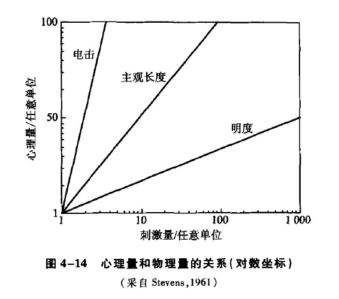

[TOC]
# 心理量表的建立
* **心理物理学的量化**：
   - 心理物理学不仅测量阈限，还提出了对阈上感觉进行量化的方法
   - 由于阈上感觉是连续变化的，阈上心物关系的表示方法更复杂
* **心理量表**：
   - 是狭义的**心理物理量表**，用于表示心理量与物理量之间的关系
   - 可以是图表、数学公式或其他形式
   - 通常以**刺激的物理强度**为横坐标，**心理反应强度**为纵坐标绘制
   - 阈上感觉的量化过程实际上是建立心理物理量表的过程
*  **量表的分类**：
   - 根据是否有**等距的量化单位和绝对零点**，量表分为顺序量表、等距量表和比例量表
## 顺序量表
* **顺序量表**：
   - 是一种比较粗略的量表
   - 没有等距的单位和绝对零点
   - 建立时要求被试按照给定的标准，将事物排列出一定的顺序
   - 主要方法有等级排列法和对偶比较法
### 等级排列法
* **等级排列法**：
   - 也称为**等级法**或rank-order method，是建立顺序量表的直接方法
   - 基本步骤：
     1. 同时呈现多个刺激，由多个被试按照一定标准对这些刺激进行排序
     2. 把所有被试对同一刺激的评定等级加以平均
     3. 对各个刺激的平均等级赋予数值，形成一列顺序量表
*  **实验示例**：
   - 17名被试对10张广告进行**从美到丑的排序**
   - 使用1到10的数字确定每张广告的名次，其中1代表最好，10代表最差
   - 计算所有被试对同一广告的评定等级的平均值，得到广告的**平均等级**（mean rank）
   - 根据这些平均等级，重新确定每张广告的名次，形成一个**广告美丑的顺序量表**

- **要注意的问题**：
  - 最终的顺序排列取决于所有被试的平均等级，因此被试的抽样应能**代表**研究的人群总体
  - 每个被试只进行**一次排序**，利用率不高，对多次排序中可能的结果偏差缺乏抵抗力
### 对偶比较法
* **对偶比较法**：
   - 所有需要比较的刺激配成对，逐对呈现，让被试进行比较
   - 配对的个数是**n（n-1）/2**，例如10个刺激可配成45对
   - 根据各刺激**明显优于其他刺激的百分比大小**排列成序
- **举例说明**
   - 有五种样品A、B、C、D、E，共有10个配对，要求被试根据喜好进行比较
   - 如果配对的样品同时呈现，可能产生**空间误差**；如果相继呈现，可能产生**时间误差**
   - 为消除误差，样品可以**左右颠倒或改变呈现次序**
   - 比较结果记录在事先准备好的表格中
   - 例如：横A与纵B比较，被试认为“A”更好，则在横A与纵B交叉处写上“A”；横D与纵E相比较，被试认为“D”更好，则在它们交叉处写上“D”
   - 按此方法比较10次后，再倒过来，如纵A与横B比较，被试认为A更好，则在横A与纵B的交叉处写上“(A)”；横E与纵D相比较，被试认为“E”更好，则在横D与纵E的交叉处写上“(E)”

* **对偶比较法数据处理**：
   - 把A列中“A”或“(A)”出现的总次数记在相应位置，其他列同理
   - 将每列中的第一轮与第二轮的次数加起来，得到被选中的分数C
   - 对选中分数C进行排序，重新赋予数值，得到顺序量表
   - 通过选中分数或选中比例，得出被试对刺激的喜好顺序
* **对偶比较法的特点和注意事项**：
   - 为保证结果精度，每个配对比较都会**反复多次**，并用随机化或ABBA法控制变量的干扰
   - 得到的顺序量表**仅针对一个被试**，不能直接推广到更大的人群
   - 量表模型要求对偶比较是**可传递的**，即当A优于B，B又优于C时，A也要优于C
   - 在传递性难以保证时，不能直接采用对偶比较法
* **顺序量表的局限性**：
   - 只能反映出事物在某种心理量上的**顺序关系**
   - 信息有限，无法提供感觉量间的**差异大小信息**，也不能确定心理量与物理量的关系
   - 阈上心理量的真正量化需要更高级别的心理量表
## 等距量表（equal interval scale）
* **等距量表的定义与特点**：
   - 是一种有**相等的单位**但没有**绝对零点**的量表
   - 能体现事物在某种心理量上的**顺序关系**，还能反映心理量之间的**相对大小**
   - 量化程度上，等距量表**优于**顺序量表
*  **建立等距量表的方法**：
   - **感觉等距法**（equal sense distance method）
   - **差别阈限法**（differential threshold method）
   - 由顺序量表转化而来
### 顺序量表转化法
* **顺序量表转化法**：
   - 用**等级排列法**和**对偶比较法**建立的顺序量表转化为等距量表的方法不同
   - 通过计算平均选择分数、成功的百分数、校正值等，再从PZ0转换表上查出相应的Z值，得到等距量表

   - 对偶比较法制作的顺序量表转化为等距量表的方法与等级排列法相似，但有细微差异

* **顺序量表转化的局限性**：
   - 经顺序量表转化而来的等距量表只实现了心理量这**一个维度**上的等距
   - 无法得到等距的**物理单位**，因此不能建立心理量和物理量之间的**对应关系**
   - 相对于顺序量表，这种等距量表提供了**更多的信息**
### 感觉等距法
*  **感觉等距法的定义**：
   - 通过被试将某种感觉上的一段心理量分成**主观上相等的若干距离**来制作等距量表的方法
-  **感觉等距法的分类**：
   - 分为“**同时**”（simultaneous）和“**渐进**”（progressive）两种方法
   - “同时”法中包括**二分法**和**多分法**
   - **二分法**（bisection method）：
     - 呈现**两个刺激**A和C
     - 要求观察者选择**第三个刺激**B，使得A和B之间的距离**等于**B和C之间的距离
   * **多分法的实例**：
     - 史蒂文斯和沃尔克曼在**1944年的实验**中应用了多分法
     - 要求被试将200~6500Hz的纯音**按音高分成四个等份**
     - 通过找出**三个频率的声音**，使得五个纯音在音高差别的感觉上相等
     - 根据实验数据绘制了**音高等距量表**

* **渐进法的定义**：
   - 一种每次只要求被试**选择一个刺激**来等分一个感觉距离的方法，然后**在两个更小的感觉距离上进行等分**
* **渐进法的实施步骤**：
   - 首先找一个中间刺激值C，使其与两个原始刺激值A、E的差距相等
   - 在A、C间找一个B，使其与A、C的差距相等
   - 在C、E间找一个D，使其与C、E的差距相等

### 差别阈限法
* **差别阈限法的定义和重要性**：
   - 通过测量**不同强度基础上的差别阈限**来制作等距量表的方法
   - 在心理物理学中占有特殊地位，是**费希纳定律的基础**
* **差别阈限法的实施程序**：
   - 确定**绝对感觉阈限**作为等距量表的起点
   - 以绝对感觉阈限为基准，确定**第一个差别阈限**
   - 以绝对阈限加上第一个差别阈限的刺激强度为基准，测量**第二个差别阈限**，依此类推
   - 每一个差别阈限称为一个“**最小可觉差**”（just noticeable difference, jnd），代表当前刺激强度下可以觉察到的**最小主观感受变化**
   - 每一个最小可觉差在心理上都是**相等**的，作为心理物理量表的**等距单位**
* **差别阈限法的特点和规律**：
   - 绝对阈限对应心理物理量表的**零点**
   - 最小可觉差是心理物理量表的**单位**
   - 心理物理量表的值由绝对阈限以上**最小可觉差的总数**决定
   - 心理量的变化和物理量的变化**不一致**，相等的心理量不对应相等的物理量
- **图示解释**：
   - 以刺激强度为**横坐标**，绝对阈限以上的最小可觉差数为**纵坐标**，可以绘制出心理物理关系图，即**等距量表**
   - 该图可以用来找到产生某一感觉水平所需的刺激值

* **费希纳定律的背景和推导**：
   - 心理量的增长**慢于**物理量的增长，每增加一个最小可觉差所需的物理刺激增量**越来越大**
   - **韦伯**研究了最小可觉差与物理刺激强度之间的关系，发现对于任何同一类的刺激，产生**一个最小可觉差**所需增加的刺激量，总是等于**当前刺激量与一个固定分数的乘积**，这个固定分数后来被称做**韦伯分数**（Weber's fraction）
   - $ΔΦ=k⋅Φ$，其中$ΔΦ$代表差别阈限的大小，$Φ$代表刺激的强度水平，$k$代表韦伯分数；这个公式也叫**韦伯定律**
   - 费希纳基于韦伯的发现提出了两个假设:（1）每个最小可觉差**在感觉上是相等的**（这也是差别阈限法的基本假设）；（2）一个较强的感觉是**许多最小可觉差之和**
   - 费希纳进一步推导出**费希纳定律**，表明**心理量与物理刺激量的对数成正比**
-  **费希纳定律的公式和图示解释**：
   - 费希纳定律的公式：$Ψ=KlgΦ$，其中Ψ表示**心理感觉的量值**，Φ表示**物理刺激量的大小**，K是**固定的系数**
   - 如果用刺激值的**对数**来代替刺激值，就会发现对数的**增加量**是不变的；当以刺激值的对数为横坐标绘制等距量表时，就得到一条**直线**而非曲线

*  **费希纳定律的应用和价值**：
   - 费希纳定律曾被广泛应用于心理学、生理学、工程学等领域
   - 费希纳的工作指出了**心理学的科学化道路**，使测量的概念和科学的方法成为心理学的一部分
*  **等距量表的特点和应用**：
   - 等距量表可以反映**心理量的大小顺序和差异大小**，单位相等，可以进行**加减运算**
   - 等距量表在心理学研究中有**广泛的应用**，如智商测试
   - 等距量表**不具备绝对零点**，零点是人为指定的或是绝对阈限所对应的感觉量
-  **等距量表的局限性和未来方向**：
   - 费希纳定律和韦伯定律有一定的**局限性**，不能完全精确描述心理量和物理量的关系
   - 为获得绝对零点，需要建立更高水平的量表，即**比例量表**
## 比例量表（ratio scale）
* **比例量表的定义和特点**：
   - 是心理物理学中**最高水平**的量表，具有**等距单位和绝对零点**
   - 绝对零点表示**被测量属性的值为零**
   - 允许进行加、减、乘、除**四则运算**，被视为理想的量表
### 分段法
* **分段法的介绍和应用**：
   - 通过对一个感觉量加倍或减半或取任何其他比例来建立**心理量表**
   - 呈现一个**固定的阈上刺激**作为标准，让被试调整**比较刺激**，使其与标准刺激**成一定比例**
   - 通过多次比较和调整，可以制成**感觉比例量表**
* **分段法在音高比例量表制作中的应用**：
   - 可以利用分段法建立**音高比例量表**
   - 以1000mel的音乐为标准刺激，让被试调整比较刺激的频率，使其听起来是**标准刺激音高的一定比例**（如1/2或2倍）
   - 通过记录不同比例下的频率，可以绘制出**整个可听范围的音高量表**

* **响度比例量表的制作**：
   - **响度**是声音刺激强度对应的心理量，单位为song
   - 1song定义为40dB时1000Hz纯音引起的响度感觉
   - 史蒂文斯和戴维斯使用**分半法**（分段法的一种）制作量表
- **实验过程和结果**：
   - 以1song响度的音为**标准刺激**，被试调节另一个音直到感觉是**标准响度的一半**
   - 通过多次实验，得到**不同强度标准刺激的响度数据**
   - **高强度水平**时，响度单位**增加特别快**，例如80dB有25song，100dB有80song
- **分贝和费希纳定律的关系**：
   - **分贝**是声音刺激与标准参照声的压力比值的对数表示
   - 如果实验结果符合**费希纳定律**，响度与分贝数之间的关系应呈直线
   - 但实验结果显示，所制作的响度量表**并不符合费希纳定律的预期**
\
### 数量估计法
* **数量估计法的特点**：
   - 是一种**感觉的直接测量法**，区别于其他间接测量法
   - 被试需根据心理感受**直接赋予刺激强度数值**，无需中介变量或反应
   - 史蒂文斯通过使用此方法提出了**史蒂文斯定律**
#### 数量估计法的实施程序
* **实施程序**：
   - 主试首先呈现一个**标准刺激**并赋予一个**主观值**
   - 被试以该主观值为**基准**，对其他不同强度的比较刺激进行**主观估计**，并用数字表示
   - 计算每组被试对各比较刺激的估计结果的**几何平均数或中数**
   - 以刺激值为横坐标，感觉值为纵坐标制成**感觉比例量表**
#### 史蒂文斯定律的提出
* **史蒂文斯定律的提出背景**：
   - 史蒂文斯通过**数量估计法**获得大量实验数据
   - 数据显示心理量与物理量间的关系不完全符合费希纳定律的对数函数关系
   - 史蒂文斯指出应为**幂函数关系**，因此史蒂文斯定律也称为幂定律
- **史蒂文斯定律的公式**：
   - $S=bI^a$
   - $S$代表**感觉量**，$b$是由量表单位决定的**常数**，$a$是由感觉通道和刺激强度决定的**幂指数**
   - 幂指数$a$决定了心物关系曲线的形状：$a=1$时为**直线**（正比关系），$a>1$时为**正加速曲线**，$a<1$时为**负加速曲线**
- **1961年史蒂文斯的实验**：
   - 使用数量估计法测量了明度感觉、线段主观长度和受电击感觉强度与物理刺激强度之间的关系
   - 实验结果表明：受电击感觉强度增长速度**快于**物理强度（a=3.5），明度感觉强度增长速度**慢于**光能增长（a=0.34），线段主观长度与物理长度增长率**相同**（a=1）
   - 结果可通过**双对数坐标轴**作图展示，形成三条**斜率不同的直线**

*  **数量估计法的假设和质疑**：
   - 数量估计法假设被试给出的数字与刺激引起的感觉量**呈正比**
   - 有质疑声音认为被试给出的数字可能更多反映**数字习惯**而非真实感觉
   - 如果数量估计法不可靠，则幂定律也将被推翻
-  **史蒂文斯的验证方法**：
   - 采用**跨感觉通道的交叉匹配法**检验数量估计法的实验结果
   - 根据幂定律，设定**两个感觉通道**的**主观值公式**，并**推导出相等感觉函数的公式**
$$
\begin{aligned}
& S_1=I_1{ }^m \\
& S_2=I_2{ }^n
\end{aligned}
$$
   * 如果主观值 $S_1$ 和 $S_2$ 相等, 则最后的相等感觉函数将有以下形式:
$$
\begin{gathered}
I_1{ }^m=I_2{ }^n \\
\lg I_1=\frac{n}{m} \lg I_2
\end{gathered}
$$
   - 在双对数坐标中，相等感觉函数**应呈直线**，斜率由两个指数决定
- **实验结果和影响**：
   - 史蒂文斯的实验结果验证了幂函数的**正确性**和数量估计法的**可靠性**，等感觉函数曲线在双对数坐标上呈直线
   - 史蒂文斯的研究得到了实验心理学家的认可，被广泛引用
   - 数量估计法和史蒂文斯幂定律标志了**现代心理物理学的开端**
- **心理物理量表的重要性和限制**：
   - 介绍了心理物理学中的**三种心理量表**：顺序量表、等距量表和比例量表，信息和等级依次增多
   - 心理学家希望得到**更高等级的量表**，但高等级量表难以获得，应避免过分追求绝对测量和误用低等级量表
   - 量表提供了心理量和物理量的**一一对应关系**，为研究心理物理函数和定律创造了条件
   - **费希纳的对数定律**和**史蒂文斯的幂定律**是基于心理物理量表实验结果得出的重要心理物理函数，后者成为**心理物理学发展的转折点**