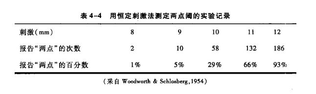

[TOC]
# 心理物理学
* **心理物理学定义**：**心理物理学**是研究**心理现象**与**物理刺激**之间关系的学科
* **费希纳的贡献**：
   - 1860年，费希纳的《**心理物理学纲要**》标志着心理物理学的诞生
   - 费希纳为**心理学的量化研究**开创了先河，特别是他的心理事件的量化方法；他制作了反映阈上感觉随物理刺激变化的**心理量表**，并基于此推导出**费希纳定律**
   - 他的理论后来被称为**传统心理物理学**
* **史蒂文斯的研究**：
   - 史蒂文斯改进了传统心理物理学的**感觉测量法**，建立了直接测量感觉的方法——**数量估计法**
   - 史蒂文斯提出了**幂定律**，深化了对心物关系的理解
   - 他的研究标志着心理物理学进入了新的阶段
* **信号检测论的引入**：
   - 信号检测论为心理物理学带来了重大突破
   - 它成功地将人的**主观因素与客观感受性分离**，并放弃了传统心理物理学中的感觉阈限概念
   - 信号检测论推进了心理物理学的全面发展
* **现代心理物理学**：为了与费希纳的传统研究区分开来，包括**数量估计法和信号检测论**在内的研究方法和成果被统称为**现代心理物理学**
# 感觉阈限的测量
*  **感觉阈限（sensory threshold）的定义**：
   - **绝对阈限**（德语Reiz Limen，简称RL）：刚刚引起**心理感受**的物理刺激量
   - **差别阈限**（德语Differenz Limen，简称DL）：刚刚引起**差别感受**的物理刺激量
* **阈限的测量困难**：人们对刺激的感觉**不是稳定的**，会受到多种因素的影响，因此**不存在**一个明确的心理感受从无到有的**突变点**
* **阈限的操作定义**：
   - **绝对阈限**：在实验中有50%的次数能引起感觉的刺激值
   - **差别阈限**：50%的实验次数能引起差别感觉的那个刺激强度之差
*  **费希纳的阈限测量法**：费希纳提出了三种经典的阈限测量方法，包括最小变化法、恒定刺激法和平均差误法
## 最小变化法（minimal-change method）
* **最小变化法的描述**：
   - 也被称为极限法、序列探索法或最小可觉差法
   - 方法是按**递增或递减的序列方式**，以**间隔相等的小步**变化刺激，寻找从一种反应到另一种反应的**转折点**，即阈限的位置
### 实施程序
#### 绝对阈限
* **刺激序列**：由**不同强度**的物理刺激组成，通常选择10~20个刺激强度水平，包括**递增和递减**两种序列
* **起点选择**：
   - **递增序列**：起点设置在被试**基本觉察不到**的物理刺激强度范围内，随机选择
   - **递减序列**：起点设置在被试**基本可觉察到**的物理刺激强度范围内，随机选择
* **测量次数**：为了准确测量阈限，每个刺激序列通常需要测定**约50次**
* **实验过程**：从**序列起点**开始，按递增或递减方向，**依次呈现**给被试；每次呈现刺激后，被试需报告有无感觉，若不确定，可**猜测**，但不能放弃
* **反应转折点**：每个序列继续进行直到被试的反应发生转折，即递增时第一次报告“有”，递减时第一次报告“无”；此后，该系列停止，开始下一个系列
* **实例**：图中提供了一个用最小变化法测定音高绝对阈限的记录示例，展示了递**增和递减系列的交替呈现方式**

#### 差别阈限
* 最小变化法用于测定差别阈限时，**每次呈现两个刺激**
   - **标准刺激**（standard stimulus，简称$S_t$）：固定的刺激，其强度**大小不变**
   - **比较刺激**（comparison stimulus，又称变异刺激（variance stimulus，简称$S_v$）：强度会**逐渐变化**的刺激，按由小而大或由大而小的顺序呈现
   - 比较刺激和标准刺激可以**同时呈现**，也可以**先后呈现**
* **起点选择**：
   - **递增序列**：比较刺激的起点选自被试感觉明显小于标准刺激的强度范围
   - **递减序列**：比较刺激的起点选自被试感觉明显大于标准刺激的强度范围
* **被试任务**：被试需要**比较**两个刺激的大小，并**报告感受**：
   - 认为比较大于标准刺激时报告“大”（记作“ + ”）
   - 认为比较小于标准刺激时报告“小”（记作“ - ”）
   - 认为两者相等时报告“相等”（记作“ = ”）
   - 若不确定报告“怀疑”（记作“ ? ”）
*  **序列停止条件**：当被试在递增序列中首次报告“大”或在递减序列中首次报告“小”时，该序列停止
*  **实例**：图中提供了一个用最小变化法测定时间差别阈限的示意，展示了递增和递减序列的交替进行方式

### 阈限值的计算
* **绝对阈限值的计算**：
   - 对于每个刺激系列，阈限是被试反应转折点前后两个刺激值的**中点**
   - 所有刺激系列的阈限**均值**即为最终的绝对阈限值
* **差别阈限的计算**：
   - **上限**（upper limit，符号$L_u$）：指递减系列中最后一次"+"和第一次非"+"（即"="或"-"或"?"）的中点以及递增系列中最后一次非"+"和第一次"+"的中点
   - **下限**（lower limit，符号$L_l$）：递减系列中最后一次非"-"（即"="或"+"或"?"）和"-"的中点以及递增系列中最后一次"-"和第一次非"-" （即"="或"+"或"?"）的中点
   - **不肯定间距**（符号$I_u$）：上限和下限之间的距离
   - **主观相等点**（point of subjective equality，PSE）：不肯定间距的中点，理论上与标准刺激大小相等
   - **常误**（constanterror，CE）：主观相等点与标准刺激之间的差距
   - **上差别阈（$DL_u$）和下差别阈（$DL_l$）**：标准刺激与上限和下限之间的距离
   - 最后的差别阈限是上差别阈和下差别阈的**平均值**，或不肯定间距的**一半**

### 测量绝对阈限的误差及其控制
#### 习惯误差和期望误差
- **习惯误差**（error of habituation）：由于**习惯于先前的刺激感觉**，即使刺激发生变化，被试仍**保持先前的判断**
  - 一旦产生习惯误差，则在**递增**系列中，即使刺激强度早已超出阈限，被试仍报告感觉不到，从而导致**阈值偏高**；相反，在**递减**序列中，即使刺澈强度早已小于阈限，被试仍报告有感觉，从而导致**阈值偏低**
- **期望误差**（error of anticipation）：被试**期望目标刺激尽快到来**，即使刺激未变化，也**提前作出相反判断**
  - 一旦产生期望误差，则在**递增**系列测定阈限时，阈值会**偏低**；**递减**系列测定阈限时，阚值会**偏高**
#### 练习误差和疲劳误差
- **练习误差**（error of practice）：由于多次实验，被试**逐渐熟悉实验情境**，导致反应速度加快和准确性提高；练习误差可能导致阈限降低
- **疲劳误差**（error of fatigue）：多次实验后，被试**感到疲劳或厌烦**，导致反应速度减慢和准确性降低；疲劳误差可能导致阈限升高
-  **误差检验与控制**：
   - 通过**比较递增系列和递减系列的阈值大小**，可以检验是否存在习惯误差或期望误差
   - 为控制习惯误差和期望误差，应**交替呈现**递增和递减系列，并**随机选择**每个系列的起点
   - 为检验练习误差和疲劳误差，需要**比较前一半实验与后一半实验的阈限均值**，若前者比后者大，且差异显著，就可认为测定过程中存在练习效应：相反的，若前者比后者小，且差异显著，就可认为测定过程中存在疲劳效应
   - 为控制练习误差和疲劳误差，应使递增和递减系列**按ABBA的顺序交替呈现**，递增和递减各自所用的次数要相等，且在前在后的机会也要均等
   - 在测定差别阈限时，也应注意习惯、期望误差或练习、疲劳误差，并采取相应的控制措施
- **最小变化法的特点**：
   - 刺激**按系列依次呈现**，被试进行觉察判断
   - 系列**起始位置随机**，刺激强度间**差异小**
   - 递增和递减系列**数量相等**，**交替呈现**，多用ABBA法控制
   - 求阈限的方法是对每一系列先求阈限，然后取所有系列的阈限**平均值**
## 恒定刺激法（method of constant stimulus）
### 实施程序
* **恒定刺激法的定义与应用**：
   - **恒定刺激法**也被称为正误法、次数法或固定刺激法
   - 它是心理物理学中**最准确且应用最广泛的方法**，可用于测定绝对阈限、差别阈限和等值等多种心理值
   - 方法的核心是：以**相同的次数**呈现少数几个恒定的刺激，通过被试觉察到每个刺激的**次数**来确定阈限
* **实施程序**：
   - 使用的刺激数量**明显少于最小变化法**，通常为5~7个
   - 最大的刺激应为被试**几乎总是能感觉到的强度**；最小的刺激则为被试**几乎总是不能感觉到的强度**
   - 在整个测定过程中，选定的刺激强度**保持不变**，并多次呈现给被试
   - 呈现的次序应**随机**，以防止被试预测
* **两点阈的测量**：
   - 两点阈代表皮肤对触觉刺激的分辨能力，即**能感觉到是两个刺激点的最小距离**
   - 操作定义为：**50%的次数**能感觉到是两点时的两个刺激点间的距离
   - 使用恒定刺激法测量时，选择一定范围内的5~7个等距的刺激强度
   - 每次刺激后，被试报告感觉到的点数，然后根据报告次数计算阈限

### 阈限值的计算
*  **阈限的计算**：
   - 使用恒定刺激法时，目标是找到50%次被感觉到的刺激的大小
   - 如果没有恰好50%的刺激，可以使用**直线内插法**（linear  interpolation）来估计
   - 通过描绘出刺激与正确判断率的曲线，找到**纵坐标为50%的横坐标值**，即为阈限

   - 除了直线内插法，还有其他方法如平均Z分数法、最小二乘法和斯皮尔曼分配法，但直线内插法因其简单性而常用
* **测量差别阈限**：
   - 选定5~7个**已知刺激**作为比较刺激
   - 比较刺激的强度应在标准刺激的上下范围内
   - 记录每个比较刺激所对应的**反应频数**，如“大”，“小”和“相等”
   - 使用直线内插法等方法计算出差别阈限
- **重量的差别阈限测定示例**：
   - 以200g的重量作为标准刺激，选择185g~215g的7个重量作为比较刺激
   - 被试需报告三类反应：“大于”、“等于”和“小于”
   - 每个比较刺激与标准刺激比较至少100次，然后计算每一刺激的三类反应的百分比

- **数据与曲线**：
   - 根据表4-5中的“+”、“=”和“-”三个纵列的数据，描绘出三条曲线
   - 使用直线内插法，确定两个关键的重量值：一个是50%的次数被判断为比标准刺激重的重量（上限），另一个是50%的次数被判断为比标准刺激轻的重量（下限）（$L_u=204.5g$，$L_l=196.6g$）
   - 差别阈限 $D L=\frac{204.5-196.6}{2}=3.95(\mathrm{g})$

*  **被试的反应与差别阈限**：
   - 当被试作出三类反应（“大于”、“等于”和“小于”）时，他们的自信度会影响“等于”的反应频率，从而**影响差别阈限的大小**
   - 自信的被试可能较少报告“等于”，而谨慎的被试可能更多地报告“等于”
- **两类反应的建议**：
   - 为消除上述影响，一些建议只让被试作出“大于”和“小于”两类判断，即使在分不清大小时，也**必须选择其一**

   - 对于这两类反应，直接求50%的“大于”或“小于”反应对应的刺激量是无意义的；应取与标准刺激**完全能辨别的重量**（纵坐标100%）和与之**完全不能辨别的重量**（纵坐标50%）的**中点**（纵坐标75%）来求得上限与下限

   - 由图 4-3 可见，$L_u=$ $206.6 \mathrm{~g}, L_1=192.8 \mathrm{~g}$, 差别阈限 $D L=\frac{206.6-192.8}{2}=6.9(\mathrm{~g})$

   - 通过上述方法得出的是**75%差别阈限**，它与之前的差别阈限操作定义不符，因此不能与其他方法得出的差别阈限直接比较
- **恒定刺激法的特点**：
   - 采用**少数固定刺激**，根据被试的判断反应的频数确定阈限
   - 刺激按**预定的随机顺序**呈现，每个刺激一般呈现50到200次
   - 阈限值通常通过**直线内插法**求得，完全符合阈限操作定义（除了75%差别阈限）

