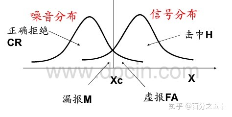

# 心理物理学与视觉
奥利弗•萨克斯（Oliver Sacks）:著名医生、教授、作家，患有**面孔失认症**(Prosopagnosia)(脸盲症)，其大脑中负责面孔识别的部位(主要是梭状回)出现故障；感觉完整，知觉部分丧失

* **感觉**(Sensation)：自下而上的加工,接受与传递外界刺激
* **知觉**(Perception):自上而下的加工，大脑组织理解信息并与情境结合
---
* **心理物理学**（Psychophysics，或称**精神物理学**）：实验心理学的一部分，是心理学中研究**物理刺激和感官认知之间的关系**的学科，也指应用于研究感知系统的一般方法
  * 心理物理学诞生于1860年，主要方法和理论成型于**古斯塔夫·费希纳**1860年出版的著作《心理物理学纲要》；甚至比1879年诞生的心理学本体要早
  * 心理物理学家，用的是**数学工具**，他们的目的是是寻找一种**函数**，寻找一种**模型**，去描述“身心对应关系”，他们不关注内部到底发生了什么，为何发生，只是专注于**对应关系**
  * **概念**
      * **绝对感受阀限**(Absolute Threshold of Sensation)：有感觉与无感觉分界线上的刺激强度，或者50%的情况下刚好引起特定感觉的最小刺激量
      * **差别阀限**(Difference Threshold)：个体分辨差别的能力，非线性，受韦伯定律影响
      * **三种测量阈限的方法**
        * **极限法（最小变化法）**：刺激以**相等间距变化**，从远离阈限值开始，或渐增，或渐减，找被试从感觉不到到感觉到，或从感觉到到感觉不到的**转折点**，以此转折点的刺激强度作为**阈限值**
          * **习惯误差**：被试者习惯于原来的刺激所引起的感觉，因而使转折点**向后推延**
          * **期望误差**：被试者知道刺激是连续变化的，可能会期望刺激所引起的感觉变化尽快到来，这样就会**提前作出反应**
        * **恒定刺激法**：心理物理学中最准确，应用最广的方法，用**最小变化法**粗略地测定出被试相关的阈限值，把比阈限值强或弱的几个刺激定为实验中所要用的**恒定刺激**；统计出每个刺激被感觉到的百分数，再计算出50%的次数引起感觉的刺激强度，就是所测的阈限值
          * 恒定刺激法的刺激是**随机呈现**的，每个刺激呈现的次数应**相等**
          * 用恒定刺激法测量**差别阈限**时，将刺激两两比较，当时候两两比较的时候正确率在50%时即为阀限
        * **平均差误法**：实验者规定以某一刺激为**标准刺激**，然后要求被试**调节**另一个**比较刺激**，使后者在感觉上与标准刺激相等；每一次比较就会得到一个误差，之后得到**平均误差**，因为平均误差与差别阈限**成正比**，可以用平均误差来表示差别阈限值
      * **信号检测论**(Signal Detection Theory)：预测个体在什么条件下会检测到一个微弱刺激的理论，建立在一定情境基础上；与刺激强度、警觉程度及期望有关
        * 是用来解决传统心理学中**测量感觉阈限不准**的问题而诞生的；传统心理学中，刺激是每次都会发生的，根据个体的报告来判断阈限，**感受性和判断标准**不能区分开，而信号检测论可以区分开 
        * **四种情况**
          * **击中**（hit）：刺激出现，并被报告感受到了
          * **漏报**（miss）：刺激出现，并被报告没有感受到
          * **虚报**（false alarm）：刺激未出现，并被报告感受到了
          * **正确拒斥**（correct rejection）：刺激未出现，并被报告没有感受到
        * 以S表示信号，N表示噪声，由于**噪音必然存在**，信号总是**叠加**在噪音之上（SN），N和SN呈**正态分布**；噪音的**密度分布**相同，且一般都是**中间值**

        * **疑惑区间**：X（**感觉强度**）处于信号分布和噪音分布**重叠的区域**上时，就会出现**判断失误**；在这个区间里，任意一个X，它来自信号分布还是噪音分布的可能性，可以用X所对应的曲线的**纵坐标（O）之比**来确定，即O(SN)/O(N)=l(X)，l(X)在概率统计中又称为“**似然比**”(likelihood ratio)
        * **似然比**是X的函数，当X变化时，l(X)的变化是一条接近**幂函数**形式的曲线
        * **决策标准**：用β表示，有主观选择性，当β<l(X)就选择“信号反应”，当β>l(X)就选择“噪音反应”
        * **最大收益**：用β(opt)表示；击中、虚报、漏报、正确拒斥的利益得失各不相同，列在表中就可以组成一张**支付矩阵**(payoff matrix)，则β(opt)=（P(n)/P(s)）•（V(cr)+C(fa)）/（V(hit)+C(m)），其中P(n)代表的是噪音的概率，P(s)代表的是信号的概率；V(cr)表示正确拒斥时获得的价值，C(fa)表示虚报的损失，V(hit)表示击中时的价值，C(m)表示错过的损失

      * **等感受性曲线**：简称ROC，把虚报率作为横坐标，把击中率作为纵坐标；在这条曲线中，判断标准是变化的，但辨别力保持不变
      * **感觉适应（习惯化）**(Sensory Adaptation)：持续受相同刺激作用，感觉会进行调整，可解释不同人对刺激的不同态度
      * **心理量表**：是测量工具的一种，用于鉴别个体心理功能的高低；为了度量感觉量，就需要根据刺激变化和感觉变化之间的关系建立心理量表
        * **顺序量表**：既没有相等单位也没有绝对零点，只能知道某事物按照规定的标志在一定顺序中**所处的位置**
          * **顺序量表的制作**：**对偶比较法**（左右顺序或者先后顺序要互换），**等级排列法**（一次排序有随机误差）
        * **等距量表**：只有相等单位而没有绝对零点，不仅可以知道两事物之间在某种特点上**有无差别**，还可以知道它们**相差多少**
        * **比例量表**：既有相等单位又有绝对零点，不仅可以表明就其一特点来说两事物**相差多少**，而且还可以表明它们之间的**比例关系**
      * **韦伯定律（韦伯-费希纳定律）**(Weber's Law):我们感知到的**差异**与**刺激量的大小**呈**对数关系**，而非线性关系（刺激本身越大，差异越不敏感），重要的是比值；用公式表示为$s＝klgr$，其中s是感觉强度，r是刺激强度，k是常数
      *  **史蒂文斯定律**（Stevens' Law，亦称“幂函数定律”）：认为**感觉量的大小与刺激量的乘方成正比**，也即心理量是物理量的幂函数，用公式表示为S=KI的n次方，其中S为心理量，K为常数，I为物理量，n这个指数因不同的感觉而异
          * 该定律指出，在n<1时，心理量的增长慢于物理量的增长；当n>1时，心理量的增长快于物理量的增长；该定律只适用中等强度的刺激
          * 实际应用表明，该定律可用于测量几乎所有的心理量，比起韦伯定律能更恰当地反映心理规律，具有广泛的用途
      * 如果我们要用**差别阈限**的方法来制作**等距量表**的话，其结果将和费希纳的结果一致，因而会支持费希纳定律；如果我们用**数量估计法**来制作**比例量表**的话，其结果将和斯蒂文斯的结果相一致，因而会支持斯蒂文斯定律
----
**视觉**(Vision)

* **简单过程**
  1. 眼球接受全部光能；
  2. 转化为神经信息；
  3. 大脑加工与组织信息
* **光能**：人只能看到从伽马射线到无线电波范围的电磁波中很小的一部分范围；波长即频率决定光的色调，振幅决定亮度（能量）；波长长，频率低→→红色光  波长短，频率高→→蓝色光
* **过程**
  1. 光通过眼球的**角膜**(cornea)和**瞳孔**(pupil)，击中瞳孔后的**晶状体**（透明圆盘）(lens)，将光线汇聚为特定图像
  2. 晶状体将图像投射至**视网膜**(retina)，即眼球内壁表面，包含所有的**感受器**接收视觉信息；视网膜像由光能组成的一束像素点，将感受信息转化为神经冲动
     * 视网上的感受器分为**棒状细胞**(rods)和**椎体细胞**(cones)，前者检测灰度，用于周边视力（眼球中央凹外的视网膜上的视觉能力），以及在昏暗中，看不清颜色时识别轮廓；后者检测细节和色彩，集中于中央凹（视网膜中心的焦点）(fovea),只在光线良好时起作用；普通人可以分辨的颜色约有一百万种
     * **杨-赫尔姆霍茨三色理论**(Young-Helmholtz Trichromatic Theory)：认为视网膜上包含三种分别接收红、绿、蓝色光的椎体细胞，一起被激活时可看到任何颜色
     * **对立过程理论**(Opponent-Process Theory)：相互对立的加工过程产生颜色，细胞可被某种颜色激活或抑制
     * **色盲**：1/50，**二元色视觉**(Dichromatic)&**三原色视觉**(Trichromatic)
  3. 感受器产生神经信号使后面的**双极细胞**兴奋，将信号传递至**神经节细胞**，后者形成束状的**视神经**，将眼球的神经冲动传递给大脑
  4. 神经冲动由视神经经过**丘脑**，到达大脑的**视觉皮层**进行信息加工与分析（位于大脑背面的**枕叶**，右叶加工左眼信息）
     * 视觉皮层有特殊化的神经细胞即“**特征觉察器**”   (Feature Detectors),对形状、角度及运动等特定特征进行反应，不同部位负责识别不同特征
     * **梭状回**(Fusiform Gyrus)：视觉皮层中一区域，负责识别面孔
     * **平行加工**(Parallel Processing)：立即将情境中所有单独的信息进行加工分析的能力

---
[Crash Course](https://www.bilibili.com/video/BV1Zs411c7W6?p=6)