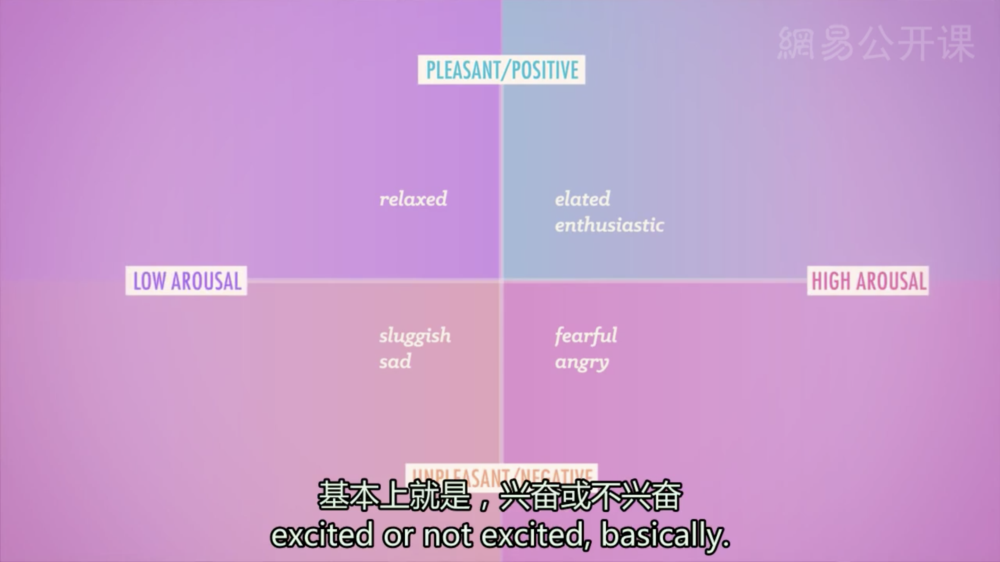
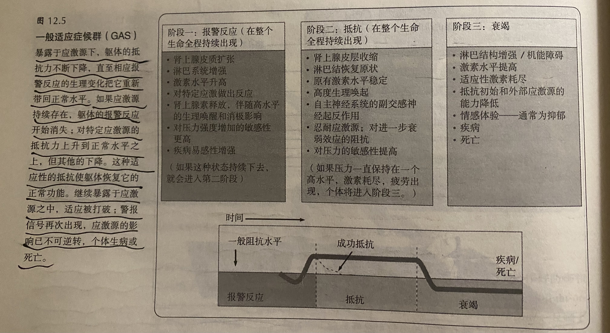

# 情绪、压力与健康
* 情绪并不仅仅只是一个心理现象，因为很多情绪都具有一定的感染力，而由此引发我们的感受和行为，也会影响思维、身体和身心健康
---
**基本情绪与文化**
* **达尔文**认为，所有物种的情绪与其他重要的结构及功能一同进化而来；他将情绪看做一种遗传得来的、对世界上某类反复发生的情境做出反应的**特定**心理状态
* **希尔文•汤姆金斯**是第一位强调即时的、非习得性的**情感反应普遍性**的心理学家；他指出，婴儿无须预先学习就会对巨大声响表现出恐惧或呼吸急促，体现出对特定刺激的“预置”普遍情绪反应，从而适应各种环境；同样，婴儿**解释他人面部表情的能力**似乎与生俱来
* 情绪专家**保罗·艾克曼**认为我们的面部表情具有**跨文化的共性**，所以不同国家的人能够识别出相同的**七种基本情绪**，快乐、悲伤、厌恶、愤怒、恐惧、惊讶和轻蔑，仅仅通过看你的面部表情
  * **神经文化理论**：当一种特定情绪被唤醒时，大脑控制相应的面部肌肉做出特定表情，而在普遍的生物学之外，不同的文化会施加各自的影响，因此除七种基本情绪外其他表情没有普遍性
* 据**面部反馈假设**（Facial Feedback Hypothesis），表情还能帮助我们调节我们自己的情绪
  * 扬起嘴角微笑的动作，即使你并不快乐，也会使你的心情好转，皱眉头也会起到相反的作用；最近的一项随机控制的临床试验表明，在额头注射一点肉毒杆菌可能会减轻抑郁，因为如果皱眉的肌肉没法活动，很难感受压抑失落
* **内倾型**的人（Introverts）通常很善于理解他人的感受，而**外倾型**的人（Extroverts）通常更善于表达自己的感受
* 许多特定**手势**（Gestures）在不同文化中表达情绪时会有完全不同的意思

* **10种不同的人类基本情绪**：由美国心理学家卡罗尔·伊扎德识别，包括**快乐**（Joy）、**吃惊**（Surprise）、**悲伤**（Sadness）、**愤怒**（Anger）、**厌恶**（Disgust）、**轻蔑**（Contempt）、**羞耻**（Shame）、**恐惧**（Fear）、**愧疚**（Guilt）、以及**好奇**或**兴奋**（Interest or Excitement）
  * 有人认为“骄傲”应该被列入其中，也有人认为“爱”也应该被归为一种基本情绪，但伊扎德认为这些以及其他的情绪仅仅是这10种基本情绪的组合而已
* **二维模型**（Two-dimensional Model）：任何你可能会体验到的情绪都可以通过一个二维图示来表达；其中一个维度是强度，简单的说，就是“好”或“坏”；另一个维度是唤醒，基本上就是兴奋或不兴奋
  * 每一种情绪都能通过这两个维度不同程度的组合来定义，比如惊恐意味着你比仅仅是受到惊吓时要更加害怕，就像恼怒比起仅仅是有些生气、愤怒的强度要更高一些

---
**生活压力**
* **压力/应激**（Stress）：在面对我们自己认为具有挑战性或威胁性的特定事件或**压力源**（stressor）时，我们认知和反应的一种加工程序
  * 严格来说，压力并不是一种情绪，它更像是一种我们对于令人困扰的刺激所作出的反应，而我们的反应在一定程度上取决于我们对这种**刺激的评价**（Apraisal of that Stimulus）
  * **外部压力源**
    1. **灾难**（Catastrophes），即无法预料的大型事件，比如战争、自然灾害或是恐怖袭击
    2. **重要的人生转折点**（Significant life changes），比如搬家、生孩子、失去或获得新的工作、所爱的人去世
    3. **日常生活的不如意**（Everyday inconveniences），比如堵车、迟到或是长期与室友相处得不愉快
* **生理应激反应**
  * **急性应激**（acute stress）：短暂的唤醒状态，伴随着典型的进攻或撤退模式
    * **战斗或逃跑反应**（fight-or-flight response）：由坎农第一次科学描述，中心位于下丘脑，包含了许多情绪反应
      * 下丘脑在紧急事件中有双重功能，对于自主神经系统的控制及对于垂体腺的控制
      * 自主神经系统调节有机体活动，使呼吸加快加深，心率增加，血管收缩，停止消化等特定功能，并促进肾上腺素的分泌
      * 垂体腺分泌促甲状腺激素和促肾上腺皮质激素
      * 一点短暂的压力实际上对我们是有益的，它能够在你需要时使你保持积极和警惕；对你的身体来说，适当的压力能够激发免疫系统启动防御机制，比如促进伤口愈合，抵抗病菌感染
    * **照料和结盟反应**（tend-and-befriend response）：谢利•泰勒提出，认为女性不会体验到战斗或逃跑反应，而是首先考虑到孩子的需求以及与社会团体中有相同目标的人结盟
  *  **慢性应激**（chronic stress）：长期的唤醒状态，使人感到即便内在与外在资源加在一起，也不再能满足压力事件的要求
     * **一般适应症侯群**（the general adaptation syndrome，GAS）：汉斯•赛里认为，许多种应激源都会引发相同的反应或一般性的身体反应
       * **报警反应**：短暂的生理唤醒期，使身体能有力行动而做好准备
       * **抵抗期**：一个适度的唤醒状态，可忍耐长时间的应激源带来的衰弱效应
       * **衰竭期**：应激源持续的时间足够长或强度足够大，身体的资源耗尽 

     * 长期的反应提高了患上消化、呼吸、新陈代谢和传染性的疾病的几率，所以长期的压力（Chronic Stress）会摧残身心健康
     * **心身失调**（psychosomatic disorder）：当身体处于慢性应激时，“应激激素”分泌的增加反而会损害免疫系统的完整性
  * **压力对机体功能的影响**：神经系统调动所有的机体能量输送给你的肌肉和大脑时，它也剥夺了你身体中其他器官的能量
    * **肠神经系统**（Enteric Nervous System）：负责调节胃肠功能，在长期压力下机体必须抑制消化功能或者降低消化物的分泌量，暂时使你的结肠痉挛，引起消化问题
    * **肝脏**：当肝脏压力过大而无法对血液进行正常过滤时，多余的脂肪和胆固醇就会在你的血液中循环，堆积在心脏周围，使血压升高，心率加快，导致心脏病
* **心理应激反应**
  * **人生重大事件**
    * **社会再适应量表**（social readjustment rating scale，SRRS）：简单地测量各种生活变化所需的适应程度
    * **生活变化单位**（life change units，LCUs）：每个变化与结婚（50）相比较，所需的再适应的数值
    * 调查结果显示，参与者在90年代体验到的压力水平明显高于60年代的同辈人，且妇女高于男性；SRRS分数与参与者接下来六个月的看病总次数存在正相关
  * **拖沓与及时**
    * 不拖沓者喜欢马上将工作做完，因此在学期初体会到更多的压力和症状
    * 拖沓者在学期初躲避压力，但在期末体验到更多的生理病痛
* **应对压力**
  * **应对**（coping）：是指对付那些被知觉为紧张或超过了个体资源所及的内在或外在要求的过程
  * **对压力的评估**
    * **初级评估**：对于需求的严重性的评估，例如“发生了什么”或者“是好是坏”，以及是否需要采取行动
    * **二级评估**：估计自己的个人和社会资源是否能有效应对压力情境，并斟酌备选的行动方案
    * **压力调节变量**（stress moderator variable）：那些可以改变应激源对于特定类型的应激反应的影响的变量
  * **应对反应的类型**
    * **预先应对**（anticipatory coping）：应对行为先于潜在的压力事件出现
      * 对一种压力情境的预期会带来许多想法与感受，它们本身也导致了压力的产生
    * **问题指向的应对**：接对付应激源，选择战斗、逃跑或协商等方法，对于**可控应激源**即可通过行动改变的应激源比较有效
    * **情绪聚焦的应对**：改变自己的感觉或想法，例如放松、幻想或使用药物，对于**不可控应激源**比较有用
    * **韧性**（resilience）：在面对严重的健康威胁时仍可以达到积极结果的能力
      * 孩子韧性的提高来自有良好教养技巧的父母支持，他们能专注在任务上并控制他们的情绪反应
  * **改变认知策略**
    * **重新评价**：换一种方式考虑特定的应激源，重新标定它们，或想象它们处于较小威胁（甚至是可笑的）情境当中
    * **应激思想免疫法**：唐纳德•梅钦鲍姆提出，在第一阶段对实际行为获得更多认识，增加对问题的可控感，第二阶段开始认同那些可以抵消非适应性、自我挫败行为的新方法，第三阶段对新行为的结果进行评价，避免之前难堪的内心独白
    * **知觉控制**（perceived control）：建立对应激源的可改变事件的信念，例如相信你可以影响一些疾病的进程，而非全是你无法改变的状况
  * **以社会支持作为应对资源**
    * **社会支持**（social support）：他人提供的一种资源，分**有形支持**（金钱、住房）、**情感支持**（爱、尊重）以及**信息支持**（建议、反馈）
    * 当社会支持方式与被支持者需求匹配时（如女性对情感支持的需求水平通常更高），支持的效果更好；不需要的支持方式甚至会产生反作用（因为挤占了其他支持的空间）
* **应激的积极作用**
  * 研究者发现良性刺激——激动焦虑的经验——常是人们**观看体育比赛**的重要动机
  * **利益发现**（benefit finding）：人们从负面事件中寻找积极方面的能力，通常需要重新评估的过程
---
**健康心理学**
* **健康心理学**（health psychology）：心理学的一个分支，致力于研究人们怎样保持健康、患病的原因及生病后的反应
* **健康**（health）：身体和精神上的一种稳定、充满活力的一般状态
* **健康的生物心理社会模型**
  * **生物医学模型**：一种身体心理两极对立的概念，认为医学医治的只是生理身体，心理只对情绪和信仰起重要作用，是现代西方医学的重要观念，但非西方文化的治疗实践多半不认同
  * **生物心理社会模型**（biopsychosocial model）：生物是指现实的生物学疾患，心理和社会是指健康的心理和社会成分
  * **最佳健康**（wellness）：综合了生活的生理、智力、情绪、精神、社会和环境的方方面面
* **健康促进**
  * **健康促进**（health promotion）：意味着一般的策略和特定方法来消除或减少人们患病的风险
  * **吸烟**
    * 一种与开始吸烟有关的人格类型被称为**寻求感官刺激**，特征是喜欢从事冒险性的活动
    * 成功的戒烟治疗要同时满足吸烟者生理上和心理上的需求，例如使用尼古丁替代治疗并使戒烟者意识到成功的可能性并应对诱惑
  * **艾滋病**
    * **艾滋病**（AIDS）：获得性免疫缺陷综合征（acquired immune deficiency syndrome）的字头缩写，其病原体被称为人类免疫缺陷病毒（HIV）；HIV是一种在人类血液中袭击白血球（T淋巴细胞）的病毒，从而损害免疫系统，降低人体抵抗其他疾病的能力
    * HIV病毒无法在空气中生存，必须直接进入血液中传播，包括性接触、注射毒品、输血等方式
    * **预防艾滋病的方式**：信息（艾滋病的知识）、动机（主动预防）、行为技巧（如何运用知识）
* **治疗**
  * **遵守医嘱**
    * 对于某些治疗方案，病人不遵医嘱的比例估计高达50%
    * 病人对疾病严重性的感知，以及对治愈性的悲观估计影响了患者对医嘱的遵守
  * **利用精神治疗身体**
    * **放松反应**（relaxation response）：一种可使肌肉紧张度、皮层兴奋性、心率和血压都有所降低，呼吸变得缓慢的状态
      * **满足放松反应的四个条件**：安静的环境、闭上眼睛、舒服的姿势、不断重复的心里刺激
    * **生物反馈**（biofeedback）：由**尼尔•米勒**开创，提供清楚的外部信号来意识到本来很弱或者内在的反应，例如血压的上升与下降和脸红现象
  * **心理神经免疫学**（psychoneuroimmunology）
    * 20世纪80年代早期的一系列研究发现，心理状态能够影响机体的免疫能力
    * 应激水平的细微差异就会影响人们身体的康复速度，例如很难控制愤怒情绪的个体的伤口通常会多花几天才能愈合
  * **心理对生理健康的影响**
    * 根据**詹姆斯•彭尼贝克**的研究，压抑关于个人创伤、失败、悔恨或羞耻经历的想法感受，会大大损害精神和生理健康而倾诉往往能在几个月或几周后改善生理和心理健康
* **人格和健康**
  * **A型行为模式**（type A behavior pattern）：一种复杂的行为和情绪模式，包括极端好胜、富有攻击性、缺乏耐心、极富竞争性和怀有敌意，通常对生活中的某些核心方面感到不满，且通常是一个孤独者
  * **B型行为模式**（type B behavior pattern）：较少竞争性、缺少敌意等等
  * A型行为模式的人更易患上冠心病等疾病，特别是敌意的人格特质
  * **敌意**对健康的影响可能是导致应激反应长期的过度唤醒，或者是导致个体养成不良的生活习惯，而且躲避社会支持
  * **乐观主义**的人在面对较低要求时表现出较好的免疫反应，然而面对较高要求时往往表现出较差的免疫反应
* **职业倦怠和医疗保健系统**
  * **职业倦怠**（job burnout）：是一种情绪衰竭、人格解体、个人成就感降低的综合症，通常发生在那些需要不断同病人、来访者和公众进行高强度接触的职业中
  * 健康工作者开始失去他们对病人进行关心和爱护的热情，甚至用冷漠乃至不人道的方式对待他们
---
[Crash Course](https://www.bilibili.com/video/BV1Zs411c7W6?p=27)