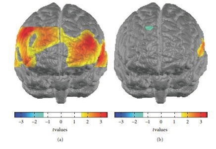

# 意识
* **意识**（Consciousness）：我们对自身以及周围环境的觉察，正是这种觉察让我们能够在一瞬间同时接收和组织来自各种渠道和感官的信息
* 意识体验永远处于变化当中
   * **“意识流”**（Stream of consciousness）：威廉·詹姆斯认为意识是一种不断运动的、变化的、川流不息的过程
   * 其他人认为意识是大脑中一只四处照射的手电筒，发出连续完整的光，高亮一个物体，然后移动到下一个事物上
* 在日常生活中，意识一直在各种状态中不停转换，包括清醒、睡眠，以及其他各种特殊的状态

---
* **非意识** ( nonconscious ) **过程**：一些很少进入意识中的过程，如躯体活动、呼吸等，但也许可以被有意识控制
* **前意识记忆** ( preconscious memories )：只有在注意到之后才能到达意识的记忆，如关于地理的一般知识等；直到需要意识的情境出现才会进入意识
* **未被注意的信息**：没有被知觉选择注意的信息；人们可能对这些信息进行加工，但加工的程度未达到可识别刺激的那个点
* **无意识信息**
  * 弗洛伊德的解释：不可被接受的想法或动机（如创伤性记忆或禁忌的欲望）受到压抑，被排除在意识之外，但与它们联系的强烈情感依然存在并影响着行为
  * 现代解释：在通常情况下根本不会进入意识层面的东西，如语言的无意识加工过程；无意识水平下的操作经常影响行为
---
* **研究意识的方法**
  * **出声思维报告** ( think-aloud protocols )：内省法的变式，要求实验参与者在进行各种复杂任务时大声说出详细的解决过程，用来说明参与者完成任务时的心理策略和知识表征
  * **经验抽样法** ( experience-sampling method )：参与者佩戴一些装置，在一段时间内当它发出信号时就报告意识中的内容，可以对参与者在日常生活中思维、意识和注意的集中程度进行跟踪记录
  * **认知神经科学**（Cognitive Neuroscience）：研究我们的大脑活动如何与心理过程相联系，包括思维、知觉、记忆和语言，使用**神经影像学**的技术来研究大脑的特定状态和意识体验的联系；这项技术有些内容还不够成熟，所以在如何理解神经影像的发现成果上，学界内还存在大量的分歧
  * 对大脑进行扫描的方法：
     * **结构成像**（Structural Imaging）：显示大脑的解剖画面，对于识别大块的肿瘤、疾病和损伤非常有效
     * **功能成像**（Functional Imaging）：显示大脑中的电磁变化或代谢活动，比如血液流动，使我们能观测到特定的脑功能活动与特定脑区域的关联情况

---
* **意识的作用**
  * 意识由演化环境中对其他个体的竞争中进化而来，人类利用意识对生活中多变的需求做出灵活恰当的反应
  * 意识可限制察觉和注意范围，从而**减少刺激输入**
  * 意识可**选择性储存**想要分析、解释并对将来起作用的刺激
  * 意识可让个体基于过去的知识**思考计划**与各种可能的结果
* **对现实的个人建构**：基于个人的一般知识、过去经验的记忆、当前需要、未来目标等对当前情境做出的独特解释
  * 当对现实的个人建构趋于稳定时，**自我感**便会有较长时间的连续性
* **对现实的文化建构**：由一组特定人群的多数成员所共有的思考世界的方式
  * 当个人建构与文化建构相适应，即会被文化肯定并有**归属感**
---
**研究意识的功能**
* 使参与者的意识超过负荷，不得不使用无意识过程判断选择
  * **“哭泣婴儿”困境**：是否闷死自己的婴儿以避免敌军士兵发现和杀死自己和其他人
  * 比较**意识及无意识过程**得到的结果，无意识过程所用时间更长，所以做出**道德选择**需要意识参与
* 考虑在每日的任务中，哪些是需要意识干预的
  * 人们可以在不需要或很少意识注意的情况下搜索物体的**基本特征**（如颜色、大小），但**两个特征**一般需要意识注意 
  * 当两个特征被组织成**整体和部分的关系**时，选择就会较少受到其他物体的影响
---
* **双重加工**（Dual Processing）模型中意识的两个层次：
  * **启发式系统**（Heuristic System）：自动、快速、简单并且更加直觉型，或多或少地基于启发和情感
  * **分析式系统**（Analytic System）：速度较慢且需要努力，它以分析和理性的方式处理问题，更多基于深思熟虑和系统推理
* **注意**（attention）：心理活动或意识对一定对象的指向和集中
  * **分类**
    * **无意注意**：指没有预定目的，也无须作意志努力的注意，也称为不随意注意
    * **有意注意**：指有预定目的，需要一定意志努力的注意，也称为随意注意，是在无意注意的基础上发展起来的
    * **有意后注意**：指有自觉的目的，但不需要意志努力的注意，也称为随意后注意，通常是有意注意转化而成的
  * **选择性注意**（Selective Attention）：将意识集中于一个或一组特定的刺激，并有效地过滤掉所有刺激（所有的感官挖掘出的信息数量将近有1100万，然而真正意识到的只有40个左右）
    * 反面：**选择不注意**（Selective Inattention）
    * **鸡尾酒效应**（cocktail party effect）：人的一种听力选择能力，将注意力集中在某一个人的谈话之中而忽略背景中其他的声音，使我们可以在噪声中谈话（这个现象的一些表现在只有5个月大的婴儿实验中就能观察到）
      * 情况：
        1. 你呆在一个有47人同时在说话的房间内，但仍然可以集中注意听一个对话内容，将所有剩余的声音和背景音乐过滤出去；
        2. 但是，如果站在你附近的人提到了你的名字，一瞬间你的认知雷达就会启动，你的注意力会四处搜索提到你名字的那个声音，并极有可能尝试搞清楚是不是谁又在背后说你的坏话
* **非注意盲视**（Inattention Blindness）：当你的全部注意力都在其他地方时，那些完全没有注意到的东西显而易见的程度会让你吓一跳
  * **著名的非注意盲视实验**：看不见的大猩猩、做太空步的熊
  * **“误导”**（misdirection）：魔术师对非注意盲视的利用
* **变化盲视**（Change Blindness）：是指视觉场景中的某些变化并未被观察者注意到的心理现象
  * **“换人实验”**（Person Swap）：实验人员在公园中找到一个陌生人问路，然后在一些刻意安排的干扰中，最开始的那个实验者会离开，他的位置上会换上一个完全不同的人；实验中，一半的情况下，被试完全没有发觉
---
>一位绝地武士只为知识和防御使用力量，绝不用它来侵略。——尤达大师
---
[Crash Course](https://www.bilibili.com/video/BV1Ax411N75Q?p=9)