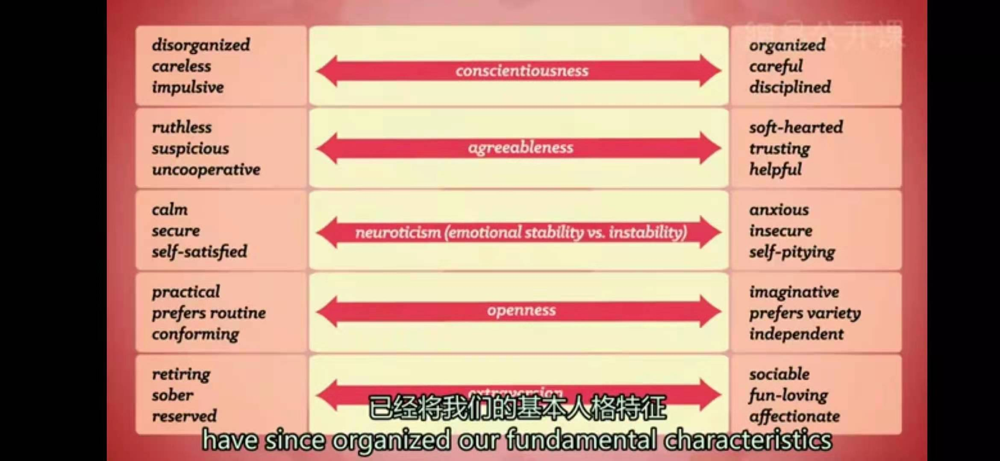
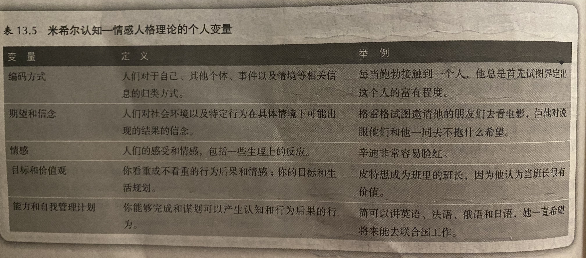
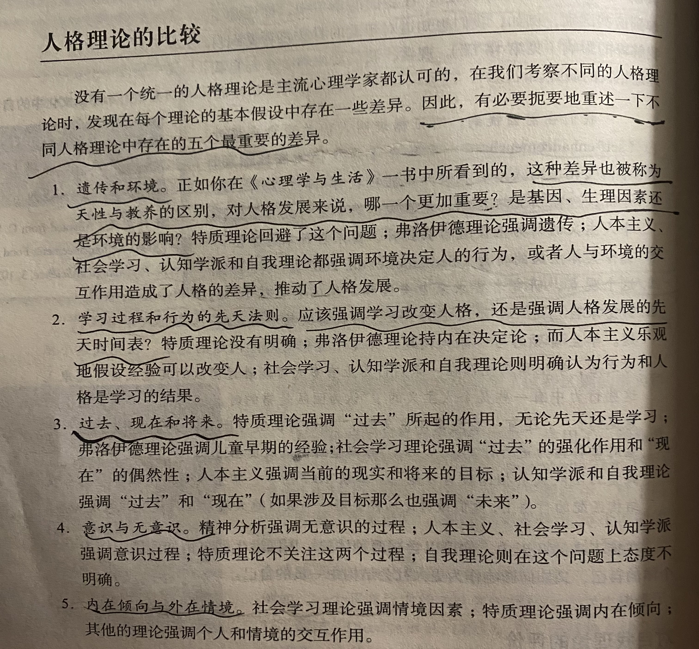
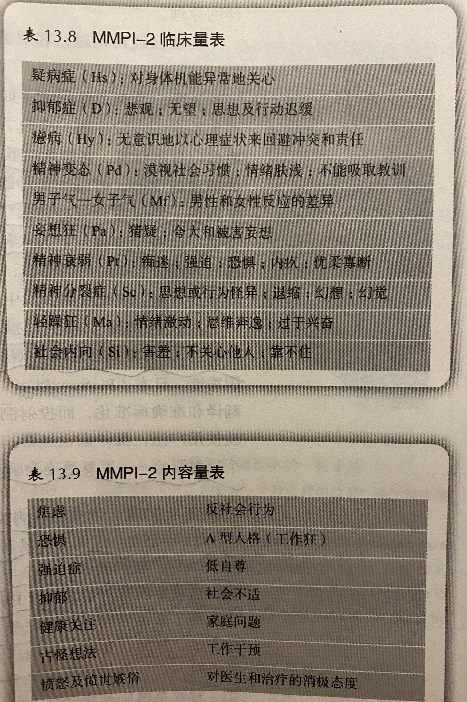

# 人格测量
* 古希腊医生**希波克拉底**认为人格由4种不同的**体液**组成（希波克拉底将人格分为4类，分别是多血质、粘液质、抑郁质、胆汁质），也就是说，你之所以是你，是因为你体内的粘液、血液、黄胆汁和黑胆汁具有独特的平衡
* 根据传统的**中医**理论，我们的人格取决于5种**元素**的平衡，金、木、水、火、土
* 传统的**印度草药学**认为，每个独一无二的个体都是由3种不同的**身体能量**组合而成（分别是Vata瓦塔，Pitta皮塔，Kapha卡法）
* **威廉•赛尔顿**在1942年根据体型将人分为内胚层型（胖），中胚层型（强壮）和外胚层（瘦）
* **弗兰克•沙洛威**提出了基于出生顺序的现代类型理论，认为头生子安于现状而后出生的孩子喜爱创新
---
**人格的类型和特质理论**
* **特质**（trait）：持久的品质或特征，使个体在各种情况下的行为具有一致性
* **人格特质理论**：**高尔顿·奥尔波特**创立，根据稳定持久的行为模式和有意识的动机来定义不同类型的人格
  * 特质可能作为**中介变量**，使一系列看起来几乎没有联系的刺激和反应产生联系
  * **首要特质**：决定一个人如何组织生活
  * **核心特质**：代表一个人主要特征的特质
  * **次要特质**：有助于预测个体行为，但对理解人格没有帮助
  * 阿尔伯特将**人格结构**作为决定个体行为的关键因素，而不是**环境条件**
* **确定普遍性的特质维度**
  * **卡特尔**提出了人类人格的16因素，称其为**根源特质**
  * **艾森克**推论出三个大维度，即**外向性**（内源导向性的或外源导向性的），**神经质**（情绪稳定的或情绪不稳定的），**精神质**（善良的或有攻击性的），并将前两者结合构成人格环
* **五因素模型**（five-factor model）/**“大五人格”**（the Big Five）
  
  * **开放性**（Openess）：一端是“对新的事物和变化保持完全的开放和接受”，另一端是“追求严肃刻板，墨守成规”
  * **责任感**（ConscientioBusness）：“冲动，做事完全不加思考”和“小心谨慎，按原则行事”
  * **外倾性**（Extroversion）：水平较高的人十分善于人际交往，水平较低的人则比较害羞和矜持
  * **随和性**（Agreeableness）：较高的人是乐于助人、友善随和的，与之相反的人则是多疑的、不配合的
  * **情绪稳定性**（Neurocism）：一个情绪较为稳定的人是冷静和有安全感的，情绪不太稳定的人则通常是焦虑的、不安的、顾影自怜的
  * 研究者已经开始证明，与五因素模型中的特征差异相对应，个体的脑功能是有差异的
  * 研究也表明，有些特质，比如情绪稳定性，似乎比其他特质能更好地对我们的行为进行预测
* 几乎所有的人格特质都受**遗传因素**的影响
* 在成年之前，这些特质都是十分稳定的，但这并不是说这些特征不会在不同的情境中有灵活的变化，所以人格特质更善于预测我们的**一般行为模式**，而不是那些特定情境中我们的行为
* **一致性矛盾**（consistency paradox）：在不同时间和不同观察者之间进行的人格评定具有一致性，而一个人在不同情境下的行为却缺乏一致性
  * **产生原因**：不同情境的心理特征没有被明确标定，例如公开聚会与私人聚会并不同
---
**社会学习和认知理论**
* **共同起点**：行为受环境突发事件影响
* **罗特的期望理论**：**朱利安•罗特**提出，认为人的行为与**自身对奖赏的期望**和**奖赏的价值**有很大联系
  * **期望**（expectancy）：人们对自己在某种特定情境下的行为能够带来奖赏的相信程度
  * 在一定程度上，期望的高低与**过去受到强化的经历**有关，例如过去获得奖赏会带来当前奖赏的期望
  * 大多数情况下的期望都是具体的，然而人们也对自己在多大程度上可以控制奖赏形成了更普遍的期望
  * **自我控制感**（Personal Control）：你主观上感觉到的你对自己所处环境拥有的控制力；那些相信命运是掌握在自己手中的人被称作 **“拥有内部控制点”**（Internal Locus of Control），而那些认为自己只是被不可控的力量推着走的人被称为 **“拥有外部控制点”**（External Locus of Control）
* **米希尔的认知-情感人格理论**：沃尔特•米希尔提出，认为行为是个体和情境相互作用的结果
  * 米希尔认为，个体如何对特定情境做出反应，取决于一些个人变量，它们来自于人们的观察学习经验以及同其他个体或环境的互动
  
* **认知社会学习理论**：**阿尔弗雷德·班杜拉**提出，强调我们的特质和社会背景之间的联系
  * **交互决定论**（Reciprocal determinism） ：个体因素、行为与环境刺激三者构成了一个复杂的互动系统，每一个都能影响并改变另一个元素，并且影响是相互的
  * **自我效能**（self-efficacy）：一种相信自己在某种情境下能够充分表现的信念；当自我效能低时，采取行动的几率变低，逃避的概率变高
  * **自我效能判断**
    * 现实的成绩
    * 替代性经验——对他人表现所做的观察
    * 说服——别人或自己使自己获得确信
    * 情绪唤起——焦虑或兴奋
* **坎特的社会智力理论**：**南茜•坎特**提出，认为在一定时期内，人们的社会智力具有一致性
  * **社会智力**（social intelligence）：人们在不同的人生任务中需要的专门技能
    * **人生目标的选择**
    * **社会互动的知识**
    * **完成目标的策略**
* **对社会学习和认知理论的评价**
  * 这些理论往往没有把情绪作为人格中的一个重要的成分，而只是其他认知过程中的伴随产物
  * 认知理论很少提及成人人格的发展过程，对个人能力产生方式的解释具有模糊性
---
**人格理论的比较**
* **遗传和环境**
* **学习过程和行为的先天法则**
* **过去、现在和将来**
* **意识与无意识**
* **内在倾向与外在情境**

---
**人格测量**
* **客观测验**
  * **人格量表**（personality inventory）：关于自身思想、情感和行为的一系列综述，并进行判断
  * **明尼苏达多项人格测验**（Minnesota Multiphasic Personality Inventory，MMPI）：最为广泛使用的人格测验
    * MMPI量表的编制采用了**实证**方法，而非当时占主导地位的直觉和理论取向；量表是否采用某个题目，完全取决于它能否清楚的区分两个群体 
    * MMPI有10个**临床量表**，每个量表都能区分一个具体的临床群体和正常比较组，另外还包括**效度量表**，用来测量参与者是否做出不可信的回答
    * MMPI-2为了更好适应时代的变化，进行了语言和内容的更新，并新增加了15个**内容量表**
  
  * **NEO-PI**：用来评估正常成人的人格特点，测量人格的五因素模型
  * **MBTI**（Myers-Briggs Type Indicator）：根据荣格理论开发出的著名人格测验
* **投射测验**
  * **投射测验**（projective test）：给受测者一系列模糊的刺激，要求受测者提供他们对刺激的解释
  * **罗夏测验**（the Rorschach test）
    * **发现**：瑞士的精神分析学家**赫尔曼·罗夏**，小的时候非常着迷于一种儿童游戏，也就是用墨水渍来画画，这种画叫做**墨迹画**（Klecksography）；长大成人后，罗夏对**卡尔·荣格**使用的**词语联想测验**感到非常好奇，这是一种尝试进入患者无意识思维的手段
    * **方法**：向患者呈现一系列墨迹图，记录他们所说的内容，然后分析人们如何将自己的个人想法投射在这些随机的图案中，由此对患者的人格特质得出结论
    * **争议**：一些临床医生现在仍然坚定地认为，在正确实施和谨慎分析条件下，罗夏测验对于临床诊断还是很有帮助的，但其他人对此保持批判的态度，认为这是一种不科学，也不可靠的工具；罗夏测验甚至被称作是 **“心理测验中的德古拉”**，因为迄今如此还没有人能够彻底推翻它的地位，但不管怎样，罗夏测验是如今的心理学家仍然正在使用的许多人格测验中的一种
  * **主题统觉测验**（Thematic apperception test）：**亨利•默里**创立，在这种测验中，主试会向你呈现让人浮想联翩但又模棱两可的图片，然后要求你进行看图说话，你可能需要根据图片中的情境编一个故事，思考画面中的人物是什么感觉，猜测他们正在做什么，或是之前发生了什么事，以后又会发生什么
    * 这个测验的理念是，你的回答会揭示出你在现实生活中的某些担忧和意图、你看待世界的方式，或是推动着你的无意识中有什么内容
---
[Crash Course](https://www.bilibili.com/video/BV1Zs411c7W6?p=23)

