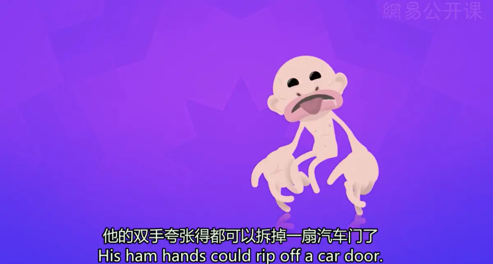
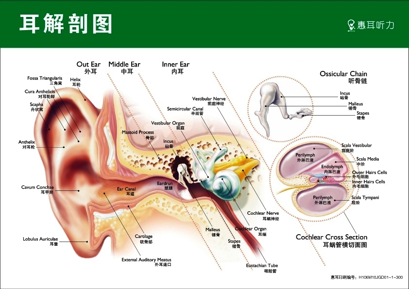
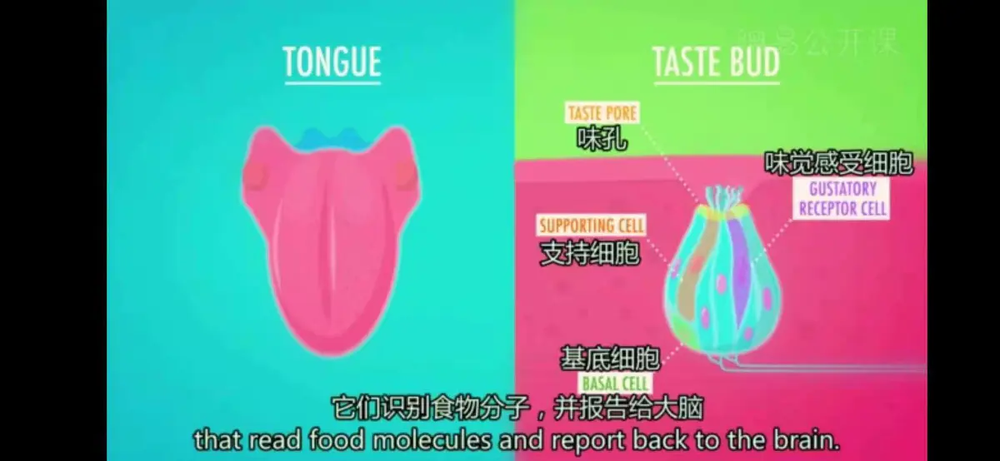
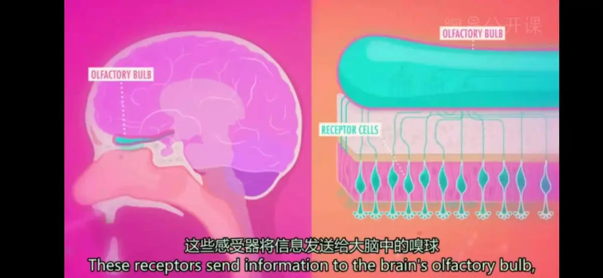
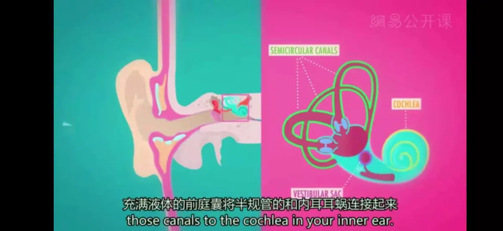

# 其他感觉
心理学中的“**小矮人**(Homunculus)”：如果身体部位的大小和我们使用它们的程度按比例生长

---
**声音**
* **定义**：声音是一种波；可以被人耳识别的声（**频率**在20 Hz~20000 Hz之间）称之为声音
* **传播**：以波（Waves）的形式震动，在介质中传播
* **音高**（Pitch）：声音的高低，由声音的**频率**决定；短波（小提琴）拥有高频率和高音调，长波（大提琴）拥有低频率和低音调，钢琴覆盖30Hz--4000Hz的频率范围
  * **频率与音高并非线性关系**，频率低时增加一点音高便显著提高；频率高时增加许多才能感觉到音高差异 
* **响度**（Loudness）：波的高度，也就是**振幅**，用**分贝**（Decibels）来测量
* **音色**（Timbre）：又称音品，波形决定了声音的音色；声音因物体材料的特性而不同，本身是一种抽象的东西，但波形是把这个抽象直观的表现，波形不同，音色则不同
  * 现实中大部分声音并非纯音而是**复杂声波**；**噪音**无清晰简单的频率结构，包含相互间没有系统关系的多种频率
* **立体声**（Directional Stereophonic hearing）：即**3D听觉**，有**定向性**，人们可以凭听觉感知各个声源在空间的**位置分布状况**；**自然界**发出的声音是立体声，但如果经记录、放大等处理后而重放时，所有的声音都从**一个扬声器**放出来，这种重放声（与原声源相比）就不是立体的了；**立体声技术**改变了这一状况，声音在录制过程中被分配到**两个独立的声道**，从而达到了很好的**声音定位效果**
* **声道** ( Sound Channel ) ：声音在录制或播放时在**不同空间位置**采集或回放的相互独立的音频信号，所以声道数也就是声音录制时的**音源数量**或回放时相应的**扬声器数量**
* **左声道**：即电子设备中模拟人类**左耳的听觉范围**产生的声音输出，与**右声道**相对；电子设备声音输出的立体声中左声道和右声道能够分别播出**相同或不同的声音**，产生从左到右或从右到左等的立体声音变化效果
* **毕达哥拉斯发现**：当两个物体碰撞后振动产生声音时，若两者振动频率比为**不可化简的复杂比**，如：201：388，那么我们分辨出来会觉得这个声音**刺耳**；相反，若两者振动频率比为**可化简的简单比**，如：3：7，那么我们分辨出来会觉得很**动听**
* **声音定位**（sound localization）：确定听觉事件的空间来源
  * **相对时间**：神经元比较进入每一只耳朵的声音的时间差，产生特异性放电
  * **相对强度**：对声音首先到达的耳朵，强度会略微高一些，因为头部本身形成了一个**声影**（sound shadow），使信号变弱；这种强度差取决于音调波长以头部为对照的相对大小，高频声音较明显
  * 若均无，则不得不**转动头部改变耳朵位置**，以产生时间差异或强度差异，从而确定听觉事件的空间来源
  * 海豚与蝙蝠采用**回音定位法**，发出音高很高的声波，从物体的反射中获取关于物体的距离、大小、结构和运动的信息
---
**听觉** ( Hearing )

* **四个基本能量转换**
  * **声波**在耳蜗中转化为流动波
  * **流动波**导致基底膜机械振动
  * **振动**转化为电脉冲
  * **电脉冲**传入听皮层
1. **外耳** ( Outer ear ) 收集声波，并通过耳道传到**中耳** ( Middle ear )
   * **外耳**包括**耳廓**和**耳道**，耳廓在**声源定位中**起着重要的作用；此外，其像喇叭一样的形状提供了从头部周围“无限”空间的**平滑过渡**，将声音传送到**狭窄的耳道**
   * 外耳对1到5 kHz之间的频率**特别敏感**，这个范围对通信也非常重要，我们听力最敏感的频率就是**3 kHz左右**；声学上，外耳像**管式谐振器**一样工作，在3kHz左右具有**最强的第一谐振**，声音在空气中波长的四分之一（10cm/4 = 2.5cm）**与耳道的长度相符**，相比之下，在波长大于耳朵大小的较低频率处，**灵敏度显著下降**
2. **鼓膜**（Ear Drum）产生振动，通过**听小骨**（Ossicle bones）得到放大；
   * **中耳**位于外耳和内耳之间，是一个**含气的小腔隙**，目的有两个，**听小骨放大信号**以及**平衡整个鼓膜的压力**
   * **听小骨放大原因**：由于内耳**充满流体**，使得鼓膜的**直接激发效率低下**，因此需要这种类似齿轮箱的机制进行放大
   * 在正常状态下，听小骨具有放大作用，可有效地激发内耳中的流体；然而，**中耳的肌肉**可以改变这种情况，达到削弱振动的效果，从而在声压过高的情况下提供一种**保护机制**；但是，这种调整**过于缓慢**，无法防止冲击事件，如爆炸事件
   * **听小骨**：**镫骨**（Stirrup）、**锤骨**（hammer）、**砧骨**（anvil）
   * 健康的**鼓膜**是完全密闭的，可**防止气流**从外耳进入中耳
   * **外耳中的大气（静态）压力**与**中耳内的压力**不同时可能会出现问题，在飞机起降时很容易经历到，外耳中的压力随着飞机内的环境压力变化，而鼓膜内的压力保持不变；**恒定的压差**对膜片施加**预张力**，将其推入或推出，这会产生**不愉快**的感觉，并导致听到的声音比较**沉闷**
   * **咽鼓管**将中耳连接到咽喉，有助于平衡这种压力；当我们吞咽时，咽鼓管短暂地打开，导致鼓膜内的静压力与外耳的静压力**相等**，将鼓膜**恢复到中间位置**，鼓膜将达到其正常的灵敏度，听到的声音会再次变得清脆
3. 听小骨的物理振动传到**内耳** ( Inner ear ) ，进入形状像蜗牛壳的**耳蜗**（Cochlea）
   * **内耳**是整个链条中**最复杂的元素**；它是一个充满液体的腔隙，由两部分组成：**前庭迷路**，是人体**平衡机制**的一部分；**耳蜗**，包含**基底膜**（basilar membrane）和**柯蒂氏器**，这是一种将声音转换为神经脉冲以便我们的大脑可以处理这些信息的敏感元件
   * **基底膜**位于耳蜗中央并贯穿始终；当镫骨使位于耳蜗底部的卵圆窗发生振动时，耳蜗中的液体使基底膜**以波浪的形式运动**（因此称为“海浪波”），造成耳蜗中一万六千多个细小的**毛细胞**，即听觉系统的**感受细胞**产生弯曲；毛细胞刺激神经末梢，**将基底膜的物理振动转换为神经活动**
   * **柯蒂氏器**将声音分解为**各频率成分**，类似于雨滴将日光分解为不同的颜色
   * 耳蜗的**特殊螺旋结构**增强人们对**低频率声音**的敏感性，如果没有这种结构，人们将不会听到低频率声音
4. 毛细胞的运动触发相邻的**神经细胞**兴奋，从而使物理能量转化为电冲动，集中于**听觉神经**（auditory nerve），然后传向大脑颞叶的**听觉皮层**
   * 神经纤维与脑干的**耳蜗核**会合；就像视觉系统的神经交叉一般，**来自一只耳朵的刺激传递到两侧的大脑**
   * 听觉信号在到达听觉皮层前要经过一系列的**神经核团**
* **音高知觉理论**
  * **地点说**（place theory）：认为音高的知觉取决于**基底膜上发生最大刺激的特定位置**；不同频率在基底膜的不同位置上产生它们最大的运动，**高频率的最大运动在耳蜗基部**，低频率则在相反的一端
  * **频率说**（frequency theory）：认为音高的知觉取决于**基底膜振动的频率**；一个100Hz的声音将是基底膜产生每秒100次的振动，引起同样频率的神经放电，**神经放电的频率就是音高的神经编码**
    * 没有神经元的放电频率超过每秒一千次；可通过**齐射原理**（volley principle）解决，即一些神经元可以通过联合的活动形式（或称齐射）刺激高频率时放电  
  * 频率说可很好解释**低于5000Hz**的声音编码，更高即使通过齐射也不可能；地点说可很好解释**高于1000Hz**的声音编码，更低会引起基底膜广泛振动，不能为神经感受器提供区分不同音高的信息
---
**味觉** ( Gustation )

* **过程**：舌头表面布满**乳头**，使得崎岖不平，大部分乳头中含有成束的味觉感受细胞，称为**味蕾**(Taste bud)；舌头中约有8万个味蕾，每一个都包含许多像口袋一样的小孔，其中又包含50到100多个毛发一样的**味觉感受细胞**(Gustatory Receptor cell)，识别食物分子并报告给大脑
* **味蕾**：**味觉感受器**，主要位于舌上；每个味蕾都是由一组味觉细胞组成的**梨形结构**，属于**化学感受器**；顶端有一小孔，开口于上皮表面，称**味孔**，当**溶解的食物**进入小孔时，味觉细胞**受刺激而兴奋**，经**味觉神经**传入大脑而产生味觉
   *  **味觉感受细胞**：为**梭形**的**感受上皮细胞**，核为椭圆形，顶部有毛，每个味蕾中有**味细胞4-20个**，**味觉神经末梢**即分布于味细胞的底部
   *  **支持细胞**(Supporting cell)：居味细胞之间，比味细胞**大**
   *  **基底细胞**(Basal cell)：**锥形**，位于味蕾的基部
* **五种味道**（对应**五种味觉感受细胞**）：**甜**（sweet）、**咸**（salty）、**酸**（sour）、**苦**（bitter）、**鲜**（umami）
  * 鲜味也就是**味精**（谷氨酸钠，MSG）的味道，经常出现在亚洲的食物中，在富含蛋白质的食物中广泛存在
  * 感受细胞也**对其他味道产生微小反应**，但最佳反应仍然是直接对应于特定味道的
* 味觉可以通过3种不同的**头部神经**到达大脑：舌头前三分之二的**面神经**、舌头后三分之一的**舌咽神经**以及会厌中局部区域中的**迷走神经**
* 所有的这些味觉在**整个口腔中产生**，而不是像通常大家所误解的那样，存在一个在舌头不同区域对不同味道敏感度不同的味觉图
* **嗅觉与味觉**常常同时起作用，例如感冒时鼻道被堵塞，食物也索然无味；遭受嗅觉障碍的人往往会失去食欲
* 味觉感受器**每几天就会更新一次**，甚至比嗅觉感受器的更新速度还要快；在所有感觉系统中味觉系统**最能抵抗损坏**，很少有完全而永久的味觉丧失
* 舌头其实可以获得**有关食物的其它感觉**，如油腻、钙、涩、金属味、麻等
* **超级品尝家**：那些拥有比寻常人**更敏感味觉**的人，通常更容易在**女性**中产生超级品尝家（女性负责抚育喂养下一代，味觉敏感性高的女性后代容易生存），此外**亚洲人、非洲人和南美人**也更容易出产超级品尝家；对于这种对味道感觉被拔高现象的原因仍然是未知的，虽然可能的原因是这些人**味蕾上的菌状乳头**数目更多一些，或者至少是原因之一
* 味蕾与**痛觉纤维**相连，**辣椒素**会刺激痛觉纤维；**超级品尝家**对化学物质刺激更为敏感，因而无法吃辣
* **后味** ( aftertaste ) ：指食物吞咽之后口腔中残存的味道；后味有可能跟着之后入口的食物而改变
* **味觉疲劳**：当长时间感受某一种味觉化合物的刺激后，再品尝同一味觉的化合物，就会感到**味觉强度下降**，通常与心理有关
* **混合味道**：咸、甜、鲜和酸通常是被认为**能引起食欲的**，苦则通常被认为是**倒胃口的**；将这两种不同类型的味道混合在一起，则可能会向大脑发出**混乱的信号**，其结果是一种**混乱的感觉**，通常**呕吐**是第一个反应，因为不好的信号对于保命来说更重要；不过，成人通常会**适应**某些食物的混合味道
---
**嗅觉** ( Olfaction ) 

* 由两感觉系统参与，即**嗅神经系统**和**鼻三叉神经系统**
* **过程**
  * 空气中的分子进入鼻孔，到达鼻腔的顶部，这里有五百万到一千万个**感受器细胞（嗅觉上皮细胞）**（Receptor cells）以及支持功能的**皮膜细胞**；只需8个气体分子就可以诱发一个神经冲动，但至少要刺激40个神经末梢才能闻到物质的气味
  * **嗅觉神经**将感受器激活成电子信号，信号从而在嗅觉神经上转导，嗅觉神经一直延伸到大脑额叶下方的**嗅球**（Olfactory bulb），然后将信息打包传送至**初级嗅觉皮层**（Primary Smell Cortex），以及负责情绪和记忆的**边缘系统**中的一些部位
* 嗅神经和嗅球的位置让它们**很容易受到损伤**，当人们头部受到打击时，向嗅球传递冲动的**神经细胞轴突**会受损，嗅觉可能**减退或消失**；但仍有**复原可能**，因为嗅觉系统能在嗅觉感受器和嗅球产生新的细胞
* 不同于视觉和听觉，味觉和嗅觉是**化学性的感觉**（Chemical Senses）
* 嗅觉和味觉会**整合和互相作用**，嗅觉是一种**远感**，即是说它是通过长距离感受化学刺激的感觉，相比之下，味觉是一种**近感**；且就感知能力上远比味觉**复杂**，人可以辨识约**一万种以上的不同气味**，这些是由7个最基本的味道感知分子所产生的
* 嗅觉并没有针对特定气味分化的感受细胞，**气味感受器**（Odour Receptors）是通过不同的组合来一起作用的，并不是像大多数感受器结合特定的配体；兴奋的嗅觉感受细胞的不同组合可以分辨出一万种不同的气味
* 嗅觉的**刺激物**必须是**气体物质**，只有**挥发性有味物质**的分子，才能成为嗅觉细胞的刺激物
* **嗅觉阈**：能够引起嗅觉的有气味物质的**最小浓度**
* **嗅觉与情感**的强大联系在一定程度上与我们**感觉通路和大脑边缘系统**的联系有关，包括我们的情绪登记所，**杏仁核**（Amygdals），以及我们的记忆管理员，**海马**（Hippocampus），这就是气味和我们的情感、记忆的联系如此紧密的原因
* 嗅觉的重要性**在不同物种间有很大区别**，人们推测它是为了**发现和定位食物**而进化出的一个系统；人类主要通过嗅觉与味觉结合以寻找食物，对许多物种而言嗅觉也用来**探测潜在危险源**
* 气味也是一种**有效的交流方式**，某些物种的成员可通过**信息素** ( pheromones ) 相互联络
---
**皮肤感觉/肤觉**（cutaneous sense）
*  **本质**：皮肤上不同感觉的结合，即**触压觉（触觉、压觉）**（Pressure）、**温觉**（Warmth）、**冷觉**（Cold）和**痛觉**（Pain）、**振动觉**（Vibration）
* **触觉**
  * 刺激作用于皮肤，**未引起皮肤变形**时产生的是**触觉**，**引起皮肤变形**时便产生**压觉**；触觉、压觉都是**被动的触觉**，触觉和振动觉结合产生的**触摸觉**则是**主动的触觉**
  * 皮肤深层存在**触觉小体**，椎体里存在**敏感的神经细胞**，当神经细胞感受到触摸带来的压迫，就会马上发出一个**微小的电流信号**，电流信号就会随神经纤维**到达大脑**，这样就能感受到这次触摸，大脑可以马上分辨出触摸的程度以及信号的位置
  * 皮肤表面散布着**触点**，触点的**大小不尽相同**，**分布不规则**，一般情况下**指腹**最多，其次是头部，背部和小腿最少，所以指腹的触觉最灵敏，而小腿和背部的触觉则比较迟钝（指尖是后背的10倍）
  * 触觉相当重要，特别是在**婴儿早期发育**的时候; 儿童如果在婴幼儿时期身体没有得到足够关注，长大后会有更大的几率出现情绪、行为和社会方面的问题
  * 那些**引起性冲动感觉**的皮肤区域被称为**性感区**，不同人对性感区的唤起潜力不同
  * **两点阈**：表示**触觉灵敏度**的指标，在**排除视觉**的条件下，用两个钝针头刺激皮肤相邻的两个点，能够觉察出是两个点时的**最小距离**就是两点阈；身体不同部位皮肤的两点阈是不同的
* **痛觉**
  * 痛觉是机体受到伤害性刺激时，产生的一种不愉快的感觉，痛觉感受器是游离的神经末梢，其本质是**化学感受器**
  * 痛觉感受器中，部分只对某种刺激（如温度、化学物质）起反应，另一些则对痛觉刺激的组合起反应
  * 痛觉纤维的网络**覆盖全身**；外周神经系统通过两条路径将痛觉信号传至中枢神经系统，一是神经纤维外部包裹髓磷脂的**快速传递路径**，二是神经纤维外部未包裹髓磷脂的**缓慢传递路径**
  * **内啡肽**（内源性吗啡）会影响痛觉体验，是针灸与安慰剂产生镇痛效应的一部分原因
  * 疼痛是一种**警戒信号**，表示机体已经发生组织损伤或即将遭受损伤，通过神经系统的调节，引起一系列防御反应，保护机体避免伤害
  * **门控理论**（gate-control theory）：罗纳德•梅尔扎克提出，认为脊髓中的细胞像神经闸门一样切断与阻止一些痛觉信号进入大脑，而允许其他信号进入
  * **神经矩阵论**：罗纳德•梅尔扎克提出，认为部分疼痛没有物理起因，完全源自大脑
* **冷/温觉**
  * **生理零度**：**皮肤表面的温度**叫生理零度，和生理零度相同的温度刺激皮肤，**不会引起**热和冷的感觉；身体各部分皮肤的生理零度是不同的
* 不同的部位对于这几种感觉的**敏感程度**有所不同；皮肤的感觉，比如痒、瘙痒和湿度的体验，是这**几种感觉的不同变化**
---
**其他**
* **动觉**（运动感觉/肌觉）(Kinesthesis)
  * **过程**：触觉加入到骨头，关节和肌腱的感受器中，组成了动觉，即**本体感觉**
  * **作用**：感知**身体各部位的位置和运动状况**，不用依赖其他感觉（如眼闭耳塞一样可以跳舞、游泳、转呼啦圈）
  * 动觉在各种感觉的**相互协调**中起着重要的作用，如果没有动觉和其他感觉的结合，人的**知觉能力**就不能得到正常的发展
* **平衡觉**（前庭觉/静觉）(Vestibular sense)

  * **过程**：平衡感受到麻花状的**半规管**的控制；充满液体的**前庭囊**将半规管和内耳**耳蜗**连接起来（如果原地转圈圈突然停住，由于内耳中的液体需要花一些时间才能恢复平静，会感到一阵眩晕，因为液体会使大脑认为我们还在转动）
  * 前庭器官位于人的内耳,包括**椭圆囊**、**球囊**和3个**半规管**，半规管位于3个**相互垂直的平面**上，是反应身体（或头部）**旋转运动**的感受器；半规管的感受器是按照惰性规律发生作用的，在**加速旋转运动**时，半规管内的液体（内淋巴）推动**感觉纤毛**，使其产生兴奋，**等速运动**并不引起兴奋
  * 椭圆囊、球囊反映**在直线上加速或减速**信息，半规管反映**头部的运动**；平衡觉反映的是**人体的姿势和地心引力的关系**，凭着平衡觉，人们就能分辨自己是直立，还是平卧，是在做加速、减速，还是在做直线、曲线运动
  * 前庭感觉也与**视觉**有联系；当前庭器官受刺激时，可能会使人看见物体发生位移的现象 
  * 当**视觉系统与前庭系统信息冲突**时，就会发生**晕动现象**，产生恶心、呕吐等现象；如在车上看书时等，视觉静止而前庭觉移动，司机则很少发生
* **内脏感觉**（机体觉）（visceral sense）
  * 包括饥饿、饱胀和渴的感觉，窒息的感觉，疲劳的感觉，便意、性以及痛的感觉等
  * 内脏感受器的传入冲动一般不产生意识感觉，但传入冲动比较**强烈**（机械性牵拉、痉挛、缺血和炎症）时也可引起意识感觉；但是，内脏传入冲动引起的意识感觉是比较**模糊**的、弥散而不易精确定位的
---
**感觉间的关系**
* **感觉的相互作用**（Sensory Interaction）：一种感觉能影响另一种感觉
* **通感**（联觉）(Synesthesia)：
  * **定义**：一种罕见的神经系统疾病，**两种或两种以上的感觉相互交错在一起**，这种感觉的混合是不由自主的，体验的过程是持续的，方式也是一致的，且**不受思想的控制**（即感觉的相互作用发生混乱）
  * **可能解释**：
      1. 新的神经之间形成的联系，可能跨越了通常单独发展的感觉的界限
      2. 所有的婴儿出生时都具有通感，体验着混合的感觉，直到大脑发育成熟，建立起单独的感觉通道，而有的人没有，故长大之后依旧具有通感
      3. 和神经化学的不稳定性存在联系，如与某一种功能相联系的神经递质出现在完全不同的大脑的另一个部位
---
[Crash Course](https://www.bilibili.com/video/BV1Ax411N75Q?p=7)