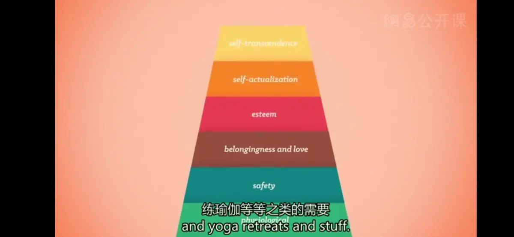
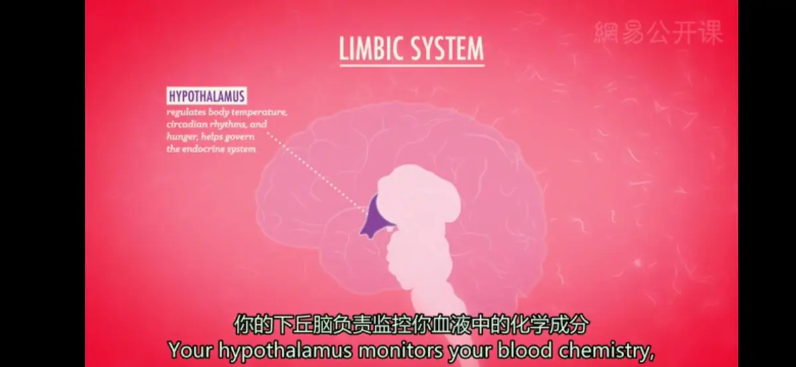

# 动机
**动机**（Motivation）
  * **定义**：做某件事的需要和愿望，驱使行动的内部力量
  * **理论**
    * **一个进化的观点**（An Evolutionary Perspective）：认为人类所有的行为都是出于**本能**（Instinct），天性驱动着我们做出某些行为
      * 早期的人类机能学说过高的估计了本能对人类的重要性，如威廉•詹姆士认为人类比动物更多依赖于本能行为，但跨文化人类学家发现许多不同文化间的行为差异
      * 但这个所谓的“本能论”受到了一定的曲解，部分原因是，人们表现出具有某种行为的倾向，并不是总是意味着人们一定具有这种行为的本能
      * 进化是一个远远比这更复杂、更混乱、也更有趣的过程，许多行为可能仅仅是进化过程中的意外；已故的古生物学家史蒂芬·杰伊·古尔德把这些意外称作 **“拱肩”**（Spandrels），这些特质与其说是为了适应环境，不如说是在进化的其他过程中保留下来的副产品
      * 如今，我们把**本能**定义为复杂的、无需学习的一个物种共同具有的固定的行为模式（如人类宝宝在出生后的几分钟内就知道如何吮吸）；尽管人的有些行为倾向可能是天生的，但**个体的经验**（Individual Experience）在人的行为和动机中也同样扮演着重要的角色
    * **驱力减少理论**（Drive-reduction Theory）：**克拉克•霍尔**提出，人们的生理需要或生理**驱动力**（drive），是为了驱使我们来降低这种需要带来的紧张感；减少本能产生的驱动力目的是为了维持机体内的**动态平衡**（Homeostasis），使生理状态保持稳定    
      * 然而，我们的动机，很明显远比维持机体平衡要复杂，而驱力减少理论可能夸大了我们的很多行为（例如人为追求而废寝忘食的行为）
      * 正如驱力会推动我们消除不平衡带来的需求，我们还会受到**诱因**（Incentives）的驱动，也就是吸引我们或使我们感到厌恶的、积极或消极的刺激，与生理需要并无直接关系（闻到卷饼的香味时，我的嘴开始流口水，推动着我吃卷饼，就像我的饥饿感推动我寻找食物那样）
    * **最佳唤醒理论**（Optimal Arousal Theory）：我们的行为并不是为了减少驱力带来的紧张感，如饥饿；我们会产生动机，是为了要维持刺激与放松之间的平衡，避开无聊乏味和压力
      * 每个人都有一个最适合的唤醒水平，即除了性之外的情况下，一种既不过度兴奋，也不会压力很大的状态
    * **期望与认知理论**：人们的思想过程在决定其目的以及实现该目的的行为上非常重要
      * 重要的人类动机不是来自于外部世界的客观实体，而是来自于对这些实体的主观解释；现在的行为常常被你认为造成过去成功或失败的因素以及对行为结果的预期所控制
      * **朱丽安•罗特**的**社会学习理论**（social-learning theory）提出，个体从事某一行为的可能性是由其达到目标的期望及该目标的个人价值所决定；期望以及现实间的差距能够驱使个体做出正确的行为
      * **弗利茨•海德**认为，行为的结果可归因于内在特质或情境因素，这些因素影响着个体的行为方式；把动机来源看作是内部的还是外部的，在一定程度上依赖于对客观实体的主观认识
    * **需要层次理论**（Maslow's hierarchy of needs）：美国心理学家**亚伯拉罕·马斯洛**在20世纪中期创立，认为需要有轻重缓急，并且画成了金字塔
      * 最基础的生理需要——安全的需要——爱与归属的需要——尊重的需要——自我实现的需要——心灵成长的需要等
      * 需要层次理论并没有得到实证研究的支持，我们的需要经常也会跳过金字塔的某一层，而那些更高层次的需要的重要性也会根据我们的文化、经济水平以及人格而有所不同；但是，每个人都会有金字塔上所列的低层次的需求

---
**饮食**：除了空气和水，食物是我们机体最重要的需要，所以，获取食物是我们最大的驱动力之一
* **饮食生理学**
  * **外周反应**
    * 心理学先驱**沃尔特•坎农**认为，**空腹的胃部活动**是饥饿的唯一基础，认为**胃部痉挛收缩**就是饥饿产生的原因；但后来证明胃部收缩并不是饥饿的必要条件，例如把糖注射到血液里能阻止胃的收缩，但不能消除饥饿感
    * 由食物引起的胃部扩张将提示人停止进食；口腔也会产生**特定感觉饱食感**，对特定味道的食欲状态迅速消除，但与食物本身无关，所以食物味道的变化可能会抵消这种指示已经吃饱的信号
  * **中枢反应**
    * 早期脑部对进食的控制理论是建立在对**外侧下丘脑**（LH）和**腹内侧下丘脑**（VMH）观察的事实上；**双中心模型**认为LH是“饥饿中枢”，VMH是“饱食中枢”
    * 研究发现，VMH的信号还依赖于食物类型，VMH被损毁可能会部分夸大对食物的**反射性反应**，使只多吃认为可口的食物，而尽量不碰那些不愿吃的食物，下丘脑的另两个脑区，即众所周知的**弓状核**（ARC）和**室旁核**（PVN）对调节进食起补充作用
    * 饥饿感通常是由于体内血糖浓度降低而引起，**葡萄糖**（Glucose）是我们机体内的主要能源，下丘脑负责监控血液中的化学成分，侦测高浓度的 **“胃饥饿素”**（Ghrelin）以及低浓度的葡萄糖，从而触发你的饥饿感，提醒你去吃点东西
    
    * 从生理角度上，大多数的人类以及许多其他动物，都对**甜食和高脂肪的食物**有天生的喜爱，因为这些食物通常都有很高的能量，但其他的食物偏好则受到经验和文化的条件作用；尽管如此，饥饿感对我们的影响却都是相同的
* **饮食心理学**
  * **文化影响饮食**
    * 文化的影响有时能胜过身体信号，例如一个严守清规的犹太人会拒绝一顿免费的龙虾大餐
  * **肥胖与节食**
    * **身体质量指数**（body mass index，BMI）：将个体用以千克为单位的重量除以以米为单位的身高的平方；在大多数例子中，BMI在25——29.9之间的个体被认为超重，30及以上的个体被认为肥胖
    * 每个人生来就有体重或轻或重的内在倾向性，例如在BMI中同卵双生子的相关均高于异卵双生子；研究者发现了一种影响释放**瘦蛋白**激素的基因，如果瘦蛋白水平低于大麻素，个体就可以继续进食
    * 除生物倾向外，真正起作用的是个体对食物和进食行为的看法；珍妮特•波立维和彼得•赫尔曼提出，构成饮食行为心理基础的关键维度是**限制性饮食**和**非限制性饮食**，前者总是对要吃的食物量加以限制，为食物而焦虑，但当他们解除限制时就会暴饮暴食高热量的食品，对严格节食的预期本身就是一种压力
  * 饥饿对心理的影响效果是毁灭性的；安塞·季斯所做的**明尼苏达饥饿实验**揭示了饥饿在人们生活中产生的微妙的作用和巨大的影响，实验中饥饿的人对食物的痴迷达到了病态的地步，他们做梦梦到食物，无时无刻不在谈论食物，研究菜谱，他们丧失了对性、笑话和社会活动的兴趣，变得急躁、焦虑和抑郁 
 * **性**（Sex）：我们为了促进自身的物种生存而进行的娱乐和/或繁殖行为，这两种行为都促进了人类社会的羁绊和群体的扩大；我们在生理上受到**性激素**（Sex Hormones）的驱使，还同样受到心理和社会文化影响的驱动，从外部的各种刺激的暗示，到那些更加文明的渴望，比如爱、家庭，或是坚持个性，宗教信仰以及文化价值
    * 性是非常大的驱动力，但它并不是一种需要，人没有性并不会死
  * **归属**（Need to Belong）：分享资源，共同承担责任，在群体中彼此保护，相互支持
    * 我们的社会需要，必须要和我们的人身自由、我们的自我控制相平衡，这样我们才能既感到受关怀，又能独立
    * 世界上的所有文化都把流放（Ostracism）或社会排斥（Social Exclusion）作为一种惩罚；被人忽视、被人排斥的感觉，没有什么比这更糟糕了
* **个人成就动机**
  * **成就需要**（need for achievement）：反映了在实现个体目标的计划和工作重要性方面的个体差异
    * **主题统觉测验**（Thematic Apperception Test，TAT）：要求实验者就一系列模棱两可的画面编故事，把自己的价值观、兴趣和动机都投射到这些情境
    * 高成就需要者似乎是效率的需要——一种用较少的努力得到相同结果的需要；当面临棘手的任务时，他们往往很快放弃
    * 当孩子的父母用严格的规则来喂养、照料和训练他们时，参与者会体验到高度的成就压力
  * **成功与失败的归因**：**归因**（attribution）就是关于某一结果产生原因的判断；归因能对动机产生重要影响
    * **归因的三个维度**
      * **内-外部**：原因来源是自我还是环境
      * **稳定-不稳定**：偶然性因素是否会随时间发生变化
      * **整体-部分**：偶然性因素是在特定场景还是广泛存在
    * **归因风格**（attributional styles）：个体解释生活事件的方式可能会成为终生的习惯
    * **悲观的归因方式**：失败：内因-稳定-整体 成功：外因-不稳定-局部
    * **乐观的归因方式**：相反
  * **工作和组织心理学**（Industrial and organizational psychology）：该学科是与工作有关的人类行为科学，将心理学理论和原则应用于组织和个人的工作场所以及个人的工作生活
    * **公平理论**（equity theory）：假定工人被激励去维持与其他相关人员之间公平公正的关系
      * 工人关注他们的投入及产出，并将比例与其他工人进行比较，如果不相等就会感到失望，通过改变投入产出比达到平衡，可以是行为上的（偷懒）或心理上的（重新衡量投入或产出的价值）
    * **期望理论**（expectancy theory）：假定当工人期待他们的努力和成就会产生理想的结果时，他们就会受到激励
      * **期望**：一种感觉上的可能性，即努力会产生好业绩
      * **有效性**：希望好业绩能获得好结果如回报
      * **效价**：对特定结果在感觉上的吸引力
      * 三种成分相乘
---
[Crash Course](https://www.bilibili.com/video/BV1Zs411c7W6?p=18)

