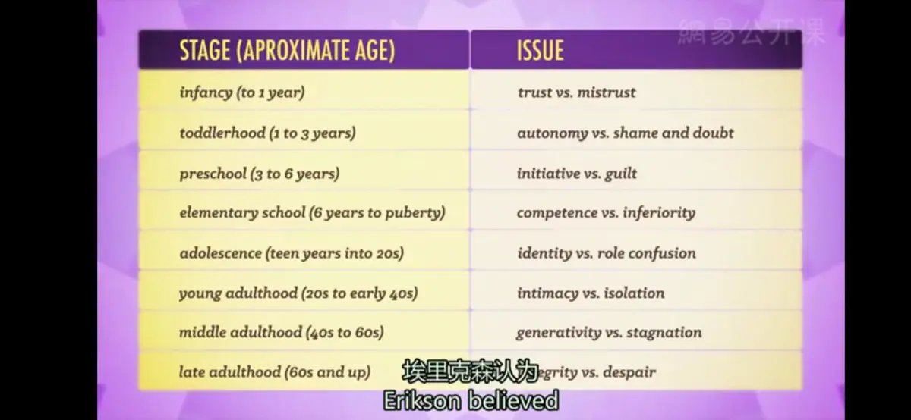

# 毕生的社会性发展
* **《早餐俱乐部》**：一部典型的80年代的电影，描写了一群青少年因为违反校规，被处罚周六的早上去学校反省；影片中有小混混、运动员、书呆子、公主和那个所谓的“神经病”，在最开始，他们对彼此都充满冷漠和敌意，但随着时间慢慢过去，他们开始敞开心扉，分享彼此的故事，一起跳滑稽的舞蹈，度过了一段愉快的时光
* **社会性发展**（social development）：个体的社会交往和社会期望在个体的一生中如何变化

* **埃里克·埃里克森的心理社会发展8阶段理论**
  * **童年阶段**
    1. **婴儿期**（0～1.5岁）：基本信任和不信任的心理冲突（trust VS mistrust）
       * 此时是基本信任和不信任的心理冲突期，因为这期间孩子开始认识人了，当孩子哭或饿时，父母是否出现则是建立信任感的重要问题
    2. **儿童期**（1.5～3岁）：自主与害羞（或怀疑）的冲突（autonomy VS shame/doubt）
       * 孩子学会了怎样坚持或放弃，也就是说儿童开始“有意志”地决定做什么或不做什么；这时候父母与子女的冲突很激烈，也就是第一个反抗期的出现，如果父母过分约束则会使儿童出现自我怀疑
    3. **学龄初期**（3～6岁）：主动对内疚的冲突（initiative VS guilt）
       * 在这一时期如果幼儿表现出的主动探究行为受到鼓励，幼儿就会形成主动性；如果成人讥笑幼儿的独创行为和想象力，那么幼儿就会逐渐失去自信心，缺乏自己开创幸福生活的主动性
    4. **学龄期**（6～12岁）: 勤奋对自卑的冲突（competence VS inferiority）
       * 这一阶段的儿童都应在学校接受教育；如果他们能顺利地完成学习课程和社交技能，他们就会获得勤奋感，这使他们在今后的独立生活和承担工作任务中充满信心，反之就会产生自卑
  * **青春期阶段**
    1. **青春期**（12～18岁）：自我同一性和角色混乱的冲突
       * “同一性与角色混乱”的危机（The Crisis between Identity and Role Confusion），即他们刚刚形成的自我概念与其他人所期望他们所扮演的自我之间发生了冲突，于是产生了角色混乱
       * 青少年时期标志着大量的生理变化：身体的长高长大，大脑能力的增长，性激素的分泌，同时，青少年的独立意识开始萌发，但同时，他们又非常需要归属感
  * **成年阶段**
    1. ~~**始成年期**（Emerging Adulthood）（18岁左右）：青少年到成人的过渡~~
    2. **成年早期**（18～40岁）：亲密对孤独的冲突（Intimacy VS Isolation）
       * 在人生的这个阶段，大多数的我们都已经开始对亲密关系的探索，一段良好的关系会带来安全感，使人享受关爱和承诺的幸福；相反，缺乏良好的亲密关系会导致空虚寂寞冷，甚至是抑郁
    3. **成年期**（40～65岁）：繁衍对停滞的冲突（Generativity VS Stagnation）
       * 许多人都已经有工作、事业或是家庭，我们对于整个人生的意义都有了更深的理解，并通过各种生产劳动行为来奉献社会，缺少这些活动所产生的空虚和迷茫会使这个阶段的人感到生活停滞不前，没有意义，即“中年危机”
    4.  **成熟期**（65岁以上）：自我调整与绝望期的冲突（intergrity VS despair）
        * 老人们回顾过去时，可能怀着充实的感情与世告别，也可能怀着绝望走向死亡。自我调整是一种接受自我、承认现实的感受；一种超脱的智慧之感。如果一个人的自我调整大于绝望，他将获得智慧的品质
---
**青少年期的社会性发展**
* **青少年期的经验**
  * 传统上人们习惯把青少年期看作独一无二的骚动阶段，处于这一阶段的个体有极其不稳定的情绪、不可预测和困难的行为，即 **“风暴与压力”**（storm and stress），由**歌德**在“狂飙突进运动”中提出
  * **斯坦利•霍尔**大力宣传了这一观点，他是现代史上第一位对青少年期发展颇有研究的心理学家；这也影响弗洛伊德和精神分析学家，有些人甚至认为动荡是青少年期正常的一部分，例如**安娜•弗洛伊德**“青少年期的正常是通过不正常来表现的”
  * 文化心理学的两位先锋**玛格丽特•米德**和**露丝•本尼迪克特**认为，风暴和压力理论并不适用于很多非西方文化
  * 在大多数类似于美国的文化中，儿童在青少年期需要发现自己正确的同一性，因此需要试图从父母那里获得独立
  * 尽管如此，青少年与父母的冲突通常不会导致消极后果
* **同伴关系**
  * **友谊**：可以给青少年帮助和支持的一对一的形式
  * **朋党**：经常由6-12人组成的团体，在年龄或种族等维度上加以聚合
  * **团伙**：大的群体，较为松散
  * 同伴关系为个体提供了一种学习在社会环境扮演各种角色的机会，但也会促使个体从事危险行为
---
**成年期的社会性发展**
* **亲密感**（intimacy）：一种对他人做出性、情感、道德郑重承诺的能力，可能出现在朋友关系和恋爱关系中；要求坦诚、勇气、道德感，并且往往要牺牲一些个人偏好
  * 成年初期是大多数人开始步入婚姻关系或其他稳定关系的时期，很多未婚者也有同居伴侣
  * 同性恋与异性恋夫妻在维持长久关系时所使用的策略有很多共同点，但异性恋夫妻获得的社会支持更多
  * 现代西方社会较过去，婚姻关系中的平等观念更常见；但孩子的出生可能促使在性别定向上更加传统，使婚姻关系变得消极
  * 对大多数异性恋的夫妻，婚姻满意度持续下降原因是父母与青春期孩子的冲突；当孩子不与父母住在一起时，父母会更喜爱他们
  * 婚姻关系的表象（如夫妻间公开的冲突）并不总是能够预测离婚；当人们面临其他诱惑时，即使中等幸福水平的婚姻关系也可能结束
* **繁殖**（generativity）
  * **前提条件**：发展最好的男人的其他生活方面也十分稳定，可以将资源转向外面或下一代
  * **本质**：渴望成为一名关心他人、富有同情心并拥有良好社会关系的人

---
[Crash Course](https://www.bilibili.com/video/BV1Zs411c7W6?p=21)
