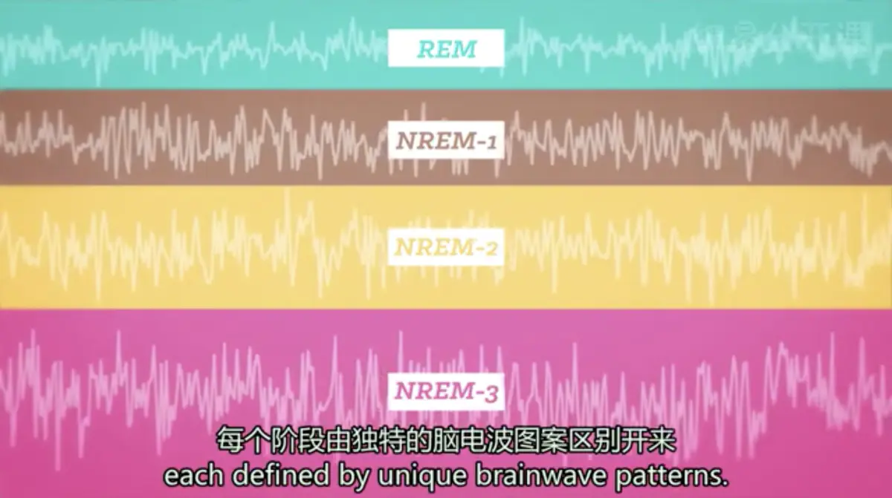

# 睡眠
* **睡眠**：另一种意识状态；从技术层面讲，睡眠是一种周期性的（periodic）、自然的（natural）、循环的（reversible）、接近完全丧失意识的一种状态；和冬眠、陷入昏迷、进入麻醉状态完全不一样
* 我们生命中三分之一的时间都在睡觉
---
* **生理节律** ( circadian rhythm )
  * **定义**：人体内部的时间周期
  * 生理时钟与现实**并非完全一致**，大约为24.18小时，在阳光下向24小时的周期微调
  * **时差**：内部生理节律与正常的时间环境不协调而产生
    * **向东飞行**比向西飞行产生更大时差，因为生物钟**更易于延长**（维持清醒而非提前入睡）
    * **褪黑激素和光照**有助于调节觉醒和睡眠周期
  * 生理节律中大约1/3为**行为静止期**，即为睡眠
* **睡眠的部分意义**：
  * NREM
    1. 大脑**修复脑细胞**，阻止损伤
    2. **保存能量**以用于其他活动
    3. NREM-REM周期使动物仍保持对环境更高觉察，使**受攻击的风险最小化**
  * REM
    1. 婴儿期时促进视觉、运动等系统的**生长发育**（growth）（因为睡觉的时候，垂体会释放生长激素，所以小宝宝们整天都在睡觉）
    2. 成年期时对**心理功能**（mental function）也很有益处，比如巩固和促进**记忆和学习发挥**，使我们的大脑有充分的时间来加工白天的活动内容，并激发我们的创造力
---

* **睡眠的四个阶段**（每个阶段由独特的脑电波图案区分开来）
  1. 白天内分泌系统释放“清醒激素”，比如皮质醇（Cortisol）；随着夜幕降临，松果体（Pineal gland）释放出促进睡眠的褪黑激素（Melatonin hormones），你的大脑感到放松，但仍然清醒，这时EEG装置检测到的是alpha波，脑波为8——12cps
     * EEG：**脑电图仪器**（Electroencephalograph）
  2. **NREM-1**：从EEG中看到，那些alpha波立刻变成不规则的非快速眼动第一阶段（NREM-1）波，即theta波；体验到昏昏欲睡的感觉（Hypnagogic sensations），觉得意识在下沉，大约为3——7cps
  3. **NREM-2**：大脑开始爆发一系列快速地脑电波活动，叫做“**睡眠锭（纺锤波）**”（Sleep Spindles），此时才是真正地睡着了，但依旧很容易被唤醒，大约为12——14cps
  4. **NREM-3**：伴随着delta波出现，大约为1——2cps；呼吸与心率降低，放电压最大
     * 在前三个睡眠阶段中，可以做简单零碎的梦
  5. **快速眼动**（**REM**，Rapid Eye Movement）：脑电波与NREM-1、2接近；人睡的最甜，同时眼球在疯狂地运动，从而产生栩栩如生的**梦**
     * **尤金·阿塞斯基**用EEG扫描他儿子小阿尔芒·阿塞斯基的睡眠，在20世纪50年代早期首次发现了这个阶段
     * 大脑的运动皮层此时正在指挥身体上串下跳，但脑干把这些信息隔离起来使肌肉尽量放松，以至于像瘫痪一样一一动不动，除了眼睛
  * 前三个睡眠循环（2-3-4）每90分钟左右就完成一个周期，REM睡眠大约10分钟；整夜大约会经历4——6次这种**100分钟的周期**，每个周期中阶段4时间都会减少，REM则会增加
  * 总体上，**NREM**占整个睡眠时间的75%-80%，**REM**则占20%-25%
  * 在人的一生中会发生**睡眠模式的巨大变化**：出生后每天睡眠16个小时，其中一半是REM睡眠；50岁时也许只有6小时，只有20分钟花在REM睡眠上；REM时间随年龄增长而快速减少，NREM则缓慢减少
  * **睡眠效率**：睡眠时间/躺在床上的时间
---
* 睡眠不足会严重影响健康、脑功能和情绪，也是抑郁症的前兆，和身体发胖也有关联，因为身体的饥饿唤醒和饥饿抑制的激素出现了紊乱；睡眠被剥夺（Sleep deprivation）还会抑制免疫系统，造成反应迟钝
* **睡眠障碍**：
   * **失眠症**（Insomnia）：一种不能入睡或保持睡眠状态的长期的睡眠问题，对人们的幸福感有持续的负面影响
     * **主观失眠**：报告失眠的人却表现出了正常睡眠的生理学模式；人们关于睡眠的认知和情绪有差异
   * **嗜睡症（发作性睡眠症）**（Narcolepsy）：白天中过度睡眠；且随时都可能经历短暂的、不受控制的睡眠压力，叫做**睡眠发作**（Sleep Attacks），立即进入**REM睡眠**，会有觉知梦的生动景象；发病率为1/20000
      * 通常伴有**猝倒症**，即由于情绪激动引起的肌肉无力或失去肌肉控制而突然跌倒 
      * 导致嗜睡症的不同的原因有很多，包括**遗传因素**和**下丘脑激素神经递质**（Hypocretin）分泌不足，这种激素使你保持清醒；但在更罕见的案例中，脑损伤、细菌感染、疾病也可以造成同样的症状
   * **睡眠呼吸暂停症**（Sleep Apnea）：在睡眠时出现短暂的**呼吸停止**，直到缺氧到一定程度后大脑唤醒，大约影响2%的成年人
     * 尽管多数人一夜会有几次这样的呼吸暂停，但这种患者每夜发生**几百次**这样的周期
     * 在**早产儿**中也时有发生，有时需物理刺激才能再次呼吸
   * **快速眼动睡眠行为障碍**（REM Sleep Behaviour Disorder）：发作时丧失正常REM睡眠时伴有的肌张力抑制，而代以和梦境一致的运动活动；似乎和多巴胺分泌不足有关
   * **夜惊**（Night Terrors）：在短暂入睡后的不完全惊醒发作，并伴随极度焦虑不安，发生在睡眠的**NERM-3阶段**；刺激增加心跳和呼吸率，患者会尖叫，产生暴力行为，但醒来几乎完全不记得；在5-7岁的儿童中最为常见，很可能由压力、疲劳、睡眠不足、在陌生的环境中睡觉等原因引起，与梦游和梦呓十分像
   * **梦魇**（Nightmare）：在梦中受惊突然惊醒时，在肌肉  神经还未醒时，就会出现神志清晰，而**动弹不得**的现象；高峰期为3—6岁或经历创伤性事件
   * **梦游**（somnambulism）：在保持睡眠状态的同时离开床而四处走动；7%的儿童和2%的成年人出现梦游
     * 梦游与**NREM睡眠**有关，一般出现在阶段3
     * 叫醒梦游者**不会造成特别危险**，只会带来一些困惑
---
* **梦**
  * 普通人的一生中大约有6年的时间都在做梦
  * 关于梦的研究大多在**睡眠实验室**中进行；从REM唤醒的人大约有82%正在做梦，而NREM唤醒大约有54%
  * **NREM阶段**做的梦，其中包含的故事内容不太可能涉及**情绪**，而类似于**日间的思维**，较少伴随感觉表象
  * **梦学**（Oneirology）：对梦的研究的神经科学和心理学的混合
  * **可能梦因**：
    1. **愿望满足理论**（Wish-fulfillment）：弗洛伊德写作《梦的解析》，将梦称为“暂时性的神经症”和“夜夜发狂”的模式，提出梦是对愿望的满足
      * 梦中允许表达**强烈的无意识愿望**，这些愿望以**伪装的象征性形式**出现，因为其中包含禁忌内容
      * 梦的两股动力为**愿望**和抵抗愿望的**审查**，审查将**潜性梦境** ( latent content ，真实版本 ) 转化为**显性梦境** ( manifest content，可接受的版本 ) ，即“**梦的工作**” ( dream work )
      * 梦中的符号与隐喻既具有**特异性**，也具有**普遍性含义**，如女性子宫等等
    2. **信息加工理论**（The Information Processing Theory）：做梦时海马和杏仁核表现活跃，得出我们的梦有助于将白天的活动进行分类和加工，然后存储进我们的记忆中；一些研究表明，人们在经历一次快速眼动时期一直做梦的睡眠后，回忆任务的成绩会更好
    3. **生理机能理论**（The Physiological Function Theory）：做梦能够促进神经发育，形成神经回路，通过向大脑提供刺激，产生随机电信号，没有内在含义；当我们的大脑兴奋时，会建立更多的神经联结
    4. **认知发展理论**（Cognitive Development）：梦的内容借鉴了我们对世界的了解和认识，模拟现实，和我们做白日梦时激活的大脑网络进行联系
    5. **神经活动模型**：梦只是快速眼动睡眠激活神经活动的**副作用**
    6. **释梦的非西方途径**：在许多非西方的文化中，释梦是文化组织的一部分
      * 个体的梦属于**整个团体**而非个人的潜意识
      * **特定群体中的个体**（如萨满教巫师）被认为拥有释梦的特殊能量
      * 梦为**对未来的想象**而非弗洛伊德认为的过去压抑的愿望 
---
[Crash Course](https://www.bilibili.com/video/BV1Ax411N75Q?p=10)