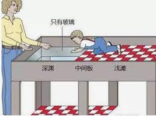
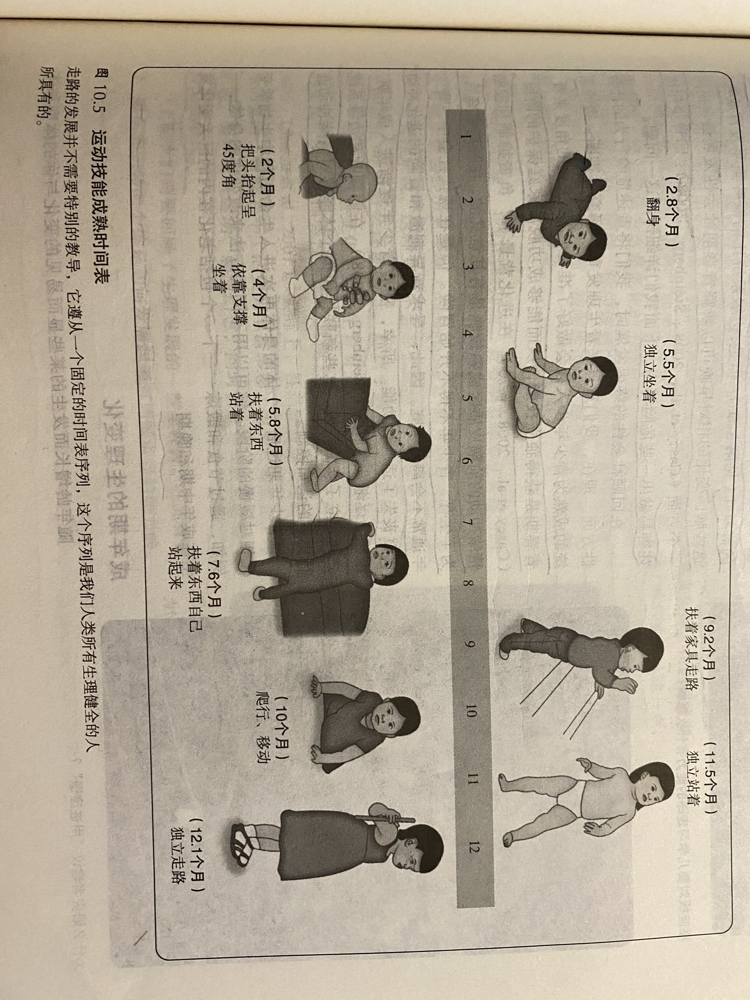
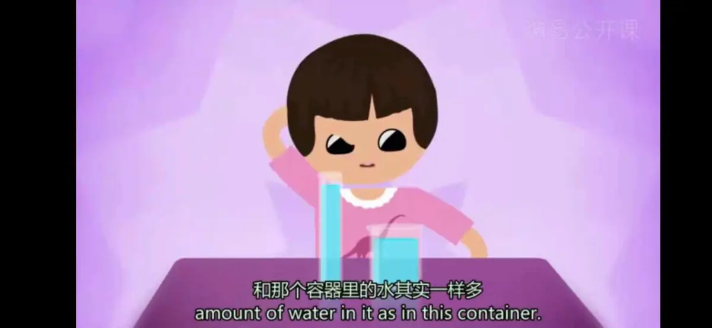

# 认知发展
* 尽管我们从出生开始后，大脑的神经细胞数量就没怎么变化过，我们的神经网络系统却花了很多年才逐渐发展成为大脑中一整套完整的复杂硬件
* **发展心理学**（Development Psychology）：研究我们的生理变化，认知、社会和情绪变化，贯穿我们整个一生的过程，从胎儿期，到青春期，到退休期，也就是我们如何成为今天的自己
* 这一切从**知识的增长**（Growth of Knowledge）开始，你从懵懂到变得成熟的过程；随着年龄的增长，我们的行为和外表会发生一系列的变化，这叫做**成熟**（Maturation）
---
**研究发展**
* **常模研究**（normative investigations）：通过系统的观察、测试不同年龄的许多个体，研究者可以确定发展的关键点，这些数据提供了发展或成就的标准模式，即常模、
* **发展年龄**（developmental age）：一个儿童能表现出大部分人所具有的特定生理或心理发展水平时的生理年龄
* **纵向设计**（longitudinal design）：持续观察和测试同一个体，通常为连续多年不间断；研究者通常用纵向设计来研究个体差异
  * **优点**：参与者生活在同样时期，与年龄有关的变化就不会与年代条件的变化产生混淆
  * **缺点**：某些类型的理论模型只能适用于与参与者生活在同一年代的人，且花费巨大，极易因为参与者中途退出而受损
* **横断设计**（cross-sectional design）：研究人员在同一时间观测、比较处于不同生理年龄阶段的参与者，并对与年龄有关的行为差异得出结论 
---
**毕生的生理发展**
* **孕期和童年期的发展**
  * **子宫内的生理变化**
    * **受精卵**（zygote）：单细胞，由精子和卵子结合而成，从母亲那里得到46条染色体的一半，从父亲那里得到另一半
    * **胚种期**（germinal stage）：受精卵形成的最初两周；在这一阶段，细胞开始迅速分裂，大约一周后，一小团极微小的细胞植入母亲的子宫壁
    * **胚胎期**（embryonic stage）：胎儿发育的第3-8周；这一阶段细胞继续迅速分裂，但细胞开始分化，形成不同的器官
      * 随着器官的生成，胎儿出现第一次心跳；对刺激的反应大约在6周时就可以观测到，此时胚胎还不到1英寸长；到第8周时，可以观察到胚胎自发的移动
    * **胎儿期**（fetal stage）：从第8周结束直到婴儿出生；母亲在受孕16周后可感受到胎动，此时胎儿大约18厘米长
      * 大脑在子宫中成长时，大约每分钟能产生25万个新的神经元，出生时可达超过一千亿个神经元
    * **致畸物**（teratogen）：任何可造成胎儿组织异常的环境因素，包括营养不良、感染、放射等
      * **胎儿酒精综合症**：由母亲在孕期饮酒导致，患儿的头和身体通常都较小，且面部畸形
  * **婴儿生存的先天机制**
    * 我们通常认为新生儿完全处于无助之中，但事实上婴儿具有生存的先天机制，能够对成人照料者做出反应，以影响他们的社会性环境
    * 婴儿出生伊始就具备一些反射，如**觅食反射**（当有物体触碰婴儿面颊时婴儿会将头转向有物体的方向，使新生儿能找到母亲的乳头），**吮吸反射**（把物品放入婴儿口中，婴儿会开始吮吸，使得新生儿能够进食）
    * 婴儿在出生前就能听到**声音**，且对**母亲的声音**更喜欢，但对父亲的声音没有什么特殊偏好
    * 成人的**视敏度**大约是新生儿的40倍，但在出生的头6个月婴儿的视敏度迅速提高；4个月大时婴儿可理解**三维结构**
    * 吉布森和沃克设计了“视崖”装置，使用棋盘图案的棉布制造深端和浅端；结果学会爬行的婴儿惧怕深度，而不会爬行的同龄婴儿不会出现这种恐惧，证明**对高度的警觉并非先天遗传**
  
  * **童年期的发育和成熟**
    * 刚出生时，婴儿的头部尺寸是成人头部大小的60%，占整个身体长度的25%；在头半年时婴儿的体重翻了一番，一岁时翻了两番
    * 所有无缺陷的新生儿都具有同样的生理成熟潜质
* 
* **青少年期的生理发育**
  * **青春期**（puberty）：男性的青春期以**遗精**为开始标志，女性则是以**月经初潮**（menarche），即月经的来临为开始标志
    * 童年期结束的第一个表现就是**青春期生长突进**，在女孩10岁、男孩12岁左右**生长激素**进入血液；青少年的身体**并非均速发展**到成人比例，而是手掌与脚掌先长到与成人相当，四肢其次，躯干的生长最为缓慢
    * 在青春期，控制调节情绪过程的**边缘系统**和负责计划、控制情绪的**前额叶**变化最重要，但前者比后者更早发育成熟，导致了青少年较易做出冲动行为
* **成年期的生理变化**
  * 皮肤产生皱纹，头发越发稀少并变得灰白，身高下降2——5厘米
  * 眼睛的**晶状体**弹性下降，调节晶状体厚度的肌肉作用减弱，导致看**近处的东西**变得困难，以及难以**夜间视物**；晶状体变黄，使难以区分**短波长的颜色**（紫色、绿色、蓝色）
  * 听**高频音**时普遍有困难，在男性比女性身上更加严重；**声带软化**，说话声音频率变高，但理解高频音的语言有困难
  * 50岁左右的大部分女性会经历**更年期**（menopause），即月经和排卵的停止；男性的**精子**质量在40岁后逐渐降低，数量在60岁后开始减少；但年龄不会损害性生活的其他方面
---
**毕生的认知发展**
* **认知发展**（Cognitive Development）：对心理的内容和过程随时间发生和变化的研究
* **经验主义**：由英国哲学家洛克提出，认为指导人类发展的是人在被教养过程中所接受的刺激
* **先天论**：以卢梭为代表，认为天性塑造了儿童的发展
* **皮亚杰关于心理发展的观点**
  * **发现**：瑞士心理学家**让·皮亚杰**，注意到年幼的儿童总是在某些特定的问题上犯同样的错误
  * **研究方向**：人类的认知发展和智力发展会经历特定的阶段，即“知识是如何增长的”？
  * **图式**（Schemas）：我们在成长中努力理解所经历的一切时，会创造图式，一种帮助理解信息的心理结构；图式就像概念，从具体的事物到抽象的概念
  * 我们一直在追求思维过程和所处环境之间的**认知平衡**（Cognitive Equilibrium）或认知和谐，这就引起了我们对新事物的思考和适应
  * **适应新体验的过程**
    * **同化**（Assimilation）:我们通过自身已有的图式来对体验进行解释（如果一个小宝宝从来没见过鹿，但她拥有马的图式，她会把自己见到的第一只鹿叫做马）
    * **顺应**（Accommodation）:当我们与世界发生更多互动时，我们的思维会进行顺应，根据新的体验来调整图式（小宝宝意识到鹿并不是马后，她会调整她的图式，将斑点鹿和黑骏马区分开来）
  * **不同阶段**
    * **感知运动阶段**（Sensorimotor Stage）：从出生开始到大约2岁
      * 宝宝们体验整个世界，通过它们的感觉和动作，触摸、抓握、看、听、把东西放到嘴里；它们没有**客体永久性**（Object Permanence），也就是意识到事物不在眼前时仍然可以存在的能力
      * 但仅仅一两个月之后，宝宝就已经能更好地理解物体和人并不会因为藏了起来就变的消失不见；客体永久性，在皮亚杰看来，是感知运动阶段中最主要的成就
    * **前运算阶段**（Preoperational Stage）：在大约2岁开始，一直持续到6或7岁
      * 这个年龄段里孩子所有的认识都是围绕着他们自己，前运算阶段标志着儿童出现 **“自我中心”**（Egocentrism）,很难去想象其他人的观点
      * 儿童具有在大脑中对物件和事件进行表征的能力，他们已经能够在想象中进行对话、构图和角色扮演游戏；此时，他们看待事物具有**泛灵论**（Animism）的观点，认为玩具是有感觉、有思想的
      * 在这个阶段的早期，儿童仍然还不理解**守恒**的概念（液体不随容器而变化），他们的思维仍然不具有**可逆性**（Reversibility）（泥巴球拍扁后还可以做成球），他们很难在脑海中逆向地考虑事物的过程；这些认知上的困难还和思维的 **“集中性”**（Centration）有关，儿童倾向于从固定的一个角度来看待问题、认识物质

      * 但是，在第二个阶段的后期，儿童的心理开始飞速发展，孩子们开始形成自己的**心理理论**（Theory of Mind），也就是，理解他人的感受、想法和态度的能力，能够进行换位思考，还能预测别人的行为，这种新的人际交往能力表现在很多出色的地方，从说服父母，到表现出同理心
    * **具体运算阶段**（Concrete Operational Stage）：开始于6、7岁，持续到11、12岁
      * 儿童开始通过逻辑思维来认识他们体验到的具体的事，可以用心理活动代替物理活动，所想代替所见；和之前的阶段不同，儿童的思维不再具有集中性，在这个阶段，思维开始 **“去集中化”**（Decentration），变得能够看到问题或事物的多个方面，所以那些难以理解的可逆性和**守恒**（conservation）的概念将变得不再是问题
    * **形式运算阶段**（Formal Operational Stage）：大约从12岁开始，持续我们的整个人生
      * 我们的推理能力进一步发展，能够进行更加**抽象**的思维活动，包括问题解决和处理假设的问题
      * 青少年开始意识到，他们所处的现实只是众多可以想象的到的现实中的一个，并开始思考真理、公平和存在等此类深刻的问题
  * **缺陷**：过分放大了某些问题，以及通过年龄划分能力太过刻板僵硬，有研究发现在3个月大的婴儿中，客体永久性的一些类型就已经存在；心理学家还把发展看作是一种更加连续的过程，而不是一系列分裂的台阶  
  * **影响**：从最根本的理念上揭示了儿童的思考方式，与成年人是非常不同的，这实际上帮助了很多父母和教师的教育工作
* **关于早期认知发展的其他观点**
  * **婴儿的认知**
    * 雷尼•拜爱宗认为，3个月大甚至更小的婴儿已经发展了客体恒常性的某些方面
    * 研究者提出，7个月大的婴儿已经开始区分行为是否具有目的性
  * **儿童的基础理论**
    * **基础理论**（foundational theory）：儿童最初理解世界的框架
    * **朴素心理学**：儿童将他们关于心理状态特征的经验汇集为的心理理论；依靠新的经验对其进行修正
  * **社会文化对认知发展的影响**
    * 尽管皮亚杰主张儿童的心理发展是通过自身与环境的相互作用实现，白俄罗斯心理学家**利维·维果斯基**强调儿童的早期发展是通过**父母的教育**，以及儿童和社会环境的互动而产生
    * **内化**（internalization）：儿童吸收来自社会的知识，该环境对认知如何随时间展现有着举足轻重的作用
    * 他不主张将发展分成各个阶段，而是更注重发展过程中**成人监护者**给予儿童的某种脚手架，帮助儿童的思维和学习迈向更高的水平；维果斯基十分重视**语言**作为一种给事物赋予意义的工具的作用，他还认为，儿童的成长会存在**文化间的差异**，许多文化中儿童并没有表现出皮亚杰主张的形式运算
* **成年期的认知发展**
  * 我们的**智力**仍然十分稳定；尽管有一种智力在青春期以后会开始减少，另一种智力在整个生命中却是不断增长的
    * **流体智力**（Fluid Intelligence）：是你解决问题的能力，与你的个人经历和教育程度都无关，它主要涉及到又快又抽象的思维活动，所以相对来说，经验缺乏的儿童通常会展现出较高的流体智力；遗憾的是，这种智力在青春期时到达顶峰，在30岁左右就开始逐渐下降，主要是因为加工速度的减慢
    * **晶体智力**（Crystallized Intelligence）：是基于事实的知识，通过过去的经验和学习形成的固化智力；随着年龄的增长而增长，因为我们会持续学习新的知识，对旧的事物会获得新的理解
  * **智慧**（wisdom）：生活中某些方面的专长，在人的一生中都在不断提高
    * 丰富的事实性知识
    * 丰富的程序性知识
    * 毕生的生活背景经验
    * 不确定性
  * **记忆**将会衰退，但对于提取一般性知识和多年前发生的事件的个人信息，老化并不会降低这方面的能力，而是对信息的有效组织、存储和提取过程有影响
  * **老年痴呆症**（Dementia）：并不是一种疾病，而是一系列症状，包括思维损伤、记忆力减退、糊涂以及人格的潜在变化；脑瘤、轻度中风或者长期酗酒，都会逐渐对大脑造成损害，提高患老年痴呆症的风险
    * **阿尔茨海默症**（Alzheimer's disease）:一种渐进的、不可逆转的老年痴呆症；首先记忆力会减退，然后是推理能力减弱，随着重要的脑神经数量的持续减少，最终患者会丧失基本的生理功能；全世界75岁以下的人中，有3%会得这种病，然而这个百分比每5年就会翻一倍
    * 老年痴呆症并不是一种正常的自然的衰老，人的记忆力有些变化是正常的，但我们大多数的记忆都会保持完整
  

---
[Crash Course](https://www.bilibili.com/video/BV1Zs411c7W6?p=19)