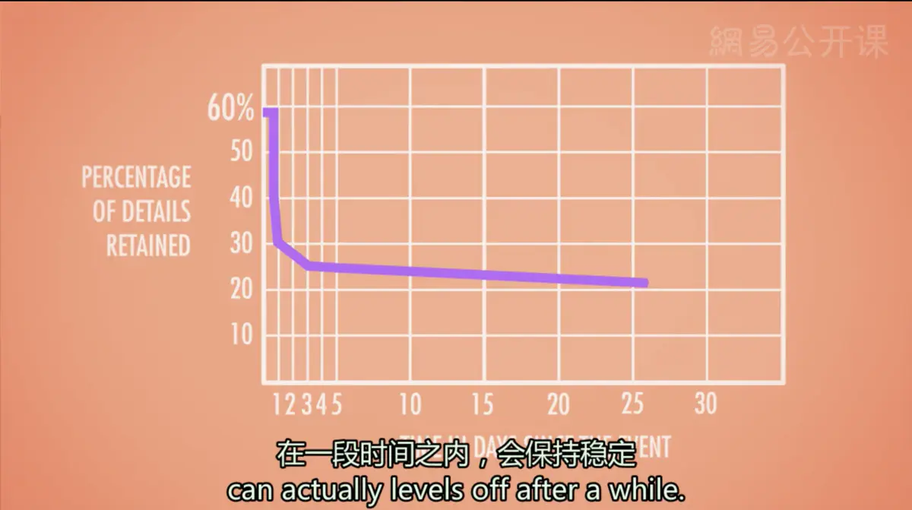
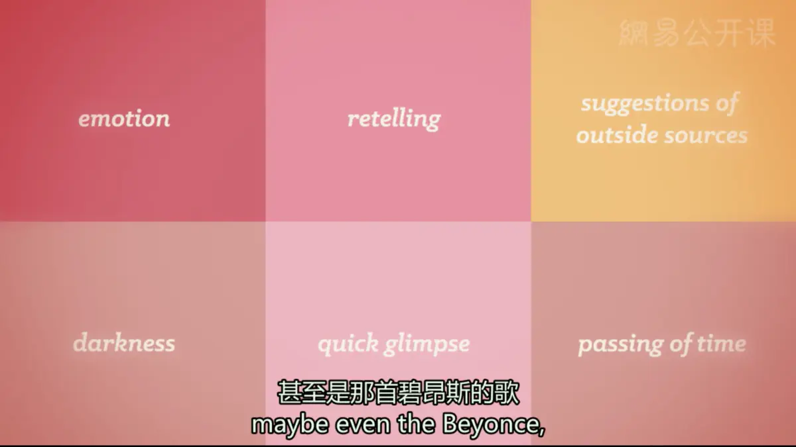

# 记忆与遗忘
  **长期记忆的编码**
* **记忆的特点**：一系列相互交错的联结将各种各样的事情串联起来，信息点与信息点之间会相互交叠缠绕（蜘蛛网）
* **编码特异性**（encoding specificity）：当提取的背景与编码的背景相匹配时，记忆最为有效
  * **启动**（Priming）/**“无记忆的记忆”**（“Memoryless” Memory）：一种激活无意识联结的方法，即用你不知道你拥有的那些“隐形记忆”（如天气、歌、车牌等），唤起旧的记忆联结
  * **情境依赖记忆**（Context-dependent memory）：使用启动的方法唤起的记忆
    * 有些记忆是依赖于**情境**的，其他记忆则是依赖于个体的**精神状态**（State-dependent），也和个体的**心情**有关（**心境一致效应**，Mood-congruent）；也就是说，我们的精神状态和情绪也能够作为提取记忆的线索
    * **语言依赖性**（language—dependent）：双语人群如果在编码阶段和提取阶段使用同一种语言，就更容易回忆起相关信息
* **系列位置效应**（Serial Position Effect）：一种和我们接收新信息的顺序有关的记忆线索
  * **首因效应**（Primary Effect）：接收较早的信息有更多时间来进行复述，从而转入长时记忆中
  * **近因效应**（Recency Effect）：接收较晚的信息由于仍保持在工作记忆中而被我们记住
  * **背景区辨性**（contextual distinctiveness）：编码时的背景与提取时的背景的不同程度
* **加工水平理论**（level-of-processing theory）：信息的加工水平越深，转入记忆的可能性就越大
* **不同的加工水平**
  * **浅层次加工**（Shallow Processing）：对信息的编码基本上只有听觉或视觉层面，记忆依赖于词语的字音、结构或字形
  * **深层次加工**（Deep Processing）：进行语义编码，理解这个词的真正含义；赋予这个词一些特殊的意义，或者与你个人的情感经历相联系起来
  * 对信息编码和记忆的程度，不仅取决于你学习它所花费的时间，还取决于你将信息与自身联系起来的紧密程度
* **加工过程分类**
  * **外显加工**（Explicit Process）：有意识地、主动地存储信息
    * **提高外显加工水平的方法**
      * **记忆术**（Mnemonics）：任何用以帮助记忆的方法；如用缩写来记忆的办法
      * **组块化**（Chunking）：通过将信息组织成我们熟悉的，能够理解的单元来促进记忆
  * **内隐加工**（Implicit Process）：一种不必主动集中注意加工记忆的过程，如**经典条件作用联结**（Classically Conditioned Associations）；这种**自动化的加工**（Automatic Processing）很难在主观上让它停止
  * **传输适宜型加工**（transfer-appropriate）：当编码时进行的加工类型（外显/内隐）与提取时所要求的类型（外显/内隐）匹配时，记忆的成绩最好
---
  **遗忘**
  * **编码失败**（fail to encode it）：在最开始的时候，信息就没有进入编码加工当中；例如那些我们没注意到的东西，我们倾向于不对其进行编码，因此就不会记住
  * **贮存消退**（experience storage decay）：信息自然地随着时间而被遗忘；尽管我们忘记事情的速度非常快，我们记住的那部分信息，在一段时间之内会保持稳定
    * **艾宾浩斯遗忘曲线**：使用死记硬背的方法记忆无意义音节序列，将学习时间记为标准成绩；此后学习一些干扰音节，并在一段时间后通过重学最初的音节序列来测量记忆，如果重学需要的时间少，则说明信息得到了保存；将重学时间除以初学时间即得遗忘曲线

  * **提取失败**（fail to retrieve it）:信息不能在需要的时候被准确回忆
    * **前摄抑制**（前摄干扰，Proactive Interference）/**正向干扰**（Forward-acting Interference）：旧的记忆会妨碍你回忆起最近的记忆
    * **倒摄抑制**（后摄抑制，Retroactive Interference）/**反向干扰**（Backward-acting Interference）：刚学的新知识会妨碍对旧的信息的回忆
---
**改善记忆**
* **精细复述**（elaborative rehearsal）：当使用复述的方法记住信息时，创造一种联系使信息不再随意，如心理图画或小故事
  * **队列效应**：队列中的一员往往难以记忆其前面那个人所说的话，因其将注意力放在自己的发言上面
* **记忆术**（mnemonic）：用一些与以往编码过的信息相联系的方法，来编码一系列事实的技术
  * **地点法**（method of loci）：通过与熟悉的某种地点序列相联系来记忆一系列名字或客体
  * **桩-词法**（peg-word method）：将序列中的项目与一系列线索联系，如根据不同韵律将数字和单词联系起来
* **元记忆**（meta memory）：人对自己的记忆过程的认知和控制，即记忆是如何工作的或者你如何知道你拥有什么信息
  * **知道感**（feelings-of-knowing）：知道自己拥有这一部分的记忆
  * **产生原因**
    * **线索熟悉性假设**：人们是基于对提取线索的熟悉性建立知道感的
    * **易接近性假设**：人们基于记忆中部分信息的可接近性或可得性来做出判断
---
**记忆结构**
* **概念**（concept）：有关归类或范畴的心理表征
* **典型成员**：其许多属性与类别中的其他成员重合
* **基础水平**（basic level）：在这种概念的水平上，人们可以更好地对客体进行分类和思考，例如“苹果”而非“水果”或者“红富士”
* 基础水平会随个人经验而改变
* **图式**（schema）：关于物体、人和情境的概念框架或知识群
  * 图式并不包括所有体验的每个细节，而是某个环境下多种情况的平均经验，所以并非永恒不变，而是随着生活经验的变化而变化
  * 与图式不一致的信息更容易被记住
* **对客体进行分类**
  1. 人们对于记忆中的每个概念编码一个**原型**（prototype）——一个类别中最核心或平均成员的表征，通过比较客体和原型来识别客体
  2. 人们在记忆中储存了自己感受到的每个类别的多个不同**范例**（exemplars），通过将客体与范例相比来识别它
---
**重构性记忆**（reconstructive memory）
* **定义**：根据记忆中更概括的知识来重构信息
* 当试图重现某一段记忆时，我们的记忆会发生重组，并加入许多猜测，记忆的内容会发生变化
* **重构方式**
  * **趋平**：简化故事
  * **精锐化**：突出和过分强调某些细节
  * **同化**：将细节变得更符合自己的背景或知识
* **闪光灯记忆**（flashbulb memory）：当人们的情绪受到极大波动时，他们相信他们的记忆与原始的情形是完全一样的
  * 事实上，闪光灯记忆和普通记忆的变化模式基本相同，只是人们自信地认为能够提供准确的细节
* **误导信息效应**（Misinformation Effect）：带有误导性质的信息会被纳入我们的记忆中，从而扭曲真相
  * 例：伊丽莎白·洛夫特斯的实验：两组被试观看了车祸事故影片，那些被问道“这两辆车在相互发生'冲撞'时的速度是多少”的被试，比那些被问道“这两辆车发生'碰撞'时的速度是多少”的被试对车速的估计要高得多；一周后两组被试都被问及在影片中是否看见任何玻璃碎片，那些一周前听到“冲撞”这个词的被试中回答看到的人数，是另一组的两倍；“冲撞”是引导词，从根本上改变了目击者们的记忆
* 共同目击证人可能成为一个信息来源，污染了目击者原本的记忆
* 一个非盈利的合法组织“无辜者保护计划”提出，在整个美国，由于DNA证据支持而被无罪释放的被告人中，有75%的人由于被目击证人错误地指认而成为了嫌犯
* 记忆不仅是过去事件的重建，也是对过去事件的再创造；我们不能确定一段记忆是否是真的，仅仅凭它感觉很真实

---
**记忆的生物学**
* **记忆痕迹**：记忆的物理性描述
* **与记忆相关的大脑组织**
  * **小脑**：程序性记忆，经典条件化反应
  * **纹状体**：习惯和刺激-反应间联系
  * **大脑皮层**：感觉记忆及感觉间的关联记忆
  * **海马组织**：事件、日期等的陈述性记忆，空间记忆的巩固
  * **杏仁核**：具有情绪意义的记忆
* **遗忘症**（amnesia）
  * **顺行性遗忘症**（anterograde amnesia）：脑损伤后无法形成外显记忆
  * **逆行性遗忘症**（retrograde amnesia）：脑损伤导致无法记得损伤前的事情
---
[Crash Course](https://www.bilibili.com/video/BV1Zs411c7W6?p=15)

