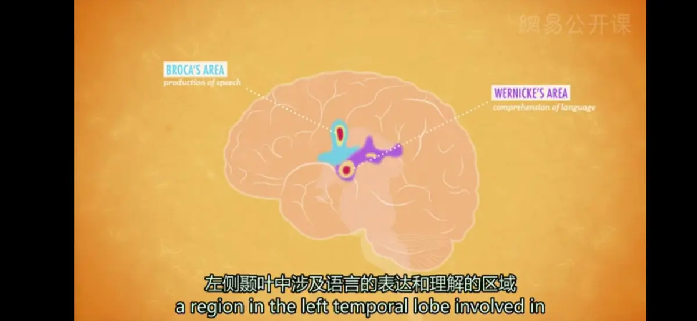

# 语言
* **语言**（Language）： 技术层面上，被定义为一整套，包括说、写或符号化的文字，以及组合这些文字用来表达意义的过程
*  声音、手势、视觉符号等多种语言形式，使我们能够理解那些我们从来没有亲眼见过的事物，并快速有效地与其他人交换信息
*  全人类拥有大约7000种不同的语言
---
**语言的基本结构**：
* **音位**（Phonemes）：可辨别的最短的语音单位（如a,t,ch,sh,f）；英语中大约有45个音位
* **语素**（Morphemes）：最小的具有意义的单位，由音位组合在一起；可以是一个单词，也可以是单词的某个部分，比如单词的前缀或后缀（如：单词“Speech”是一个语素，包含4个音位，s/puh/ee/ch）
* **语法**（Grammar）：可以把语素整理到你的语法当中，或是归纳到你的语言系统中，来说出你想说的话
* 英语中的40个音位带来了超过10万个语素，产生超过61万6千个的单词，而这些单词又可以通过组合来产生无限数量的句子、段落、吴唐诗词、莎士比亚剧作
---
**语言的学习**：
1. **“婴儿”**（Infant）来自拉丁语中的“infans”，意思是不会说话
2. **接受语言阶段**（Receptive Language）：早在4个月大时，婴儿们就能辨别不同的语言，并开始读唇语，将嘴部的动作和发出的声音相匹配；婴儿能够理解我们跟他讲的话，以及我们所说的关于他的话
   * 婴儿出生伊始就有**感知声音差异**的能力，但很快就会失去感知某些声音差异的能力，因为这些差异在母语中并不存在
   * **婴儿指向型言语**（infant-directed speech）/**儿童指向型言语** ：在与婴幼儿讲话时，成人往往会放慢语速，并使用夸张的高音调，或使用较短的结构简单的语言形式，体现了儿童在言语感知的过程中环境的支持
   * 婴儿在4个半月大时已经可以对自己的名字表现出认知偏好
3. **产生语言阶段**（Productive Language）:除了理解他人的话语，宝宝们开始发展制造词语的能力，当然这需要一段时间；但与此同时，他们会进行大量的**咿呀学语**（Babbling）的练习，大约从4个月大时起，他们就开始发出各种各样的声音
   * 咿呀学语在许多不同的语言中都有，陌生人仅仅通过听宝宝的咿呀学语，无法分辨其语言；同样的，耳聋的宝宝会观察父母的手势，然后和父母的手进行咿呀学语
4. 到了6-7个月大时，这些咿呀学语的声音开始变得**有意义**，这时候的“ma-ma”才可能真的是“妈妈”；此时，由于没有暴露在其他的语言环境中，婴儿会**丧失**听到和创造其他语言中特定强调和语音的能力，而只能保留家庭环境中使用的语言的一般能力
   * 婴儿通过感知到声音模式重复来联系词与具体事物
5. **单词句阶段**（One-word Stage）：通常为婴儿1周岁时，现在的他们会懂得，语音具有特定的含义，并且能够把语音和物体联系起来
6. **命名爆炸阶段**：到了大约18个月大，他们学习新单词的能力，会从一周学一个词，跳跃到一天学一个词；到6岁时，儿童平均可以理解14000个词汇
   * **快速映射**：儿童拥有的一种特殊能力，能从极少的经验中学会新词的含义，有时甚至只要一次就能学会
   * 研究者认为，儿童会对新词的意义先做出一些**假设**，可能将某个词义外延的理解扩大或缩小，例如用小狗代表所有动物或只是他们家的狗
   * 儿童的假设可能受到了**对比原则**的制约，听到新词语时会寻找与已经掌握的词汇意义截然不同的意义，不理解两个词可以代表同一个意思
7. 他们两岁时就会说**双词句**（Two-word Stage，“电报句”）了，这种断断续续的句子主要说的是名词和动词，比如，喝水；这些短小的句子能让人听懂，并且符合他们说的语言中的句法规则
8. 这时候开始，正常的孩子会很快学会说更长的短语和更复杂的句子
---
**语言的相关理论**：学界内存在一些针锋相对的理论，关于婴儿时期的咿呀学语如何转变为复杂的句子，以及如何获得语言
* **强化学习理论**：B·F·斯金纳提出，认为语言就是一定联结原理与操作性条件作用下的产物，儿童学会将词语和意义联系起来是因为强化作用
* **先天学习**（Innate Learning）**和普遍语法理论**（Ubiquitous Grammatical Categories）：美国语言学家诺姆·乔姆斯基提出，指出尽管世界上的千万种语言可能听起来五花八门，但它们实际上是非常相似的，拥有共同的基本元素，即”普遍语法“；乔姆斯基的普遍语法假设，人类所有的语言都包含名词、动词和形容词，而人类从出生时起，就具备天生的获得语言的能力，并且具有与生俱来的学习语法规则的素质倾向
  * **研究方法**：跨语言研究
* **儿童语言运用能力的操作原则**：丹•斯洛宾提出
  * **词序**：严格遵循动作者-动作-客体理解顺序，不能理解被动句
  * **扩充**：儿童需要使用同一个词素来表达同一个概念，包括所有格、过去式及连续行为
    * **过度规则化**（over-regularization）：将某种规则加在所有的形式之上，例如所有过去式均用-ed
* 对于其他物种的发展性研究已经告诉我们，语言学习中，至少某一些能力确实是天生的，同时，学习并暴露在语言环境中也非常重要
---
**语言的使用**
* **语言生成**（language production）：研究在特定时间人们选择说什么，以及为了产生相应信息需要经历的过程，包括做手势和书写
  * **听众设计**（audience design）：考虑话语所针对的听众，根据听众设计要说的话
    * **拱形设计原则/合作原则**
      * 话语提供信息恰好满足需要
      * 话语保证正确
      * 话语前后关联
      * 话语避免模糊和歧义
    * **共同知识**：和听众分享的共同点
      * **团体成员身份**：属于某个共同的团体
      * **行动同现**：来源于双方过去的交谈
      * **知觉同现**：面对共同的客体或情境
  * **言语执行和口误**
    * **斯本内现象**（spoonerism）：以牛津大学的斯本内教授而命名，指在一个短语或句子中两个或更多词首音的互换
    * **SLIP技术**：实验室诱导产生的斯本内现象，要求参与者默读一些由词对构成的词表
    * 当口误仍然导致了真实存在的词时，斯本内现象往往更容易出现，说明在说话时一些认知过程专注于觉察和修复潜在的错误
* **语言理解**
  * **歧义消解**
    * **词汇歧义**：同一个词有不同词义
    * **结构歧义**：同一句话有不同理解方式
    * **平衡歧义**（balanced ambiguity）：两种含义被以几乎相同频率使用
    * **有偏歧义**（biased ambiguity）：一种含义的使用频率明显比另一种多
      * 对于这两种歧义类型，大脑以不同方式做出反应
  * **理解的产物**
    * **命题**：话语的主要思想，意义表征的基本单元
    * 如果一句话的两个词属于同一个命题，那么在记忆中它们会表征在一起，如The cat is on the mat→on（cat,mat），cat和mat表征在一起
    * **记忆**需要**抽取命题**，而确切形式很快就会丢失
    * **推论**（inferences）：由记忆中信息而做出的逻辑假设
      * 在任何话语中潜在的推论都是无限的，如通过人推论她有大脑和心脏等，但这种推论是不可能被回想的
* **语言和进化**
  * 人类是唯一能使用复杂语言规则的物种，即用有限的单词表达无限的意思
  * 坎齐是第一个猿类，证明语言可以从自发的观察行为中获得，不需要有计划的训练，它也是第一个表现出具备初步的语法、句法和语义理解能力的动物；但它也不具备可产生无数言语的语法规则
  * 其他物种也不能根据听众修改它们的语言
* **语言、思维和文化**
  * **语言相对论**（linguistic relativity）：每个人的语言结构对其思考世界的方式有影响
    * 不同文明在他们使用的基本颜色词上有很大区别，如英语有十一个，而巴布亚新几内亚的达尼人的语言只有黑白两个
---
* **失语症**（Aphasia）：一种语言的神经性损伤；人们可以体验许多不同种类的失语症，比如可以说，但不能读；可以唱，但不能说；或是可以写，但不能读
* **布洛卡区**（Broca's area）：位于大脑的左侧额叶，与产生语言运动有关；如果大脑中这个区域受损，也许依旧能理解别人说的话或者能够唱歌，但自己却说不出话来（但对于少数左撇子的人来说，语言运动区也可以在大脑右半球）
* **威尔尼克区**（Wernicke's area）：左侧颞叶中涉及语言的表达和理解的区域，受损后也许仍然能够说话，但讲出的话会没有任何意义

* 失语症和其他的脑损伤提醒我们，思维和语言既是相互分离的，又是紧密联系在一起的；正因为语言经常帮助我们表达自己的观点，思想实际可能受到使用的语言的影响
---
[Crash Course](https://www.bilibili.com/video/BV1Zs411c7W6?p=17)