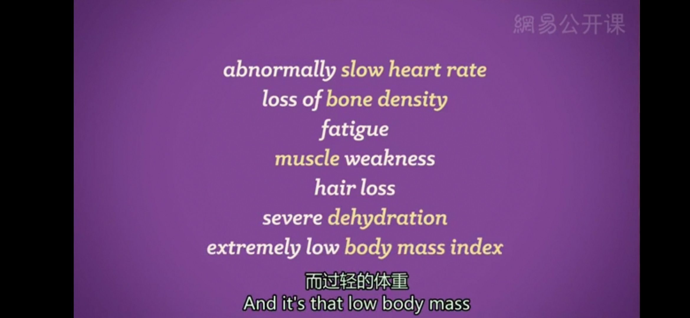

# 进食障碍与身体畸形恐惧症
**进食障碍**（Eating Disorders）:最**致命**的心理障碍之一，其直接导致的死亡率非常之高，它会缓慢地摧毁人的身体
* **分类**
  * **神经性厌食症**（Anorexia Nervosa）：体重低于期望的85%却依然非常担心变胖；神经性厌食症的患者大多数是青春期的女性，基本上都采取饥饿节食的减肥方法，于是最终体重都变得异常得轻；简单的节食行为可能很快会变得失控，进而发展为厌食症
    * **限制进食类型**（Restriction）：通常的行为表现有过少的进食、过度运动或食物清除，比如催吐或服用泻药
    * **暴食/清除类型**（Binge/Purge）：日常的进食活动包括暴食和食物清除两个行为
    * 由于患者拒绝摄入生命所需的重要营养，机体开始放慢生命活动来节省有限的能量，于是通常会导致异常缓慢的心跳速率、骨质密度的流失、疲劳、肌无力、脱发、严重脱水，以及极端过轻的体重；而**过轻的体重**是神经性厌食症诊断的**关键特征**
    * 厌食症是所有精神病障碍中**死亡率最高**的疾病

  * **神经性贪食症**（Bulimia Nervosa）：能够维持明显正常的或至少是最低限度的健康体重，但患者会暴饮暴食，然后不吃饭或进行食物清除，通常是通过催吐或服用泻药
    * 贪食症患者可能不像厌食症患者那样体重明显过轻，但那种成瘾式的暴饮暴食和食物清除会严重伤害整个消化系统，导致心率不齐、食道和口腔发炎、龋齿、长牙渍、排便不规律、胃溃疡、胰腺炎和其他器官损伤

  * **暴食症**（Binge Eating Disorders）：主要特征包括显著的暴饮暴食行为，以及暴食过后严重的痛苦情绪、失控感、厌恶或自责，但没有节食或食物清除行为
* **病因**
  * 尽管有时候症状的触发是由于**压力**或者是因为**需要或缺乏控制力**，进食障碍的出现并**不是**由于被过度夸大的**童年性虐待创伤**，虽然人们曾一度认为这是此病的根源；相反，这类心理障碍通常暗示着患者体验着**很低的自我价值感**（Low Self-worth）、**追求完美**、总是**没有达到自己的期望**、很**在意其他人的看法**
  * 如今，被诊断为进食障碍的患者有10%到20%是**男性**，他们也感受到同样的压力来保持理想中的形体优美；这个现象值得注意，这些心理障碍具有很强的**文化和性别影响因素**
  * **5-羟色胺**和**多巴胺**这样的神经递质可能有一定的作用；多巴胺涉及到大脑中饥饿和进食之间的联系，比如下丘脑和伏隔核，一些研究人员发现，暴饮暴食表现出会在一定程度上**改变多巴胺的产生机制**，而这种改变会进一步强化暴饮暴食行为，由此所产生的**神经网络**的模式**与药物成瘾的症状十分相似**
  * 进食障碍组与控制组的比较表明，**基因**似乎与进食障碍的发病率增加有关，且随年龄增长遗传的作用越来越大；但**环境和家庭因素**也受到研究者的大量关注，特别是对行为的榜样学习过程会塑造我们对自身和自己身体的看法
---
* **身体畸形恐惧症**（Body Dysmorphic Disorders，BDD）：个体对自己的生理缺陷具有强烈的执着，不论这种缺陷是微不足道的还是想象出来的；患有这种疾病的人通常都很痴迷于外表的完美，经常会在镜子前一照就是几小时，然后对自己的样子感到痛苦或羞耻
  * 尽管经常被归为**进食障碍**，我们对于身体畸形障碍不断加深的理解使我们认识到，它实际上与**强迫症**具有一些共同的特质；不过高水平的**形体不满**（body dissatisfaction）是个体患进食障碍的高风险因素
  * 这不仅仅是虚荣心过度的问题，患有身体畸形恐惧症的人照镜子时看到的通常是扭曲的，甚至是怪异的自己的影子，但看其他人很正常
  * **肌肉上瘾症**（Muscle Dysmorphia）：和厌食症正好相反，他们会变得非常在意自己的肌肉是否不够好看
---
[Crash Course](https://www.bilibili.com/video/BV1Ax411N75Q?p=34)
