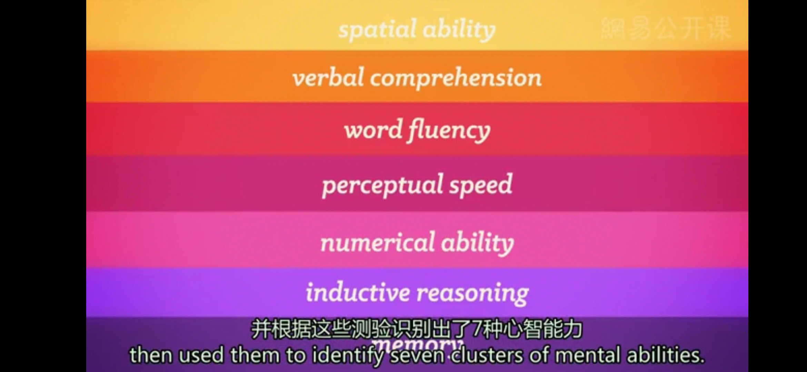
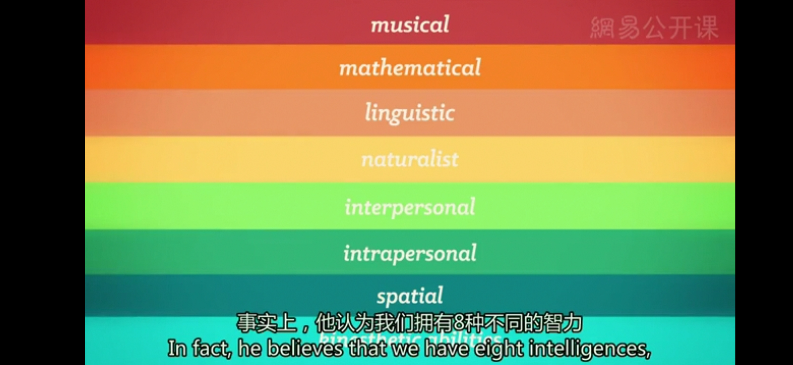
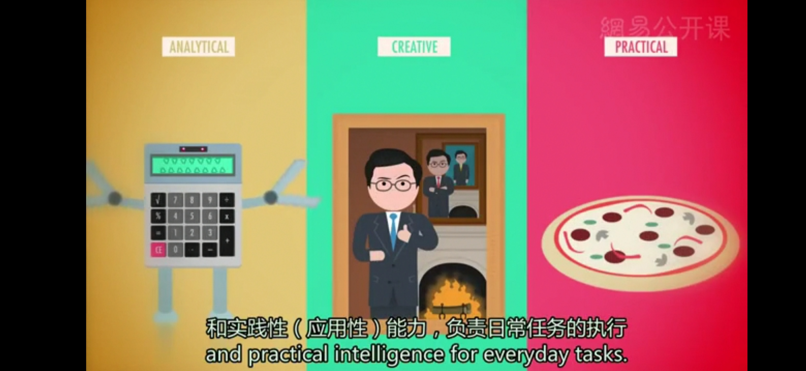

# 智力
* **智力**（Intelligence）：是从经验中学习，解决问题，利用已有的知识来适应新的环境的一种能力；通常使用智力测验来对心智能力进行评估和比较
* **G因素**（G-Factor）：在20世纪之初，英国心理学家查尔斯·斯皮尔曼认为，我们确实拥有一种综合的一般智力，渗透在各种特殊的心智能力当中；对于斯皮尔曼来说，G因素是一种相关性很广泛的因素，它涉及到所有的智力行为
  * 斯皮尔曼发展了一种统计分析方法，叫做**因素分析**（Factor Analysis），来检验某些特定的技能与其他能力之间的相关性，比如说，某些空间感较好的人可能会很擅长数学。我们就会推测，在这一类技能中，这个因素可能是空间数学推理能力（Spatial-Numeric Reasoning）
  * 但用单一的测验分数来衡量智力，曾经是，现在也是有问题的
* **心理测量学**（Psychometrics）：L.L.瑟斯顿为先驱，同时也是斯皮尔曼早期的挑战者之一，并不赞成用单一的尺度来将人的智力分为三六九等
  * 瑟斯顿在他的被试身上实施了56种不同的测验，并根据这些测验识别出了7种心智能力；比如说，在这种智力系统中，你可能会很擅长言语理解，但是在数学能力方面却略为逊色
  * 听起来很公平，但研究者们随后进一步发现确实存在一种现象，在某种能力上的高分的人，通常在其他能力上的分数也不低

* 斯皮尔曼和瑟斯顿两人一同为智力的现代理论铺就了道路
---
* **霍华德·加德纳**：将智力看作是以不同形式表现出的综合能力，他借鉴了脑损伤的例子，人的一种能力可能受到破坏，而其他能力仍然完好无缺;事实上，他认为我们拥有8种不同的智力，从我们的数学智力、语言智力，到我们理解物理空间和大自然的智力

  * **学者症候群患者**（Savant Syndrome，也叫学者综合症，常见于自闭症患者）：智力通常比较低下，但在某方面却有极高的天赋，比如说算数、背诵莎士比亚所有的作品
* **罗伯特·斯滕伯格**：把霍华德·加德纳的8种智力归纳压缩成了3种能力
  * **分析性能力**（Analytical）：即问题解决智力；
  * **创造性能力**（Creative）：即适应新环境的能力；
  * **实践性能力**（Pratical，应用性能力）：负责日常任务的执行

* **发散性思维**（Divergent thinking）：对于具有唯一正确答案的问题，我们用多种不同方式来求解的能力
---
* 目前为止，尽管我们确实有一些测试创造潜力的测验，但我们并没有一个标准化的系统来对创造力进行量化
* **构成创造力的5个主要成分**：由斯滕伯格和他的同事们识别出
  * **专长**（Expertise）：独到的学识和技艺、专业本领；特殊才能
  * **想象思维能力**（Imaginative Thinking）：站在新颖的角度来看问题，找出事物间的联系
  * **冒险性人格**（Venturesome Personality）：寻找新的刺激，冒各种风险，克服各种各样的困难险阻
  * **内部动机**（Intrinsic Motivation）：因个体对从事的活动本身感兴趣或厌恶而引起的趋近或回避的动机
  * **创造性的环境**（Creative Environment）：激发了个体的灵感，支持着个体不断提升能力
---
* **情绪智力**（Emotional Intelligence）：在1997年由心理学家彼得·沙洛维和约翰·梅尔提出，它是我们感知、理解、管理和表达情绪的智力
  * **感知情绪**（Perceiving Emotions）：对情绪进行识别，能够读懂表情，甚至是体会音乐、电影和小说中的情感
  * **理解情绪**（Understanding Emotions）：能够对情绪进行预测，知道人的情绪为何会变化
  * **管理情绪**（Managing Emotions）：个体知道，在不同的场合中如何用合适恰当的方法来表达自己
  * 情绪智力还包括将情感与适应性的行为和创造性思维相结合，比如，化解冲突，安慰悲伤的小伙伴，与他人融洽的合作
---
**智力测验**
* 第一个尝试对智力进行测量的是18世纪的英国科学家弗朗西斯·高尔顿，受到他著名的表哥查尔斯·达尔文自然选择理论的启发，高尔顿很想知道自然选择对于人们与生俱来的能力，比如智力，会产生什么影响
* **优生学**（Eugenics）：高尔顿认为，我们的智力很大程度上来源于遗传，所以，如果我们提倡，天才与天才进行交配产生下一代，我们最终会创造出一个有着超高智商的种族；这种研究如何有选择性的、有意识的提高人口素质，特别是通过鼓励某些群体生育后代，而阻止其他群体生育这种方式叫做“优生学”
* 阿尔弗雷德·比奈和泰奥多尔·西蒙两位法国心理学家受到委托，编制一套智力测验来测量儿童所谓的**心理年龄**，本质上是指儿童表现出的智力水平，与儿童普遍达到相应智力水平的平均实际年龄的关系
  * 比奈认为，他的测验可以测量儿童当前的心智能力，但是智力并不是从出生后就不改变；他并不支持优生学，希望他的测验能够识别那些需要额外关注的儿童使他们获得更好的教育；但比奈同时也担心，这些测验如果被别有用心的人利用，可能会带来完全相反的效果，给孩子们贴上“无可救药”的标签，限制他们的发展机会
* 德国心理学家威廉·斯登对比奈和西蒙的研究进行了修正，创造出了著名的**智商**（Intelligence Quotient），也就是**IQ测验**
  * 你的IQ就是你的心理年龄除以你的实际年龄再乘以100
  * 这个公式用来计算儿童的智商非常好使。但计算成年人的智商时，则出现了问题，因为成年人的心理年龄其实没有多大变化
* 斯坦福的教授路易斯·特尔曼在19世纪初，开始着手于将智力测验推广到所有年龄段；在他的帮助下，美国政府开展了世界第一次大规模的智力测验，对第一次世界大战时招募的新兵和刚到美国的移民者进行智力评估
  * 和比奈不同，特尔曼确实把这种测验当作一种贴标签的工具，他认为他的测验可能，就像他说的，“最终达到降低低能儿出生率的目的”
  * 在21世纪上半叶，智力测验被用来对大约6万人执行强制绝育；其他的优生运动持续了长达一个世纪，有证据表明，贫穷的非洲裔美国人、美国土著人或拉丁裔女性，直到1970年左右，都仍然被强制或者秘密被政府大规模地执行绝育
  * **纳粹**完全将测验用来筛选所谓的“低能儿”，和那些他们认为对巩固所谓的雅利安民族毫无帮助的特质，他们仅仅根据IQ测验的作答情况，就对成千上万的人执行了强制绝育，甚至直接处决；而他们所使用的IQ测验，内容已经和智力测量无关，更多的是在检验公民的民族优越感，比如这样的问题“谁是俾斯麦”“圣诞节象征着什么“
---
[Crash Course](https://www.bilibili.com/video/BV1Zs411c7W6?p=24)