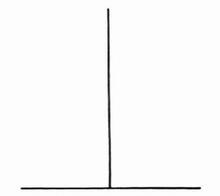
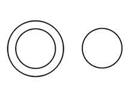

# 知觉
* **知觉**(Perception)：大脑组织理解信息并与情境结合
  * **自下而上的知觉加工方式**（数据驱动加工）：知觉的产生依赖于感觉器官提供的信息，即对**客观事物的特性**的加工（例如对颜色和明度知觉依赖于光的波长和强度）
  * **自上而下的加工方式**（概念驱动加工）：知觉的产生还依赖于主体的知识经验和兴趣、爱好、心理准备状态，即加工自己头脑中已经**存储的信息**（例如对来人的期待将影响我们对他的识别和确认）
  * 在知觉外界物体时，非感觉信息越多，需要的感觉信息越少，因而自上而下的加工占优势；相反，非感觉信息越少，需要的感觉信息越多，因而自下而上的加工占优势

---
* **形状知觉**（Form Perception）/**主体与背景关系**（Figure-Ground Relationship）：将眼前正在注视的景象（或者声音等其他感觉）组织和简化为少数主要的目标或主体，并将剩余部分看作是背景，与主体分离开来
  *  **图形组织原则**：我们大脑将主体组合成有条理的内容的原则
     *  **临近性**（Proximity）：空间、时间上接近的客体易被知觉为一个整体
     *  **相似性**（similarity）：物理属性（强度、颜色、大小、形状等）相似的客体易被知觉为一个整体
     *  **连续性**（Continuity）：具有连续性或共同运动方向等特点的客体易被知觉为一个整体
     *  **封闭性**（Closure）：封闭和完整的客体易被知觉为一个整体
        * 当客体本身不封闭、不完整时，人们倾向于用过去的知识经验将缺损的轮廓加以补充，把不完整的图形知觉为完整的封闭图形，这种在客观上并不存在而由知觉产生的轮廓，称为**主观轮廓**（subjective contour）

  * 当人们把各个部分知觉为一个整体时，这个整体便具有新的、单独的各个部分所没有的意义，“整体大于部分之和”
  * **不可能图形**（impossible figure）：如果单独观察**每个部分**，所得到的知觉都是清楚、正确的；但如果将图形作为**整体**来观察，就会发现无法获得明确、合理的整体知觉经验
* **深度知觉**（Depth Perception）：估计物体的距离和完整的形状，使看到事物的三维全貌而非视网膜上的二维图像；一定程度上与生俱来，同时运用了**双眼线索**（Binocular Cues）和单眼线索（Monocula Cues）
  * **双眼线索**
    * **双眼视差**（Retinal Disparity）：双眼间隔大约2.5英寸（65毫米），两侧视网膜接收的图像一直都有着轻微的差异，通过比较两侧图像来判断距离，越是距离较近的物体，两幅图像间隔的距离就越远
    * **辐合**（convergence）：主要利用的是生理信息；当注视不同深度的物体时，双眼的眼球及晶状体受睫状肌的影响发生调整，人体其实可以感知这种变化（把书放得很近看的话，就可以有比较显著体验），从而帮助感知注视焦点的深度
  * **单眼线索**：帮助我们判断物体的大小和距离
    * **相对大小和相对高度**（Relative size and height）：大高则近，小矮则远
    * **线性透视**（linear perspective）：平行线随着距离的增加最后会相交于一点；交汇的位置角度越锋利，线条就会越紧密，看上去的距离就会更远
    * **纹理梯度**（texture gradient）：距离越近的物体纹理越清晰
    * **重叠遮挡**（interposition）：遮挡他物的物体距离更近
* **运动知觉**（Motion Perception）：用来推测物体运动的速度和方向，正在缩小的物体慢慢远去，正在变大的物体逐渐靠近；很容易出错，例如速度一致时，大的物体比小的物体看起来移动速度慢
  * **网象运动系统**：**相邻视网膜点相继受到的刺激**为运动知觉的信息来源，例如，当物体从A处向B处运动时，物体在空间的连续位移，使视网膜上相邻部位连续地受到刺激，经过视觉系统的**信息加工**，就产生运动知觉；但是网象运动系统不足以充分解释复杂的运动知觉现象，运动知觉的产生还有其他的信息来源
  * **阈限**：运动知觉直接依赖于对象**运行的速度**，物体运动的速度太慢或太快，都不能使人产生运动知觉，例如人们不能觉察手表上时针的运动；**刚刚可以觉察的单位时间内物体运动的最小视角范围（角速度）叫运动知觉的下阈**，物体运动的速度超过一定限度，人们就看到弥漫性的闪烁，**看到闪烁时的速度是运动知觉的上阈**
  * **似动**（apparent movement）：指在一定的时间和空间条件下，人们**在静止的物体间看到了运动**，或者**在没有连续位移的地方看到了连续的运动**

* **时间知觉**（time perception）:也称**时间感**（time sense），指在不使用任何计时工具的情况下，个人对时间的长短、快慢等变化的感受与判断；时间知觉的特殊之处是它**并非由固定刺激所引起**，也**没有提供线索的感觉器官**
  * **外在线索**：比如太阳的升落、月亮的圆缺、昼夜的更替、四季的变化等，或生活、工作中的工作程序
  * **内在线索**：如人体自身的呼吸、脉搏、消化以及生物节律等
---

* **选择性**：人们不可能同时所有刺激都纳入为知觉对象，而总是根据当前的需要有选择地把其中一部分作为知觉对象，使之得到清晰的知觉
  * **图形**（figure）：被选择出来的部分，即知觉的**对象**
  * **背景**（ground）：其他部分

  * **两可图形**（ambiguous figure）：也叫双关图形、交变图形，指的是**对象和背景可以不时加以转换的图形**，最典型的两可图形是人脸－花瓶图形

* **理解性**：在知觉过程中，人们总是**根据已有的知识经验来解释当前知觉的对象**，作出最合适的说明，使它具有一定的意义
  * **经验**是最重要的；**言语的指导**对知觉的理解性也有较大的作用，在较为复杂、对象的外部标志不很明显的情况下，言语的指导作用能唤起人们的**过去经验**，有助于对知觉对象的理解；再者，知觉对象**本身的特点**也影响知觉的理解性
  * **斑点图**是常用于说明知觉理解性的例子，在感觉水平上看来，只是一些斑点的散乱排布，没有意义；而由于知觉的理解性，人们可以根据知识经验寻找斑点之间的联系，形成完整的知觉对象，并作出合理解释 
  * **知觉定势**（Perceptual Set）：心理学因素，由过去经验和环境中事物之间的关系而产生的对感知世界的一种**知觉启动**（perceptual priming），是一种**自上而下**的信息加工过程；真相影响着我们所见的内容（Believing is Seeing），大多数时候，知觉定势会让你得出合理的结论，但有时也会产生误导，甚至造成伤害
    * **类别**：
      1. **期望**
      2. **背景**（Context）
      3. **文化**（Culture）
      4. **情绪**和**动机**

* **恒常性**（Constancy）：使我们在距离、视角、动作或光线等条件变化时保持对一个物体的识别，达到相对一致性
  * **大小恒常性**（size constancy）：不论知觉对象的视网膜成像变化，而知觉出其实际大小的特性；大小恒常性通过知觉对象大小与距离深度线索之间的关系获得
  * **形状恒常性**（shape constancy）：指当人们对物体的观察距离和角度发生变化时，依然能够知觉出物体本身的实际形状；形状恒常性与距离判断和大小恒常性有关，视觉系统通过客体不同部位的距离而确定其真实形状
  * **明度恒常性**（lightness constancy）：指即使照明条件发生变化，对物体明度的知觉依然保持相对稳定；明度恒常性的存在是由于知觉的客体与其周围的环境在同一种光照的条件下（即使光照改变也是对二者同时发生），故到达大脑的神经信息未变而引起的
  * **颜色恒常性**（color constancy）：指当照明条件或环境背景光发生变化时，知觉对象的网像颜色改变而对颜色的知觉保持稳定
---
* **错觉**（illusion）：**对客观事物歪曲的知觉**，这种歪曲是在一定条件下产生，且**不随人的意志而改变**
  * 错觉不同于**幻觉**（hallucination），幻觉是在**没有外界刺激**的条件下产生的一种**虚幻的感觉**，错觉则是在**外界刺激作用**下产生的**歪曲的知觉**
  * 由于具有相同的感知生理基础和对环境的类似经验，人们在相同的知觉情境下通常会有**基本相同的错觉**
  * 错觉有很多种，视觉、听觉、味觉、嗅觉等方面的知觉经验，都会出现错觉；最丰富、被心理学家研究最多的是**视错觉**（visual illusion）
  * **原因**
    * **生理角度**：认为错觉受到眼睛和视网膜内神经交互作用的影响，如**侧抑制**（lateral inhibition）
    * **认知角度**：认为错觉受到更高水平的注意、过去经验、决策等认知因素的影响，如**误用恒常性**（misapplied constancy）
  * **视错觉分类**
    * **横竖错觉**（horizontal-vertical illusion）

    * **德勃夫错觉**（Delboeuf illusion）:小圆与右图的圆相等，但两者看似不等；居右者看来较小

    * **海林错觉**（Hering illusion）:两平行线为多方向的直线所截时，看起来失去了原来平行线的特征

    * **楼梯错觉**（Staircase illusion）

    * **编索错觉**（twisted cord illusion）:像盘起来的编索，呈螺旋状；实则系由多个同心圆所组成

    * **桑德错觉**（Sander illusion）：左边较大平行四边形的对角线看起来明显比右边小平行四边形的对角线长，但实际上两者等长

  * 研究者还经常创造新的错觉和重新构造已有的错觉现象，以此来**证明**知觉加工的重要特征，**检验**关于知觉系统、知觉过程的理论
* **观察力**
  * **观察**：**知觉的一种特殊形式**，是一种有目的、有计划、主动的知觉过程
    * 在观察的时候，观察者要预先拟出一定的计划，按计划仔细地察看知觉对象，提出问题，从中寻求答案；观察过程包含积极的思维活动、稳定的有意注意，并借助过去经验来组织知觉，因而观察是一种**系统的、较持久的知觉**
  * **观察力**：**观察的能力**；观察力的最“可贵”品质是从平常的现象中发现**不平常的东西**，从表面上貌似无关的事物中发现**相似点或因果关系**
    * 观察力不只是单纯的知觉能力，而且包含着理解、思考的成分；也不只是单一的视觉活动，而是视觉、听觉、触觉、嗅觉等多种分析器的活动
    * 观察力是**智力的一个重要组成部分**；观察力的高低，直接影响感知的精确性，影响想象力和思维的发展
    * **目的性**：指预想观察结果的能力
    * **精确性**：指从复杂的现象中发现有意义细节的能力
    * **敏锐性**：指迅速准确地发现事物本质特征和重要细节的能力
    * **客观性**：指按照事物的本来面貌进行观察的能力
    * **全面性**：指善于从不同角度、不同侧面观察事物总体的能力
    * 观察力是能够**培养和发展**的；从儿童到成人，个体的观察水平由低到高显著进步
* **表象和想象**
  * **表象**（representation）：客观对象**不在主体面前呈现时**，主体观念中所**保持的客观对象的形象**，如头脑中的裙子的形象
    * **直观性**（形象性）：表象是**在知觉的基础上产生**的，多以**直观的、形象的**形式出现；与知觉相比，表象不如知觉完整，甚至是残缺的、片段的；表象不如知觉鲜明，是比较模糊的，仅反映客体的大体轮廓和主要特征；表象不如知觉稳定，是变换、流动的
    * **概括性**：表象是经**多次感知积累而成**的产物，它反映着同一事物或同一类事物在不同条件下所经常表现出来的**一般特性**，具有概括性；但是，表象的概括是运用形象所做的概括，它混**杂着事物的本质属性和非本质属性**，不同于抽象思维的概括
    * 表象是**感知与思维之间的一种过渡反映形式**
    * **记忆**：过去的经验在人脑中反映的心理过程，并不是只指最后头脑中的结果（即记忆表象），指的是头脑中**无形象到有形象的一个过程**
  * **想象**（imagination）：人脑**对已有的表象进行改造加工，创造新的形象**的过程
    * **无意想象**：也称为不随意想象，指没有预定目的，在一定的刺激影响下不由自主地进行的想象
    * **有意想象**：又称为随意想象，指人在实践活动中，为完成某项活动任务所进行的想象
    * **再造想象**：根据语言文字的描述或图样、图形、符号的描绘，在头脑中再造出与其相应的新形象的过程
    * **创造想象**：不依据现成的描述和描绘，在头脑中独立地创造新形象的过程，创造想象比再造想象困难、复杂
---
* **知觉理论**
  * **格式塔观点**：知觉的主动性、知觉的组织性、知觉经验和神经系统同形论的假设；格式塔学派的知觉理论是一种先验论，它把知觉看作是神经系统固有的属性，而忽视了知识和经验在知觉中的作用
  * **知觉的推断理论**：知觉经验是一个混合物，一部分来自当前的感觉，而大部分是从大脑储存的信息中提取的，人们根据在整个生活中获得的经验对作用于感官的刺激作出物体性质的推断
  * **心理物理对应理论**：认为自然界中的刺激是非常完整的，知觉者直接与环境相接触，完全可以产生各方面都与达到感官的刺激相对应的知觉经验，而完全不需要假设有个推理的过程；完全排除了知觉的主动性及过去经验的作用，而这些因素在知觉过程中所起的作用又是不能否定的
---
[Crash Course](https://www.bilibili.com/video/BV1Ax411N75Q?p=8)