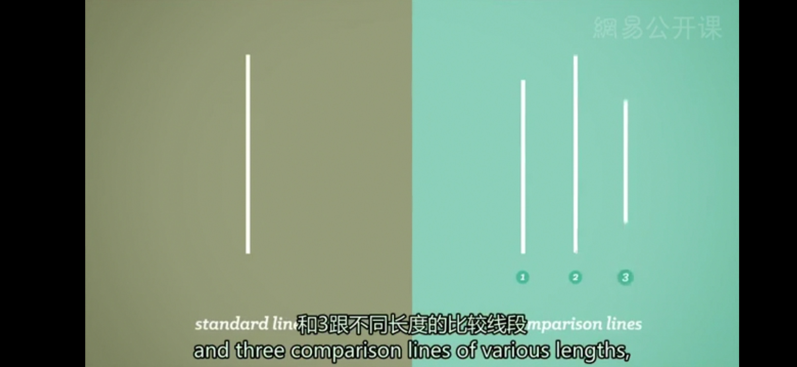

# 社会影响
* **米尔格拉姆的研究**
  * 开始于引起人们广泛关注的对于二战纳粹战犯阿道夫·艾希曼的审判；艾希曼以及其他纳粹为自己将成千上万人杀死的罪恶行径的辩护是，他们仅仅是在服从上级所下达的命令
  * 他制作了一个假的“电击装置”，装置上有30个按钮；每个按钮的电击强度依次增加，从最低的30伏特，到最高450伏特，按钮下方的标签从“轻微电击”“危险电击”到简单的“XXX”
  * 被试不知道的是抽签被做了手脚，所以他们抽到的总是“老师”，而米尔格拉姆的同事们则总是“学生”
  * 假学生被安置于房间内，绑在椅子上，手臂上接着电极，被试扮演的老师，也就是实验真正的研究对象，以及由演员扮演的研究人员，则一起进入另一个装有电击装置的房间，老师并不知道电击装置是假的，每当学生回答错误，他就要给予学生电击惩罚，每一次电击的强度都要有所增加；从这里开始，学生会故意给出错误的答案，诱导被试执行电击，如果被试表现出犹豫，研究者会下达命令来确保被试继续
  *  这些命令有**4种形式**，第一种仅仅是“请继续”，如果被试不服从，研究者会说“实验要求你继续”，以及“你继续下去是完全必要的”，到最终的“你别无选择，你必须继续”；大约2/3的被试最终都执行了最高的450伏特电击，所有的被试都执行了至少300伏特的电击
  * 当下达命令的人就站在被试的身边，表现出具有**较高的权威**，特别是当他们来自权威机构时，被试服从的水平最高；同样还有，当受害者被**去个性化**，或被安置在较远的地方，比如呆在另一个房间；另外，被试更容易服从命令，如果他们没有看到任何人反抗，因为**缺乏反抗的榜样**
---
* 米尔格拉姆开创性的研究赤裸裸地揭示了社会心理学中拥有巨大力量的两个关键的基础话题：**社会影响**（Social Influence）和**从众**（Conformity）
* **从众**：描述了我们如何调整自己的行为或思想来迎合我们所属群体的行为或规则；有些从众行为只是对他人**无意识自动化的模仿**（Automatic Mimicry），比如你很可能会笑，如果周围的其他人都在笑，正因如此，群体行为是十分有传染性的
* 波兰裔美国心理学家所罗门·阿希的实验：实验中的被试并不知道坐在一起的其他人其实都是托儿，故意给出了错误的答案，这引起了真正的被试在相信自己的眼睛与从众之间的挣扎，最后大多数的被试仍然给出了第二条线一样长的正确答案，但超过1/3的被试基本很愿意**给出错误的答案来与群体保持一致**

* 当个体**发自内心地认同群体**，这可能是由于**群体的地位**、**群体成员的吸引力**，或是个体感到**他人正在关注自己的行为**，我们往往更容易从众
* 人们从众的原因各种各样，但他们都强调情境力量对于从众的作用，不论这个情境是否涉及到对权威的尊重，害怕变得与别人不同，害怕被排斥，还是简单的渴望获得赞同，这被称为**规范性社会影响**（Normative Social Influence），这个观点认为，我们从众是因为需要获得爱与归属感
* 不过当然，群体对于我们行为的影响远远不止从众和服从；举个例子，当有他人在场时，我们的表现可能变得更好或更糟糕，这叫做**社会助长作用**（Social Facilitation）
* 当我们个人的努力被淹没在集体中时，我们往往会不那么努力，这叫做**社会懈怠**（Social Loafing）
* **去个性化**（Deindividuation）：处于群体中的人会**丧失自我意识和自我控制**，成为群体中的一员会同时产生**情绪唤醒**和**身份匿名**的强大效果，这是骚乱、暴动和网络暴力产生的部分原因；我们越是丧失个体意识，就越会纵容我们所属群体的所作所为，不论其结果是好是坏
* **群体极化**（Group Polarization，“我们vs他们”动态过程）：我们自身的态度和信念，当在群体中获得认同时，会变得更加强烈；最容易引起群体极化的是什么东西就是网络，但它也确实产生了很棒的效果，促进教育的传播以及募捐
*  群体力量不仅能够影响我们的个人判断，它同样还能影响更大范围的决策，有时甚至是民族层面的；社会心理学家欧文·詹尼斯提出了**群体思维**（Groupthink）这个词，来描述群体会做出重大的错误决策，由于每个成员的思维过分局限于群体自身的内部逻辑
---

