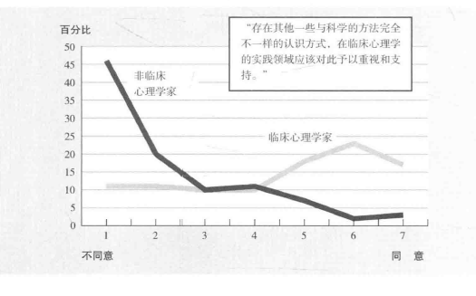
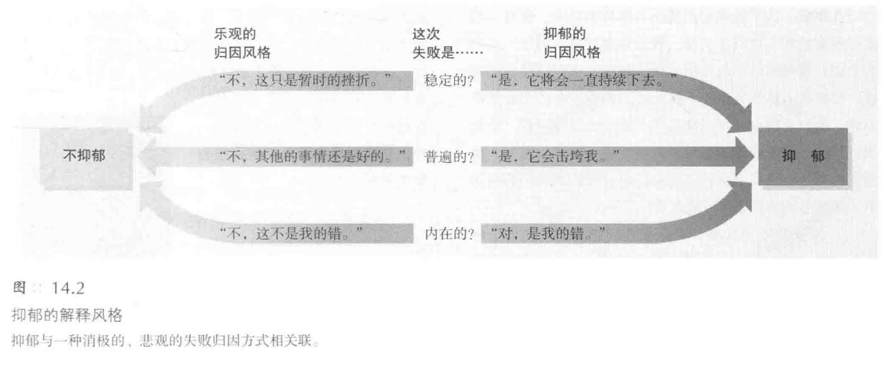
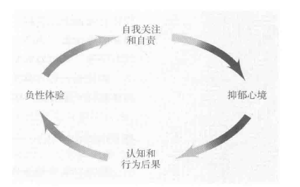
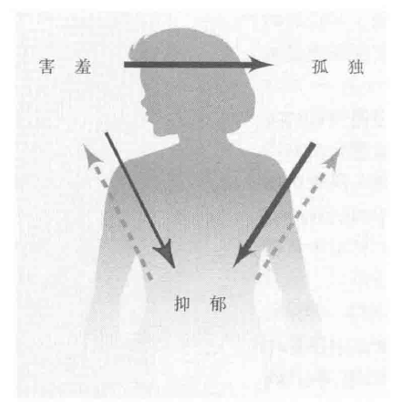

[TOC]
# 社会心理学在临床领域中的应用
## 导致临床诊断偏差的原因
### 简介
#### 决策中的客观与主观判断
- 临床专家面临选择：**依赖直觉还是数据和公式**
- 多数临床专家偏好**内心经验和直觉**
- 与非临床心理学家相比，临床心理学家更倾向于**非科学的“认识方式”**

#### 社会临床心理学观点
- 临床诊断视为**社会决策的一种形式**
- 精神疾病的社会认知构建被视为社会决策
- **詹姆斯·马达克斯**（James Maddux）强调，对非典型行为的诊断治疗可视为**利益驱动的社会建构**

#### 临床诊断中的社会决策
- **社会影响**：组织利益和社会价值观对诊断的影响
- **疾病标签的社会建构**：例如躯体形式障碍、对立违抗障碍、性欲衰退障碍、性高潮障碍
- 马达克斯提出，健康与疾病的社会建构不影响医学的科学性

#### 临床诊断中的偏差
- 相关错觉、事后聪明、自我证实诊断等影响临床诊断
- 心理健康工作者需**了解形成印象的过程**以避免误诊
- 了解社会心理学原理可帮助临床专家进行更精准的诊断

### 相关错觉

#### 错觉的形成
- 人们倾向于**在不相关的事物间发现关系**，尤其是当存在预期联系时
- 例子：预感与事件的**巧合联系**
- 忽视不符合预期的例子，只关注**支持预期的情况**

#### 临床学家中的相关错觉
- 假设：性障碍患者可能对**罗夏墨迹测验**（Rorschach Inkblot Test）有特殊反应
- 临床学家基于**经验**，认为**曾见过此类联系**

#### 探索知觉与错觉
- 方法：用不同临床心理学家进行测试与评定，**重复过程**
- 结果：某些测试确实**预测性强**，但罗夏墨迹测验和画人测验等的**相关性低于预期**（Lilienfeld & others, 2000, 2005）

#### 临床学家对模糊测验的信心
- **开创性实验**：Chapman & Chapman (1969, 1971)研究
- 参与者：大学生和专业临床学家
- 发现：若期望特殊联系，**常能找到相关性**，即使数据不支持
- 实验：画人测验中，临床心理学家发现了非多疑者更多奇异眼睛的图画，尽管实际数据不支持

#### 广泛的错觉思维
- 不仅限于临床心理学家，也存在于政治分析家、历史学家、体育解说员等
- **作者自省**：研究者也可能**忽视自己理论的缺点**
- 学术刊物的审稿过程**减少这种错觉**

### 事后聪明与过分自信

#### 事后聪明现象
- 自杀案例中的反应：常见的反应是认为**自杀是可以预料并阻止的**
- 实验表明：知道自杀发生的参与者**倾向于报告他们能预见到这一事件**（Goggin & Range, 1985）
- 导致家人、朋友、治疗师陷入**负罪感**

#### 罗森汉实验（Rosenhan Experiment）
- 目的：测试心理健康工作者的**临床洞察力**
- 方法：**罗森汉**（Rosenhan）和同事假扮病人，仅声称“**耳鸣**”进行住院
- 结果：多数被诊断为**精神分裂症**，住院两三周
- 事后诊断：医院治疗师根据**假病人的行为和生活事件**“确认”诊断

#### 事后解读的误用
- 病人与父母关系的描述被解读为**对亲密关系的矛盾态度**
- 病人努力控制情绪被视为情感不稳定性的体现

#### 罗森汉的后续实验
- 目的：进一步验证**事后解读的误用**
- 方法：告诉同行**将有假病人预约他们的医院**
- 结果：在193名新入院病人中，41名被认为是假病人，实际上**无一是假病人**

### 自我证实的诊断

#### 实验背景
- 目的：探索**临床医生的期望对病人提供信息的影响**
- 方法：通过**不同的假设**（如外向或内向）检验人们对他人特质的看法

#### 斯奈德和斯旺实验（Snyder & Swann, 1984）
- 研究内容：给参与者**关于他人特质的假设**，让他们进行验证
- 发现：人们通过寻找**能够验证某一特质的信息**来做测验
- 示例：如果人们想验证某个人是否外向，他们就会问与外向有关的问题，反之亦然

#### 法齐奥实验（Fazio & others, 1981）
- 结果：被问及“外向问题”的参与者事后**真的觉得自己更加开朗**
- 观察：结束测验后，实验者能以70%的概率猜中参与者之前参加的是哪种测验

#### 心理治疗中的自我证实现象
- 病人的行为**总符合治疗师的理论假设**（Whitman & others, 1963）
- 例子：100位健康、成功的成年男性童年充满了“创伤性事件”，常被用来解释精神问题

#### 斯奈德的推测
- 案例：治疗师对男同性恋者**与母亲关系不好的预设假定**
- 结果：治疗师倾向于**询问与这种假设相符的问题**，从而得到自己预期的答案

### 临床预测与统计预测

#### 临床预测的问题
- 临床医生和访谈者常依赖**直觉判断**，忽视**统计数据**
- 直觉（即使是专家的直觉）通常**比统计预测不可靠**（参考：Faust & Ziskin, 1988; Mehl, 1954; Swets & others, 2000）

#### 米尔的研究（Mehl, 1986）
- 对**90项研究**进行分析，涵盖从足球比赛结果到肝病诊断
- 只有**6个研究结果**支持临床直觉预测
- 结论：**统计预测比直觉预测更可靠**

#### 明尼苏达大学的元分析研究（Gove & others, 2000）
- 分析134项研究，关于人类行为预测、心理诊断或医学诊断
- 只有8项研究显示**临床预测优于统计预测**
- 在**面对面访谈**条件下，临床预测效果更差
- 结论：临床预测准确性存在**显著偏差**，需要**更多证据支持**

#### 统计预测与临床直觉的结合
- 把统计预测交由专业临床学家修正和改进，结果**常更差**（参考：Daws, 1994）
- 原因可能是临床学家**忽视统计数据**，**依赖直觉**

#### 米尔对临床直觉的批判
- 认为**使用低效手段进行预测是不道德的**
- 直觉预测常被**过高评估**，忽视更有效的统计预测方法

#### 道斯对直觉预测的分析（Dawes, 1976）
- 指出面试官**高估了自己的认知能力**
- 统计数据（如GPA、GRE成绩）通常更准确

#### 丹尼利特和雷迪克的实际案例（Dannelet & Redick）
- 使用**行为预测方法**准确预测犯罪风险
- 案例：预测克雷蒙斯可能再次违法犯罪，后来证实准确

### 对更好的临床实践的启示

#### 避免相关错觉
- 警惕**因期望而建立不存在的关联**
- 避免因**少数显著事件**而错误认为联系普遍存在

#### 对待事后聪明
- 事后聪明具**诱导性**，易导致**过度自信或自责**
- 需认识到其**潜在的误导性**

#### 防止自我证实的诊断
- 避免只提支持假设的问题
- 尝试**从相反方向验证问题**

#### 记录与记忆
- 信赖**记录**而非记忆
- 记录可以提供**更客观、可靠的参考**

## 伴随心理障碍的认知过程

### 抑郁

#### 抑郁患者的思维特点
- 倾向于**消极思考**，看待生活的观点**极端负面**
- 重度抑郁症患者经历价值感丧失、生活缺乏兴趣、饮食和作息不规律等症状
- 对于积极建议的反应往往是**悲观和不切实际**的

#### 扭曲事实还是现实主义

##### 抑郁现实主义（Depressive Realism）
- 研究表明轻度抑郁的大学生**对自己控制程度的判断更准确**
- 正常学生的**判断歪曲**，夸大自己的控制能力
- 抑郁患者在某些情况下展现出“**悲观而明智效应**”（Sadder-But-Wiser Effect）

##### 抑郁症患者与正常人的对比
- 正常人常夸大自身能力和受欢迎程度，而抑郁症患者不会
- 正常人记忆中加上玫瑰色光环，抑郁症患者记忆更客观
- 正常人倾向于自我正面评价，抑郁症患者描述正负品质
- 正常人归因成功于自己能力，失败推给他人；抑郁症患者归因于自己
- 正常人夸大自身对事情控制能力，抑郁症患者对控制有更现实认识
- 正常人对未来有不现实的积极预期，抑郁症患者对未来认识更现实

##### 抑郁症患者的归因模式
- **消极的解释风格**（Explanatory Style）：把失收和挫折归因于**稳定、普遍、内在因素**
- 导致**沮丧和绝望感**，与正常人相比表现出更多**消极解释**

##### 研究结果
- 艾布拉姆森等人（Abramson & others, 1989）研究：抑郁症患者的消极、泛化、自我责备的思维导致绝望感
- 研究涉及15000名对象：抑郁症患者与正常人的解释**风格差异显著**

#### 负性思维是抑郁的原因还是结果

##### 抑郁心境导致负性思维
- **心境影响思维**：快乐时思维积极，抑郁时思维消极
- 抑郁状态下，人们的**回忆和期望急剧下降**
- 抑郁患者对父母的记忆更倾向于认为受到**忽视和惩罚**
- 心境影响对未来事件的预期：不利事件导致**消极预期**

###### 研究案例
- 赫特和同事（Hit & others, 1992）：印第安纳大学篮球迷心境与思维关系研究
- 斯特拉克和科因（Strack & Coyne, 1983）：抑郁症患者社会行为影响研究
- Burchill & Stiles（1988）和 Joiner（1994）：宿舍抑郁症患者影响他人研究
- Katz & others（1999）：恋爱中抑郁传染研究
- Fowler & Christaki（2008）：快乐传染追踪研究

###### 抑郁心境对认知和行为的影响
- 抑郁心境影响**记忆和期望**
- 抑郁行为可能导致**社会拒绝**
- 抑郁情绪在社会环境中具有**传染性**
- 快乐情绪也具有传染性

###### 抑郁与认知的关系
- 抑郁可能由**认知方面的根源**引起
- 抑郁与消极思维之间存在**相互影响关系**

##### 负性思维导致抑郁心境

###### 压力与抑郁
- **压力**如失业、离异、被排斥、身体创伤导致**抑郁感**
- 短暂抑郁具**适应性**，类似身体对毒素的反应
- 抑郁让人放慢步伐、重新评价自己、重新组织能量

###### 抑郁的思维方式
- **抑郁倾向**的人对不良事件**过度反刍和自责**
- **自尊**受成功提升和威胁下降的**影响大**
- 压力带来的消极思考被**过滤和选择**，长期压力可能导致抑郁
- 萨克斯和巴吉特尔研究：**消极解释风格**的女性因社交失败感到抑郁
- 负性思维导致**负性情绪和行为**

###### 性别差异
- 女性在困境中更易于**过度思考**，与男性行动取向不同
- 青少年期女性抑郁风险是男性的**两倍**

###### 长期观察研究
- 持**乐观思维风格**的人抑郁比率低，**悲观思维风格**的人抑郁比率高
- **塞利格曼**观点：抑郁由**悲观主义**引发

###### 负性体验与抑郁的循环
- 莱文森等人研究：**负性体验**如学业失败、家庭冲突或社会拒绝导致抑郁
- 负性体验、自责和抑郁情绪相互影响，形成**恶性循环**
- 轻微抑郁症患者**转移注意力到外部任务**可改善心境

###### 西方社会中抑郁流行的原因
- 塞利格曼观点：**自我关注和自责**是西方抑郁流行的原因
- 现代年轻人面对挫折时**更易绝望和自责**
- 非西方国家重视**关系、和睦、合作**，抑郁不那么普遍
- 日本抑郁症患者更多报告因**使家人或合作者失望**而感到羞愧

###### 思维风格与其他心理问题的关系研究
- 学者们研究思维风格与孤独、害羞、虐待等心理问题的关系
- 探讨受困扰人群的**自我观点、记忆处理、归因方式**

### 孤独

#### 感到孤独和被排斥

##### 孤独的定义与特性
- 孤独：感觉**社会关系不如预期丰富**或**意义深远的痛苦体验**
- 孤独**不等同于孤单**，可在人群中感到孤独，也可独处不感孤独
- 孤独感与**被群体排斥、不被周围人喜欢或感觉像异类**有关

##### 孤独在现代社会的流行
- 近年来美国**孤独人数增加**，社会关系减少
- 罗伯特·普特南观察到显著的**代际孤独差异**
- 个人主义文化、电视等被认为是孤独增加的原因

##### 孤独的原因
- 吉尔维尔德研究：荷兰成人孤独与未婚、已订婚状态有关
- 现代社会强调个人实现、**贬低婚姻和家庭生活**可能是原因
- 工作相关流动性导致**长期家庭关系和社会纽带减少**

##### 遗传影响
- 孤独感具有**遗传影响**，同卵双胞胎更可能共享孤独感

##### 孤独与健康问题
- 孤独对**应激激素和免疫功能**有影响，增加**多种疾病风险**
- 孤独感受者的负性思维和消极行为可能传染，形成**社会集群效应**

##### 年龄与性别差异
- **青少年**比成人更易体验孤独
- **男性**在群体孤立时感到孤独，**女性**在失去亲密关系时感到孤独

##### 孤独的适应性
- 孤独可作为寻求社会联结的信号，**促进生存**
- 怀旧情绪可能是孤独的适应性响应，**提醒寻找社会联系**

#### 消极地知觉他人

##### 孤独者的消极社会思维和行为
- 长期孤独者存在**自我挫败的社会思维和行为模式**
- 与抑郁症患者类似，孤独者具有**消极的解释风格**
- 认为自己在社交中给人留下**不好印象**，对不良社会关系自责
- 觉得**大多数事情不受自己控制**（Anderson & others，1994；Christensen & Kashy，1998；Snodgrass，1987）

##### 孤独者的消极认知
- 孤独者在与同性别陌生人或大学室友合作时易形成**负性认识**
- **缺乏社交安全感**，行为方式常导致所担心的社会拒绝（Stinson & others，2011）

##### 孤独、抑郁与害羞的相互强化
- 孤独、抑郁和害羞可能**互相强化**，形成恶性循环

##### 孤独者的负性观点对社交的影响
- 觉得自己不具社会价值，对他人抱有消极看法，**阻碍减少孤独的行动**
- 在自我介绍、打电话、参与团队活动时**感觉困难**（Numi & others，1996，1997；Rook，1984；Spitzberg & Hurt，1987）

##### 孤独者的敏感性和辨识能力
- 与轻度抑郁症患者类似，孤独者对他人**更敏感**，善于辨识不同情绪表达（Gardner & others，2005）