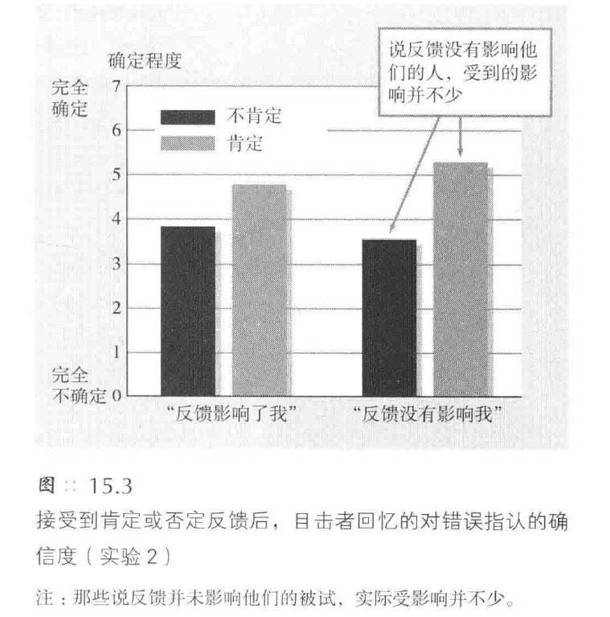
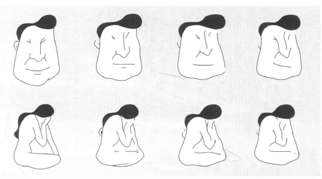
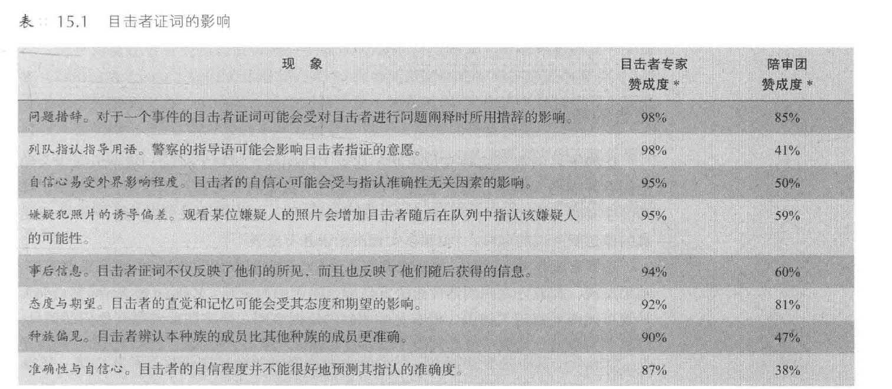
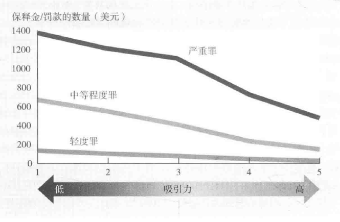
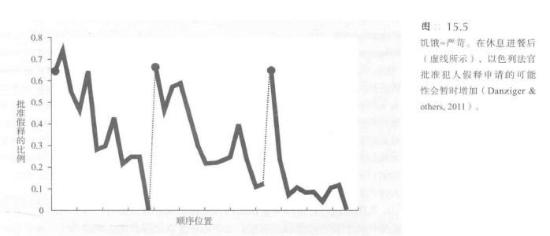
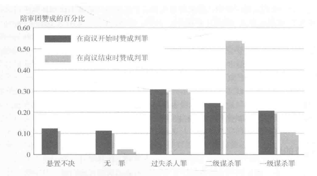

[TOC]
# 社会心理学在司法领域中的应用
## 目击者的证词是否可靠
### 目击者证词的说服力
#### 证词的影响
- 目击者证词**增加定罪率**: 从18%到72%的学生赞成定罪仅因目击者说“就是这个人！”
- 即使目击者视力差且未戴眼镜，定罪率仍然高达68%
- **证词可信度的质疑**能在一定程度上**减少定罪的人数**，但**不显著**

#### 证词的固执性
- 目击者证词**难以抹去**: 除非证词与另一个目击者**相矛盾**，否则难以从陪审员脑海中抹去
- **生动的目击者证词**比抽象信息**更具说服力**

#### 陪审员对证词的判断
- 陪审员**无法区分**正确与错误的目击者: 相信正确和错误目击者的比例均为80%
- **观察条件**对陪审员信任度有影响: **良好观察条件**下目击者更被信任
- 细节记忆与准确性的误解: 陪审员怀疑**无关细节记忆差**的目击者，尽管他们往往在事件上**最准确**

#### 错误定罪的例子
- **詹姆斯·纽瑟姆**案例: 三位目击者的证词导致他被错判入狱15年，后因指纹技术揭示真正的罪犯而释放
- 真正罪犯与纽瑟姆在身高和外貌上有**显著差异**

### 当眼见不为实时
#### 目击者证词的不准确性
- **错误辨认**导致无辜人士入狱，DNA检测解救了250多名被错误判罪的人
- 大部分案例由**目击者错误**辨认所致，占76%

#### 研究揭示目击者的准确性问题
- 模拟犯罪事件的研究显示目击者证词**常不准确**
- 实验例子：加利福尼亚州立大学的“骚扰”**案件模拟**，66%的学生错误辨认无关人员
- 英国和威尔士的**实地实验**，大约40%的目击者正确识别嫌疑犯，40%认为嫌疑犯不在照片中，20%错误指认

#### 目击者的过度自信问题
- 陪审团倾向于**信任自信的目击者**，尽管他们的证词可能不准确
- 实际上，自信的目击者的证词**并非总是更准确**
- 在被DNA证据推翻的案件中，目击者最初**并不确定**的情况占57%

#### 记忆的可靠性问题
- 人的大脑不是录像机，知觉和记忆易出错
- “**改变言目**”实验显示人们**未察觉到无关人员的替换**
- 对**其他种族面孔的识别**尤其容易出错

#### 强烈情绪对记忆的影响
- **情绪体验**可能破坏目击者的记忆准确性
- 实验：伦敦地牢恐怖迷宫参观者情绪波动大者辨认错误最多
- 军事心理学家的实验：**高压力审讯环境下**士兵的辨认准确率只有30%

#### 种族间的辨认误差
- 对其他种族人脸的辨认存在**高度的自信**但也伴随**高错误率**
- 多数人**不能准确辨认**曾危害过他们的人

### 误导信息效应
#### 洛夫特斯的实验
- 实验展示了**机动车和行人相撞**的过程，后**通过提问改变目击者的记忆**
- 提问中改变“停止”和“避让”路标，导致目击者**回忆错误**
- 正确回忆率从75%下降到41%，证明了误导信息的**强大影响**

#### 误导信息的进一步研究
- 暗示性问题后，目击者可能**错误记忆事件细节**，如红灯变绿灯
- 误导信息混入记忆尤其当**信任提问者且问题重复时**

#### 错误记忆的影响
- 错误记忆对成人和儿童都有影响，尤其**儿童**易受误导
- 误导信息导致的虚假记忆与真实记忆**一样有说服力**
- 错误记忆可导致**错误控告**，如儿童性虐待案中的儿童记忆干扰

#### 儿童的易受暗示性
- 通过**重复暗示性问题**，58%的学龄前儿童会详细讲述未发生的事件
- 即使专业心理学家也**难以区分**真实记忆和错误记忆
- **暗示性对话**导致大多数儿童产生**错误报告**

#### 想象膨胀现象
- 即使大学生仅仅**想象童年事件**，也会有1/4的人相信这些事件真实发生
- 想象和真实经历激活的脑区相似，导致**想象膨胀现象**

#### 虚假供述的来源
- 误导信息诱发的错误记忆解释了**虚假供述现象**
- 250个通过DNA证据洗清的案件中，40个涉及虚假供述
- 虚假供述包括**屈从型虚假供述**和**内化型虚假供述**

### 重述效应
#### 重述事件对记忆的影响
- **准确的重述**可以帮助人们**更好地抵制误导信息**
- **重复重述**会使人们**越来越相信**谬误是真实的
- Bregman和McAllister的研究支持了这一点

#### 重述对法庭案件的影响
- 目击者重述回答后，增强了**对自己错误证词的信心**
- 听到错误证词的陪审员更可能给无辜的人判罪
- Wells等人的研究证实了这一现象，增强了对错误证词的信心

#### 调整证词对记忆的影响
- 人们常常**调整证词**来迎合听众，**逐渐相信**调整过的信息
- 在温和律师采访后，目击者的证词**更偏向被告**
- Sheppard和Vidmar的研究支持了这一观点

#### 调整证词的方式
- 目击者**改变说话的语调和用词**，以迎合他们认为自己是被告还是原告的身份
- 调整证词并非省略重要事实，而是通过改变语调和用词来**歪曲印象**
- Vidmar和Laird的实验结果证实了这一点

### 减少目击者证词错误

#### 训练警察询问者
- 面询应允许目击者**进行未经提示的回忆**
- 启发性问题引导目击者**回忆细节**
- Fisher等人的研究表明，认知面询方法能**大量增加信息量**，不增加错误率

#### 管理嫌疑人列队指认方法
- **提醒**目击者嫌疑人可能不在列队中
- 使用**无信息的控制队列**，排除错误指认
- 提供**单个嫌疑人的连续队列**，减少错误比较

#### 快速辨认的准确性
- **快速辨认**通常**更准确**
- Dunning和Perretta的研究显示，10-12秒内辨认的准确率接近90%
- 连续队列可以**降低错误指认率**

#### 训练陪审团
- 增强陪审员对**目击者证词影响因素**的理解
- 专家证人帮助陪审员评估证词可靠性
- 提供关于目击者证词**可信度的教育**

#### 提高目击者证词的司法程序
- 实施**双盲检测**，避免操纵目击者指认
- 使用**计算机**进行列队指认，增强控制和公正性
- 加强法律实践中对目击者证词的理解

## 影响陪审团判断的其他因素
### 被告的特征
- 被告的**吸引力和社会地位**可能影响陪审团的判断
- 与陪审团成员的**相似性**（如年龄、性别、种族）可能导致偏差
- 达罗的观点虽有一定道理，但陪审团能够**基于事实作出判断**

#### 陪审团的决定与法官的认同
- 研究显示在**大多数案件**中法官**认同**陪审团的决定
- 证据表明陪审团能够**超越个人偏见**，基于事实作出决策
- **社会地位较高**的被告通常得到**较为宽大的处理**

#### 实验研究
- 实验者通过变化**被告的吸引力**和与**陪审团的相似性**来观察其对判断的影响
- 模拟陪审团在被呈现**相同基本事实**的案件下，如何受到这些因素的影响
- 实验结果揭示**外部因素**如被告特征对陪审团判断的潜在影响

#### 外表吸引力
##### 实验研究发现
- 外表吸引力的**刻板印象**影响对犯罪的判断：**吸引力高**的被告更可能被认为无罪
- 实验显示，当**证据不明确**时，审判结果受到被告外表吸引力的影响
- 吸引力高的人被认为**不太可能犯罪**，更容易获得轻判

##### 娃娃脸效应
- 具有娃娃脸特征的被告看起来**更天真无邪**，更易被判为**过失犯罪**
- **不具有吸引力的人**在性侵犯案件中被认为**更危险**
- 人们倾向于**根据外表特征判断被告的罪行性质**

##### BBC电视台实验
- 观众对模拟被告的判断受外表影响：**符合罪犯刻板印象**的被告有更高的有罪判断率
- **吸引力高**、具有**娃娃脸特征**的模拟被告有**较低的有罪判断率**

##### 现实生活中的影响
- 法官对外表不吸引力的被告判处**更高的保释金和更严厉的处罚**
- 外表影响可能与被告的**社会地位**或法官对**其犯罪倾向的判断**有关
- 存在忽视外表影响的建议，但实际审判中外表吸引力仍然是一个重要因素

#### 与陪审员的相似性
##### 影响陪审团的好感因素
- 相似性原则表明，陪审员对与自己有**相同观点、种族或性别**的被告更具同情心
- 种族偏见一般**较小**，但对非本种族的被告表现得**不那么友好**

##### 实验和研究案例
- **政治观点相似**的被告更可能被判为**轻罪**
- **证词语言相同**的被告更可能被认为**无罪**
- 原告和法官**同种族**时，审判结果更令原告满意

##### 种族和罪行刻板印象的影响
- 种族符合罪犯**刻板印象**的被告，如白人犯贪污罪、黑人犯汽车盗窃罪，裁决和处罚**更严厉**
- 在种族问题**不明显**的情况下，声称无种族偏见的白人在审判中**表现出种族偏见**

##### 实际案例分析
- **黑人被告**在相同犯罪严重性和犯案历史下，判刑期**比白人长**
- 谋杀白人的黑人**被判死刑概率**高于谋杀黑人的白人
- 具有**更多非洲人核心面部特征**的黑人被判处更长刑期

##### 对陪审团判断的启示
- 陪审团对一个认同的被告**更有同情心**
- 在**性骚扰案件**中，男性比女性**更易认为被告无罪**
- 在审判中，**证据的质量**比个别陪审员的偏见更重要，特别是当证据清晰且陪审团专注于证据时

### 法官的指示
#### 法官指示的有效性
- 法官的指示**难以消除**不被允许证词的影响
- 法官的命令**忽略特定证词**有时会**适得其反**，增强证词的影响力
- 法官**不能**轻易从陪审员头脑中**抹掉不被允许的证词**

#### 强奸案保护法令
- 旨在**禁止或限制**关于**受害者先前性行为**的证词
- 即便法官指示忽略此类证词，陪审团**难以完全排除其影响**

#### 实验研究发现
- 实验显示法官指示忽略**录音带证词**未能消除其对陪审团判断的影响
- 带有**情感色彩**的信息更难被陪审团忽略

#### 审讯前公开报道的影响
- **审讯前的公开报道**难以被真实陪审团忽略
- 模拟陪审团即使发誓保证公正，也**不能完全排除前期信息的影响**

#### 减少不被允许证词影响的策略
- 法官可以通过**审讯前的训练和指导陪审团成员**，提高他们对审讯程序的理解
- **删除**未经许可的证词部分，使用录制证词的录像带可以更好控制不被允许的证词
- **提前切断**不被允许的证词，避免陪审团接触到可能影响判断的信息

### 其他法庭影响因素
#### 严厉处罚的影响
- **严厉处罚**可能导致陪审员**不愿做出有罪判决**
- **死刑等重刑**会影响检察官提出的刑罚建议
- 陪审员在面对可能的死刑判决时表现出**更大的谨慎**

#### 陪审员经验的影响
- 有经验的陪审员与新手陪审员**在判决上存在差异**
- **经验丰富的陪审员**可能更了解法律程序和评判标准
- 陪审员的**经验水平**可能影响他们的**判决结果**

#### 受害者特征的影响
- **受害者的特征**会影响陪审团的判决，包括**过失和刑罚的判断**
- 受害者**吸引力高或受害严重**时，可能导致被告受到更重的刑罚
- 例如，“地铁巡警”**伯纳德·戈茨案件**中，受害者的犯罪记录和攻击性质影响了公众和陪审团的判断

#### 公众情绪的影响
- 公众对案件的**情绪反应**可能影响陪审团的判决
- 在某些案件中，如戈茨案，公众**对受害者的背景知识**可能导致对被告的同情
- 陪审团的决定可能受到**公众舆论和媒体报道的影响**

## 个体陪审员的影响因素
### 陪审员的理解
- 陪审员倾向于首先**构建一个让所有证据都合理的故事**
- 不同陪审员可能**根据个人观点编织不同的故事**
- 以**叙事形式提出的证据**更能说服陪审员，特别是在重罪案件中

##### 理解指示
- 许多陪审员**不理解法官使用的标准法律术语**
- 法律术语在法律界有**明确的含义**，但陪审员可能有**不同理解**
- 法官指示陪审团**避免过早下结论**，但研究显示人们有这种倾向

##### 法官的指令对陪审团的影响
- 法官指示陪审员在权衡新证据时**避免过早判断**
- 实际上，陪审员可能因各种原因**遗漏要点或关注不相关问题**
- 陪审员可能**屈从于偏见**，对诉求的真实性判断不准确

##### 陪审团成员之间的相互影响
- 陪审团成员间在讨论案情时会发现**彼此的故事不同**，导致意外
- 陪审员间的**互动和讨论**可能影响最终的判决
- 陪审员**个人的态度和个性**对群体商议过程有重要影响

##### 伊梅尔达·马科斯案例的启示
- 案件中**陪审员的选择**排除了对被告有先入为主观点的人
- 陪审员**对复杂案件的不了解**可能导致对被告的同情
- 在**伊梅尔达·马科斯**案中，陪审员**对她的同情**影响了审判结果

#### 理解统计信息的影响
##### 血型证据的误解
- 辛普森案中**血型与辛普森相符**，控方认为凶手可能性为99.5%，但辩方指出可能是洛杉矶四万人中的任何一个
- 实际上，血型证据重要性在于很少有人可能被认为是嫌犯，而不是单纯的血型匹配
- 控方和辩方的解释都**忽略了案件的其他相关因素**

##### DNA证据的挑战
- 精确的DNA匹配**增加了证据的可信度**，但也引起了对DNA测试可靠性的怀疑
- 在大城市中，由于人口众多，匹配特定DNA的可能性增加，影响了DNA证据的说服力
- 数字和统计数据需要**有可信的细节来支持**，以**提高其说服力**

##### 法庭上的故事与证据
- 在法庭上，即使有**高概率统计支持**的证据，也需要可靠的法律证据和说服力的故事来支持
- 某些案例中，即使**统计数据显示**高概率匹配，法庭上的叙述和证据的**呈现方式**也可能影响判决结果
- 观众对法庭证据的期望**可能受到媒体影响**，如《犯罪现场调查》等节目，导致对证据数量和质量的不合理期望

#### 增强陪审员的理解
##### 提供法院文本
- 为了**减少误解**，应允许陪审员**接触法院文本**，避免他们仅依靠记忆处理复杂的信息
- 提供文本可以帮助陪审员**更准确地理解和回忆**法官的指示以及相关的法律信息

##### 设计清晰的信息提供方式
- 社会心理学家正在研究如何以**更清晰、更有效的方式**提供信息给陪审员
- 当法官以**具体的数量标准**（如51%、71%或91%的确定性）来规定证据标准时，陪审员能**更好地理解和作出判断**

##### 简化法律指示
- 必须以**更简单的语言**向陪审员说明法律指示，以减少受法官偏见影响的可能性
- **简化的法律指示**可以帮助陪审员**更准确地理解**他们的职责和判决标准
- 通过简化语言重写的指示，陪审员**不太可能**误解或受到法律术语的迷惑

### 陪审团的选择
#### 利用个体差异
- **出庭辩护律师**利用陪审员选择过程来**组建对自己有利的陪审团**
- 依靠“**科学的陪审团选择法**”，试图**剔除对委托人持有偏见**的陪审员
- 法律顾问帮助律师**设计策略和挑选陪审员**，以发现**最微小的偏见迹象**

#### 陪审员预筛选
- 通过提问**揭露陪审员的先入之见**，例如对毒品的态度或对精神病医师证词的信任度
- **科学选择方法**有时被用于**排除**对案件特定特点有特定反应的陪审员

#### 实际效果和限制
- 尽管科学选择法结果**令人满意**，但陪审员的态度和个性特征**并不总能准确预测判决**
- **证据对陪审团判断的影响**比陪审员的**个性特点和态度**更大
- 法官和陪审员都努力追求**公正处理案件**，但**完全的中立**是一种**理想状态**

#### 其他影响因素
- 陪审团成员的个体差异包括**种族、性别、个人责任信念**等，这些差异可能影响他们对案件的判断
- 种族偏见与种族问题相关的案件判决有关，性别观念影响强奸或袭击妇女案的判决
- 陪审团成员的个性特点相比证据是一个**较弱的决定因素**，证据质量对判决的影响更大

### “死刑认定”陪审员
#### 偏见的影响
- 支持死刑的陪审员**更可能**被选入死刑案件的陪审团，倾向于**支持死刑起诉**
- 这些陪审员更关注**控制犯罪率**而非法律应有的程序
- 偏向于定罪的陪审员**更加专断**，无视减轻罪责的情况，对社会底层人士持**傲慢态度**

#### 法律体系的挑战
- 美国最高法院曾在1986年的判决中认为“死刑认定”的陪审员**确实存在偏见**
- 这些研究成果**缓慢改变了实际的法律工作**，尽管存在广泛的科学共识认为死刑认定陪审员面对的困难前所未有

#### 死刑的争议
- 死刑是否属于“**残忍的和罕见的刑罚**”是一个深层次的问题，多个国家已禁止死刑
- 美国公众对死刑的支持态度**正在软化**，但法院在量刑时是否过于专断、带有种族偏见，以及是否死刑能减少非法杀人，仍是**争议点**

#### 社会科学的立场
- 社会科学认为，允许判死刑的州刑事杀人案发率**并没有因此降低**
- 死刑的**量刑不一致**，辩护对于贫穷被告群体常常是**空虚无力**的
- 尽管存在矛盾的证据，**文化因素的加入测试**对于支持或反对死刑的立场都是重要的

### 群体因素对陪审员的影响
#### 初始不一致到最终一致的过程
- 大约2/3的陪审团成员在初始阶段**不会达成一致意见**
- 经过讨论后，95%的陪审团**能够达成一致**
- 群体讨论对于达成共识起着**决定性作用**

#### 预测群体决策
- **“2/3多数”原则**通常能预测陪审团的最终裁决
- 大多数案件中，最终裁决**符合初次投票中的多数意见**
- 少数情况下，**勇敢的少数派**能改变多数决定，但这种情况**极为罕见**

#### 少数派的影响力
- 少数派意见**偶尔能成为最终裁决**，尤其是少数派**一致、坚持并信心十足**时
- 少数派最有说服力的情况是**能够导致多数派成员改变立场**
- 少数派的影响力取决于其一致性、坚持不懈及能否引起多数派的某些成员倒戈

### 群体极化
#### 群体讨论增强初步意见
- 实验表明，**陪审团的审议过程**通常会加强成员的最初意见
- 高专断性的小组在讨论后倾向于**提出更严厉的惩罚**，而低专断性的小组则倾向于**更宽大的惩罚**
- 群体极化现象表明，通过讨论，**个体的初始倾向得到加强**

#### 群体多样性对判断的影响
- **种族混合的陪审团**比全白人陪审团在审议过程中表现得**更加宽容**
- 混合种族的陪审团对广泛的信息持**更开放的态度**，导致判断趋于缓和

#### 群体极化的研究案例
- 一项研究中，陪审团在讨论前大多数认为被告有罪，但对选择较轻的判决犹豫不决
- 经过讨论后，几乎所有人都同意被告有罪，且大部分选择了更重的判决，即二级谋杀
- 此研究显示，陪审团的讨论过程导致了**群体极化**，使得初步的判断倾向得到加强

### 宽容
#### 审议导致的宽容效果
- 实验表明，特别是当证据**不足以明确指向有罪**时，讨论后的陪审员**倾向于更加宽容**
- 即使**仅有少数支持无罪判决**，这种倾向通常也能够**占上风**，修改了“2/3多数原则”
- **真实陪审团的研究**也支持这一结果，表明在多数派未能占上风的案例中，结果通常**转向无罪**

#### 影响宽容的因素
- “**信息性影响**”可能**增强了宽容处理**，因为“无罪推定”和“排除合理怀疑”的原则给支持定罪的人**增加了证据标准**
- “**规范性影响**”也可能**导致宽容效果**，当认为法官倾向于定罪的被告实际无罪时，公正的陪审员可能会遇到**更加关心保护可能无辜被告的陪审员**

#### 群体判断的优势
- 研究表明，群体能比个体**更好地回忆审讯信息**，有时能**消除偏见**并将注意力**集中在事实证据上**
- 群体商议通过**信息共享**扩大了对案件的了解，可能产生**更好的集体判断**
- 总的来说，**12个人的集体智慧**确实似乎优于**单个个体的判断**

### 6人与12人陪审团的比较
#### 法院的变革
- **美国最高法院**在20世纪70年代早期允许**民事案件或非死刑的州内刑事案件**使用6人陪审团
- 法院还允许**并非一致意见的判决**，例如**路易斯安那州**基于9:3的选票判决
- **最高法院**认为小型陪审团或非一致陪审团与传统陪审团在**商议和决策**上**没有显著差异**

#### 批评与统计问题
- 批评**涉及统计问题**，如少数族群的代表性在小型陪审团中更难体现
- 在6人陪审团中，**支持无罪判决的少数派**只有一个人，而在12人陪审团中有两个人
- **心理学分析**表明，一个人的少数派比两个人的少数派**在抵抗群体压力上更困难**

#### 6人陪审团的不足
- 与较大的陪审团相比，**较小的陪审团**更少包含**少数族群成员**，对审判证词的回忆**不够准确**，商议时间**更短**，悬而未决的可能性更低
- 12人陪审团**面临悬而未决的可能性**是6人陪审团的两倍
- 米切尔·萨克斯认为，较大的陪审团**在多方面表现更佳**，例如多样性、准确性和做出正确判决的概率

#### 法院对6人陪审团的态度
- 最高法院**拒绝通过**佐治亚州的5人陪审团，但仍保留6人陪审团
- 法官**哈里·布莱克蒙**认为，5人陪审团**代表性弱**，不够精确，但同样的理由也适用于6人陪审团
- 尽管有批评，但最高法院**维持了对6人陪审团的承诺**

### 从实验室到生活：模拟陪审团和真实陪审团
#### 真实与模拟的差异
- **存在显著差异**：模拟案例的讨论与真实案例的**复杂性**和后果的讨论不同
- 真实场景的重现**极为真实**，参与者有时忘记这些仅是模拟
- 即使是模拟，参与者也**极其认真地投入到**公正判决的过程中

#### 高法对模拟研究的争议
- 1986年，美国最高法院就**模拟研究的有效性**进行了辩论，特别是在死刑案件中使用“死刑认定”陪审团的问题上
- 持反对意见的法官认为模拟研究**能够支持陪审团存在偏见的论证**
- 大多数法官认为对模拟研究结果的应用存在**强烈质疑**，认为法庭不允许使用真实的陪审团进行实验

#### 实验室模拟的辩护
- 实验室模拟为研究提供了一种控制条件下的**实际而廉价的方法**
- 实验室研究结果通常**在真实情境中得到很好的验证**
- 实验可以**帮助建构理论**，以解释复杂世界中的现象

#### 实验方法的核心
- 模拟现实生活的缩影，通过**改变一个或两个因素**来准确描述这些变化对我们的影响
- 社会心理学实验方法通过**模拟现实中的复杂情境**，提供了理解和预测人类行为的途径
- 尽管模拟**不能完全反映**真实世界的复杂性，但它们是理论构建和实验验证的**重要工具**

