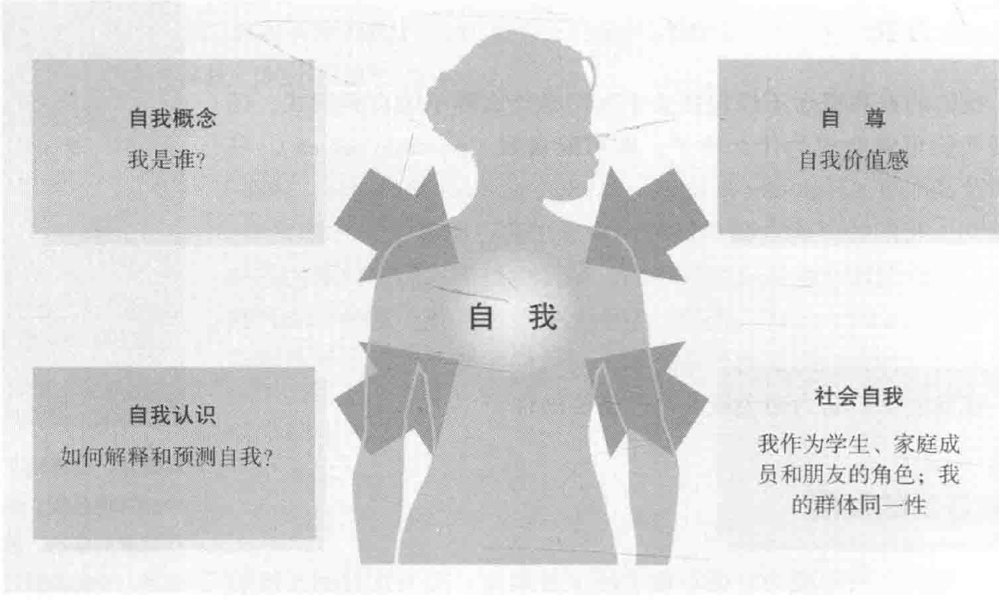
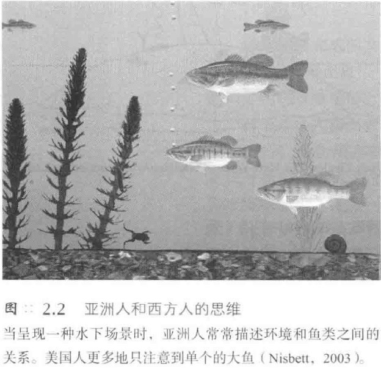

# 社会中的自我
## 焦点和错觉：对了解我们自己的启示
* **焦点效应**（spotlight effect）意味着，人类往往会把自己看做一切的中心，并且直觉地高估别人对我们的关注程度
  * 劳森对焦点效应进行了研究，以大学生为被试，让他们穿上前面印有“美国之鹰”的运动衫去见同学；约40%的被试确信同学会记住自己衣服上的字，但事实上仅10%的人会记住，大部分观察者甚至没有发现对方中途出去几分钟再回来时换了衣服
* 我们总能敏锐地觉察到自己的情绪，于是就常常出现**透明度错觉**（illusion of transparency）：如果我们意识到自己很快乐，我们会认为，我们的脸上就会清楚地表现出这种快乐，别人会注意到；而事实上，我们的表现可能比自己意识到的还要模糊不清
* 同样，我们也会高估自己的**社交失误**和**公众心理疏忽**（public mental slips）的显著性；研究发现，我们所遭受到的这些烦恼，别人经常注意不到，即使注意到也可能很快就会忘记
* **自我感觉与社会之间相互影响**
  * **社会环境对自我觉知的影响**：作为不同文化、种族、性别群体中的个体，我们会注意到自己和其他人的不同，以及他人对这些差异的反应
  * **带有自我服务色彩的社会判断**：当亲密关系比如婚姻关系出现问题时，个体通常会把责任更多地推到配偶身上；可是，当工作、家庭甚至游戏中的情况好转时，个体却往往会认为自己起了更重要的作用
  * **自我关注激发的社会行为**：为了给人留下好印象，人们经常为白己的外表感到头痛，并且关注其他人的行为和期望，并随之调整自己的行为
  * **社会关系有助于我们界定自我**：在多变的关系中，我们的自我也不断变化；我们如何看待自己，与此刻我们在关系中的角色紧密相连，而且当关系改变时，我们的自我概念也会发生变化
* 上述例子表明，我们和他人之间的交往是**双向的**；我们对自已的想法和感觉会影响我们对事件的解释和回忆，也会影响对其他人的反应，而他人也有利于我们进行自我塑造
## 自我概念：我是谁
### 我们世界的核心：我们的自我感觉
* 个人最重要的部分就是**自我**；你知道自己是谁，自己的性别，了解自己的感受和记忆
  * 为了研究自我感源于何处，神经科学家正在探究自我感觉的生理基础——脑部活动，有些研究表明大脑右半球有重要作用；把你的大脑右半球置于睡眠状态（往左颈动脉中注入麻醉剂），你很可能会无法识别自己的脸
  * “内侧前额叶皮层”是位于中央沟的一条神经通路，恰好在眼睛后面，它似乎能帮助你把对自我的感觉整合起来；当你思考自我的时候，它会变得很活跃
* 你的自我概念构成要素以及定义你的自我的那些特殊信念就是你的**自我图式**（self-schemas）
  * **图式**是我们组织自已所处世界的心理模板，我们的自我图式也就是**对自己的认识**，比如身强力壮的、超重的、聪明的等等，强烈地影响着我们**对社会信息的加工**
  * 这会影响我们如何感知、回忆和评价他人和自己，我们会特别记住**与自我图式一致的信息**
### 可能的自我
* 我们的自我概念不仅包括关于我们是什么样子的自我图式，还包括我们可能会成为什么样子，即**可能自我**（possible selves）
  * 我们的可能自我包括我们梦想中自己的样子，同样也包括我们害怕成为的样子；这种可能自我会激发出一种我们渴望的生活愿景，对我们能够产生巨大的**激励作用**，或促使我们努力**避免**成为自己害怕的样子

### 社会自我的发展
* 自我概念已经成为社会心理学的主要焦点，因为它有利于组织我们的思想并指导我们的社会行为；双生子研究发现，基因对人格和自我概念有重要的影响，但是社会经验也扮演了很重要的角色，这些影响包括：
  * **我们扮演的角色**
    * 当我们扮演某一个**新角色**时，我们可能就已经开始了**自我觉察**，该角色逐渐被我们的自我感觉所接受；当我们扮演角色时，我们会说我们实际上并没有刻意为之，但角色扮演渐渐会变成事实
  * **社会比较**
    * 我们如何判断自己是否富有、聪明或矮小？一种方式是通过**社会比较**（social comparisons）；我们周围的人会帮我们建立富有或贫穷、聪明或愚蠢、高大或矮小的标准：我们把自己和他人进行比较，并思考自己为何不同
    * 当结束了名列前茅的中学学习后，很多在学业上非常自信的学生发现，他们的学业自尊在进入了一些知名大学后受到了挑战，因为这些大学中的很多学生在中学毕业时都曾是班里的尖子生
    * 当我们评价某个人的表现时，不可能不把他和自己作比较；因此，我们可能会**为别人的失败而暗自高兴**，特别是当我们族妒的人遭受失败或遇到不幸，而我们不太可能遇到这种倒霉事之时
    * 社会比较同样会给人带来**烦恼**；当人们的财富、地位或业绩增长时，他们会**提高**对自己成就的评价标准，当人们攀爬成功的阶梯时，通常会**向上看**，而不是向下看，我们将自己与做得更好的人进行比较
    * 当面对竞争时，我们常常承认竞争对手本来就**固有一些优势**，以此来保护我们业已动摇的**自尊**
  * **其他人的评价**
    * 当别人认为我们很好时，我们也会认为自己不错；如果我们称赞某个小孩很有才华、刻苦学习或者乐于助人，那么这个孩子就会把这些观点**融入**其自我概念和行为中去
    * 社会学家**查尔斯·库利**以**镜像自我**（looking-glass self）这一概念，描述我们如何利用“我们以为别人怎么看我们”为镜子来认识我们自己；库利认为，我们根据**自己出现在他人面前的样子**来感知自我
    * 社会学家**乔治·米德**精炼了这个观点，他指出：与我们的自我概念有关的并不是别人实际上如何评价我们，而是**我们想象中他们如何评价我们**；我们通常感到赞扬别人比批评别人更自在，更倾向于恭维而不是嘲讽他人，因此，我们可能**高估了别人对我们的评价**进而膨胀了我们的自我意象
    * **自我膨胀**，正如我们所看到的那样，在**西方国家**中最常见；有心理学家报告说，日本人到北美后通常会因朋友间的互相恭维而感到惊讶
### 自我与文化
* 对于某些人而言（特别是那些西方工业文化中的人），**个人主义**（individualism）十分盛行，身份更多是独立的；青春期是与父母分离的时期，个体开始依靠自己，并且开始定义**个人独立的自我**
* 西方文化中的心理学假定，定义你的**可能自我**并相信你具有很强的**自我控制能力**会使你的生活富足；西方文学，从《伊利亚特》到《哈克贝利·费恩历险记》，大都赞美那些依靠自己成功的人
* 而亚洲、非洲和中南美地区的本土文化则把**集体主义**（collectivism）放在更重要的位置上，即个人要**服从集体**，并据此来定义自我；这种文化孕育了**相互依存的自我**（interdependent self），这些文化中的人们喜欢进行自我批评，却很少自我肯定
* 将文化鲜明的分为个人主义和集体主义似乎过于简单化了，因为任何文化中的个人主义都会在不同的个体之间有所**差异**；这种差异同样存在于同一国家的不同区域和政治观点之间
### 个人主义在文化内的滋长
* 文化也会随着时间而变化，且许多文化似乎正在**走向个人主义**；年轻、城市化、家境富裕、独生子女，具备这些现代特征的中国公民也更支持自我中心的说法，而有研究发现，从1980年到2007年间，流行歌曲歌词中“我”出现得越来越多，而“我们”出现的频率则降低了
* 究竞是关注“独一无二”的文化因素引起了父母对名字的选择，还是带行个人主义观念的父母希望他们的孩子与众不同而创造了文化呢？歌词中同样存在这个“**先有鸡还是先有蛋**”的问题，究竞是人们更关注自我，所以喜欢听关注自我的歌，还是听多了关注自我的歌，人们也变得更加关注自我？
### 文化与认知
* 社会心理学家**理查德·尼斯贝特**（Richard Nisbett）在《思维地理》中声称，**集体主义**会导致**不同的思维方式**
  * 想一想，以下三种事物：一只熊猫、一只猴子、一根香蕉，哪两者更可能在一起？也许是一只猴子和一只熊猫，因为他们都属于“动物”类？亚州人却比美国人更可能发现这样一种关系：猴子吃香蕉；当呈现幅栩栩如生的水下场景时，日本人自然地回忆出比美国人多60%的背景特征，且他们的回忆以对关系的描述为主（青蛙在植物旁边），而美国人把注意更多地放到焦点目标上，比如一条大鱼，而较少注意环境的特点

* 如果你生长在西方文化下，别人会告诉你，你可以通过自己的作品、所做的决策、购买的商品、甚至刺青和身体穿孔来“表现自己”；当被问及语言的作用时，美国学生更可能提及它的自我表达功能：而韩国学生却注重语言如何促进与他人的交流
* 一个具有相互依赖自我的人会有更强烈的**归属感**；当相互依赖型的人与家人、同事和朋友完全分开后，会失去那些定义自我的社会联系
* **相互依赖型的自我**并非一个单独的自我，而是多个自我的组合：为人子女的我、职场中的我以及作为朋友的我，等等；相互依赖型的自我存在于社会关系中，祖露心声的交流比较少，大多是**礼貌性交谈**，并且人们更多聚焦于寻求**社会支持**
* 与个人主义文化不同，在相互依赖型的文化中，社会生活的目标不是**提升个体自我或独立做出选择**，而是**协调并支持所处的群体**
