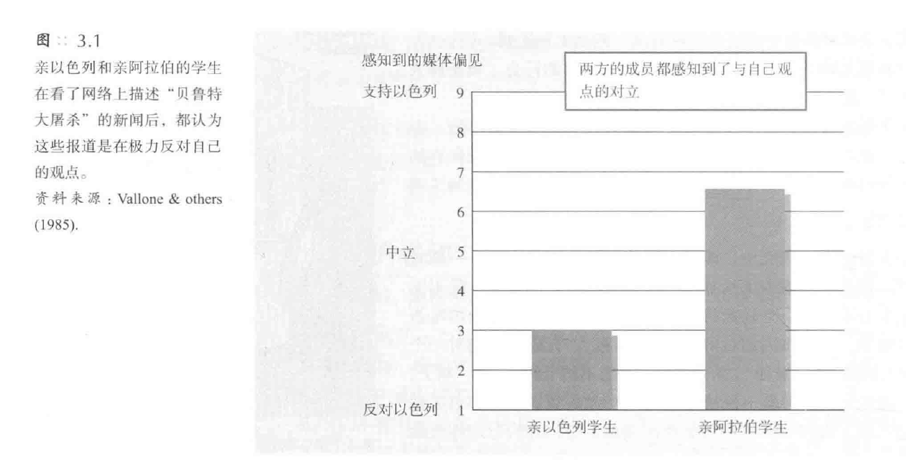
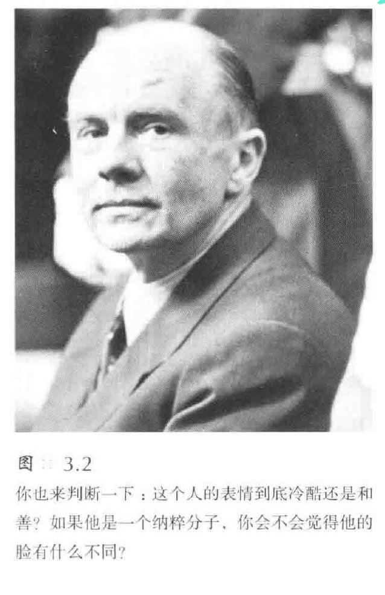

# 社会信念和判断
## 社会世界的感知
* 我们并非如实地对现实进行反应，而是根据我们**对现实的建构**做出反应
### 启动
* **未被注意的刺激**可以微妙地影响我们对事件的解释和回忆
* 我们的记忆系统是一个相互联结的网络，而**启动**（priming）就是唤醒或者激活其中的某些**特定联结**
  * 实验表明．启动一个**念头**（即使个体对此并无意识）可以影响个体的另一个念头．甚至是行为
  * 在一个实验中，约翰·巴奇及其同事请一些人补全含有诸如“老的”、“聪明的”、“退休的”等词语的句子；完成任务的片刻后，研究者发现．这些人走向电梯的速度明显慢于那些未被与老化相关的词语启动的人，另外，这些走路变慢的人对他们自身的步行速度并无意识．也没有意识到自己刚刚看过启动老化的词语
* 通常．我们的所做所想会受那些我们**没有意识到的事件**的启动
  * 若朋·布兰德及其同事（Holland）发现，在实验者布置出的充满清新剂味道的环境中，荷兰学生能更加迅速地辨别出与清洁相关的词语
  * 在后续实验中．另一些学生在有清新剂味道的环境中回忆一天的活动时．他们能够同忆出更多与清洁有关的行为．甚至在吃一种易碎的曲奇饼干时也更能保持桌面的洁净；而且，在所有的这些现象中，被试对这种气味和它所产生的作用毫不知情
  * 一个人在家里看恐怖片会激活令人恐惧的情绪．这些情绪令我们下意识地将炉子发出的声响错误知觉为有人闯入
* 在大量的实验研究中．即使刺激信息是**阀下呈现**的——刺激呈现时间极短使得意识无法捕捉——也会诱发启动效应
  * 在屏幕上极快地呈现一个无法意识到的颜色名称的单词之后，当同一颜色再次呈现在屏幕上时，人们对该颜色的察觉速度变得更快：若是在屏幕上呈现一个错误的颜色名称之后，人们辨别颜色的时间则会延长
* 由于**具身认知**（embodied cognition）的存在，甚至身体的感觉都会启动我们的社会判断，反之亦然
  * 当手捧热饮时，人们更可能评价别人更热情，自己也会表现得吏慷慨
  * 与受到热情款待的参与者相比．遭到冷遇的参与者会觉得实验室
### 感知和解释事件
* 撇开那些明显的偏见和逻辑缺陷．我们对彼此的知觉和理解大多数时候是正确的
  * 人们相互间的第一印象，正确的比错误的多得多，而且，我们越是认识别人，对别人的心理和感受就把握得越准确
* 但是，有时候我们的**预先判断**会发生错误
#### 政治知觉
* 旁观者眼中的**社会知觉**丰富多彩，即使一个很简单的刺激也会引发两个人**不同的反应**
  * 我们说加拿大的保罗•马丁是“一个还算过得去的总理”，这对他的那些热情的拥护者来说似乎是在贬低，而对不尊敬他的人来说却像是在表扬他
  * 沃伦、罗斯和莱珀做的一个实验韶释了先入为主到底有多重要；他们向支持以色列和支持阿拉伯的学生分别提供6段从网络下载的关下1982年在黎巴嫩两所难民营屠杀难民的新闻片断，两组被试都将新闻看成对自己这边不利的

  * 事实上，可以利用人们对偏见的知觉来评价他们的态度
* 我们关于世界的假定有时候甚至会使矛盾的证据看起来是**有利于自己**的
  * 研究发现·支持和反对死刑的学生都较容易接受与他们观点相同的证据、而极力批评和反对与其观点相悖的证据——即使同一个证据同时拥有两种观点也不会降低学生们对自己信念的支持．反而更起了促进作用
#### 我们对他人的知觉
* 研究者们操纵了人们的**先入之见**．结果发现它对人们韶释和回忆事件产生了惊人的影响
  * 麦伦·罗斯巴特和柏米拉·比勒尔让俄勒冈大学的学生评价图中那个男人的面部表情；有部分学生被告知他是盖世太保的领导人，第二次世界大战中对在集中营难民身上实施野蛮的生化实验负有重要的责任，这部分学生很自然地将他的表情知觉成“冷酷无情”（你能仅从平静的轻蔑表情中看到这些吗？）
  * 而另一部分学生被告知他是反纳粹组织地下运动的领导者、并勇敢地拯救数以千计的犹太人，这些学生则认为他面容慈善．充满了热情（你只需看看那富有同情心的眼神和微笑的嘴角）

* 电影制片人可以通过操纵背景来控制人们对面部情绪的知觉，他们称之为“库勒乔夫效应”，这是以一位俄罗斯导演**库勒乔夫**的名字命名的
[剪辑（2）.md](../../Movie/基础/剪辑/剪辑（2）.md)
#### 他人对我们的知觉
* 解释的过程也会左右他人对我们的认知；当我们说某人的好话或坏话时，人们会试图将那些特质和我们联系在一起，这种现象被称为**自发性特质转移**
  * 如果我们到处说别人喜欢说闲话，人们就会不知不觉地将“喜欢说闲话”与我们联系在一起；如果称某个人为傻子或者怪人．那么过后人们可能就会认为你也一样
* 我们通过自己的信念、态度和价值观来看待我们的社会，这就是我们的信念如此重要的一个原因；正是我们的**信念**塑造了我们对其他任何事物的**解释**
### 信念固着
* 一旦人们为错误的信息建立了**理论基础**．那么就很难再让他们**否定**这条错误的信息
  * 每一个实验都是先给被试灌输了一种信念，或者直接宜称某个结论是正确的，或者向人们出示一些轶事式的证据；然后要求被试解释为什么该结论是正确的
  * 最后．研究者会告诉被试真相，彻底否定最初的结论：实验开始时的信息是为实验目的而人为捏造的，而且在实验中给一半的被试提供相反的信息；然而．只有25%的人接受了新结论．大部分人仍然坚持对他们已经接受的结论的解释
* 这种现象被称为**信念固着**（belief perseverance），它证明了信念可以**独立存在**并且当支持它的证据被否定时仍会存活下来
  * 这些实验给我们揭示了这样一种现象．我们越是极力想**证明**我们的理论和解释可能是正确的，我们就对挑战自己信念的信息越**封闭**
  * 一且我们确信一个被指控的人犯了罪、一个令人讨厌的陌生人的确会表现出那样的行为，或者我们钟爱的某－股票的市值一定会有所上升，那么，我们就会为维护我们的解释而回击各种挑战
* 有什么方法能够纠正我们的信念固着吗？惟一的方法是：**解释相反的观点**
  * 查尔斯·洛德等人重复了先前介绍过的实验．并新增加了**两种实验条件**
  * 首先．他们要求被试“**尽可能客观无偏见**”地评价事件；结果表明，这条指导语是无效的，不管是那些死刑支持者还是反对者．指导语条件下的被试与那些无指导语的条件被试一样存在偏见
  * 实验要求第三组被试从**相反的角度**考虑问题——问自己：“假设我是一个持相反观点的人，我是否会在这个研究中同那些与我观点不同的人得出同样的结论呢？”从相反的角度考虑这些问题后．这些被试不再那么固执己见了