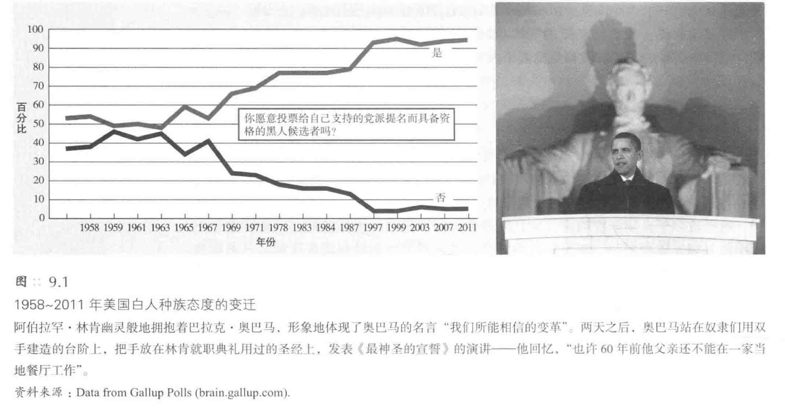
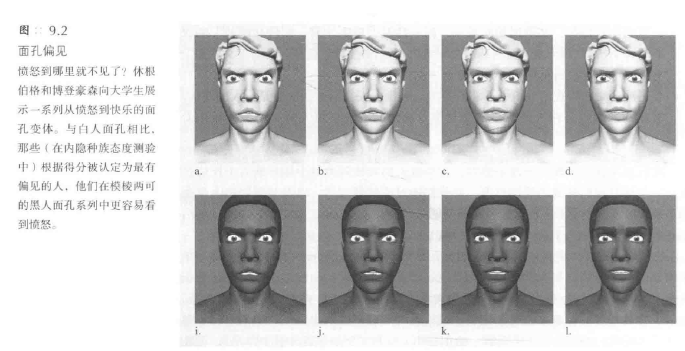
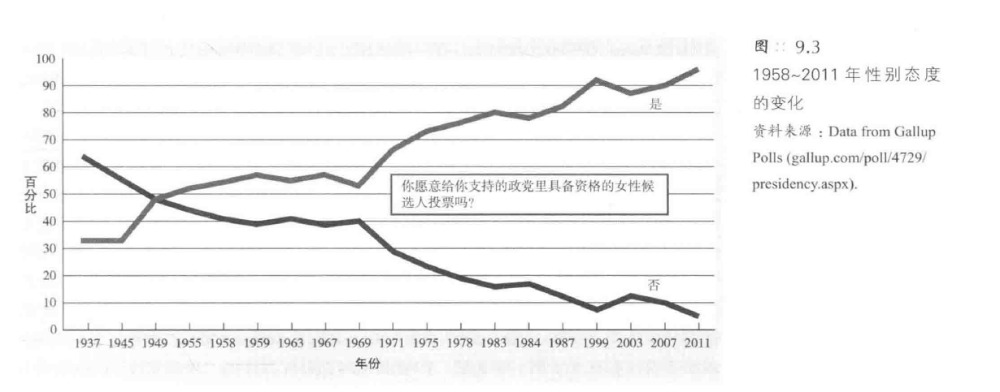
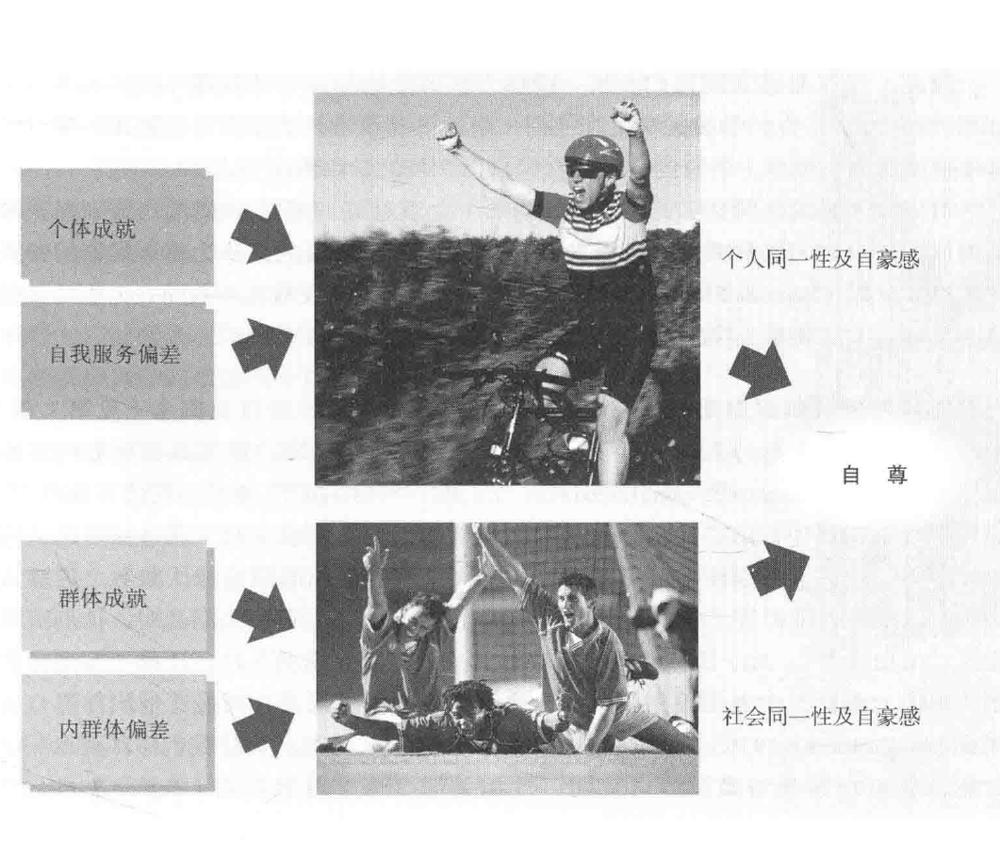
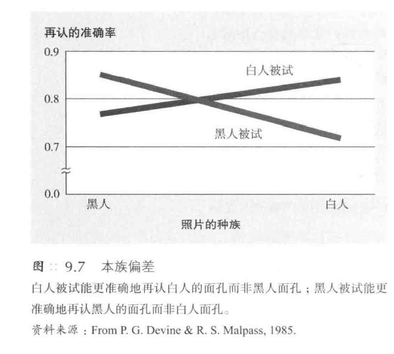
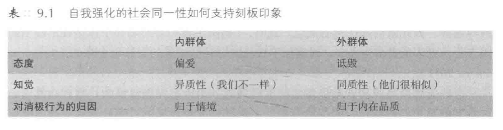
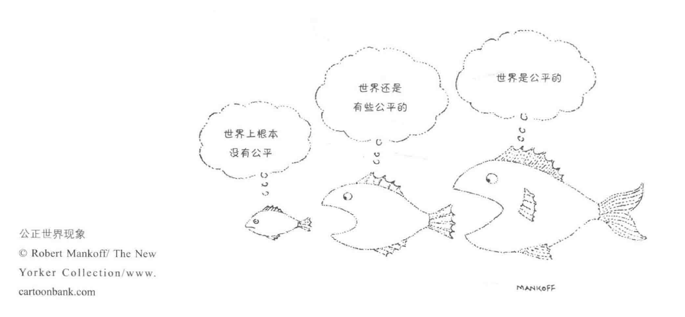
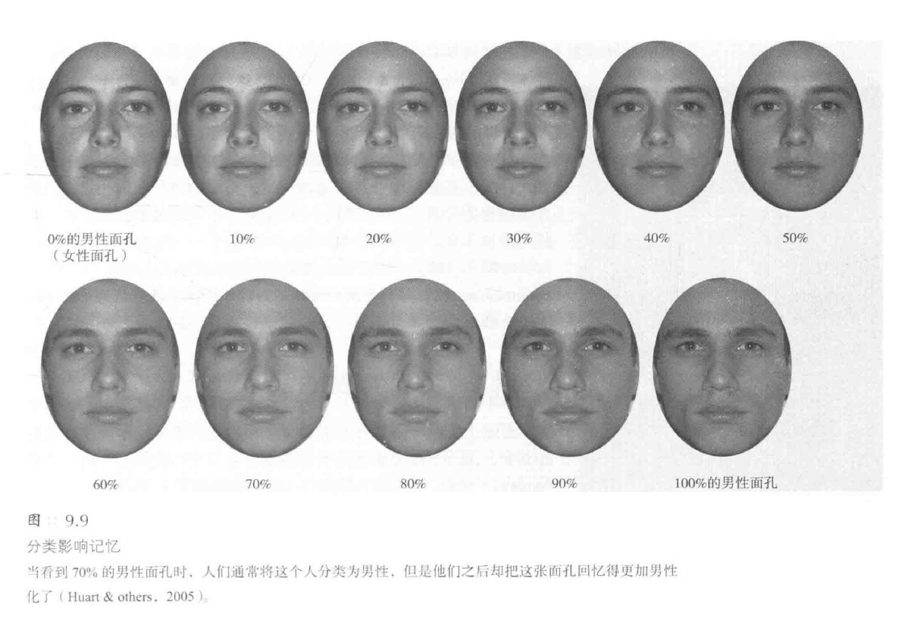
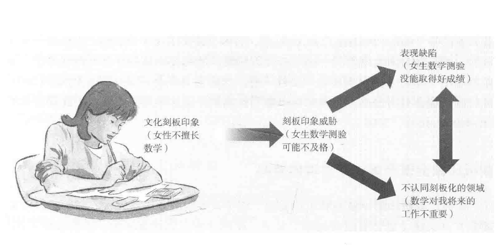
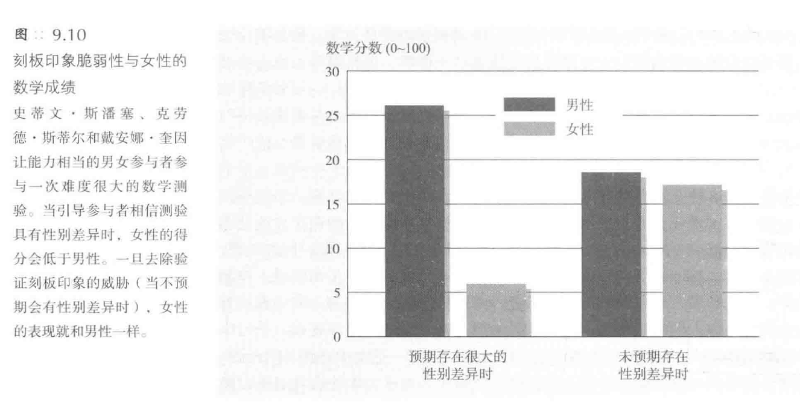

[TOC]
# 偏见：不喜欢他人
## 偏见的本质和作用
### 偏见的界定
1. **偏见的定义和特点**：
   - 偏见（prejudice）是对一个群体及其成员的**负面预先判断**
   - 奥尔波特在其经典著作《**偏见的本质**》（The Nature of Prejudice）的定义：“基于错误和顽固的概括而形成的憎恶感”
   - 它是一种**态度**的ABC理论：**情感**（感情）[affect（feelings）]，**行为**（倾向）[behavior（tendency）]，**认知**（信念）[cognition（beliefs）]，包括情感、行为倾向和信念的独特结合
   - **负面评价**是偏见的标志，通常源自负性的刻板印象

2. **刻板印象的概念和影响**：
   - **刻板印象**（stereotype）是一种**概括性的看法**，用于简化世界的复杂性
   - 刻板印象可以是**准确的**，也可以是**不准确的**
   - **过度概括或明显错误**的刻板印象会导致问题

3. **歧视的定义和与偏见的关系**：
   - **歧视**（discrimination）是一种**负面行为**，其根源往往在于偏见
   - 偏见性的态度**并不一定会滋生敌意行为**
   - 种族歧视和性别歧视是**制度性的歧视行为**，即使在没有偏见意图的时候也如此

4. **偏见的不同表现形式**：
   - 通过电子邮件实验显示，名字带有**特定种族或宗教特征的人**可能会受到歧视
   - **性别化的语言**可能导致制度性的性别歧视
   - 刻板印象和偏见不仅仅局限于种族和性别，还包括**年龄、身体状况等多个方面**

### 偏见：微妙形式和公开形式
1. **外显与内隐偏见**
   - 人们可以对**同一目标**持有**不同的外显和内隐态度**
   - 外显态度是**有意识的**，而内隐态度是**无意识和自动的**
   - 内隐联结测量的研究揭示了这种**双重态度的存在**
   - 内隐态度可能源自**儿时的经验**，通过**不断练习形成新习惯**才能改变
   - 外显态度可以**通过教育发生巨大变化**，但内隐态度可能会持续存在

2. **内隐偏见的测量和影响**
   - 内隐联结测量主要通过测量人们**联想速度**来揭示内隐偏见
   - 这种测验揭示了人们可能**在不自知的情况下保留**对某些群体的偏见
   - 内隐偏见可以在人们**意识之外**影响他们的行为
   - 一系列实验表明，偏见和刻板印象可以**在无意识中产生并影响行为**
   - 启动刻板印象可以导致**行为上的偏差**，如对恼人要求的敌意回应

3. **内隐偏见测验的效度和应用**
   - 批评者认为内隐联想测验在评价个体时**缺乏效度**
   - 该测验更适用于**实验研究**，可以预测从友好行为到工作评价的一系列行为
   - 内隐偏见和外显偏见都能**预测选民对奥巴马的支持**
   - 选举结果反过来又在一定程度上**降低了选民对奥巴马的内隐偏见**

### 种族偏见
**种族偏见的普遍性和变化**
   - 每个种族**都曾是少数群体**，白人占全球人口的比例正在减少
   - 种族间的迁徙和移民导致了**文化的融合**，有时产生敌对，有时友好相处
   - 肤色只是人体**微小的特征**，种族的划分并非自然界的产物
   - 人们通常能够察觉到**他人身上的偏见**，但对自身的偏见**认识不足**

#### 种族偏见是否正在消失
1. **种族偏见的消退趋势**
   - 从20世纪40年代到现在，美国**对非洲裔的态度发生了显著变化**
   - **公开的种族偏见**在英国也**显著减少**，特别是在年轻人中
   - 支持跨种族婚姻和学校合并的人数**显著增加**
   - 黑人儿童对黑人玩偶的喜爱程度增加，成年黑人认为黑白两种人**在多个方面非常相似**

2. **种族偏见的复杂性和根深蒂固**
   - 尽管种族偏见有所减少，但仍有**极少数人持有偏见**
   - 种族偏见的消退并不意味着已经完全消失，仍有**仇视犯罪的存在**
   - 种族平等的进程受到不同种族对改变感知的影响，白人和黑人对种族平等进程的**感知存在差异**

3. **种族偏见对社会和个体的影响**
   - 种族偏见影响了人们对政治候选人的支持
   - 种族偏见的存在阻碍了社会的和谐和个体的发展
   - 种族偏见的减少有助于社会的稳定和个体之间的和谐相处

#### 偏见的微妙形式
1. **微妙偏见的广泛性**
   - **微妙形式的偏见**比公开形式**更为普遍**
   - 现代社会中的偏见通常以微妙的方式表现出来
   - 人们倾向于**更喜欢**那些熟悉的、相似的和令人感到舒适的人或事物
   - 微妙偏见可以在日常行为和态度中**无意识地体现出来**
   - 微妙偏见的表现形式**多种多样**，包括语言、行为和态度

2. **微妙偏见的实验研究**
   - 研究者通过实验评估了人们对不同种族的行为反应
   - **白人**在大多数情况下**对需要帮助的人都愿意提供帮助**
   - 当帮助的对象与自己**关系不大**时，白人**对黑人的帮助意愿降低**
   - 在某些情境下，白人**对黑人的负面行为**增加，如在被激怒或对方无法报复的情况下
   - 这些实验揭示了微妙偏见如何在特定情境下表现出来

3. **微妙偏见在不同国家的表现**
   - 在法国、英国、德国、意大利和荷兰，微妙偏见**正在取代公开偏见**
   - 微妙偏见表现为**夸大种族差异**、对少数民族移民的**不尊重和缺乏好感**
   - 人们可能会以**非种族的理由**拒绝少数民族移民
   - 微妙偏见在这些国家已成为一种**普遍现象**

4. **微妙偏见的其他形式**
   - 微妙偏见也表现为**对性别的歧视**
   - 人们可能会**否认歧视的存在**，反对增进性别平等的努力
   - 微妙偏见可以在**行为层面**体现出来，如**在劳动力市场上的歧视**
   - 微妙偏见甚至可以表现为对少数种族人士的**过度反应和怜悯姿态**
   - 这种偏见可能会**阻碍少数种族学生的成就**，影响他们的发展

#### 自动偏见
1. **自动偏见的普遍存在**
   - 自动偏见**广泛存在**于多种情境中
   - 人们通常在**无意识中**表现出对非裔美国人的自动偏见
   - 这种偏见通常是**非故意的**，并且参与者往往**没有明确表示**出偏见
   - 自动偏见可以通过**反应时间**等方式在实验中被观察和测量
   - 例如，在识别与黑人面孔相结合的愉快单词时，人们需要更长的时间

2. **自动偏见对行为的影响**
   - 自动偏见不仅仅是无意识的联想，它还会**影响人们的行为**
   - 在瑞典，反阿拉伯穆斯林的内隐偏见预测了雇主不愿意面试穆斯林名字的员工
   - 在美国，内隐种族偏见较高的医生更不愿意为黑人患者开溶栓类药品
   - 在澳大利亚，照顾吸毒者和酗酒者的护士对这些人群有较强的内隐偏见，并在面对压力时更想换工作

3. **自动偏见与生死攸关的决策**
   - 自动偏见甚至可以影响人们**在生死攸关的情境中的决策**
   - 在模拟射击实验中，参与者更容易误击手持无害物品的黑人目标
   - 这种偏见导致了**对某些群体的过度警觉和反应**
   - 例如，伦敦警察误杀了一个看起来像穆斯林的人
   - 在澳大利亚，人们更有可能对穿着穆斯林服装的人射击

4. **自动偏见的神经机制**
   - 自动偏见与大脑中与**恐惧和回避**相关的区域活动增加有关
   - 与**有意识控制的刻板印象**相比，自动偏见**激活了不同的脑区**
   - 这些发现揭示了自动偏见是如何在无意识层面影响我们的认知和行为的

5. **自动偏见在学术界的存在**
   - 即使是研究偏见的**社会科学家**也可能表现出**自动偏见**
   - 在分析社会科学文章引文时，发现非犹太作者**更倾向于**引用非犹太人的工作
   - 这表明自动偏见是一个**普遍存在的现象**，影响着各个领域和层面的人们

### 性别偏见
#### 性别刻板印象
1. **性别刻板印象的广泛存在**
   - 性别刻板印象在社会中非常强烈，普遍认为女性和男性在行为举止上存在固定模式
   - 这些刻板印象是描述性的，反映了人们对两性实际行为的信仰
   - 研究显示，性别刻板印象比种族刻板印象更为强烈
   - 男性和女性都接受并认同这些性别刻板印象

2. **性别刻板印象的准确性**
   - 刻板印象有时可能基于实际观察，但也可能是错误或过度概括的
   - 男性和女性在某些方面确实存在差异，但刻板印象可能会夸大这些差异
   - 当帮助的对象与自己**关系不大**时，白人**对黑人的帮助意愿降低**
   - 刻板印象在不同文化和时期中都有所体现，显示了其持续性和普遍性

3. **性别刻板印象与性别偏见的区别**
   - 刻板印象是**信念**，而偏见是**态度**
   - 人们可能认为男性和女性**不同但平等**，这**不一定导致偏见**
   - 性别偏见可以是**善意的或敌意的**，反映了**复杂的态度**

#### 性别态度：善意的还是敌意的
- **性别态度的变化和复杂性**
   - 对女性的态度在近几十年中发生了**显著变化**，越来越多的人**支持女性担任重要职务**
   - 人们普遍对女性**有积极的态度**，认为她们**更有同理心和善良**
   - 这种“**女性优秀效应**”（women-are-wonderful effect )导致了对女性的**积极评价**
   - 然而，性别态度往往是**矛盾的**，既包含善意的偏见也包含敌意的偏见

#### 性别歧视
1. **男性面临的挑战**
   - 男性**自杀或被谋杀**的概率是女性的**三倍**
   - **战场上的受害者**几乎都是男性，导致他们平均寿命减少五年
   - **精神迟滞或自闭症患者**以及**接受特殊教育的学生**大多数是男性

2. **性别偏见的研究**
   - 有研究显示**女性作品被低估**，即使是女性也对女性存在偏见
   - 重复实验**并未发现**贬低女性工作的倾向
   - 大量研究表明，工作是由男性还是女性来承担，**通常不影响**对工作的评价

3. **性别偏见的微妙性和持续性**
   - 公开的性别偏见**已经减少**，但**微妙的偏见**依然存在
   - **违反性别刻板印象**的行为会引起人们的反应，如**权利欲极强的女性**会遭到更强烈的反对
   - 在西方国家以外，性别歧视**更为严重**，甚至演变为暴力

4. **性别偏见的全球影响**
   - 世界上未上学的儿童中有**三分之二是女孩**
   - 性别选择导致了**男女比例失衡**，特别是在亚洲一些国家
   - **选择胎儿性别的流产**在某些地方是违法的

5. **偏见的减少和微妙偏见的存在**
   - 对有色人种、女性和同性恋者的公然偏见已经减少
   - 采用**对微妙偏见敏感的测量技术**仍然能检测到广泛存在的偏见
   - 在世界上的某些地方，性别歧视**是致命的**

## 偏见的社会根源
### 社会不平等：不平等的地位与偏见
1. **社会不平等与偏见**
   - 不平等的社会地位滋生偏见，有权势的群体为了**合理化自己的特权**而产生偏见
   - 偏见帮助**维持社会地位的不平等**，例如奴隶制和殖民主义时期的刻板印象
   - **经济关系**是预测群体间态度的重要因素，**上层社会的人**更倾向于将财富**视为个人努力的结果**

2. **偏见的社会化和习得**
   - 从小我们就在社会化的过程中学习了**人与人之间的差异**，形成了偏见
   - 社会制度和文化传统在**维持和支持偏见**方面起到了作用
   - 历史上的刻板印象如何促进社会地位低下群体的**合理化**，例如**对黑人和女性的刻板印象**

3. **偏见对自尊和社会地位的保护作用**
   - 偏见帮助个体**保护自尊和社会地位**，通过贬低其他群体来提升自己
   - 有权力的群体通过刻板地看待下属群体来**维持自己的地位**
   - 善意的歧视，如对女性的**保护性歧视**，虽然看似善意，但实际上**限制了女性的发展**

4. **偏见的文化和社会心理层面**
   - 偏见不仅仅是个体层面的，它也存在于**文化和社会心理层面**
   - **社会支配性取向**（social dominanceorientation）高的人更倾向于**追求和维持社会地位**，更容易**接受和支持偏见**
   - 社会不平等不仅滋生偏见，也造就了**不信任**，影响了社会的整体健康和稳定

### 社会化
**家庭社会化的影响**
   - 儿童的偏见**受家庭影响**，尤其是母亲的教育
   - 儿童的**内隐种族态度**反映了父母的**外显偏见**
   - 家庭和文化传递关于交友、生活和价值观的信息

#### 权威人格
1. **权威人格与偏见**
   - **权威人格**（authoritarian personality）倾向——**不能容忍软弱**，具有**惩罚性的态度**以及**服从群体内部的权威**的人，更容易成为自以为是的**种族中心主义**（ethnocentric）者
   - 这些更容易表现出**偏见和刻板印象**的人通常在童年时受到**严格管束**
   - 他们倾向于服从**权力较大**的人，攻击地位较低的人
   - 他们的思维方式往往**僵硬**，难以忍受模糊性

2. **权威人格的政治倾向**
   - 研究主要关注**右翼权威主义**，忽略了**左翼的教条权威主义**
   - 右翼权威主义者倾向于**以偏见表达恐惧和敌意**
   - 他们可能同时持有**多种形式的偏见**

3. **社会支配性取向、权威人格与偏见**
   - **社会支配性取向**和**权威人格**得分都高的人往往偏见最深
   - 他们在人格特质上表现最差，常以**自欺欺人**的方式追求社会地位
   - 他们可能成为**仇视群体的领袖**

#### 宗教与偏见
1. **宗教用于合理化社会不平等**
   - 人们利用宗教信仰来**为社会不平等找到合理化的理由**
   - 宗教被用作**维持现状的工具**

2. **宗教信仰与种族偏见的关联**
   - **教会成员**表现出**更明显的种族偏见**
   - 信奉**传统或正统基督教**的人表现出更多的偏见
   - 宗教信仰与偏见之间的**关系复杂**，取决于如何定义和衡量宗教虔诚

3. **宗教虔诚与偏见的关系**
   - 越虔诚的教会成员**并不一定**偏见更深
   - **以宗教本身为目的**的人表现出**较少的偏见**
   - 越虔诚的人更**欢迎其他种族的人做邻居**

#### 从众
1. **从众导致偏见的持久和加强**
   - 社会接受的偏见使人们倾向于**遵循**，无论是出于被喜欢的需要还是其他原因
   - 知道别人也持有偏见会使个体**更容易表达歧视态度**

2. **历史和文化背景对从众和偏见的影响**
   - 在20世纪50年代，南非和美国南部**最遵从社会规范的人**也是**最有偏见**的
   - 不从众的代价**可能很高**，如美国解除学校种族隔离的案例所示

3. **从众在性别偏见中的体现**
   - **性别角色的刻板印象**也是由从众行为维持的
   - **接触**女性科学家、技术专家等**职业女性**可以减少女生对这些领域的偏见

4. **偏见的可改变性**
   - 如果偏见不是植根于人格，那么随着社会规范的变化，偏见是**有可能被消除的**
   - 偏见确实在**随时间变化**

### 社会制度的支持
1. **政治和经济制度对偏见的影响**
   - **种族隔离**是社会制度助长偏见的一种形式
   - **政治领袖**能够反映并强化盛行的态度
   - **银行**拒绝发放贷款给未婚妇女和少数民族人员，导致私人业主主要是白人夫妇

2. **教育制度在强化文化态度中的角色**
   - 学校通过**教材**强化主流的文化态度
     - 通过教材中的例子，男性被描绘为**主动、勇敢和有能力**的，而女性则**相反**
   - 男性人物在儿童读物中的比例**远高于**女性

3. **媒体对偏见的强化**
   - 媒体通过**不同方式**展示男性和女性，强化性别偏见
   - 男性的**面部**在照片中**更常被突出**，而女性则**更多展示身体**
   - 这种“**面孔歧视**”在多个国家和时代的媒体中都存在
   - **电影和电视节目**通过刻板的角色形象强化文化态度，如**非洲裔的刻板形象**
   - 即使是**现代**的**电视节目和音乐**，也可能强化对特定群体的刻板印象
     - 发源于黑人艺术家的激烈说唱音乐，导致黑人和白人听众都对黑人形成了某种刻板印象，认为他们具有暴力倾向
     - 同样，在电视节目中，黑人角色比白人角色有更多皱眉或其他消极的非言语行为，这强化了观众潜意识的种族偏见

4. **对偏见的未察觉支持**
   - 社会制度对偏见的支持往往是**不知不觉**的
   - 随着时间的推移和社会观念的变化，这些刻板印象才开始受到关注并发生改变

## 偏见的动机根源
### 挫折与攻击：替罪羊理论
1. **挫折与攻击**
   - **痛苦和挫折**常常引起**敌意**
   - 当挫折的原因**令人胆怯**或者**尚未可知**时，人们会**转移敌对方向**，产生**替代性攻击**
   - 例子：美国内战后南方地区对黑人的**滥施私刑**
     - 经济困境时期，滥用私刑更加严重
     - 繁荣时期，对多样性和反歧视法案的态度更开放

2. **替罪羊理论**
   - 替代性攻击的目标是**变化不定**的
   - 德国第一次世界大战后经济混乱，许多人将**犹太人**视为罪魁祸首
   - 历史上，人们将恐惧和敌意发泄到**女巫**身上
   - “911”后，对**移民和中东人**表现出不宽容态度的美国人感到更多愤怒

3. **竞争引发的挫折**
   - **竞争**是挫折的来源之一
   - **现实群体冲突理论**（realistic group conflict theory）认为，为稀缺资源竞争会引发偏见
   - **高斯定律**（Gause's law）表明有同样需求的物种之间的竞争最激烈

4. **世界各地的例子**
   - 在西欧，**经济受挫的人**对**少数种族**表现出较高的偏见
   - 在加拿大，对**移民**的抵触随**失业率**波动
   - 在美国，敌视**黑人**的偏见在社经地位**与黑人接近的白人**中最强烈
   - 在南非，**非洲移民**被暴徒杀害，被**贫民**从寮屋营地驱逐

### 社会同一性理论：感觉自己比他人优越
1. **人类的群居本性和社会同一性**
   - 人类天生**倾向于群居**，进化使我们能**迅速判断他人是敌是友**
   - 我们通过群体来**定义自己**，形成**社会同一性**（social identity）
   - 社会同一性包括**多重身份**，如性别、国籍、政党等
   - 社会同一性的强化可以增强**个体的自我概念和自豪感**

2. **社会同一性理论的提出和观察**
   - 约翰·特纳和亨利·塔杰菲尔提出**社会同一性理论**
   - 人类倾向于将自己和他人**归类到不同的群体**
   - 我们认同**内群体**（ingroup），并从中获得尊重
   - 我们将内群体与**外群体**（outgroup）进行**比较**，并倾向于**偏爱自己的群体**

#### 内群体偏差（ingroup bias）
1. **内群体与外群体的界定**
   - 描述自己属于某个群体意味着**排除其他群体**
   - 内群体的**认同**可能导致对外群体的**排斥**

2. **内群体偏差的普遍性**
   - 从儿童到成年人，人们普遍倾向于认为自己所属群体**更优秀**
   - 这种偏差甚至可以通过**微小的共同点**，如同一天生日，来激发

##### 内群体偏差提供积极自我概念
   - 内群体偏差是寻求**积极自我概念**的一种方式
   - 人们倾向于将**积极的自我意象**投射到内群体上
   - 群体的成功可以增强个体的**自我感觉**

##### 内群体偏差滋生偏袒
   - 内群体偏差可以导致**对内群体的偏袒**
   - 即使是**随机形成的群体**也会产生内群体偏差
   - 内群体偏差在**群体规模较小或社会经济地位较低**的群体中更为明显

##### 喜欢内群体是否必然讨厌外群体
1. **内群体偏差与对外群体的态度**
   - 内群体偏差**可能导致**对外群体的负面态度
   - 爱和恨有时是同一硬币的两面
   - 内群体偏差可能导致**外群体刻板印象**的盛行
   - 内群体偏差可能导致对外群体成员的**非人化**

2. **内群体偏差的复杂性**
   - 内群体偏差可能源于对外群体的**负面评价**或对内群体的**积极评价**
   - 对内群体的积极感受**不一定完全映射出**对外群体同样强烈的消极感受
   - 即使在**没有外群体**的情况下，人们仍然会表现出对内群体的积极感受

#### 社会地位、自我关注和归属的需要
1. **社会地位的相对性**
   - 社会地位上升的感觉带来**优越感**
   - 社会地位低下或下滑的群体**更易产生偏见**
   - 例子：社会经济地位低下的群体、女生联谊会成员间的互动
2. **自我关注对偏见的影响**
   - **自我形象受威胁**时，偏见加剧
   - **例子**：自我同一性低的男生对强势女性的不喜欢
   - **自尊受到肯定**时，对外群体评价更积极
3. **死亡意识对偏见和归属感的影响**
   - **死亡意识**增强内群体偏好和外群体偏见
   - **例子**：白人对种族主义分子的支持、对总统和反恐政策的支持
   - 死亡意识也能**增强对公共情感的追求**，如团结和利他主义
4. **归属感的需要**
   - 归属感的需要满足时，对外群体的接纳度**提高**
   - **例子**：感知共同敌人增强团体团结、归属感启动减少偏见、

### 避免偏见的动机
1. **动机对偏见的双重作用**
   - 动机既能引发偏见，也能驱使人们**努力避免偏见**
   - **例子**：压抑对食物的想法、追求伴侣的想法、对其他群体的评判想法

2. **偏见的顽固性**
   - 不合时宜的想法和刻板印象**难以消除**
   - **特定群体**更难抑制偏见
   - **例子**：老年人和饮酒过量个体对刻板印象的抑制能力减弱

3. **偏见的自动性和无意识性**
   - 遇到少数族群人士可能**自动触发**刻板印象
   - 即使是自认为无偏见的人也可能**在无意识中表现出偏见**
   - **例子**：与男同性恋者同坐、与不熟悉的黑人男士相遇时的反应

4. **面部和生理反应揭示内在偏见**
   - 人们的面部和生理反应可能与他们自认为的态度**不一致**，揭示**内在偏见**
   - **例子**：白人对黑人的面部肌肉反应、大脑情绪加工中心的活跃度

5. **避免偏见的努力**
   - 意识到应该感受和实际感受之间的差距会**激发内疚感**，驱使人们**努力抑制偏见**
   - **内在动机**比外在动机更能减弱自动的偏见反应
   - **例子**：自我意识的人努力抑制偏见反应

6. **克服偏见的可能性**
   - 通过**提高意识和关注程度**，用**无偏见的自动反应**替代偏见反应，可以克服偏见
   - 需要**长期的努力和训练**
   - **例子**：两年追踪研究显示实验干预能降低内隐偏见

## 偏见的认知根源
   - 刻板印象是**正常思维过程的副产品**，而非仅由社会条件作用和敌意发泄导致

### 类别化：将人归入不同群体
1. **类别化的心理机制**
   - 通过**将人归入不同群体**来**简化复杂世界**
   - 这是一种提供快速判断和预测他人思考和行事的**简便方法**，并且有助于**祖先的竞争和生存**
   - **例子**：生物学家区分植物和动物，人们将人进行归类

#### 自发类别化
1. **自发类别化的情境**
   - 在时间紧迫、心事重重、疲惫不堪、情绪激昂、年轻气盛等情境下**更依赖刻板印象**
   - **例子**：种族和性别是有效的分类方式

2. **类别化对偏见的影响**
   - 类别化为偏见提供了**基础**，但本身**并不是偏见**
   - **例子**：观看不同人发表言论时，记得发言者的种族而非言论内容

3. **社会同一性理论视角下的偏见**
   - **对自己社会身份敏感**的人会关注“我们”和“他们”的区分
   - **例子**：具有种族偏见的人在进行种族分类时需要更长时间

#### 知觉到的相似性和差异性
1. **物品和日期的相似性感知**
   - 人们倾向于将**同一群体**中的物品视为**更为一致**
   - **例子**：苹果的颜色、椅子的形状、铅笔的颜色
   - **日期的归类**也影响了我们对它们相似性的感知
   - **例子**：同月份的日期看起来更相似，气温更接近

2. **对人群的相似性和差异性感知**
   - 将人们分成群体会导致我们**夸大**群体内的**相似性**和群体间的**差异性**
   - **例子**：运动员、戏剧专业学生、数学教授
   - **外群体同质效应**（outgroup homogeneity effect）：认为外群体成员**相似**，与我们的群体**不同**
   - **内群体偏好**：倾向于**喜欢与自己相似的人**

3. **群体决策对一致性的影响**
   - **群体决策的结果**会让外人**高估群体的一致性**
   - **例子**：保守派和自由主义者赢得选举的情况
   - 我们对自己群体的多样性有**更清晰的认识**

4. **熟悉度和刻板印象**
   - 对社会群体的**熟悉度**影响我们对其多样性的感知
   - **例子**：瑞士人、拉丁美洲人、女生联谊会成员
   - 不熟悉的群体**更容易受到**刻板印象的影响

5. **种族和年龄对面孔识别的影响**
   - **本族偏差**（owm-race bias）：更容易识别本种族的面孔
   - **例子**：白人大学生识别白人和黑人面孔的实验

   - **同龄偏差**：更容易识别同龄人的面孔
   - **例子**：老人和儿童对同龄人面孔的识别

#### 独特性：感知那些突出的人
1. **独特的人更容易吸引注意力**
   - 在群体中**与众不同**的人会**更引人注目**，如黑人在白人群体中，女性在男性群体中
   - 这种**突出性**会导致人们对这个人的**优点或缺点的夸大**
   - 当一个人变得显著时，我们倾向于认为**所有事情**都是由这个人引起的

2. **人们倾向于用最独特的特质描述他人**
   - 如将人描述为跳伞运动员而非网球运动员，或者养蛇的人而非养狗的人
   - 这种倾向同样适用于**违背期望的人**，如社会底层但有才能的求职者

##### 独特性形成自我意识
   - 当一个人感到自己**与众不同**时，他们会**更敏感地察觉**到他人的反应
   - 这种自我意识可能导致**对他人行为的误解**，尤其是在强势和弱势个体之间的互动中
   - 多数派群体成员往往心里清楚少数派成员对于他们的刻板印象——“**元刻板印象**”

##### 污名意识（stigma consciousness）
   - 污名意识是人们**预期他人**会对他们产生刻板印象的程度
   - 这种意识可以提供**对自尊的保护**，但也可能导致**较低的幸福感和增加生活的压力**

#### 生动的案例
1. **通过个别案例概括群体**
   - 人们倾向于利用**有限的经验和个别案例**来对特定社会群体做出判断
   - 这种思维过程虽然**简便**，但可能导致**刻板印象的产生和强化**
   - 遇到负面刻板印象的典型例子时，人们可能会**减少与该群体的接触**

2. **生动案例的问题**
   - 生动的例子虽然**容易回忆**，但**不一定能代表**整个群体
   - 通过**杰出个体**来判断整个群体可能导致对群体特征的**误解和夸大**

3. **少数群体的人数估计**
   - 少数群体的个体**越独特**，多数群体对这一群体的**人数估计就越高**
   - 例如，非穆斯林国家的人们通常会**过高估计**穆斯林的比例
   - 美国人对同性恋人群的比例估计也**远高于实际情况**

4. **独特案例强化刻板印象**
   - **独特的案例**，无论是身高还是犯罪行为，都会**强化人们对群体的刻板印象**
   - 接触到**极端案例**的人对群体特征的估计会**更加夸大**

#### 独特事件促进虚假相关
1. **刻板印象的形成**
   - 人们通常认为**群体成员身份**和**个人特征**之间存在相关性
   - 虽然刻板印象有时是**准确的**，但**过分关注**非同寻常的事物会产生**虚假相关**

2. **独特事件的影响**
   - 人们对独特事件**特别敏感**，当两件**非同寻常的事情**同时发生时会**特别引人注意**
   - 这种现象可能导致**对某些群体的误解和偏见**

3. **虚假相关的实验验证**
   - 通过一个经典实验，研究者展示了**虚假相关的存在**
   - 实验中，两组人物的好事和坏事比例相同，但由于B组人物和坏事出现的频率都较低，所以当它们共同出现时会更引人注意
   - 结果，实验参与者**高估了B组人物行为不当的频率**，对B组的评价也**相对苛刻**

4. **大众媒体的作用**
   - 大众媒体通过突出**报道非同寻常的事件**，反映并助长了虚假相关的现象
   - 这种报道方式加深了人们**对某些群体的误解和偏见**

5. **预先存在的刻板印象**
   - 我们的预先存在的刻板印象能引导我们看到**根本不存在的联系**
   - 即使在信息相对系统的实验环境中，人们也会受到这种偏见的影响

6. **种族和社会群体的差异**
   - 人们通常注意群体之间的**差异**，而不是**相似之处**
   - 这种注意力的偏向可能导致**对少数群体的误解和偏见**

### 归因：这是一个公正的世界吗
#### 基本归因错误
   - 人们倾向于将行为归因于**个人特质**而非情境
   - **例子**：奴隶行为被归因于奴隶的天性而非奴隶制度
   - **性别差异**的解释也受到这种错误的影响
   - 刻板印象的强度与对人**特质不变性的信仰**成正比

#### 群体服务偏差（group-serving bias）
1. **群体服务偏差**
   - 在解释群体成员行为时，对自己群体的成员给予**善意的理解**，而对其他群体的成员则持**负面态度**
   - **例子**：推搡动作的解释差异，捐赠行为的解释差异
   - 外群体成员的积极行为经常**被忽略或归因于其他因素**
   - **例子**：特例、运气、特殊优势、情境要求、额外努力
   - 处于**不利位置**的群体和**强调谦虚**的群体较少表现出群体服务偏差
   - **多元文化**关注**差异性**，但在冲突或威胁时可能导致**群体层面的归因和更大的敌意**

2. **语言性群体间偏差**
   - **内群体**其他成员的积极行为常被描述为**普遍品质**，而**外群体**成员的积极行为则被视为**特定行动**
   - **消极行为**的描述则**相反**
   - **例子**：描述助人行为和推搡行为的差异

3. **责备与群体服务偏差**
   - 指责他人**为自己的优越地位提供辩护**
   - 外群体的失败被归因于其成员的**内在品质缺陷**
   - 例子：女性、黑人、犹太人受虐待被认为是**咎由自取**
   - 群体服务偏差解释了**偏见的形成动机或认知基础**

#### 公正世界现象（just-world phenomenon）
1. **观察他人受害导致的贬低**
   - 观察到**无辜者受害**会让人们认为受害者**不值得尊敬**
   - 人们需要相信自己**生活在一个公正的世界中**，人们**得到他们应得的东西**

2. **公正世界信仰的形成**
   - 从小我们就被教导“**善有善报，恶有恶报**”
   - 这种信仰导致人们认为幸运的人一定是好人，而不幸的人是命中注定的

3. **公正世界现象的影响**
   - 人们**对受害者的评价**受到公正世界信仰的影响
   - **例子**：观察受害者接受电击的实验，观察者会贬低无法帮助的受害者
   - **例子**：对强奸受害者和其他受害者的评价受到公正世界信仰的影响

4. **公正世界信仰对社会不公的盲目性**
   - 人们对社会不公**漠不关心**，因为他们**看不到不公正**
   - 人们认为成功者得到的一切都是**应得的**，而失败者则是**因为不道德或能力差**
   - **例子**：对幸运和不幸运的儿童的评价，对赌博结果的评价

5. **公正世界思维对社会系统的影响**
   - 人们倾向于认为**熟悉的社会系统是公正的**
   - 这种思维使得**新的社会政策难以推行**
   - 一旦新政策实施，人们又会支持这个政策

## 偏见的后果
### 自身永存的刻板印象
1. **预先判断的不可避免性**
   - 预先判断是人类**认知过程的一部分**，影响我们**对社会事件的记录和理解**
   - 预先判断**引导我们的注意力和记忆**，使我们**更容易**记住和注意到**符合我们刻板印象**的信息
   - 例子：**性别刻板印象**影响人们回忆自己学校成绩的准确性
   - 人们的记忆系统会偏向于与**已有类别相关联的特征**

2. **预先判断对事件解释的影响**
   - 当群体成员的行为**符合我们的预期**时，我们会**更加重视**这一事实
   - 当群体成员的行为**与我们的预期不一致**时，我们倾向于将其视为**特殊情况**

3. **刻板印象对人际交往的影响**
   - 刻板印象会影响我们**对他人的评价和理解**
   - **例子**：预期不愉快的交往会导致误解和负面的人际反应

4. **刻板印象的自我维持机制**
   - 即使面对**与刻板印象不一致的信息**，人们仍然倾向于**维持**已有的刻板印象
   - **例子**：通过**再分类**（subtyping）和形成**子群体**的刻板印象来维持原有的刻板印象

### 歧视的影响：自我实现的预言
1. **歧视对受害者的深远影响**
   - 歧视不仅仅是由于**合理化的需要**，还因为它**深刻地影响**了受害者
   - 即使歧视现象消失，其负面影响仍将**持续存在**，如同一种社会遗留物
2. **歧视引发的受害者反应**
   - 受害者可能会**责怪自己**，表现为退缩、自我痛恨或攻击自己的群体
   - 受害者也可能将责任**归咎于外部原因**，表现为反击、怀疑或增强群体自豪感
   - 这些反应可能导致**负面的社会结果**，如犯罪率上升，进而为歧视提供辩解的依据
3. **歧视如何通过自我实现的预言作用于受害者**
   - 社会信念**能够自我验证**，歧视态度会**影响受害者的表现和感受**
   - 实验显示，当面试官对黑人求职者表现出歧视态度时，求职者的表现**更差**，感受也更**负面**
   - 这种自我实现的预言**加剧了歧视的负面影响**，形成了一个**恶性循环**
4. **歧视对文化认同的复杂影响**
   - 虽然歧视有时会导致对受害群体文化的负面看法，但对许多人来说，他们的文化仍是一笔**令人骄傲的遗产**
   - 需要谨慎对待歧视对受害者的影响，**避免夸大其负面效应**

### 刻板印象威胁
1. **刻板印象威胁的定义和影响**
   - 刻板印象威胁是一种**自我验证的忧虑**，**担心**别人会**根据负面刻板印象来评价自己**
   - 这种忧虑会导致**心理和生理机能下降**，影响个人的表现和健康

2. **刻板印象威胁的实例**
   - 在种族或性别不同的群体中，个体可能会**感到自己是少数**，从而产生**刻板印象威胁**
   - **例子**：黑人在白人社区，或者白人在黑人社区居住的情况

3. **刻板印象威胁对学术成绩的影响**
   - 当学生认为自己会**因为**性别或种族而在学术上**受到评价**时，他们的表现可能会**受到影响**
   - **例子**：女生在数学测验中，当认为测验**存在性别差异**时，她们的成绩会下降

4. **媒体对刻板印象威胁的影响**
   - **媒体**中的刻板形象可以**加强刻板印象威胁**，影响个体的表现和兴趣
   - **例子**：观看包含“没头脑”的女性形象的广告后，女性在数学测验中表现较差

5. **种族和刻板印象威胁**
   - **种族刻板印象**也可能导致刻板印象威胁，影响个体的表现
   - **例子**：黑人在语言能力测验中，当感受到刻板印象威胁时，表现较差

6. **刻板印象威胁对运动表现的影响**
   - 刻板印象威胁同样会**影响运动员的表现**
   - **例子**：高尔夫活动被描述为“运动智力”时，黑人表现较差；被描述为“天生运动能力”时，白人表现较差

7. **刻板印象威胁的解决方法**
   - 给予**正面反馈和挑战**，强调**个体的潜力**，可以缓解刻板印象威胁的影响
   - **例子**：黑人学生在写作受到批评时，如果同时强调他们的潜力，他们会有更好的反应

### 刻板印象会使个体判断出现偏差吗
1. **刻板印象的影响**
   - 刻板印象可以反映现实，但有时会**产生扭曲**
   - **刻板印象的准确性**被认为是社会心理学中**最重要的效应之一**
2. **刻板印象与个体评价**
   - 人们在评价个体时通常比评价群体时**更准确**
   - 即使存在刻板印象，了解**个体的具体信息**可以**减少刻板印象对判断的影响**
   - **例子**：学生对“南希”或“保罗”的行为的预测不受性别刻板印象的影响
3. **生动信息的作用**
   - **生动的个体信息**通常比一般的群体信息产生**更大的影响**
   - 当个体**与群体刻板印象不符**时，这种效应**尤为明显**
   - **例子**：观察者根据个体行为的对话来判断，而忽略了群体行为的信息
4. **刻板印象的局限性**
   - 即使刻板印象**强烈**，人们在评判特定个体时也会**忽略这些刻板印象**
   - **例子**：性别刻板印象对评价某位男性或女性的工作的影响很小
#### 强烈的刻板印象并非无关轻重
   - 强烈且显然相关的刻板印象**仍然能影响**我们对个体的判断
   - **例子**：即使知道性别与身高无关，人们仍然会判断男性比女性高
   - **例子**：即使知道工学院和护理学院的男女生数量相同，人们仍然会根据性别判断某人的专业

### 刻板印象扭曲认知解释
1. **刻板印象影响事件解释**
   - 人们会根据刻板印象**对相同信息作出不同解释**
   - **例子**：政治家的话被认为是在撒谎，物理学家的话被认为是犯了错误

2. **刻板印象影响对人物行为的解释**
   - 人们会**根据职业或身份的刻板印象来解释行为**
   - **例子**：伐木工人被认为会发生斗殴，婚姻顾问被认为会发生口角

3. **刻板印象影响对个体特质的解释**
   - **同样的行为**在不同职业或身份的人身上**会有不同的特质解释**
   - **例子**：模特关心身体被认为是爱慕虚荣，三项全能运动员则被认为是有健康意识

4. **刻板印象导致认知重组**
   - 人们会在事后**重新解释事件**，使其**符合刻板印象**
   - 刻板印象像“认知监狱”一样限制我们的思维

5. **刻板印象在信息缺乏时的强大影响**
   - 在**缺乏信息**的情况下，刻板印象的影响**更为显著**
   - **例子**：白人精神病护士对新来的黑人病人施加更多的人身限制

6. **刻板印象导致对模棱两可信息的扭曲解释**
   - 当信息**模棱两可**时，刻板印象会**扭曲我们对个体的判断**
   - 例子：学生对汉娜能力的判断受到她背景的刻板印象影响

7. **违背刻板印象的行为导致极端评价**
   - 当个体的行为**违背刻板印象**时，他们会受到**更为极端的评价**
   - **例子**：在公开场合表现出进取精神的女性会受到更为严厉的评价
     - **安·霍普金斯**在普华永道公司的表现优秀，业务量位居第一，被认为是勤奋和严谨的，然而她遭到了不公正的对待
     - 一些人认为她需要改变自己的行为，学习如何“**像女人一样**”行动，这反映了对女性的刻板印象和性别歧视
     - 美国最高法院**最终裁定**，这种对女性进取心的反对是**基于性别的行为**，是**不公正的**
     - 这个案例揭示了女性在职场中面临的**两难境地**：如果她们表现得**太过进取**，可能会失去工作机会；但如果**不表现出进取心**，同样会失去机会