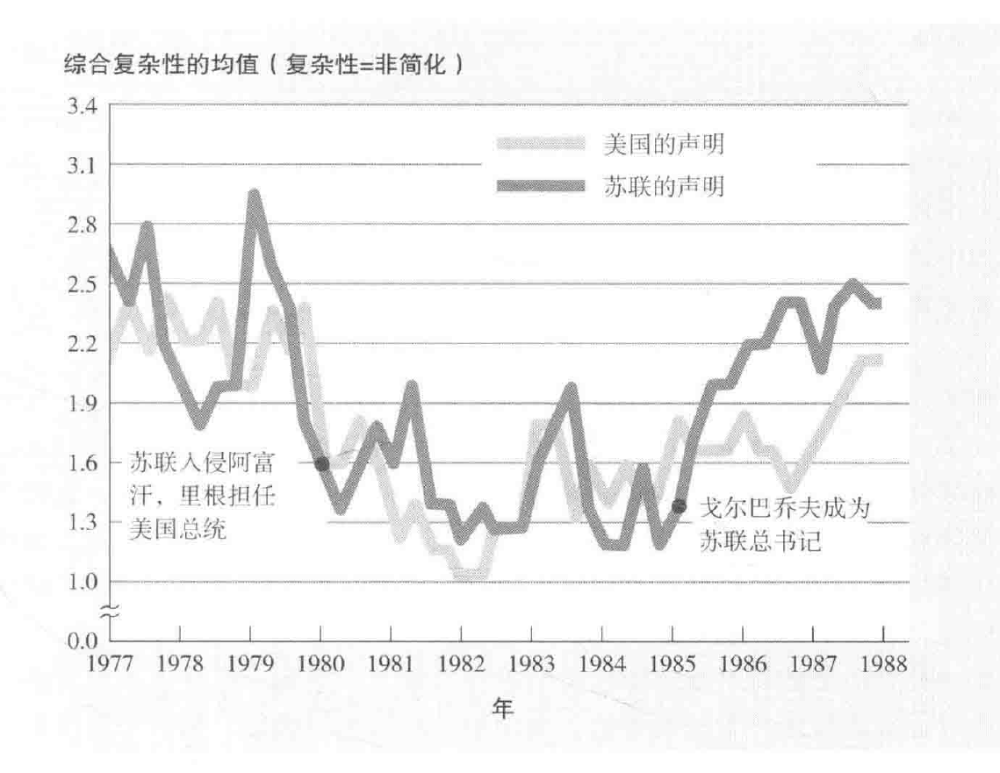

[TOC]
# 冲突与和解
## 引发冲突的原因
- **普遍性**：研究显示冲突存在于国家、团体和个人层面
- **核心发现**：**不同团体为私利而产生的行为**是引起冲突的主要因素

### 社会困境 (Social Dilemmas)
- **定义**：个体**追求私利**导致的**集体利益损害**
- **核心问题**：
  - 核武器扩散
  - 全球气候变暖
  - 人口过剩
  - 自然资源枯竭
- **个体利益追求**与**集体福祉**之间产生矛盾
- **实验方法**：通过模拟游戏来研究和理解社会冲突
- **应用**：这些游戏帮助理解战争、和平、社会公正等现实问题

#### 囚徒困境 (Prisoner's Dilemma)
- **故事情景**：两名犯罪嫌疑人被分开审讯，无法相互沟通
- **检察官策略**：
  - 一个嫌疑人认罪，另一个不认罪：认罪者豁免，另一人重判
  - 两人都认罪：两人都得到中等判决
  - 两人都不认罪：两人都得到轻判
- **现实生活应用**：政治冲突、经济竞争、社会互动中的囚徒困境

##### 囚徒困境的影响
- **惩罚与合作**：选择**自保还是互惠合作的权衡**
- **实验结果**：惩罚行为常引发**报复**，导致**冲突升级**
- **现实例子**：国际政治、税收争议、职业体育等领域的冲突

#### 公地悲剧 (Tragedy of the Commons)
- **定义**：共享资源被**过度利用**导致的**集体损失**
- **现实例子**：
  - 滥砍滥伐引发的生态问题
  - 汽车尾气排放造成的全球气候变暖
- **资源消耗心态**：**个体行为**对环境的影响被忽视

#### 公地悲剧的文化影响
- **文化差异**：西方与东方文化对资源利用的**不同态度**
- **实验观察**：无论文化背景，过度消耗资源的趋势**普遍存在**

#### 基本归因错误 (Fundamental Attribution Error)

##### 归因错误特点
- **行为动机解释**：将个人行为动机**归因于外部压力**（例：“我不得不提防被对方利用”）
- **对他人行为的评价**：倾向于**不客观地评价他人行为**（例：“她很贪婪”，“他是不可靠的”）
- **缺乏自觉**：多数人未意识到**他人对自己的评价**中也存在归因错误

##### 归因错误的影响
- **自我膨胀和自我欣赏**：这类倾向强的人**不易赞同他人观点**

#### 动机的演化 (Evolution of Motivation)

##### 动机变化
- **任务初期**：动机可能是为了获得**小额回报**
- **现实冲突**：如囚徒困境或公地悲剧，展示了**非零和博弈**（non-zero-sum games）
- **冲突结果**：双方可能都赢或都输，显示个人短期回报与群体长期利益的**对立**

##### 利己行为的双重性
- **负面影响**：某些利己行为可能**对集体有害**
- **正面影响**：按亚当·斯密观点，个体追求利益可能**促进整个社会的利益**
#### 解决社会困境 (Resolving Social Dilemmas)

##### 策略概述
- **目标**：指导人们**通过合作**提升共同利益
- **难题**：个人短期回报与群体长期利益之间的**冲突**

##### 适当的管制
- **实例**：
  - 税收征缴、学校和公园资金
  - 捕鱼、打猎季节和限度控制
  - 国际捕鲸协议和渔业的捕捞份额政策
- **效果**：保护公共资源，减少过度利用
- **挑战**：**管制的成本**与**对个人自由的限制**

##### 小即是美
- **原理**：缩小群体规模增强**个体对集体的影响和责任感**
- **效果**：小集体中成员更能**感受到自己的贡献**
- **实例**：小团队意识、居住稳定性增强公共认同感；小型共同体决策优于中央政府决策

##### 沟通
- **作用**：促进合作，减少误解和不信任
- **实验例子**：通过沟通，小组成员**更关注整体利益**
- **挑战**：避免恐吓和侮辱，促进**积极交流**

##### 改变激励机制
- **实例**：城市交通政策调整，增加公交服务激励
- **效果**：鼓励合作行为，减少自私行为
- **应用**：政策调整以奖励社会利益

##### 倡导利他规范
- **实现途径**：
  - 强有力的领导影响
  - 以合作规范定义情境
    - 将特定的社会互动或决策环境框架化为鼓励合作的情景
  - 增加群体意识和责任感
- **实验证据**：**沟通和情感引导**增强利他行为
- **实例**：将游戏或实验称为“团队游戏”而非“华尔街游戏”会激发更多的合作行为
- **历史案例**：公民权利运动和战时牺牲
- **挑战**：如何在**更广泛的社会层面**实施

### 竞争 (Competition)

#### 竞争与敌意
- **起因**：不同群体为**稀缺资源**（职位、住所、资源）的竞争引发敌意
- **冲突产生**：**利益冲突**导致**现实群体冲突**（Realistic Group Conflict Theory）

#### 竞争的实例
- **法国穆斯林青年骚乱**：示范了缺乏工作和社会不公正的反应
- **占领华尔街运动**：表达对社会财富分配不平等的不满

#### 谢里夫实验 (Sherif Experiment)

##### 实验背景
- **实验者**：Muzafer Sherif
- **目的**：研究**竞争和冲突**对群体行为的影响
- **灵感来源**：谢里夫对希腊军队入侵土耳其的亲身经历及其对人类群体间野蛮行为的好奇

##### 实验设计
- **对象**：11-12岁的**普通男孩**
- **地点**：位于俄克拉荷马州的山贼洞州立公园
- **分组**：将男孩**随机分为两组** - “响尾蛇”和“老鹰”
- **阶段一**：形成**群体认同** - 分别进行团队建设活动，不知道对方存在

##### 冲突产生阶段
- **发现对方存在**：两组意识到对方的存在
- **竞争活动**：进行**一系列竞争性活动**，如棒球比赛、拔河等
- **奖励机制**：胜利一方获得奖品，如奖章、小刀
- **结果**：两组开始产生**敌对情绪**，行为模式变得更具攻击性

##### 冲突升级
- **言语冲突**：比赛中出现**互相侮辱**
- **行为冲突**：进展到**物理冲突**，如“垃圾大战”，破坏对方物品
- **群体描述**：对己方使用积极词汇（勇敢、坚强），对对方使用负面词汇（卑鄙、自作聪明）

##### 群体极化现象
- **观察**：在竞争环境中，群体的竞争性**超过了个体**
- **后果**：对冲突群体的**负面看法增强**

##### 实验意义
- **社会影响**：展示了竞争环境如何促进**群体内部的团结和对外的敌对**
- **对冲突理解**：提供了对人类群体冲突的**深入理解**

#### 竞争的条件
- **资源限制感知**：感知资源如金钱、工作岗位为**零和的限制资源**
- **外群体作为竞争者**：**外群体被视为潜在竞争者**时，冲突更易发生

### 知觉到的不公正 (Perceived Injustice)

#### 定义与反应
- **定义**：社会心理学家定义不公正为**付出与获得不成比例**
 **常见言辞**：表达**不满**和对不公平的**强烈感知**

#### 公正的社会关系
- **公平等式**：我得/你得 = 我投入/你投入
- **感知差异**：不一致的公正感知可能**导致冲突**

#### 公正的定义问题
- **公平原则**：西方资本主义国家的经济学原则，公正即公平
- **集体主义文化**（非资本主义国家）更倾向于**平均或按需分配**
- “**黄金定律**”：总是由拥有黄金的人来制定规则
  - 有较强社会影响力的人会**利用自己的力量使别人相信**，他们获得的就是他们应得的
- **分配标准**：按价值、平均分配、按需分配的**不同标准**

#### 约翰·罗尔斯的公正观
- **政治哲学**：**约翰·罗尔斯**提出设想**社会经济阶梯不明的未来**（无知之幕），探讨**公正标准选择**

### 误解 (Misunderstandings)

#### 冲突与误解
- **冲突起因**：被知觉到的**行为或目标的不相容**
- **误解的角色**：冲突中的主要问题往往源于**对对方动机和目标的误解**
- **误解的放大作用**：主观上**夸大双方的差异**

#### 引起误解的原因
- **自我服务偏差 (Self-serving Bias)**：个人或群体更倾向于归功于自己的好事，推卸坏事的责任
- **自我合理化 (Self-justification)**：否认错误行为，如否认撞到他人
- **基本归因错误 (Fundamental Attribution Error)**：认为对方的敌意行为反映其邪恶品质
- **信息过滤与成见**：根据成见过滤并理解信息
- **群体极化 (Group Polarization)**：群体内部利己、合理化和成见的极化
- **群体思维 (Groupthink)**：描述己方群体为高尚而强大，对方群体为卑劣而弱小
- **内群体偏差 (In-group Bias)**：仅作为群体成员就产生偏差
- **刻板印象 (Stereotypes)**：一旦形成，难以改变

#### 镜像知觉 (Mirror-image Perceptions)
- **特点**：双方**对对方的误解具有一致性**，美化自己丑化对方
- **例子**：冷战期间美苏之间的**类似偏见**

#### 简单化思维 (Simplistic Thinking)
- **环境影响**：紧张形势下，理智思考变难，**刻板化和直觉判断**增加
- **政治声明的变化**：在紧张期间，政治声明简化为**非黑即白的措辞**

#### 知觉转换 (Perceptual Shift)
- **特征**：随着冲突的起伏，误解**出现和消失**
- **例子**：战时和平时**对敌人的不同知觉**

#### 冲突中的误解
- **广泛性**：冲突中对对方的歪曲印象**普遍存在**
- **镜像式误解**：双方对彼此形成**镜像式的误解**
- **解决冲突的建议**：**抛开偏见**，理解对方的观点，进行换位思考

## 获得和平的途径

### 和解的四C策略
- **接触 (Contact)**
- **合作 (Cooperation)**
- **沟通 (Communication)**
- **和解 (Conciliation)**

### 接触 (Contact)
  - **目的**：通过**近距离接触**增加互相了解和喜爱
  - **效果**：增加接触通常预测**偏见的减少**
  - **研究证据**：分析了38个国家250,555人的研究，94%显示接触减少偏见
#### 接触的影响和前提条件
- **接触对改变态度的影响**
  - **研究例子**：南非种族接触、与同性恋者的接触、与不同文化背景人的接触
  - **间接接触**：通过阅读、想象、朋友的朋友等间接方式也能减少偏见

- **接触的有效前提**
  - **地位平等**：接触双方**地位平等**更有效
  - **非竞争性**：**非竞争性环境**中的接触更有助于减少偏见
  - **权威支持**：接触活动**得到权威机构的支持**更有效

#### 接触的具体效果和挑战
- **种族间接触的积极结果**
  - **生理效应**：跨种族接触可**减少应激激素反应**，降低焦虑
  - **群体突显影响**：**弱化群体身份**，促进更加友好的互动

- **接触的挑战**
  - **焦虑和偏见**：接触可能受到**焦虑、偏见和刻板印象**的干扰
  - **友谊的作用**：与外群体**建立友谊关系**可以显著降低偏见，增强同理心

#### 和平获取的建议
- **交换生活动**
  - **效果**：增加文化多样性的接触和理解，减少文化间偏见
- **弱化群体界限**
  - **策略**：开始时最小化群体差异，然后承认并跨越这些差异
- **推广地位平等接触**
  - **实施**：鼓励在平等和非竞争性环境下的接触活动
- **建立相互信任的友谊**
  - **方法**：通过持续、个人间的接触建立跨越群体界限的友谊

### 合作 (Cooperation)

#### 超越接触的合作
- **合作的必要性**：仅靠地位平等的接触有时不足以消除强烈的敌意，需要**更深层次的合作**
- **谢里夫夏令营实验**：简单的接触在“老鹰”和“响尾蛇”两组间未能减少敌意，因为他们之间存在**根深蒂固的敌意**

#### 共同的外部威胁与内部团结
- **共同危机带来的团结**：**共同面对外部威胁或危机**时，人们倾向于互相帮助，减少社会障碍
- **紧急危机中的合作**：例如，暴风雪中的团结、被共同批评的团队成员间的友好
- **共同的敌人统一力量**：面对**共同的敌人**时，群体成员间的团结感增强

#### 超级目标的合作
- **超级目标 (Superordinate Goals)**：能够联合群体成员**共同努力完成的目标**
- **谢里夫实验中的应用**：通过设置超级目标（如修复水管、集资租影碟）促使竞争小组合作，从而**减少敌意**
- **合作的成功与失败**：成功的合作能**增强吸引力和团结感**，而失败的合作可能**加剧冲突**

#### 谢里夫实验第二部分：促进和解的合作

##### 实验背景
- **实验环境**：谢里夫在夏令营中进行的实验，涉及两组竞争性很强的男孩团队 —— “老鹰”和“响尾蛇”
- **初期目标**：通过**非竞争性活动**（如看电影、放焰火、共同用餐）减少两组间的敌意
- **结果**：这些活动**未能减少敌意**，反而提供了**互相嘲弄和攻击**的机会

##### 实验的转变：引入超级目标
- **超级目标概念**：超级目标是指**两个群体共同努力完成的目标**，这种目标超越了各自的利益和目的
- **应用实例**：
  - **水源问题**：夏令营的供水系统出现问题，需要两个团队共同努力修复
  - **租借影碟**：提供租借影碟的机会，但需要两队共同筹集资金
  - **抛锚卡车**：卡车抛锚，需要两队共同使用绳子将其拖动

##### 合作的影响
- **团结与和解**：经过共同完成这些超级目标后，两队之间的敌意**明显降低**
- **友谊的建立**：男孩们开始在一起吃饭、聊天，友谊开始在两队间蔓延
- **冲突的减少**：原先的敌意和竞争转变为**合作和友好**

##### 实验的深远影响
- **成功的合作经历**：成功的合作经历加强了两队之间的**团结感和吸引力**
- **持久性的变化**：最终，男孩们一起坐巴士回家，彼此以友好的方式告别

#### 合作与和平的促进
- **战争与外部威胁**：国家或群体在**面对共同威胁时的团结**，如战争或恐怖袭击
- **经济上的相互依赖**：国际贸易中的**经济相互依赖**减少战争可能性
- **成功与失败的合作**：**成功的合作经历**可加强团结，失败可能导致更深的分歧

#### 合作学习对种族态度的影响

##### 合作学习的概念
- **合作学习**：在教育环境中，将竞争学习环境**转变为合作环境**，以改善种族间的态度
- **实验方式**：**随机抽取**学生参加种族混合活动
- **结果**：表明种族间合作性活动能**显著改善对彼此的看法**

##### 实验研究与发现
1. **野外探险实验**：
   - **参与者**：白人青少年与黑人共同参与2-3周的野外探险
   - **结果**：跨种族合作后，白人青少年对黑人的态度有明显提升（Green&Wong，2008）

2. **高中研究**：
   - **方法**：调查美国高中生2400人
   - **发现**：和其他民族的学生一起学习和玩耍的学生，对非本族的朋友更多，态度更积极（Slavin&Madden，1979）

3. **中学生研究**：
   - **调查对象**：佛罗里达的中学生3200人
   - **结论**：参与混合民族学习小组的学生相比于竞争学校的学生，种族态度更积极（Green&others，1988）

##### 合作学习的方法
1. **多元小组组成**：
   - **方式**：班级分成多个**种族混合的小组**，每组有不同学习水平的学生
   - **活动**：小组内学习、准备竞赛，通过**互助**提高小组成绩

2. **拼图法（Jigsaw）**：
   - **实施**：学生分成**六人小组**，每人负责学习科目的一部分
   - **互动**：小组成员将所学知识教给同学

##### 合作学习的效果
- **学业成绩**：学生不仅学习知识，还获得**宝贵经验**
- **种族关系**：**种族间友谊**迅速发展，少数族裔学生成绩提高
- **持续性**：实验结束后，许多老师继续**采用合作学习方式**

##### 社会心理学家的观点
- **奥尔波特（Allport）**：种族间平等接触可消除歧视（1954）
- **斯莱文（Slavin）**：合作学习是改善种族关系的有效方法
- **阿伦森（Aronson）**：拼图法增强了学生之间的互相帮助和喜爱

#### 群体和高级认同

##### 多重社会身份
- 我们每天都在**平衡多重社会身份**，如家庭成员、民族、国家公民等
- 注意到与他人共享多重社会身份可以**增强社会凝聚力**（Brewer&Pierce，2005）

##### 多元文化与同化
- **多元文化**：重视保持个人的文化身份，同时尊重不同的文化
- **同化**：个人的价值观和习惯与主流文化相融合
- **多样性统一**：提出共同的理想来推广公民身份的认同，避免民族间的战争

##### 双身份认同
- 人们可能形成“**二元文化**”（bicultural）或"**全文化**"（omnicultural）同一性，既认同本种族的文化和宗教，同时也认同更大的文化
- 例如，生活在英国的亚洲人可能会同时强烈地感觉到自己是亚洲人和英国人（Hutnik，1985）

##### 移民与文化认同
- 随着时间推移，新文化的身份认同**增加**
- 第三代移民（孙辈）对自己的民族身份认同往往更强（Triandis，1994）

##### 群体认同与自尊
- **积极的民族身份认同**有助于提高积极的自尊心
- 移民国家如美国、加拿大中，不同民族间战争较少，彰显共性整合多元的社会格言：**合众为一**

##### 多元文化与同化的争论
- 一方认为多元文化**促进安全感和自信**（Department of Canadian Heritage，2006）
- 另一方认为多元文化只会**导致分裂**，阻碍共同价值观的形成（Phillips，2004）

##### 多样性统一
- 提出既支持基本共同价值，又允许亚文化自由表达的观点
- 移民国家通过**共同价值观**推广公民身份认同，避免民族冲突

### 沟通
#### 谈判 (Negotiation)
- 谈判策略包括**激烈讨价还价**或**善意报价**
- 激烈讨价还价可能**降低期望**，但可能导致**长期冲突**和失去达成真正一致的机会
- 公开宣言的好战态度可能导致双方**难以挽回面子**，防止和解

#### 调解 (Mediation)
- 调解者**提供建议**，帮助冲突双方在**让步**的同时**保持面子**
- 通过促进**建设性沟通**帮助双方理解对方的利益和目标
- 调解人帮助双方**重新思考冲突**，寻求**双赢解决方案**

#### 谈判和调解的技巧
- 创造**整合性协议** (Integrative agreements)，寻找**对双方都有利的解决方案**
- 使用**克制的沟通方式**减少误会，开诚布公地交流想法的同时避免破坏性的争吵
- **建立信任**是解决冲突的关键
- 通过**站在别人的立场**和**诱发同理心**降低刻板印象，增加合作

#### 中立的第三方介入
- **第三方**（如婚姻顾问、劳资调解员、外交官）有助于解决冲突
- 调解人**提出双方都能接受的建议**，帮助重新排序目标，寻找共同利益
- 实验表明，**模仿对方的习惯**可增进信任和发现共同利益

#### 仲裁 (Arbitration)
- 当调解无效时，可采用**仲裁**，由**第三方强制解决冲突**
- 仲裁通常**不受冲突双方欢迎**，因担心失去对结果的控制
- 在明显、难以妥协的矛盾中，面临仲裁的双方可能采取**更强硬的立场**
- **最后提议仲裁** (Final-offer arbitration)，也就是第三方在最后的两个方案中选择一个，促使双方**提出更合理的建议**，但可能受**乐观过度自信**影响

### 和解 (Reconciliation)

#### GRIT 策略
- 提出者: **查尔斯·奥斯古德** (Charles Osgood)
- 定义: "**逐步互惠主动减少紧张**"（Graduated and Reciprocated Initiatives in Tension-Reduction）
- 目的: 通过逐步降低冲突来**扭转冲突的螺旋上升**

#### GRIT 策略的实施
1. **宣布调和意愿** - 发起方声明希望减少紧张并邀请对手回报
2. **建立互惠框架** - 通过宣言确保对方正确理解意图，非示弱或欺诈
3. **小规模和解行动** - 做出小的、可证实的和解行动以建立信任和真诚
4. **保持灵活性** - 避免在任何领域做出过大让步，允许对方选择回报方式
5. **保留反击能力** - 确保在保护自身利益的同时采取和解行动
6. **避免倾轧** - 明确不会容忍任何侵犯行为

#### GRIT 策略的效果
- 实验室游戏中证明了**声明合作愿望能促进合作**
- 重复和解行为**培养更大信任感**
- 力量平衡**避免利用对方**
- 有助于**减少个人间紧张**，恢复沟通和合作

#### GRIT 在现实世界的应用
- 柏林危机：美苏坦克对峙，通过逐步撤退解决冲突
- 以色列和埃及：通过小让步缓解紧张关系，促成协商
- 肯尼迪实验：美国总统肯尼迪停止核试验，引发苏联回应，导致和解行动

#### 和解行动在个人关系中的应用
- 和解姿态（如温和回答、善意微笑）能减少个人间紧张，恢复联系