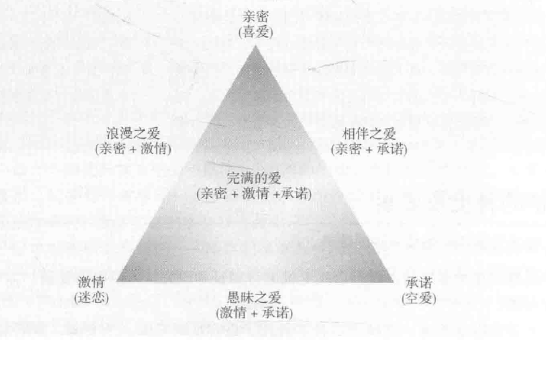
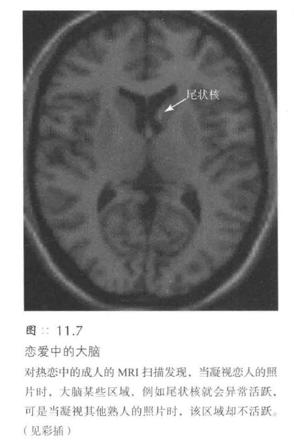
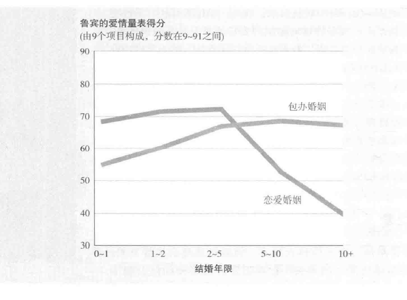
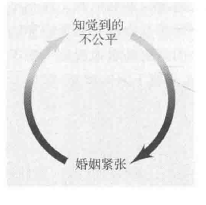
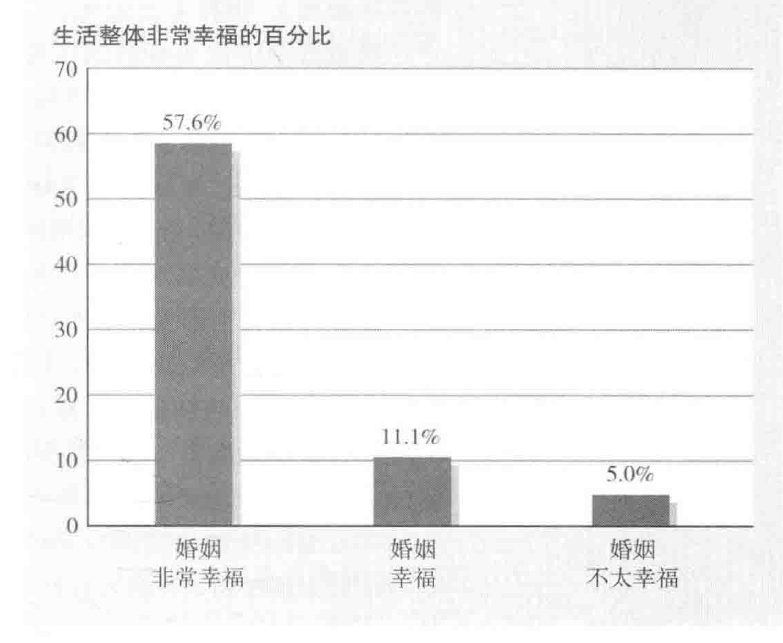

[TOC]
# 吸引与亲密：喜欢他人与爱他人
1. **归属需要的重要性**
   - **亚里士多德**将人称为“**社会性动物**”
   - **归属需要**（need to belong）是**人类基本需求**之一，与自主感和能力感并列
   - 满足归属需要可带来**幸福感**，包括感觉与人联结、自由和有能力

2. **社会排斥的影响**
   - **排斥行为**如拒绝或忽视可阻碍归属需要
   - **排斥感受**普遍存在于学校、工作场所和家庭中
   - **被排斥的反应**包括抑郁、焦虑、情感受伤和孤僻

3. **排斥与攻击行为**
   - 排斥可增加**攻击性和社会性疼痛**
   - 被排斥的人可能对得罪自己的人进行**贬损或抱怨**
   - 排斥伤害在**焦虑**的人群中**持续时间更长**

4. **排斥的心理和生理反应**
   - 排斥可**激活**大脑**对躯体创伤反应的区域**
   - 排斥感受可通过**镇痛药**缓解
   - **爱**是排斥的对立面，可**激活大脑奖赏系统**

1. **排斥的社会影响**
   - 排斥感受可**降低合作和服从规范的意愿**
   - 影响**智力表现**和**自毁行为**
   - 被排斥的经历增加**对他人行为的模仿**

2. **应对排斥的策略**
   - 提供**与新朋友交往的机会**可减轻排斥感受
   - 被排斥的人更注意**微笑和赞同的面孔**
   - **包容性社会环境**可减少不幸的生活模式

## 导致友谊和吸引的因素
### 接近性
1. **接近性的定义与重要性**
   - **接近性**（Proximity）是决定人际关系的**关键因素**
   - **功能性距离**，即人们生活轨迹交集的频率，比地理距离更重要

2. **接近性与友谊的关系**
   - 接近性增加了**与他人建立友谊的可能性**
   - 例如，莱比锡大学的研究显示，学生更倾向于与第一次班会时坐在附近的人建立友谊
   - 在宿舍、工作场所或社区中的**邻近关系**促进了友谊的形成

3. **接近性与浪漫关系**
   - 大多数人的**伴侣**通常是那些生活在相同社区、工作或学习在**同一地点**的人
   - 例如，皮尤研究中心的调查发现，38%的人是在工作或学校遇到他们的伴侣
#### 相互交往
1. **接近性的心理效应**
   - **地理距离**并不是关键，**功能性距离**——人们的生活轨迹相交的频率——才是关键
   - 接近性使人们更容易**发现彼此的相似性**
   - 促进了**相互喜爱**的感觉和**社会归属感**的建立

2. **接近性的策略应用**
   - 为了**建立友谊**，可以选择生活或工作在人们**频繁交往的地方**
   - 例如，选择靠近邮筒的房子或咖啡馆的中心位置

3. **接近性与个性的关系**
   - 即使是**孪生兄弟姐妹**，他们对伴侣的选择也**不一定相同**
   - 这表明接近性可能比个性相似性**更重要**

4. **接近性的双面性**
   - 接近性不仅能促进友谊，也可能导致**敌意**
   - 例如，邻居间的争执或室友间的冲突

#### 对相互交往的预期
1. **预期交往引发的喜欢**
   - 预期**与他人交往本身**就能增加对对方的喜欢
   - 例如，明尼苏达大学的研究表明，女生对预期将要进行亲密交谈的对象有更高的好感

2. **预期交往的适应性意义**
   - **预期喜欢**有助于**建立互惠关系**
   - 这种预期使人们**更倾向于**与经常见面的人建立积极关系

3. **预期交往在日常生活中的应用**
   - 在日常生活中，我们经常需要与不同的人**建立持续的关系**
   - 例如，与室友、家庭成员、老师、同学、同事等的关系
   - 对这些人的**喜欢**有助于**建立更好的关系**，进而促进更快乐、更有成就的生活

4. **预期交往对态度的影响**
   - 对未来交往的预期甚至能**改变对某些人的看法**
   - 例如，大选中落败方的支持者发现自己对获胜方的看法有所改善

#### 曝光效应
1. **曝光效应的基本原理**
   - **熟悉**诱发**喜欢**，与“**熟悉生轻视**”的谚语相反
   - 对各种刺激的曝光**提高了人们对它们的评价**
   - 实验表明，**频繁出现**的无意义词语或符号被认为**更积极**

2. **曝光效应的实际应用**
   - **名字效应**：人们偏好自己名字中的字母和频繁出现的字母
   - **镜像效应**：人们更喜欢镜像版的自己形象，因为这是他们习惯的形象
   - **广告和政治**通过**重复曝光**，可以增加商品的销量或候选人的得票率
   - 选举实例：在缺乏明显区分的情况下，选民倾向于选择更熟悉的名字

3. **曝光效应的心理和生理基础**
   - **情绪的即时性**：情绪反应比思维反应更快
   - 脑研究得出，情绪和认知由**不同的脑区**引发
   - **杏仁核的作用**：与情绪有关的脑结构，其损害影响**情绪功能**但不影响**认知反应**

4. **曝光效应的适应意义**
   - 帮助区分**熟悉的安全事物**和**不熟悉的不安全事物**
   - 促进人与人之间的**吸引力和喜欢**
   - **影响对他人的评价**：我们倾向于喜欢熟悉的人

5. **曝光效应的局限性和负面影响**
   - **对陌生的警惕**：面对不同于自己的人时可能产生偏见
   - **婴儿的种族偏好**：表现出对自己熟悉种族的面孔的偏好
   - **刻板印象的形成**：有时是为了对直觉的情感进行辩护而出现

### 外表吸引力
1. **外表在约会中的作用**
   - **外表吸引力**预测**约会次数**，尤其在**女性**中更为显著
   - **男性**的外表对约会次数的影响**相对较小**
   - 女性更倾向于选择**性格好的普通外表男性**而非外表出众但性格冷淡的男性
   - 男性相比女性**更重视伴侣的外表**

2. **性别差异在外表重视程度上的体现**
   - 女性相比男性更重视**诚实、幽默感、善良和可靠性**
   - 男性更倾向于**因外表而爱上女性**，而女性则因性格而爱上男性
   - 在约会邀请中，男性**更常主动**，可能影响对外表的重视程度

3. **实验研究支持外表的重要性**
   - 男性在实验中显示出更重视异性的外表
   - 女性也在乎男性的外表，但可能以**不同方式**表现
   - 在**速配活动**中，外表吸引力对男女双方**都很重要**

4. **外表吸引力的广泛影响**
   - 外表影响**选举结果**，候选人的外表吸引力能预测选举胜利
   - 男性倾向于投票给**外表吸引力的女性候选人**，女性则偏好**亲切的男性候选人**
   - 在**求职和大学申请**中，有吸引力的异性也会受到**正面偏向**

#### 匹配现象
1. **匹配现象的基本概念**
   - 人们倾向于与**相似吸引力的人**建立伴侣关系
   - 这种现象在夫妻、约会对象和志趣相投者中普遍存在
   - 选择伴侣时，人们不仅考虑外表吸引力，还考虑**智力、受欢迎程度和自我价值**

2. **实验研究对匹配现象的支持**
   - 在**自由选择**的情况下，人们倾向于接近吸引力与自己**相匹配**的人
   - 外表上的匹配有利于**良好关系的发展和维持**
   - 九个月后，外表吸引力相似的人更有可能坠入情网

3. **社会市场理论在匹配现象中的应用**
   - 吸引力较差的一方可能通过**其他品质**进行补偿
   - 人们在**社会市场**中对自己的资本进行**合理匹配**
   - **征婚广告中的资本交换**展示了这一现象

4. **资本匹配的具体例子**
   - **男性**强调**财富或地位**，寻求**年轻和有吸引力**的女性
   - **女性**强调**年轻和美貌**，寻求**有稳定工作的职业男士**
   - 广告中强调收入和学历的男性及强调年轻和美貌的女性得到更多反馈

5. **自我形象在匹配现象中的作用**
   - 大多数人报告**积极的自我形象**
   - 在网上约会服务中，大多数人认为自己的长相“超出平均水平”或“非常不错”
   - **自我服务偏差**、**经常看到自己的脸**和**策略性自我展示**三者影响自我形象的报告

#### 外表吸引力的刻板印象
1. **外表吸引力效应的广泛影响**
   - 实验显示，人们对外貌有**明显的偏好**，不愿意与外貌不佳的人接近
   - **儿童和婴儿**也倾向于**喜欢有吸引力的面孔**
   - **成人对儿童的态度**也受到外表吸引力的影响，认为有吸引力的孩子更聪明、更成功

2. **外表吸引力刻板印象的形成与影响**
   - 从小通过**故事**等方式形成“**美的就是好的**”刻板印象
   - 美丽与善良、丑陋与邪恶的联系在**童话故事**中常见
   - 儿童认为美丽意味着**受欢迎和被喜爱**

3. **改变外貌对人际关系的影响**
   - **整形手术和美容治疗**可以永久改变一个人的外表
   - **外表的改变**可能改变人们**对待该个体的方式**
   - 整形手术后，人们不仅认为外表更有吸引力，还认为**个性特质更积极**

4. **外表吸引力与社会期望**
   - 人们认为漂亮的人更快乐、性感热情、开朗、聪明和成功
   - 与有吸引力的人建立联系时，人们表现出**更多友善和互惠互利的品质**

##### 第一印象
1. **第一印象的重要性和外表吸引力的作用**
   - **第一印象**在社会交往中尤为重要，尤其在城市化和社会变动性增大的背景下
   - 在**速配实验**等情境中，**外表吸引力**在选择伴侣时起着**决定性作用**
   - 在**城市**环境中，外表吸引力与个人幸福感和社交活动的关联**更为显著**

2. **外表吸引力对职业和经济收入的影响**
   - 面试中，外表吸引力和外表修饰对第一印象有**显著影响**，尤其是异性评估者
   - 有吸引力的人通常能获得**更高的声望和更多的经济收入**
   - 研究表明，外表吸引力**与年收入正相关**，吸引力每提高一点，收入相应增加

##### “美即是好”这种刻板印象准确吗？
1. **外表吸引力与社交技能的关联**
   - 有吸引力的人通常被认为**更外向、社交技能更好**
   - 在电话交谈实验中，有吸引力的人被评价为**更有社交技能和更受欢迎**
   - 有吸引力的人**更受重视，更自信**，这可能是由于**自我实现的预言效应**

2. **“美即是好”刻板印象的准确性和影响**
   - 存在“美即是好”的**刻板印象**（physica-attractiveness stereotype），但其准确性存在争议
   - 有吸引力的人确实**在某些方面表现得更好**，但这可能是由于他们受到的**正面反馈和自我感觉**的影响

#### 谁具有吸引力
1. **吸引力的相对性和文化差异**
   - **吸引力**是一种**变化多端**的特征，不同文化和时代有**不同的审美标准**
   - 例如，不同地区和时代的美丽标准包括鼻孔穿孔、拉长脖子、染发、文身等
   - 在资源匮乏的环境中，**丰满**被视为更有吸引力，而在物质富足的环境中，**苗条**等同于美丽
   - 在**亲缘关系或社会安排**主导的文化中，吸引力的影响力**较弱**

2. **平均特征和对称性作为吸引力的关键因素**
   - 研究表明，**平均的面孔特征**被普遍认为更具吸引力
   - **对称的面孔**也被视为更有吸引力，这可能是因为大脑更易于处理和分类这种面孔
   - 通过计算机生成的平均和对称的面孔被认为比真实面孔更美

##### 进化与吸引力
1. **进化心理学对性别差异的解释**
   - **进化心理学家**认为**美丽**反映了**健康、年轻和生殖能力**
   - 男性偏好**显示生殖能力的女性特征**，这在不同文化中普遍存在
   - 女性更倾向于选择**能提供和保护资源的男性**

2. **外表特征与生殖能力的关联**
   - **英俊**的男性通常拥有**更高质量的精子**
   - 拥有**沙漏型身材**的女性**生育力更强**
   - 这些特征**在进化过程中被优选**，因为它们与生殖能力相关

3. **伴侣选择中的性别差异**
   - 男性在选择伴侣时重视**外表吸引力**，女性则重视**男性的地位和财富**
   - 两性都偏好**有爱心和聪明的伴侣**

4. **生殖优势的其他线索**
   - 男性普遍认为**腰臀比例窄30%的女性**最有吸引力，这与**高生育力**相关
   - 女性在选择男性伴侣时，也偏好**肌肉发达、体现男性化特征**的男性

5. **进化心理学的观点**
   - 进化心理学家认为，**吸引力和婚配**是人类生存和繁衍的**基本驱动力**
   - 这种吸引力不仅仅是文化现象，而是深植于人类进化的**基本特性**

##### 社会比较
1. **社会比较的基本概念**
   - 吸引力不仅受**生物特性**影响，还取决于**个人的比较标准**
   - 通过**比较**，人们形成对吸引力的评价和期望

2. **对比效应的实验研究**
   - 观看《**霹雳娇娃**》后的男生对普通女性的吸引力评价降低
   - 看过**杂志裸体照片**的男性对普通女性和妻子的吸引力评价减少
   - 观看**色情电影**后对伴侣的满意度降低

3. **对比效应在自我知觉中的作用**
   - 见到**魅力非凡**的同性后，人们会觉得自己缺乏吸引力
   - 见到**相貌平平**的同性后，这种感觉减弱
   - **现代传媒**的存在加剧了这种比较，导致人们低估自己和伴侣的吸引力

4. **社会比较对自我满意度的影响**
   - 社会比较导致人们对自己的外貌和伴侣的吸引力**不满**
   - 这种不满促使人们进行**化妆、减肥和整容手术**
   - 即使投入**大量金钱**，也**难以满足**由社会比较引起的期望

5. **吸引力的乐观观点**
   - **青少年**的面部吸引力对**成年后**的吸引力**预测力低**
   - 有吸引力的人不仅**外表**吸引人，其**个性**也让人喜欢
   - 人们**越喜欢某人**，就**越觉得他们有吸引力**
   - **爱情**使伴侣在恋人眼中**变得更有吸引力**
   - 热恋中的人对其他异性的**吸引力感知降低**

### 相似性与互补性
#### 物以类聚吗
##### 相似产生喜欢
1. **相似性的基本概念**
   - 人们倾向于与拥有**相同态度、信仰和价值观**的人建立友谊和伴侣关系
   - 夫妻间**相似性越大**，**幸福度越高**，离婚率越低
   - 相似性与喜欢之间的因果关系**仍然是个谜**

2. **相似性产生喜欢的实验研究**
   - 实验表明，当某人的态度与自己**越相似**，越容易产生喜欢
   - 这种效应适用于**不同年龄、职业和文化的人群**
   - 相似的想法不仅增加**赞赏**，还能推断出对方**性格良好**

3. **现实生活中的相似性效应**
   - 在**共同生活环境**中，**相似性高**的人更容易成为朋友
   - 在**不同文化背景**下，相似的态度、特质和价值观**预测婚姻满意度**
   - 速配中，**说话风格相似**的人更容易相互吸引

4. **相似性在日常互动中的作用**
   - 人们倾向于与外貌或行为相似的人**坐在一起**
   - **微妙的模仿**能增进人际关系和谐
   - 互联网征婚网站基于**相似性匹配原则**

5. **相似性与生活习惯的关联**
   - 早睡早起型和晚睡晚起型的人倾向于寻找**生活习惯相似**的伴侣
   - 喜欢**相同音乐**的人通常拥有**相似的价值观**

##### 不相似导致不喜欢
1. **不一致性偏好**
   - 人们倾向于认为他人与自己**持有相同态度**
   - 当发现他人态度不一致时，会**减少对该人的喜欢**

2. **道德信仰与态度差异**
   - **道德信仰**强烈相关的态度和价值观差异会导致**更强烈的不喜欢和疏远**
   - **政治立场的不同**导致同一政党成员间的**偏好和排斥**

3. **性取向与性别特征的影响**
   - **异性恋男性**倾向于**鄙视**与自己性别特征和性行为不同的**同性恋者**

4. **态度不同的影响**
   - 不同的态度对减少喜欢的影响**大于**相似态度的促进作用
   - 团体成员**期望**彼此具有相似性，**难以喜欢**持不同意见的人
   - 恋人和舍友随时间在情绪反应和态度上**变得更相似**

5. **种族态度与文化差异**
   - 将其他种族视为不相似会**影响种族态度**，增加种族压迫可能性
   - **思想上的相似性**比肤色相似性对种族态度更重要
   - **文化差异**是现实，应被视为**对多元文化社会的贡献**
   - 尊重和欣赏文化差异是当代社会的**主要挑战**

#### 对立引发吸引吗
1. **相似性作为主导因素**
   - 在多个方面（如年龄、宗教信仰、种族、经济水平等），**相似性**是人际关系中的**主导因素**
   - 例如，聪明的人倾向于与聪明的人聚集，富裕的人倾向于与富裕的人聚集

2. **互补性的可能性**
   - 存在一种观点认为**互补性**（complementarity）（如外向者与内向者）可能**促进关系**
   - 例如，《读者文摘》提到的社交型与非社交型、求新与不愿变化、挥金如土与节俭、冒险与谨慎的配对

3. **研究结果对互补性的挑战**
   - 研究表明，大多数人被**富于表现力且外向的人**所吸引
   - 沮丧的人并不倾向于**寻找快乐的人**来提升自己的情绪，反而更倾向于**与心情相似的人相处**
   - **对比效应**可能使人在与更优秀的人相处时感到自卑

4. **互补性在特定情况下的作用**
   - 尽管互补性在某些方面可能促进关系改进，人们通常更喜欢与**需求和人格相似的人**结为伴侣
   - **支配性与被支配性的互补**可能是一个例外
   - 但总体上，对立者**并不相吸**

### 喜欢那些喜欢我们的人
1. **相互吸引的基础**
   - **接近性和吸引力**决定最初的吸引
   - **相似性**影响长期吸引
   - **强烈的归属需要**和**被喜欢的需求**促使我们**喜欢那些喜欢我们的人**

2. **喜欢与被喜欢的相互作用**
   - 一个人喜欢他人，往往预示着**对方也会喜欢他**
   - 发现有魅力的人喜欢自己会**激发浪漫情感**
   - 被告知有人喜欢或仰慕自己时，会产生**回馈情感**

3. **不确定性的作用**
   - 不确定对方是否喜欢自己时，会**增加对对方的吸引力和关注**

4. **消极评价的影响**
   - 人们对消极评价**更为敏感**
   - 消极信息比积极信息**更能抓住注意力**
   - 在评价和决策中，消极信息往往比积极信息有**更大影响力**

5. **古代至现代的观点**
   - **古代哲学家**和**现代作家**都认为我们倾向于喜欢那些我们认为喜欢我们的人
   - 他们所不能预见的是这一规律起作用的**精确条件**

#### 归因
1. **奉承的真实性和动机**
   - 当奉承**显然违背事实**时，我们可能会**怀疑其动机**
   - 通常认为**批评比表扬更真诚**
   - “**说实话**”开场白通常预示着批评

2. **归因对反应的影响**
   - 我们对赞美的反应取决于我们**对其动机的归因**
   - 如果认为赞美是为了**讨好或自我服务**（ingratiation），我们可能会对奉承者和赞美**失去信任**
   - 但如果**没有明显的别有用心的动机**，我们通常会**接受奉承**

#### 自尊和吸引
   - 在**自尊受损**时，**他人的支持**显得更为重要
   - 实验表明，自尊受损的人更倾向于**接受并喜欢给予支持的人**
   - 这解释了为何人们在遭受自尊打击后可能会**迅速坠入激情的恋爱**

#### 获得他人的尊重
1. **尊重的获得与喜欢的关系**
   - 人们可能更喜欢**最初不喜欢他们后来又喜欢他们的人**
   - 实验表明，当尊重是**逐渐获得**的，尤其是在**推翻了之前的批评**后，个体会**更喜欢目标人物**

2. **频繁赞扬的价值**
   - **过度的赞扬**可能会**失去其价值**
   - **稀缺的赞扬**可能**更有影响力**
   - **例子**：丈夫频繁赞美妻子与偶尔的批评对比

3. **真诚与关系的深度**
   - 在亲密关系中，**真诚**变得**更重要**
   - 展示**真实自我**，包括**积极和消极情绪**，有助于建立持久、满意的关系
   - **例子**：阿伦森对真诚在关系中的重要性的解释

4. **消极反馈与社交交往**
   - 在大多数社交交往中，人们会**自我检查消极情绪**
   - 真正的朋友会提供**坦率的反馈**，包括不好的消息
   - **例子**：斯旺及其同事关于真正朋友的定义

5. **理想化与关系满意度**
   - **相互理想化**的伴侣通常**更快乐**
   - 恋爱中的人倾向于对伴侣持有**积极偏见**
   - **例子**：默里等人对恋爱情侣和已婚夫妇的研究

6. **真诚与假设的天性善良**
   - **真诚**对关系的良好发展很重要
   - **假定对方天性善良**也同样重要
   - **例子**：对婚姻满意度高的夫妇的行为特点

### 关系中的奖赏
1. **吸引的本质**
   - 吸引涉及被吸引者和吸引他人的**双方**
   - 真正的吸引源于与他人相处时的**满意和快乐感受**

2. **吸引奖赏理论的基本原则**（Reward Theory of Attraction）
   - 我们喜欢那些**给予我们回报**或与我们获得回报**有关**的人
   - 当与某人交往的**回报大于成本**时，我们倾向于**维持这种关系**
   - 当一方满足另一方**未得到满足的需求**时，产生**相互吸引**

3. **吸引的心理学解释**
   - 人们对与**奖赏性事件**相关的事物或人产生**积极感受**
   - 在**愉快环境中**的人们倾向于**对周围的人产生好感**
   - 在**不愉快的情境下**，人们可能对遇到的人**没有好感**

4. **“联系-喜欢”原则的实验验证**
   - 实验表明，人们倾向于喜欢**与积极体验相关**的人
   - 当实验者表现**友善**时，受试者更倾向于选择**与实验者相似的人**
   - 当实验者表现**不友善**时，受试者倾向于**不选择与实验者相似的人**

5. **吸引力的影响因素**
   - **接近性**：与近邻和同事的关系更容易带来友谊
   - **外貌吸引力**：我们认为有吸引力的人具备其他期望品质
   - **观点相似性**：相似观点让我们感到被理解和认同
   - **被喜欢和被爱**：我们倾向于喜欢那些喜欢我们的人

## 爱情的种类及要素
1. **爱情的复杂性**
   - 爱情比喜欢**更复杂**，难以测量和研究
   - 人们对爱情有**强烈的渴望和情感投入**

2. **初步研究焦点**
   - 研究集中在陌生人之间**短暂接触时的反应**
   - 起初对他人的喜爱**受多种因素影响**，如接近性、吸引力、相似性、他人的喜欢及回报性特质

3. **长期关系的影响因素**
   - **初次相遇时形成的印象**对长期关系有**重要影响**
   - **例子**：如果北美人的爱情选择**完全随机**，不考虑接近性与相似性，那么天主教徒与基督教徒、黑人与白人、大学生与高中辍学者之间的婚姻将更为常见

4. **爱情研究的转变**
   - 社会心理学家从研究**初次相遇的吸引力**转向研究**持久、长期的亲密关系**
   - 长期的爱情不仅是初时好感的延续和增强，而是**更为复杂和深入的情感联系**

### 激情之爱（passionate love）
1. **爱情的测量与界定**
   - **爱情的测量**比其他情感如攻击、利他、偏见和喜好**更为复杂**
   - 心理学家提出爱情是由**激情、亲密和承诺**三个方面构成的**三角形模型**

2. **激情之爱的特点**
   - 激情之爱是**情绪性的、令人兴奋的、强烈的**爱
   - 激情之爱包括**身体表达、对伴侣的着迷和期望排他性**
   - 激情之爱的**情绪波动大**，快乐与绝望交替出现

3. **激情之爱的研究**
   - **鲁宾的研究**：通过观察情侣的目光接触时间，发现热恋情侣会长时间注视对方
   - **冈萨格等人的观察**：热恋情侣在交谈时会有更多的互动，如点头、微笑和身体接触
   - **速配观察**：可以快速准确判断一个人是否对另一方有好感

4. **激情之爱的影响**
   - 激情之爱使人**专注于爱人**，对爱人的反应极为敏感
   - 当对方**回应**时，感到满足和快乐；**未回应**时，感到空虚和绝望

5. **激情之爱与其他爱情类型的区别**
   - 激情之爱与友谊之爱的区别在于**性吸引力的存在与否**
   - 有人可能表达“我爱你，但我们并不相恋”，意味着他们感受到的是**友谊之爱而非激情之爱**

#### 关于激情之爱的一个理论
1. **激情之爱的心理生理基础**
   - **激情之爱**：**生理唤醒状态**被诠释为**情绪**，取决于对唤醒状态的**归因**
   - 情绪包含**身体和心理反应**，即生理唤醒和对该唤醒的解释
   - **例子**：心跳加速、手发抖可能因环境不同被解释为恐惧、焦虑或喜悦

2. **激情之爱的实验研究**
   - **例子**：提高性唤醒（通过阅读色情小说或观看色情电影）的男性大学生对女性有更强烈的反应，爱情量表得分更高
   - **情绪的两因素理论**：**兴奋状态**下的男性可能错误地**将生理唤醒归因于女性**

3. **生理唤醒与激情之爱的关系**
   - 任何来源的生理唤醒**都可增强激情感受**，如果能**自由归因**于浪漫刺激
   - **实验例子**：在高吊桥上遇到的女性更可能引发男性的浪漫反应
   - 其他活动如观看恐怖电影、乘坐过山车也能增强对吸引人的人的反应

4. **激情之爱在婚姻中的应用**
   - **共同进行激活活动**的夫妇报告**更高的婚姻满意度**
   - **例子**：共同完成提高激活水平的活动（如绑腿赛跑）的夫妇更满意
   - 肾上腺素促进爱情关系的亲密度
   - 激情之爱**刺激与奖励有关的脑区**，这些区域**多巴胺丰富**

5. **爱情的社会层面**
   - 爱情不仅是欲望，也是**性欲和深厚友情的结合**
   - **激情之爱的公式**：激情之爱 = 欲望 + 依恋

### 影响爱情的因素：文化与性别
1. **爱情与文化的关系**
   - **大多数文化中的爱情观念**：在166种文化的分析中，89%的文化抱有**浪漫爱情观念**，表现为**调情和私奔等行为**
   - **包办婚姻文化中的爱情**：在某些文化中，尤其是实行**包办婚姻**的社会，爱情通常**出现在婚姻之后**
   - **美国的爱情观念变迁**：20世纪60年代，只有少数美国大学生认为爱情是婚姻的基础，而现在几乎所有大学生都这样认为

2. **性别与爱情体验的差异**
   - **男性与爱情**：研究表明男性比女性**更容易坠入情网**，更难从爱情中解脱，且**不易结束**即将迈向婚姻的关系
   - **例子**：一位19岁男性的信表达了对爱情的深陷和困惑
   - **女性与爱情**：女性在热恋中的情感投入通常与男性**相当**，甚至**更多**，更倾向于**体验愉悦和“无忧的眩晕感”**
   - **性别差异**：女性更注重友谊中的**亲密感和关心伴侣**，而男性更多考虑恋爱中的**嬉戏和性方面**

### 相伴之爱
1. **激情之爱的特点**
   - **初始阶段**热火朝天，**情绪波动大**
   - 随着时间推移，**情感体验减少**
   - **例子**：新婚夫妻的情感体验**在两年内减半**

2. **相伴之爱的发展**
   - **激情转变**：激情之爱逐渐转变为**相伴之爱**（companionate love）
   - **化学变化**：**激情激素**减少，**催产素**增加，促进依恋和信任
   - **深沉情感依恋**可以激活**不同的脑区**，表现为**平和的情感**
   - **文化例子**：卡拉哈利沙漠中游牧民族的爱情观

3. **爱情与药物成瘾的相似性**
   - **初始高峰**：爱情初期类似**药物带来的冲击**
   - **逐渐适应**：随着时间的推移，情感反应**减弱**
   - **戒断反应**：爱情结束后，感到**空虚和失落**

4. **激情之爱的长期影响**
   - 随着激情减退，**共有价值观**变得更重要
   - **包办婚姻与自由恋爱的比较**：包办婚姻中爱情感觉**随时间增强**，自由恋爱则**相反**

5. **文化差异对爱情的影响**
   - **亚洲社会**：强调**社会性依恋**，较少强调个人感受
   - **西方社会**：更多强调**浪漫爱情**，可能导致对失去的东西过分关注

6. **激情之爱的生物学适应性**
   - **物种生存策略**：激情之爱**有助于繁衍后代**
   - 孩子成长后，父母**重新关注彼此**，可能恢复某些浪漫感觉
   - **长期亲密关系**：经历共同的人生风雨，相伴之爱愈久弥醇

## 促进亲密关系的因素
### 依恋
1. **依恋的生物基础**
   - **爱情**被视为一种**生物性驱使**，与社会性动物的特性相符
   - 人类的归属需要具有**适应性意义**，促进种族生存
   - 研究表明，**特定基因形式**与哺乳动物的配偶联结相关
     - **催产素和抗利尿激素**在促进男女联结中起作用
     - **抗利尿激素活动性**相关基因预测**婚姻稳定性**

2. **婴儿期依赖与成人依恋**
   - 婴儿对**熟悉面孔和声音**产生偏好，显示出社会性反应如爱、恐惧、愤怒
   - **婴儿与父母的社会依恋**强化了人类间的联系
   - 剥夺儿童熟悉的依恋对象会导致**退缩、畏惧**等负面影响
   - **亲密依恋关系**被视为生活的**核心**，为个人提供力量和生活享受

3. **依恋与爱的特性**
   - 亲子、朋友、配偶或情侣间的亲密关系中存在**共有元素**
     - 双方理解、提供和接受支持、重视和享受相爱的人在一起
   - 激情之爱具有**额外特性**：身体亲昵、排他性期待、对爱人的强烈迷恋

4. **激情之爱的普遍性**
   - 婴儿与父母间的强烈感情**类似于**情侣间的激情之爱
   - **脑区活动**在婴儿与父母以及年轻情侣间**相似**
   - **婴儿期的依恋风格**可能**延续**到成人期的关系中

### 依恋类型
1. **安全型依恋（Secure Attachment）**
   - 占婴儿和成人的**大约70%**
   - **特点**：在母亲在场时**舒适地玩耍**，母亲离开时**紧张**，母亲回来时会**寻求安慰后继续玩耍**
   - **影响**：形成成年期亲密关系的蓝图，包含**相互信任和冲突处理**
   - **成人特征**：**容易与他人接近**，不因依赖或被抛弃而苦恼，享受**安全和忠诚**的关系

2. **回避型依恋（Avoidant Attachment）**
   - 占婴儿和成人的**大约20%**
   - **特点**：与母亲分离时表现出**较少不安**，团聚时对母亲**依附较少**
   - **成人特征**：**不太投入亲密关系**，倾向于摆脱关系，可能倾向于**一夜情**
   - **分类**：**恐惧型**（与人过于接近感到不舒服）和**疏离型**（重视独立和自足）

3. **不安全依恋（Insecure Attachment）**
   - 占婴儿和成人的**大约10%**
   - **特点**：**焦虑-矛盾型**依恋，**紧缠**母亲，母亲离开时**大哭**，回来时表现**疏离或敌意**
   - **成人特征**：**缺乏信任感**，表现出**强烈占有欲和妒忌**，情感关系可能**不稳定**

4. **依恋类型的文化和代际影响**
   - 研究表明，不同文化中的依恋类型与**父母的反应方式**有关
   - 早期依恋经验形成了关于**人际关系的内部工作模式**
   - **敏感、反应型**的母亲通常培养出**安全型依恋**的孩子
   - 三代研究表明，依恋类型具有**代际一致性**

5. **依恋类型与个体气质**
   - 依恋类型也可能反映**个体不同的天生气质**
   - 特定基因与人类中的**忠诚和不忠诚行为**相关
   - 容易**愤怒和焦虑**的青少年可能在成年时拥有**不稳定的关系**

### 公平
1. **吸引的公平原则（Equity）**
   - 概念：感情关系中双方**所得与投入成正比**
   - 影响：当双方**感觉所得与付出成正比**时，感到公平

2. **日常关系与长期关系中的公平**
   - **陌生人和熟人关系**：通过**交换利益**保持公平，如笔记交换
   - **长期关系（如室友或爱人）**：不追求完全等价交换，**更随意的利益交换**，最终不再计较谁欠谁

#### 长期公平
3. **长期关系中的公平观念**
   - 在长期关系中，人们**不在乎短期的公平**
   - 真正的友谊和爱情：在**几乎不可能得到回报**的情况下也会**帮助对方**
   - 幸福的夫妻**不会斤斤计较付出与收获**

4. **不斤斤计较是友谊的标志**
   - **实验**：在正式场合中，**互惠互利**促进关系，但在**友谊**中不是这样
   - 婚姻中，**自愿的正向行为**被视为爱情的表现

5. **长期公平原则与婚姻资源匹配**
   - 婚姻中双方的“**资源**”（如外表吸引力、社会地位）**通常匹配**
   - 如果在某方面不匹配（如外表），则在其他方面（如社会地位）也会不匹配
   - 总体上，婚姻中资源平衡，体现了公平原则

#### 对公平的知觉与满意度
1. **公平与婚姻满意度**
   - 调查显示：**分担家务活**是成功婚姻的重要因素之一
   - 公平关系中的人通常**满意度更高**

2. **不公平感的影响**
   - **不平等关系**：占便宜的一方可能感到**内疚**，被占便宜的一方感到**愤怒**
   - **自我服务偏差**：丈夫们常觉得自己做的家务比妻子认为的要多

3. **家务分担与婚姻公平感**
   - 调查发现，婚姻不公平感多因一方在家务、照顾孩子等方面**贡献过少**
   - **不公平感导致的结果**：觉得不公平的一方**更加沮丧和苦恼**

4. **婚姻满意度的阶段性变化**
   - **哺乳期**：**妻子感觉付出多**，导致婚姻满意度降低
   - **蜜月期和空巢期**：夫妇更容易感到**公平和满意**

5. **自愿付出与婚姻持久性**
   - 如果双方的付出和获益都是**自愿的**，并且**共同做决定**，爱情**更持久而美满**

6. **不公平与婚姻紧张的相互影响**
   - 知觉到的不公平**引发**婚姻紧张
   - 婚姻紧张又**加剧**知觉到的不公平

### 自我表露
1. **自我表露在亲密关系中的角色**
   - 促进**真实自我展现和被接受感**
   - 增强**信任**，减少焦虑
   - 在**人本主义心理学**中占重要地位

2. **自我表露的进程与影响**
   - **随关系深入而增加**
   - 加深**彼此了解**，提升关系**质量**
   - 在**分享积极事物**中尤为重要

3. **自我表露与人际关系的喜悦**
   - **朋友间**分享好消息增强友情
   - **内向人**的自我表露增加亲密感
   - 被选为自我表露对象**增加双方喜爱**

4. **自我表露的互惠性与亲密关系的发展**
   - **互相引发**更深层次的自我表露
   - 类似跳舞的**逐步互动**
   - 增强**亲密感和激情**

5. **自我表露在婚姻满意度中的作用**
   - 经常**敞开心扉的夫妇**更满意
   - **沉默寡言**可能导致满意度降低
   - **共同祈祷**增强婚姻幸福感

6. **性别差异与自我表露**
   - **女性**更倾向于**表露恐惧和弱点**
   - **男性**在男女平等观念下**越来越愿意**表露内心

7. **特定人群在自我表露中的作用**
   - 某些人特别是女性更擅长**引发他人自我表露**
   - **优秀的倾听者**，表现出高度关注和兴趣

8. **自我表露的研究与实践**
   - 通过自我表露的实验增强亲密感
   - 深思熟虑的自我表露提高**关系持续率**

## 亲密关系的结束
1. **婚姻解体的普遍性**
   - 现象：离婚率自1960年以来**翻倍**，加拿大和美国每两次结婚中有一次以离婚告终
   - 原因：人们将不满意的婚姻与想象中的更好关系**相比较**，选择离婚

2. **社会与经济因素影响**
   - 60和70年代：女性**进入职场增**多，**经济和社会因素**对离婚的阻碍作用**减弱**
   - 结果：离婚率**不断上升**

3. **婚姻持续时间与爱情强度**
   - 观点：人们的**寿命延长**，但爱情的**持续时间却变短**

4. **英国温莎皇室的婚姻案例**
   - 玛格丽特公主、安妮公主、查尔斯王子和安德鲁王子的婚姻都以**失败**告终
   - **萨拉·弗格森与安德鲁王子的婚姻**：最初的相互赞美转变为批评和嘲笑，最终离婚

### 离婚
1. **离婚率的国际差异**
   - **例子**：玻利维亚、菲律宾和西班牙离婚率极低，美国则相对较高
   - **文化影响**：集体主义文化中离婚率**低**，个人主义文化中离婚率**高**
   - **爱情观念**：集体主义文化中爱情意味着**责任**，个人主义文化中爱情是**感受**

2. **婚姻期望与离婚率**
   - **个人主义者**：期待婚姻中的**激情和自我实现**，给婚姻带来压力
   - **集体主义者**：更多**为了生活而结婚**
   - **调查例子**：美国女性与日本女性对“**保持浪漫**”的重视程度不同

3. **婚姻稳定性的因素**
   - **成熟考虑与长期承诺**：考虑成熟且有长期承诺的人婚姻更健康稳定
   - **离婚成本、道德责任感、未发现其他伴侣**等因素也影响婚姻持久性
   - **承诺重于结婚意愿**：重视承诺的人能容忍冲突和不满

4. **离婚风险因素**
   - 结婚年龄、家庭背景、恋爱时间、教育水平、收入、居住地、同居和怀孕历史、承诺深度、年龄和信仰相似性等因素影响离婚风险
   -这些因素与稳定婚姻**相关**，但非必然因果关系
   - **全部符合或不符合预测因素**的夫妇极可能白头偕老或必定离婚

5. **基于稳定因素的伴侣选择**
   - **传统英国观点**：基于一时激情的决定**被视为愚蠢**
   - 稳定友谊、相近背景、兴趣、习惯和价值观，这些因素被认为是选择伴侣的更好基础

### 分离的过程
1. **亲密关系对自我概念的影响**
   - 亲密关系帮助确定**社会同一性**和形成**自我概念**
   - 建立亲密关系（如孩子出生、建立友谊、坠入爱河）是人生中**最快乐的时刻**
   - 亲密关系结束（如死亡或关系破裂）是人生中**最痛苦的时刻**

2. **分离的情感过程**
   - **初始阶段**：对失去的伴侣不能释怀
   - **中间阶段**：深深的悲伤
   - **最终阶段**：情感上的分离，回归正常生活，对自己有新的认识

3. **分离的复杂性**
   - 分离是一个**过程**，不仅仅是一个事件
   - 即使感情消逝，刚离婚的夫妻可能仍有**接近对方的意愿**
   - 深入而长久的依恋关系**难以快速分离**

4. **分手的痛苦**
   - 亲密、长久的关系**越深**，分手时的痛苦**越大**
   - 拒绝别人的爱比自己的爱被拒绝会带来**更多痛苦**
   - 痛苦源于对伤害他人的**内疚**、心碎的爱人的执著引起的**不安**，以及**不知如何反应**

5. **离婚的代价和影响**
   - 离婚带来**额外的代价**，如父母和朋友的震惊，违背誓言的内疚，养育孩子权利的限制
   - 持续不幸婚姻的代价包括**抑郁症患病率高出10倍**
   - “非常幸福”的婚姻**通常意味着**整个生活也是“非常幸福”的

6. **处理失败婚姻关系的方法**
   - **忠诚**：等待时机改善关系
   - **忽略**：无视伴侣，任由关系恶化
   - **积极行动**：讨论问题、寻求建议、尝试改变

7. **婚姻关系的互动模式**
   - 不幸福的夫妻倾向于**争吵、命令、责难和羞辱**
   - 幸福的夫妻更加**一致、赞同、妥协并且愉快**
   - **健康的婚姻**中，积极互动与消极互动的比例**至少为5:1**

8. **婚姻破裂的预测因素**
   - **冷漠、希望破灭和无助**是预测婚姻危机的真正因素
   - 当**羞怯的男子与爱挑剔的女子**结婚时，情况更加明显

9. **改善婚姻关系的策略**
   - 从**沟通训练**中获益，学会抑制恶性侮辱，避免大动肝火
   - 采用**非侮辱性言语**表达感受，平息怒火，不将冲突指向个人
   - 减少抱怨和责难，增加肯定和赞同，共同祈祷或休闲

10. **模仿爱情行为的影响**
    - **亲密的凝视**能激发非情侣间产生爱恋
    - **模仿相爱的行为**能够激发爱情

11. **爱情关系的持续建构**
    - 爱情关系需要**不断的理解、创建和重建**
    - 关系是一种**建构**，需要维持和改善
    - 爱情关系不会自动保持稳定，需要双方**共同努力维护**