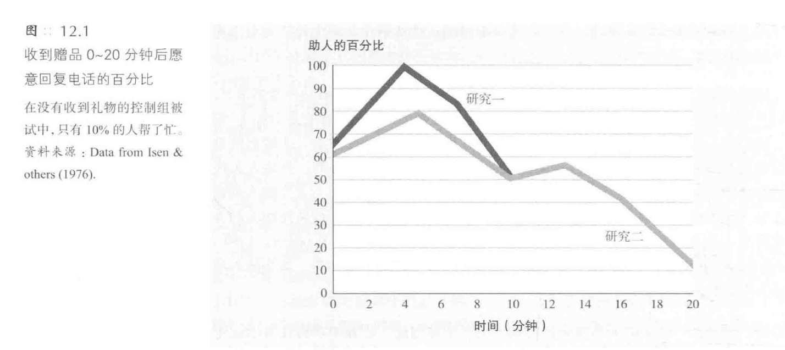
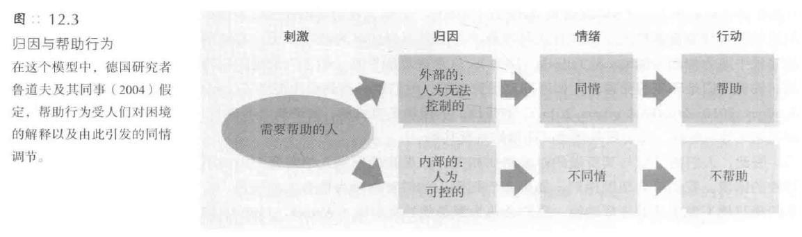
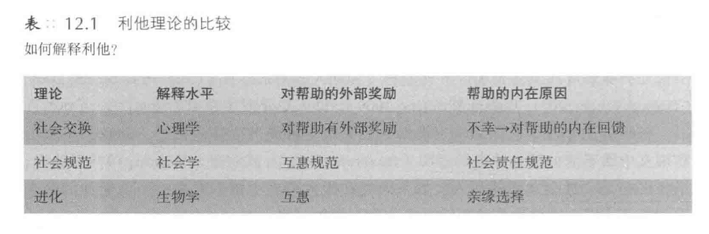

[TOC]
# 帮助他人
## 帮助行为发生的原因
### 社会交换与社会规范
1. **社会交换理论的基本观点**
   - 人们在交往中**交换物质和社会性商品**，如爱、服务、信息、地位
   - 目的是使**成本最小化**，**收益最大化**
   - 社会交换理论并不要求人们有意识地监控成本和收益，但这些因素能**预测行为**

2. **帮助行为的成本与收益分析**
   - 在决定是否提供帮助时，人们会进行**成本与收益的精细计算**
   - 例子：**献血**的决策过程
     - 献血的代价：针扎的疼痛、时间、疲乏
     - 不献血的代价：负罪感、他人的指责
     - 献血的收益：帮助别人而产生的愉悦感、免费点心
     - 不献血的好处：节约时间、不担心健康受损

3. **社会交换理论的实证支持**
   - 研究支持社会交换理论在**解释帮助行为上的有效性**
   - 例子：对献血者的研究表明，人们在决定献血时进行了成本与收益的计算

#### 奖赏
1. **外部奖赏的影响**
   - 奖赏可以是**外部的**，如金钱、社会地位提升、获得赞誉或友谊
   - 例子：纽约市民救人以避免迟到工作，受到1.5倍周日工资的激励
   - 商人捐款提升企业形象，搭便车获得称赞或友谊
   - 外部奖赏促使人们**帮助吸引他们的人**或他们**渴望得到赞许的人**
   - 帮助行为**提升社会地位**，自私行为受到惩罚

2. **内部奖赏的作用**
   - 奖赏也可能**来自内部**，如**自我满足感和自我价值感的提升**
   - 献血者承认献血使他们**感觉良好和自我满足**
   - 帮助行为**提升自我价值感**，解释了为何做好事后人们感觉良好
   - 志愿者行动**提升精神状态和健康状况**，尤其是自发而非被迫的行为
   - 丧失配偶的人在帮助他人后更快恢复

3. **捐款行为的心理效应**
   - 捐款行为**激活与报酬相关的脑区**
   - 慷慨的人比只为自己花钱的人活得更快乐
   - 实验显示，将钱用于帮助他人的人**更快乐**
   - 给予可以提高幸福感

4. **奖赏理论的争议**
   - 奖赏理论可能使帮助行为看起来**不是真正的利他行为**
   - 当回报是**无意识地获得**时，行为**可能被视为利他的**
   - 如果帮助是为了获得社会赞许、释放压力、避免内疚或提升自我形象，其利他性质受质疑
   - 奖赏理论可能导致**循环论证**，即将帮助行为归因于期望的内部奖赏

5. **避免循环论证的方法**
   - 必须将收益和成本**独立于帮助行为之外**
   - 如果社会赞许引发帮助行为，在实验中应能发现帮助行为增加
   - 利己主义观点**并未完全得到研究者的赞同**，需要更多证据支持

#### 内部回报
##### 内疚感
1. **情绪状态对帮助行为的影响**
   - **接近痛苦的人**会使我们**感到痛苦**，从而**激发帮助行为**
   - 例子：窗外女性的尖叫声引起的不适感促使人们去查看或提供帮助
   - 对他人痛苦的强烈反应与提供更多帮助之间**存在关联**

2. **内疚感作为帮助行为的驱动力**
   - 内疚感是一种**强烈的动机**，促使人们**避免或减轻这种感觉**
   - 例子：埃弗里特·桑德森救下铁轨上的小女孩，以避免内疚感
   - 人类历史上采用**多种方式**来缓解内疚感，如祭品、忏悔、认罪

3. **内疚感导致的行为**
   - 内疚感导致人们采取行动以**消除不良感觉和恢复自我形象**
   - 例子：实验中引发违规行为后，被试通过坦白、贬低被伤害者或功补过来缓解内疚感
   - 研究显示人们会**努力消除内疚感**

4. **内疚感与自我形象的恢复**
   - 实验中，说谎的被试**更愿意无偿帮助**以补救自我形象
   - 例子：密西西比州立大学的实验中，说谎的被试提供更多帮助以减轻内疚感
   - 说谎的被试比未说谎的被试提供更多时间帮助

5.  **内疚感的积极作用**
   - 内疚感有其**积极方面**，如促使坦白、道歉、帮助他人，避免再犯错误
   - 例子：犯错后的行善愿望反映了减轻内疚感和恢复自我形象的需要
   - 当错误被他人知晓时，人们更倾向于**通过帮助行为来挽回自己**

##### 坏心情-好行为的例外
1. **特定消极心境下的例外**
   - **某些**消极心境，如**愤怒和极度悲痛**，**不会促进**同情或利他行为
   - 在极度悲痛中的人往往经历**强烈的自我关注期**，这抑制了对他人的关心和帮助

2. **自我关注与他人关注的影响**
   - 实验中，斯坦福大学学生听关于朋友患癌的录音磁带，分为自我关注组和他人关注组
   - 自我关注组被指导**关注自己的担忧和悲伤**，而他人关注组被指导**关注朋友的状况**
   - 实验结果显示，自我关注组的帮助行为**明显低于**他人关注组

3. **坏心情-好行为现象的条件**
   - 坏心情-好行为现象主要发生在那些**关注他人而非自身的人**中
   - 关注他人的人认为**帮助他人特别有意义**
   - 在不完全沉浸于自己的抑郁和悲痛中时，悲伤的人可能**更敏感和乐于助人**

##### 好心情-好行为
1. **快乐与助人行为的正相关**
   - 快乐的人**更倾向于帮助他人**，这一现象在成人和孩子中都普遍存在
   - 快乐可以来源于**多种情境**，如成功、愉快的回忆或其他积极体验
   - 快乐的人可能会感到**强烈的帮助他人的冲动**，希望与他人分享喜悦

2. **实验研究支持**
   - 在澳大利亚悉尼的实验中，情绪激励的销售人员更愿意帮助寻找不存在的物品
   - 在波兰奥波莱的实验中，从害怕转为轻松的人更愿意帮助完成学士学位论文
   - 在美国的实验中，刚收到赠品的人更愿意回电话提供帮助

3. **心境与行为的相互作用**
   - 积极心境产生**积极的思维和自尊**，进而导向**积极的行为**
   - 帮助行为不仅能**缓解不好的心境**，也能**维持好的心境**
   - 收到礼物或享受成功的人更可能有积极的思维，并乐于助人

#### 社会规范
##### 互惠规范（reciprocity norm）
1. **互惠规范的定义**
   - 互惠规范是一种**普遍接受的道德准则**，要求人们回报曾帮助过自己的人
   - 这种规范在政治、商业和日常生活中**普遍存在**，如邮寄调查问卷时附赠小礼物以期待回应
   - 互惠规范甚至在**婴儿**中也能观察到，例如21个月大的婴儿更愿意帮助曾送过玩具的人
   - 在婚姻和其他长期关系中，互惠规范确保了**交换的平衡**

2. **社会资本**（social capital）
   - 这种规范体现在**社会资本**的概念中，如支持性的联系、信息交流、信任与合作行为，这些保证了一个社区的正常运转
   - **社会网络中的互惠性**帮助解释了**社会资本的运作**，如邻里间的相互照看
   - 人们对他人曾经对自己所做事情的**公开反应**体现了互惠规范的有效运作

3. **互惠规范的影响**
   - 在实验中发现，人们更愿意为曾经给予过他们恩惠的人所属的慈善机构捐献
   - 当人们不能给予回报时，可能会感到**受威胁和被贬低**，尤其是骄傲和自尊心强的人
   - 在**亚洲文化**中，社会纽带和互惠规范比北美更强，因此更可能拒绝偶然结识的人的礼物以避免产生回馈的义务

##### 社会责任规范（social--responsibility norm）
1. **社会责任规范的定义**
   - 社会责任规范强调人们**应帮助那些需要帮助的人**，而**不考虑未来的回报**
   - 这一规范特别适用于**无力回报的群体**，如孩子、贫困者、残疾人等
   - 社会责任规范**超越了互惠规范**，鼓励人们无条件地帮助他人

2. **文化差异中的社会责任规范**
   - 在**集体主义文化**中，如印度，社会责任规范得到更强烈的支持
   - 集体主义文化倾向于提倡**无条件的助人义务**，即使帮助对象超出家庭范围
   - **西方个人主义文化**也支持社会责任规范，但帮助行为可能更加**选择性**

3. **归因与帮助行为**
   - 人们的帮助行为受到**对他人困境的归因影响**
   - 如果困境被认为是**不可控**的，人们更倾向于提供帮助
   - 如果困境被认为是**个人选择导致**的，公平规范不要求提供帮助

4. **实验研究案例**
   - 在威斯康星大学的实验中，学生对那些自己不善记笔记的同学的帮助意愿较低
   - 当同学的困难被认为超出个人控制时，帮助意愿增加
   - 这表明社会责任规范促使人们帮助那些**最需要且最应得到帮助的人**

##### 性别与受助
1. **女性获得更多帮助的现象**
   - 研究显示，在需要帮助的情况下，**女性**比男性**获得更多的帮助**
   - **男性**倾向于**对女性提供更多帮助**，而女性对不同性别的求助者**持平等态度**
   - 这种现象可能部分源于**对女性的传统看法**，认为她们更柔弱和依赖

2. **实验研究案例**
   - 当车辆出现故障时，如车胎没气，女性比男性**得到更多帮助**
   - 单独的女性搭车者比单独的男性或夫妇更容易获得帮助
   - 男性更倾向于帮助**外表有吸引力的女性**

3. **女性寻求帮助的频率更高**
   - 女性寻求身体和精神上帮助的次数是**男性的两倍**
   - 在电台电话咨询和校园咨询中心，女性来访者占大多数
   - 女性向朋友求助的频率也更高

4. **性别差异的原因**
   - 这种性别差异可能与独立与**相依的性别角色**有关
   - 男性可能受到**交配动机**的影响，在帮助女性时表现出更多的**侠义精神**
   - 社会对女性的**传统看法**可能促使她们在需要帮助时**更容易得到响应**

### 演化心理学
1. **演化心理学的基本观点**
   - 生命的本质在于**使基因存活下来**
   - 我们的行为受**祖先基因**的影响，以确保基因在未来的延续
   - 演化心理学提供了一个**关于人类行为的深刻理解**，即行为是**为了基因的存续**

2. **自私的基因观点**
   - 演化心理学认为人类行为根源于**自我服务的生物学本能**
   - 个体**不太可能**为陌生人的利益而自我牺牲，因为这不利于基因的存活
   - **合作行为**在进化中是成功的，因为它有助于**基因的传播和存续**

3. **合作的演化机制**
   - **亲缘选择**：帮助携带相似基因的个体，如家族成员
   - **直接互惠**：基于互相帮助的原则
   - **间接互惠**：帮助他人，期望他人将来会帮助自己或其他人
   - **群体选择**：互相帮助的群体更有可能生存和繁衍

4. **人类作为超级合作者**
   - 人类被视为动物王国中的**超级合作者**
   - 人类展现出**克服自私本能**的多重机制
   - 这种合作行为有助于人类社会的**整体生存和发展**

##### 亲缘选择
1. **亲缘选择的基本原理**
   - **基因**驱动我们关心与我们有亲缘关系的人
   - 亲缘选择导致我们更倾向于**为亲属做出自我牺牲**
   - **父母**通常会为孩子做出比孩子为父母做出的**更多的奉献**

2. **亲缘选择与基因共享的关系**
   - 与**兄弟姐妹**共享一半的基因，与**表或堂兄弟姐妹**共享八分之一的基因
   - 亲缘选择使我们**更倾向于帮助**与我们基因相近的人
   - **同卵双胞胎**比异卵双胞胎更愿意互相支持，反映了基因共享的影响

3. **亲缘选择在实际行为中的体现**
   - 亲缘选择不是意味着我们在帮助前计算基因相关度，而是一种**本能**
   - 例如，卡洛斯·罗杰斯自愿为妹妹捐献肾脏，反映了对近亲的自然倾向
   - 与亲属相比，帮助**陌生人**的行为**更令人敬佩和意外**

4. **亲缘选择与外貌、地理位置的关联**
   - **外貌相似性和地理邻近性**可能是识别基因相近个体的线索
   - 例如，蓝眼睛的人可能与其他蓝眼睛的人**共享特定基因**
   - 在**紧急情况**下，人们倾向于先帮助**年轻人、家人、邻居**，再帮助陌生人

5. **亲缘选择与群体偏好及其影响**
   - 亲缘选择可能导致**群体内偏好**，如种族内偏好
   - 这种偏好可能是历史和现实中**种族冲突**的根源之一
   - 亲缘选择被认为是社会文明的**潜在威胁**，因为它可能限制世界和平的可能性

##### 互惠
1. **互惠的基本原理**
   - 互惠是基于**期望未来得到回报**的帮助行为
   - 不互惠的行为会受到**社会的惩罚**，如对骗子和背叛者的唾弃
   - 互惠在**小型、与外界隔离**的群体中更有效，因为人们经常见到自己帮助过的人

2. **互惠在动物行为中的体现**
   - 雌性佛佛与同伴相互照料，获得繁殖优势
   - 吸血蝙蝠在饥饿时会向同住的蝙蝠请求食物，只在相熟的同住者中发生
   - 互惠行为在动物界中是一种**生存策略**

3. **互惠在人类社会中的体现**
   - **偏远乡村**的互惠行为比大城市中**更为普遍**
   - 在小学校、城镇、教堂、工作团队、宿舍中易于形成**互相关心的共同信念**
   - 大城市居民相比**较少参与**小型的善行，如转达电话留言或帮助走失儿童

##### 群体选择
1. **群体选择与互惠**
   - 群体选择解释了为什么人们会帮助**陌生人或无法回报的人**
   - **相互支持、利他的群体**在进化竞争中比不利他的群体**存活得更久**
   - 群居昆虫如蜜蜂和蚂蚁的行为反映了群体选择的极端例子

2. **群体选择与社会伦理的关联**
   - **社会伦理和宗教规则**阻止了向自私的生物性偏好
   - **伦理规则**如“爱人如己”促进了个人与群体的共存
   - 了解自私的基因有助于我们**颠覆其设置**，促进慷慨和利他行为
