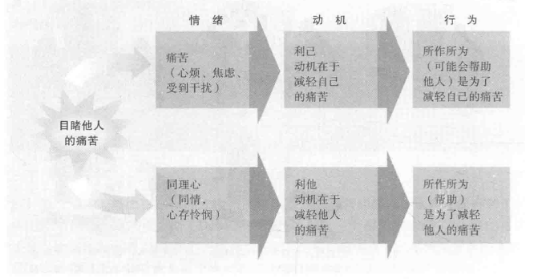
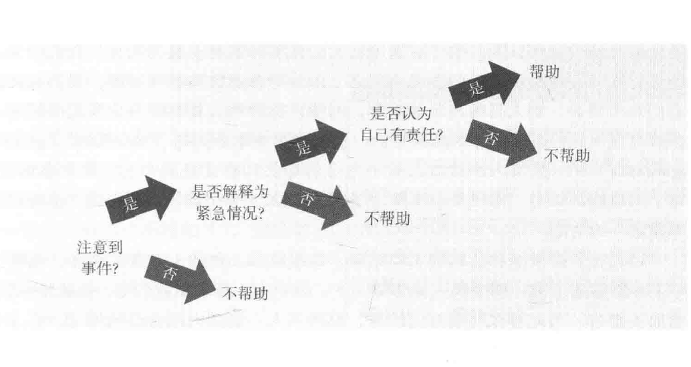
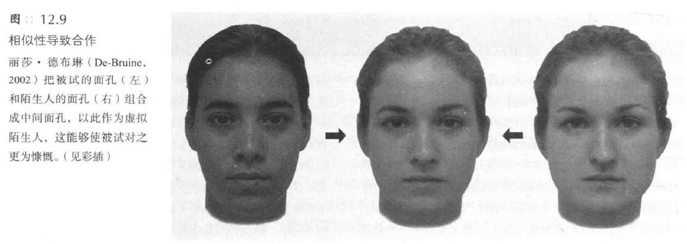
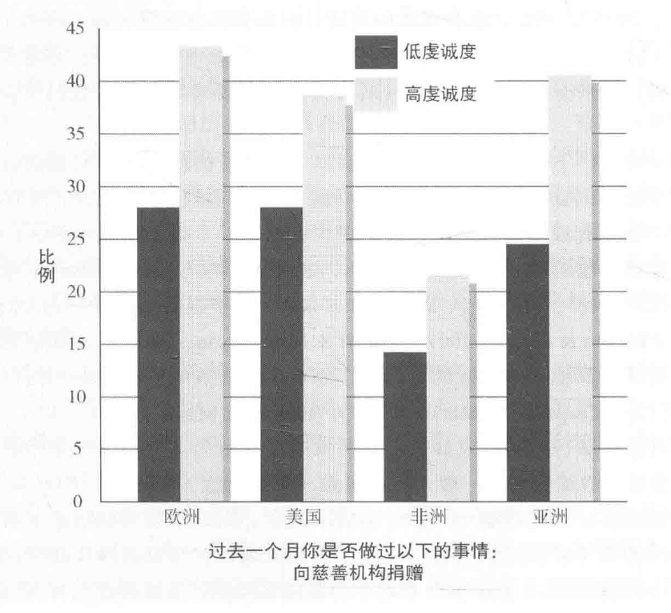

[TOC]
# 帮助他人
## 帮助行为发生的原因
### 社会交换与社会规范
1. **社会交换理论的基本观点**
   - 人们在交往中**交换物质和社会性商品**，如爱、服务、信息、地位
   - 目的是使**成本最小化**，**收益最大化**
   - 社会交换理论并不要求人们有意识地监控成本和收益，但这些因素能**预测行为**

2. **帮助行为的成本与收益分析**
   - 在决定是否提供帮助时，人们会进行**成本与收益的精细计算**
   - 例子：**献血**的决策过程
     - 献血的代价：针扎的疼痛、时间、疲乏
     - 不献血的代价：负罪感、他人的指责
     - 献血的收益：帮助别人而产生的愉悦感、免费点心
     - 不献血的好处：节约时间、不担心健康受损

3. **社会交换理论的实证支持**
   - 研究支持社会交换理论在**解释帮助行为上的有效性**
   - 例子：对献血者的研究表明，人们在决定献血时进行了成本与收益的计算

#### 奖赏
1. **外部奖赏的影响**
   - 奖赏可以是**外部的**，如金钱、社会地位提升、获得赞誉或友谊
   - 例子：纽约市民救人以避免迟到工作，受到1.5倍周日工资的激励
   - 商人捐款提升企业形象，搭便车获得称赞或友谊
   - 外部奖赏促使人们**帮助吸引他们的人**或他们**渴望得到赞许的人**
   - 帮助行为**提升社会地位**，自私行为受到惩罚

2. **内部奖赏的作用**
   - 奖赏也可能**来自内部**，如**自我满足感和自我价值感的提升**
   - 献血者承认献血使他们**感觉良好和自我满足**
   - 帮助行为**提升自我价值感**，解释了为何做好事后人们感觉良好
   - 志愿者行动**提升精神状态和健康状况**，尤其是自发而非被迫的行为
   - 丧失配偶的人在帮助他人后更快恢复

3. **捐款行为的心理效应**
   - 捐款行为**激活与报酬相关的脑区**
   - 慷慨的人比只为自己花钱的人活得更快乐
   - 实验显示，将钱用于帮助他人的人**更快乐**
   - 给予可以提高幸福感

4. **奖赏理论的争议**
   - 奖赏理论可能使帮助行为看起来**不是真正的利他行为**
   - 当回报是**无意识地获得**时，行为**可能被视为利他的**
   - 如果帮助是为了获得社会赞许、释放压力、避免内疚或提升自我形象，其利他性质受质疑
   - 奖赏理论可能导致**循环论证**，即将帮助行为归因于期望的内部奖赏

5. **避免循环论证的方法**
   - 必须将收益和成本**独立于帮助行为之外**
   - 如果社会赞许引发帮助行为，在实验中应能发现帮助行为增加
   - 利己主义观点**并未完全得到研究者的赞同**，需要更多证据支持

#### 内部回报
##### 内疚感
1. **情绪状态对帮助行为的影响**
   - **接近痛苦的人**会使我们**感到痛苦**，从而**激发帮助行为**
   - 例子：窗外女性的尖叫声引起的不适感促使人们去查看或提供帮助
   - 对他人痛苦的强烈反应与提供更多帮助之间**存在关联**

2. **内疚感作为帮助行为的驱动力**
   - 内疚感是一种**强烈的动机**，促使人们**避免或减轻这种感觉**
   - 例子：埃弗里特·桑德森救下铁轨上的小女孩，以避免内疚感
   - 人类历史上采用**多种方式**来缓解内疚感，如祭品、忏悔、认罪

3. **内疚感导致的行为**
   - 内疚感导致人们采取行动以**消除不良感觉和恢复自我形象**
   - 例子：实验中引发违规行为后，被试通过坦白、贬低被伤害者或功补过来缓解内疚感
   - 研究显示人们会**努力消除内疚感**

4. **内疚感与自我形象的恢复**
   - 实验中，说谎的被试**更愿意无偿帮助**以补救自我形象
   - 例子：密西西比州立大学的实验中，说谎的被试提供更多帮助以减轻内疚感
   - 说谎的被试比未说谎的被试提供更多时间帮助

5.  **内疚感的积极作用**
    - 内疚感有其**积极方面**，如促使坦白、道歉、帮助他人，避免再犯错误
    - 例子：犯错后的行善愿望反映了减轻内疚感和恢复自我形象的需要
    - 当错误被他人知晓时，人们更倾向于**通过帮助行为来挽回自己**

##### 坏心情-好行为的例外
1. **特定消极心境下的例外**
   - **某些**消极心境，如**愤怒和极度悲痛**，**不会促进**同情或利他行为
   - 在极度悲痛中的人往往经历**强烈的自我关注期**，这抑制了对他人的关心和帮助

2. **自我关注与他人关注的影响**
   - 实验中，斯坦福大学学生听关于朋友患癌的录音磁带，分为自我关注组和他人关注组
   - 自我关注组被指导**关注自己的担忧和悲伤**，而他人关注组被指导**关注朋友的状况**
   - 实验结果显示，自我关注组的帮助行为**明显低于**他人关注组

3. **坏心情-好行为现象的条件**
   - 坏心情-好行为现象主要发生在那些**关注他人而非自身的人**中
   - 关注他人的人认为**帮助他人特别有意义**
   - 在不完全沉浸于自己的抑郁和悲痛中时，悲伤的人可能**更敏感和乐于助人**

##### 好心情-好行为
1. **快乐与助人行为的正相关**
   - 快乐的人**更倾向于帮助他人**，这一现象在成人和孩子中都普遍存在
   - 快乐可以来源于**多种情境**，如成功、愉快的回忆或其他积极体验
   - 快乐的人可能会感到**强烈的帮助他人的冲动**，希望与他人分享喜悦

2. **实验研究支持**
   - 在澳大利亚悉尼的实验中，情绪激励的销售人员更愿意帮助寻找不存在的物品
   - 在波兰奥波莱的实验中，从害怕转为轻松的人更愿意帮助完成学士学位论文
   - 在美国的实验中，刚收到赠品的人更愿意回电话提供帮助

3. **心境与行为的相互作用**
   - 积极心境产生**积极的思维和自尊**，进而导向**积极的行为**
   - 帮助行为不仅能**缓解不好的心境**，也能**维持好的心境**
   - 收到礼物或享受成功的人更可能有积极的思维，并乐于助人

#### 社会规范
##### 互惠规范（reciprocity norm）
1. **互惠规范的定义**
   - 互惠规范是一种**普遍接受的道德准则**，要求人们回报曾帮助过自己的人
   - 这种规范在政治、商业和日常生活中**普遍存在**，如邮寄调查问卷时附赠小礼物以期待回应
   - 互惠规范甚至在**婴儿**中也能观察到，例如21个月大的婴儿更愿意帮助曾送过玩具的人
   - 在婚姻和其他长期关系中，互惠规范确保了**交换的平衡**

2. **社会资本**（social capital）
   - 这种规范体现在**社会资本**的概念中，如支持性的联系、信息交流、信任与合作行为，这些保证了一个社区的正常运转
   - **社会网络中的互惠性**帮助解释了**社会资本的运作**，如邻里间的相互照看
   - 人们对他人曾经对自己所做事情的**公开反应**体现了互惠规范的有效运作

3. **互惠规范的影响**
   - 在实验中发现，人们更愿意为曾经给予过他们恩惠的人所属的慈善机构捐献
   - 当人们不能给予回报时，可能会感到**受威胁和被贬低**，尤其是骄傲和自尊心强的人
   - 在**亚洲文化**中，社会纽带和互惠规范比北美更强，因此更可能拒绝偶然结识的人的礼物以避免产生回馈的义务

##### 社会责任规范（social--responsibility norm）
1. **社会责任规范的定义**
   - 社会责任规范强调人们**应帮助那些需要帮助的人**，而**不考虑未来的回报**
   - 这一规范特别适用于**无力回报的群体**，如孩子、贫困者、残疾人等
   - 社会责任规范**超越了互惠规范**，鼓励人们无条件地帮助他人

2. **文化差异中的社会责任规范**
   - 在**集体主义文化**中，如印度，社会责任规范得到更强烈的支持
   - 集体主义文化倾向于提倡**无条件的助人义务**，即使帮助对象超出家庭范围
   - **西方个人主义文化**也支持社会责任规范，但帮助行为可能更加**选择性**

3. **归因与帮助行为**
   - 人们的帮助行为受到**对他人困境的归因影响**
   - 如果困境被认为是**不可控**的，人们更倾向于提供帮助
   - 如果困境被认为是**个人选择导致**的，公平规范不要求提供帮助

4. **实验研究案例**
   - 在威斯康星大学的实验中，学生对那些自己不善记笔记的同学的帮助意愿较低
   - 当同学的困难被认为超出个人控制时，帮助意愿增加
   - 这表明社会责任规范促使人们帮助那些**最需要且最应得到帮助的人**

##### 性别与受助
1. **女性获得更多帮助的现象**
   - 研究显示，在需要帮助的情况下，**女性**比男性**获得更多的帮助**
   - **男性**倾向于**对女性提供更多帮助**，而女性对不同性别的求助者**持平等态度**
   - 这种现象可能部分源于**对女性的传统看法**，认为她们更柔弱和依赖

2. **实验研究案例**
   - 当车辆出现故障时，如车胎没气，女性比男性**得到更多帮助**
   - 单独的女性搭车者比单独的男性或夫妇更容易获得帮助
   - 男性更倾向于帮助**外表有吸引力的女性**

3. **女性寻求帮助的频率更高**
   - 女性寻求身体和精神上帮助的次数是**男性的两倍**
   - 在电台电话咨询和校园咨询中心，女性来访者占大多数
   - 女性向朋友求助的频率也更高

4. **性别差异的原因**
   - 这种性别差异可能与独立与**相依的性别角色**有关
   - 男性可能受到**交配动机**的影响，在帮助女性时表现出更多的**侠义精神**
   - 社会对女性的**传统看法**可能促使她们在需要帮助时**更容易得到响应**

### 演化心理学
1. **演化心理学的基本观点**
   - 生命的本质在于**使基因存活下来**
   - 我们的行为受**祖先基因**的影响，以确保基因在未来的延续
   - 演化心理学提供了一个**关于人类行为的深刻理解**，即行为是**为了基因的存续**

2. **自私的基因观点**
   - 演化心理学认为人类行为根源于**自我服务的生物学本能**
   - 个体**不太可能**为陌生人的利益而自我牺牲，因为这不利于基因的存活
   - **合作行为**在进化中是成功的，因为它有助于**基因的传播和存续**

3. **合作的演化机制**
   - **亲缘选择**：帮助携带相似基因的个体，如家族成员
   - **直接互惠**：基于互相帮助的原则
   - **间接互惠**：帮助他人，期望他人将来会帮助自己或其他人
   - **群体选择**：互相帮助的群体更有可能生存和繁衍

4. **人类作为超级合作者**
   - 人类被视为动物王国中的**超级合作者**
   - 人类展现出**克服自私本能**的多重机制
   - 这种合作行为有助于人类社会的**整体生存和发展**

##### 亲缘选择
1. **亲缘选择的基本原理**
   - **基因**驱动我们关心与我们有亲缘关系的人
   - 亲缘选择导致我们更倾向于**为亲属做出自我牺牲**
   - **父母**通常会为孩子做出比孩子为父母做出的**更多的奉献**

2. **亲缘选择与基因共享的关系**
   - 与**兄弟姐妹**共享一半的基因，与**表或堂兄弟姐妹**共享八分之一的基因
   - 亲缘选择使我们**更倾向于帮助**与我们基因相近的人
   - **同卵双胞胎**比异卵双胞胎更愿意互相支持，反映了基因共享的影响

3. **亲缘选择在实际行为中的体现**
   - 亲缘选择不是意味着我们在帮助前计算基因相关度，而是一种**本能**
   - 例如，卡洛斯·罗杰斯自愿为妹妹捐献肾脏，反映了对近亲的自然倾向
   - 与亲属相比，帮助**陌生人**的行为**更令人敬佩和意外**

4. **亲缘选择与外貌、地理位置的关联**
   - **外貌相似性和地理邻近性**可能是识别基因相近个体的线索
   - 例如，蓝眼睛的人可能与其他蓝眼睛的人**共享特定基因**
   - 在**紧急情况**下，人们倾向于先帮助**年轻人、家人、邻居**，再帮助陌生人

5. **亲缘选择与群体偏好及其影响**
   - 亲缘选择可能导致**群体内偏好**，如种族内偏好
   - 这种偏好可能是历史和现实中**种族冲突**的根源之一
   - 亲缘选择被认为是社会文明的**潜在威胁**，因为它可能限制世界和平的可能性

##### 互惠
1. **互惠的基本原理**
   - 互惠是基于**期望未来得到回报**的帮助行为
   - 不互惠的行为会受到**社会的惩罚**，如对骗子和背叛者的唾弃
   - 互惠在**小型、与外界隔离**的群体中更有效，因为人们经常见到自己帮助过的人

2. **互惠在动物行为中的体现**
   - 雌性佛佛与同伴相互照料，获得繁殖优势
   - 吸血蝙蝠在饥饿时会向同住的蝙蝠请求食物，只在相熟的同住者中发生
   - 互惠行为在动物界中是一种**生存策略**

3. **互惠在人类社会中的体现**
   - **偏远乡村**的互惠行为比大城市中**更为普遍**
   - 在小学校、城镇、教堂、工作团队、宿舍中易于形成**互相关心的共同信念**
   - 大城市居民相比**较少参与**小型的善行，如转达电话留言或帮助走失儿童

##### 群体选择
1. **群体选择与互惠**
   - 群体选择解释了为什么人们会帮助**陌生人或无法回报的人**
   - **相互支持、利他的群体**在进化竞争中比不利他的群体**存活得更久**
   - 群居昆虫如蜜蜂和蚂蚁的行为反映了群体选择的极端例子

2. **群体选择与社会伦理的关联**
   - **社会伦理和宗教规则**阻止了向自私的生物性偏好
   - **伦理规则**如“爱人如己”促进了个人与群体的共存
   - 了解自私的基因有助于我们**颠覆其设置**，促进慷慨和利他行为

### 比较和评价帮助行为的理论
1. **相似性和差异性**
   - 社会交换、社会规范和进化理论都提供了**利他主义的解释**
   - 这些理论在**互惠交换和无条件帮助**方面有**共同点**
   - 它们在解释帮助行为时分别从**心理学、社会学和生物学**的角度出发

2. **理论的推论性和事后解释**
   - 每个理论都可能存在**推论性和事后解释**的问题
   - 例如，将已知事实解释为社会交换、规范或自然选择的结果可能只是以命名代替解释
   - 理论需要提出**可检验的假设**，而非仅仅是事后的解释

3. **理论的有效性和一致性**
   - 有效的理论应提供**一致的结构**，概括各种观察结果
   - 这三个理论在解释人们的帮助行为时提供了**广泛的视角**
   - 它们涵盖了从长期承诺到自发帮助的**各种行为**

4. **理论的实际应用**
   - 理论应用于**实际情境**时，如何解释和预测行为变得关键
   - 理论的实用性在于能否**在不同情境**下准确预测人的行为
   - 理论的检验需要在**多种社会和文化背景**下进行

### 真正的利他主义
1. **利他主义的动机与实例**
   - 利他主义行为可能**混合利己和无私动机**，如亚伯拉罕·林肯救小猪的故事
   - 助人行为常使助人者**感觉良好**，但这并不排除其**无私性**
   - 实例包括密歇根州荷兰镇的无偿捐赠和越南战争中战士的牺牲行为

2. **巴特森的理论与研究**
   - 巴特森认为帮助他人的意愿**受利己和无私影响**
   - 他的研究显示，**同理心**（empathy）驱动的利他主义是**人性的一部分**
   - 研究包括观察者愿意代替受电击的女子承受痛苦的实验

3. **依恋、认同与同理心**
   - **依恋关系**增强对他人的同理心，如家长对孩子的爱护
   - 人们对他们**认同**的人更易产生同理心，如对黛安娜王妃的悲伤
   - 同理心是**与生俱来的能力**，如新生儿因其他婴儿哭声而哭泣

4. **同情崩溃与痛苦的影响**
   - 面对**大规模灾难**时，同情心可能下降，称为“**同情崩溃**”（collapse of compassion）
   - 人们在**调整对巨大灾难的情绪反应时**可能会经历同情崩溃

5. **痛苦、同理心与帮助行为**
   - 同理心驱使我们**关注受害者的痛苦**，**减少自身的痛苦**
   - 痛苦和同理心**共同作用**，促使人们**对危机做出反应**
   - 澳大利亚森林大火的例子表明，感到痛苦或同理心的人更倾向于捐助
   - 巴特森的研究表明，同理心的人通常会**提供帮助**，而非**逃避**
     - 实验中，被试观看女子遭受电击，唤起同理心的被试更愿意代替受电击
     - 实验结果一致表明，同理心唤起的人倾向于提供帮助

1. **对同理心的质疑与利他主义的存在**
   - 沙勒和恰尔迪尼的实验表明，存在**其他减轻悲伤的方式**时，人们可能**不愿意提供帮助**
   - 存在**对纯粹利他主义**的怀疑，即是否有仅为增加他人福利的帮助行为

2. **利他主义的实验证据与战争中的行为**
   - 但是，的确还有一些研究表明**可能存在真正的利他主义**
   - 研究表明，即使在**匿名情况**下，人们在同理心被唤起后仍愿意提供帮助
   - 越南战争和伊拉克战争中，战士们用身体挡住手榴弹，牺牲自己来拯救战友
     - 这些战士的行为与帮助犹太人的非犹太人不同，因为他们没有时间考虑自己的行为的后果

3. **利他主义的进一步研究**
   - 巴特森的**25个实验**探讨利他主义与利己主义的同理心，发现人们确实有时**为了帮助他人而非自己**
   - 他认为，由同理心引发的利他主义是**人性的一部分**
   - 巴特森的研究提出，通过同理心可以**改善对弱势群体的态度**

## 帮助行为的影响因素
1. **旁观者效应的实例**
   - **基蒂·吉诺维斯案件**：38人目睹暴行却无人援助，导致她死亡
   - **安德鲁·莫米勒案件**：地铁上11名乘客目睹年轻人被刺伤，无人援助
   - **埃莉诺·布拉德利案件**：购物中心内，40分钟内无人帮助跌倒受伤的女性
   - **2000年纽约中央公园性侵案**：成千上万的旁观者目睹60名女性遭性侵，无人报警或援助

2. **旁观者效应的研究**
   - 社会心理学家通过实验探究**何时人们会在紧急情况下提供帮助**
   - 研究还包括**非紧急情况下的帮助行为**，如捐款和献血

3. **旁观者效应的影响**
   - 旁观者效应导致在紧急情况下，即使有**多个目击者**，也可能**无人提供帮助**
   - 这种现象引发了对人们在危机中行为的**深入探讨和研究**
   - 研究旨在理解何种环境因素和个人特征促进或阻碍帮助行为的发生

### 旁观者数量
1. **旁观者效应的研究**
   - **拉塔纳和达利的研究**：发现**其他旁观者的存在**会**降低个人对紧急情况的干预**
   - **48个实验比较**：**独自一人**时与**有其他旁观者在场**时的帮助行为差异
   - **互联网沟通中的发现**：认为自己是**唯一被请求帮助**的人时，**更容易**提供帮助

2. **旁观者数量与帮助行为的关系**
   - **单一旁观者情境**：受害者**更可能**得到帮助
   - **多旁观者情境**：受害者得到帮助的可能性**降低**

3. **旁观者效应的原因**
   - **注意力分散**：旁观者数量增加时，个体**注意到事件的可能性**降低
   - **事件解释**：越多旁观者，越少**将事件解释为**重大问题或紧急情况
   - **责任分散**：旁观者越多，个体感到的**采取行动的责任**越少

#### 注意
1. **环境对注意力的影响**
   - 在**拥挤的街道**上，人们可能**不会注意到**周围发生的事情
   - 人们倾向于避免盯着周围行人看，认为这是**不礼貌**的
   - 在更**安静、人少**的环境中，人们**更可能注意**到异常情况，如受伤的人

2. **拉塔纳和达利的实验**
   - 实验在哥伦比亚大学进行，涉及填写问卷的学生
   - 实验设置包括单独填写问卷和与他人一起填写两种情境
   - 实验目的是观察学生对紧急情况（如浓烟）的反应

3. **实验结果**
   - **独自填写问卷**的学生**更快地察觉到**紧急情况（通常在5秒内）
   - 与他人一起填写问卷的学生对紧急情况的**反应较慢**，通常需要20秒
   - 实验表明，人们在集体环境中可能会**减少对周围环境的关注**

#### 解释
1. **错误解释和信息影响**
   - 在紧急情况下，人们常常根据**他人的反应**来判断情况的严重性
   - 如果他人看起来**平静**，个体可能会错误地认为**一切正常**，从而忽略真正的危险
   - 这种现象是**信息影响**的一个例子，其中每个人都以他人的行为**作为现实情况的线索**

2. **透明错觉和人众无知**
   - **透明错觉**（illusion of transparency）是指人们**高估他人解读自己内心状态的能力**
     - 我们的**关心或警告**，比我们通常所认为的要**隐晦得多**；由于对自身情绪**非常敏感**，我们通常**认为它们非常明显**，别人很容易就能看穿
   - **人众无知现象**（pluralistic ignorance）指人们对他人关于自己的想法和感受其实是**无知的**，但是却认为非常清楚
     - 当这种情况发生时，尽管每个人都关心情境，但认为他人平静，从而得出**错误结论**

3. **拉塔纳和达利的实验结果**
   - **独自工作**的人在发现烟雾时**更快采取行动**
   - 在群体中，人们往往**没有采取行动**，甚至在烟雾浓烈时也不报告
   - **群体的被动性**影响了成员对事件的解释，如将烟雾归因于**非紧急原因**

4. **日常困境中的旁观者效应**
   - 在日常生活中的紧急情况，如**街头犯罪事件**，人们的反应也受到解释的影响
   - **旁观者效应**表明，在知道有其他注意到紧急情况的人时，提供帮助的可能性减小
   - 在**危险情境**下，如有罪犯行凶，旁观者效应**较小**，有时旁观者会提供体力支持

5. **特殊情况下的旁观者行为**
   - 在某些情况下，如“9·11”事件中，旁观者可能**集体采取行动**对抗威胁
   - 这表明在特定情境下，旁观者可以起到**积极的支持作用**

#### 确定责任
1. **责任分散**
   - 在紧急事件中，如果有其他人在场，个人感到的责任会**减少**
   - 达利和拉塔纳的实验表明，当被试认为有其他人也知情时，提供帮助的比例**显著下降**
   - 这种责任分散导致即使在**明显的紧急情况**下，旁观者也可能**不采取行动**

2. **拉塔纳和达利的实验**
   - **实验背景**：哥伦比亚大学学生讨论大学生活问题，使用隔离的联络设备
   - **实验过程**：播放一个人癫痫发作的声音，模拟紧急情况
   - **实验结果**：认为自己是唯一知情者的被试中有85%提供帮助，而认为还有其他4人知情的只有31%提供帮助

3. **被试的反应与自我认知**
   - 即使在紧急情况下感到紧张和关心，被试们往往**不能决定是否该行动**
   - 被试们通常**否认**他人在场对他们行为的影响，认为自己的行为与是否有旁观者无关
   - 这强调了人们通常**不了解自己行为的真正原因**，实验揭示了这一点

4. **城市居民的反应**
   - 城市居民由于**经常处于人群中**，可能不如乡村居民那样乐于助人
   - 在大城市中，由于“**同情疲劳**”和“**感观超载**”，人们提供帮助的可能性降低
   - 如果旁观者是**陌生人**，随着人数增加，提供帮助的**可能性减少**；如果是**熟人或同一群体的人**，可能会**增加**

5. **国际层面的责任扩散**
   - **国家间**对外国大灾难或种族屠杀的**袖手旁观**也是责任扩散的一种表现
   - 在卢旺达大屠杀等事件中，由于许多国家都能采取行动，个人感觉到的责任减少
   - 历史事件，如欧洲人对犹太人遭受的迫害的袖手旁观，也可以用责任扩散来解释

#### 重温实验伦理
1. **实验的伦理问题**
   - 实验涉及**在不知情的情况下让参与者听到紧急情况的声音**，如癫痫发作实验中的**决策压力**
   - 这类实验的设计**无法提供**“**知情同意权**”，因为这会破坏实验的保密性
   - 研究伦理问题包括**是否应该**在不知情的情况下让参与者经历这种压力

2. **参与者的反应和看法**
   - 完成实验后，参与者普遍认为实验中的欺骗是**可以接受**的，并**愿意再次参加**类似实验
   - 大多数参与者**没有对研究者表达愤怒情绪**
   - 其他研究者也发现，绝大多数参与者认为他们参与的实验是**有益的且符合伦理**

3. **实验的安全措施和社会心理学家的责任**
   - 在现场实验中，如果没有旁人提供帮助，研究助手会介入以**确保问题得到解决**
   - 社会心理学家担负着**双重伦理责任**：**保护参与者**和通过研究**改善人类生活**
   - 伦理原则应保护参与者利益的同时，帮助我们更好地了解自己的行为，实现对社会的责任

### 当别人也提供帮助时
1. **亲社会榜样的影响**
   - 观察到他人提供帮助的行为会**增加个人提供帮助的可能性**
   - 亲社会的榜样能够**促进利他行为**，如帮助汽车爆胎的人或捐赠给慈善机构
   - 实验表明，目睹他人的帮助行为，如献血，会激励自己也**做出类似的行为**

2. **升华状态的效应**
   - 目睹令人感动的善举会引发一种称为“**升华**”（elevation）的情感状态
   - 升华状态包括**胸腔的温暖和激情膨胀感**，常伴随着战栗、流泪、喉咙抽紧等反应
   - 这种状态会使人们变得**更加自我奉献和利他**

3. **榜样的言行一致性**
   - 孩子不仅从父母的言语中学习，也从他们的行为中**学习道德观**
   - 父母的“做我说的，不要做我做的”可能导致孩子**模仿他们的行为而非言语**
   - 即使是**伪善者的行为**，孩子也可能去**模仿**，既学习他们的言语也学习他们的行为

### 时间压力
1. **达利和巴特森的实验**
   - 实验模拟了“**善良的撒玛利亚人**”寓言，测试**普林斯顿神学院学生**在不同时间压力下的帮助行为
   - 学生们被分为两组：一组被告知有**充足时间**，另一组被告知**时间紧迫**
   - 结果显示，时间充裕的学生**更倾向于**停下来帮助需要帮助的老人，而时间紧迫的学生则**大多忽略**了老人

2. **时间压力的影响**
   - 时间压力导致人们**专注于自己的任务**，忽略周围的情况
   - 即使是去演讲关于帮助他人的主题，时间紧迫的学生也可能**忽视身边需要帮助的人**
   - 时间压力下的人们可能**没有意识到周围发生的事情**，而不是有意忽视

3. **情境对行为的影响**
   - 实验表明，**情境因素**（如时间压力）对个人行为的影响可能比个人特质更大
   - 在匆忙中，人们可能**无法充分注意到**周围的环境和需要帮助的人
   - 这些发现揭示了即使在意识到需要帮助的人时，时间压力也可能阻碍人们采取行动

### 相似性
1. **相似性引发的同理心和帮助行为**
   - **相似性**，包括**外表和信仰**，容易唤起**喜欢和同理心**，从而促进帮助行为
   - 人们更倾向于**帮助与自己相似的人**，如穿着、外貌、信仰等方面相似的个体

2. **实验研究支持**
   - **艾姆斯韦勒**等人的实验显示，普度大学的学生更倾向于帮助穿着与自己相似的求助者
   - **德布鲁因**的实验表明，麦克马斯特大学的学生更信任和慷慨地对待那些具有自己特征的假想同伴

3. **种族相似性的影响**
   - 20世纪70年代的研究结果在**种族相似性偏爱**上呈现矛盾，有些研究显示**同种族偏爱**，而有些则**没有**
   - 盖特纳和德维迪奥的实验表明，当**存在其他旁观者**时，白人女大学生更倾向于帮助白人而不是黑人妇女

4. **相似性偏爱的复杂性**
   - 相似性偏爱可能受到**种族、文化和社会规范的影响**
   - 人们可能在**不自觉中**表现出**对相似个体的偏好**，尤其在**标准模糊或冲突的情况下**
   - 相似性偏爱可能导致人们**在特定情境下做出不同的选择**，如在种族多样性的环境中

## 帮助者的特点
### 人格特质
1. **人格特质与帮助行为的关系**
   - 社会心理学家**未能发现**特定的人格特质能像情境、内疚感和心境等因素那样**预测利他行为**
   - 人格测验通常**不能准确区分**助人者和非助人者
   - 欧洲纳粹时期犹太人的营救者研究表明，**社会环境**对帮助意愿的影响大于利他人格特质

2. **人格特质与从众行为的相似性**
   - 从众行为也**更受情境影响**，而非可测量的人格特质
   - 人格特质**很少能预测特定行为**，但在多种情境下的**平均行为**表现方面更准确

3. **助人性的个体差异**
   - 有些人**天生更倾向于助人**，这种差异**具有时间上的持续性**且可被他人察觉
   - 研究表明，具有较高积极情绪、同理心能力和高自我效能感的人更倾向于帮助他人

4. **人格特质对特定情境的影响**
   - **人格特质**影响个人对特定情境的反应
   - **自我监控能力强的人**在认为助人能得到社会赞许时更可能表现出助人行为
   - **内向的、低自我监控的人**不太受他人评价的影响

### 性别
1. **男性在危险情境中更倾向于提供帮助**
   - 面对**陌生人**且**情境具有潜在危险**时，如车胎破裂或掉入地铁轨道，**男性**更常伸出援手
   - 在6767名因救人英雄行为获得卡耐基奖章的人中，90%是男性

2. **“妇女优先”规范在有时间考虑的情境中发挥作用**
   - 历史事件如卢西塔尼亚号和泰坦尼克号沉船事故中，**女性生还者**比例高于男性
   - 这表明在有充足时间的情境下，**性别规范和亲社会行为**更可能发挥作用

3. **女性在安全情境中更愿意提供帮助**
   - 在志愿帮助研究者或陪伴残疾儿童等**相对安全的情境**中，女性**更乐于帮助**
   - 加州大学洛杉矶分校对美国高校学生的调查显示，更多女性将“**帮助有困难的人**”视为重要

4. **女性更可能冒险救助他人**
   - 女性**更可能**成为大屠杀救援者、捐肾者或加入和平部队和世界医生组织的**志愿者**
   - 女性对朋友的问题**更有共情**，更愿意投入时间帮助朋友

5. **性别差异的情境依赖性**
   - 性别差异在帮助行为中的表现**取决于具体情境**
   - 在不同情境下，男性和女性的帮助行为表现出**显著差异**

### 宗教信仰
1. **宗教信仰与勇气和关怀**
   - 例子：1943年，道彻斯特号上的四位随军牧师在船沉没时表现出的无私和勇气
   - 宗教教义通常倡导**怜悯和慈悲**
   - 宗教信仰可能与**保守主义**相关，但同时也倡导**亲社会价值观**

2. **宗教启动对行为的影响**
   - **物质思考**（如钱）可能导致人们减少帮助他人
   - **宗教思考**（如上帝、精神）可能增加人们的慷慨和其他积极行为
   - 宗教信仰与**持久帮助行为**（如志愿服务）之间存在**更强的联系**

3. **宗教信仰与志愿服务**
   - 宗教信仰者通常比非信仰者**更多参与志愿服务**
   - 宗教活动参与者**更可能成为志愿者**，尤其是在全球范围内
   - 宗教信仰者的慈善捐赠、志愿者行为和帮助陌生人的比率通常**高于平均水平**

4. **宗教信仰与公共参与**
   - 宗教团体成员**在公民参与的多种形式上更为活跃**
   - 宗教信仰与投票、社区活动、与邻居交流和慈善捐助等活动**紧密相关**

## 增加帮助行为
1. **提升帮助行为的策略**
   - 转变帮助行为的**抑制因素**
   - 教化帮助的**社会规范**
   - 通过社会化培养乐于帮助的**自我认知**

2. **研究目标与方法**
   - 社会科学家的目标：**理解并改善人类行为**
   - 研究应用：利用知识**促进帮助行为**，增进**利他主义**
   - 研究焦点：转变抑制利他行为的因素
     - 例子：忙碌、自我关注的人少帮助他人，如何鼓励他们关注外部需要
     - 例子：他人在场时旁观者责任感减弱，如何提高这种责任感

### 减少模糊性，提高责任感
1. **减少模糊性，提高责任感**
   - 研究例子：旁观者面对的**选择困境**
   - 解决方法：帮助人们**正确解释事件和承担责任**
   - 研究案例：商店偷窃行为的目击者
     - 实验设置：超市或书店购物者目击偷窃
     - 实验组一：看到关于**警惕偷窃和如何检举的标志**
     - 实验组二：听到旁观者**解释事件并强调报告的责任**
     - 结果：后两种方法**显著增加了检举行为**

2. **个体因素的影响**
   - **献血者的研究**
     - 发现：偶尔献血者常因**个人邀请**而来
     - 对比：经常献血者和偶尔献血者的**动机**
   - **献血的呼吁效果**
     - **个人呼吁**比海报和媒体宣传更有效
     - **来自朋友的个人呼吁**尤其有效，陌生人的直接呼吁也非常有效

#### 个人化的际求
1. **个人化的恳求效果**
   - **直视和个人影响**提高了搭车机会和志愿者参与
   - 个人化方式减弱**匿名性**，提高**责任感**

2. **降低匿名性的方法**
   - 研究：互相**介绍姓名、年龄等信息**增加了帮助的可能性
   - 实验例子：**目光接触和微笑**增加了帮助行为
     - 即使**短暂的对话**也显著增加帮助性

3. **期待再次遇见增加帮助性**
   - 研究设置：实验室内部通信系统模拟讨论
   - 结果：**认为会再次见面的参与者**更快提供帮助

4. **凸显个人特征增加帮助行为**
   - 方法：一个人请求、目光接触、告知名字、预期的会面
   - 实验结果：服务员**介绍名字、触碰顾客等行为**增加小费

5. **提高自我意识增加利他主义**
   - **自我意识高的人**更多展现利他主义行为
   - 实例：**面对镜子或摄像机前的人**行为一致性增加
   - 自我意识高的人更倾向于提供帮助和捐款
   - 自我意识高的人更频繁地实现**理想与行动的一致性**

### 内疚和对自我形象的关注
1. **内疚感与自我价值感的关系**
   - 内疚感驱动人们**采取行动减轻内疚**，并维护**自我价值感**
   - 研究探讨了提升对违规行为意识以增加帮助意愿的**可能性**
   - **实验示例**：大学生回忆违规经历后更可能成为助人活动志愿者

2. **内疚感促进帮助行为的实验**
   - 实验地点：波特兰艺术博物馆和波兰动物园
   - 实验情境：游客**违反规则后受到批评**
   - 实验结果：感到**内疚**的被试**更倾向于提供帮助**

3. **公众形象对帮助行为的影响**
   - 实验情境：邀请学生陪伴行为不良孩子去动物园
   - 实验技巧：先提出**大请求**再**退而求其次**
   - 实验结果：采用这种策略后**帮助意愿增加**

4. **利用自我形象提升帮助行为**
   - 策略：请求**微小帮助**以至于个体难以拒绝
   - 例子：街头募捐者使用“**哪怕一便士也是帮助**”
   - 结果：即使是**小额请求**也增加了人们的捐助行为

5. **强化利他的自我形象**
   - 实验：对参与慈善的人贴上“**慷慨**”标签
   - 实验结果：被贴标签的人**更可能为其他慈善团体捐**助
   - 结论：乐于助人的标签**强化了人们的利他自我形象**

### 利他主义的社会化
#### 教化道德包容
1. **利他主义的社会化方法**
   - 利他主义可以通过**教育和社会化**习得
   - **教化道德包容性**是关键
   - 扩展关心他人福利的界限

2. **道德包容的重要性**
   - 道德包容**包含不同于自己的人**
   - 例子：欧洲纳粹时期救助犹太人、美国反奴隶运动领袖、巡回义诊的传教士
   - 例子：妇女为救藏匿犹太孕妇假装怀孕

3. **道德排除的影响**
   - **道德排除**（moral exclusion）：将某些人或动物**排除于道德关怀之外**
   - 从歧视到灭绝性的大屠杀，道德排除**合理化伤害行为**
   - 例子：纳粹将犹太人排除于道德共同体之外

4. **内群体偏爱与同理心的局限**
   - **内群体偏爱**通常只关心内群体成员的死亡，如“我们的烈士”
   - 例子：美国人对越南战争和伊拉克战争中美国士兵的关注与外群体死者的忽视

5. **数量麻木效应**
   - 大规模死亡引起的**感情麻木**
   - 对大量外群体的死亡**不易产生同理心**
   - 例子：人们对飓风造成的不同数量死亡**反应相同**

6. **扩展利他主义边界的方法**
   - **去除内群体偏爱**，如亲缘喜爱或种族喜爱
   - **宗教教育**宣扬爱整个人类“大家庭”
   - 通过**设身处地的同理心**增加帮助行为

7.  **道德要求的普遍化**
    - 将“我们”与“他们”之间的**界线消除**
    - 促进**采取他人的观点**
    - 原则：“你希望别人怎么对待你，你就怎么对待别人”

#### 树立利他主义榜样
##### 现实中的榜样
1. **利他主义与早期经历的关联**
   - **极端惩罚性的父母**抚养下的孩子通常**不表现**利他主义特征
   - 早期缺乏同理心和道义上的关心可能导致**长期的反社会行为**
   - **利他主义者**与其父母中的至少一方有**温暖亲密的关系**

2. **现实中的榜样对行为的影响**
   - 看见**他人帮助行为**或读到**助人为乐的故事**可促进帮助行为
   - 强调**积极行为规范**（如诚实可靠、讲究卫生）可改善社会现实
   - 例子：化石林国家公园中，告知游客“以前的游客从不拿走树木化石”降低了盗窃行为

3. **历史中的利他主义榜样**
   - 20世纪**救助犹太人的欧洲基督教家庭**和50年代的**公民权利运动**显示了榜样的作用
   - 这些利他主义者常常有**相似的家庭背景**，是热烈的“道德家”或致力于人道主义理想
   - **家庭和社群传**授帮助和关爱他人的准则

4. **榜样的长远影响**
   - **榜样行为**促使个人将其他群体纳入**自己的道德关怀范围**
   - 个人亲身经历的榜样可以深**刻影响其未来的行为和价值观**
   - 例子：布达佩斯犹太人的孩子在二战中幸存，受到两位英雄的帮助，激励了其后续的工作选择

##### 媒体中的榜样
1. **电视榜样对帮助行为的影响**
   - **亲社会的电视榜样**比反社会榜样更有效促进帮助行为
   - 看亲社会节目的个体展现**更多利他主义行为**
   - 例子：《罗杰斯先生的邻居们》提高了孩子们的合作、助人意愿和情感表达

2. **媒体内容对亲社会行为的促进作用**
   - **电视、电子游戏和音乐**对亲社会行为有积极影响
   - **亲社会内容**的电子游戏和音乐增加了同理心和帮助行为
   - 例子：游戏《疯狂小旅鼠》和迈克尔·杰克逊的《拯救世界》促进了现实生活中的帮助行为

3. **媒体在社会行为塑造中的作用**
   - 媒体内容可**改变人们的态度和行为**
   - 积极的媒体内容能够**提升社会责任感和道德行为**
   - 通过媒体提供的正面榜样，可以有效促进**更广泛的社会利他主义**

#### 通过做出具体的帮助行为来学习
1. **帮助行为促进更多帮助行为**
   - 帮助行为能够**促进更多的帮助行为**
   - 不道德行为滋生不道德态度，而帮助行为带来**积极改变**
   - 通过**具体的帮助行为**，孩子和成人学会更多关于帮助他人的知识和技能

2. **实践中学习的重要性**
   - 在“**干中学**”对**儿童和成人**都有效
   - 例子：被引导制作玩具送给医院孩子的孩子后来更愿意帮助他人
   - 帮助行为增强了孩子们帮助他人的价值观、信念和技能

3. **帮助行为与自我概念的关联**
   - 帮助行为满足了形成**积极自我概念**的需要
   - 通过服务学习和志愿者计划可以**提高公民参与和社会责任感**
   - 帮助行为让人们**看待自己为富有同情心和乐于助人的人**，从而**促进更多帮助行为**

#### 把帮助行为归因于利他主义动机
1. **过度辩护效应与利他主义动机**
   - **过度的外部反馈**（奖励）可能削弱内在动机
   - **适当的反馈**可以增加个体从行为中得到的快乐
   - 实验表明，**没有报酬或社会压力的帮助行为**产生最强的无私感

2. **帮助行为的归因**
   - **归因于顺从**的帮助行为产生的无私感**较弱**
   - **归因于同情**的帮助行为能**增加个人的无私感和自我知觉**
   - 实验表明，**认为自己富有同情心的个体**更倾向于进一步提供帮助

3. **奖励与利他主义行为的关系**
   - **控制性的奖励**（如收买或威胁）会**破坏内在动机**
   - **意外的褒扬**能增加个人感到的**胜任感和价值感**
   - 例子：被赞扬的献血者更可能以无私的自我形象离开并再次捐献

4. **增加帮助行为的策略**
   - 引出个体的**暂时性积极承诺**可促使其得出自己乐于助人的结论
   - 例子：研究者通过电子邮件和不同的回复方式影响了大学生的献血行为
   - 例子：在波兰街道上，被询问路线的行人更倾向于后续提供帮助

#### 习得的利他主义
1. **社会心理学对行为的影响**
   - 社会心理学发现可能**改变人们的行为**，使研究结果失去效果
   - “英雄主义项目”旨在**提升人们的勇气和同情心**
   - 认识到**阻止袖手旁观的社会压力**是成为英雄的第一步

2. **知识对帮助行为的增强作用**
   - **了解旁观者效应**可以增加群体情境下的帮助行为
   - 实验：蒙大拿大学学生听关于旁观者冷漠影响的演讲后，更倾向于提供帮助
   - 结果：接受了关于帮助的演讲的学生在后续实验中帮助行为增加

3. **了解影响因素对自身行为的改变**
   - 了解影响帮助行为的因素可能**改变个人的态度和行为**
   - 知识的获取提升了对帮助行为的**自觉性和积极性**
   - 通过学习，个人可能**更主动地克服**旁观者效应，成为积极的帮助者