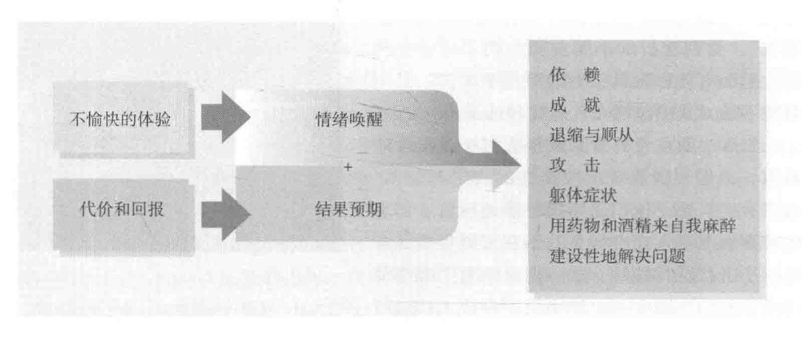
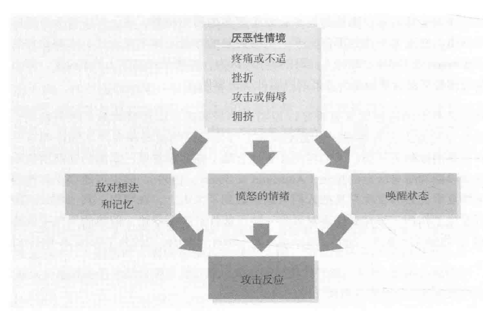
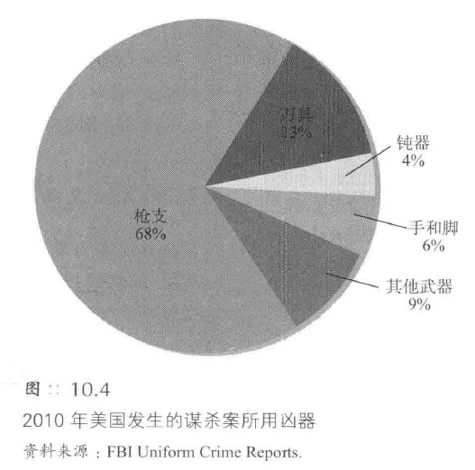
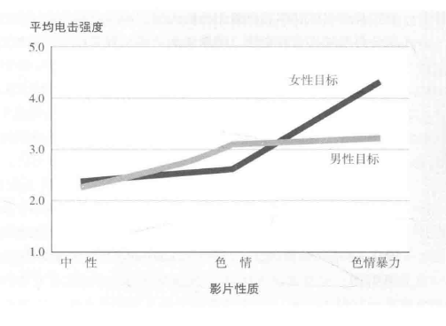
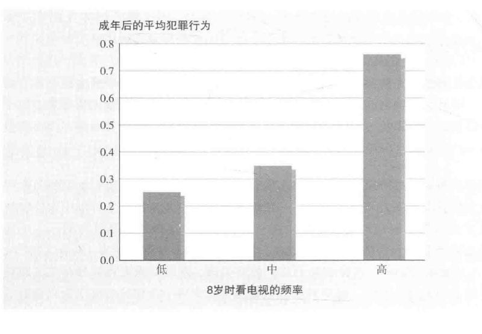
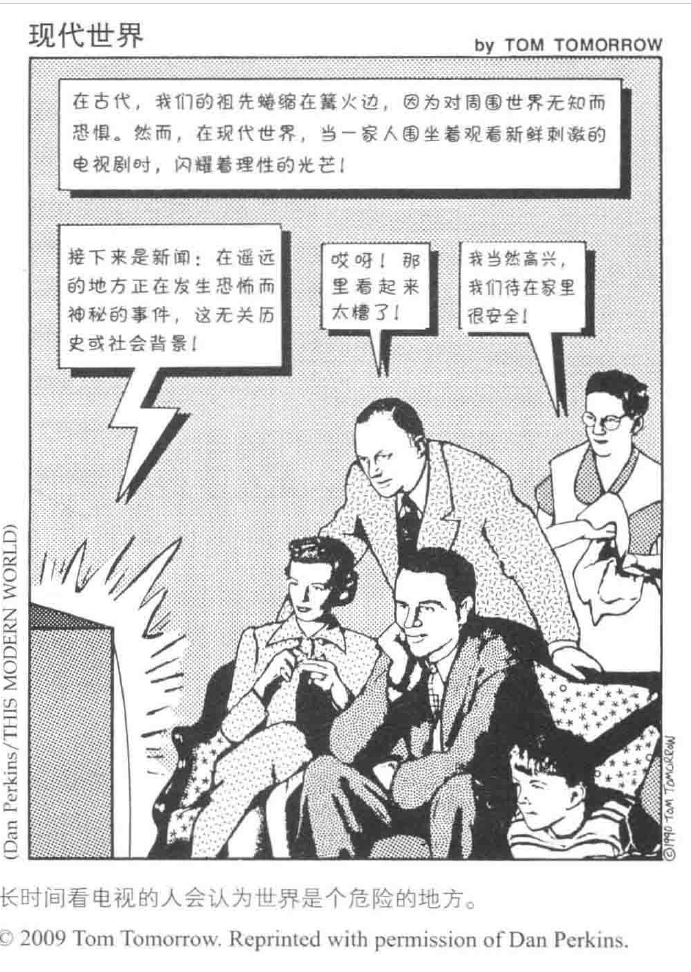

[TOC]
# 攻击：伤害他人
## 攻击的概念
1. **攻击性行为的定义**
   - **攻击**（aggression）被定义为**意图伤害他人**的行为或言语
     - 排除了**无意的伤害**如车祸或碰撞
     - 排除了在帮助他人时**不可避免的疼痛**，如牙科治疗
   - 包括**身体伤害**（如踢、打）和**言语伤害**（如威胁、侮辱）

2. **攻击性行为的类型**
   - 分为**社会性攻击**和**静息攻击**
     - **社会性攻击**：动物在发怒时展示的行为
     - **静息攻击**：掠食者潜行猎物时的行为
   - 人类的攻击行为分为**敌意性**和**工具性**
     - **敌意性攻击**（hostile aggression）：由**愤怒**引起，以伤害为**目的**
     - **工具性攻击**（instrumental aggression）：伤害作为**达到其他目的的手段**

3. **工具性攻击的例子**
   - **恐怖主义**：迫使民主国家从特定领土撤军
     - 恐怖分子通常不是心理异常者，而是寻求个人意义
   - **战争**：攻击伊拉克被视为阻止大规模杀伤性武器的行为
   - **青少年欺负**：显示支配性和更高地位
     - 卑劣和不受欢迎的人有时反而受欢迎和尊敬

4. **敌意性攻击的例子**
   - **谋杀**：通常是因意见不合、恋爱三角关系或酒精影响下的冲动性情感爆发
     - 严厉的死刑惩罚并没有减少杀人案件的发生
   - **团伙谋杀**：在美国禁酒时期，团伙谋杀多为冷静且有计划的

## 攻击的理论
### 攻击的生物学理论
   - **人性争论**
     - 卢梭：**仁慈、知足而高贵**的观点
     - 霍布斯：**残忍本性**的观点
#### 本能论和进化心理学
1. **攻击的生物学理论**
   - **本能理论**
     - **弗洛伊德**的**死本能**理论：攻击把**对死亡原始的强烈欲求**所蕴涵的能量**转向他人**
     - **洛伦兹**的**适应性攻击**观点：攻击更多是适应性的而非自我破坏
   - **本能**（instinct）作为**非习得的普遍特性**
   - 如果得不到释放，这种能量就会**越积越多**，直到**爆发**为止
   - 本能理论的**局限性**
     - 本能太多导致**无意义**
     - **无法解释**个体和文化间攻击性的**多样性**
   - **进化心理学家**的**适应性攻击**观点
         - **男性**攻击行为的适应性
         - 攻击作为**提高生存和繁殖几率的手段**

2. **攻击行为的实例**
   - **查尔斯·巴克利**的酒吧冲突
     - 攻击作为地位和配偶竞争的一部分
   - **青少年期和成年早期**的攻击高峰期
     - 社会地位和配偶竞争的激烈阶段
   - **年轻男性**在酒吧和学校的打斗
     - 地位和配偶竞争导致的暴力行为

#### 神经系统的影响
1. **攻击行为的神经机制**
   - **大脑区域的激活**与攻击行为的关联
     - 激活某些脑区可**增加敌意**
     - 抑制某些脑区可**减少敌意**
   - **实验例证**
     - **动物实验**中的电极激活
     - **人类实验**中的杏仁核电刺激

2. **大脑异常与攻击行为**
   - **暴力倾向**与大脑异常的关系探索
     - 杀人犯的**前额叶活动水平低于**正常人
     - 反社会行为者的**前额叶体积小于**正常人
   - **研究例证**
     - **大脑扫描**研究
     - 杀人犯和死囚的**脑区异常**研究

#### 基因的影响
   - **遗传因素**对攻击性的影响
     - 动物的**攻击倾向驯养**
     - 人类攻击性的**多样性**
   - **气质**与攻击性
     - 气质的**稳定性**与早期表现
     - 气质与**后续行为**的关联：在**幼年**表现出来的气质通常会决定后续的行为
   - **双胞胎研究**
     - 同卵双胞胎的**攻击性一致性**
     - 异卵双胞胎的**攻击性差异**
   - 遗传与**环境**的相互作用
     - 瑞典居民犯罪记录研究
     - 新西兰儿童追踪研究
     - 基因与童年虐待经历的**交互作用**：攻击行为是由一种能够改变神经递质平衡的基因和童年时期的受虐待经历共同决定的

#### 生物化学因索
##### 酒精
   - 酒精增加**攻击行为的可能性**
     - 实验室研究显示喝醉的人施加更强的电击
     - 冲突事件增加，如墨尔本夜间喝酒引发的冲突
   - 酒精与**暴力犯罪**的关联
     - 杀人案件和家庭暴力案件中有**高比例**涉及酒精
     - 犯罪时醉酒状态的人占被捕者的比例较高
   - 酒精对**不同人群**的影响差异
     - **壮硕男性**饮酒后攻击性增强
     - 酒精对**女性和身形较小的男性**影响较小
   - 酒精如何影响行为
     - **降低**自我觉知和考虑后果的能力
     - 使人将模棱两可的行为理解为**挑衅**
##### 睾丸激素
   - 睾丸激素水平与**暴力行为**的关系
     - 降低睾丸激素水平的药物能销削弱攻击性
     - 暴力犯罪率与睾丸激素水平的关联较高
   - 睾激素与行为的**相互作用**
     - 睾丸激素水平高的人更容易出现不良行为
     - **女性**服用睾丸激素后**对阻止攻击的威胁信号适应性降低**
     - 拿着手枪后的**雄性激素水平上升**
   - 睾激素与**外貌特征**的关联
     - **面部宽度**与攻击性的关系：
       - 男性的**睾丸激素**能够增加**面部的宽和长的比率**
       - 实验室中，面部相对较宽的男性表现出**更高的攻击性**
     - 曲棍球运动员面部较宽者更具攻击性
##### 不良饮食对攻击性的影响
   - 饮食与**攻击行为**的关联
     - **营养补充**能降低暴力事件的发生
     - **缺乏重要营养素**可能导致攻击行为
##### 生物学与行为的相互作用
   - 生物学因素与行为的**双向关系**
     - 睾激素与支配欲和攻击性的**相互促进**
       - 胜利与睾丸激素水平的上升关联
       - 失败与睾丸激素水平的下降关联
     - 睾丸激素水平的**社会影响**
       - 体育赛事胜利后球迷的攻击行为增加
### 攻击的挫折-攻击理论（frustration-aggression theory）
- 挫折-攻击理论提出**挫折总会导致攻击行为**
  - **挫折**（frustration）定义为**阻碍实现目标的事物**
  - **强烈动机**遭遇挫折时**攻击性增强**
    - 英国乘客因法国渔船堵塞码头而攻击性增强
- 攻击能量通常**不直接对准挫折源**
  - **社会规范**和**可能的惩罚**导致攻击行为的**转移**（displacement）
    - 被老板羞辱的男人转而斥责家人
- **攻击转移**容易发生在**新目标与挫折源相似且稍有刺激时**
  - 实验中被侮辱的学生对假被试施加更长的刺骨冷水浸泡时间
- 转移的攻击有助于理解日常生活中的**过度反应**
  - 被售货机挫败后可能对室友发怒
- **外群体**成为**攻击的替罪羊**
  - 9·11事件后美国对伊拉克的攻击可能是对外群体的转移攻击
    - 美国人将愤怒转向萨达姆·侯赛因
#### 修正后的挫折一攻击理论
1. **挫折与攻击性的关系**
   - 实验结果显示挫折有时**增加**攻击性，有时**不增加**
     - 如果挫折是**可以理解**的，可能只导致**愤怒**而非攻击
       - **例子**：助听器故障导致的团队问题解决障碍

2. **挫折-攻击理论的修正**
   - 挫折产生**愤怒**，作为攻击的**情绪准备状态**
     - 愤怒源于**目标实现受阻**
   - **攻击线索**可以触发愤怒转化为攻击
     - 例子：攻击线索如**侮辱或威胁**

#### 相对剥夺（relative deprivation）
1. **相对剥夺的概念**
   - **挫折感**来源于**期望与现实的差距**
     - **经济挫折感**在绝对贫困中的人中可能不是最强的
       - 例子：**根本不知道还有其他生活方式**的贫民的经济挫折感不如那些**向往富有生活**的美国中产阶级
     - 挫折感与**比较的对象**有关
       - 例子：工人的幸福感取决于**报酬的公平性**
     - **提高**某一群体待遇可能**降低**另一群体的士气
       - 例子：提高城市警察工资可能降低消防员士气

2. **相对剥夺与社会动态**
   - 相对剥夺感在**贫富差距大的国家和社会**中更常见
     - 例子：东德人民反抗政权，因为他们的生活水平低于西德同胞
   - 相对剥夺的**历史应用**
     - 例子：二战士兵满意度研究中的相对剥夺感
   - 相对剥夺感可能由**媒体描绘的富裕生活**引起
     - 例子：电视普及与城市犯罪率上升的关系

### 攻击的社会学习理论（social learning theory）
- 攻击不仅源自本能和挫折，也可以通过**学习**获得
   - 实验表明**动物和人类**都能学会攻击行为
     - **例子**：实验将温驯动物改造成好斗者
     - **例子**：儿童通过武力胁迫获得所需，增强攻击性
#### 攻击的回报
1. **攻击的回报**
   - 攻击行为通常是为了**获得特定的回报**
     - **体育比赛**中的攻击行为可能带来**得分**
       - **例子**：曲棍球运动员因粗野动作得分
     - **社会和文化背景**可能鼓励攻击行为
       - **例子**：父亲赞同攻击性动作的曲棍球选手表现得更攻击性
     - **经济利益**也可能成为攻击行为的动机
       - **例子**：海盗通过抢劫获得赎金

2. **恐怖主义的社会学习**
   - 恐怖主义活动通过**媒体的放大效应**达到目的
     - 恐怖主义使得**无权无势者获得广泛关注**
       - **例子**：自杀式爆炸袭击的目标是通过媒体观看的人
     - 媒体的关注可能**无意中鼓励了更多的攻击行为**
       - **例子**：恐怖主义如果没有媒体关注可能会减少
     - 社会对攻击行为的反应可能**影响其持续性**
       - **例子**：社会忽视裸体冲入足球场的观众，导致这一现象消失

#### 观察学习
1. **攻击的社会学习理论**
   - 攻击行为可以通过**观察学习**而非仅仅通过亲身体验获得
     - 实验显示**观察他人攻击行为的儿童**更可能**模仿**这些行为
       - **例子**：幼儿园儿童观察成人攻击充气娃娃后模仿攻击

2. **家庭影响**
   - **家庭环境中的攻击性行为模式**对儿童有深远影响
     - **体罚使用者的子女**更可能表现出攻击行为
     - 家庭中的攻击行为往往**代代相传**

3. **文化和社会影响**
   - 社会和文化环境提供了**攻击行为的学习模型**
     - 某些文化背景下攻击行为被视为**男子气概**的表现
       - 崇尚男子汉气概的社会易于将攻击行为**传给下一代**
     - **暴力亚文化**为团体成员提供攻击行为的范例
     - 某些地区的**历史和文化背景**影响了当地人的攻击行为
       - **例子**：美国南部的荣誉文化与更高的攻击性态度和行为有关

4. **攻击行为的触发和预期**
   - 攻击行为的发生不仅取决于攻击性榜样的观察，还受到**激发情绪的体验影响**
     - 挫折、疼痛、受辱等体验**在情绪上唤醒个体**，激发攻击行为
     - 个体是否采取攻击行为取决于**对结果的预期**
       - 当攻击行为看似**安全或有利**时，个体更可能采取攻击行为

## 攻击的影响因素
### 厌恶事件
   - 厌恶事件包括挫折、疼痛、不适的炎热、受攻击和过度拥挤等
   - 这些事件能**激发攻击性**，因为它们引起不快和情绪唤醒
#### 疼痛
   - 疼痛能**增加攻击性**，无论是**物理疼痛**还是**心理疼痛**
   - 实验显示，**动物和人类**在经历疼痛后更可能表现出攻击行为
   - 疼痛不仅限于物理痛苦，**挫折感**也能引发攻击性
#### 炎热
   - 在**实验室**中，炎热能增加攻击性行为，还可以引发**报复行为**
   - 研究表明，在炎热环境中人们**更易表现出攻击性**
     - 天气炎热时，击球手更可能被投手击中
     - 天气炎热时更易出现**暴力犯罪**
   - 也可能存在**其他因素**：可能夏季炎热的夜晚只是把人们从家里赶到了大街上，在那里，其他相关的群体因素发生了作用
#### 攻击
  - 受到攻击或侮辱会引发**报复性攻击**
  - 实验表明，人们倾向于**以牙还牙**，对攻击做出报复性回应

### 唤醒
1. **唤醒状态对情绪的影响**
   - 唤醒状态可以由**多种刺激**引起，如**体育锻炼或性兴奋**
   - 人们对唤醒状态的**解释和分类**决定了它会引发何种情绪
     - 实验示例：**注射肾上腺素**引起的唤醒状态
       - **被告知药物效果**的人**情绪波动小**
       - **未被告知药物效果**的人**受周围人情绪影响大**

2. **唤醒状态与情绪的相互作用**
   - 唤醒状态可以**强化几乎所有情绪**
     - **实验示例**：明亮灯光下的唤醒增强对静电噪声的反感
   - 唤醒状态可能导致**对挑衅的过度反应**
     - **实验示例**：运动后或看完摇滚音乐会的人对挑衅有更强烈的攻击反应

3. **唤醒状态与特定情绪的关联**
   - 性唤醒和愤怒可以**相互增强**
     - **实验示例**：受到惊吓后的人对性刺激的反应更强烈
   - 其他形式的唤醒，如过山车带来的唤醒，可能增强对伴侣的爱意

4. **唤醒状态与攻击性行为的关系**
   - 某些人倾向于**寻求高水平的唤醒状态**，这可能**与攻击性行为相关**
     - **概念示例**：**感觉狂**（sensation seekers）喜欢冒险和持续刺激
   - **挫败、炎热或侮辱性情境**提高唤醒水平，可能促成攻击性行为
     - **结果示例**：高唤醒状态与敌对想法和情绪共同促进攻击性行为

### 攻击线索
1. **攻击线索的影响**
   - **武器**视作暴力工具时，可**触发攻击行为**
     - **实验示例**：玩具枪使儿童更倾向于破坏行为
     - **实验示例**：愤怒的人在武器附近时施加更强烈的电流刺激
   - 武器的存在启动**敌对性想法**和**惩罚性判断**
     - 枪支可**增加**攻击性想法和行为

2. **枪支与暴力犯罪的关联**
   - 枪支的普及与谋杀率**高度相关**
     - **统计数据**：美国私人手枪数量与谋杀率的关系
     - **比较数据**：不同国家的手枪持有情况与谋杀率
   - **限制枪支持有**可**减少**与枪有关的暴力事件
     - 华盛顿特区限枪法案后暴力事件下降
   - **家庭**中枪支的存在**增加**成员遭受暴力的风险
     - 家中有枪的人被杀或自杀的风险更高

3. **枪支与心理距离**
   - 枪支**增加**攻击者与受害者之间的**心理距离**，使攻击行为更易发生
     - 枪击与刀击的**心理距离差异**：刀也可以杀人，但远远地扣动板机要比持刀发动攻击容易得多

### 媒体影响：色情作品和性暴力
1. **色情行业的规模与影响**
   - 规模超过职业橄榄球、篮球和棒球的**总和**
   - 年投资额达**130亿美元**
   - 包括电缆、卫星网络、剧院、收费电影、酒店室内电影、杂志、性服务电话和网站

2. **色情作品的普及性**
   - 在互联网上**易于获得**
   - 调查显示大多数男性**定期观看**色情作品
     - **87%的男性**每月至少观看一次
     - **近半数男性**每周至少观看一次
   - 相比之下，只有**31%的女性**报告曾观看

3. **色情作品对性暴力的描绘**
   - 常见于**租借率高的成人录像带**
   - 典型场景包括**男性强制与女性性交**
     - 女性**最初抵抗**，最终**屈服并表现出愉悦**

4. **色情作品对观念的影响**
   - 可能**歪曲**人们对女性**对性侵犯态度的认识**
   - 可能**增加男性对女性的攻击性**

#### 对性现实的歪曲理解
1. **对性现实的歪曲理解**
   - 强化所谓的“**强暴谬论**”
     - 女性欢迎性骚扰
     - 女性说“不”并非真的意味着“不”
   - 研究表明观看性暴力与接受“强暴谬论”之间**存在关联**

2. **实验研究**
   - 观看性暴力电影的男性**更容易接受对女性施暴**
   - 连续观看性暴力电影的男性**对强奸和砍杀的焦虑降低**
     - 对家庭暴力受害者的**同情心减少**
     - 对受害者受伤害的**程度估计偏低**

3. **媒体对性侵犯的描述**
   - 常将性侵犯描述为**女性最终屈服于男性**
   - 这种描述可能导致人们，包括女性，相信“**许多女人喜欢被征服**”的观念
#### 针对女性的攻击
1. **色情作品与实际攻击行为的关联**
   - 研究表明经常观看色情网站的人**更可能对他人实施身体攻击**
     - 包括**对朋友和恋人的攻击**
     - 在实验室中**对学生表现出更强的攻击性**
   - 使用针扎玩偶代表恋人的实验中，频繁观看者表现出更多攻击行为

2. **色情作品对儿童的影响**
   - 调查显示看过暴力色情内容的**儿童**更可能**实施性侵犯**
     - 即使控制了性别、攻击特质和家庭背景等因素

3. **性罪犯对色情作品的承认**
   - 因网络儿童色情作品被捕的男性**普遍承认对儿童的骚扰**
     - 平均每人**骚扰13名儿童**
   - 强奸犯、连环杀手和儿童性骚扰者报告的色情作品使用率**异常高**
   - 即使**控制**了其他预测反社会行为的变量，色情作品消费量仍是性暴力行为的**预测因子**

4. **实验研究与伦理考量**
   - 实验指定观看不同类型影片的参与者表现出**不同程度的攻击性**
     - 观看强奸影片的男性倾向于给予更强的电击惩罚

   - 实验后进行**矫正教育**，确保参与者了解影片内容的问题
   - 设计巧妙的实验**避免了伦理问题**，如要求**戒除色情作品**的实验

5. **性暴力的社会影响**
   - 全国性调查显示有一定比例的女性曾**被强迫发生性行为**
     - 大多数强奸案**未被报告**

   - 女性在遭遇表现出色情作品宣扬的行为和态度的人时**最容易受到攻击**

#### 媒体意识教育
1. **媒体中的女性形象问题**
   - 媒体中普遍存在对女性的**骚扰、虐待和强迫的画面**
   - 这些内容已被社会**广泛接受**

2. **个人权利与集体权利的权衡**
   - 在西方国家，**个人权利**通常被视为高于集体权利
   - 这影响了**对媒体内容的监管态度**

3. **媒体意识训练的提议**
   - 心理学家倾向于通过**媒体意识训练**来解决问题
   - 旨在教育公众**批判性地**看待色情作品
   - 增强对性骚扰和性暴力问题的**警觉性**

4. **公众意识与媒体变革的历史案例**
   - **美国烟民比例**的显著下降
     - 未禁止香烟的情况下，烟民比例从42%降至19%
   - 媒体中**非裔美国人形象的变化**
     - 未审查种族歧视的情况下，负面形象已大幅减少
   - **公众意识的改变**促使媒体创作者和监制**调整内容**

5. **对未来的展望**
   - 希望将来人们会对今日媒体中的负面内容感到尴尬
   - 期望科学揭示的真理能够促进社会和媒体的进步

### 媒体影响：电视和互联网
1. **电视的普及性**
   - 家庭**普遍拥有电视**，超过电话普及率
   - 多台电视机导致家长和孩子报告的观看内容**存在差异**

2. **电视观看习惯**
   - 电视每天**开机时间**长，**人均观看时间**多
   - 数字视频录像系统使得**观看时间更加灵活**
   - 观看电视的**人群特征**
     - **女性**观看时间多于男性
     - **非白人**多于白人
     - **学龄前儿童和退休人员**多于在校学生和工作者
     - **教育程度低**的人多于教育程度高的人

3. **电视内容的影响**
   - 大量节目**包含暴力内容**
   - 暴力场景中**攻击者往往未受惩罚**
   - 受害者的**痛苦往往未被展现**
   - 儿童节目中**暴力常被娱乐化**
   - 成人节目中**诙谐的暴力**表现似乎减轻了暴力感

4. **电视对儿童的影响**
   - 电视吸引儿童注意力，**影响学业**
   - 儿童在电视上看到的**暴力内容数量巨大**

5. **电视暴力内容的增长**
   - 电视**黄金时间段**的暴力事件数量**增加**
   - 暴力节目的长期统计显示暴力影像**无处不在**

6. **电视与攻击行为的关联研究**
   - 研究旨在探究电视**如何影响观众的行为和思想**
   - 寻找电视对观众的**微妙和普遍影响**

#### 电视对行为的影响
1. **观众模仿电视暴力**
   - 研究表明人们会模仿电视上的犯罪行为
     - 一项调查发现绝大多数判刑罪犯通过观看犯罪节目学习犯罪技巧
     - 有部分罪犯尝试了电视中的犯罪行为

##### 看电视与行为的相关研究
1. **看电视与攻击性行为的相关性研究**
   - 暴力内容的观看与攻击性行为之间存在**相关性**
     - 儿童观看的暴力内容越多，攻击性越高
     - 这种相关性在不同国家和地区都有发现
   - 英国女孩观看含有**社会排斥内容**的节目后，表现出**更多类似行为**

2. **因果关系的探讨**
   - 相关研究可能存在**反方向因果关系或第三变量问题**
     - 攻击性强的儿童可能偏好暴力节目
     - **潜在变量**如低智商可能同时导致喜欢暴力节目和攻击行为

3. **排除潜在变量影响的研究**
   - 研究者通过统计方法**控制潜在变量**
     - 一项研究发现看暴力电视的儿童更易表现出暴力行为
     - 另一项研究发现儿童时期观看暴力电视能预测成年时的攻击性

4. **后续研究的证实**
   - **不同方法**的研究支持观看暴力电视与后期攻击行为的相关性
     - 观看暴力电视与成年期**虐待配偶**的可能性相关
     - 青春期观看暴力电视与成年期**暴力行为**相关
     - 小学生观看暴力节目多，后期**打架次数**增多

5. **网络暴力的影响**
   - **网络**提供了**更多样化的暴力内容选择**
     - 暴力视频、图片和敌对群体网站等
   - 网络暴力行为的**制造和传播**
     - 通过电子邮件、即时消息或社交网站恐吓他人
   - 网上观看暴力或仇恨内容的青少年**更可能参与暴力行为**

6. **实验方法的应用**
   - 实验方法可以**控制无关因素**
     - 随机选择儿童观看暴力或非暴力电影
     - 观察两组儿童之后的攻击行为差异，以确定因果关系

##### 看电视的实验研究
1. **早期实验研究**
   - 幼儿观看**成人攻击充气娃娃**的影响
     - 观看与亲眼见证**产生相似效果**
   - 大学生**观看暴力影片**后的攻击性增加
     - 愤怒的学生看暴力电影后比看非暴力电影的更具攻击性

2. **社会关注与研究增加**
   - 美国医事总署批准**新的研究项目**
     - 20世纪70年代初，50项新研究项目启动
   - 后续研究证实**观看暴力导致攻击性增加**
     - 包括美国和比利时对少年犯的研究

3. **实验结果的一致性**
   - 观看暴力电影导致攻击性增加
     - 观看后身体袭击数量增加
   - 美国心理学会青年暴力委员会的**结论**
     - 观看暴力节目导致暴力增加，尤其对有攻击倾向的人

4. **媒体影响攻击的证据**
   - 媒体影响攻击的证据被认为是**压倒性**的
     - 国家心理健康研究所的项目中，研究者**一致认为**观看媒体中的暴力增加攻击行为和暴力行为的可能性
##### 为什么看电视会影响行为
1. **为什么看电视会影响行为**
   - 研究者探索观看暴力节目影响行为的原因
     - **唤醒状态**可能导致社会暴力行为
     - 观看暴力**降低抑制**，激活与暴力关联的想法
     - 媒体内容引起**模仿行为**

2. **电视的模仿效应**
   - 商业电视的广告**引导消费者模仿**
     - 电视节目中**攻击行为的比例远超爱抚行为**
   - 电视塑造了一个**不真实的世界**
     - 如果电视塑造的行为导致模仿，对**亲社会行为**（prosocial behavior）的塑造可能对社会有利

#### 电视对思维的影响
##### 脱敏作用
   - **情绪反应的减弱**
     - 重复观看暴力内容导致对残忍行为的**情绪麻痹**
     - 常看暴力节目的人**对暴力反应减少**
   - **实验研究**
     - 观看暴力电影后对现实困境的反应迟钝
     - 比较观看暴力与非暴力影片的人在帮助他人时的反应差异

##### 社会脚本（social scripts）
   - **社会脚本**：文化提供的**关于如何行为的心理指导**
     - 电视提供了**处理各种情境的心理指导**
   - **影响青少年**
     - **动作影片**影响青少年处理冲突的方式
     - **性内容**影响青少年对性关系的态度和行为

##### 改变知觉
   - 电视与现实世界观念的**混淆**
     - 频繁观看电视的人**对暴力的预期和恐惧增加**
   - **研究发现**
     - 成年人和儿童对周围世界的暴力频率有**夸大的观念**
     - 暴力节目后的观众感到**更脆弱**

##### 认知启动 
   - 暴力内容**激活攻击性概念**
     - 暴力节目后的人们**对行为的解释更加敌意**
     - 对**攻击性词语的识别**更快

##### 消耗时间
   - 电视**占用大量时间**
     - 看电视减少了参与其他活动的时间
   - **社会影响**
     - 电视观看时间的增加与市民**参与活动的减少**相关联

### 媒体影响：电子游戏
1. **电子游戏的普及与教育作用**
   - 电子游戏作为**流行娱乐**
     - 暴力内容的**增加**
   - 教育工具的**双刃剑**
     - 健康游戏**教授有益技能**
     - 暴力游戏可能**教授暴力行为**

2. **儿童与青少年的游戏习惯**
   - **广泛参与**
     - **高比例**的青少年玩电子游戏
   - **暴力游戏的流行**
     - 第一人称射击游戏和动作游戏的**普及**
   - **游戏对年龄的影响**
     - 即使标有**成人标志**，暴力游戏仍**被未成年人购买和玩耍**

3. **游戏内容的影响**
   - 暴力游戏的**具体内容**
     - 描述《**侠盗猎车手：圣安地列斯**》中的**暴力和性内容**
   - **游戏的现实性**
     - 3D画面**增强了游戏体验的逼真感**

### 电子游戏对儿童的影响
1. **暴力电子游戏与攻击性行为的关联**
   - **模仿行为**：青少年可能会模仿屏幕上的暴力恐怖游戏行为
   - **挪威案例**：《**魔兽世界**》玩家的暴力行为引发了对暴力游戏的担忧
   - **支持者观点**：暴力游戏被认为是**无害的**，没有证据显示它们导致攻击行为
   - **反对者观点**：暴力游戏比观看暴力电视**更可能诱发**攻击性行为，因为玩家积极参与暴力行为的模拟

2. **研究证据**
   - **大量研究**：表明玩暴力电子游戏**会增加攻击性行为和思维**
   - **研究一致性**：不同地区和研究设计**得出的结论一致**，排除了有攻击性的人更喜欢玩攻击游戏的可能性
   - **纵向研究**：预测**未来的攻击行为**，而不是未来的游戏行为

3. **暴力电子游戏的影响**
   - **行为影响**：玩家在现实生活中可能会**更加具有攻击性**
   - **思维影响**：玩家可能会发展**攻击性思维**
   - **情绪影响**：玩家可能会体验更多的**攻击性情绪**
   - **社交影响**：玩家可能会减少**对他人的帮助和同理心**

4. **社会和法律反应**
   - **法律挑战**：加州法案试图禁止向未成年人销售暴力游戏，但被最高法院撤销
   - **学术争议**：尽管有研究支持暴力游戏的负面影响，但也有研究者提出反对意见

5. **暴力游戏的替代品和积极效应**
   - **亲社会游戏**：显示出在现实生活中增加帮助、分享和合作行为
   - **教育游戏**：可以教授阅读和数学等技能

6. **家庭和教育的角色**
   - **家长责任**：应关注孩子接触的媒体，确保其健康成长
   - **教育干预**：学校应进行媒体意识教育

### 群体影响
1. **群体与个体攻击性**
   - **挫折、侮辱和攻击性榜样**增强攻击倾向
   - 群体中的攻击行为**迅速蔓延**，如骚乱和抢劫

2. **责任扩散**
   - 群体中**个体责任感减弱**
   - 实验表明建议者**感觉不到对伤害的直接责任**
   - **责任扩散**随**距离和人数增多**而增强

3. **群体暴力的实例**
   - **私刑案件**分析：暴民越多，行为越残酷
   - 青少年团伙、足球球迷等群体行为中的**攻击倾向放大**

4. **群体同一性与攻击行为**
   - 共同反社会倾向的年轻人在帮派中**找到同一性**
   - 群体同一性发展导致**服从压力和去个体化增加**
   - **团伙成员的行为**：确定地盘、挑战对手、有时犯罪

5. **大屠杀作为群体现象**
   - 大屠杀是**社会现象**，非个体行为集合
   - 需要**广泛支持、组织和参与**
   - 例子包括卢旺达大屠杀和对欧洲犹太人的屠杀

6. **实验室研究与现实世界**
   - 实验室研究显示群体**可以强化攻击倾向**
   - 实验室研究与日常生活中的攻击行为有**高度一致性**
   - **攻击增强的因素**包括性别、匿名性、个性、酗酒、武器存在、观看暴力和群体互动

7. **心理学研究的循环影响**
   - 理论由**日常生活经验激发**
   - 实验室研究**深化理**解并**应用于实际问题**
   - 实验室与现实社会的**相互作用**增进心理学对人类福祉的贡献

## 减少攻击行为
### 宣泄假说成立吗
1. **宣泄假说的探讨**
   - 宣泄假说认为通过**发泄**可以减少愤怒
     - 亚里士多德提出通过**体验情绪**来摆脱它们
     - 现代应用包括回忆、重新体验往事、表达情绪和各种行动
   - 临床医学家和群体领导鼓励通过攻击行为**疏导受压抑的攻击能量**
     - 例如使用泡沫塑料球棒互相痛打或用网球拍打被子
   - 普通民众**普遍接受宣泄假说**
     - 但研究显示宣泄**可能导致更多的攻击性行为**

2. **宣泄假说的效果质疑**
   - 观看色情作品**并未减少性冲动**
     - 研究显示色情作品**可能增加**性冲动和性行为
   - 实验表明**宣泄可能增加攻击性**
     - 例如足球、摔跤和曲棍球比赛观众的敌意增加
   - 实验室检验显示宣泄**并不减少愤怒**
     - 击打沙袋的实验表明宣泄可能增加攻击性

3. **宣泄假说的替代方法**
   - 生闷气**不是更好的解决方式**
     - 它可能导致**心中不平和反复念叨**
   - **分散注意力**可以减轻愤怒
     - 例如写作文或转移注意力
   - **非攻击性表达感受**的重要性
     - 通过“我”信息表达感受，如“我很愤怒”或“你的行为让我不愉快”

### 社会学习法
1. **社会学习法的基本原理**
   - 攻击行为是**习得的**，因此可以通过**改变学习环境**来控制
   - **避免**给人们**错误或不可达到的预期**，以减少厌恶体验和敌意性攻击
   - 通过**奖励合作性非攻击行为**，影响工具性攻击

2. **实验和研究发现**
   - 忽略攻击行为，**强化非攻击性行为**，可降低儿童攻击性
   - **惩罚**攻击者**效果不稳定**，需严厉、及时、确定，且结合奖励期待行为
   - 大多数致命攻击是**一时冲动**，重点惩治**难以预防**
   - 犯罪行为多为一时冲动，增加惩罚效果有限，**治安整顿更有效**

3. **预防措施与教育**
   - 教授解决问题技巧、情绪控制策略和冲突解决方法，**降低校园暴力**
   - 体罚产生**消极作用**，应避免以暴力为榜样
   - 通过训练家长使用**非暴力教育方式**，强化期待行为，积极表达观点
   - “**替代攻击项目**”通过教授交流技巧和道德推理，降低青少年再犯率

4. **媒体影响与对策**
   - **减少**电影和电视中的暴力描写，教育儿童**抵制媒体暴力**
   - **电视网络**改变节目内容，减少攻击性描写
   - 通过**音乐**示范正确态度，减少攻击行为

5. **文化变迁与未来展望**
   - **文化可以改变**，历史上的暴力行为并非不可改变的命运
   - **科学和社会进步**有助于理解和控制人类攻击性
   - 通过**教育和社会改革**，逐步实现更和平的社会环境

### 文化改变和世界暴力
1. **文化变迁的可能性**
   - 历史例子：北欧海盗的后裔在**瑞典**近200年未参与战争
   - 文明程度提高：几个世纪以来，**各种形式的暴力减少**

2. **暴力形式的减少**
   - 战争：从每年两次战争到**近70年零战争**
   - 谋杀：现代英国**谋杀率**比中世纪低50倍
   - 种族灭绝和大规模杀戮：**显著减少**

3. **文明制度和启蒙运动的作用**
   - **经济贸易**：促进国家间经济相互依存，减少战争动机
   - **教育**：提高公民意识，减少无知和偏见导致的暴力
   - **政府监管和司法**：有效制止非法暴力行为

4. **社会态度和法律的进步**
   - **死刑**：除美国外，西方民主国家**废除死刑**
   - **私刑和仇视犯罪**：减少
   - **强奸、体罚和反同性恋态度**：减少或消失